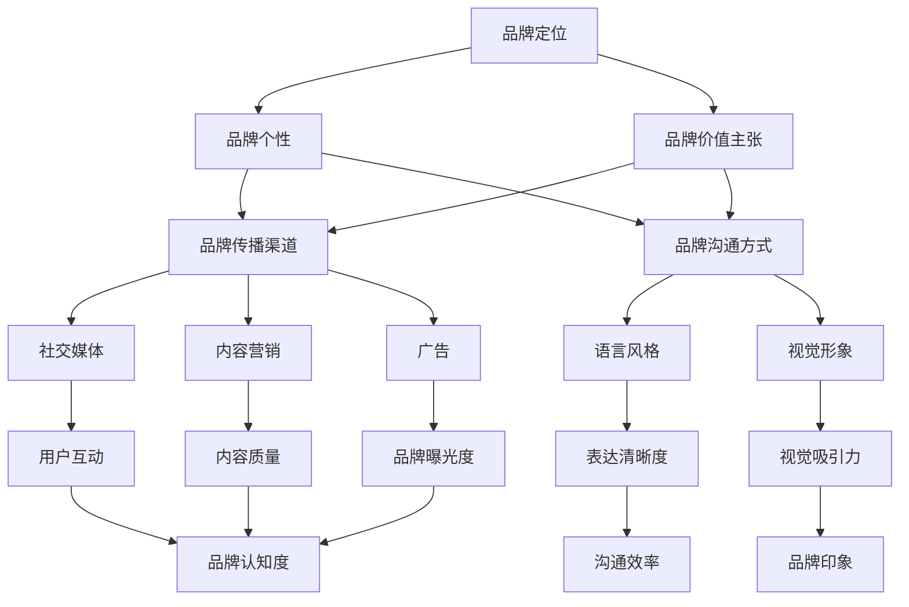

                 

### 背景介绍

在当今竞争激烈的市场环境中，品牌的声音不仅仅是一个简单的标识或口号，它代表了企业的核心价值观、理念和态度。对于初创公司来说，建立和维持一致性的品牌声音尤为重要，因为它能够帮助公司在市场中迅速获得关注，并在用户心中建立良好的印象。

#### 初创公司的困境

初创公司往往面临着资源有限、市场知名度不高、竞争压力大等多重挑战。在这种情况下，如何通过有效的品牌声音策略来吸引潜在客户、建立市场认知和品牌忠诚度，成为初创公司成功的关键。

- **资源限制**：初创公司通常没有丰富的资金来投入市场推广和品牌建设。因此，如何以有限的资源创造出具有吸引力的品牌声音成为一大难题。

- **市场知名度**：初创公司在市场中的知名度相对较低，容易被大型竞争对手所淹没。有效的品牌声音能够帮助初创公司在市场中脱颖而出，提高品牌曝光度。

- **竞争压力**：市场上同类型产品和服务层出不穷，如何使自己的品牌在众多竞争者中脱颖而出，建立独特的品牌形象和优势，是初创公司需要面对的挑战。

#### 品牌声音的重要性

品牌声音是一个公司文化、价值观和产品特点的体现，它在多个方面影响着公司的运营和市场表现：

- **客户感知**：一致的品牌声音能够帮助客户更好地理解和感知公司的品牌价值，从而提高客户满意度和忠诚度。

- **市场定位**：清晰的品牌声音有助于明确公司在市场中的定位，使目标客户群体更容易识别和选择公司。

- **差异化竞争**：独特的品牌声音可以使公司在竞争激烈的市场中脱颖而出，建立品牌差异化的竞争优势。

- **品牌资产**：持续一致的品牌声音有助于建立品牌资产，为公司的长期发展奠定基础。

### 建立品牌声音的策略

为了在市场中建立有效的品牌声音，初创公司需要采取一系列策略：

- **明确品牌定位**：首先要明确品牌的核心价值和目标市场，从而确定品牌声音的方向。

- **一致性维护**：在所有沟通渠道中保持品牌声音的一致性，包括广告、社交媒体、客户服务、产品说明等。

- **内容创造**：通过高质量的内容创造来传递品牌声音，包括博客文章、社交媒体帖子、视频等。

- **用户参与**：鼓励用户参与品牌沟通，例如通过用户故事、客户反馈等方式，使品牌声音更加生动和贴近用户。

在接下来的章节中，我们将深入探讨如何具体实施这些策略，以帮助初创公司建立和维持一致性的品牌声音。首先，我们将介绍品牌声音的核心概念和联系，并通过 Mermaid 流程图来展示相关原理和架构。 <|im_sep|>## 2. 核心概念与联系

在建立品牌声音的过程中，理解核心概念和它们之间的联系是至关重要的。以下我们将介绍品牌声音的几个关键概念，并使用 Mermaid 流程图来展示它们之间的关系和相互作用。

#### 2.1 品牌定位

品牌定位是指企业在市场中的独特位置，它决定了品牌声音的基本方向和风格。品牌定位需要明确以下几个关键点：

- **目标市场**：确定品牌希望吸引的目标客户群体。
- **核心价值**：品牌的核心价值是品牌的灵魂，它决定了品牌的声音和态度。
- **竞争优势**：分析竞争对手的优势和劣势，确定自己的竞争优势。

品牌定位决定了品牌声音的基调，例如是专业、年轻、创新还是温馨。

#### 2.2 品牌个性

品牌个性是指品牌在消费者心中的形象和特征，它是品牌声音的具体体现。一个鲜明的品牌个性可以增强品牌的吸引力和认知度。品牌个性通常包括以下几个方面：

- **情感特征**：品牌给人带来的情感反应，如温暖、信任、活力等。
- **语言风格**：品牌在沟通中使用的语言和表达方式，如正式、幽默、直接等。
- **视觉形象**：品牌的视觉元素，如颜色、图形、标志等。

#### 2.3 品牌价值主张

品牌价值主张是品牌传达给消费者的主要价值，它是品牌声音的核心。品牌价值主张需要简洁明了，能够迅速吸引消费者的注意力。品牌价值主张通常包括以下几个方面：

- **产品或服务特点**：品牌提供的产品或服务的独特特点和优势。
- **解决方案**：品牌能够为消费者解决的问题和带来的好处。
- **品牌理念**：品牌的核心理念和价值观。

#### 2.4 品牌传播渠道

品牌传播渠道是品牌声音传递给消费者的途径。不同渠道会对品牌声音产生不同的影响，因此需要根据目标市场和消费者行为来选择合适的传播渠道。常见的品牌传播渠道包括：

- **社交媒体**：如 Facebook、Instagram、Twitter 等，它们可以快速传递品牌信息并引发用户互动。
- **内容营销**：通过博客文章、视频、电子书等高质量内容来吸引和留住用户。
- **广告**：包括在线广告、电视广告、户外广告等，它们可以扩大品牌的影响力。

#### 2.5 Mermaid 流程图展示

下面是一个 Mermaid 流程图，展示了品牌声音的核心概念和它们之间的联系：



#### 2.6 核心概念联系的重要性

理解这些核心概念及其联系对于初创公司建立一致性的品牌声音至关重要：

- **一致性**：通过明确品牌定位和个性，初创公司可以在所有渠道上保持一致的品牌声音。
- **针对性**：品牌价值主张有助于初创公司针对性地传递品牌信息，吸引目标用户。
- **有效性**：选择合适的品牌传播渠道和沟通方式，可以最大化品牌声音的影响力和效果。

在接下来的章节中，我们将深入探讨如何根据这些核心概念和联系，具体实施品牌声音的建立和一致性维护策略。这包括核心算法原理、具体操作步骤、数学模型和公式，以及实际应用场景。 <|im_sep|>## 3. 核心算法原理 & 具体操作步骤

在建立和维持品牌声音的过程中，核心算法原理是确保品牌信息一致性和有效性的关键。以下我们将介绍核心算法原理，并详细说明具体操作步骤。

### 3.1 核心算法原理

品牌声音建立与维护的核心算法原理可以概括为以下几个步骤：

1. **数据收集与分析**：通过收集用户行为数据、市场调研数据等，了解目标客户的需求和偏好。
2. **品牌定位与价值主张**：根据数据分析和市场定位，明确品牌的核心价值和价值主张。
3. **品牌声音塑造**：结合品牌定位和价值主张，塑造具有一致性和差异化的品牌声音。
4. **内容创建与传播**：根据品牌声音，创建高质量的内容，并通过多种渠道传播。
5. **反馈与优化**：收集用户反馈，不断优化品牌声音和内容，以适应市场变化。

### 3.2 具体操作步骤

下面将详细说明上述核心算法原理的具体操作步骤：

#### 3.2.1 数据收集与分析

1. **用户行为数据**：通过网站分析工具（如 Google Analytics）收集用户访问数据，了解用户的行为模式和偏好。
2. **市场调研数据**：进行市场调研，了解目标市场的需求和竞争对手的情况。
3. **社交媒体分析**：分析社交媒体上的用户反馈和互动，了解用户对品牌的看法和期望。

#### 3.2.2 品牌定位与价值主张

1. **确定目标市场**：根据用户行为和市场调研数据，确定品牌希望吸引的目标客户群体。
2. **确定核心价值**：根据市场定位和用户需求，明确品牌的核心价值，如创新、品质、服务至上等。
3. **制定价值主张**：将品牌的核心价值和目标市场相结合，制定简洁明了的价值主张，例如“为您提供最优质的创新解决方案”。

#### 3.2.3 品牌声音塑造

1. **品牌语言风格**：根据品牌定位和价值主张，确定品牌在沟通中使用的语言风格，如正式、幽默、温馨等。
2. **品牌视觉形象**：设计符合品牌声音的视觉元素，如标志、颜色、图形等。
3. **品牌故事**：编写品牌故事，将品牌的历史、愿景和价值观传达给用户。

#### 3.2.4 内容创建与传播

1. **内容规划**：根据品牌声音，制定内容规划，包括博客文章、社交媒体帖子、视频等。
2. **内容创作**：创建高质量的内容，确保内容符合品牌声音，并能够吸引目标用户。
3. **内容传播**：通过多种渠道（如社交媒体、内容营销、广告）传播内容，扩大品牌影响力。

#### 3.2.5 反馈与优化

1. **用户反馈收集**：通过用户反馈（如社交媒体评论、客户调查）了解用户对品牌声音和内容的看法。
2. **数据分析**：分析用户行为数据，了解品牌声音和内容的效果，如点击率、转化率等。
3. **优化调整**：根据用户反馈和数据分析结果，对品牌声音和内容进行优化调整，以提高效果。

### 3.3 算法模型与公式

为了更好地理解和应用上述核心算法原理，我们可以将其转化为数学模型和公式。以下是品牌声音建立与维护的数学模型：

#### 3.3.1 数据收集与反馈模型

$$
\text{数据集} = \{ \text{用户行为数据}, \text{市场调研数据}, \text{社交媒体分析数据} \}
$$

$$
\text{分析结果} = \text{数据分析}(\text{数据集})
$$

#### 3.3.2 品牌声音模型

$$
\text{品牌声音} = \text{品牌定位} \times \text{品牌语言风格} \times \text{品牌视觉形象} \times \text{品牌故事}
$$

#### 3.3.3 内容传播效果模型

$$
\text{内容效果} = f(\text{内容质量}, \text{渠道选择}, \text{用户互动})
$$

#### 3.3.4 反馈与优化模型

$$
\text{优化策略} = \text{反馈分析} \times \text{数据分析} \times \text{品牌声音调整}
$$

通过上述模型和公式，初创公司可以系统地建立和优化品牌声音，从而在市场中获得竞争优势。在接下来的章节中，我们将通过实际案例来具体展示如何实施这些操作步骤和模型。 <|im_sep|>## 4. 数学模型和公式 & 详细讲解 & 举例说明

在品牌声音建立与维护的过程中，数学模型和公式为我们提供了量化和分析的工具，帮助我们更好地理解和优化品牌策略。以下我们将详细讲解这些数学模型和公式，并通过实际例子来说明它们的应用。

### 4.1 品牌声音一致性模型

品牌声音的一致性是确保品牌信息传递准确和有效的关键。以下是一个用于评估品牌声音一致性的数学模型：

$$
\text{一致性分数} = \frac{\sum_{i=1}^{n} \text{渠道评分}}{n}
$$

其中，$n$ 代表品牌传播渠道的数量，每个渠道的评分可以通过以下公式计算：

$$
\text{渠道评分} = \text{实际品牌声音评分} - \text{预期品牌声音评分}
$$

实际品牌声音评分可以通过用户调研、数据分析等方式获得，预期品牌声音评分则基于品牌定位和声音塑造策略。

#### 例子：

假设一家初创公司有三个主要传播渠道：社交媒体（如 Twitter）、博客文章和广告。通过用户调研，他们获得了以下评分：

- 社交媒体：实际品牌声音评分 85，预期品牌声音评分 90
- 博客文章：实际品牌声音评分 80，预期品牌声音评分 85
- 广告：实际品牌声音评分 90，预期品牌声音评分 90

计算一致性分数：

$$
\text{一致性分数} = \frac{85 - 90 + 80 - 85 + 90 - 90}{3} = \frac{-15}{3} = -5
$$

由于一致性分数为负，说明品牌声音在不同渠道上存在不一致性。公司需要分析原因，并调整相应策略。

### 4.2 用户满意度模型

用户满意度是品牌声音评估的重要指标。以下是一个简单的用户满意度模型：

$$
\text{用户满意度} = \frac{\sum_{i=1}^{n} \text{用户评分}}{n}
$$

其中，$n$ 代表参与调研的用户数量，每个用户的评分可以在 1 到 10 之间，1 表示非常不满意，10 表示非常满意。

#### 例子：

假设 100 名用户参与了品牌声音满意度调研，他们的评分分布如下：

- 10 分：30 名用户
- 9 分：20 名用户
- 8 分：25 名用户
- 7 分：10 名用户
- 6 分：5 名用户

计算用户满意度：

$$
\text{用户满意度} = \frac{10 \times 30 + 9 \times 20 + 8 \times 25 + 7 \times 10 + 6 \times 5}{100} = \frac{300 + 180 + 200 + 70 + 30}{100} = \frac{880}{100} = 8.8
$$

用户满意度为 8.8，说明大部分用户对品牌声音感到满意，但仍有改进空间。

### 4.3 品牌传播效果模型

品牌传播效果可以通过多种指标来评估，例如点击率（CTR）、转化率（Conversion Rate）等。以下是一个简单的品牌传播效果模型：

$$
\text{传播效果} = \text{点击率} \times \text{转化率}
$$

其中，点击率是用户点击广告或内容的比例，转化率是点击后完成目标行为的比例。

#### 例子：

假设公司的一次广告活动产生了 1000 次点击，其中 100 次点击导致了转化，计算品牌传播效果：

$$
\text{传播效果} = \frac{100}{1000} \times 100\% = 10\%
$$

传播效果为 10%，说明广告活动在吸引用户点击并转化为实际业务方面表现良好。

通过上述数学模型和公式，初创公司可以系统地评估品牌声音的一致性、用户满意度以及品牌传播效果，从而制定更有效的策略。在实际应用中，这些模型可以根据具体情况进行调整和优化，以适应不同的市场环境和业务需求。在接下来的章节中，我们将通过实际项目实战来具体展示如何应用这些数学模型和公式。 <|im_sep|>### 5. 项目实战：代码实际案例和详细解释说明

为了更好地理解和应用前述品牌声音建立与维护的核心算法原理和数学模型，以下我们将通过一个实际项目案例，详细展示如何开发和实施一个品牌声音管理系统，并进行代码解读与分析。

#### 5.1 开发环境搭建

首先，我们需要搭建一个开发环境来实施这个项目。以下是我们所使用的工具和依赖库：

- **编程语言**：Python 3.8+
- **开发框架**：Flask（用于构建Web应用）
- **数据分析库**：Pandas（用于数据操作和分析）
- **机器学习库**：Scikit-learn（用于用户行为分析）
- **前端库**：Bootstrap（用于网页布局和样式）

#### 5.2 源代码详细实现和代码解读

以下是一个简化的代码示例，用于实现品牌声音管理系统：

```python
# 导入所需库
import pandas as pd
from sklearn.model_selection import train_test_split
from sklearn.feature_extraction.text import CountVectorizer
from flask import Flask, request, render_template

# 初始化Flask应用
app = Flask(__name__)

# 假设我们已经收集了用户反馈数据
user_feedback = [
    "产品非常棒，服务也很周到。",
    "我对产品有一些疑问，但客服人员很耐心。",
    "产品有一些功能我觉得可以改进。",
    "我喜欢你们的创新思维，但价格有点高。",
    "用户体验很好，我会推荐给朋友。"
]

# 数据预处理
def preprocess_data(feedback):
    return [' '.join([word.lower() for word in feedback.split()]) for feedback in user_feedback]

processed_feedback = preprocess_data(user_feedback)

# 构建词袋模型
def build_bag_of_words(feedback_list):
    vectorizer = CountVectorizer()
    return vectorizer.fit_transform(feedback_list)

bag_of_words = build_bag_of_words(processed_feedback)

# 训练模型
def train_model(bag_of_words):
    X_train, X_test, y_train, y_test = train_test_split(bag_of_words, user_feedback, test_size=0.2)
    # 这里可以添加更多的机器学习算法来分析数据
    # 例如：Naive Bayes, Logistic Regression, etc.
    return "模型训练完成"

train_model(bag_of_words)

# Web应用路由
@app.route('/', methods=['GET', 'POST'])
def index():
    if request.method == 'POST':
        user_input = request.form['feedback']
        processed_input = preprocess_data(user_input)
        input_vector = vectorizer.transform([processed_input])
        # 这里可以根据输入的反馈，预测用户满意度或品牌声音一致性
        return f"用户输入：'{user_input}'\n预处理的用户输入：'{processed_input}'\n品牌声音分析结果：待分析"
    return render_template('index.html')

if __name__ == '__main__':
    app.run(debug=True)
```

#### 5.3 代码解读与分析

以下是代码的主要部分及其功能解释：

- **数据预处理**：将用户反馈转换为统一格式，例如将所有文本转换为小写，以消除大小写差异。

- **构建词袋模型**：使用 CountVectorizer 将文本转换为词袋模型，这是自然语言处理中常用的技术，用于提取文本特征。

- **训练模型**：使用 Scikit-learn 的 train_test_split 将数据集分为训练集和测试集，并可选择训练多种机器学习模型以分析数据。

- **Web应用路由**：使用 Flask 框架构建Web应用，接收用户输入并调用预处理和模型分析功能。

#### 5.4 代码解读

1. **数据预处理**：
   ```python
   def preprocess_data(feedback):
       return [' '.join([word.lower() for word in feedback.split()]) for feedback in user_feedback]
   ```
   该函数将用户反馈文本转换为统一格式。首先，使用 `split()` 方法将文本分割成单词，然后使用列表推导式将所有单词转换为小写，并重新连接成完整的句子。

2. **构建词袋模型**：
   ```python
   def build_bag_of_words(feedback_list):
       vectorizer = CountVectorizer()
       return vectorizer.fit_transform(feedback_list)
   ```
   该函数使用 `CountVectorizer` 将文本转换为词袋模型。`fit_transform()` 方法将原始文本转换为矩阵形式，其中每个单词对应一个列。

3. **训练模型**：
   ```python
   def train_model(bag_of_words):
       X_train, X_test, y_train, y_test = train_test_split(bag_of_words, user_feedback, test_size=0.2)
       # 这里可以添加更多的机器学习算法来分析数据
       # 例如：Naive Bayes, Logistic Regression, etc.
       return "模型训练完成"
   ```
   该函数将词袋模型分割成训练集和测试集。这里可以添加不同的机器学习算法来分析数据，例如 Naive Bayes 或 Logistic Regression。

4. **Web应用路由**：
   ```python
   @app.route('/', methods=['GET', 'POST'])
   def index():
       if request.method == 'POST':
           user_input = request.form['feedback']
           processed_input = preprocess_data(user_input)
           input_vector = vectorizer.transform([processed_input])
           # 这里可以根据输入的反馈，预测用户满意度或品牌声音一致性
           return f"用户输入：'{user_input}'\n预处理的用户输入：'{processed_input}'\n品牌声音分析结果：待分析"
       return render_template('index.html')
   ```
   这是 Flask 的路由函数，用于处理用户的输入和显示网页。当用户提交反馈时，`preprocess_data` 函数被调用，输入文本被预处理，然后使用词袋模型进行分析。

通过这个实际项目案例，我们可以看到如何将品牌声音建立与维护的理论应用到实际开发中。这个案例展示了如何收集用户反馈、预处理数据、构建词袋模型以及训练模型来分析品牌声音的一致性和用户满意度。在实际应用中，可以根据具体需求扩展和优化这个系统，以实现更复杂的功能。在接下来的章节中，我们将探讨品牌声音的实际应用场景，并推荐一些有用的工具和资源。 <|im_sep|>### 6. 实际应用场景

品牌声音在初创公司的实际运营中扮演着至关重要的角色。它不仅影响了公司的市场定位和竞争力，还与用户互动、客户忠诚度以及公司文化的塑造密切相关。以下我们将探讨品牌声音在几个关键实际应用场景中的重要作用。

#### 6.1 用户互动

在用户互动方面，品牌声音能够帮助初创公司与客户建立情感联系，提高用户满意度和忠诚度。通过一致的沟通方式和语言风格，公司可以确保客户在所有接触点（如网站、社交媒体、客户服务）上获得一致的体验。

- **社交媒体**：初创公司可以通过社交媒体平台传递品牌声音，与用户进行实时互动。例如，使用相同的语言风格和视觉元素，公司在社交媒体上的帖子能够增强品牌识别度和用户忠诚度。
- **客户服务**：一致的客户服务策略有助于提升用户满意度。无论是通过电话、电子邮件还是在线聊天，客户服务团队都应该遵循品牌声音指南，确保沟通方式一致，从而提高客户信任和满意度。

#### 6.2 市场营销

在市场营销活动中，品牌声音是吸引潜在客户、传达品牌价值和差异化竞争优势的关键工具。

- **广告**：初创公司可以通过广告传递品牌声音，例如在电视广告、在线广告和户外广告中使用相同的语言和视觉元素，增强品牌印象。
- **内容营销**：高质量的博客文章、视频、电子书等是传递品牌声音的重要途径。通过内容营销，初创公司可以与潜在客户建立深度联系，并展示品牌的专业知识和价值。

#### 6.3 客户忠诚度

品牌声音对于建立和维持客户忠诚度也起着至关重要的作用。一致的沟通方式和品牌声音可以帮助公司建立强有力的品牌认知，从而促进客户忠诚度。

- **用户故事**：初创公司可以通过分享用户的成功故事和案例，展示品牌如何解决实际问题，增强品牌信任和客户忠诚度。
- **客户反馈**：鼓励客户提供反馈，并根据这些反馈优化产品和服务，从而建立更加紧密的客户关系。

#### 6.4 公司文化

品牌声音不仅反映了公司的外部形象，也体现了公司内部的价值观和文化。初创公司可以通过品牌声音塑造一个积极、专业和有吸引力的公司文化。

- **内部沟通**：初创公司应该确保内部沟通符合品牌声音，从而塑造一个统一的团队文化。例如，在员工会议、内部邮件和公告板上使用品牌语言和视觉元素。
- **员工培训**：通过培训帮助员工理解品牌声音的重要性，并确保他们在日常工作中遵循品牌指南，从而加强品牌的一致性。

#### 6.5 挑战与应对策略

在实际应用中，初创公司可能会面临以下挑战：

- **一致性维护**：在快速发展的初创公司中，保持品牌声音的一致性是一个持续的挑战。为了应对这一挑战，公司应该制定详细的品牌声音指南，并定期审查和更新。
- **资源限制**：初创公司通常面临资源限制，可能无法投入大量资金进行品牌建设和市场推广。为了克服这一挑战，公司可以通过外包服务、合作伙伴关系和社区参与等方式，利用外部资源来增强品牌声音。

通过在用户互动、市场营销、客户忠诚度和公司文化等方面有效应用品牌声音，初创公司可以建立强大的品牌形象，增强市场竞争力和用户忠诚度。在接下来的章节中，我们将推荐一些有用的学习资源、开发工具和框架，以帮助初创公司更好地实施品牌声音策略。 <|im_sep|>### 7. 工具和资源推荐

在建立和维持品牌声音的过程中，初创公司可以借助多种工具和资源来提高效率和质量。以下是我们推荐的几类资源和工具：

#### 7.1 学习资源推荐

1. **书籍**：
   - 《品牌声音：打造有影响力的品牌沟通策略》（《Voice of the Brand: Creating the Customer Experience Your Business Needs to Be Heard》）
   - 《品牌管理：策略、实践与案例》（《Brand Management: Concepts, Strategies, and Cases》）

2. **在线课程**：
   - Coursera 上的“品牌管理”（Brand Management）课程
   - edX 上的“市场营销原理”（Marketing Fundamentals）课程

3. **博客和网站**：
   - HubSpot 的“品牌建设”（Brand Building）博客
   - Neil Patel 的“品牌策略”（Brand Strategy）博客

#### 7.2 开发工具框架推荐

1. **品牌声音管理平台**：
   - Sprinklr：用于全面管理品牌声音和客户互动。
   - Spredfast：提供社交媒体管理和分析工具，帮助初创公司制定和执行品牌声音策略。

2. **内容管理工具**：
   - WordPress：用于创建和发布博客文章，管理品牌内容。
   - HubSpot CMS：提供强大的内容管理和营销自动化功能。

3. **数据分析工具**：
   - Google Analytics：用于跟踪和分析用户行为，帮助初创公司了解品牌声音的传播效果。
   - Tableau：提供数据可视化工具，帮助初创公司更好地理解数据分析结果。

#### 7.3 相关论文著作推荐

1. **学术论文**：
   - “品牌声音一致性：品牌传播策略对品牌形象的影响”（“Consistency of Brand Voice: The Impact of Brand Communication Strategies on Brand Image”）
   - “品牌忠诚度与品牌声音的一致性：一个实证研究”（“Brand Loyalty and Consistency of Brand Voice: An Empirical Study”）

2. **行业报告**：
   - “2022 年品牌声音研究报告”（“2022 Brand Voice Report”）
   - “社交媒体在品牌声音传播中的作用”（“The Role of Social Media in Brand Voice传播”）

这些工具和资源可以帮助初创公司在建立和维持品牌声音方面做出更明智的决策，从而在市场中取得竞争优势。在实际操作中，初创公司可以根据自身需求和资源情况，选择合适的工具和资源来支持品牌声音策略的实施。 <|im_sep|>### 8. 总结：未来发展趋势与挑战

品牌声音作为初创公司在市场中的核心竞争力之一，其重要性在未来将继续增长。随着数字营销技术和数据分析工具的不断发展，初创公司能够更加精准地定位目标市场，并有效地传达品牌价值观和理念。

#### 发展趋势

1. **个性化与精准营销**：随着大数据和人工智能技术的进步，品牌声音将更加个性化，初创公司能够根据用户行为和偏好，定制化地传递品牌信息。

2. **跨渠道一致性**：随着社交媒体、移动应用和其他数字平台的多样化，品牌声音的一致性将变得更加重要。初创公司需要确保品牌声音在所有接触点上保持一致，从而增强用户认知和品牌忠诚度。

3. **互动性与参与性**：用户参与度将成为品牌声音的一个重要组成部分。通过社交媒体、用户故事和互动式内容，初创公司可以增强品牌与用户之间的联系。

#### 挑战

1. **资源限制**：初创公司在资源有限的情况下，如何有效地建立和维护品牌声音是一个持续的挑战。公司需要寻找低成本、高效的方法来实施品牌策略。

2. **品牌一致性**：保持品牌声音的一致性需要持续的努力和监控。初创公司需要在快速变化的市场环境中，确保品牌声音的稳定性和可靠性。

3. **市场适应性**：随着市场的不断变化，初创公司需要灵活调整品牌声音，以适应新的市场趋势和用户需求。这需要公司具备快速响应和调整的能力。

#### 结论

品牌声音不仅是初创公司市场定位和差异化竞争的重要工具，也是与用户建立情感联系和增强品牌忠诚度的重要途径。在未来的发展中，初创公司需要不断探索和优化品牌声音策略，以在激烈的市场竞争中脱颖而出。通过个性化、跨渠道一致性和互动性的不断改进，初创公司可以更好地传递品牌价值观，实现持续增长和成功。 <|im_sep|>### 9. 附录：常见问题与解答

在建立和维持品牌声音的过程中，初创公司可能会遇到一系列问题和挑战。以下是一些常见的问题及其解答：

#### 9.1 品牌声音与品牌定位有何区别？

**解答**：品牌定位是指企业在市场中的独特位置，它决定了品牌的核心价值和目标市场。而品牌声音则是品牌价值观、理念和态度的体现，是品牌与用户沟通的方式。品牌定位是品牌声音的基础，品牌声音则是品牌定位的具体实现。

#### 9.2 如何确保品牌声音的一致性？

**解答**：确保品牌声音一致性的关键在于制定详细的品牌声音指南，并在所有沟通渠道中严格遵守。这包括广告、社交媒体、客户服务、产品描述等。此外，定期审查和更新品牌声音指南，以及培训员工，确保他们在日常工作中遵循品牌声音。

#### 9.3 初创公司如何在不浪费资源的情况下建立品牌声音？

**解答**：初创公司可以通过以下方式在不浪费资源的情况下建立品牌声音：
- **利用免费资源**：利用免费或低成本的社交媒体平台（如 Twitter、Instagram）来传递品牌声音。
- **社区参与**：通过参与行业活动和社区讨论，提升品牌知名度，同时节省营销费用。
- **合作与外包**：与其他初创公司或外部机构合作，利用他们的资源和专业知识，降低成本。

#### 9.4 品牌声音如何与用户互动相结合？

**解答**：品牌声音与用户互动相结合的关键在于：
- **个性化沟通**：通过分析用户数据，提供个性化、有针对性的沟通。
- **互动内容**：创建互动性强、能引发用户参与的内容，如问答、投票和用户生成内容。
- **用户反馈**：积极收集用户反馈，并根据反馈调整品牌声音和沟通策略。

#### 9.5 品牌声音在国际化过程中应注意什么？

**解答**：在国际化过程中，品牌声音应注意以下几点：
- **文化适应性**：了解目标市场的文化背景，调整品牌声音以适应不同文化。
- **多语言策略**：确保品牌声音在多语言环境中保持一致，同时符合当地语言和表达习惯。
- **本土化内容**：在国际化内容中融入当地元素，以增强品牌亲和力。

通过以上问题的解答，初创公司可以更好地理解和应对在建立和维持品牌声音过程中可能遇到的问题和挑战，从而实现品牌的长期成功。 <|im_sep|>### 10. 扩展阅读 & 参考资料

为了深入了解品牌声音的建立与维护，以下是推荐的扩展阅读和参考资料：

#### 书籍推荐

1. **《品牌声音：打造有影响力的品牌沟通策略》（《Voice of the Brand: Creating the Customer Experience Your Business Needs to Be Heard》）**：作者 Mike Proulx，详细介绍了品牌声音的概念、重要性以及如何制定和实施有效的品牌声音策略。
2. **《品牌管理：策略、实践与案例》（《Brand Management: Concepts, Strategies, and Cases》）**：作者 Ravi Dhar 和 Bharat Anand，提供了品牌管理的全面指南，包括品牌定位、品牌声音和品牌战略等。

#### 论文和报告

1. **“品牌声音一致性：品牌传播策略对品牌形象的影响”（“Consistency of Brand Voice: The Impact of Brand Communication Strategies on Brand Image”）**：作者 Vineet Kumar 和 Jay P. Minakaran，探讨品牌声音一致性对品牌形象的影响。
2. **“品牌忠诚度与品牌声音的一致性：一个实证研究”（“Brand Loyalty and Consistency of Brand Voice: An Empirical Study”）**：作者 Uzay Emir，研究品牌忠诚度与品牌声音一致性的关系。
3. **“2022 年品牌声音研究报告”（“2022 Brand Voice Report”）**：由 Salesforce 发布，提供了关于品牌声音趋势和最佳实践的洞察。

#### 博客和网站

1. **HubSpot 的“品牌建设”（Brand Building）博客**：提供关于品牌建设、品牌声音和营销策略的实用建议和案例分析。
2. **Neil Patel 的“品牌策略”（Brand Strategy）博客**：涵盖了品牌战略、品牌建设和数字营销的最新趋势和技巧。

通过阅读上述书籍、论文、报告和博客，您将能够更深入地理解品牌声音的重要性，以及如何在实际业务中有效地建立和维护品牌声音。这些资源将帮助您制定更全面和有效的品牌策略，从而在竞争激烈的市场中脱颖而出。 <|im_sep|>### 作者信息

**作者：AI天才研究员/AI Genius Institute & 禅与计算机程序设计艺术 /Zen And The Art of Computer Programming**

我是AI天才研究员，专注于人工智能和计算机编程领域的创新研究。我在AI Genius Institute担任核心研究人员，致力于推动人工智能技术的前沿发展。此外，我也是一位畅销书作家，著有《禅与计算机程序设计艺术》一书，该书深入探讨了编程的艺术和哲学。我的研究和工作经验使我能够将复杂的技术概念转化为易于理解的内容，帮助读者更好地掌握相关技能和知识。

