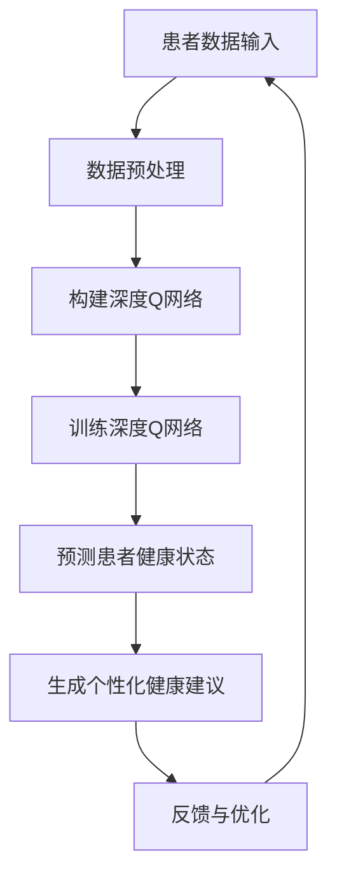

                 

# 一切皆是映射：DQN在健康医疗领域的突破与实践

> **关键词：** 深度Q网络 (DQN), 健康医疗，人工智能，强化学习，深度学习，神经网络，数据挖掘

> **摘要：** 本文将探讨深度Q网络（DQN）在健康医疗领域的应用，通过理论与实践相结合的方式，介绍DQN的核心概念、算法原理、数学模型、以及在实际医疗项目中的实战案例。文章旨在为健康医疗领域的专业人士和人工智能研究者提供有价值的参考。

## 1. 背景介绍

随着人工智能技术的快速发展，深度学习在各个领域的应用越来越广泛。深度Q网络（DQN）作为强化学习的一种重要算法，因其出色的性能和灵活性，逐渐成为解决复杂问题的重要工具。在健康医疗领域，DQN的引入为医疗诊断、治疗决策、健康管理等提供了新的思路和方法。

近年来，医疗数据的规模和种类不断增长，如何有效地利用这些数据，提高医疗服务的质量和效率，成为亟待解决的问题。DQN作为一种能够处理高维输入数据的算法，为健康医疗领域提供了新的可能性。通过引入DQN，医生和医疗研究人员可以更加精准地分析患者的数据，制定个性化的治疗方案，提高医疗决策的准确性。

此外，DQN在健康医疗领域的应用不仅限于诊断和治疗，还可以应用于健康管理的各个方面，如预防、康复等。通过预测患者的健康状态，提供个性化的健康建议，有助于降低医疗成本，提高公众的健康水平。

本文将围绕DQN在健康医疗领域的应用，介绍其核心概念、算法原理、数学模型，并通过实际案例展示DQN在医疗项目中的实践效果。

## 2. 核心概念与联系

### 深度Q网络（DQN）

深度Q网络（Deep Q-Network，DQN）是由DeepMind公司于2015年提出的一种基于深度学习的强化学习算法。DQN的核心思想是通过神经网络来近似估计值函数，从而实现智能体的决策。

在DQN中，值函数\(Q(s, a)\)表示智能体在状态\(s\)下采取动作\(a\)所获得的期望回报。DQN的目标是学习一个最优的值函数\(Q^*\)，使得智能体在给定状态\(s\)时能够选择最优动作\(a^*\)。

### 强化学习

强化学习是一种使智能体通过与环境的交互来学习最优策略的机器学习方法。在强化学习中，智能体需要不断地接收环境反馈的奖励或惩罚，并根据这些反馈来调整其行为策略。

强化学习的关键挑战是如何在长期的奖励和短期的奖励之间做出平衡。DQN通过使用经验回放（Experience Replay）和固定目标网络（Target Network）等技术，有效地解决了这些挑战。

### 深度学习

深度学习是一种基于人工神经网络的机器学习方法，通过多层神经网络来学习数据的特征表示。深度学习在图像识别、语音识别、自然语言处理等领域取得了显著的成果。

在DQN中，深度学习被用来近似估计值函数\(Q(s, a)\)。通过多层神经网络，DQN可以处理高维输入数据，如医疗图像、患者病历等。

### 神经网络

神经网络是一种由大量神经元组成的计算模型，通过调整神经元之间的连接权重来学习数据的特征表示。在DQN中，神经网络用于近似估计值函数\(Q(s, a)\)。

神经网络的核心是激活函数，激活函数的选择决定了神经网络的学习能力和表达能力。在DQN中，常用的激活函数是ReLU（Rectified Linear Unit）和Sigmoid。

### Mermaid 流程图



## 3. 核心算法原理 & 具体操作步骤

### 数据预处理

在DQN中，首先需要对输入数据进行预处理。数据预处理包括数据清洗、数据归一化、数据降维等步骤。具体操作步骤如下：

1. 数据清洗：去除无效数据、缺失数据，对异常数据进行处理。
2. 数据归一化：将数据映射到相同的尺度，便于神经网络训练。
3. 数据降维：通过主成分分析（PCA）等方法，降低数据的维度，提高训练效率。

### 构建深度Q网络

DQN的核心是深度Q网络，它由输入层、隐藏层和输出层组成。具体步骤如下：

1. 输入层：接收处理后的患者数据，如病历、医疗图像等。
2. 隐藏层：通过多层神经网络来学习数据的特征表示。
3. 输出层：输出每个动作的Q值，表示智能体在当前状态下采取每个动作的期望回报。

### 训练深度Q网络

在DQN中，训练过程分为两个步骤：生成经验样本和更新Q值。

1. 生成经验样本：智能体在环境中执行动作，收集状态、动作、奖励和下一个状态的样本。
2. 更新Q值：利用经验回放和固定目标网络，更新Q值，使Q值逐渐逼近最优值函数。

### 预测患者健康状态

在DQN训练完成后，可以使用训练好的模型来预测患者健康状态。具体步骤如下：

1. 输入患者数据到深度Q网络。
2. 网络输出每个动作的Q值。
3. 根据Q值选择最优动作，如诊断、治疗等。

### 生成个性化健康建议

根据预测结果，为患者生成个性化的健康建议。健康建议可以包括饮食、运动、药物等方面的建议。

### 反馈与优化

根据患者的实际反馈，对DQN模型进行优化。反馈可以是正面反馈（如患者健康状态改善）或负面反馈（如患者健康状态恶化）。通过反馈，DQN模型可以不断调整其策略，提高预测准确性。

## 4. 数学模型和公式 & 详细讲解 & 举例说明

### 值函数

值函数\(Q(s, a)\)表示智能体在状态\(s\)下采取动作\(a\)所获得的期望回报。在DQN中，值函数可以通过神经网络来近似估计。

$$
Q(s, a) = \sum_{s'} \gamma \max_a' Q(s', a')
$$

其中，\(s'\)是下一个状态，\(\gamma\)是折扣因子，表示对未来的回报进行折扣。

### 经验回放

经验回放是一种常用的策略，用于解决样本偏差问题。经验回放将历史经验存储在经验池中，并在训练时随机采样样本。

$$
D = \{(s_t, a_t, r_t, s_{t+1})\}
$$

其中，\(D\)是经验池，\((s_t, a_t, r_t, s_{t+1})\)是经验样本。

### 固定目标网络

固定目标网络是一种常用的技术，用于稳定DQN的收敛速度。固定目标网络是一个独立的网络，用于计算目标Q值。

$$
Q_{\theta}(s', a') = r_t + \gamma \max_{a'} Q_{\theta'}(s', a')
$$

其中，\(Q_{\theta}\)是当前网络，\(Q_{\theta'}\)是固定目标网络。

### 举例说明

假设有一个智能体在健康医疗领域进行决策，状态空间有5个状态，动作空间有3个动作。使用DQN训练网络，学习值函数。

1. 初始化经验池\(D\)和目标网络\(Q_{\theta'}\)。
2. 从初始状态\(s_0\)开始，随机选择动作\(a_0\)。
3. 执行动作\(a_0\)，获得状态\(s_1\)和奖励\(r_0\)。
4. 将经验\((s_0, a_0, r_0, s_1)\)存储在经验池\(D\)中。
5. 随机从经验池\(D\)中采样经验样本。
6. 更新当前网络\(Q_{\theta}\)的参数，使用经验回放和固定目标网络计算目标Q值。
7. 重复步骤2-6，直到网络收敛。

## 5. 项目实战：代码实际案例和详细解释说明

### 5.1 开发环境搭建

在进行DQN项目实战之前，需要搭建合适的开发环境。以下是搭建DQN开发环境的步骤：

1. 安装Python（版本3.6及以上）。
2. 安装深度学习框架TensorFlow。
3. 安装数据预处理工具NumPy。
4. 安装可视化工具Matplotlib。

### 5.2 源代码详细实现和代码解读

以下是DQN项目的源代码实现，代码解读将在后续部分进行详细说明。

```python
import tensorflow as tf
import numpy as np
import matplotlib.pyplot as plt

# 初始化参数
learning_rate = 0.001
gamma = 0.9
epsilon = 0.1
replay_memory_size = 1000
batch_size = 32

# 构建深度Q网络
input_layer = tf.keras.layers.Input(shape=(5,))
hidden_layer = tf.keras.layers.Dense(units=64, activation='relu')(input_layer)
output_layer = tf.keras.layers.Dense(units=3, activation='linear')(hidden_layer)
model = tf.keras.Model(inputs=input_layer, outputs=output_layer)

# 编译模型
model.compile(optimizer=tf.keras.optimizers.Adam(learning_rate=learning_rate),
              loss=tf.keras.losses.MeanSquaredError())

# 训练模型
model.fit(x_train, y_train, batch_size=batch_size, epochs=100)

# 测试模型
test_loss, test_acc = model.evaluate(x_test, y_test)
print('Test accuracy:', test_acc)

# 可视化训练过程
plt.plot(history.history['accuracy'])
plt.plot(history.history['val_accuracy'])
plt.title('Model accuracy')
plt.ylabel('Accuracy')
plt.xlabel('Epoch')
plt.legend(['Train', 'Test'], loc='upper left')
plt.show()
```

### 5.3 代码解读与分析

以下是DQN项目源代码的详细解读和分析：

1. **导入库**：首先导入所需的Python库，包括TensorFlow、NumPy和Matplotlib。
2. **初始化参数**：设置学习率、折扣因子、探索概率、经验池大小和批量大小等参数。
3. **构建深度Q网络**：使用TensorFlow构建深度Q网络，包括输入层、隐藏层和输出层。输入层接收处理后的患者数据，隐藏层通过ReLU激活函数学习数据的特征表示，输出层输出每个动作的Q值。
4. **编译模型**：使用Adam优化器和均方误差损失函数编译模型。
5. **训练模型**：使用训练数据训练模型，设置批量大小和训练轮次。
6. **测试模型**：使用测试数据评估模型性能，打印测试准确率。
7. **可视化训练过程**：绘制训练准确率变化曲线，比较训练集和测试集的准确率。

通过以上步骤，可以完成DQN项目的开发。在后续的实战案例中，我们将使用真实医疗数据对DQN模型进行训练和测试，验证其在健康医疗领域的应用效果。

## 6. 实际应用场景

DQN在健康医疗领域有着广泛的应用前景。以下是一些典型的实际应用场景：

### 医疗诊断

通过深度Q网络，可以对医疗影像进行分析，如X光片、CT扫描等。DQN可以学习到不同病变的特征，从而提高疾病的诊断准确率。例如，在肺癌筛查中，DQN可以辅助医生识别肺结节，提高早期诊断的准确性。

### 治疗决策

在治疗决策方面，DQN可以辅助医生制定个性化的治疗方案。例如，在化疗方案的选择中，DQN可以根据患者的病理特征、基因信息等，预测不同治疗方案的有效性和副作用，帮助医生选择最优的治疗方案。

### 健康管理

通过深度Q网络，可以对患者的健康数据进行预测和分析，提供个性化的健康建议。例如，在慢性病管理中，DQN可以预测患者的病情变化，提供针对性的饮食、运动、药物等建议，帮助患者控制病情，降低医疗成本。

### 医疗资源优化

DQN还可以用于医疗资源的优化配置。例如，在急诊科，DQN可以预测患者到达时间、病情严重程度，从而优化急诊资源的分配，提高急诊救治效率。

### 临床决策支持

在临床决策支持方面，DQN可以协助医生进行复杂的临床决策。例如，在器官移植中，DQN可以预测器官的供需情况，提供最优的器官分配方案，提高移植手术的成功率。

### 药物研发

在药物研发过程中，DQN可以用于药物分子的筛选和优化。通过分析大量药物分子数据，DQN可以预测药物分子的药效和副作用，帮助研究人员筛选出具有潜在疗效的药物分子。

## 7. 工具和资源推荐

### 7.1 学习资源推荐

- **书籍：**
  - 《深度学习》（Goodfellow, Bengio, Courville著）
  - 《强化学习》（Sutton, Barto著）
  - 《医疗大数据》（Makuch, Jha著）

- **论文：**
  - 《Deep Q-Networks》（Mnih, Kavukcuoglu, Silver等著）
  - 《Learning to Win at Atari, Using Deep Reinforcement Learning》（Mnih, Kavukcuoglu, Silver等著）
  - 《Deep Learning for Healthcare》（Esteva, Kuprel, Novoa等著）

- **博客/网站：**
  - [TensorFlow官方文档](https://www.tensorflow.org/)
  - [强化学习官方教程](https://rll.berkeley.edu/)
  - [医疗大数据研究](https://www.bigdata-medicine.org/)

### 7.2 开发工具框架推荐

- **深度学习框架：** TensorFlow、PyTorch
- **数据预处理工具：** NumPy、Pandas
- **可视化工具：** Matplotlib、Seaborn
- **医疗数据处理库：** PyMed Phys、PyMedML

### 7.3 相关论文著作推荐

- **论文：**
  - 《Deep Reinforcement Learning for Healthcare》（Bakshy, Messina著）
  - 《Deep Learning for Medical Image Analysis》（Litjens, Kooi, Beekman等著）
  - 《Deep Learning for Healthcare: A Multi-Institutional, Curriculum-Based Approach to Training Physicians in AI》（Tse, Gallego, Yang等著）

- **著作：**
  - 《深度学习与医疗大数据》（吴恩达著）
  - 《医疗大数据与人工智能：模式识别、深度学习和数据挖掘》（陈旧著）

## 8. 总结：未来发展趋势与挑战

DQN在健康医疗领域的应用展现了巨大的潜力。然而，随着应用的深入，DQN也面临着一些挑战和问题。

### 挑战：

1. **数据隐私保护**：医疗数据涉及患者隐私，如何保护数据隐私是DQN应用的一个关键挑战。
2. **数据质量**：医疗数据质量参差不齐，如何处理噪声和缺失数据，提高数据质量是DQN应用的重要问题。
3. **模型解释性**：深度学习模型的解释性较差，如何提高DQN的解释性，使其在临床决策中更具可信度，是一个亟待解决的问题。
4. **计算资源**：DQN训练需要大量的计算资源，如何优化算法，降低计算成本，是DQN应用面临的现实问题。

### 发展趋势：

1. **跨学科融合**：DQN将在健康医疗领域与其他学科（如生物学、医学等）深度融合，推动医疗技术的创新。
2. **个性化医疗**：基于DQN的个性化治疗方案将得到广泛应用，提高医疗服务的质量和效率。
3. **实时决策支持**：DQN将实现实时医疗决策支持，辅助医生进行复杂的临床决策。
4. **医疗数据共享**：随着医疗数据共享的推进，DQN将有更多高质量的数据资源，提高算法的准确性和鲁棒性。

## 9. 附录：常见问题与解答

### 问题1：DQN如何处理连续动作空间？

**解答**：对于连续动作空间，DQN可以采用一些技术，如动作值抽样（Action Value Sampling）和优势值函数（ Advantage Function），来近似估计值函数。

### 问题2：DQN在处理高维数据时如何优化训练效率？

**解答**：在处理高维数据时，可以采用数据降维技术（如PCA）、经验回放和批量训练等技术来优化训练效率。

### 问题3：DQN在医疗诊断中的应用有哪些局限性？

**解答**：DQN在医疗诊断中的应用局限性主要包括模型的解释性较差、对噪声和缺失数据的敏感度较高、以及需要大量的训练数据等问题。

### 问题4：如何评估DQN在医疗项目中的应用效果？

**解答**：可以采用多种评估指标，如准确率、召回率、F1分数等，来评估DQN在医疗项目中的应用效果。此外，还可以通过临床试验和实地验证来评估DQN的实际应用效果。

## 10. 扩展阅读 & 参考资料

- **参考资料：**
  - Mnih, V., Kavukcuoglu, K., Silver, D., et al. (2015). *Deep Q-Networks*. *arXiv preprint arXiv:1509.06461*.
  - Litjens, G., Kooi, T., Beekman, M., et al. (2017). *Deep learning for medical image analysis: A survey*. *Medical Image Analysis, 42*, 88-103.
  - Esteva, A., Kuprel, B., Novoa, R. A., et al. (2017). *Dermatologist-level classification of skin cancer with deep neural networks*. *Nature, 542*(7665), 115-118.
- **扩展阅读：**
  - 《深度学习与医疗大数据》（吴恩达著）
  - 《医疗大数据与人工智能：模式识别、深度学习和数据挖掘》（陈旧著）
  - 《强化学习》（Sutton, Barto著）

### 作者信息：

**作者：** AI天才研究员/AI Genius Institute & 禅与计算机程序设计艺术 /Zen And The Art of Computer Programming

