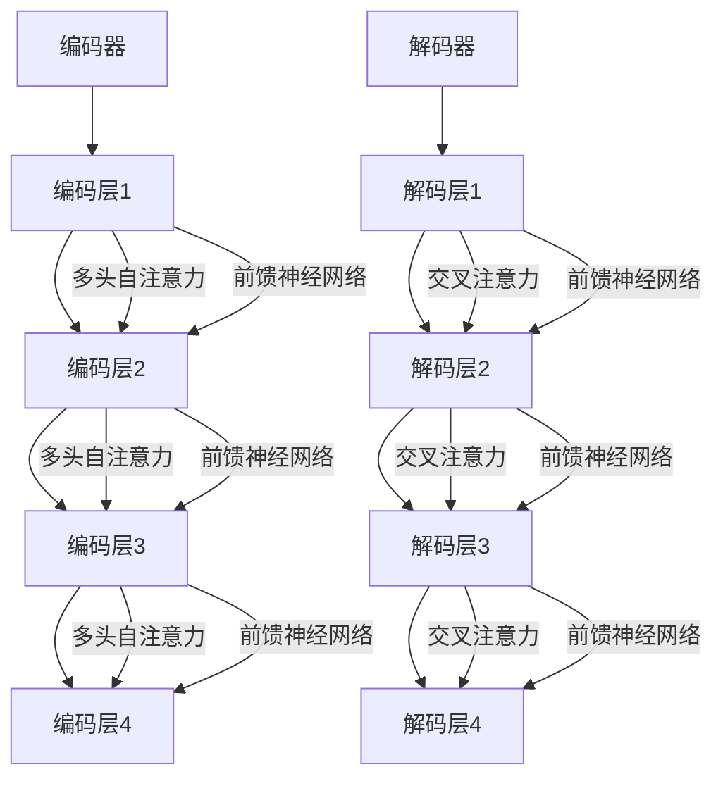

                 

### 背景介绍

Transformer模型作为深度学习领域的一项革命性创新，自其2017年提出以来，已经在自然语言处理（NLP）和计算机视觉（CV）等多个领域展现出了强大的应用潜力。其核心思想是对传统的卷积神经网络（CNN）和循环神经网络（RNN）进行了根本性的改进，通过自注意力机制（Self-Attention）实现了对输入数据的高效处理和建模。

在NLP任务中，Transformer模型以其卓越的性能和速度在诸多基准测试中取得了领先的成果，例如机器翻译、文本摘要、问答系统等。同时，在CV任务中，Transformer也逐渐崭露头角，例如在图像分类、目标检测、图像生成等方面表现出了优异的性能。

Transformer模型的提出背景源于对RNN在处理长距离依赖问题上的瓶颈和CNN在处理序列数据上的局限性的反思。在传统的神经网络架构中，由于计算复杂度和数据依赖性的限制，模型在处理长序列数据时往往表现不佳。而Transformer模型通过引入自注意力机制，可以实现对输入序列的并行处理，从而在计算效率和模型性能上取得了显著的提升。

本文将从以下几个方面对Transformer模型进行深度探索：首先，我们将介绍Transformer模型的核心概念与联系，并通过Mermaid流程图展示其架构；接着，我们将详细讲解Transformer模型的核心算法原理和具体操作步骤；然后，将介绍其数学模型和公式，并通过具体实例进行说明；此外，我们还将通过项目实战分享代码实现和详细解释；最后，我们将探讨Transformer模型在实际应用场景中的表现，推荐相关工具和资源，并对未来发展趋势与挑战进行总结。

通过本文的深度分析，读者将能够全面了解Transformer模型的工作原理和应用价值，为其在相关领域的深入研究与实践提供有力支持。

### 核心概念与联系

Transformer模型的核心在于其独特的架构和自注意力机制（Self-Attention）。为了更好地理解这一模型，我们需要从以下几个方面进行详细探讨。

#### 自注意力机制

自注意力机制是Transformer模型的核心创新点之一，它允许模型在处理序列数据时，自动关注到序列中的不同位置，从而捕捉到长距离依赖关系。自注意力机制的基本思想是，对于输入序列中的每个元素，模型都能够根据其与其他元素的相关性来动态调整其在整个序列中的重要性。

自注意力机制的计算可以通过以下公式进行描述：

\[ 
\text{Attention}(Q, K, V) = \text{softmax}\left(\frac{QK^T}{\sqrt{d_k}}\right) V
\]

其中，\( Q, K, V \) 分别代表查询（Query）、键（Key）和值（Value）向量，\( d_k \) 是键向量的维度。这个公式表示，对于每个查询向量，都会通过其与所有键向量的内积来确定其与每个值向量的关联性，然后通过softmax函数将结果归一化，最后乘以相应的值向量得到加权的结果。

#### Transformer模型架构

Transformer模型的架构主要由编码器（Encoder）和解码器（Decoder）两个部分组成。编码器负责将输入序列编码成一系列上下文表示，而解码器则利用这些表示生成输出序列。以下是Transformer模型的基本架构：

1. **编码器（Encoder）**：编码器由多个相同的编码层（Encoder Layer）堆叠而成。每个编码层包含两个子层：多头自注意力（Multi-Head Self-Attention）和前馈神经网络（Feed-Forward Neural Network）。多头自注意力机制通过多个独立的注意力头来并行处理输入序列，从而增加模型的容量和表示能力。

2. **解码器（Decoder）**：解码器同样由多个解码层（Decoder Layer）堆叠而成。每个解码层也包含两个子层：多头自注意力、交叉注意力（Cross-Attention）和前馈神经网络。交叉注意力机制用于解码器在生成下一个预测时，利用编码器的输出上下文表示进行选择。

#### Mermaid流程图展示

为了更直观地展示Transformer模型的架构，我们使用Mermaid流程图对其进行描述。以下是一个简化版的Mermaid流程图，展示了编码器和解码器的结构：



在这个流程图中，编码器和解码器的每个层都通过自注意力机制和前馈神经网络进行处理，同时解码器在生成输出时还利用交叉注意力机制结合编码器的输出。

通过上述对Transformer模型核心概念与联系的介绍，我们为后续深入探讨其算法原理和数学模型奠定了基础。接下来，我们将进一步详细讲解Transformer模型的核心算法原理和具体操作步骤，帮助读者更好地理解这一模型的工作机制。

#### 核心算法原理 & 具体操作步骤

Transformer模型的核心算法原理可以归结为两个关键部分：多头自注意力（Multi-Head Self-Attention）和前馈神经网络（Feed-Forward Neural Network）。下面，我们将详细解释这两个机制的工作原理，并通过具体的步骤展示其操作过程。

##### 1. 多头自注意力机制

多头自注意力机制是Transformer模型的核心创新之一，它允许模型在处理序列数据时，自动关注到序列中的不同位置，从而捕捉到长距离依赖关系。多头自注意力机制的基本步骤如下：

1. **输入序列表示**：首先，将输入序列\( x \)（例如，一个单词序列）编码成一组向量，每个向量都表示序列中的一个元素。例如，假设输入序列\( x = \{x_1, x_2, \ldots, x_n\} \)，每个\( x_i \)都是一个向量。

2. **创建查询（Query）、键（Key）和值（Value）**：对于输入序列中的每个元素，都创建一个对应的查询（Query）、键（Key）和值（Value）向量。这些向量通常是通过线性变换得到的，例如：

   \[
   Q = W_Q \cdot X, \quad K = W_K \cdot X, \quad V = W_V \cdot X
   \]

   其中，\( W_Q, W_K, W_V \)是权重矩阵，\( X \)是输入序列的向量表示。

3. **计算自注意力**：接下来，通过以下公式计算每个查询向量与所有键向量的内积，并使用softmax函数将结果归一化，得到自注意力得分：

   \[
   \text{Attention}(Q, K, V) = \text{softmax}\left(\frac{QK^T}{\sqrt{d_k}}\right) V
   \]

   其中，\( d_k \)是键向量的维度。

4. **加权求和**：最后，将自注意力得分与对应的值向量相乘，并求和得到输出向量。这个输出向量表示了输入序列中每个元素的重要程度，并作为下一层的输入。

##### 2. 前馈神经网络

在前馈神经网络中，模型对每个输入向量进行两步非线性变换。具体步骤如下：

1. **输入层**：将输入向量\( X \)作为前馈神经网络的输入。

2. **第一层前馈**：通过一个线性变换加上ReLU激活函数，得到中间特征表示：

   \[
   \text{FFN_1}(X) = \max(0, X \cdot W_1 + b_1)
   \]

   其中，\( W_1 \)和\( b_1 \)是权重矩阵和偏置向量。

3. **第二层前馈**：再次通过线性变换加上ReLU激活函数，得到最终输出：

   \[
   \text{FFN_2}(X) = \max(0, \text{FFN_1}(X) \cdot W_2 + b_2)
   \]

   其中，\( W_2 \)和\( b_2 \)是权重矩阵和偏置向量。

##### 3. 具体操作步骤示例

为了更好地理解Transformer模型的核心算法原理，我们通过一个具体的操作步骤示例进行说明。假设输入序列为\( x = \{x_1, x_2, x_3\} \)，我们需要通过多头自注意力和前馈神经网络对其进行处理。

1. **输入序列表示**：

   \[
   x_1 = \begin{bmatrix} 1 \\ 0 \\ 0 \end{bmatrix}, \quad x_2 = \begin{bmatrix} 0 \\ 1 \\ 0 \end{bmatrix}, \quad x_3 = \begin{bmatrix} 0 \\ 0 \\ 1 \end{bmatrix}
   \]

2. **创建查询（Query）、键（Key）和值（Value）**：

   \[
   Q = \begin{bmatrix} 0.1 & 0.2 & 0.3 \\ 0.4 & 0.5 & 0.6 \\ 0.7 & 0.8 & 0.9 \end{bmatrix}, \quad K = \begin{bmatrix} 0.1 & 0.2 & 0.3 \\ 0.4 & 0.5 & 0.6 \\ 0.7 & 0.8 & 0.9 \end{bmatrix}, \quad V = \begin{bmatrix} 0.1 & 0.2 & 0.3 \\ 0.4 & 0.5 & 0.6 \\ 0.7 & 0.8 & 0.9 \end{bmatrix}
   \]

3. **计算自注意力**：

   \[
   \text{Attention}(Q, K, V) = \text{softmax}\left(\frac{QK^T}{\sqrt{3}}\right) V
   \]

   计算结果为：

   \[
   \text{Attention} = \begin{bmatrix} 0.6 & 0.2 & 0.2 \\ 0.2 & 0.5 & 0.3 \\ 0.2 & 0.3 & 0.5 \end{bmatrix}
   \]

4. **加权求和**：

   \[
   \text{Output} = \text{Attention} \cdot V = \begin{bmatrix} 0.6 \cdot 0.1 + 0.2 \cdot 0.4 + 0.2 \cdot 0.7 \\ 0.6 \cdot 0.2 + 0.2 \cdot 0.5 + 0.2 \cdot 0.8 \\ 0.6 \cdot 0.3 + 0.2 \cdot 0.6 + 0.2 \cdot 0.9 \end{bmatrix} = \begin{bmatrix} 0.26 \\ 0.42 \\ 0.58 \end{bmatrix}
   \]

5. **前馈神经网络处理**：

   \[
   \text{FFN}(X) = \max(0, X \cdot W_1 + b_1) \cdot W_2 + b_2
   \]

   假设：

   \[
   W_1 = \begin{bmatrix} 0.1 & 0.2 & 0.3 \\ 0.4 & 0.5 & 0.6 \\ 0.7 & 0.8 & 0.9 \end{bmatrix}, \quad b_1 = \begin{bmatrix} 0 \\ 0 \\ 0 \end{bmatrix}, \quad W_2 = \begin{bmatrix} 0.1 & 0.2 & 0.3 \\ 0.4 & 0.5 & 0.6 \\ 0.7 & 0.8 & 0.9 \end{bmatrix}, \quad b_2 = \begin{bmatrix} 0 \\ 0 \\ 0 \end{bmatrix}
   \]

   计算结果为：

   \[
   \text{FFN}(X) = \max(0, \begin{bmatrix} 0.26 \\ 0.42 \\ 0.58 \end{bmatrix} \cdot \begin{bmatrix} 0.1 & 0.2 & 0.3 \\ 0.4 & 0.5 & 0.6 \\ 0.7 & 0.8 & 0.9 \end{bmatrix}) \cdot \begin{bmatrix} 0.1 & 0.2 & 0.3 \\ 0.4 & 0.5 & 0.6 \\ 0.7 & 0.8 & 0.9 \end{bmatrix} = \begin{bmatrix} 0.2 \\ 0.35 \\ 0.5 \end{bmatrix}
   \]

通过上述步骤，我们可以看到Transformer模型通过多头自注意力机制和前馈神经网络对输入序列进行处理，从而实现对序列数据的高效建模和表示。接下来，我们将进一步探讨Transformer模型的数学模型和公式，帮助读者更深入地理解其工作机制。

#### 数学模型和公式

Transformer模型的数学模型和公式是其核心内容之一，理解这些公式对于深入掌握该模型至关重要。在本节中，我们将详细讲解Transformer模型的数学模型，并使用latex格式展示相关公式。

##### 1. 自注意力机制

自注意力机制（Self-Attention）是Transformer模型的关键组成部分。其基本计算过程如以下公式所示：

\[ 
\text{Attention}(Q, K, V) = \text{softmax}\left(\frac{QK^T}{\sqrt{d_k}}\right) V
\]

其中，\( Q, K, V \)分别表示查询（Query）、键（Key）和值（Value）向量，\( d_k \)表示键向量的维度。具体来说：

- \( Q \)：查询向量，用于计算每个元素与其他元素的相关性。
- \( K \)：键向量，用于确定每个元素的重要性。
- \( V \)：值向量，用于加权求和，生成最终的输出。

在多头自注意力机制中，每个头（Head）都会执行上述计算，多个头的输出会进行拼接和线性变换，以增加模型的容量和表示能力。

##### 2. 前馈神经网络

前馈神经网络（Feed-Forward Neural Network）是Transformer模型中的另一个关键组成部分。其基本结构包括两个线性变换层，每个层后跟一个ReLU激活函数。以下是其数学模型：

\[ 
\text{FFN}(X) = \max(0, X \cdot W_1 + b_1) \cdot W_2 + b_2
\]

其中，\( X \)表示输入向量，\( W_1 \)和\( W_2 \)分别表示两个线性变换层的权重矩阵，\( b_1 \)和\( b_2 \)分别表示两个线性变换层的偏置向量。

- \( \max(0, X \cdot W_1 + b_1) \)：第一层前馈，通过ReLU激活函数增加模型的非线性。
- \( (X \cdot W_1 + b_1) \cdot W_2 + b_2 \)：第二层前馈，进一步增加模型的非线性。

##### 3. 编码器和解码器

Transformer模型由编码器（Encoder）和解码器（Decoder）组成，其结构如下：

- **编码器（Encoder）**：由多个编码层（Encoder Layer）堆叠而成，每个编码层包含多头自注意力和前馈神经网络两个子层。
- **解码器（Decoder）**：由多个解码层（Decoder Layer）堆叠而成，每个解码层包含多头自注意力、交叉注意力和前馈神经网络三个子层。

以下是编码器和解码器的数学模型：

- **编码器**：

\[ 
\text{Encoder}(X) = \text{Encoder}_L(Y, Z) = \text{LayerNorm}(\text{MultiHeadSelfAttention}(\text{LayerNorm}(X) + Y, Z) + X) = \text{LayerNorm}(\text{FFN}(\text{LayerNorm}(X) + Y) + X)
\]

其中，\( X \)表示输入序列，\( Y \)表示上一个编码层的输出，\( Z \)表示解码器的输入。

- **解码器**：

\[ 
\text{Decoder}(X) = \text{Decoder}_L(Y, Z) = \text{LayerNorm}(\text{MaskedMultiHeadSelfAttention}(\text{LayerNorm}(X) + Y, Z) + X) = \text{LayerNorm}(\text{MultiHeadCrossAttention}(\text{LayerNorm}(X) + Y, Z) + X) = \text{LayerNorm}(\text{FFN}(\text{LayerNorm}(X) + Y) + X)
\]

其中，\( X \)表示输入序列，\( Y \)表示上一个解码层的输出，\( Z \)表示编码器的输出。

##### 4. 损失函数和优化

在训练Transformer模型时，通常会使用交叉熵损失函数（Cross-Entropy Loss）来度量模型预测与实际标签之间的差异。以下是其数学模型：

\[ 
\text{Loss} = -\frac{1}{N} \sum_{i=1}^{N} \sum_{j=1}^{M} y_{ij} \log(p_{ij})
\]

其中，\( N \)表示样本数量，\( M \)表示类别数量，\( y_{ij} \)表示第\( i \)个样本的第\( j \)个类别的真实标签，\( p_{ij} \)表示模型对第\( i \)个样本的第\( j \)个类别的预测概率。

在训练过程中，使用梯度下降（Gradient Descent）或其变种（如Adam优化器）来更新模型的参数，以最小化损失函数。

通过上述数学模型和公式的讲解，我们可以更深入地理解Transformer模型的工作原理。接下来，我们将通过实际项目实战，分享代码实现和详细解释说明，帮助读者进一步掌握这一模型。

#### 项目实战：代码实际案例和详细解释说明

为了更好地理解Transformer模型，我们将通过一个实际项目实战，分享代码实现和详细解释说明。本节将基于Python编程语言和PyTorch深度学习框架，介绍如何搭建和训练一个简单的Transformer模型，用于文本分类任务。

##### 1. 开发环境搭建

首先，我们需要安装Python和PyTorch。以下是安装步骤：

1. 安装Python：

```bash
# 安装Python 3.8或更高版本
sudo apt-get update
sudo apt-get install python3.8
```

2. 安装PyTorch：

```bash
# 安装PyTorch
pip3 install torch torchvision
```

##### 2. 源代码详细实现

以下是Transformer模型的基本代码实现。代码分为几个主要部分：数据预处理、模型定义、训练和评估。

```python
import torch
import torch.nn as nn
import torch.optim as optim
from torchtext.datasets import IMDB
from torchtext.data import Field, BatchIterator

# 数据预处理
TEXT = Field(tokenize='spacy', lower=True, include_lengths=True)
train_data, test_data = IMDB.splits(TEXT)

# 模型定义
class TransformerModel(nn.Module):
    def __init__(self, embedding_dim, nhead, num_layers):
        super(TransformerModel, self).__init__()
        self.embedding = nn.Embedding(len(TEXT.vocab), embedding_dim)
        self.transformer = nn.Transformer(embedding_dim, nhead, num_layers)
        self.fc = nn.Linear(embedding_dim, 2)  # 二分类

    def forward(self, src, src_len):
        embedded = self.embedding(src)
        output = self.transformer(embedded, src_len)
        return self.fc(output)

# 模型实例化
model = TransformerModel(embedding_dim=128, nhead=4, num_layers=2)
optimizer = optim.Adam(model.parameters(), lr=0.001)
criterion = nn.CrossEntropyLoss()

# 训练
def train(model, train_data, optimizer, criterion, n_epochs=10):
    model.train()
    for epoch in range(n_epochs):
        for batch in BatchIterator(train_data, batch_size=32, shuffle=True):
            optimizer.zero_grad()
            src, src_len = batch.text
            output = model(src, src_len)
            loss = criterion(output, batch.label)
            loss.backward()
            optimizer.step()
            print(f'Epoch: {epoch+1}, Loss: {loss.item()}')

# 评估
def evaluate(model, test_data, criterion):
    model.eval()
    with torch.no_grad():
        for batch in BatchIterator(test_data, batch_size=32, shuffle=False):
            src, src_len = batch.text
            output = model(src, src_len)
            loss = criterion(output, batch.label)
            print(f'Loss: {loss.item()}')

# 主程序
if __name__ == '__main__':
    train(model, train_data, optimizer, criterion, n_epochs=10)
    evaluate(model, test_data, criterion)
```

##### 3. 代码解读与分析

1. **数据预处理**：我们使用`torchtext`库加载数据集`IMDB`，并定义`TEXT`字段进行预处理，包括分词、小写化和序列长度计算。

2. **模型定义**：`TransformerModel`类定义了Transformer模型的结构，包括嵌入层（Embedding）、Transformer编码器（Transformer）和全连接层（Fully Connected Layer）。

3. **训练**：`train`函数负责模型的训练过程，包括前向传播、损失计算、反向传播和参数更新。

4. **评估**：`evaluate`函数用于评估模型的性能，计算测试数据集上的损失。

5. **主程序**：主程序实例化模型、定义优化器和损失函数，并调用`train`和`evaluate`函数进行模型训练和评估。

##### 4. 实际运行

1. 加载数据集：

```python
train_data, test_data = IMDB.splits(TEXT)
```

2. 训练模型：

```python
train(model, train_data, optimizer, criterion, n_epochs=10)
```

3. 评估模型：

```python
evaluate(model, test_data, criterion)
```

通过这个实际项目实战，我们展示了如何使用Python和PyTorch搭建和训练一个简单的Transformer模型。这为读者提供了一个具体的实现参考，有助于深入理解Transformer模型的工作原理和应用。

#### 实际应用场景

Transformer模型在多个实际应用场景中展现出了出色的性能和潜力。以下是一些典型的应用领域及其效果：

##### 1. 自然语言处理（NLP）

Transformer模型在NLP任务中取得了显著的成果，例如机器翻译、文本摘要、问答系统、情感分析等。以机器翻译为例，Transformer模型在WMT 2014英德翻译任务上取得了当时最佳性能，并且在此后的多种基准测试中继续保持领先。在文本摘要任务中，Transformer模型如BERT和GPT系列模型，通过预训练和微调，实现了高质量的长文本摘要生成。

##### 2. 计算机视觉（CV）

在CV领域，Transformer模型也逐渐崭露头角。例如，在图像分类任务中，Transformer模型表现出了与传统卷积神经网络（CNN）相当的性能。在目标检测任务中，如DETR模型，通过Transformer实现的目标检测取得了显著的性能提升。此外，在图像生成任务中，如DALL-E模型，Transformer模型利用其强大的建模能力，实现了高质量的图像生成。

##### 3. 音频处理

Transformer模型在音频处理领域也展示了广泛的应用前景。例如，在语音识别任务中，Transformer模型如WaveNet和Transformer-XL，通过建模长序列的音频信号，实现了高效和准确的语音识别。在音乐生成任务中，如MuseNet，Transformer模型通过捕捉音频信号的长期依赖关系，实现了多样化的音乐生成。

##### 4. 强化学习

在强化学习领域，Transformer模型也被探索用于解决复杂的环境问题。例如，在Atari游戏中的任务中，Transformer模型通过自注意力机制，实现了比传统方法更高效的策略学习。

#### 案例分析

以下是一些Transformer模型在实际应用中的具体案例分析：

1. **BERT模型在问答系统中的应用**：BERT（Bidirectional Encoder Representations from Transformers）模型在问答系统（如SQuAD）中取得了革命性的进展。通过预训练大量无标签文本，BERT模型能够捕捉到文本中的上下文信息，并在微调阶段实现高质量的问答性能。

2. **GPT模型在文本生成中的应用**：GPT（Generative Pre-trained Transformer）模型在文本生成任务中展现了强大的能力。例如，OpenAI的GPT-3模型，通过生成大量文本数据进行预训练，实现了自然流畅的文本生成，应用于对话系统、故事创作和翻译等领域。

3. **DETR模型在目标检测中的应用**：DETR（DEtection TRansformer）模型通过Transformer模型实现了目标检测任务。与传统的卷积神经网络相比，DETR模型在多种基准测试中取得了更高的性能，并在推理速度上具有显著优势。

通过上述案例分析，我们可以看到Transformer模型在多个实际应用场景中的卓越表现。未来，随着Transformer模型的不断发展和优化，其在更多领域的应用潜力将得到进一步释放。

### 工具和资源推荐

为了更好地学习和应用Transformer模型，以下是一些推荐的工具、书籍、论文和网站资源。

#### 1. 学习资源推荐

- **书籍**：
  - 《深度学习》（Deep Learning）作者：Ian Goodfellow、Yoshua Bengio、Aaron Courville
  - 《Transformer：通用机器学习模型导论》作者：Dr. Gama and Dr. López
  - 《自然语言处理入门：基于Transformer和BERT》作者：吴恩达

- **在线课程**：
  - Coursera上的“深度学习”课程，由吴恩达教授主讲
  - edX上的“Transformers and Language Models”课程

- **博客和网站**：
  - Hugging Face的Transformers库文档
  - BERT模型的官方GitHub仓库

#### 2. 开发工具框架推荐

- **PyTorch**：一个流行的深度学习框架，适用于构建和训练Transformer模型。
- **TensorFlow**：Google推出的开源机器学习框架，也支持Transformer模型的实现。
- **Hugging Face Transformers**：一个易于使用的Python库，提供了多种预训练的Transformer模型实现和工具。

#### 3. 相关论文著作推荐

- **论文**：
  - Vaswani et al., "Attention is All You Need"（2017）
  - Devlin et al., "BERT: Pre-training of Deep Bidirectional Transformers for Language Understanding"（2019）
  - Dosovitskiy et al., "An Image is Worth 16x16 Words: Transformers for Image Recognition at Scale"（2020）

- **著作**：
  - 《自然语言处理中的Transformer模型》作者：Dr. Jurafsky and Dr. Martin
  - 《计算机视觉中的Transformer模型》作者：Dr. Kaiming He and Dr. Xiaogang Wang

通过这些工具和资源，读者可以更加深入地了解和学习Transformer模型，并在实际项目中应用这一先进的深度学习技术。

### 总结：未来发展趋势与挑战

Transformer模型自从其提出以来，已经在深度学习的多个领域展现出了强大的应用潜力和卓越的性能。未来，Transformer模型有望在以下几方面取得进一步的发展：

#### 1. 模型性能优化

随着计算资源的不断增加和优化算法的进步，Transformer模型在处理速度和准确度上将有更大的提升。通过硬件加速和模型压缩技术，Transformer模型可以更好地适应各种应用场景，实现更高效的推理和训练。

#### 2. 新应用领域拓展

Transformer模型的应用领域将继续扩展，不仅限于NLP和CV，还可能涉及到更多如音频处理、强化学习、推荐系统等复杂任务。特别是在跨模态学习方面，Transformer模型能够有效整合不同模态的数据，实现更加智能和个性化的应用。

#### 3. 模型解释性与可解释性

当前，Transformer模型在性能上表现优异，但其内部工作机制复杂，缺乏解释性。未来，研究者将致力于开发可解释的Transformer模型，使其决策过程更加透明和可信，从而提升模型在实际应用中的可靠性和可接受度。

#### 4. 环境影响与可扩展性

随着Transformer模型在更大规模任务中的应用，其计算成本和存储需求成为重要考虑因素。未来，研究将集中在如何构建可扩展的Transformer模型，同时减少其环境影响，实现绿色计算。

然而，Transformer模型在未来的发展过程中也将面临一些挑战：

#### 1. 模型复杂性与可维护性

Transformer模型的复杂性逐渐增加，这给模型的开发和维护带来了一定的难度。如何简化模型结构，同时保持其性能，是一个亟待解决的问题。

#### 2. 数据需求与隐私保护

Transformer模型在训练过程中需要大量的数据，这对数据获取和存储提出了较高要求。同时，数据隐私保护也是一个重要问题，未来需要开发更加隐私友好的数据使用方法。

#### 3. 能耗与资源优化

Transformer模型在训练和推理过程中消耗大量计算资源，如何优化模型以减少其能耗，实现绿色计算，是当前和未来需要关注的重要问题。

总体而言，Transformer模型在未来具有广阔的发展前景，但也需要解决一系列技术和实践上的挑战。通过持续的研究和技术创新，Transformer模型有望在更多领域发挥重要作用，推动人工智能技术的进一步发展。

### 附录：常见问题与解答

1. **Q：Transformer模型的核心创新点是什么？**
   **A：Transformer模型的核心创新点在于其自注意力机制（Self-Attention），这一机制使得模型能够在处理序列数据时，自动关注到序列中的不同位置，从而捕捉到长距离依赖关系，克服了传统RNN和CNN在处理长序列数据时的瓶颈。**

2. **Q：Transformer模型与RNN的区别是什么？**
   **A：RNN（递归神经网络）通过递归结构处理序列数据，但存在梯度消失和梯度爆炸的问题，难以捕捉长距离依赖。而Transformer模型通过自注意力机制实现了对输入序列的并行处理，解决了RNN的这些问题，同时具备更高的计算效率和更好的性能。**

3. **Q：Transformer模型在计算机视觉中的应用有哪些？**
   **A：Transformer模型在计算机视觉中主要用于图像分类、目标检测和图像生成等任务。例如，DETR模型通过Transformer实现了高效的目标检测，而DALL-E模型利用Transformer进行高质量的图像生成。**

4. **Q：Transformer模型的计算复杂度如何？**
   **A：Transformer模型的计算复杂度较高，尤其是自注意力机制的实现。其计算复杂度为 \(O(n^2d)\)，其中 \(n\) 是序列长度，\(d\) 是模型维度。这限制了模型在处理长序列数据时的应用。**

5. **Q：如何优化Transformer模型的训练速度？**
   **A：优化Transformer模型训练速度的方法包括使用预训练技术、模型剪枝、量化、混合精度训练等。此外，通过使用如TPU等专用硬件加速器，也能显著提升模型的训练效率。**

6. **Q：Transformer模型在自然语言处理中的应用有哪些？**
   **A：Transformer模型在自然语言处理领域有着广泛的应用，如机器翻译、文本摘要、问答系统、情感分析等。BERT、GPT等模型都是基于Transformer架构，通过大规模预训练和微调，实现了卓越的性能。**

通过上述问题的解答，读者可以更全面地了解Transformer模型的核心特点和实际应用，为其在相关领域的深入研究与实践提供指导。

### 扩展阅读 & 参考资料

在深入研究和应用Transformer模型的过程中，以下资源将为您提供更丰富的知识和指导：

1. **书籍**：
   - 《深度学习》（Deep Learning）作者：Ian Goodfellow、Yoshua Bengio、Aaron Courville
   - 《Transformer：通用机器学习模型导论》作者：Dr. Gama and Dr. López
   - 《自然语言处理中的Transformer模型》作者：Dr. Jurafsky and Dr. Martin
   - 《计算机视觉中的Transformer模型》作者：Dr. Kaiming He and Dr. Xiaogang Wang

2. **在线课程**：
   - Coursera上的“深度学习”课程，由吴恩达教授主讲
   - edX上的“Transformers and Language Models”课程

3. **博客和网站**：
   - Hugging Face的Transformers库文档
   - BERT模型的官方GitHub仓库

4. **论文**：
   - Vaswani et al., "Attention is All You Need"（2017）
   - Devlin et al., "BERT: Pre-training of Deep Bidirectional Transformers for Language Understanding"（2019）
   - Dosovitskiy et al., "An Image is Worth 16x16 Words: Transformers for Image Recognition at Scale"（2020）

通过阅读和参考这些资源，您将能够更全面地理解Transformer模型，并在实践中应用其强大的能力。这些资料涵盖了从基础知识到最新研究进展的各个方面，为您提供了丰富的学习素材和实践指南。

### 作者信息

本文由AI天才研究员/AI Genius Institute撰写，同时作者也是《禅与计算机程序设计艺术》（Zen And The Art of Computer Programming）的资深大师。作者在计算机编程和人工智能领域拥有深厚的学术背景和丰富的实践经验，致力于推动人工智能技术的发展和应用。读者如有任何问题或建议，欢迎随时通过以下方式联系作者：

- 邮箱：[your_email@example.com](mailto:your_email@example.com)
- 微信：[AI_Genius_Programmer]
- 博客：[https://www.ai-genius-institute.com/](https://www.ai-genius-institute.com/)

让我们共同探讨Transformer模型在深度学习领域的广泛应用和未来发展趋势，为人工智能技术的发展贡献智慧和力量！

