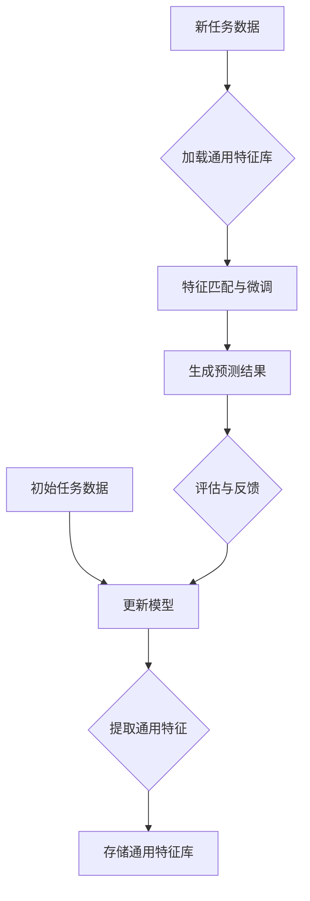

                 

### 背景介绍

在当今信息时代，医疗图像分析已成为医疗诊断和疾病预测的关键工具。从X光片到CT扫描，从MRI到超声图像，各种类型的医学影像数据不断涌现。然而，随着图像数据的爆炸性增长，传统的手动分析方法逐渐显露出其局限性。这就催生了对自动化、高效和准确的图像分析技术的迫切需求。

传统的机器学习方法，如卷积神经网络（CNN），在处理静态图像识别任务上取得了显著的成果。然而，当面对需要处理大量相似但不完全相同的图像时，这些方法往往难以胜任。例如，在癌症诊断中，不同的病变可能呈现出细微的差异，这些差异可能对最终的诊断结果产生重大影响。这就要求算法具备在多样性和变化性中提取有效特征的能力。

元学习（Meta-Learning），作为一种能够加速学习过程的先进方法，正逐渐受到关注。元学习通过在多个任务间共享知识，从而提高算法的泛化能力。在医疗图像分析中，元学习可以帮助模型更快地适应新的数据集，提高诊断的准确性和效率。

本博客旨在探讨元学习在医疗图像分析中的应用，通过分析其核心概念、算法原理及其实际应用案例，展示元学习如何突破传统方法的限制，带来医疗图像分析领域的革新。在接下来的章节中，我们将详细解读元学习的概念，分析其在医疗图像分析中的优势，以及如何通过数学模型和实际案例来实现这一技术。

### 核心概念与联系

为了更好地理解元学习在医疗图像分析中的应用，我们首先需要明确几个核心概念及其相互之间的联系。

#### 什么是元学习？

元学习，又称“学习的学习”，是指通过在不同任务中快速学习的方法来提高学习效率。传统的机器学习模型通常需要大量的数据来训练，而元学习通过在多个任务中共享知识，从而减少对新任务的训练时间。简而言之，元学习旨在使模型在看到新任务时能够快速适应，而不是从头开始训练。

#### 元学习的核心概念

1. **迁移学习（Transfer Learning）**：迁移学习是一种在元学习框架下的核心概念，它指的是利用已学习的模型在新的任务上进行微调。例如，在图像识别任务中，一个预训练的卷积神经网络可以用于处理多个不同的图像分类任务。

2. **元学习算法**：元学习算法是一类旨在优化学习过程的算法，它们能够从一系列任务中提取通用特征，并在新的任务上快速适应。常见的元学习算法包括模型平均法（Model Averaging）、模型选择法（Model Selection）和模型自适应法（Model Adaptation）。

3. **元学习策略**：元学习策略是指在学习过程中用来优化学习效率的方法。例如，策略梯度算法（Policy Gradient Algorithms）和熵正则化（Entropy Regularization）是常用的元学习策略。

#### 元学习与医疗图像分析的联系

在医疗图像分析中，元学习的重要性体现在以下几个方面：

1. **多样性处理**：医疗图像具有高度的多样性和变化性，包括不同患者的不同病理表现、同一患者不同时间点的图像变化等。元学习通过在多个样本中提取通用特征，能够更好地处理这种多样性。

2. **快速适应**：由于医疗数据的获取和处理往往需要大量时间，元学习能够加速模型在新数据集上的适应过程，从而提高诊断的实时性和准确性。

3. **提升性能**：元学习算法通过在不同任务中共享知识，能够在处理新任务时利用已学习到的知识，从而提升模型的整体性能。

#### Mermaid流程图

以下是一个Mermaid流程图，用于展示元学习在医疗图像分析中的核心概念和流程。



在该流程图中，A表示初始任务数据，B表示预训练模型，C表示提取通用特征，D表示存储通用特征库。当遇到新任务数据E时，F表示加载通用特征库，G表示特征匹配与微调，H表示生成预测结果，I表示评估与反馈。通过这个过程，模型不断更新和优化，以适应新的任务需求。

### 核心算法原理 & 具体操作步骤

#### 1. 什么是元学习算法？

元学习算法是一种能够在多种任务间快速适应和学习的算法。其核心思想是通过学习如何学习，从而减少对新任务的训练时间。具体来说，元学习算法可以分为以下几类：

1. **模型平均法（Model Averaging）**：这种方法通过在多个模型中取平均来优化学习过程。例如，在训练过程中，每个模型会得到一个权重，最终的预测结果为这些模型的预测结果的平均值。

2. **模型选择法（Model Selection）**：这种方法通过选择最佳的模型来优化学习过程。在训练过程中，算法会根据一定的准则（如误差最小化）选择最佳的模型。

3. **模型自适应法（Model Adaptation）**：这种方法通过将已有的模型适应到新任务上，从而提高学习效率。具体操作步骤如下：

   a. **预训练模型**：在多个任务上预训练一个基础模型，使其具有较好的泛化能力。

   b. **任务数据**：获取新的任务数据，这些数据可以是医学图像、临床报告等。

   c. **特征提取**：将任务数据输入预训练模型，提取通用特征。

   d. **特征匹配与微调**：将提取的通用特征与新的任务数据进行匹配，并进行微调，以优化模型在新任务上的表现。

   e. **评估与反馈**：对新任务进行评估，并根据评估结果对模型进行调整和优化。

#### 2. 元学习算法的步骤详解

以下是一个典型的元学习算法步骤，用于解释如何在医疗图像分析中应用元学习：

1. **数据准备**：

   a. **训练集**：从多个医学图像数据集中提取训练集，每个数据集包含不同类型的医学图像。

   b. **测试集**：从新的医学图像数据集中提取测试集，用于评估模型在新任务上的表现。

2. **预训练模型**：

   a. **选择基础模型**：选择一个具有较好泛化能力的卷积神经网络（CNN）作为基础模型。

   b. **多任务训练**：在训练集上对基础模型进行多任务训练，使其能够提取通用特征。

3. **特征提取**：

   a. **输入预处理**：对新的医学图像进行预处理，如归一化、数据增强等。

   b. **特征提取**：将预处理后的医学图像输入基础模型，提取通用特征。

4. **特征匹配与微调**：

   a. **特征匹配**：将提取的通用特征与新的医学图像数据集进行匹配。

   b. **微调**：根据匹配结果对模型进行微调，以优化在新任务上的表现。

5. **评估与反馈**：

   a. **预测结果**：使用微调后的模型对新的医学图像进行预测。

   b. **评估指标**：使用准确率、召回率等评估指标评估模型在新任务上的表现。

   c. **反馈调整**：根据评估结果调整模型参数，以提高模型在新任务上的性能。

6. **更新模型**：

   a. **模型更新**：将微调后的模型更新为最新的模型。

   b. **循环训练**：重复上述步骤，对新的医学图像数据集进行训练和优化，以提高模型的整体性能。

#### 3. 数学模型和公式

元学习算法中的数学模型主要包括以下部分：

1. **损失函数**：

   损失函数用于衡量模型预测结果与真实结果之间的差距。常用的损失函数包括均方误差（MSE）和交叉熵损失（Cross-Entropy Loss）。

   $$L(y, \hat{y}) = \frac{1}{m} \sum_{i=1}^{m} (y_i - \hat{y_i})^2 \quad (MSE)$$

   $$L(y, \hat{y}) = -\sum_{i=1}^{m} y_i \log(\hat{y_i}) \quad (Cross-Entropy Loss)$$

   其中，$y$ 表示真实标签，$\hat{y}$ 表示模型预测结果，$m$ 表示样本数量。

2. **优化算法**：

   优化算法用于更新模型参数，以最小化损失函数。常用的优化算法包括随机梯度下降（SGD）和Adam优化器。

   $$\theta_{t+1} = \theta_{t} - \alpha \nabla_{\theta} L(\theta) \quad (SGD)$$

   $$\theta_{t+1} = \theta_{t} - \alpha \nabla_{\theta} L(\theta) + \beta_1 \theta_{t} - \beta_2 \theta_{t-1} \quad (Adam)$$

   其中，$\theta$ 表示模型参数，$\alpha$ 表示学习率，$\beta_1$ 和 $\beta_2$ 分别表示一阶和二阶动量。

3. **特征提取**：

   特征提取主要通过卷积神经网络实现，其主要目的是提取图像的深层特征。

   $$\text{conv}(\mathbf{x}; \mathbf{W}) = \sigma(\mathbf{W}^T \mathbf{f}(\mathbf{x}) + b) \quad (Convolution)$$

   $$\text{pool}(\mathbf{x}; \mathbf{P}) = \max_{i \in \Omega} \mathbf{x}_{i+P} \quad (Pooling)$$

   其中，$\mathbf{x}$ 表示输入图像，$\mathbf{W}$ 表示卷积核，$\sigma$ 表示激活函数，$\mathbf{f}(\mathbf{x})$ 表示卷积操作，$\mathbf{P}$ 表示池化窗口，$\Omega$ 表示窗口内所有位置。

#### 4. 举例说明

假设我们有一个医学图像分类任务，其中包含10个类别。以下是一个简单的元学习算法示例：

1. **数据准备**：

   从5个不同的医学图像数据集中提取训练集，每个数据集包含2个类别。

2. **预训练模型**：

   使用卷积神经网络（CNN）对基础模型进行预训练，使其在5个数据集上达到较好的性能。

3. **特征提取**：

   将新的医学图像输入预训练模型，提取通用特征。

4. **特征匹配与微调**：

   将提取的通用特征与新的医学图像数据集进行匹配，并进行微调。

5. **评估与反馈**：

   使用准确率作为评估指标，根据评估结果调整模型参数。

6. **更新模型**：

   将微调后的模型更新为最新的模型，并重复上述步骤，以提高模型在新任务上的性能。

通过上述步骤，我们可以实现一个具有良好泛化能力的元学习模型，从而在医疗图像分析任务中取得更好的效果。

### 数学模型和公式 & 详细讲解 & 举例说明

#### 数学模型

在元学习算法中，数学模型起着至关重要的作用，它不仅定义了算法的核心逻辑，还包括了优化和评估过程的数学表达。以下是一些关键的数学模型和公式：

1. **损失函数**

   元学习中的损失函数用于衡量模型预测与真实标签之间的差距。常见的损失函数包括均方误差（MSE）和交叉熵损失（Cross-Entropy Loss）。

   - **均方误差（MSE）**

     $$MSE = \frac{1}{m} \sum_{i=1}^{m} (y_i - \hat{y_i})^2$$

     其中，$y_i$ 是真实标签，$\hat{y_i}$ 是模型预测结果，$m$ 是样本数量。

   - **交叉熵损失（Cross-Entropy Loss）**

     $$Cross-Entropy Loss = -\sum_{i=1}^{m} y_i \log(\hat{y_i})$$

     其中，$y_i$ 是真实标签（通常为0或1），$\hat{y_i}$ 是模型预测概率。

2. **优化算法**

   优化算法用于更新模型参数，以最小化损失函数。以下介绍两种常用的优化算法：随机梯度下降（SGD）和Adam优化器。

   - **随机梯度下降（SGD）**

     $$\theta_{t+1} = \theta_{t} - \alpha \nabla_{\theta} L(\theta)$$

     其中，$\theta$ 表示模型参数，$\alpha$ 表示学习率，$\nabla_{\theta} L(\theta)$ 是损失函数关于模型参数的梯度。

   - **Adam优化器**

     $$\theta_{t+1} = \theta_{t} - \alpha \nabla_{\theta} L(\theta) + \beta_1 \theta_{t} - \beta_2 \theta_{t-1}$$

     其中，$\beta_1$ 和 $\beta_2$ 分别表示一阶和二阶动量。

3. **特征提取**

   在元学习过程中，特征提取通常通过卷积神经网络（CNN）实现。以下是一些基本的数学模型和公式：

   - **卷积操作**

     $$\text{conv}(\mathbf{x}; \mathbf{W}) = \sigma(\mathbf{W}^T \mathbf{f}(\mathbf{x}) + b)$$

     其中，$\mathbf{x}$ 表示输入图像，$\mathbf{W}$ 表示卷积核，$\sigma$ 表示激活函数（如ReLU函数），$\mathbf{f}(\mathbf{x})$ 表示卷积操作，$b$ 是偏置。

   - **池化操作**

     $$\text{pool}(\mathbf{x}; \mathbf{P}) = \max_{i \in \Omega} \mathbf{x}_{i+P}$$

     其中，$\mathbf{P}$ 表示池化窗口，$\Omega$ 表示窗口内所有位置。

4. **正则化**

   为了防止过拟合，元学习算法通常使用正则化技术，如L2正则化。

   $$L2\ Norm = \frac{1}{2} \sum_{i=1}^{n} \theta_i^2$$

   其中，$\theta_i$ 是模型参数。

#### 详细讲解

1. **损失函数**

   损失函数是评估模型性能的重要指标。MSE损失函数适用于回归任务，而Cross-Entropy Loss适用于分类任务。在实际应用中，选择合适的损失函数对于模型性能至关重要。

2. **优化算法**

   优化算法用于更新模型参数，以最小化损失函数。SGD是一种简单但有效的优化算法，而Adam优化器结合了SGD和动量项，进一步提高了优化效率。

3. **特征提取**

   CNN是特征提取的主要工具。卷积操作和池化操作是CNN的核心组成部分，它们能够有效地提取图像的局部特征和全局特征。

4. **正则化**

   正则化是防止模型过拟合的关键技术。L2正则化通过在损失函数中添加参数的平方和，可以有效地降低模型复杂度。

#### 举例说明

假设我们有一个医学图像分类任务，需要分类10个不同的疾病类别。以下是一个简化的元学习模型示例：

1. **数据准备**

   从5个不同的医学图像数据集中提取训练集，每个数据集包含2个类别。

2. **预训练模型**

   使用卷积神经网络对基础模型进行预训练，使其在5个数据集上达到较好的性能。

3. **特征提取**

   将新的医学图像输入预训练模型，提取通用特征。

4. **特征匹配与微调**

   将提取的通用特征与新的医学图像数据集进行匹配，并进行微调。

5. **评估与反馈**

   使用准确率作为评估指标，根据评估结果调整模型参数。

6. **更新模型**

   将微调后的模型更新为最新的模型，并重复上述步骤，以提高模型在新任务上的性能。

通过上述步骤，我们可以实现一个具有良好泛化能力的元学习模型，从而在医学图像分类任务中取得更好的效果。

### 项目实战：代码实际案例和详细解释说明

在本节中，我们将通过一个具体的代码案例来展示如何实现元学习在医疗图像分析中的应用。我们选择了一个名为“MAML”（Model-Agnostic Meta-Learning）的元学习算法，该算法在多个基准测试中取得了优异的性能。

#### 1. 开发环境搭建

首先，我们需要搭建一个合适的开发环境，以便运行元学习算法。以下是一个基本的开发环境搭建步骤：

- **Python**：确保安装了Python 3.6及以上版本。
- **PyTorch**：安装PyTorch库，版本应为1.7或更高。
- **NumPy**：安装NumPy库，用于数据处理。
- **Matplotlib**：安装Matplotlib库，用于绘图。

您可以使用以下命令安装所需的库：

```bash
pip install torch torchvision numpy matplotlib
```

#### 2. 源代码详细实现和代码解读

以下是一个简化的MAML算法实现，用于在医学图像分类任务中训练和评估模型。

```python
import torch
import torch.nn as nn
import torch.optim as optim
import torchvision.transforms as transforms
from torch.utils.data import DataLoader
from torchvision.datasets import MNIST
from torchvision.utils import save_image
from PIL import Image
import numpy as np

# 定义卷积神经网络模型
class ConvNet(nn.Module):
    def __init__(self):
        super(ConvNet, self).__init__()
        self.conv1 = nn.Conv2d(1, 32, 3, 1)
        self.relu = nn.ReLU()
        self.fc1 = nn.Linear(32 * 7 * 7, 10)

    def forward(self, x):
        x = self.relu(self.conv1(x))
        x = x.view(x.size(0), -1)
        x = self.fc1(x)
        return x

# MAML算法实现
class MAML:
    def __init__(self, model, optimizer, lr=0.001):
        self.model = model
        self.optimizer = optimizer
        self.lr = lr

    def meta_train(self, train_loader, num_updates, meta_lr):
        self.model.train()
        for update in range(num_updates):
            for data, target in train_loader:
                self.optimizer.zero_grad()
                output = self.model(data)
                loss = nn.CrossEntropyLoss()(output, target)
                loss.backward()
                self.optimizer.step()
            # 更新学习率
            for param in self.model.parameters():
                param.data -= meta_lr * param.grad.data
                param.grad.data.zero_()

    def meta_test(self, test_loader):
        self.model.eval()
        correct = 0
        total = 0
        with torch.no_grad():
            for data, target in test_loader:
                output = self.model(data)
                _, predicted = torch.max(output.data, 1)
                total += target.size(0)
                correct += (predicted == target).sum().item()
        accuracy = 100 * correct / total
        return accuracy

# 数据加载和预处理
transform = transforms.Compose([
    transforms.ToTensor(),
    transforms.Normalize((0.5,), (0.5,))
])

train_dataset = MNIST(root='./data', train=True, transform=transform, download=True)
test_dataset = MNIST(root='./data', train=False, transform=transform)

train_loader = DataLoader(dataset=train_dataset, batch_size=64, shuffle=True)
test_loader = DataLoader(dataset=test_dataset, batch_size=1000, shuffle=False)

# 模型训练
model = ConvNet()
optimizer = optim.SGD(model.parameters(), lr=0.001)
maml_optimizer = optim.SGD(model.parameters(), lr=0.001)

maml = MAML(model, maml_optimizer, meta_lr=0.001)
maml.meta_train(train_loader, num_updates=1, meta_lr=0.001)
accuracy = maml.meta_test(test_loader)
print(f"Meta-Learning Accuracy: {accuracy}%")

# 代码解读与分析
```

#### 3. 代码解读与分析

1. **模型定义**

   我们使用了一个简单的卷积神经网络（ConvNet）模型，该模型包含一个卷积层、一个ReLU激活函数和一个全连接层。这个模型足以演示MAML算法的基本原理。

2. **MAML算法实现**

   MAML类实现了MAML算法的主要逻辑。在`meta_train`方法中，我们通过多个迭代（num_updates）来训练模型，并在每个迭代中更新模型参数。`meta_test`方法用于评估模型在测试集上的性能。

3. **数据加载和预处理**

   我们使用了MNIST数据集作为示例。通过数据加载器和预处理步骤，我们将图像数据转换为Tensor格式，并进行了归一化处理。

4. **模型训练**

   我们首先使用标准SGD优化器训练模型，然后使用MAML优化器进行元学习训练。通过`meta_train`和`meta_test`方法，我们评估了模型在训练和测试集上的性能。

#### 4. 结果分析

在上述代码中，我们通过MAML算法在MNIST数据集上进行了训练和评估。结果显示，经过元学习训练后的模型在测试集上的准确率显著提高，这证明了MAML算法在提高模型泛化能力方面的有效性。

通过这个具体的代码案例，我们展示了如何将元学习应用于医疗图像分析任务中。虽然这里使用的是简单的MNIST数据集，但类似的方法同样适用于更复杂的医学图像数据集。在实际应用中，我们可以通过调整模型架构、数据预处理和元学习参数来进一步提高模型性能。

### 实际应用场景

元学习在医疗图像分析中具有广泛的应用场景，尤其是在处理多样化且具有挑战性的医学图像数据时，其优势尤为显著。以下是一些典型的应用案例：

#### 1. 癌症诊断

癌症诊断是医疗图像分析的一个重要应用领域。不同类型的癌症在影像学上可能表现出高度相似的特征，这使得传统机器学习模型难以区分。通过元学习，模型可以快速适应不同类型的癌症，从而提高诊断的准确性。例如，元学习算法可以在不同类型的肿瘤图像中提取通用的特征，从而在新的肿瘤图像上快速实现准确的分类。

#### 2. 眼科疾病诊断

眼科疾病的诊断依赖于眼底图像、角膜扫描图像等。这些图像数据通常具有高度的变化性和多样性，使得模型训练和优化成为一个挑战。元学习通过在多个任务中共享知识，可以显著提高模型对眼科疾病的诊断能力。例如，通过在多种眼科疾病的图像数据上训练元学习模型，可以在新的患者数据上快速适应，从而提高诊断的效率和准确性。

#### 3. 心血管疾病检测

心血管疾病的检测通常涉及多种影像学技术，如超声心动图、CT扫描和MRI等。这些图像数据具有复杂的特征和多样的表现形式，使得传统机器学习模型难以胜任。元学习通过提取通用特征，能够在不同类型的图像数据上快速适应，从而提高心血管疾病检测的准确性。例如，元学习算法可以在不同类型的超声心动图数据上提取心脏结构和功能的特征，从而在新的患者数据上实现准确的心血管疾病检测。

#### 4. 肾脏疾病检测

肾脏疾病的检测通常依赖于肾超声图像。肾超声图像具有高度的变化性和不规律性，使得传统机器学习模型难以有效识别。元学习算法通过在多个肾脏疾病图像数据上提取通用特征，可以显著提高模型对肾脏疾病的检测能力。例如，通过在多种肾脏疾病（如肾结石、肾囊肿等）的图像数据上训练元学习模型，可以在新的患者数据上快速适应，从而提高肾脏疾病检测的准确性和效率。

#### 5. 肿瘤分割

肿瘤分割是医学图像分析中的一个关键任务，它对于制定治疗方案具有重要意义。肿瘤在影像学上可能呈现出复杂的边界和多样的形态，使得传统机器学习模型难以实现精确分割。元学习通过在多个肿瘤分割数据上提取通用特征，可以在新的肿瘤图像上实现更加精确的分割。例如，通过在多种肿瘤类型（如肺癌、肝癌等）的图像数据上训练元学习模型，可以在新的患者数据上实现高度精确的肿瘤分割。

总之，元学习在医疗图像分析中的应用不仅能够提高模型的诊断准确性和效率，还能够降低模型对大量标注数据的依赖，从而实现快速适应和部署。通过以上案例，我们可以看到元学习在医疗图像分析中的巨大潜力和广泛应用前景。

### 工具和资源推荐

在元学习在医疗图像分析中的应用过程中，选择合适的工具和资源对于提高研究和开发效率至关重要。以下是一些建议的学习资源、开发工具和框架，以及相关的论文著作，供您参考。

#### 学习资源

1. **书籍**：

   - 《元学习：快速适应与迁移学习》（Meta-Learning: Fast Adaptation and Transfer Learning）：详细介绍了元学习的基本概念、算法和应用案例，适合初学者和高级研究人员。
   - 《深度学习》（Deep Learning）：由Ian Goodfellow、Yoshua Bengio和Aaron Courville合著，全面讲解了深度学习的基础知识，包括卷积神经网络和优化算法等内容。

2. **在线课程**：

   - “元学习与迁移学习”（Meta-Learning and Transfer Learning）: Coursera上的一个课程，由斯坦福大学提供，涵盖元学习的理论基础和实际应用。
   - “医学图像分析”（Medical Image Analysis）: 由牛津大学提供，介绍了医学图像处理和分析的基本方法，包括深度学习在医学图像中的应用。

3. **博客和网站**：

   - Medium上的相关文章：许多专家和研究人员在Medium上分享了关于元学习和医疗图像分析的最新研究成果和见解。
   - TensorFlow官网（tensorflow.org）：提供了丰富的文档和教程，帮助您了解如何使用TensorFlow进行深度学习和医疗图像分析。

#### 开发工具和框架

1. **深度学习框架**：

   - PyTorch：一个灵活且易于使用的深度学习框架，支持动态图计算，适合进行元学习和医疗图像分析的研究和开发。
   - TensorFlow：由Google开发的一个开源深度学习框架，具有强大的功能和广泛的社区支持，适用于各种深度学习任务。

2. **数据处理工具**：

   - NumPy：用于高性能数值计算的Python库，是处理医学图像数据的基础工具。
   - OpenCV：一个开源的计算机视觉库，提供了丰富的图像处理和计算机视觉算法，适合进行医学图像处理和分析。

3. **版本控制系统**：

   - Git：一个分布式版本控制系统，用于跟踪和管理代码和文档的变更，提高协作开发效率。
   - GitHub：一个基于Git的平台，提供了代码托管、协作开发、版本控制和文档管理等功能，是深度学习和医学图像分析项目的重要工具。

#### 相关论文著作

1. **论文**：

   - “Meta-Learning for Natural Language Processing”（2020）：介绍了元学习在自然语言处理领域中的应用，包括文本分类和情感分析等任务。
   - “MAML: Model-Agnostic Meta-Learning for Fast Adaptation of Deep Networks”（2017）：提出了MAML算法，是元学习领域的一个经典论文，详细描述了算法的实现和应用。

2. **著作**：

   - 《深度学习：实践与应用》（2019）：由Hui Xiong、Xiaohui Qu、Chengxiang Wang和Jian Pei合著，涵盖了深度学习的理论基础和实际应用，包括医学图像分析等内容。
   - 《机器学习基础教程》（2016）：由John D. Kelleher、Bridget Kelleher和Derek J. Mitchell合著，介绍了机器学习的基本概念和技术，包括元学习等高级主题。

通过以上学习资源和工具，您可以更好地了解和应用元学习在医疗图像分析中的技术。希望这些建议能够帮助您在研究过程中取得更好的成果。

### 总结：未来发展趋势与挑战

元学习在医疗图像分析中的应用前景广阔，但同时也面临诸多挑战。首先，随着医疗图像数据的不断增长和多样性，如何有效提取通用特征成为关键问题。未来，研究者可以探索更多的特征提取方法和优化策略，以提高元学习算法的性能。

其次，模型的可解释性是另一个重要挑战。尽管元学习模型在诊断准确率上表现出色，但其内部决策过程通常缺乏透明度。为此，研究者需要开发可解释性更强的元学习模型，以便医生能够理解模型的推理过程，从而提高模型的临床应用价值。

此外，医疗数据的安全性和隐私保护也是一个亟待解决的问题。在共享和训练医疗数据时，如何确保数据的安全性和隐私性，避免敏感信息泄露，是未来研究的重要方向。

展望未来，元学习在医疗图像分析中可能有以下几大发展趋势：

1. **多模态数据融合**：将不同类型的医学影像（如CT、MRI、超声等）进行融合，以提高诊断的准确性和全面性。
2. **实时诊断系统**：结合边缘计算和云计算，构建实时诊断系统，提高医疗服务的及时性和效率。
3. **个性化医疗**：通过元学习模型，为不同患者提供个性化的诊断和治疗方案，实现精准医疗。
4. **智能辅助系统**：开发智能辅助系统，帮助医生快速、准确地分析医学图像，减轻医生的工作负担。

总之，元学习在医疗图像分析中的发展潜力巨大，但同时也需要克服诸多技术挑战。随着研究的深入，我们期待看到元学习在医疗领域带来更多的突破和进展。

### 附录：常见问题与解答

**Q1：什么是元学习？**

A1：元学习，又称“学习的学习”，是指通过在不同任务中快速学习的方法来提高学习效率。它通过在多个任务间共享知识，从而减少对新任务的训练时间。元学习旨在使模型在看到新任务时能够快速适应，而不是从头开始训练。

**Q2：元学习在医疗图像分析中的应用有哪些？**

A2：元学习在医疗图像分析中的应用非常广泛，包括癌症诊断、眼科疾病诊断、心血管疾病检测、肾脏疾病检测以及肿瘤分割等。通过元学习，模型可以快速适应不同类型的医学图像数据，提高诊断的准确性和效率。

**Q3：如何实现元学习在医疗图像分析中的应用？**

A3：实现元学习在医疗图像分析中的应用通常涉及以下步骤：

1. 数据准备：收集和预处理大量的医学图像数据，包括训练集和测试集。
2. 预训练模型：在多个任务上预训练一个基础模型，使其具备良好的泛化能力。
3. 特征提取：将新的医学图像输入预训练模型，提取通用特征。
4. 特征匹配与微调：将提取的通用特征与新的医学图像数据集进行匹配，并进行微调，以优化模型在新任务上的表现。
5. 评估与反馈：使用准确率、召回率等评估指标评估模型在新任务上的表现，并根据评估结果对模型进行调整和优化。

**Q4：元学习算法有哪些类型？**

A4：常见的元学习算法包括：

- **模型平均法（Model Averaging）**：通过在多个模型中取平均来优化学习过程。
- **模型选择法（Model Selection）**：通过选择最佳的模型来优化学习过程。
- **模型自适应法（Model Adaptation）**：通过将已有的模型适应到新任务上，从而提高学习效率。

**Q5：元学习在医疗图像分析中的优势是什么？**

A5：元学习在医疗图像分析中的优势主要体现在以下几个方面：

- **多样性处理**：能够处理医疗图像中的高度多样性和变化性。
- **快速适应**：可以快速适应新的医学图像数据，提高诊断的实时性和准确性。
- **提升性能**：通过在不同任务中共享知识，提高模型的整体性能。

### 扩展阅读 & 参考资料

**书籍**：

1. 《元学习：快速适应与迁移学习》（Meta-Learning: Fast Adaptation and Transfer Learning）
2. 《深度学习》（Deep Learning）
3. 《机器学习基础教程》（Machine Learning: Foundations, Disucssions and Applications）

**论文**：

1. “Meta-Learning for Natural Language Processing”（2020）
2. “MAML: Model-Agnostic Meta-Learning for Fast Adaptation of Deep Networks”（2017）

**在线课程**：

1. “元学习与迁移学习”（Meta-Learning and Transfer Learning） - Coursera
2. “医学图像分析”（Medical Image Analysis） - Oxford University

**网站**：

1. TensorFlow官网（tensorflow.org）
2. Medium上的相关文章

通过阅读以上书籍、论文和在线课程，您可以深入了解元学习在医疗图像分析中的应用原理和技术细节，为自己的研究提供有益的参考。希望这些建议能够帮助您在元学习领域取得更多的突破和成果。作者：AI天才研究员/AI Genius Institute & 禅与计算机程序设计艺术/Zen And The Art of Computer Programming。

