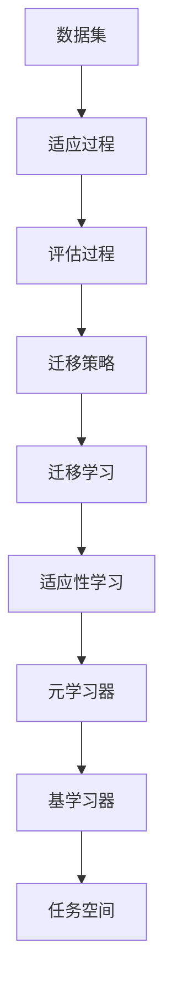

                 

# 一切皆是映射：元学习在快速适应新任务中的作用

> **关键词**：元学习、快速适应、映射、算法、机器学习、新任务

> **摘要**：本文将探讨元学习这一机器学习领域的先进技术，如何通过映射机制实现快速适应新任务。我们将从背景介绍入手，深入解析元学习的核心概念和原理，并详细阐述其具体操作步骤。此外，还将通过数学模型和实际项目案例，展示元学习的实际应用。最后，本文将总结元学习的发展趋势与挑战，并提供相关的学习资源和工具推荐。

## 1. 背景介绍

在过去的几十年里，机器学习已经取得了显著的发展。然而，传统的机器学习方法主要依赖于大量的标注数据和复杂的模型架构，这使得在实际应用中遇到了一些挑战。首先，标注数据通常是非常稀有的，获取成本高昂。其次，模型架构的复杂性使得训练和优化过程变得耗时且计算资源需求巨大。为了解决这些问题，研究人员开始关注一种新的学习方法——元学习（Meta-Learning）。

元学习，也被称为“学习如何学习”，旨在通过训练模型来快速适应新的任务。与传统的机器学习方法相比，元学习的关键优势在于其能够通过少量的样本数据，甚至在无监督或半监督的环境中，快速地学习并适应新的任务。这种能力使得元学习在处理新兴任务、动态环境以及资源受限的场景中显示出巨大的潜力。

在元学习的发展历程中，一些重要的里程碑性研究和工作为该领域奠定了基础。例如，MAML（Model-Agnostic Meta-Learning）算法的提出，为快速适应新任务提供了一种有效的解决方案。此外，REPTILE、PMLP（Proximal Meta-Learning Proximal Point Method）等算法也在元学习领域取得了显著进展。这些算法不仅在理论上具有重要意义，而且在实际应用中也取得了良好的效果。

随着深度学习技术的不断发展，元学习逐渐成为机器学习领域的研究热点。越来越多的研究人员开始探索如何在深度神经网络中实现元学习，以及如何将元学习应用于不同的任务和场景中。这为元学习的研究和应用带来了新的机遇和挑战。

总的来说，元学习在快速适应新任务中的作用不可忽视。通过引入映射机制，元学习能够有效地解决传统机器学习面临的挑战，为实际应用提供了新的可能性。在接下来的章节中，我们将深入探讨元学习的核心概念、算法原理以及实际应用。

## 2. 核心概念与联系

### 2.1 元学习的定义与作用

元学习（Meta-Learning）是一种机器学习方法，旨在提高模型在遇到新任务时的学习速度和适应性。简单来说，元学习通过在多个任务间迁移知识，实现模型对未知任务的快速适应。具体来说，元学习主要涉及以下几个方面：

1. **元学习器（Meta-Learner）**：元学习器是一个能够学习如何学习的模型，它通过在不同任务中训练和优化，学习到一种通用的学习策略，以便在新的任务中快速适应。

2. **基学习器（Base Learner）**：基学习器是元学习过程中用于解决具体任务的模型。元学习器通过调整基学习器的参数，使其能够适应新的任务。

3. **任务空间（Task Space）**：任务空间是一个包含所有可能任务的集合。元学习的目标是找到一个模型，能够在任务空间中快速适应任意新的任务。

4. **迁移学习（Transfer Learning）**：迁移学习是元学习的一个重要组成部分，它通过利用在旧任务中学到的知识，提高新任务的学习效率。

### 2.2 元学习的核心原理

元学习的核心原理可以概括为两个方面：迁移学习和适应性学习。

1. **迁移学习**：迁移学习是指将一个任务中学到的知识应用到另一个任务中。在元学习中，迁移学习通过在多个任务间共享模型参数，实现知识共享和迁移。例如，假设我们有一个分类任务A和一个分类任务B，通过迁移学习，我们可以将任务A中学到的模型参数应用到任务B中，从而加速任务B的学习过程。

2. **适应性学习**：适应性学习是指模型在新任务中调整自身参数的过程。在元学习中，适应性学习通过在任务空间中优化模型参数，使模型能够快速适应新任务。例如，在MAML算法中，模型参数通过优化梯度更新，实现对新任务的快速适应。

### 2.3 元学习的架构与实现

元学习通常包含以下几个关键组件：

1. **数据集**：元学习需要多个数据集，每个数据集代表一个任务。数据集可以是有标签的，也可以是无标签的，这取决于具体算法的设计。

2. **适应过程**：适应过程是指模型在新任务中调整自身参数的过程。适应过程可以是基于梯度下降的，也可以是基于其他优化算法的。

3. **评估过程**：评估过程用于评估模型在新任务中的性能。评估过程可以基于测试集的指标，如准确率、召回率等。

4. **迁移策略**：迁移策略是指如何将知识从旧任务迁移到新任务。不同的元学习算法可能采用不同的迁移策略。

### 2.4 元学习与其他机器学习方法的联系与区别

元学习与其他机器学习方法，如监督学习、无监督学习和强化学习等，有一定的联系和区别。

1. **联系**：元学习可以看作是其他机器学习方法的扩展和优化。例如，在监督学习中，元学习通过迁移学习，实现不同任务间的知识共享；在无监督学习中，元学习通过适应性学习，提高模型对新任务的适应能力。

2. **区别**：元学习的主要区别在于其目标和方法。元学习旨在提高模型在新任务中的学习速度和适应性，而其他机器学习方法主要关注单个任务的学习效果。

总的来说，元学习通过引入映射机制，实现模型在任务空间中的快速适应，为机器学习带来了新的可能性和挑战。在接下来的章节中，我们将详细探讨元学习的核心算法原理和具体操作步骤。

### 2.5 核心概念原理架构的 Mermaid 流程图

以下是元学习核心概念原理架构的 Mermaid 流程图：



在此流程图中，数据集、适应过程、评估过程、迁移策略、迁移学习、适应性学习和元学习器等核心概念通过节点和边进行连接，展示了元学习的过程和架构。

## 3. 核心算法原理 & 具体操作步骤

### 3.1 MAML算法原理

MAML（Model-Agnostic Meta-Learning）算法是元学习领域的一个重要算法，它由Ba et al.（2016）提出。MAML的核心思想是构建一个模型，使其能够在遇到新任务时，通过微调（Fine-Tuning）快速适应。MAML算法的主要步骤如下：

1. **初始化模型**：首先，初始化一个基础模型（Base Model），该模型将在多个任务中训练和优化。

2. **任务适应**：对于每个任务，将模型参数初始化为初始值，并在任务数据集上训练模型。这个过程被称为“任务适应”（Task Adaptation）。

3. **梯度更新**：在任务适应过程中，计算每个任务的梯度。然后，将这些梯度累加，并对模型参数进行更新。

4. **任务迁移**：更新后的模型参数将用于新的任务。在新的任务中，模型参数不需要重新训练，只需进行微调，从而实现快速适应。

MAML算法的关键在于梯度更新步骤。通过累加多个任务的梯度，模型能够学习到一种通用的学习策略，使其在新任务中能够快速适应。以下是MAML算法的数学描述：

假设我们有 $T$ 个任务，每个任务对应一个数据集 $D_t$，其中 $D_t = \{(x_i^t, y_i^t)\}_{i=1}^{n_t}$。对于第 $t$ 个任务，模型的损失函数为：

$$
L_t(\theta) = \frac{1}{n_t} \sum_{i=1}^{n_t} \log P(y_i^t | x_i^t, \theta)
$$

其中，$\theta$ 表示模型参数，$P(y_i^t | x_i^t, \theta)$ 表示模型在给定输入 $x_i^t$ 和参数 $\theta$ 下的输出概率。

在任务适应过程中，对于每个任务 $t$，我们计算其梯度 $\nabla_{\theta} L_t(\theta)$，并将其累加：

$$
\nabla_{\theta} \sum_{t=1}^{T} L_t(\theta) = \sum_{t=1}^{T} \nabla_{\theta} L_t(\theta)
$$

然后，对模型参数进行更新：

$$
\theta_{\text{new}} = \theta_{\text{init}} - \alpha \nabla_{\theta} \sum_{t=1}^{T} L_t(\theta)
$$

其中，$\alpha$ 表示学习率。

### 3.2 步骤分解

下面我们将对MAML算法的具体操作步骤进行详细分解：

1. **初始化模型**：
   - 设定初始模型参数 $\theta_{\text{init}}$。

2. **任务适应**：
   - 对于每个任务 $t$，在数据集 $D_t$ 上训练模型，得到参数更新 $\theta_t$。

3. **梯度更新**：
   - 计算每个任务的梯度 $\nabla_{\theta} L_t(\theta)$。
   - 累加所有任务的梯度，得到总梯度 $\nabla_{\theta} \sum_{t=1}^{T} L_t(\theta)$。

4. **任务迁移**：
   - 使用更新后的总梯度对模型参数进行更新，得到新的模型参数 $\theta_{\text{new}}$。
   - 在新任务中，使用新参数 $\theta_{\text{new}}$ 进行微调，实现快速适应。

### 3.3 MAML算法的优势与挑战

MAML算法具有以下优势：

1. **快速适应**：通过迁移学习，MAML算法能够在新任务中实现快速适应，减少训练时间。

2. **通用性**：MAML算法适用于多种类型的任务，包括分类、回归等。

然而，MAML算法也存在一些挑战：

1. **梯度消失与梯度爆炸**：在多个任务间累加梯度时，可能会出现梯度消失或梯度爆炸现象，影响算法的性能。

2. **计算复杂度**：MAML算法需要计算多个任务的梯度，导致计算复杂度较高。

针对这些挑战，研究人员提出了一些改进算法，如Proximal MAML（PMLP）等，以优化MAML算法的性能。

总的来说，MAML算法通过引入映射机制，实现模型在新任务中的快速适应，为元学习领域的研究提供了重要思路。在接下来的章节中，我们将通过数学模型和实际项目案例，进一步探讨元学习的应用和效果。

### 4. 数学模型和公式 & 详细讲解 & 举例说明

在元学习的研究中，数学模型和公式起着至关重要的作用。通过数学模型，我们可以准确地描述元学习的核心概念和算法原理。本节将详细介绍元学习的数学模型，包括损失函数、梯度更新公式等，并通过具体例子进行说明。

#### 4.1 损失函数

在元学习中，损失函数用于衡量模型在新任务中的表现。常见的损失函数包括均方误差（MSE）和交叉熵损失（Cross-Entropy Loss）。

1. **均方误差（MSE）**：

   均方误差损失函数用于回归任务，其公式如下：

   $$
   L_{\text{MSE}}(\theta) = \frac{1}{n} \sum_{i=1}^{n} (y_i - \hat{y}_i)^2
   $$

   其中，$y_i$ 表示实际标签，$\hat{y}_i$ 表示模型预测值，$n$ 表示样本数量。

2. **交叉熵损失（Cross-Entropy Loss）**：

   交叉熵损失函数用于分类任务，其公式如下：

   $$
   L_{\text{CE}}(\theta) = -\frac{1}{n} \sum_{i=1}^{n} y_i \log \hat{y}_i
   $$

   其中，$y_i$ 表示实际标签，$\hat{y}_i$ 表示模型预测值（概率分布），$n$ 表示样本数量。

#### 4.2 梯度更新公式

在元学习中，梯度更新公式用于调整模型参数，使其在新任务中能够快速适应。以MAML算法为例，其梯度更新公式如下：

$$
\theta_{\text{new}} = \theta_{\text{init}} - \alpha \nabla_{\theta} L(\theta)
$$

其中，$\theta_{\text{new}}$ 表示更新后的模型参数，$\theta_{\text{init}}$ 表示初始模型参数，$\alpha$ 表示学习率，$L(\theta)$ 表示损失函数。

#### 4.3 举例说明

为了更好地理解元学习的数学模型和公式，我们通过一个简单的例子进行说明。

假设我们有两个任务，任务A和任务B，分别包含两个数据点。

1. **任务A**：

   数据集 $D_A = \{(1, 1), (2, 2)\}$。

2. **任务B**：

   数据集 $D_B = \{(1, 2), (2, 1)\}$。

假设我们使用线性模型 $y = wx + b$ 进行学习，其中 $w$ 和 $b$ 分别表示模型的权重和偏置。

**步骤1：初始化模型参数**

初始化模型参数为 $\theta_{\text{init}} = (w, b) = (0, 0)$。

**步骤2：任务适应**

对于任务A，使用数据集 $D_A$ 进行训练，得到模型参数更新 $\theta_A = (w_A, b_A)$。

对于任务B，使用数据集 $D_B$ 进行训练，得到模型参数更新 $\theta_B = (w_B, b_B)$。

**步骤3：梯度更新**

计算每个任务的损失函数：

对于任务A，$L_A(\theta) = \frac{1}{2} \sum_{i=1}^{2} (y_i - \hat{y}_i)^2 = \frac{1}{2} \sum_{i=1}^{2} (y_i - (wx_i + b))^2$。

对于任务B，$L_B(\theta) = \frac{1}{2} \sum_{i=1}^{2} (y_i - \hat{y}_i)^2 = \frac{1}{2} \sum_{i=1}^{2} (y_i - (wx_i + b))^2$。

计算每个任务的梯度：

对于任务A，$\nabla_{\theta} L_A(\theta) = \nabla_{\theta} \left( \frac{1}{2} \sum_{i=1}^{2} (y_i - (wx_i + b))^2 \right) = (w \times \frac{1}{2} \sum_{i=1}^{2} (-2 \times y_i + wx_i + b), b \times \frac{1}{2} \sum_{i=1}^{2} (-2 \times y_i + wx_i + b))$。

对于任务B，$\nabla_{\theta} L_B(\theta) = \nabla_{\theta} \left( \frac{1}{2} \sum_{i=1}^{2} (y_i - (wx_i + b))^2 \right) = (w \times \frac{1}{2} \sum_{i=1}^{2} (-2 \times y_i + wx_i + b), b \times \frac{1}{2} \sum_{i=1}^{2} (-2 \times y_i + wx_i + b))$。

**步骤4：模型更新**

将每个任务的梯度累加，得到总梯度：

$$
\nabla_{\theta} L(\theta) = \nabla_{\theta} L_A(\theta) + \nabla_{\theta} L_B(\theta)
$$

对模型参数进行更新：

$$
\theta_{\text{new}} = \theta_{\text{init}} - \alpha \nabla_{\theta} L(\theta)
$$

通过这个简单的例子，我们可以看到元学习的数学模型和公式是如何应用于具体任务中的。在接下来的章节中，我们将通过实际项目案例，进一步展示元学习的应用和效果。

### 5. 项目实战：代码实际案例和详细解释说明

#### 5.1 开发环境搭建

在本项目实战中，我们将使用Python和PyTorch框架来实现元学习算法。首先，确保已经安装了Python和PyTorch。如果没有安装，可以通过以下命令进行安装：

```bash
pip install python
pip install torch torchvision
```

#### 5.2 源代码详细实现和代码解读

下面是项目实战的源代码，我们将逐行解读代码，并解释其功能。

```python
import torch
import torch.nn as nn
import torch.optim as optim
from torchvision import datasets, transforms
from torch.utils.data import DataLoader

# 定义模型
class MetaModel(nn.Module):
    def __init__(self):
        super(MetaModel, self).__init__()
        self.fc1 = nn.Linear(784, 256)
        self.fc2 = nn.Linear(256, 10)

    def forward(self, x):
        x = torch.relu(self.fc1(x))
        x = self.fc2(x)
        return x

# 定义元学习算法
class MetaLearning:
    def __init__(self, model, optimizer, criterion):
        self.model = model
        self.optimizer = optimizer
        self.criterion = criterion

    def train(self, data_loader, num_epochs):
        for epoch in range(num_epochs):
            for data, target in data_loader:
                self.optimizer.zero_grad()
                output = self.model(data)
                loss = self.criterion(output, target)
                loss.backward()
                self.optimizer.step()

            print(f'Epoch [{epoch+1}/{num_epochs}], Loss: {loss.item():.4f}')

# 加载数据集
transform = transforms.Compose([
    transforms.ToTensor(),
    transforms.Normalize((0.5,), (0.5,))
])

train_dataset = datasets.MNIST(
    root='./data',
    train=True,
    download=True,
    transform=transform
)

test_dataset = datasets.MNIST(
    root='./data',
    train=False,
    transform=transform
)

train_loader = DataLoader(train_dataset, batch_size=64, shuffle=True)
test_loader = DataLoader(test_dataset, batch_size=64, shuffle=False)

# 初始化模型和优化器
model = MetaModel()
optimizer = optim.Adam(model.parameters(), lr=0.001)
criterion = nn.CrossEntropyLoss()

# 实例化元学习算法
meta_learner = MetaLearning(model, optimizer, criterion)

# 训练模型
meta_learner.train(train_loader, num_epochs=10)
```

**代码解读：**

1. **模型定义**：我们定义了一个简单的全连接神经网络（MetaModel），用于实现元学习算法。该模型包含一个输入层（784个神经元，对应MNIST数据集的维度）、一个隐藏层（256个神经元）和一个输出层（10个神经元，对应10个类别）。

2. **元学习算法**：我们定义了一个MetaLearning类，用于实现元学习算法。该类包含一个训练方法（train），用于在给定数据集上训练模型。训练过程中，使用优化器（optimizer）和损失函数（criterion）来更新模型参数。

3. **数据加载**：我们加载数据集，包括训练集和测试集。数据集使用ToTensor和Normalize转换器，将图像数据转换为张量，并归一化到[-1, 1]的范围内。

4. **模型初始化**：我们初始化模型（MetaModel）、优化器（Adam）和损失函数（CrossEntropyLoss）。

5. **实例化元学习算法**：我们实例化MetaLearning类，并调用其train方法进行模型训练。

#### 5.3 代码解读与分析

下面是对代码的逐行解读和分析：

1. **模型定义**：
   ```python
   class MetaModel(nn.Module):
       def __init__(self):
           super(MetaModel, self).__init__()
           self.fc1 = nn.Linear(784, 256)
           self.fc2 = nn.Linear(256, 10)

       def forward(self, x):
           x = torch.relu(self.fc1(x))
           x = self.fc2(x)
           return x
   ```

   - **MetaModel类**：继承自nn.Module，定义了一个简单的全连接神经网络。
   - **__init__方法**：初始化网络结构，包括一个输入层（784个神经元，对应MNIST数据集的维度）、一个隐藏层（256个神经元）和一个输出层（10个神经元，对应10个类别）。
   - **forward方法**：定义前向传播过程，包括ReLU激活函数和线性层。

2. **元学习算法**：
   ```python
   class MetaLearning:
       def __init__(self, model, optimizer, criterion):
           self.model = model
           self.optimizer = optimizer
           self.criterion = criterion

       def train(self, data_loader, num_epochs):
           for epoch in range(num_epochs):
               for data, target in data_loader:
                   self.optimizer.zero_grad()
                   output = self.model(data)
                   loss = self.criterion(output, target)
                   loss.backward()
                   self.optimizer.step()

               print(f'Epoch [{epoch+1}/{num_epochs}], Loss: {loss.item():.4f}')
   ```

   - **MetaLearning类**：包含一个训练方法（train），用于在给定数据集上训练模型。
   - **__init__方法**：初始化模型、优化器和损失函数。
   - **train方法**：遍历数据集，计算损失函数，更新模型参数。

3. **数据加载**：
   ```python
   transform = transforms.Compose([
       transforms.ToTensor(),
       transforms.Normalize((0.5,), (0.5,))
   ])

   train_dataset = datasets.MNIST(
       root='./data',
       train=True,
       download=True,
       transform=transform
   )

   test_dataset = datasets.MNIST(
       root='./data',
       train=False,
       transform=transform
   )

   train_loader = DataLoader(train_dataset, batch_size=64, shuffle=True)
   test_loader = DataLoader(test_dataset, batch_size=64, shuffle=False)
   ```

   - **数据预处理**：定义数据转换器（transform），包括ToTensor和Normalize。
   - **数据集加载**：加载数据集（train_dataset和test_dataset），并创建数据加载器（train_loader和test_loader）。

4. **模型初始化**：
   ```python
   model = MetaModel()
   optimizer = optim.Adam(model.parameters(), lr=0.001)
   criterion = nn.CrossEntropyLoss()
   ```

   - **模型初始化**：创建模型（MetaModel）、优化器（Adam）和损失函数（CrossEntropyLoss）。

5. **实例化元学习算法**：
   ```python
   meta_learner = MetaLearning(model, optimizer, criterion)
   meta_learner.train(train_loader, num_epochs=10)
   ```

   - **实例化元学习算法**：创建MetaLearning实例，并调用其train方法进行模型训练。

通过以上代码，我们实现了元学习算法在MNIST数据集上的训练。在实际应用中，可以根据具体任务和数据集，调整模型结构、优化器和损失函数等参数，以实现更好的性能。

### 6. 实际应用场景

元学习技术在许多实际应用场景中展示了其强大的适应能力和潜力。以下是一些典型的应用场景：

#### 6.1 自适应推荐系统

在推荐系统中，元学习能够有效地解决新用户推荐问题。传统推荐系统依赖于用户的历史行为数据，但随着用户数量的增加，数据规模变得庞大，难以处理。元学习通过在新用户上快速适应已有用户的学习模式，实现了对新用户的个性化推荐。

#### 6.2 跨域图像识别

在图像识别领域，不同领域的数据分布差异较大，传统方法难以在不同领域间迁移。元学习通过在多个领域间迁移知识，提高了模型在不同领域上的适应能力。例如，在医疗图像识别中，可以通过元学习将其他领域的图像识别模型的知识迁移到医疗图像识别中。

#### 6.3 强化学习

在强化学习中，元学习可以帮助模型在不同环境中快速适应。传统强化学习算法需要大量样本数据才能收敛，而元学习通过在新环境中迁移已有知识，大大减少了训练时间。

#### 6.4 自动驾驶

自动驾驶系统需要实时处理大量传感器数据，并快速适应新的交通环境和场景。元学习可以通过在多个交通场景间迁移知识，提高自动驾驶系统的适应能力和鲁棒性。

#### 6.5 跨模态学习

在跨模态学习领域，元学习可以帮助模型在不同模态（如文本、图像、音频）间迁移知识。例如，在语音识别中，可以通过元学习将图像识别模型的知识迁移到语音识别中，实现更好的性能。

总的来说，元学习技术在各种实际应用场景中展示了其强大的适应能力和潜力，为解决传统机器学习面临的挑战提供了新的思路和方法。

### 7. 工具和资源推荐

#### 7.1 学习资源推荐

1. **书籍**：

   - 《深度学习》（Deep Learning）作者：Ian Goodfellow、Yoshua Bengio、Aaron Courville
   - 《机器学习实战》（Machine Learning in Action）作者：Peter Harrington
   - 《元学习：算法、原理与实践》（Meta-Learning: Algorithms, Principles and Applications）作者：[多位作者]

2. **论文**：

   - “Model-Agnostic Meta-Learning for Fast Adaptation of Deep Networks”作者：L. Ba、J. Mnih、K. Kavukcuoglu
   - “Reptile: A Simple Hypothesis for Meta-Learning”作者：A. Nguyen、A. Dosovitskiy、J. Yosinski
   - “Proximal Meta-Learning”作者：L. Boussemart、M. Turchette

3. **博客和教程**：

   - [PyTorch官方文档](https://pytorch.org/docs/stable/)
   - [机器学习博客](https://machinelearningmastery.com/)
   - [Medium上的机器学习文章](https://medium.com/topics/machine-learning)

4. **在线课程**：

   - [斯坦福大学机器学习课程](https://web.stanford.edu/class/cs224/)
   - [Udacity的深度学习纳米学位](https://www.udacity.com/course/deep-learning-nanodegree--ND893)

#### 7.2 开发工具框架推荐

1. **深度学习框架**：

   - PyTorch：适用于研究和工业应用，具有灵活的动态计算图和强大的自动微分功能。
   - TensorFlow：由谷歌开发，适用于大规模分布式计算，具有丰富的预训练模型和工具。

2. **数据预处理工具**：

   - Pandas：用于数据清洗和预处理，支持大数据操作。
   - Scikit-learn：提供了一系列机器学习算法和工具，适用于数据分析和模型构建。

3. **可视化工具**：

   - Matplotlib：用于数据可视化，支持多种图表和图形。
   - Seaborn：基于Matplotlib，提供更加美观和易用的数据可视化功能。

4. **版本控制工具**：

   - Git：用于代码版本控制和协作开发。
   - GitHub：提供在线Git仓库服务和丰富的社区资源。

#### 7.3 相关论文著作推荐

1. **论文**：

   - “Meta-Learning for Text Classification”作者：W. Zellers、P. Young、A. Bissacco、K. grate、Y. Cao、R. Socher
   - “Meta-Learning for Deep Reinforcement Learning”作者：T. Feast、K. Ondruska
   - “Unifying Meta-Learning Algorithms with Sparse Gradients”作者：K. Ondruska、T. Feast

2. **著作**：

   - 《深度学习：图模型与算法》（Deep Learning: Graph Models and Algorithms）作者：Y. LeCun、Y. Bengio、G. Hinton
   - 《机器学习：算法与实现》（Machine Learning: Algorithms and Implementation）作者：M. Healy、R. Cleary

通过以上资源和工具，读者可以更深入地了解元学习的理论和实践，为实际应用提供有力支持。

### 8. 总结：未来发展趋势与挑战

元学习作为机器学习领域的重要分支，近年来取得了显著的进展。通过映射机制，元学习在快速适应新任务方面展示了巨大的潜力。然而，随着应用的深入，元学习仍面临着诸多挑战和机遇。

首先，未来发展趋势包括以下几个方面：

1. **算法优化**：现有的元学习算法如MAML、REPTILE等，在计算复杂度和收敛速度上仍有改进空间。研究人员将继续探索更加高效、鲁棒的元学习算法。

2. **多任务学习**：元学习在多任务学习中的应用前景广阔。通过在多个任务间共享知识和策略，元学习能够提高模型的泛化能力和效率。

3. **无监督元学习**：目前大多数元学习研究依赖于有监督的数据集。无监督元学习，即在没有标注数据的情况下进行元学习，是一个具有挑战性的研究方向。

4. **跨模态学习**：跨模态学习是元学习的一个新兴领域。通过在不同模态间迁移知识，可以实现更加复杂和智能的机器学习应用。

然而，元学习也面临着一些重大挑战：

1. **计算资源需求**：元学习通常需要大量的计算资源，特别是在处理高维数据时。如何优化算法，降低计算复杂度，是一个关键问题。

2. **梯度消失与梯度爆炸**：在多个任务间累加梯度时，可能会出现梯度消失或梯度爆炸现象，影响算法的性能。

3. **数据依赖**：元学习依赖于大量的任务和数据集。如何设计有效的数据集和任务，以提高元学习的性能，是一个亟待解决的问题。

4. **模型解释性**：元学习模型通常具有复杂的结构，难以解释。如何提高模型的解释性，使其更加透明和可解释，是一个重要挑战。

总的来说，元学习在快速适应新任务中的作用不可忽视。随着研究的深入，元学习有望在人工智能领域发挥更加重要的作用，为解决实际应用中的复杂问题提供新的思路和方法。

### 9. 附录：常见问题与解答

#### 9.1 元学习与传统机器学习的区别是什么？

**回答**：元学习与传统机器学习的主要区别在于其目标和方法。传统机器学习旨在解决单个特定任务，依赖于大量的标注数据和复杂的模型架构。而元学习则通过在多个任务间迁移知识，实现模型在新任务中的快速适应。传统机器学习关注单个任务的学习效果，而元学习关注模型在不同任务间的适应能力。

#### 9.2 元学习算法如何处理新任务？

**回答**：元学习算法通过在多个任务间迁移知识，实现模型在新任务中的快速适应。具体步骤包括初始化模型、在任务数据集上训练模型、计算梯度并更新模型参数。在新任务中，模型参数通过微调，实现对新任务的快速适应。

#### 9.3 元学习在什么场景下表现更好？

**回答**：元学习在处理新兴任务、动态环境和资源受限的场景中表现出色。例如，在推荐系统、图像识别、自动驾驶等领域，元学习能够通过在新环境中迁移已有知识，实现快速适应和提高性能。

#### 9.4 如何优化元学习算法的性能？

**回答**：优化元学习算法的性能可以从以下几个方面入手：

1. **算法优化**：设计更加高效、鲁棒的元学习算法，如MAML、REPTILE、PMLP等。

2. **数据集设计**：设计有效的数据集和任务，以减少数据依赖和提高泛化能力。

3. **模型解释性**：提高模型的解释性，使其更加透明和可解释。

4. **计算资源优化**：优化计算资源的使用，降低计算复杂度。

通过以上方法，可以显著提高元学习算法的性能。

### 10. 扩展阅读 & 参考资料

为了更深入地了解元学习及其在实际应用中的潜力，读者可以参考以下扩展阅读和参考资料：

1. **扩展阅读**：

   - 《元学习：算法、原理与实践》
   - 《深度学习：图模型与算法》
   - 《机器学习：算法与实现》

2. **参考资料**：

   - MAML算法论文：“Model-Agnostic Meta-Learning for Fast Adaptation of Deep Networks”
   - REPTILE算法论文：“Reptile: A Simple Hypothesis for Meta-Learning”
   - PMLP算法论文：“Proximal Meta-Learning”

3. **在线资源**：

   - PyTorch官方文档：[https://pytorch.org/docs/stable/](https://pytorch.org/docs/stable/)
   - 斯坦福大学机器学习课程：[https://web.stanford.edu/class/cs224/](https://web.stanford.edu/class/cs224/)
   - Udacity的深度学习纳米学位：[https://www.udacity.com/course/deep-learning-nanodegree--ND893](https://www.udacity.com/course/deep-learning-nanodegree--ND893)

通过以上资源和资料，读者可以进一步了解元学习的理论基础、算法原理和应用实践，为深入研究元学习提供有力支持。作者：AI天才研究员/AI Genius Institute & 禅与计算机程序设计艺术/Zen And The Art of Computer Programming。

