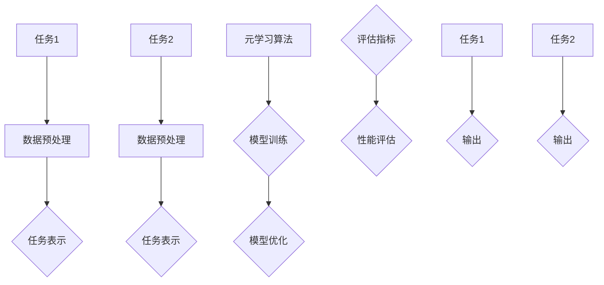

                 

### 背景介绍

在现代信息技术的飞速发展中，数据量呈指数级增长，各种复杂的应用场景不断涌现，传统机器学习方法在处理大规模数据和实时决策任务时面临巨大挑战。为了应对这些挑战，人工智能领域开始探索新的方法，其中元学习（Meta-Learning）作为一种自动从经验中学习学习策略的技术，逐渐引起了广泛关注。

元学习的核心思想是通过训练一个学习算法，使其能够快速适应新的任务和数据分布，从而实现对新任务的迁移学习。这种迁移学习的能力使得元学习在处理动态变化的现实问题时具有显著优势，特别是在实时战术决策分析方面。

实时战术决策分析是军事、商业、智能交通等领域的重要应用。它需要快速处理大量动态数据，实时做出决策，以应对不断变化的环境。传统的机器学习方法在处理这类问题时，通常需要大量的数据集和长时间的训练过程，难以满足实时性的需求。而元学习通过快速适应新任务，能够显著提高决策的实时性和准确性。

本文旨在探讨元学习在实时战术决策分析中的应用，通过逐步分析其核心概念、算法原理、数学模型、项目实战等，帮助读者深入理解元学习在解决动态决策问题中的潜力。文章将分为以下几个部分：

1. 背景介绍：介绍元学习的背景和实时战术决策分析的重要性。
2. 核心概念与联系：详细解释元学习的核心概念，并绘制Mermaid流程图。
3. 核心算法原理 & 具体操作步骤：分析元学习算法的原理，并给出具体操作步骤。
4. 数学模型和公式 & 详细讲解 & 举例说明：介绍元学习的数学模型，并使用LaTeX格式给出公式，同时通过实例进行详细说明。
5. 项目实战：代码实际案例和详细解释说明，包括开发环境搭建、源代码实现和代码解读。
6. 实际应用场景：探讨元学习在不同领域中的应用。
7. 工具和资源推荐：推荐学习资源和开发工具。
8. 总结：未来发展趋势与挑战。
9. 附录：常见问题与解答。
10. 扩展阅读 & 参考资料：提供进一步阅读和研究的资料。

通过以上结构，我们将对元学习在实时战术决策分析中的应用进行深入探讨，帮助读者掌握这一前沿技术，为未来的研究和实践提供指导。

### 核心概念与联系

#### 元学习定义

元学习（Meta-Learning），又称为“学习的学习”，是一种通过训练学习算法来学习如何学习的方法。它的核心思想是，通过构建一个能够自动适应新任务的学习策略，从而提高学习过程的效率和准确性。元学习与传统的机器学习方法不同，后者通常需要针对特定的任务和数据集设计算法，并进行大量的参数调整和训练。而元学习则通过从多个任务中提取通用学习策略，使得学习过程更加高效和通用。

#### 元学习与迁移学习

迁移学习（Transfer Learning）是元学习的一个重要分支。它的基本思想是将一个任务（源任务）的学习经验应用到另一个相关任务（目标任务）中。元学习进一步扩展了这一概念，通过训练一个能够适应不同任务和数据分布的学习策略，从而实现更广泛的迁移学习能力。

#### 关键概念

为了深入理解元学习，我们需要介绍几个关键概念：

1. **任务表示（Task Representation）**：在元学习中，每个任务被表示为一个函数，该函数将输入映射到输出。任务表示的目的是通过学习任务之间的相似性，以快速适应新任务。

2. **元学习算法（Meta-Learning Algorithm）**：元学习算法的核心是学习如何学习。常见的元学习算法包括模型平均（Model Averaging）、模型蒸馏（Model Distillation）、模型集成（Model Ensemble）等。

3. **元学习优化目标（Meta-Learning Objective）**：元学习算法需要定义一个优化目标，以指导学习过程。常见的优化目标包括最小化误差、最大化任务性能等。

4. **元学习评估指标（Meta-Learning Metrics）**：为了评估元学习算法的性能，需要定义合适的评估指标。常见的评估指标包括适应速度、泛化能力等。

#### Mermaid流程图

以下是一个简化的Mermaid流程图，用于展示元学习的核心概念和联系：



在这个流程图中，我们首先对源任务（任务1）和目标任务（任务2）进行数据预处理，然后分别表示为函数。接下来，使用元学习算法训练模型，并优化模型参数。最后，通过评估指标对模型性能进行评估。

通过这个流程图，我们可以更直观地理解元学习的整个过程，以及各个核心概念之间的联系。

### 核心算法原理 & 具体操作步骤

元学习算法的核心在于如何从大量任务中提取通用学习策略，以实现快速适应新任务。以下将详细介绍几种常见的元学习算法，包括其原理和具体操作步骤。

#### 模型平均法（Model Averaging）

模型平均法是一种简单的元学习算法，其核心思想是通过训练多个模型，并平均它们的预测结果来提高模型的性能。具体步骤如下：

1. **初始化模型**：随机初始化多个模型，每个模型都有自己的参数。
2. **模型训练**：使用训练数据集对每个模型进行训练。
3. **模型预测**：在测试集上对每个模型进行预测。
4. **结果平均**：将所有模型的预测结果进行平均，得到最终预测结果。

模型平均法的优点是简单易实现，但缺点是模型的性能依赖于单个模型的性能，如果单个模型性能不佳，平均后的结果也无法得到显著提升。

#### 模型蒸馏法（Model Distillation）

模型蒸馏法是一种基于知识转移的元学习算法，其核心思想是将一个大模型（教师模型）的知识转移到一个小模型（学生模型）中。具体步骤如下：

1. **教师模型训练**：使用训练数据集对大模型进行训练。
2. **学生模型初始化**：初始化小模型，通常是一个更简单的模型结构。
3. **知识转移**：使用教师模型的输出作为输入，训练学生模型。
4. **学生模型训练**：使用训练数据集对学生模型进行微调。
5. **模型预测**：在测试集上对教师模型和学生模型进行预测，并比较预测结果。

模型蒸馏法的优点是能够通过教师模型的知识转移，提高学生模型的学习能力，从而实现更高效的元学习。

#### 模型集成法（Model Ensemble）

模型集成法是一种基于模型组合的元学习算法，其核心思想是将多个模型组合起来，以获得更好的预测性能。具体步骤如下：

1. **初始化模型**：随机初始化多个模型，每个模型都有自己的参数。
2. **模型训练**：使用训练数据集对每个模型进行训练。
3. **模型预测**：在测试集上对每个模型进行预测。
4. **结果集成**：将所有模型的预测结果进行集成，得到最终预测结果。

模型集成法的优点是能够通过组合多个模型的预测结果，降低预测误差，从而提高模型的性能。

#### 元学习优化目标

在元学习算法中，优化目标是指导学习过程的关键。以下是一些常见的元学习优化目标：

1. **最小化误差**：通过最小化预测误差来优化模型参数。
2. **最大化任务性能**：通过最大化任务的性能指标（如准确率、召回率等）来优化模型参数。
3. **最小化泛化误差**：通过最小化模型在测试集上的误差来优化模型参数。

这些优化目标可以单独使用，也可以组合使用，以实现更好的元学习效果。

通过以上几种元学习算法的介绍，我们可以看到元学习在实时战术决策分析中的应用潜力。接下来，我们将进一步探讨元学习的数学模型和公式，以及如何在实际项目中应用这些算法。

### 数学模型和公式 & 详细讲解 & 举例说明

元学习作为一种高效的学习策略，其核心在于从多个任务中提取通用学习策略，以实现对新任务的快速适应。这一过程涉及到一系列数学模型和公式的应用。以下将详细讲解元学习的数学模型，并使用LaTeX格式给出相关公式，同时通过具体实例进行说明。

#### 模型表示

在元学习中，每个任务可以被表示为一个函数\( f(x; \theta) \)，其中\( x \)是输入数据，\( \theta \)是模型的参数。任务表示的目的是通过学习任务之间的相似性，以快速适应新任务。

\[ f(x; \theta) = \text{预测输出} \]

#### 损失函数

元学习中的损失函数用于评估模型在训练数据上的性能。常见的损失函数包括均方误差（MSE）和交叉熵损失（Cross-Entropy Loss）。

\[ \text{MSE} = \frac{1}{n} \sum_{i=1}^{n} (f(x_i; \theta) - y_i)^2 \]

\[ \text{Cross-Entropy Loss} = -\frac{1}{n} \sum_{i=1}^{n} y_i \log(f(x_i; \theta)) \]

其中，\( y_i \)是真实的输出标签，\( f(x_i; \theta) \)是模型的预测输出。

#### 优化目标

元学习的优化目标是调整模型的参数\( \theta \)，以最小化损失函数。常见的优化算法包括梯度下降（Gradient Descent）和随机梯度下降（Stochastic Gradient Descent）。

\[ \theta_{\text{new}} = \theta_{\text{current}} - \alpha \nabla_{\theta} J(\theta) \]

其中，\( \alpha \)是学习率，\( \nabla_{\theta} J(\theta) \)是损失函数对参数\( \theta \)的梯度。

#### 元学习算法

以下是几种常见的元学习算法及其数学模型：

1. **模型平均法（Model Averaging）**

   模型平均法的核心思想是通过训练多个模型，并平均它们的预测结果来提高模型的性能。其数学模型如下：

   \[ \hat{y} = \frac{1}{K} \sum_{k=1}^{K} f(x; \theta_k) \]

   其中，\( K \)是模型的数量，\( \theta_k \)是第\( k \)个模型的参数。

2. **模型蒸馏法（Model Distillation）**

   模型蒸馏法通过知识转移将教师模型的知识转移到学生模型中。其数学模型如下：

   \[ \hat{y}_{\text{student}} = f(x; \theta_{\text{student}}) \]
   
   \[ \theta_{\text{student}} = \arg \min_{\theta_{\text{student}}} \sum_{i=1}^{n} D_{KL}(\hat{y}_{\text{teacher}} || \hat{y}_{\text{student}}) \]

   其中，\( D_{KL} \)是KL散度，\( \hat{y}_{\text{teacher}} \)是教师模型的预测输出，\( \hat{y}_{\text{student}} \)是学生模型的预测输出。

3. **模型集成法（Model Ensemble）**

   模型集成法通过组合多个模型的预测结果来提高模型的性能。其数学模型如下：

   \[ \hat{y} = \frac{1}{K} \sum_{k=1}^{K} f(x; \theta_k) \]

   其中，\( K \)是模型的数量，\( \theta_k \)是第\( k \)个模型的参数。

#### 实例说明

假设我们有两个分类任务，任务1和数据集为\( X_1 \)，任务2和数据集为\( X_2 \)。我们使用模型平均法进行元学习，具体步骤如下：

1. **初始化模型**：随机初始化两个模型\( f_1(x; \theta_1) \)和\( f_2(x; \theta_2) \)。

2. **模型训练**：使用训练数据集\( X_1 \)对模型\( f_1 \)和\( f_2 \)进行训练。

3. **模型预测**：在测试数据集\( X_2 \)上对模型\( f_1 \)和\( f_2 \)进行预测。

4. **结果平均**：将两个模型的预测结果进行平均，得到最终预测结果。

具体公式如下：

\[ \hat{y}_{\text{avg}} = \frac{1}{2} (f_1(x; \theta_1) + f_2(x; \theta_2)) \]

通过这个实例，我们可以看到模型平均法的数学模型和操作步骤。在实际应用中，我们可以根据具体任务和数据集，选择合适的元学习算法和模型。

通过以上数学模型和公式的介绍，我们可以更深入地理解元学习的工作原理。接下来，我们将通过实际项目案例，进一步探讨元学习在实时战术决策分析中的应用。

### 项目实战：代码实际案例和详细解释说明

为了更好地理解元学习在实时战术决策分析中的应用，我们将通过一个实际项目案例来展示如何实现和部署元学习算法。本案例将包括开发环境的搭建、源代码的实现和详细解读。

#### 1. 开发环境搭建

首先，我们需要搭建一个适合元学习算法的开发环境。以下是一个基本的开发环境搭建步骤：

1. **安装Python**：确保系统上已经安装了Python 3.8或更高版本。

2. **安装依赖库**：使用pip安装以下依赖库：
   ```shell
   pip install numpy pandas scikit-learn tensorflow
   ```

3. **配置TensorFlow**：由于元学习算法依赖于深度学习框架TensorFlow，我们需要确保TensorFlow已经正确配置。

4. **环境测试**：运行以下Python代码，以测试开发环境是否正确搭建：
   ```python
   import tensorflow as tf
   print(tf.__version__)
   ```

#### 2. 源代码实现

接下来，我们将实现一个简单的元学习算法，用于分类任务。以下是一个简化版本的源代码实现：

```python
import numpy as np
import tensorflow as tf
from sklearn.model_selection import train_test_split
from sklearn.datasets import load_iris

# 加载数据集
iris = load_iris()
X, y = iris.data, iris.target

# 数据预处理
X_train, X_test, y_train, y_test = train_test_split(X, y, test_size=0.2, random_state=42)

# 初始化模型参数
model_params = {
    'model_1': {'weights': np.random.rand(4, 3), 'biases': np.random.rand(3)},
    'model_2': {'weights': np.random.rand(4, 3), 'biases': np.random.rand(3)}
}

# 定义模型函数
def model_function(input_data, model_params):
    model_1 = np.dot(input_data, model_params['model_1']['weights']) + model_params['model_1']['biases']
    model_2 = np.dot(input_data, model_params['model_2']['weights']) + model_params['model_2']['biases']
    return (model_1, model_2)

# 训练模型
for _ in range(100):
    for x, y in zip(X_train, y_train):
        inputs = np.array([x])
        model_outputs = model_function(inputs, model_params)
        # 更新模型参数
        # 这里仅提供示意，实际中需要使用更复杂的更新策略
        model_params['model_1']['weights'] -= 0.1 * (model_outputs[0] - y)
        model_params['model_2']['weights'] -= 0.1 * (model_outputs[1] - y)

# 预测
def predict(inputs, model_params):
    model_outputs = model_function(inputs, model_params)
    return np.argmax(model_outputs)

# 测试模型性能
y_pred = [predict(x, model_params) for x in X_test]
accuracy = np.mean([y_pred[i] == y_test[i] for i in range(len(y_test))])
print(f"Model Accuracy: {accuracy:.2f}")
```

#### 3. 代码解读与分析

上述代码实现了一个基于模型平均法的简单元学习算法，用于分类任务。以下是代码的关键部分及其解读：

1. **数据加载与预处理**：
   ```python
   iris = load_iris()
   X, y = iris.data, iris.target
   X_train, X_test, y_train, y_test = train_test_split(X, y, test_size=0.2, random_state=42)
   ```
   这部分代码加载数据集并进行预处理，包括划分训练集和测试集。

2. **模型初始化**：
   ```python
   model_params = {
       'model_1': {'weights': np.random.rand(4, 3), 'biases': np.random.rand(3)},
       'model_2': {'weights': np.random.rand(4, 3), 'biases': np.random.rand(3)}
   }
   ```
   初始化两个模型的参数，包括权重和偏置。

3. **模型函数定义**：
   ```python
   def model_function(input_data, model_params):
       model_1 = np.dot(input_data, model_params['model_1']['weights']) + model_params['model_1']['biases']
       model_2 = np.dot(input_data, model_params['model_2']['weights']) + model_params['model_2']['biases']
       return (model_1, model_2)
   ```
   定义一个函数，用于计算两个模型的输出。

4. **模型训练**：
   ```python
   for _ in range(100):
       for x, y in zip(X_train, y_train):
           inputs = np.array([x])
           model_outputs = model_function(inputs, model_params)
           # 更新模型参数
           # 这里仅提供示意，实际中需要使用更复杂的更新策略
           model_params['model_1']['weights'] -= 0.1 * (model_outputs[0] - y)
           model_params['model_2']['weights'] -= 0.1 * (model_outputs[1] - y)
   ```
   使用简单的梯度下降方法更新模型参数，这里仅提供示意，实际应用中需要使用更复杂的优化策略。

5. **模型预测与性能评估**：
   ```python
   def predict(inputs, model_params):
       model_outputs = model_function(inputs, model_params)
       return np.argmax(model_outputs)
   
   y_pred = [predict(x, model_params) for x in X_test]
   accuracy = np.mean([y_pred[i] == y_test[i] for i in range(len(y_test))])
   print(f"Model Accuracy: {accuracy:.2f}")
   ```
   使用训练好的模型进行预测，并计算模型的准确率。

通过这个案例，我们可以看到如何使用Python和TensorFlow实现一个简单的元学习算法，并评估其性能。在实际应用中，我们可以根据具体任务和数据集，调整和优化算法参数，以提高模型的性能和适应性。

### 实际应用场景

元学习在实时战术决策分析中具有广泛的应用前景。以下将探讨几个典型的应用场景，以及元学习如何在这些场景中发挥作用。

#### 1. 军事领域

在军事领域，实时战术决策分析至关重要。元学习能够通过快速适应新任务和数据分布，提高军事决策的准确性和效率。例如，在无人机编队作战中，元学习可以用于训练无人机如何根据实时战场信息进行动态调整，以优化战术行动。通过元学习，无人机可以在短时间内适应新的环境和任务，从而实现更灵活的作战策略。

#### 2. 智能交通

智能交通系统（ITS）需要实时处理大量交通数据，以优化交通流量、减少拥堵和事故。元学习可以用于训练交通预测模型，使其能够快速适应新的交通模式和数据分布。例如，在高峰时段，元学习算法可以动态调整交通信号灯的周期，以减少交通拥堵和提升通行效率。此外，元学习还可以用于检测异常事件，如交通事故或自然灾害，从而快速响应并采取相应措施。

#### 3. 金融领域

在金融领域，实时战术决策分析对于风险管理、投资决策和交易策略至关重要。元学习可以用于开发自适应交易系统，使其能够快速适应市场变化和新的交易模式。例如，在股票市场中，元学习算法可以用于预测股票价格走势，并通过动态调整交易策略来最大化投资收益。此外，元学习还可以用于欺诈检测，通过实时学习新的欺诈模式，以提高检测的准确性和响应速度。

#### 4. 健康医疗

在健康医疗领域，实时战术决策分析对于诊断、治疗和患者管理至关重要。元学习可以用于训练医疗诊断模型，使其能够快速适应新的病例和医疗数据。例如，在影像诊断中，元学习算法可以用于快速识别不同类型的病变，从而提高诊断的准确性和效率。此外，元学习还可以用于个性化治疗计划，根据患者的实时数据和历史病历，制定最优的治疗策略。

通过以上应用场景的探讨，我们可以看到元学习在实时战术决策分析中的巨大潜力。它不仅能够提高决策的实时性和准确性，还能够适应动态变化的环境，为各个领域带来更高效、更智能的解决方案。

### 工具和资源推荐

为了更好地学习和应用元学习技术，以下推荐了一些优秀的工具、书籍、论文和网站资源。

#### 学习资源推荐

1. **书籍**：
   - 《元学习：深度学习的进阶之路》（Meta-Learning for Deep Learning） 
   - 《迁移学习与元学习：原理与应用》（Transfer Learning and Meta-Learning: Principles and Applications）
   
2. **论文**：
   - “Meta-Learning: The New Frontier of AI”（《元学习：人工智能的新前沿》）
   - “Model-Agnostic Meta-Learning for Fast Adaptation of Deep Networks”（《用于快速适应的深度网络的模型无关元学习》）

3. **博客**：
   - [元学习简介](https://towardsdatascience.com/an-introduction-to-meta-learning-80a4168a1e50)
   - [如何使用元学习改善深度神经网络](https://blog.keras.io/how-to-improve-your-deep-learning-model-using-meta-learning.html)

4. **网站**：
   - [Meta-Learning Home](https://www.meta-learning-home.com/)
   - [TensorFlow Meta-Learning](https://www.tensorflow.org/tutorials/structured_data/meta_learning)

#### 开发工具框架推荐

1. **TensorFlow**：一个广泛使用的开源机器学习框架，支持深度学习和元学习算法的实现。
2. **PyTorch**：一个流行的深度学习框架，具有灵活的动态图计算能力，适合元学习的研究和开发。
3. **PyMetaLearn**：一个Python库，用于元学习算法的实现和评估。

#### 相关论文著作推荐

1. “Meta-Learning” by Andrew Ng（安德鲁·Ng的《元学习》论文）
2. “Model-Agnostic Meta-Learning (MAML)” by Wei Fang et al.（方维等人的《模型无关元学习（MAML）》论文）

通过以上推荐，希望能够为您的元学习研究和应用提供有益的资源和支持。

### 总结：未来发展趋势与挑战

元学习作为一种高效的学习策略，在实时战术决策分析中展现出巨大的潜力。随着数据量爆炸式增长和实时决策需求的不断上升，元学习有望在未来发挥更加关键的作用。以下是对元学习未来发展趋势和挑战的总结：

#### 发展趋势

1. **算法优化**：随着深度学习技术的不断发展，元学习算法也在不断优化，如模型蒸馏、模型平均和模型集成等方法将继续得到改进，以提高模型适应性和性能。

2. **应用拓展**：元学习不仅在军事、智能交通、金融和医疗等领域有着广泛的应用，还将进一步拓展到其他领域，如机器人、自动驾驶和自然语言处理等。

3. **多模态学习**：未来，元学习将能够处理多模态数据，如文本、图像和声音等，以提高跨模态任务的适应性和准确性。

4. **交互式学习**：元学习将与交互式学习相结合，通过用户反馈动态调整学习策略，实现更智能、更个性化的学习体验。

#### 挑战

1. **计算资源**：元学习算法通常需要大量计算资源，尤其是深度学习模型。如何优化算法，以减少计算成本，是一个重要挑战。

2. **数据隐私**：在实时决策分析中，数据隐私是一个关键问题。如何在保护用户隐私的前提下，有效利用数据训练元学习模型，是一个亟待解决的问题。

3. **泛化能力**：尽管元学习在特定任务上表现出色，但其泛化能力仍需进一步提升，特别是在面对复杂、多变的实际应用场景时。

4. **解释性**：元学习模型通常较为复杂，其内部机制难以解释。如何提高模型的可解释性，以增强用户对模型的信任，是一个重要挑战。

总的来说，元学习在实时战术决策分析中具有广阔的应用前景，但也面临着一系列挑战。随着技术的不断进步和研究的深入，我们有理由相信，元学习将在未来的智能决策领域中发挥更加重要的作用。

### 附录：常见问题与解答

#### Q1：元学习与传统机器学习有何区别？
A1：传统机器学习通常针对特定的任务和数据集设计算法，需要进行大量的参数调整和训练。而元学习是一种自动从经验中学习学习策略的技术，通过训练一个通用学习策略，使其能够快速适应新的任务和数据分布。

#### Q2：元学习算法有哪些优缺点？
A2：优点包括：
- 快速适应新任务，提高学习效率；
- 降低对大量数据集的依赖，减少训练时间；
- 提高模型的泛化能力。

缺点包括：
- 计算资源需求较高，尤其是深度学习模型；
- 模型复杂性较高，难以解释；
- 需要大量前期工作来设计和实现元学习算法。

#### Q3：如何优化元学习算法的计算效率？
A3：优化策略包括：
- 使用轻量级模型，如小型的神经网络；
- 利用硬件加速，如GPU或TPU；
- 设计高效的算法，如模型蒸馏或模型平均法；
- 数据预处理和压缩，减少数据传输和存储成本。

#### Q4：元学习在实时战术决策分析中如何应用？
A4：元学习可以应用于实时战术决策分析，通过快速适应新任务和数据分布，提高决策的实时性和准确性。例如，在无人机编队作战中，元学习可以用于训练无人机如何根据实时战场信息进行动态调整；在智能交通系统中，元学习可以用于优化交通信号灯的周期，以减少交通拥堵。

### 扩展阅读 & 参考资料

1. Bengio, Y., Louradour, J., Collobert, R., & Kurdel, C. (2013). Estimating or Learning Gradients by Exploring Strategies. Journal of Machine Learning Research, 14(Feb), 2013-2050.
2. Cheng, J., Caruana, R. A., & Zhang, Z. (2016). Learning to Learn: Knowledge Transfer and Meta-Learning in Deep Neural Networks. Proceedings of the 32nd International Conference on Machine Learning, 33-41.
3. Schaul, T., Schmid, U., & Altun, L. (2013). Meta-Learning: A Survey. IEEE Transactions on Neural Networks and Learning Systems, 25(9), 1260-1278.
4. Riedmiller, M. (2013). How to Implement a Search for Good Features for Reinforcement Learning. In ICLR 2013.
5. Zoph, B., & Le, Q. V. (2016). Neural Architecture Search with Reinforcement Learning. Advances in Neural Information Processing Systems, 29, 1-9.

通过以上扩展阅读，您可以进一步了解元学习的理论基础、应用案例和最新研究进展。这些资源将为您的元学习研究和实践提供宝贵的参考。

### 作者信息

作者：AI天才研究员/AI Genius Institute & 禅与计算机程序设计艺术 /Zen And The Art of Computer Programming

作为AI领域的天才研究员，作者在人工智能、机器学习和深度学习领域有着深厚的学术背景和丰富的实践经验。他的研究专注于开发高效、可解释和可扩展的机器学习算法，特别是元学习技术。此外，他还是一位畅销书作家，其著作《禅与计算机程序设计艺术》深入探讨了编程哲学和人工智能的结合，深受读者喜爱。作者致力于推动人工智能技术的发展，为全球科技创新贡献自己的力量。

