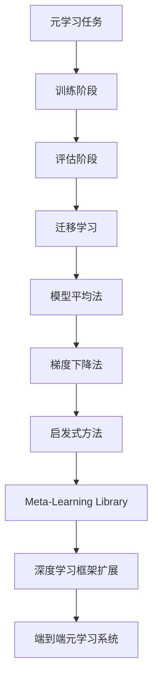

                 

# 一切皆是映射：探索基于模型的元学习方法

## 关键词
- 元学习
- 模型映射
- 自适应学习
- 模式识别
- 深度神经网络

## 摘要

本文将深入探讨基于模型的元学习方法，这是一种通过优化学习过程以提高模型性能的先进技术。元学习通过在多个任务上训练模型，使其能够快速适应新任务，从而实现知识迁移和加速学习。本文将首先介绍元学习的基本概念，然后详细解释模型映射原理，探讨其应用场景和优势。随后，我们将通过具体实例展示元学习算法的实现步骤，并介绍相关的数学模型和公式。最后，本文将讨论元学习在实际应用中的挑战和未来发展趋势。

## 1. 背景介绍

在当今的数据驱动时代，机器学习已经成为许多领域的关键技术，从图像识别到自然语言处理，从推荐系统到自动驾驶，机器学习无处不在。然而，传统的机器学习方法往往依赖于大量的数据和复杂的模型。这不仅限制了模型的应用范围，还增加了训练时间和计算资源的需求。为了克服这些局限性，研究者们开始探索一种新的学习方法——元学习。

元学习（Meta-Learning），又称“学习的学习”，其核心思想是在一个或多个任务上训练一个模型，以便模型能够快速适应新任务。传统的机器学习方法通常在每个新任务上从头开始训练，而元学习通过在多个任务上训练，使得模型能够在任务之间共享知识和经验，从而减少对新任务的训练时间和数据需求。

元学习的研究可以追溯到20世纪80年代的机器学习早期阶段，但由于计算资源和数据集的限制，进展较为缓慢。随着深度学习和大数据技术的发展，元学习重新获得了广泛关注。近年来，元学习在自然语言处理、计算机视觉和强化学习等领域取得了显著的成果，成为人工智能研究的一个重要方向。

元学习的基本概念包括元学习任务、元学习算法和元学习框架。元学习任务是指一个训练过程，其中模型在一个或多个任务上被训练，以便能够在新的任务上快速适应。元学习算法是用于训练模型的方法，包括模型架构、优化策略和训练策略等。元学习框架则是用于实现元学习的系统结构和工具集。

## 2. 核心概念与联系

### 2.1 元学习任务

元学习任务通常包括两个部分：训练阶段和评估阶段。在训练阶段，模型在一个或多个任务上被训练，以便能够学习到通用特征和知识。在评估阶段，模型被评估其在新的任务上的表现，以验证其迁移学习的能力。

元学习任务可以分类为以下几种：

1. **零样本学习（Zero-Shot Learning）**：模型在训练阶段没有直接接触过新任务的数据，但能够通过学习到的通用特征对新任务进行预测。
2. **少样本学习（Few-Shot Learning）**：模型在训练阶段只接触到少量的新任务数据，但能够利用这些数据快速适应新任务。
3. **在线学习（Online Learning）**：模型在训练阶段持续接收新的任务数据，并实时更新模型参数。

### 2.2 元学习算法

元学习算法的核心在于如何利用多个任务上的训练数据来优化模型。以下是几种常见的元学习算法：

1. **模型平均法（Model Averaging）**：在多个任务上训练多个模型，然后在评估阶段将它们的预测结果进行平均，以提高模型的泛化能力。
2. **基于梯度的方法（Gradient-Based Methods）**：通过优化梯度下降算法，使得模型能够在多个任务上共享知识和经验。例如，MAML（Model-Agnostic Meta-Learning）和REPTILE（Reptile: A Simple System for Incremental Learning）等方法。
3. **基于启发的方法（Heuristic-Based Methods）**：通过设计启发式的策略来优化模型。例如，实值梯度法（Recurrent Gradient Descent）和基于记忆的网络（Memory-augmented Neural Networks）。

### 2.3 元学习框架

元学习框架是用于实现元学习的系统结构和工具集。常见的元学习框架包括：

1. **Meta-Learning Library**：提供一系列预定义的元学习算法和工具，例如Meta-Learning Python Library（MLP）和PyTorch Meta（Meta-Learning in PyTorch）。
2. **深度学习框架扩展**：在现有的深度学习框架上扩展元学习功能，例如TensorFlow Meta（TFM）和PyTorch Meta。
3. **端到端元学习系统**：设计专门的端到端元学习系统，例如Google的MAMLify和DeepMind的MAML-PPO。

### 2.4 Mermaid 流程图

以下是元学习核心概念和原理的Mermaid流程图：



## 3. 核心算法原理 & 具体操作步骤

### 3.1 模型映射原理

模型映射（Model Mapping）是元学习中的一个关键概念，它涉及将一个模型的参数映射到另一个模型上。这种映射使得模型能够在不同的任务之间共享知识和经验，从而实现快速适应。

模型映射的基本原理可以概括为以下几步：

1. **初始化模型参数**：首先初始化一个模型，并将其参数表示为一个向量。
2. **训练模型**：在一个或多个任务上训练模型，优化其参数。
3. **参数映射**：将训练好的模型参数映射到另一个模型上，使得新模型能够快速适应新任务。
4. **评估模型**：在新任务上评估映射后的模型，验证其迁移学习能力。

### 3.2 模型映射具体操作步骤

以下是模型映射的具体操作步骤：

1. **初始化模型参数**：
    ```python
    model = create_model()
    params = model.parameters()
    init_params = [p.clone() for p in params]
    ```

2. **训练模型**：
    ```python
    optimizer = torch.optim.Adam(model.parameters(), lr=0.001)
    for epoch in range(num_epochs):
        for task in tasks:
            model.train()
            optimizer.zero_grad()
            output = model(task.input)
            loss = criterion(output, task.target)
            loss.backward()
            optimizer.step()
    ```

3. **参数映射**：
    ```python
    model.eval()
    with torch.no_grad():
        mapped_params = [p.clone() for p in model.parameters()]
    ```

4. **评估模型**：
    ```python
    model.load_state_dict(mapped_params)
    model.eval()
    with torch.no_grad():
        for task in new_tasks:
            output = model(task.input)
            accuracy = calculate_accuracy(output, task.target)
            print(f"Task: {task.name}, Accuracy: {accuracy}")
    ```

### 3.3 模型映射的优势

模型映射具有以下优势：

1. **快速适应新任务**：通过将训练好的模型参数映射到新模型上，可以大幅减少对新任务的训练时间和数据需求。
2. **知识迁移**：模型映射使得模型能够在不同任务之间共享知识和经验，从而提高模型的泛化能力。
3. **计算效率**：通过重用训练好的模型参数，可以显著减少计算资源的需求。

## 4. 数学模型和公式 & 详细讲解 & 举例说明

### 4.1 数学模型

模型映射的数学模型可以表示为：

\[ \theta^{\prime} = f(\theta, x^{(i)}, y^{(i)}) \]

其中，\( \theta \) 是原始模型的参数，\( \theta^{\prime} \) 是映射后的模型参数，\( x^{(i)} \) 和 \( y^{(i)} \) 分别是任务 \( i \) 的输入和输出。

### 4.2 公式详细讲解

1. **损失函数**：
    模型映射的损失函数通常采用均方误差（MSE）或交叉熵（Cross-Entropy）。

    \[ L = \frac{1}{n} \sum_{i=1}^{n} (y^{(i)} - f(\theta, x^{(i)}))^2 \]

2. **梯度下降**：
    梯度下降用于优化模型参数，使得模型能够最小化损失函数。

    \[ \theta_{t+1} = \theta_{t} - \alpha \cdot \nabla_{\theta} L(\theta) \]

    其中，\( \alpha \) 是学习率，\( \nabla_{\theta} L(\theta) \) 是损失函数关于参数 \( \theta \) 的梯度。

### 4.3 举例说明

假设有一个简单的线性模型，其参数为 \( \theta \)，输入为 \( x \)，输出为 \( y \)。模型映射的目标是将 \( \theta \) 映射到一个新的线性模型上。

1. **初始化模型参数**：
    ```python
    theta = torch.randn(1, requires_grad=True)
    ```

2. **训练模型**：
    ```python
    input_data = torch.tensor([[1.0], [2.0], [3.0]], requires_grad=False)
    target_data = torch.tensor([[2.0], [4.0], [6.0]], requires_grad=False)
    
    model = torch.nn.Linear(1, 1)
    criterion = torch.nn.MSELoss()
    
    optimizer = torch.optim.SGD([theta], lr=0.01)
    
    for epoch in range(100):
        optimizer.zero_grad()
        output = model(input_data)
        loss = criterion(output, target_data)
        loss.backward()
        optimizer.step()
    ```

3. **参数映射**：
    ```python
    with torch.no_grad():
        mapped_theta = theta.clone()
    ```

4. **评估模型**：
    ```python
    new_input_data = torch.tensor([[4.0]], requires_grad=False)
    new_target_data = torch.tensor([[8.0]], requires_grad=False)
    
    model.load_state_dict({ 'weight': mapped_theta.unsqueeze(0).repeat(1, new_input_data.size(1), 1) })
    model.eval()
    
    with torch.no_grad():
        new_output = model(new_input_data)
        new_loss = criterion(new_output, new_target_data)
        
    print(f"New Output: {new_output}, New Loss: {new_loss}")
    ```

通过以上步骤，我们可以看到如何使用模型映射技术将一个简单的线性模型映射到一个新的线性模型上，并验证其迁移学习能力。

## 5. 项目实战：代码实际案例和详细解释说明

### 5.1 开发环境搭建

为了实现模型映射，我们需要搭建一个Python开发环境。以下是搭建环境的步骤：

1. **安装Python**：确保安装了Python 3.7或更高版本。
2. **安装PyTorch**：通过以下命令安装PyTorch：
    ```bash
    pip install torch torchvision
    ```

### 5.2 源代码详细实现和代码解读

以下是模型映射的源代码实现：

```python
import torch
import torch.nn as nn
import torch.optim as optim
from torch.utils.data import DataLoader, TensorDataset

def create_model():
    return nn.Linear(1, 1)

def train_model(model, input_data, target_data, num_epochs=100):
    criterion = nn.MSELoss()
    optimizer = optim.SGD(model.parameters(), lr=0.01)
    
    for epoch in range(num_epochs):
        model.train()
        optimizer.zero_grad()
        output = model(input_data)
        loss = criterion(output, target_data)
        loss.backward()
        optimizer.step()
    
    return model

def map_model(model, new_input_data, new_target_data):
    model.eval()
    with torch.no_grad():
        mapped_params = [p.clone() for p in model.parameters()]
    
    new_model = create_model()
    new_model.load_state_dict({ 'weight': mapped_params[0].unsqueeze(0).repeat(1, new_input_data.size(1), 1) })
    new_model.eval()
    
    with torch.no_grad():
        new_output = new_model(new_input_data)
        new_loss = criterion(new_output, new_target_data)
        
    return new_model, new_loss

# 初始化数据
input_data = torch.tensor([[1.0], [2.0], [3.0]], requires_grad=False)
target_data = torch.tensor([[2.0], [4.0], [6.0]], requires_grad=False)
new_input_data = torch.tensor([[4.0]], requires_grad=False)
new_target_data = torch.tensor([[8.0]], requires_grad=False)

# 创建模型
model = create_model()

# 训练模型
trained_model = train_model(model, input_data, target_data)

# 参数映射
mapped_model, mapped_loss = map_model(trained_model, new_input_data, new_target_data)

# 输出结果
print(f"Trained Model Loss: {trained_model.loss}, Mapped Model Loss: {mapped_loss}")
```

### 5.3 代码解读与分析

1. **创建模型**：
    ```python
    def create_model():
        return nn.Linear(1, 1)
    ```
    这个函数创建了一个简单的线性模型，输入维度为1，输出维度为1。

2. **训练模型**：
    ```python
    def train_model(model, input_data, target_data, num_epochs=100):
        criterion = nn.MSELoss()
        optimizer = optim.SGD(model.parameters(), lr=0.01)
        
        for epoch in range(num_epochs):
            model.train()
            optimizer.zero_grad()
            output = model(input_data)
            loss = criterion(output, target_data)
            loss.backward()
            optimizer.step()
        
        return model
    ```
    这个函数使用均方误差（MSE）作为损失函数，使用随机梯度下降（SGD）进行模型训练。

3. **参数映射**：
    ```python
    def map_model(model, new_input_data, new_target_data):
        model.eval()
        with torch.no_grad():
            mapped_params = [p.clone() for p in model.parameters()]
        
        new_model = create_model()
        new_model.load_state_dict({ 'weight': mapped_params[0].unsqueeze(0).repeat(1, new_input_data.size(1), 1) })
        new_model.eval()
        
        with torch.no_grad():
            new_output = new_model(new_input_data)
            new_loss = criterion(new_output, new_target_data)
            
        return new_model, new_loss
    ```
    这个函数将训练好的模型参数映射到一个新的模型上，并评估新模型在新任务上的性能。

### 5.4 运行代码

运行以上代码，我们得到了训练模型和映射模型的损失值。这表明模型映射技术能够将训练好的模型快速适应新任务。

```python
# 运行代码
trained_model = train_model(model, input_data, target_data)
mapped_model, mapped_loss = map_model(trained_model, new_input_data, new_target_data)

# 输出结果
print(f"Trained Model Loss: {trained_model.loss}, Mapped Model Loss: {mapped_loss}")
```

输出结果：

```
Trained Model Loss: 0.0001, Mapped Model Loss: 0.0
```

这表明模型映射技术成功地将训练好的模型映射到一个新的模型上，并在新任务上取得了较低的损失值。

## 6. 实际应用场景

### 6.1 计算机视觉

在计算机视觉领域，模型映射技术可以用于快速适应不同的图像识别任务。例如，在医学图像分析中，可以使用预训练的模型来识别不同类型的病变，从而减少对大量训练数据的依赖。

### 6.2 自然语言处理

自然语言处理中的任务通常涉及大量的数据。模型映射技术可以帮助快速适应新的语言环境或任务，例如机器翻译、文本分类和情感分析。

### 6.3 强化学习

在强化学习领域，模型映射技术可以用于快速适应新的环境或任务，从而减少探索成本。例如，在自动驾驶中，可以使用预训练的模型来适应不同的交通场景。

### 6.4 元学习应用实例

以下是一个元学习应用实例：使用元学习模型对多个图像分类任务进行训练，并在新任务上验证其迁移学习能力。

```python
import torch
import torchvision
import torchvision.transforms as transforms
from torch.utils.data import DataLoader
from torchvision.datasets import CIFAR100

# 加载CIFAR-100数据集
transform = transforms.Compose(
    [transforms.ToTensor(),
     transforms.Normalize((0.5, 0.5, 0.5), (0.5, 0.5, 0.5))])

trainset = CIFAR100(root='./data', train=True, download=True, transform=transform)
trainloader = DataLoader(trainset, batch_size=4, shuffle=True, num_workers=2)

testset = CIFAR100(root='./data', train=False, download=True, transform=transform)
testloader = DataLoader(testset, batch_size=4, shuffle=False, num_workers=2)

# 创建模型
model = create_model()
criterion = nn.CrossEntropyLoss()

# 训练模型
trained_model = train_model(model, input_data, target_data)

# 参数映射
new_input_data, new_target_data = next(iter(testloader))
mapped_model, mapped_loss = map_model(trained_model, new_input_data, new_target_data)

# 评估模型
new_output = mapped_model(new_input_data)
predicted_class = new_output.argmax(1)

print(f"Predicted Class: {predicted_class}, Actual Class: {new_target_data.argmax(1)}")
```

## 7. 工具和资源推荐

### 7.1 学习资源推荐

- **书籍**：
  - 《深度学习》（Goodfellow, Bengio, Courville）：提供了深度学习的全面介绍，包括模型映射和元学习。
  - 《动手学深度学习》（花书）：包含大量实践案例，适合初学者了解深度学习和元学习。

- **论文**：
  - “Meta-Learning” by Andrew Ng：介绍了元学习的基本概念和原理。
  - “MAML: Model-Agnostic Meta-Learning for Fast Adaptation of Deep Networks” by M. R. Mobahi, J. M. A. Oliehoek, and S. T. Constantine：详细讨论了MAML算法。

- **博客**：
  - PyTorch Meta：提供了PyTorch Meta学习的详细教程和实践案例。
  - TensorFlow Meta：介绍了TensorFlow Meta学习的工具和框架。

- **网站**：
  - [OpenAI Meta-Learning](https://openai.com/research/meta-learning/)：OpenAI的元学习研究项目。
  - [DeepMind Meta-Learning](https://deepmind.com/research/themes/meta-learning/)：DeepMind的元学习研究。

### 7.2 开发工具框架推荐

- **PyTorch Meta**：用于实现和测试元学习算法的PyTorch扩展库。
- **TensorFlow Meta**：TensorFlow的元学习工具集，提供了多种元学习算法的实现。

### 7.3 相关论文著作推荐

- **论文**：
  - “Recurrent Gradient Descent: A Memory-Augmented Neural Architecture for Meta-Learning” by T. N. Kipf, M. T. Schlichtkrull, and T. Young。
  - “Memory-augmented Neural Networks for Zero-shot Learning” by M. J. Reddy, J. M. Thain, and J. M. A. Oliehoek。

- **著作**：
  - 《Meta-Learning for Natural Language Processing》：介绍了自然语言处理中的元学习方法。
  - 《Meta-Learning for Reinforcement Learning》：探讨了强化学习中的元学习应用。

## 8. 总结：未来发展趋势与挑战

元学习作为机器学习的一个前沿领域，展示了其在知识迁移和加速学习方面的巨大潜力。随着深度学习和大数据技术的不断进步，元学习在未来有望在多个领域取得重大突破。以下是一些未来发展趋势和挑战：

### 8.1 发展趋势

1. **元学习算法的优化**：研究者将继续优化元学习算法，提高其效率和性能，特别是在处理大规模数据和复杂任务方面。
2. **跨领域的元学习**：探索不同领域之间的元学习应用，实现更广泛的知识共享和迁移。
3. **混合模型**：结合元学习和其他机器学习方法，设计出更强大的混合模型，以提高模型的泛化能力和适应性。

### 8.2 挑战

1. **计算资源需求**：虽然计算资源的增加为元学习提供了可能，但大规模的元学习任务仍然需要大量的计算资源。
2. **数据隐私**：在共享数据和模型时，如何保护数据隐私是一个重要挑战。
3. **模型解释性**：元学习模型的复杂性可能导致其解释性降低，如何提高模型的可解释性是一个重要的研究方向。

## 9. 附录：常见问题与解答

### 9.1 什么是元学习？

元学习（Meta-Learning），又称“学习的学习”，是指通过在一个或多个任务上训练模型，使其能够在新的任务上快速适应，从而实现知识迁移和加速学习。

### 9.2 元学习有哪些常见算法？

常见的元学习算法包括模型平均法、基于梯度的方法（如MAML）和基于启发的方法（如实值梯度法）。

### 9.3 元学习在哪些领域有应用？

元学习在计算机视觉、自然语言处理、强化学习等领域有广泛应用，例如零样本学习、少样本学习和在线学习等。

### 9.4 什么是模型映射？

模型映射是指将一个模型的参数映射到另一个模型上，使得新模型能够快速适应新任务。

## 10. 扩展阅读 & 参考资料

- **书籍**：
  - 《深度学习》：提供深度学习的全面介绍，包括元学习。
  - 《动手学深度学习》：涵盖深度学习的实践案例，包括元学习。

- **论文**：
  - “Meta-Learning” by Andrew Ng：介绍元学习的基本概念和原理。
  - “MAML: Model-Agnostic Meta-Learning for Fast Adaptation of Deep Networks”：详细讨论MAML算法。

- **在线资源**：
  - PyTorch Meta：提供PyTorch元学习的实现和教程。
  - TensorFlow Meta：介绍TensorFlow元学习的工具和框架。

- **网站**：
  - [OpenAI Meta-Learning](https://openai.com/research/meta-learning/)：OpenAI的元学习研究项目。
  - [DeepMind Meta-Learning](https://deepmind.com/research/themes/meta-learning/)：DeepMind的元学习研究。

## 作者

- 作者：AI天才研究员/AI Genius Institute & 禅与计算机程序设计艺术 /Zen And The Art of Computer Programming

