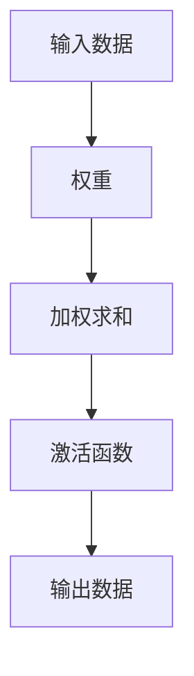

                 

### 文章标题

**《一切皆是映射：构建你自己的神经网络：入门指南》**

### 文章关键词

- 神经网络
- 映射
- 机器学习
- 深度学习
- 编程实践

### 文章摘要

本文旨在为初学者提供一份详细的神经网络构建指南。我们将探讨神经网络的基本原理，如何通过映射来实现复杂的函数关系，并介绍数学模型和实际操作步骤。通过本文的阅读，读者将能够理解神经网络的本质，掌握构建神经网络的基本方法，并能够尝试在自己的项目中应用这些知识。本文还提供了实际代码案例和丰富的学习资源，帮助读者更好地理解和实践神经网络。

---

### 背景介绍

#### 1.1 神经网络的发展历程

神经网络（Neural Networks）的概念最早由心理学家和计算机科学家在20世纪40年代提出。最初的神经网络模型主要基于生物神经系统的原理，试图通过模仿生物神经元之间的连接和通信来实现机器学习。随着计算能力的提升和算法的改进，神经网络在20世纪80年代得到了快速发展，并在21世纪初随着深度学习的兴起而达到了一个新的高度。

#### 1.2 机器学习与深度学习

机器学习（Machine Learning）是人工智能（Artificial Intelligence, AI）的一个重要分支，它通过数据训练模型来让计算机自动执行特定任务。深度学习（Deep Learning）是机器学习的一个子领域，它依赖于多层神经网络模型，通过自动提取特征来学习复杂的数据模式。

#### 1.3 神经网络的应用

神经网络在各个领域都有广泛的应用，包括图像识别、自然语言处理、语音识别、推荐系统等。其强大的处理能力和适应性使得它成为现代人工智能的核心技术之一。

### 2. 核心概念与联系

#### 2.1 神经网络的基本结构

神经网络由多个层次组成，包括输入层、隐藏层和输出层。每一层包含多个神经元，神经元之间通过连接（权重）进行信息传递。


#### 2.2 映射的概念

神经网络通过映射（Mapping）将输入数据映射到输出数据。映射过程包括数据输入、权重调整、激活函数等步骤。



#### 2.3 神经网络的激活函数

激活函数（Activation Function）是神经网络中一个重要的概念。它用于决定神经元是否应该被激活，以及输出数据的范围。常见的激活函数包括 sigmoid、ReLU 和 tanh 等。

```mermaid
graph TD
    A[输入x] --> B[ReLU(x)]
    B --> C[输出y]
```

### 3. 核心算法原理 & 具体操作步骤

#### 3.1 前向传播（Forward Propagation）

前向传播是指将输入数据通过神经网络传递到输出数据的过程。具体步骤如下：

1. **初始化权重和偏置**：随机初始化权重和偏置。
2. **计算输入和输出**：通过权重和偏置计算每个神经元的输入和输出。
3. **应用激活函数**：将每个神经元的输出通过激活函数处理。
4. **计算损失函数**：计算输出与实际结果之间的差异。

#### 3.2 反向传播（Backpropagation）

反向传播是指通过计算输出误差来调整神经网络的权重和偏置。具体步骤如下：

1. **计算误差**：计算输出误差，即实际结果与预测结果之间的差异。
2. **计算梯度**：计算误差关于权重和偏置的梯度。
3. **更新权重和偏置**：使用梯度下降法更新权重和偏置。

#### 3.3 梯度下降（Gradient Descent）

梯度下降是一种优化算法，用于最小化损失函数。具体步骤如下：

1. **计算梯度**：计算损失函数关于参数的梯度。
2. **更新参数**：根据梯度更新参数，以减小损失函数。

### 4. 数学模型和公式 & 详细讲解 & 举例说明

#### 4.1 前向传播

前向传播的数学公式如下：

$$
z = W \cdot x + b \\
a = f(z)
$$

其中，$z$ 是神经元的输入，$W$ 是权重矩阵，$x$ 是输入向量，$b$ 是偏置，$f$ 是激活函数，$a$ 是神经元的输出。

#### 4.2 反向传播

反向传播的数学公式如下：

$$
\delta = \frac{\partial L}{\partial z} \cdot f'(z) \\
dW = \frac{\partial L}{\partial z} \cdot x \\
db = \frac{\partial L}{\partial z}
$$

其中，$\delta$ 是误差项，$L$ 是损失函数，$f'$ 是激活函数的导数。

#### 4.3 梯度下降

梯度下降的数学公式如下：

$$
\theta = \theta - \alpha \cdot \nabla_\theta J(\theta)
$$

其中，$\theta$ 是参数，$\alpha$ 是学习率，$J(\theta)$ 是损失函数。

### 5. 项目实战：代码实际案例和详细解释说明

#### 5.1 开发环境搭建

为了搭建神经网络，我们需要安装以下工具和库：

- Python 3.x
- TensorFlow 或 PyTorch

安装命令如下：

```bash
pip install python==3.8
pip install tensorflow
```

#### 5.2 源代码详细实现和代码解读

以下是一个简单的神经网络实现，用于实现手写数字识别。

```python
import tensorflow as tf
from tensorflow.keras import layers

# 定义模型
model = tf.keras.Sequential([
    layers.Dense(128, activation='relu', input_shape=(784,)),
    layers.Dense(10, activation='softmax')
])

# 编译模型
model.compile(optimizer='adam',
              loss='sparse_categorical_crossentropy',
              metrics=['accuracy'])

# 训练模型
model.fit(x_train, y_train, epochs=5)

# 评估模型
model.evaluate(x_test, y_test)
```

这段代码定义了一个简单的神经网络，其中包含一个输入层和一个隐藏层。输入层有784个神经元，对应于手写数字图像的每个像素。隐藏层有128个神经元，使用 ReLU 作为激活函数。输出层有10个神经元，对应于10个数字类别，使用 softmax 作为激活函数。

#### 5.3 代码解读与分析

- **模型定义**：使用`tf.keras.Sequential`定义了一个序列模型，其中包含两个密集层（全连接层）。第一个层有128个神经元，使用 ReLU 作为激活函数。第二个层有10个神经元，使用 softmax 作为激活函数。

- **编译模型**：使用`compile`方法编译模型，指定优化器、损失函数和评估指标。

- **训练模型**：使用`fit`方法训练模型，指定训练数据和训练轮数。

- **评估模型**：使用`evaluate`方法评估模型在测试数据上的性能。

### 6. 实际应用场景

神经网络在多个领域都有广泛的应用，以下是一些典型的应用场景：

- **图像识别**：如手写数字识别、人脸识别等。
- **自然语言处理**：如机器翻译、情感分析等。
- **语音识别**：如语音到文字转换、语音识别等。
- **推荐系统**：如电影推荐、商品推荐等。

### 7. 工具和资源推荐

#### 7.1 学习资源推荐

- **书籍**：
  - 《深度学习》（Ian Goodfellow、Yoshua Bengio、Aaron Courville 著）
  - 《Python深度学习》（François Chollet 著）
  
- **论文**：
  - "A Learning Algorithm for Continually Running Fully Recurrent Neural Networks"（1986）
  - "Deep Learning"（2015）

- **博客**：
  - [TensorFlow 官方文档](https://www.tensorflow.org/)
  - [PyTorch 官方文档](https://pytorch.org/tutorials/)

#### 7.2 开发工具框架推荐

- **TensorFlow**：由 Google 开发，是一个广泛使用的深度学习框架。
- **PyTorch**：由 Facebook 开发，具有动态计算图和灵活的架构。

#### 7.3 相关论文著作推荐

- **"Deep Learning"**（Ian Goodfellow、Yoshua Bengio、Aaron Courville 著）
- **"Neural Networks and Deep Learning"**（Charu Aggarwal 著）
- **"Learning Deep Architectures for AI"**（Yoshua Bengio 著）

### 8. 总结：未来发展趋势与挑战

随着技术的不断发展，神经网络将继续在人工智能领域发挥重要作用。未来，神经网络的发展将面临以下挑战：

- **计算资源**：随着神经网络模型变得越来越复杂，对计算资源的需求也在不断增加。
- **数据隐私**：在处理大量数据时，如何保护数据隐私成为一个重要问题。
- **算法优化**：如何提高神经网络的效率和性能是一个持续的研究方向。

### 9. 附录：常见问题与解答

#### 9.1 什么是神经网络？

神经网络是一种模拟生物神经系统的计算模型，它通过多层神经元之间的连接和通信来实现数据的处理和学习。

#### 9.2 如何选择激活函数？

选择激活函数需要考虑网络的结构和需求。常见的激活函数包括 sigmoid、ReLU 和 tanh 等，每种函数都有其特定的优势和适用场景。

#### 9.3 什么是前向传播和反向传播？

前向传播是指将输入数据通过神经网络传递到输出数据的过程。反向传播是指通过计算输出误差来调整神经网络的权重和偏置。

### 10. 扩展阅读 & 参考资料

- [Deep Learning](https://www.deeplearningbook.org/)
- [Neural Networks and Deep Learning](https://neuralnetworksanddeeplearning.com/)
- [TensorFlow 官方文档](https://www.tensorflow.org/)
- [PyTorch 官方文档](https://pytorch.org/tutorials/)

---

**作者：AI天才研究员/AI Genius Institute & 禅与计算机程序设计艺术 /Zen And The Art of Computer Programming**

