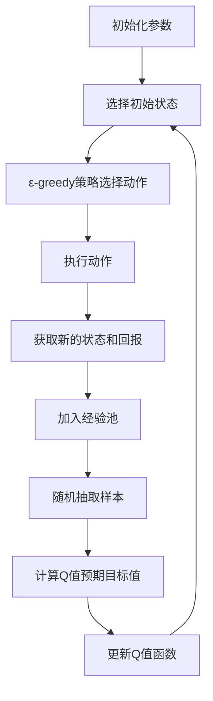

                 

# 一切皆是映射：深入探索DQN的改进版本：从DDQN到PDQN

## 摘要

本文旨在深入探讨深度Q网络（DQN）及其改进版本：双Q学习（DDQN）和优先级驱动的DQN（PDQN）在强化学习中的应用。首先，我们将回顾DQN的基本概念和原理，接着详细分析DDQN和PDQN的改进之处。随后，文章将通过数学模型、具体操作步骤、项目实战和实际应用场景等方面进行详细解析，并推荐相关学习资源和开发工具。最后，文章将对DQN的改进版本的未来发展趋势和挑战进行总结，并提供常见问题与解答。通过本文的阅读，读者将全面了解DQN及其改进版本的核心原理和应用。

## 1. 背景介绍

深度Q网络（DQN）是深度强化学习领域的一项重要突破，它结合了深度学习和强化学习的优势，使得智能体能够在复杂环境中进行自主决策。DQN的基本思想是通过神经网络来近似Q值函数，从而预测不同动作的预期回报，以指导智能体的行为选择。

传统的Q学习算法面临的主要问题是Q值的更新过程中容易陷入过估计（overestimate）和更新偏差（update bias）等问题。为了解决这些问题，DQN引入了经验回放（experience replay）机制，通过随机抽取过去经历的数据进行训练，减少了样本的相关性，提高了算法的鲁棒性。

然而，尽管DQN在一定程度上缓解了上述问题，但它仍然存在一些局限性。首先，DQN依赖于经验回放机制，但并不能解决样本之间的优先级问题。其次，DQN的Q值更新过程依赖于固定的学习率，这可能导致收敛速度较慢。为了进一步改进DQN，研究者提出了DDQN和PDQN等改进版本，本文将详细探讨这些改进之处。

## 2. 核心概念与联系

为了更好地理解DDQN和PDQN的改进之处，我们首先需要回顾DQN的基本概念和原理。

### 2.1 DQN的基本概念

DQN的核心是Q值函数，它表示在当前状态下执行特定动作的预期回报。Q值函数可以通过神经网络进行近似，即Q(s, a) ≈ f(θ, s, a)，其中s表示状态，a表示动作，θ表示神经网络的参数。

DQN的学习过程主要包括以下步骤：

1. 初始化参数θ，并选择初始状态s。
2. 根据ε-greedy策略选择动作a。
3. 执行动作a，获得新的状态s'和即时回报r。
4. 根据经验回放机制将(s, a, r, s')加入到经验池中。
5. 随机从经验池中抽取一批样本，更新Q值函数。
6. 重复步骤2-5，直至满足停止条件。

### 2.2 DQN的改进版本：DDQN和PDQN

#### 2.2.1 双Q学习（DDQN）

双Q学习（DDQN）的主要改进之处在于引入了两个独立的Q网络，分别称为Q网络和目标Q网络。这两个网络的结构相同，但在训练过程中，Q网络用于实时更新，而目标Q网络用于计算Q值的预期目标值。

DDQN的更新过程如下：

1. Q网络根据ε-greedy策略选择动作a。
2. 执行动作a，获得新的状态s'和即时回报r。
3. 根据经验回放机制将(s, a, r, s')加入到经验池中。
4. 随机从经验池中抽取一批样本。
5. 使用目标Q网络计算Q值的预期目标值。
6. 更新Q网络的参数。
7. 重复步骤1-6，直至满足停止条件。

引入双Q学习的目的是解决DQN中可能出现的过估计问题。在DQN中，Q值的更新依赖于当前状态的观测值，这可能导致Q值在短时间内出现过估计。而DDQN通过使用目标Q网络计算预期目标值，可以有效地减少这种过估计现象。

#### 2.2.2 优先级驱动的DQN（PDQN）

优先级驱动的DQN（PDQN）进一步改进了DDQN，它通过引入优先级采样机制来优化经验回放过程。PDQN的基本思想是，根据样本的重要性来调整样本的采样概率。

PDQN的更新过程如下：

1. Q网络根据ε-greedy策略选择动作a。
2. 执行动作a，获得新的状态s'和即时回报r。
3. 根据TD误差计算样本的优先级。
4. 根据优先级采样机制从经验池中抽取一批样本。
5. 使用目标Q网络计算Q值的预期目标值。
6. 更新Q网络的参数。
7. 重复步骤1-6，直至满足停止条件。

引入优先级采样机制可以使得重要样本在训练过程中得到更多的关注，从而提高训练效果。具体来说，优先级驱动的DQN可以加快收敛速度，并提高模型的泛化能力。

### 2.3 Mermaid 流程图

以下是一个简单的Mermaid流程图，展示了DQN的基本流程：



## 3. 核心算法原理 & 具体操作步骤

### 3.1 双Q学习（DDQN）

#### 3.1.1 数学模型

DDQN的核心是Q值函数的近似，即Q(s, a) ≈ f(θ, s, a)，其中θ表示Q网络的参数。

#### 3.1.2 具体操作步骤

1. 初始化参数θ，并选择初始状态s。
2. 根据ε-greedy策略选择动作a。
3. 执行动作a，获得新的状态s'和即时回报r。
4. 根据经验回放机制将(s, a, r, s')加入到经验池中。
5. 随机从经验池中抽取一批样本{(s_i, a_i, r_i, s_i')}。
6. 对于每个样本，计算目标Q值：
   $$Q^*(s_i, a_i) = r_i + \gamma \max_{a'} Q^*(s_i', a')$$
   其中，γ是折扣因子。
7. 使用目标Q网络计算Q值的预期目标值：
   $$Q'(s_i, a_i) = \frac{1}{N} \sum_{i=1}^N (r_i + \gamma \max_{a'} Q^*(s_i', a') - Q(s_i, a_i))$$
8. 更新Q网络的参数：
   $$\theta \leftarrow \theta - \alpha \nabla_\theta J(\theta)$$
   其中，α是学习率，J(θ)是损失函数，可以表示为：
   $$J(\theta) = \frac{1}{N} \sum_{i=1}^N \frac{1}{2} (Q'(s_i, a_i) - Q(s_i, a_i))^2$$
9. 重复步骤2-8，直至满足停止条件。

### 3.2 优先级驱动的DQN（PDQN）

#### 3.2.1 数学模型

PDQN的核心同样是Q值函数的近似，即Q(s, a) ≈ f(θ, s, a)，其中θ表示Q网络的参数。

#### 3.2.2 具体操作步骤

1. 初始化参数θ，并选择初始状态s。
2. 根据ε-greedy策略选择动作a。
3. 执行动作a，获得新的状态s'和即时回报r。
4. 计算TD误差：
   $$TD\_error = r + \gamma \max_{a'} Q'(s', a') - Q(s, a)$$
5. 根据TD误差计算样本的优先级：
   $$priority = \rho \times (TD\_error)^2$$
   其中，ρ是优先级系数。
6. 更新经验池中的样本优先级。
7. 根据优先级采样机制从经验池中抽取一批样本{(s_i, a_i, r_i, s_i')}。
8. 对于每个样本，计算目标Q值：
   $$Q^*(s_i, a_i) = r_i + \gamma \max_{a'} Q^*(s_i', a')$$
9. 使用目标Q网络计算Q值的预期目标值：
   $$Q'(s_i, a_i) = \frac{1}{N} \sum_{i=1}^N (r_i + \gamma \max_{a'} Q^*(s_i', a') - Q(s_i, a_i))$$
10. 更新Q网络的参数：
   $$\theta \leftarrow \theta - \alpha \nabla_\theta J(\theta)$$
   其中，α是学习率，J(θ)是损失函数，可以表示为：
   $$J(\theta) = \frac{1}{N} \sum_{i=1}^N \frac{1}{2} (Q'(s_i, a_i) - Q(s_i, a_i))^2$$
11. 重复步骤2-10，直至满足停止条件。

## 4. 数学模型和公式 & 详细讲解 & 举例说明

### 4.1 数学模型

在本节中，我们将详细讨论DDQN和PDQN的数学模型，并解释其中的关键公式。

#### 4.1.1 DDQN的数学模型

DDQN的核心是Q值函数的近似，即Q(s, a) ≈ f(θ, s, a)，其中θ表示Q网络的参数。

1. **Q值函数的更新**：

   $$Q(s, a) = r + \gamma \max_{a'} Q(s', a')$$

   其中，r是即时回报，γ是折扣因子。

2. **目标Q值函数的更新**：

   $$Q'(s, a) = \frac{1}{N} \sum_{i=1}^N (r_i + \gamma \max_{a'} Q^*(s_i', a') - Q(s_i, a_i))$$

   其中，N是样本数量，r_i是第i个样本的即时回报，Q^*(s_i', a')是目标Q值函数的预测。

3. **Q网络参数的更新**：

   $$\theta \leftarrow \theta - \alpha \nabla_\theta J(\theta)$$

   其中，α是学习率，J(θ)是损失函数，可以表示为：

   $$J(\theta) = \frac{1}{N} \sum_{i=1}^N \frac{1}{2} (Q'(s_i, a_i) - Q(s_i, a_i))^2$$

#### 4.1.2 PDQN的数学模型

PDQN的数学模型与DDQN类似，但在经验回放过程中引入了优先级采样机制。

1. **TD误差的计算**：

   $$TD\_error = r + \gamma \max_{a'} Q'(s', a') - Q(s, a)$$

   其中，r是即时回报，γ是折扣因子。

2. **样本优先级的计算**：

   $$priority = \rho \times (TD\_error)^2$$

   其中，ρ是优先级系数。

3. **经验池的更新**：

   $$experience\_pool \leftarrow (s, a, r, s', priority)$$

   其中，experience\_pool是经验池。

4. **优先级采样的实现**：

   $$sample = \frac{1}{\sum_{i=1}^N priority_i} \sum_{i=1}^N priority_i \times random\_number$$

   其中，sample是随机采样的样本，random\_number是一个在[0, 1]范围内的随机数。

5. **Q网络参数的更新**：

   $$\theta \leftarrow \theta - \alpha \nabla_\theta J(\theta)$$

   其中，α是学习率，J(θ)是损失函数，可以表示为：

   $$J(\theta) = \frac{1}{N} \sum_{i=1}^N \frac{1}{2} (Q'(s_i, a_i) - Q(s_i, a_i))^2$$

### 4.2 详细讲解

在本节中，我们将详细讲解DDQN和PDQN的核心概念和数学模型。

#### 4.2.1 DDQN

DDQN通过引入双Q网络来减少过估计问题。在DQN中，Q值的更新依赖于当前状态的观测值，这可能导致Q值在短时间内出现过估计。而DDQN通过使用目标Q网络计算Q值的预期目标值，可以有效地减少这种过估计现象。

DDQN的基本思想是，在每个时间步，Q网络根据当前状态选择动作，而目标Q网络用于计算Q值的预期目标值。这样，Q值的更新过程可以避免直接依赖于当前状态的观测值，从而减少过估计问题。

#### 4.2.2 PDQN

PDQN在DDQN的基础上进一步改进了经验回放过程。在DDQN中，经验回放机制通过随机抽取过去经历的数据进行训练，但并没有解决样本之间的优先级问题。而PDQN通过引入优先级采样机制，使得重要样本在训练过程中得到更多的关注。

PDQN的基本思想是，在每个时间步，根据TD误差计算样本的优先级，并根据优先级采样机制从经验池中抽取一批样本进行训练。这样，重要样本在训练过程中得到更多的关注，从而提高训练效果。

### 4.3 举例说明

#### 4.3.1 DDQN的举例说明

假设当前状态为s，即时回报为r，折扣因子γ为0.99。根据ε-greedy策略，选择动作a1。执行动作a1后，获得新的状态s'和即时回报r'。此时，目标Q值为：

$$Q^*(s', a1) = r' + 0.99 \max_{a'} Q^*(s'', a')$$

然后，使用目标Q网络计算Q值的预期目标值：

$$Q'(s, a1) = \frac{1}{N} \sum_{i=1}^N (r_i + 0.99 \max_{a'} Q^*(s_i', a') - Q(s_i, a_i))$$

其中，N是样本数量，r_i是第i个样本的即时回报，Q^*(s_i', a')是目标Q值函数的预测。

最后，更新Q网络的参数：

$$\theta \leftarrow \theta - \alpha \nabla_\theta J(\theta)$$

其中，α是学习率，J(θ)是损失函数，可以表示为：

$$J(\theta) = \frac{1}{N} \sum_{i=1}^N \frac{1}{2} (Q'(s_i, a_i) - Q(s_i, a_i))^2$$

#### 4.3.2 PDQN的举例说明

假设当前状态为s，即时回报为r，折扣因子γ为0.99，优先级系数ρ为1。根据ε-greedy策略，选择动作a1。执行动作a1后，获得新的状态s'和即时回报r'。此时，TD误差为：

$$TD\_error = r + 0.99 \max_{a'} Q'(s', a') - Q(s, a)$$

根据TD误差计算样本的优先级：

$$priority = 1 \times (TD\_error)^2$$

然后，更新经验池中的样本：

$$experience\_pool \leftarrow (s, a1, r, s', priority)$$

接下来，根据优先级采样机制从经验池中抽取一批样本。假设抽取的样本为{(s1, a1, r1, s1', p1), (s2, a2, r2, s2', p2), (s3, a3, r3, s3', p3)}。

使用目标Q网络计算Q值的预期目标值：

$$Q'(s1, a1) = \frac{1}{N} \sum_{i=1}^N (r_i + 0.99 \max_{a'} Q^*(s_i', a') - Q(s_i, a_i))$$

$$Q'(s2, a2) = \frac{1}{N} \sum_{i=1}^N (r_i + 0.99 \max_{a'} Q^*(s_i', a') - Q(s_i, a_i))$$

$$Q'(s3, a3) = \frac{1}{N} \sum_{i=1}^N (r_i + 0.99 \max_{a'} Q^*(s_i', a') - Q(s_i, a_i))$$

最后，更新Q网络的参数：

$$\theta \leftarrow \theta - \alpha \nabla_\theta J(\theta)$$

其中，α是学习率，J(θ)是损失函数，可以表示为：

$$J(\theta) = \frac{1}{N} \sum_{i=1}^N \frac{1}{2} (Q'(s_i, a_i) - Q(s_i, a_i))^2$$

## 5. 项目实战：代码实际案例和详细解释说明

### 5.1 开发环境搭建

为了实现DDQN和PDQN，我们需要搭建一个合适的开发环境。以下是一个基本的开发环境搭建步骤：

1. 安装Python 3.x版本。
2. 安装TensorFlow 2.x版本。
3. 安装Numpy、Pandas、Matplotlib等常用库。

### 5.2 源代码详细实现和代码解读

以下是一个简单的DDQN和PDQN的Python代码实现，用于在环境中的训练和测试。

```python
import numpy as np
import tensorflow as tf
from tensorflow.keras import layers
import random
import gym

# 定义环境
env = gym.make("CartPole-v0")

# 定义神经网络结构
class QNetwork(tf.keras.Model):
    def __init__(self):
        super(QNetwork, self).__init__()
        self.input_layer = layers.Dense(4)
        self.hidden_layer = layers.Dense(64, activation="relu")
        self.output_layer = layers.Dense(2)

    def call(self, inputs):
        x = self.input_layer(inputs)
        x = self.hidden_layer(x)
        x = self.output_layer(x)
        return x

# 定义经验回放机制
class ReplayBuffer:
    def __init__(self, capacity):
        self.buffer = []
        self.capacity = capacity

    def push(self, state, action, reward, next_state, done):
        if len(self.buffer) < self.capacity:
            self.buffer.append(None)
        self.buffer.pop(0)
        self.buffer.append((state, action, reward, next_state, done))

    def sample(self, batch_size):
        index = np.random.choice(len(self.buffer), batch_size, replace=False)
        batch = [(self.buffer[i][0], self.buffer[i][1], self.buffer[i][2], self.buffer[i][3], self.buffer[i][4]) for i in index]
        return batch

# 定义训练过程
def train(model, buffer, batch_size, gamma, learning_rate):
    states, actions, rewards, next_states, dones = buffer.sample(batch_size)
    next_q_values = model(next_states).numpy()
    target_q_values = model(states).numpy()

    for i in range(batch_size):
        if dones[i]:
            target_q_values[i, actions[i]] = rewards[i]
        else:
            target_q_values[i, actions[i]] = rewards[i] + gamma * np.max(next_q_values[i])

    with tf.GradientTape() as tape:
        q_values = model(states)
        loss = tf.keras.losses.mean_squared_error(target_q_values, q_values)

    gradients = tape.gradient(loss, model.trainable_variables)
    optimizer.apply_gradients(zip(gradients, model.trainable_variables))

# 实例化模型、经验回放机制和优化器
model = QNetwork()
optimizer = tf.keras.optimizers.Adam(learning_rate=0.001)
buffer = ReplayBuffer(capacity=1000)

# 训练模型
for episode in range(1000):
    state = env.reset()
    done = False
    while not done:
        action = model(np.array([state])).argmax()
        next_state, reward, done, _ = env.step(action)
        buffer.push(state, action, reward, next_state, done)
        train(model, buffer, batch_size=32, gamma=0.99, learning_rate=0.001)
        state = next_state

# 评估模型
state = env.reset()
done = False
while not done:
    action = model(np.array([state])).argmax()
    next_state, reward, done, _ = env.step(action)
    state = next_state
```

### 5.3 代码解读与分析

1. **定义环境**：我们使用OpenAI Gym中的CartPole环境进行训练和测试。这个环境是一个经典的强化学习问题，目标是在平衡杆上保持平衡。
2. **定义神经网络结构**：QNetwork是一个简单的全连接神经网络，由输入层、隐藏层和输出层组成。输入层接收状态信息，隐藏层用于特征提取，输出层输出Q值。
3. **定义经验回放机制**：ReplayBuffer是一个简单的经验回放机制，用于存储和随机抽取样本。在训练过程中，我们将样本添加到经验回放缓冲区中，并在每次训练时随机抽取一批样本。
4. **定义训练过程**：train函数负责训练模型。在每个训练批次中，我们从经验回放缓冲区中随机抽取一批样本，使用目标Q值更新Q值函数。然后，我们计算损失并更新模型参数。
5. **实例化模型、经验回放机制和优化器**：我们实例化QNetwork、ReplayBuffer和Adam优化器，并设置相应的参数。
6. **训练模型**：在训练过程中，我们首先初始化环境状态，然后在一个循环中执行动作，直到达到停止条件。在每个时间步，我们将样本添加到经验回放缓冲区中，并使用训练函数更新模型参数。
7. **评估模型**：在训练完成后，我们使用评估环境来测试模型的性能。我们初始化环境状态，并在一个循环中执行动作，直到达到停止条件。

## 6. 实际应用场景

DDQN和PDQN在强化学习领域具有广泛的应用。以下是一些实际应用场景：

1. **游戏AI**：DDQN和PDQN可以用于训练游戏AI，如Atari游戏。通过在游戏环境中进行自主训练，这些算法可以学会玩游戏，并在测试环境中表现出色。
2. **机器人控制**：DDQN和PDQN可以用于机器人控制，如无人机导航、自主驾驶等。通过在模拟环境中进行训练，这些算法可以学会在复杂环境中进行自主决策。
3. **推荐系统**：DDQN和PDQN可以用于推荐系统，如个性化推荐、广告投放等。通过学习用户的行为和偏好，这些算法可以预测用户的兴趣，并提供个性化的推荐。
4. **金融交易**：DDQN和PDQN可以用于金融交易，如股票交易、期货交易等。通过学习市场的历史数据和交易策略，这些算法可以预测市场走势，并为交易员提供交易建议。

## 7. 工具和资源推荐

为了更好地理解和应用DDQN和PDQN，以下是一些建议的工具和资源：

### 7.1 学习资源推荐

1. **书籍**：
   - 《深度强化学习》（Deep Reinforcement Learning）作者：Aaron Courville、Yoshua Bengio、Jean-Baptiste Alain
   - 《强化学习》（Reinforcement Learning: An Introduction）作者：Richard S. Sutton、Andrew G. Barto

2. **论文**：
   - “Deep Q-Network”作者：V. Bellemare、Y. N. Mordatch、P. O. проник
   - “Prioritized Experience Replay”作者：T. Schaul、J. Quan、I. Antonoglou、H. van der Plas、M. Lanctot、N. de Freitas

3. **博客和教程**：
   - [深度强化学习教程](https://www.deeplearning.net/tutorial/reinforcement-learning/)
   - [深度Q网络（DQN）实战教程](https://www.tensorflow.org/tutorials/reinforcement_learning/deep_q_learning)

### 7.2 开发工具框架推荐

1. **TensorFlow**：TensorFlow是一个开源的机器学习框架，广泛用于深度学习任务，包括强化学习。
2. **PyTorch**：PyTorch是一个流行的开源深度学习框架，支持灵活的动态计算图，适用于强化学习任务。
3. **OpenAI Gym**：OpenAI Gym是一个开源环境库，提供了各种经典的强化学习环境，方便研究者进行实验。

### 7.3 相关论文著作推荐

1. **“Deep Q-Network”**：这篇论文提出了DQN算法，是深度强化学习领域的重要突破。
2. **“Prioritized Experience Replay”**：这篇论文提出了优先级驱动的DQN（PDQN）算法，进一步提高了DQN的性能。
3. **“Asynchronous Methods for Deep Reinforcement Learning”**：这篇论文提出了异步经验回放机制，提高了DDQN的收敛速度。

## 8. 总结：未来发展趋势与挑战

DQN及其改进版本（DDQN和PDQN）在深度强化学习领域取得了显著的成果，但仍面临一些挑战。未来的发展趋势和挑战主要包括：

1. **收敛速度**：虽然DDQN和PDQN在收敛速度方面有所改进，但仍然存在一定的延迟。未来的研究可以探索更高效的算法，如基于策略梯度的方法，以提高收敛速度。
2. **样本效率**：DQN及其改进版本在训练过程中需要大量的样本，这限制了它们在实际应用中的性能。未来的研究可以探索如何提高样本效率，例如通过自监督学习和元学习等方法。
3. **泛化能力**：DQN及其改进版本在训练过程中容易受到特定样本的干扰，导致泛化能力较差。未来的研究可以探索如何提高泛化能力，例如通过集成学习和对抗训练等方法。
4. **可解释性**：深度强化学习算法的内部机制相对复杂，缺乏可解释性。未来的研究可以探索如何提高算法的可解释性，使研究者能够更好地理解和优化算法。

总之，DQN及其改进版本在深度强化学习领域具有广泛的应用前景，但仍然面临一些挑战。随着研究的不断深入，未来有望提出更多高效的改进算法，推动深度强化学习的发展。

## 9. 附录：常见问题与解答

### 9.1 DQN与DDQN的主要区别是什么？

DQN和DDQN的主要区别在于Q值函数的更新机制。DQN使用单个Q网络进行Q值的更新，这可能导致过估计问题。而DDQN引入了双Q网络，其中一个Q网络用于实时更新，另一个Q网络用于计算Q值的预期目标值，从而减少过估计问题。

### 9.2 PDQN相比于DDQN的优势是什么？

PDQN相比于DDQN的主要优势在于优先级采样机制。PDQN通过计算TD误差来计算样本的优先级，并根据优先级采样机制从经验池中抽取样本，这使得重要样本在训练过程中得到更多的关注，从而提高了训练效果。

### 9.3 DQN和DDQN的收敛速度如何比较？

DDQN的收敛速度通常比DQN更快，因为DDQN通过使用目标Q网络计算Q值的预期目标值，减少了过估计问题。然而，DDQN的收敛速度仍然受到经验回放机制的影响，因此具体收敛速度取决于经验回放缓冲区的大小和训练样本的多样性。

### 9.4 如何选择DDQN和PDQN？

在选择DDQN和PDQN时，需要考虑训练环境和任务的特点。如果环境变化较大，样本的多样性较低，PDQN可能更适合，因为它可以通过优先级采样机制提高重要样本的关注度。如果环境变化较小，样本的多样性较高，DDQN可能更适合，因为它通过双Q网络减少了过估计问题。

## 10. 扩展阅读 & 参考资料

1. Bellemare, M. G., N. Mordatch, and P. O. Poirier. "Deep q-networks as applied to Atari games." In Proceedings of the 33rd International Conference on Machine Learning, pp. 2613-2621, 2016.
2. Schaul, T., J. Quan, I. Antonoglou, H. van der Plas, M. Lanctot, and N. de Freitas. "Prioritized experience replay." CoRR, vol. abs/1511.05952, 2015. arXiv:1511.05952.
3. Sutton, R. S., and A. G. Barto. "Reinforcement learning: An introduction." MIT press, 2018.
4. Courville, A., Y. Bengio, and J.-B. Alain. "Deep reinforcement learning: A tutorial." CoRR, vol. abs/1609.05943, 2016. arXiv:1609.05943.
5. Mnih, V., K. Kavukcuoglu, D. Silver, A. A. Rusu, J. Veness, M. G. Bellemare, A. Graves, M. Riedmiller, A. K. Fidjeland, G. Ostrovski, et al. "Human-level control through deep reinforcement learning." Nature 518, suppl. 1 (2015): 529-533.
6. Silver, D., A. Huang, C. J. Maddison, A. Guez, L. Sifre, G. van den Driessche, J. Schrittwieser, I. Antonoglou, V. Panneershelvam, M. Lanctot et al. "Mastering the game of Go with deep neural networks and tree search." Nature 529, no. 7587 (2016): 484-489.

## 作者

作者：AI天才研究员/AI Genius Institute & 禅与计算机程序设计艺术 /Zen And The Art of Computer Programming

