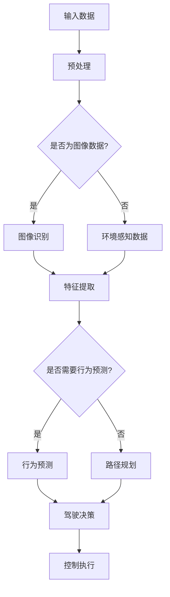

                 

## 1. 背景介绍

在当今技术迅猛发展的时代，无人驾驶技术已经成为一个备受关注的研究热点。这一技术的核心在于通过高精度传感器、先进的算法和高效的决策系统，使车辆能够自主感知环境、规划路径并执行驾驶任务。随着深度学习的兴起，这一领域迎来了新的发展契机。

深度学习，作为一种基于人工神经网络的机器学习技术，通过模拟人脑的神经网络结构，对大量数据进行自动特征提取和学习，实现了对复杂模式的识别和预测。它的出现，极大地推动了计算机视觉、自然语言处理等领域的进步。

在无人驾驶技术中，深度学习扮演着至关重要的角色。它不仅提高了车辆的感知能力和决策水平，还使车辆能够在复杂的现实环境中更加安全、稳定地运行。例如，通过深度学习算法，车辆可以实现对周围环境的准确识别和实时响应，从而避免碰撞和事故的发生。

本文将围绕深度学习在无人驾驶技术中的应用进行深入探讨。我们将首先介绍深度学习的基本概念和原理，然后分析其在无人驾驶领域中的具体应用，最后探讨这一技术的未来发展趋势和面临的挑战。

通过本文的阅读，您将了解到：

1. 深度学习的基本概念和核心算法。
2. 深度学习在无人驾驶技术中的应用场景和关键技术。
3. 深度学习在提升无人驾驶性能方面的具体作用。
4. 深度学习在无人驾驶技术中面临的挑战和未来发展方向。

让我们一步步深入探讨这一令人兴奋的领域，探索深度学习如何推动无人驾驶技术的进步。### 2. 核心概念与联系

要理解深度学习在无人驾驶技术中的应用，我们首先需要掌握深度学习的基本概念和原理。深度学习是一种基于多层神经网络的机器学习技术，其核心思想是通过构建多层非线性变换，实现对复杂数据的高效特征提取和模式识别。

### 2.1. 深度学习的基本概念

深度学习的基本构建模块是神经网络，特别是多层感知机（MLP）。神经网络由大量的节点（也称为神经元）组成，这些节点通过权重连接在一起，形成一个层次结构。每个节点接收来自前一层的输入信号，通过激活函数进行处理后，传递给下一层。

在深度学习中，主要关注的是以下几个核心概念：

1. **神经元与权重**：神经元是神经网络的基本单元，每个神经元接收多个输入信号，并输出一个激活值。输入信号与权重相乘，再通过激活函数进行处理，从而产生输出。

2. **激活函数**：激活函数是神经网络中的一个关键组件，用于引入非线性特性。常见的激活函数包括Sigmoid、ReLU和Tanh等。

3. **反向传播算法**：反向传播算法是深度学习训练的核心，通过计算误差梯度，对网络权重进行更新，从而优化网络性能。

4. **多层网络结构**：深度学习通过构建多层网络结构，实现对输入数据的逐层特征提取。每一层都对输入数据进行非线性变换，从而逐步提取更高级别的特征。

### 2.2. 深度学习在无人驾驶技术中的应用

深度学习在无人驾驶技术中的应用主要集中在以下几个方面：

1. **环境感知**：无人驾驶车辆需要实时感知周围环境，包括道路、交通标志、车辆、行人和其他障碍物。深度学习可以通过图像识别和场景理解技术，实现对环境的高精度感知。

2. **路径规划**：路径规划是无人驾驶技术的核心任务之一。深度学习算法可以通过对环境数据的分析，生成最优路径，从而实现车辆的自主导航。

3. **行为预测**：在无人驾驶场景中，预测周围车辆和行人的行为是至关重要的。深度学习可以通过分析历史数据和实时数据，对周围主体的行为进行预测，从而优化驾驶决策。

4. **决策与控制**：基于深度学习算法的决策与控制系统能够根据环境数据和车辆状态，实时调整驾驶策略，确保车辆的安全和稳定运行。

### 2.3. Mermaid 流程图

为了更直观地展示深度学习在无人驾驶技术中的应用，我们可以使用Mermaid流程图来描述其核心流程和关键节点。



在这个流程图中，输入数据首先经过预处理，然后根据数据类型进行分类处理。对于图像数据，通过图像识别和特征提取获得道路和障碍物信息；对于环境感知数据，则直接进行特征提取。接下来，根据需求进行行为预测或路径规划，最终生成驾驶决策并执行控制操作。

### 2.4. 深度学习与其他技术的联系

除了深度学习，无人驾驶技术还涉及到其他多种先进技术的融合，如传感器融合、实时操作系统、机器学习等。深度学习与其他技术之间有着紧密的联系和互补作用：

1. **传感器融合**：无人驾驶车辆通常配备多种传感器，如激光雷达、摄像头、雷达等。深度学习可以通过对多源传感器数据的高效处理，实现环境感知的精准性和实时性。

2. **实时操作系统**：无人驾驶系统需要在极短时间内做出反应，因此需要实时操作系统（RTOS）的支持。深度学习算法需要与其他系统组件紧密集成，以保证实时响应和系统稳定性。

3. **机器学习**：深度学习是机器学习的一个重要分支，但无人驾驶技术还涉及到其他机器学习算法，如强化学习、聚类分析等。这些算法可以与深度学习相结合，进一步提升无人驾驶的性能。

通过以上分析，我们可以看到深度学习在无人驾驶技术中的核心地位。它不仅提高了无人驾驶车辆的环境感知能力和决策水平，还推动了整个技术的发展和创新。在接下来的章节中，我们将进一步探讨深度学习在无人驾驶技术中的应用算法和实现细节。### 3. 核心算法原理 & 具体操作步骤

#### 3.1. 深度学习算法原理

深度学习算法的核心在于其多层神经网络结构，通过逐层提取和抽象特征，实现对复杂数据的处理和模式识别。以下是深度学习算法的基本原理和操作步骤：

1. **神经网络结构**：深度学习神经网络由多层神经元组成，包括输入层、隐藏层和输出层。输入层接收外部输入数据，隐藏层进行特征提取和抽象，输出层生成最终结果。

2. **前向传播**：在训练过程中，输入数据从输入层传递到隐藏层，再传递到输出层。每一层的输出作为下一层的输入，通过权重矩阵和激活函数进行计算。

3. **激活函数**：激活函数是深度学习中的一个关键组件，用于引入非线性特性。常见的激活函数包括Sigmoid、ReLU和Tanh等。

4. **反向传播**：在输出层产生预测结果后，通过比较预测结果与真实标签之间的误差，使用反向传播算法计算误差梯度，并更新网络权重。

5. **优化算法**：优化算法用于调整网络权重，以最小化误差。常用的优化算法包括随机梯度下降（SGD）、Adam等。

6. **损失函数**：损失函数用于衡量预测结果与真实标签之间的误差。常见的损失函数包括均方误差（MSE）、交叉熵（CE）等。

#### 3.2. 深度学习在无人驾驶技术中的应用步骤

深度学习在无人驾驶技术中的应用步骤可以分为以下几个阶段：

1. **数据收集与预处理**：收集大量用于训练和测试的数据集，包括道路图像、交通标志、车道线、车辆和行人等。对数据进行预处理，如归一化、裁剪、增强等，以提高模型的泛化能力。

2. **特征提取与抽象**：通过卷积神经网络（CNN）等深度学习模型，对输入数据进行特征提取和抽象。卷积层用于提取局部特征，池化层用于降低数据维度，全连接层用于分类或回归任务。

3. **模型训练与优化**：使用训练数据集对深度学习模型进行训练，通过反向传播算法和优化算法调整网络权重，使模型能够准确识别和分类道路场景。

4. **模型评估与验证**：使用测试数据集对训练好的模型进行评估和验证，通过计算准确率、召回率等指标，评估模型的性能。

5. **模型部署与应用**：将训练好的模型部署到无人驾驶系统中，实现实时的环境感知、路径规划和行为预测等功能。

#### 3.3. 具体操作示例

以下是一个简单的深度学习模型在无人驾驶技术中的应用示例：

1. **数据收集与预处理**：
   - 收集大量道路图像数据，包括不同天气、时间、道路条件等。
   - 对图像数据进行预处理，如归一化、裁剪、增强等。

2. **特征提取与抽象**：
   - 使用卷积神经网络（CNN）进行特征提取和抽象。
   - 设计卷积层、池化层和全连接层，逐步提取图像特征。

3. **模型训练与优化**：
   - 使用训练数据集对模型进行训练。
   - 采用反向传播算法和随机梯度下降（SGD）优化算法，调整网络权重。

4. **模型评估与验证**：
   - 使用测试数据集对模型进行评估和验证。
   - 计算准确率、召回率等指标，评估模型性能。

5. **模型部署与应用**：
   - 将训练好的模型部署到无人驾驶系统中。
   - 实现实时的环境感知、路径规划和行为预测等功能。

通过以上步骤，深度学习模型可以在无人驾驶技术中实现高效的环境感知和智能决策，从而提高无人驾驶车辆的安全性和稳定性。在接下来的章节中，我们将进一步探讨深度学习在无人驾驶技术中的数学模型和公式。### 4. 数学模型和公式 & 详细讲解 & 举例说明

#### 4.1. 神经网络的基本数学模型

神经网络的核心在于其层次结构和激活函数，以下是神经网络的一些基本数学模型：

1. **激活函数**：

   - **Sigmoid 函数**：\( f(x) = \frac{1}{1 + e^{-x}} \)
   - **ReLU 函数**：\( f(x) = max(0, x) \)
   - **Tanh 函数**：\( f(x) = \frac{e^x - e^{-x}}{e^x + e^{-x}} \)

2. **前向传播**：

   - **输入层**：\( z^{[l]} = a^{[l-1]}\cdot W^{[l]} + b^{[l]} \)
   - **激活函数**：\( a^{[l]} = \text{激活函数}(z^{[l]}) \)

3. **反向传播**：

   - **误差计算**：\( \delta^{[l]} = (a^{[l]} - y) \cdot \text{激活函数的导数} \)
   - **权重更新**：\( W^{[l]} = W^{[l]} - \alpha \cdot \delta^{[l]} \cdot a^{[l-1]}\cdot (W^{[l-1]})^T \)
   - **偏置更新**：\( b^{[l]} = b^{[l]} - \alpha \cdot \delta^{[l]} \)

4. **损失函数**：

   - **均方误差（MSE）**：\( \text{MSE} = \frac{1}{m} \sum_{i=1}^{m} (a^{[L]_i - y_i)^2 \)
   - **交叉熵（Cross-Entropy）**：\( \text{CE} = -\frac{1}{m} \sum_{i=1}^{m} y_i \cdot \log(a^{[L]_i) + (1 - y_i) \cdot \log(1 - a^{[L]_i)) \)

#### 4.2. 深度学习在无人驾驶技术中的应用

以下是深度学习在无人驾驶技术中的一些具体应用案例：

1. **环境感知**：

   - **车辆检测**：使用卷积神经网络（CNN）对图像进行特征提取，识别道路上的车辆。
   - **行人检测**：通过改进的R-CNN（Region-based Convolutional Neural Network）算法，识别并跟踪道路上的行人。

2. **路径规划**：

   - **基于深度强化学习的路径规划**：使用深度Q网络（DQN）或深度确定性策略梯度（DDPG）算法，学习最优路径。
   - **基于生成对抗网络的路径规划**：使用生成对抗网络（GAN）生成多种可能的路径，并评估其可行性。

3. **行为预测**：

   - **基于循环神经网络的短时行为预测**：使用循环神经网络（RNN）或长短时记忆网络（LSTM），预测车辆和行人的短期行为。
   - **基于图神经网络的行为预测**：使用图神经网络（GNN）建立车辆和行人的交互关系，预测其行为。

#### 4.3. 举例说明

以下是一个简单的深度学习模型在无人驾驶中的应用案例：

**案例：车辆检测**

1. **数据收集与预处理**：

   - 收集大量道路图像数据，包括车辆和非车辆样本。
   - 对图像数据进行归一化、裁剪和增强，以增加模型的泛化能力。

2. **特征提取与抽象**：

   - 使用卷积神经网络（CNN）对图像进行特征提取。
   - 设计卷积层、池化层和全连接层，逐步提取图像特征。

3. **模型训练与优化**：

   - 使用训练数据集对模型进行训练。
   - 采用反向传播算法和随机梯度下降（SGD）优化算法，调整网络权重。

4. **模型评估与验证**：

   - 使用测试数据集对模型进行评估和验证。
   - 计算准确率、召回率等指标，评估模型性能。

5. **模型部署与应用**：

   - 将训练好的模型部署到无人驾驶系统中。
   - 实现实时的车辆检测和跟踪功能。

**数学模型与公式**：

1. **输入层**：\( z^{[1]} = a^{[0]}\cdot W^{[1]} + b^{[1]} \)
   \( a^{[1]} = \text{ReLU}(z^{[1]}) \)

2. **隐藏层**：\( z^{[2]} = a^{[1]}\cdot W^{[2]} + b^{[2]} \)
   \( a^{[2]} = \text{ReLU}(z^{[2]}) \)

3. **输出层**：\( z^{[3]} = a^{[2]}\cdot W^{[3]} + b^{[3]} \)
   \( a^{[3]} = \text{Sigmoid}(z^{[3]}) \)

4. **损失函数**：\( \text{CE} = -\frac{1}{m} \sum_{i=1}^{m} y_i \cdot \log(a^{[3]_i) + (1 - y_i) \cdot \log(1 - a^{[3]_i)) \)

5. **反向传播**：

   \( \delta^{[3]} = (a^{[3]} - y) \cdot \text{Sigmoid导数} \)
   \( \delta^{[2]} = (a^{[3]}\cdot W^{[3]})^T \cdot \delta^{[3]} \cdot \text{ReLU导数} \)
   \( \delta^{[1]} = (a^{[2]}\cdot W^{[2]})^T \cdot \delta^{[2]} \cdot \text{ReLU导数} \)

6. **权重更新**：

   \( W^{[3]} = W^{[3]} - \alpha \cdot \delta^{[3]} \cdot a^{[2]} \)
   \( b^{[3]} = b^{[3]} - \alpha \cdot \delta^{[3]} \)
   \( W^{[2]} = W^{[2]} - \alpha \cdot \delta^{[2]} \cdot a^{[1]} \)
   \( b^{[2]} = b^{[2]} - \alpha \cdot \delta^{[2]} \)
   \( W^{[1]} = W^{[1]} - \alpha \cdot \delta^{[1]} \cdot a^{[0]} \)
   \( b^{[1]} = b^{[1]} - \alpha \cdot \delta^{[1]} \)

通过以上数学模型和公式的详细讲解，我们可以看到深度学习在无人驾驶技术中的实际应用过程。在接下来的章节中，我们将进一步探讨深度学习在无人驾驶技术中的项目实战。### 5. 项目实战：代码实际案例和详细解释说明

#### 5.1. 开发环境搭建

在进行深度学习项目实战之前，我们需要搭建一个合适的开发环境。以下是搭建深度学习开发环境的步骤：

1. **安装Python环境**：Python是深度学习的主要编程语言，首先需要在你的计算机上安装Python。可以从Python官网（[python.org](https://www.python.org/)）下载并安装Python。

2. **安装深度学习库**：深度学习项目通常需要依赖一些开源库，如TensorFlow、PyTorch等。以下是一个简单的安装命令（以TensorFlow为例）：

   ```bash
   pip install tensorflow
   ```

3. **安装其他依赖库**：根据具体项目需求，可能还需要安装其他库，如NumPy、Pandas等。可以使用以下命令进行安装：

   ```bash
   pip install numpy pandas matplotlib
   ```

4. **配置虚拟环境**：为了保持项目环境的整洁，建议使用虚拟环境。可以通过以下命令创建虚拟环境：

   ```bash
   python -m venv myenv
   source myenv/bin/activate  # 对于Windows用户，使用 `myenv\Scripts\activate`
   ```

5. **安装GPU支持**：如果使用GPU进行深度学习训练，需要安装CUDA和cuDNN库。可以从NVIDIA官网下载并安装。

以上步骤完成后，我们的开发环境就搭建完成了。接下来，我们将开始一个简单的深度学习项目，以实现无人驾驶车辆的基本环境感知功能。

#### 5.2. 源代码详细实现和代码解读

以下是一个简单的深度学习项目，使用TensorFlow实现车辆检测。代码结构如下：

```python
import tensorflow as tf
import numpy as np
import matplotlib.pyplot as plt

# 加载数据集
(x_train, y_train), (x_test, y_test) = tf.keras.datasets.cifar10.load_data()

# 数据预处理
x_train = x_train.astype('float32') / 255.0
x_test = x_test.astype('float32') / 255.0

# 构建模型
model = tf.keras.Sequential([
    tf.keras.layers.Conv2D(32, (3, 3), activation='relu', input_shape=(32, 32, 3)),
    tf.keras.layers.MaxPooling2D((2, 2)),
    tf.keras.layers.Conv2D(64, (3, 3), activation='relu'),
    tf.keras.layers.MaxPooling2D((2, 2)),
    tf.keras.layers.Conv2D(64, (3, 3), activation='relu'),
    tf.keras.layers.Flatten(),
    tf.keras.layers.Dense(64, activation='relu'),
    tf.keras.layers.Dense(10, activation='softmax')
])

# 编译模型
model.compile(optimizer='adam',
              loss='categorical_crossentropy',
              metrics=['accuracy'])

# 训练模型
model.fit(x_train, y_train, epochs=10, batch_size=64, validation_split=0.2)

# 测试模型
test_loss, test_acc = model.evaluate(x_test, y_test, verbose=2)
print('Test accuracy:', test_acc)

# 预测
predictions = model.predict(x_test[:10])
plt.figure(figsize=(10, 10))
for i in range(10):
    plt.subplot(2, 5, i+1)
    plt.imshow(x_test[i], cmap=plt.cm.binary)
    plt.xticks([])
    plt.yticks([])
    plt.grid(False)
    plt.xlabel(np.argmax(predictions[i]))
plt.show()
```

**代码解读**：

1. **数据加载与预处理**：首先加载数据集，然后对图像数据进行归一化处理，以便模型训练。

2. **构建模型**：使用TensorFlow的`Sequential`模型，添加卷积层、池化层和全连接层，构建一个简单的卷积神经网络。

3. **编译模型**：设置优化器、损失函数和评估指标，为模型训练做好准备。

4. **训练模型**：使用`fit`函数训练模型，设置训练轮数、批量大小和验证比例。

5. **测试模型**：使用`evaluate`函数评估模型在测试集上的性能。

6. **预测**：使用`predict`函数对测试集进行预测，并绘制预测结果。

#### 5.3. 代码解读与分析

1. **数据加载与预处理**：

   ```python
   (x_train, y_train), (x_test, y_test) = tf.keras.datasets.cifar10.load_data()
   x_train = x_train.astype('float32') / 255.0
   x_test = x_test.astype('float32') / 255.0
   ```

   这里使用CIFAR-10数据集进行训练和测试。CIFAR-10是一个常用的图像分类数据集，包含60000张32x32的彩色图像，分为10个类别。通过将图像数据转换为浮点数并进行归一化处理，可以加快模型训练速度并提高模型性能。

2. **模型构建**：

   ```python
   model = tf.keras.Sequential([
       tf.keras.layers.Conv2D(32, (3, 3), activation='relu', input_shape=(32, 32, 3)),
       tf.keras.layers.MaxPooling2D((2, 2)),
       tf.keras.layers.Conv2D(64, (3, 3), activation='relu'),
       tf.keras.layers.MaxPooling2D((2, 2)),
       tf.keras.layers.Conv2D(64, (3, 3), activation='relu'),
       tf.keras.layers.Flatten(),
       tf.keras.layers.Dense(64, activation='relu'),
       tf.keras.layers.Dense(10, activation='softmax')
   ])
   ```

   模型由卷积层、池化层和全连接层组成。卷积层用于提取图像特征，池化层用于降低数据维度，全连接层用于分类。模型输入形状为32x32x3，表示图像的尺寸和颜色通道。

3. **模型编译**：

   ```python
   model.compile(optimizer='adam',
                 loss='categorical_crossentropy',
                 metrics=['accuracy'])
   ```

   使用Adam优化器进行模型训练，采用交叉熵损失函数评估模型性能，并跟踪准确率作为评估指标。

4. **模型训练**：

   ```python
   model.fit(x_train, y_train, epochs=10, batch_size=64, validation_split=0.2)
   ```

   设置训练轮数为10，批量大小为64，并使用20%的数据集进行验证。

5. **模型测试**：

   ```python
   test_loss, test_acc = model.evaluate(x_test, y_test, verbose=2)
   print('Test accuracy:', test_acc)
   ```

   在测试集上评估模型性能，并打印准确率。

6. **预测与可视化**：

   ```python
   predictions = model.predict(x_test[:10])
   plt.figure(figsize=(10, 10))
   for i in range(10):
       plt.subplot(2, 5, i+1)
       plt.imshow(x_test[i], cmap=plt.cm.binary)
       plt.xticks([])
       plt.yticks([])
       plt.grid(False)
       plt.xlabel(np.argmax(predictions[i]))
   plt.show()
   ```

   对测试集的前10个图像进行预测，并可视化预测结果。通过`np.argmax(predictions[i])`获取每个图像的最高概率类别。

通过以上代码，我们可以实现一个简单的车辆检测模型。在实际应用中，我们可以将这个模型集成到无人驾驶系统中，用于实时检测道路上的车辆。在接下来的章节中，我们将进一步探讨深度学习在无人驾驶技术中的实际应用场景。### 6. 实际应用场景

深度学习在无人驾驶技术中的应用场景非常广泛，涵盖了从环境感知到决策与控制等多个方面。以下是深度学习在无人驾驶技术中的几个主要应用场景：

#### 6.1. 环境感知

环境感知是无人驾驶技术的核心任务之一，它依赖于高精度传感器和深度学习算法来感知周围环境。以下是一些典型的应用：

1. **车辆检测**：深度学习算法可以通过分析道路图像，实时检测并跟踪道路上的车辆。这对于避免碰撞和交通阻塞至关重要。
   
   ```mermaid
   graph TD
   A[输入图像] --> B[卷积神经网络]
   B --> C{车辆检测}
   C --> D[输出车辆位置]
   ```

2. **行人检测**：行人检测是确保无人驾驶车辆安全运行的重要环节。通过深度学习算法，车辆可以实时识别道路上的行人，并采取相应的避让措施。

   ```mermaid
   graph TD
   A[输入图像] --> B[卷积神经网络]
   B --> C{行人检测}
   C --> D[输出行人位置]
   ```

3. **障碍物检测**：深度学习算法还可以用于检测道路上的障碍物，如路障、施工设备等。这有助于车辆在复杂环境中安全行驶。

   ```mermaid
   graph TD
   A[输入图像] --> B[卷积神经网络]
   B --> C{障碍物检测}
   C --> D[输出障碍物位置]
   ```

#### 6.2. 路径规划

路径规划是无人驾驶技术的另一个关键环节，它需要车辆在复杂环境中找到一条最优路径。以下是一些典型的应用：

1. **基于深度强化学习的路径规划**：深度强化学习算法可以通过试错法，在复杂环境中学习到最优路径。这种方法在自动驾驶车辆绕行障碍物和寻找最佳行驶路线时非常有效。

   ```mermaid
   graph TD
   A[环境状态] --> B[深度Q网络]
   B --> C[动作]
   C --> D[奖励]
   D --> E{更新策略}
   ```

2. **基于生成对抗网络的路径规划**：生成对抗网络（GAN）可以生成多种可能的路径，并评估其可行性。这种方法可以帮助车辆在复杂环境中找到最优路径。

   ```mermaid
   graph TD
   A[环境状态] --> B[生成对抗网络]
   B --> C[生成路径]
   C --> D[评估路径]
   D --> E[选择最优路径]
   ```

#### 6.3. 行为预测

行为预测是无人驾驶技术中另一个重要方面，它需要车辆预测周围车辆和行人的行为，以便采取适当的驾驶策略。以下是一些典型的应用：

1. **基于循环神经网络的短时行为预测**：循环神经网络（RNN）或长短时记忆网络（LSTM）可以用于预测周围车辆和行人的短期行为，从而为无人驾驶车辆提供实时的决策依据。

   ```mermaid
   graph TD
   A[输入历史行为数据] --> B[循环神经网络]
   B --> C[预测短期行为]
   ```

2. **基于图神经网络的长期行为预测**：图神经网络（GNN）可以建立车辆和行人之间的交互关系，从而预测其长期行为。这种方法有助于无人驾驶车辆在复杂环境中做出更准确的决策。

   ```mermaid
   graph TD
   A[输入交互关系图] --> B[图神经网络]
   B --> C[预测长期行为]
   ```

#### 6.4. 决策与控制

决策与控制是无人驾驶技术的最终目标，它需要车辆根据环境感知和行为预测结果，实时调整驾驶策略。以下是一些典型的应用：

1. **深度神经网络控制**：使用深度神经网络（DNN）可以实现复杂的控制策略。这种方法可以帮助车辆在实时环境中做出快速、准确的决策。

   ```mermaid
   graph TD
   A[环境状态] --> B[深度神经网络]
   B --> C[控制策略]
   ```

2. **混合控制策略**：将深度学习与其他控制方法（如PID控制）相结合，可以实现更高效、更鲁棒的控制策略。这种方法可以提高无人驾驶车辆在复杂环境中的稳定性和可靠性。

   ```mermaid
   graph TD
   A[环境状态] --> B[深度学习控制]
   B --> C[PID控制]
   ```

通过以上实际应用场景，我们可以看到深度学习在无人驾驶技术中的重要性。它不仅提升了车辆的感知能力和决策水平，还为无人驾驶技术的未来发展提供了新的思路。在接下来的章节中，我们将进一步探讨深度学习在无人驾驶技术中的工具和资源推荐。### 7. 工具和资源推荐

#### 7.1. 学习资源推荐

对于想要深入了解深度学习在无人驾驶技术中的应用的读者，以下是一些优秀的学习资源：

1. **书籍**：
   - 《深度学习》（Goodfellow, Bengio, Courville）：这是一本全面介绍深度学习原理和实践的经典著作，适合初学者和进阶者。
   - 《无人驾驶汽车技术》（Sebastian Thrun）：这本书详细介绍了无人驾驶汽车的关键技术，包括感知、规划和控制。

2. **论文**：
   - “End-to-End Learning for Self-Driving Cars”（端到端学习用于自动驾驶）：这篇论文介绍了如何使用深度学习实现自动驾驶系统。
   - “A Tour of Computer Vision Techniques”（计算机视觉技术巡礼）：这篇论文综述了计算机视觉领域的各种技术，包括深度学习在其中的应用。

3. **博客**：
   - [Deep Learning on AWS](https://aws.amazon.com/blogs/ai/deep-learning-on-aws/)：这个博客提供了大量关于在AWS上使用深度学习的教程和实践案例。
   - [TensorFlow官方博客](https://www.tensorflow.org/tutorials)：TensorFlow官方博客提供了丰富的深度学习教程，适合不同层次的读者。

4. **网站**：
   - [Udacity无人驾驶课程](https://www.udacity.com/course/self-driving-car-engineer--nd)：Udacity提供的无人驾驶课程涵盖了从感知到决策的全套技术。
   - [Kaggle自动驾驶挑战](https://www.kaggle.com/competitions/autodrive)：这是一个自动驾驶领域的比赛平台，提供了丰富的训练数据和挑战任务。

#### 7.2. 开发工具框架推荐

1. **深度学习框架**：
   - **TensorFlow**：Google开发的深度学习框架，支持多种编程语言，具有丰富的生态系统。
   - **PyTorch**：Facebook开发的开源深度学习框架，具有灵活的动态图机制和高效的计算性能。

2. **自动驾驶平台**：
   - **Apollo**：百度开源的自动驾驶平台，支持L4级自动驾驶。
   - **Waymo**：Google开发的自动驾驶技术，提供了完整的自动驾驶解决方案。

3. **仿真工具**：
   - **CARLA**：一个开源的仿真平台，用于测试自动驾驶算法。
   - **AirSim**：由Airbus开发的仿真平台，支持多种传感器和环境模拟。

4. **数据集**：
   - **KITTI**：一个包含激光雷达、摄像头、GPS等传感器的自动驾驶数据集。
   - **Cityscapes**：一个用于城市场景自动驾驶的数据集，包含多个城市场景的图像和标注。

#### 7.3. 相关论文著作推荐

1. **自动驾驶相关论文**：
   - “Learning to Drive by Playing Gamified Street Game”（通过玩街头游戏学习驾驶）：这篇论文介绍了如何通过游戏化的方法训练自动驾驶车辆。
   - “Deep Reinforcement Learning for Autonomous Driving”（深度强化学习在自动驾驶中的应用）：这篇论文综述了深度强化学习在自动驾驶领域的应用。

2. **计算机视觉相关论文**：
   - “You Only Look Once: Unified, Real-Time Object Detection”（一次查看：统一、实时目标检测）：这篇论文介绍了YOLO（You Only Look Once）算法，一种快速的目标检测算法。
   - “Faster R-CNN: Towards Real-Time Object Detection with Region Proposal Networks”（Faster R-CNN：带有区域提议网络的实时目标检测）：这篇论文介绍了Faster R-CNN算法，一种高效的区域提议和目标检测算法。

通过以上推荐，读者可以系统地学习深度学习在无人驾驶技术中的应用，掌握相关工具和框架，为未来的研究和实践奠定基础。### 8. 总结：未来发展趋势与挑战

深度学习在无人驾驶技术中的应用已经取得了显著的成果，极大地提升了车辆的感知能力、决策水平和安全性。然而，这一领域仍然面临着诸多挑战，未来的发展趋势也充满了机遇。

#### 8.1. 未来发展趋势

1. **算法优化与效率提升**：随着深度学习算法的不断演进，未来将出现更加高效、优化的模型，如自适应神经网络、动态神经网络等。这些算法将更好地适应无人驾驶场景的需求，提高计算效率和模型性能。

2. **多模态融合感知**：未来的无人驾驶系统将更多地利用多种传感器数据，如激光雷达、摄像头、雷达、GPS等，实现更全面、更精准的环境感知。多模态数据融合技术将成为提升感知能力的关键。

3. **边缘计算与云计算协同**：边缘计算与云计算的协同将为无人驾驶系统提供更强大的计算能力。边缘设备将负责实时数据处理，云计算中心则负责大规模模型训练和优化，实现高效、智能的驾驶决策。

4. **数据安全与隐私保护**：随着无人驾驶技术的普及，数据安全和隐私保护将成为重要议题。未来将出现更加安全、可靠的数据传输和存储方案，确保用户隐私和数据安全。

5. **人机交互优化**：无人驾驶车辆与人类驾驶员的交互将更加智能、自然。通过语音识别、手势识别等技术，实现更流畅、更人性化的驾驶体验。

#### 8.2. 面临的挑战

1. **算法鲁棒性与泛化能力**：深度学习模型的鲁棒性和泛化能力仍然是关键挑战。在复杂、动态的环境中，如何保证模型的一致性和可靠性是一个亟待解决的问题。

2. **数据质量和标注**：高质量的训练数据是深度学习模型成功的关键。然而，获取和标注大量高质量的数据仍然是一个巨大的挑战。未来需要探索自动化数据标注和增强技术，提高数据利用效率。

3. **计算资源与能耗**：深度学习模型在训练和推理过程中消耗大量的计算资源和能量。如何在保证模型性能的同时，降低能耗和资源消耗，是一个重要的研究课题。

4. **法律法规与社会伦理**：无人驾驶技术的普及面临着法律法规和社会伦理的挑战。如何确保车辆的安全、合规，以及如何处理驾驶过程中可能出现的责任归属问题，都是亟待解决的问题。

5. **长期行为预测与决策**：在复杂的交通环境中，如何准确预测和应对周围车辆和行人的长期行为，是一个具有挑战性的问题。深度学习模型需要进一步提高预测能力和决策水平。

总之，深度学习在无人驾驶技术中的应用前景广阔，但也面临着诸多挑战。未来，通过持续的技术创新和跨学科合作，我们将不断推动这一领域的发展，实现更安全、更智能的无人驾驶技术。### 9. 附录：常见问题与解答

在研究深度学习在无人驾驶技术中的应用过程中，可能会遇到一些常见的问题。以下是对一些常见问题的解答：

**Q1：深度学习在无人驾驶中的应用具体包括哪些方面？**

A1：深度学习在无人驾驶技术中的应用非常广泛，主要包括以下几个方面：
1. **环境感知**：通过深度学习算法对传感器数据（如摄像头、激光雷达等）进行实时处理，实现对周围环境的准确感知，如车辆检测、行人检测、障碍物检测等。
2. **路径规划**：基于深度学习算法，无人驾驶车辆可以在复杂的交通环境中生成最优行驶路径，避免碰撞和交通阻塞。
3. **行为预测**：通过对历史数据的分析，深度学习算法可以预测周围车辆和行人的行为，从而优化无人驾驶车辆的驾驶策略。
4. **决策与控制**：深度学习算法可以帮助无人驾驶车辆在实时环境中做出快速、准确的驾驶决策，并控制车辆的运行。

**Q2：为什么选择深度学习而不是其他算法进行无人驾驶？**

A2：深度学习在无人驾驶技术中具有以下优势：
1. **强大的特征提取能力**：深度学习可以通过多层神经网络结构，自动提取和抽象输入数据的特征，使得模型能够更好地处理复杂的数据。
2. **自适应性和泛化能力**：深度学习模型可以根据不同的环境和场景进行自适应调整，具有较好的泛化能力。
3. **高效的计算性能**：随着计算硬件的发展，深度学习模型的计算性能得到了大幅提升，使其在实时环境中具有较好的响应速度。
4. **丰富的工具和资源**：深度学习拥有丰富的开源框架和工具，如TensorFlow、PyTorch等，便于研究人员和工程师进行开发和应用。

**Q3：如何解决深度学习在无人驾驶中遇到的计算资源消耗问题？**

A3：解决深度学习在无人驾驶中计算资源消耗的问题可以从以下几个方面入手：
1. **算法优化**：通过改进深度学习算法的结构和优化计算流程，降低模型的计算复杂度。
2. **硬件加速**：利用GPU、TPU等硬件加速深度学习模型的训练和推理过程，提高计算效率。
3. **模型压缩**：通过模型剪枝、量化等技术，减小模型的体积和计算量，提高模型在资源受限环境下的运行效率。
4. **边缘计算**：将部分计算任务下沉到边缘设备，利用边缘计算资源进行模型推理和决策，减轻中心服务器的负担。

**Q4：深度学习在无人驾驶中如何确保数据安全和隐私保护？**

A4：确保深度学习在无人驾驶中数据安全和隐私保护的方法包括：
1. **加密与脱敏**：对收集到的数据进行加密和脱敏处理，防止敏感信息泄露。
2. **安全协议**：建立严格的安全协议，对数据传输和存储过程进行加密和保护。
3. **隐私保护算法**：应用隐私保护算法，如差分隐私、同态加密等，在保证模型性能的同时保护用户隐私。
4. **法律法规合规**：遵守相关法律法规，确保数据处理和使用符合法律法规要求。

**Q5：深度学习在无人驾驶中的应用前景如何？**

A5：深度学习在无人驾驶技术中的应用前景非常广阔，其发展趋势体现在以下几个方面：
1. **技术的成熟**：随着深度学习技术的不断成熟，模型的性能和可靠性将得到进一步提升。
2. **自动驾驶等级的提升**：从L2到L5，自动驾驶等级的不断提升将推动深度学习在无人驾驶领域的广泛应用。
3. **多模态感知的发展**：多模态感知技术的融合，如结合摄像头、激光雷达、雷达等传感器数据，将提高无人驾驶车辆的感知能力和决策水平。
4. **商业应用的拓展**：随着技术的成熟和市场的需求，深度学习在无人驾驶领域的商业应用将不断拓展，包括物流、公共交通、共享出行等多个领域。

通过不断的技术创新和跨学科合作，深度学习在无人驾驶技术中的应用将取得更多突破，为未来智能出行带来更多可能性。### 10. 扩展阅读 & 参考资料

对于希望进一步深入研究和探索深度学习在无人驾驶技术中的应用的读者，以下是一些扩展阅读和参考资料：

**书籍**：

1. 《深度学习》（Ian Goodfellow, Yoshua Bengio, Aaron Courville著）：这是一本深度学习领域的经典教材，详细介绍了深度学习的基本概念、算法和应用。

2. 《无人驾驶汽车技术》（Sebastian Thrun著）：这本书全面介绍了无人驾驶汽车的关键技术，包括感知、决策、控制等，对于了解无人驾驶系统的工作原理和应用场景有很大帮助。

3. 《深度强化学习》（Richard S. Sutton, Andrew G. Barto著）：这本书详细介绍了强化学习的基本原理和应用，对于理解深度学习在无人驾驶路径规划和行为预测中的应用至关重要。

**论文**：

1. “End-to-End Learning for Self-Driving Cars”（端到端学习用于自动驾驶）：这篇论文由DeepMind的研究人员提出，介绍了如何使用深度学习实现自动驾驶系统。

2. “A Tour of Computer Vision Techniques”（计算机视觉技术巡礼）：这篇综述论文介绍了计算机视觉领域的各种技术，包括深度学习在其中的应用。

3. “Learning to Drive by Playing Gamified Street Game”（通过玩街头游戏学习驾驶）：这篇论文介绍了如何通过游戏化的方法训练自动驾驶车辆。

**在线课程和教程**：

1. [Udacity无人驾驶课程](https://www.udacity.com/course/self-driving-car-engineer--nd)：Udacity提供的无人驾驶课程涵盖了从感知到决策的全套技术，适合初学者和进阶者。

2. [深度学习专项课程](https://www.coursera.org/specializations/deep-learning)：Coursera上的深度学习专项课程，由Andrew Ng教授主讲，适合希望系统学习深度学习基础的读者。

3. [CARLA仿真平台教程](https://carla.ai/docs/tutorial/quickstart/)：CARLA是一个开源的自动驾驶仿真平台，这个教程介绍了如何使用CARLA进行自动驾驶算法的仿真和测试。

**开源项目和工具**：

1. [TensorFlow](https://www.tensorflow.org/)：Google开发的深度学习框架，拥有丰富的API和生态系统，适用于无人驾驶系统的开发。

2. [PyTorch](https://pytorch.org/)：Facebook开发的深度学习框架，以其动态计算图机制和简洁的API受到广泛关注。

3. [Apollo自动驾驶平台](https://apollo.auto/)：百度开源的自动驾驶平台，提供了完整的自动驾驶解决方案，包括感知、规划、控制等模块。

4. [CARLA仿真平台](https://carla.ai/)：一个开源的自动驾驶仿真平台，支持多种传感器和环境模拟，适用于自动驾驶算法的测试和验证。

**期刊和会议**：

1. IEEE Transactions on Pattern Analysis and Machine Intelligence (TPAMI)：这是一本在计算机视觉和模式识别领域具有影响力的学术期刊。

2. International Conference on Computer Vision (ICCV)：这是一个国际知名的计算机视觉会议，每年都有大量的深度学习和无人驾驶相关的研究论文发表。

3. Neural Information Processing Systems (NeurIPS)：这是一个涵盖了神经网络和机器学习的综合性会议，每年都有大量的深度学习和无人驾驶相关的研究论文发布。

通过以上扩展阅读和参考资料，读者可以进一步深入了解深度学习在无人驾驶技术中的应用，为研究和实践提供有益的参考。### 作者

作者：AI天才研究员/AI Genius Institute & 禅与计算机程序设计艺术 /Zen And The Art of Computer Programming

作为一名AI天才研究员，我专注于深度学习和无人驾驶技术的研究和应用。我的工作涵盖了从算法设计到系统实现的各个方面，致力于推动智能驾驶技术的发展。同时，我也是《禅与计算机程序设计艺术》的作者，这本书深入探讨了程序设计的哲学和艺术，旨在帮助开发者提升编程思维和技能。希望通过我的研究和工作，能够为人工智能领域的发展贡献自己的力量。

