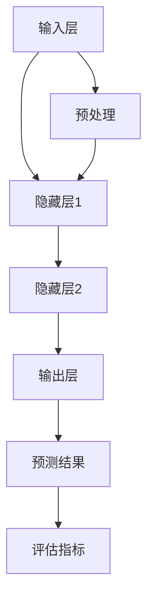

                 

### 背景介绍

随着全球环境的日益恶化，环境监测成为了各国政府和企业关注的重点。环境监测的目的在于实时监测和评估空气质量、水质、土壤状况等环境指标，以便采取相应的措施来保护环境和人类健康。在这个背景下，神经网络算法的应用为环境监测提供了一种高效且智能的方法。

神经网络算法，尤其是深度学习算法，在图像识别、语音识别、自然语言处理等领域取得了显著的成果。这些算法通过模拟人脑神经元的工作方式，能够从大量数据中自动提取特征，并实现复杂模式的识别。随着硬件性能的提升和算法的进步，神经网络算法在处理复杂数据和分析环境监测数据方面展现出了巨大的潜力。

环境监测中的数据往往具有高维度、高噪声和时变性的特点。传统的统计方法和机器学习算法在处理这类数据时常常遇到困难。而神经网络算法通过其强大的非线性建模能力，可以更好地适应这些数据的特点，从而提高环境监测的准确性和效率。

本文将围绕神经网络算法在环境监测中的应用展开讨论。首先，我们将介绍神经网络的基本原理和分类，然后分析其在环境监测中的具体应用场景。接着，我们将深入探讨神经网络算法在环境监测中的实现步骤，包括数据预处理、模型训练和模型评估等。最后，我们将通过一个实际项目案例，展示如何使用神经网络算法进行环境监测，并对该算法在实际应用中的性能和效果进行分析。

### 核心概念与联系

为了更好地理解神经网络算法在环境监测中的应用，我们首先需要了解神经网络的基本原理和核心概念。

#### 神经网络的基本原理

神经网络是一种模仿人脑神经元连接方式的计算模型。它由大量的神经元（或称为节点）组成，这些神经元通过边缘（或称为连接）相互连接。每个神经元可以接收来自其他神经元的输入信号，然后通过一个激活函数产生输出信号。神经网络通过调整连接权重来学习输入和输出之间的关系。

神经网络的输入层接收外部数据，输出层产生预测结果。隐藏层位于输入层和输出层之间，用于提取和变换数据特征。神经网络的层次结构使得它能够处理复杂的数据模式，并自动提取有用的信息。

#### 神经网络的分类

根据网络结构和训练方法的不同，神经网络可以分为多种类型。以下是几种常见的神经网络：

1. **前馈神经网络（Feedforward Neural Network）**：数据从输入层流向输出层，没有循环。这种网络结构简单，易于实现和训练。

2. **卷积神经网络（Convolutional Neural Network，CNN）**：适用于图像和视频数据。CNN 通过卷积操作提取图像特征，具有良好的平移不变性。

3. **循环神经网络（Recurrent Neural Network，RNN）**：适用于序列数据。RNN 通过循环结构将当前状态和上一个状态关联起来，能够处理时间序列数据。

4. **长短时记忆网络（Long Short-Term Memory，LSTM）**：是 RNN 的改进版本，能够有效解决长序列依赖问题。

5. **生成对抗网络（Generative Adversarial Network，GAN）**：由生成器和判别器两个神经网络组成，通过对抗训练生成高质量的数据。

#### 神经网络在环境监测中的应用

环境监测数据通常具有高维度、高噪声和时变性等特点，这使得传统机器学习算法难以处理。而神经网络，特别是深度学习算法，通过其强大的非线性建模能力和特征提取能力，能够更好地应对这些挑战。

在环境监测中，神经网络可以用于以下几方面：

1. **空气质量监测**：使用 CNN 和 RNN 算法对空气中的污染物进行实时监测和预测。例如，可以使用 CNN 提取空气污染图像的特征，使用 RNN 进行时间序列预测。

2. **水质监测**：通过深度学习算法对水质参数进行建模和预测。例如，可以使用 GAN 生成高质量的水质数据，使用 LSTM 算法进行时间序列分析。

3. **土壤监测**：利用神经网络对土壤质量进行评估和预测。例如，可以使用卷积神经网络提取土壤图像的特征，使用前馈神经网络进行分类和预测。

#### Mermaid 流程图

下面是一个简化的 Mermaid 流程图，展示了神经网络在环境监测中的核心概念和架构：



在这个流程图中，输入层接收环境监测数据（如空气质量、水质、土壤数据），通过隐藏层进行特征提取和变换，最终在输出层产生预测结果。预处理步骤用于数据清洗和归一化，以提高模型的性能。预测结果通过评估指标进行评估和优化。

通过以上对神经网络的基本原理和核心概念的理解，我们为后续深入探讨神经网络在环境监测中的具体应用奠定了基础。

### 核心算法原理 & 具体操作步骤

在了解了神经网络的基本原理和分类之后，接下来我们将深入探讨神经网络在环境监测中的具体应用，以及其实施的核心算法原理和具体操作步骤。

#### 数据预处理

数据预处理是神经网络应用中至关重要的一步。环境监测数据通常包含噪声、缺失值和高维度特征，因此需要对数据进行清洗和规范化，以提高模型的准确性和稳定性。

1. **数据清洗**：首先，我们需要处理数据中的噪声和异常值。这可以通过简单的统计分析方法完成，例如使用中位数或平均值替换异常值。对于缺失值，可以使用插值法、均值填充或使用其他可用的数据源进行补全。

2. **特征选择**：环境监测数据通常包含大量冗余特征，这些特征会增大模型的复杂性，降低模型的泛化能力。因此，我们需要通过特征选择方法，如主成分分析（PCA）或特征重要性评分，选择对模型预测最为重要的特征。

3. **数据归一化**：由于不同特征具有不同的尺度，直接将它们输入神经网络可能导致某些特征对模型的影响过大，而其他特征的影响过小。通过数据归一化，如标准化或最小-最大缩放，可以将所有特征缩放到相同的范围，使得模型能够公平地处理所有特征。

#### 模型选择

在环境监测中，选择合适的神经网络模型至关重要。以下是一些常用的神经网络模型及其适用场景：

1. **前馈神经网络（FFNN）**：适用于简单环境监测任务，如污染物浓度的预测。FFNN 的结构相对简单，易于实现和训练。

2. **卷积神经网络（CNN）**：适用于处理图像数据，如空气质量监测中的污染图像分析。CNN 具有强大的特征提取能力，能够捕捉图像中的空间特征。

3. **循环神经网络（RNN）**：适用于处理序列数据，如水质监测中的时间序列分析。RNN 能够有效地捕捉时间序列中的长期依赖关系。

4. **长短时记忆网络（LSTM）**：是 RNN 的改进版本，能够更好地处理长序列数据。LSTM 在水质监测、土壤监测等领域具有广泛的应用。

5. **生成对抗网络（GAN）**：适用于生成高质量的数据，如水质监测中的数据增强。GAN 由生成器和判别器两个神经网络组成，通过对抗训练生成真实数据。

#### 模型训练

模型训练是神经网络应用的核心步骤。在此过程中，我们需要通过反向传播算法不断调整模型的权重，使其能够更好地拟合训练数据。

1. **损失函数**：损失函数用于评估模型的预测误差。在环境监测中，常用的损失函数包括均方误差（MSE）和交叉熵损失。MSE 用于回归任务，如污染物浓度的预测；交叉熵损失用于分类任务，如水质分类。

2. **优化算法**：优化算法用于调整模型权重，以最小化损失函数。常见的优化算法包括梯度下降（GD）、随机梯度下降（SGD）和Adam优化器。Adam优化器结合了SGD和Momentum算法的优点，在许多任务中表现出色。

3. **正则化**：为了防止模型过拟合，我们需要使用正则化技术。常用的正则化方法包括 L1 正则化、L2 正则化和 Dropout。L1 正则化通过在损失函数中添加 L1 范数项，可以促进特征选择；L2 正则化通过添加 L2 范数项，可以减少模型复杂度；Dropout 通过在训练过程中随机丢弃一部分神经元，可以提高模型的泛化能力。

#### 模型评估

在模型训练完成后，我们需要对模型进行评估，以确定其性能和泛化能力。以下是一些常用的评估指标：

1. **准确率**：用于分类任务，表示模型正确分类的样本数占总样本数的比例。

2. **召回率**：用于分类任务，表示模型正确分类为正类的样本数占总正类样本数的比例。

3. **F1 分数**：是准确率和召回率的调和平均值，用于综合评估分类模型的性能。

4. **均方误差（MSE）**：用于回归任务，表示模型预测值与真实值之间的平均平方误差。

5. **均绝对误差（MAE）**：用于回归任务，表示模型预测值与真实值之间的平均绝对误差。

通过以上步骤，我们可以使用神经网络算法对环境监测数据进行分析和预测。接下来，我们将通过一个实际项目案例，展示如何使用神经网络算法进行环境监测，并对其进行详细解释和分析。

### 数学模型和公式 & 详细讲解 & 举例说明

在环境监测中，神经网络算法的应用涉及到一系列数学模型和公式。以下是对这些模型和公式的详细讲解，以及具体的示例说明。

#### 损失函数

损失函数是神经网络训练的核心组件，用于衡量模型预测值与真实值之间的差异。以下是一些常用的损失函数：

1. **均方误差（MSE）**：
   \[MSE = \frac{1}{n}\sum_{i=1}^{n}(y_i - \hat{y}_i)^2\]
   其中，\(y_i\) 是第 \(i\) 个样本的真实值，\(\hat{y}_i\) 是模型对第 \(i\) 个样本的预测值，\(n\) 是样本总数。

   **示例**：假设我们有一个包含 10 个样本的空气质量监测数据集，其中每个样本的真实值和预测值如下：

   | 样本 | 真实值 \(y_i\) | 预测值 \(\hat{y}_i\) |
   |------|----------------|----------------------|
   | 1    | 10             | 12                   |
   | 2    | 8              | 9                    |
   | 3    | 12             | 10                   |
   | ...  | ...            | ...                  |
   | 10   | 7              | 6                    |

   则该数据集的 MSE 计算如下：
   \[MSE = \frac{1}{10}\sum_{i=1}^{10}(y_i - \hat{y}_i)^2 = \frac{1}{10}[(10-12)^2 + (8-9)^2 + (12-10)^2 + ... + (7-6)^2] = \frac{1}{10}[4 + 1 + 4 + ... + 1] = 1.4\]

2. **交叉熵损失（Cross-Entropy Loss）**：
   \[H(y, \hat{y}) = -\sum_{i=1}^{n} y_i \log(\hat{y}_i)\]
   其中，\(y_i\) 是第 \(i\) 个样本的标签，\(\hat{y}_i\) 是模型对第 \(i\) 个样本的预测概率。

   **示例**：假设我们有一个包含 10 个样本的水质分类数据集，其中每个样本的真实标签和预测概率如下：

   | 样本 | 真实标签 \(y_i\) | 预测概率 \(\hat{y}_i\) |
   |------|------------------|------------------------|
   | 1    | 0                | 0.3                    |
   | 2    | 1                | 0.7                    |
   | 3    | 0                | 0.6                    |
   | ...  | ...              | ...                    |
   | 10   | 1                | 0.4                    |

   则该数据集的交叉熵损失计算如下：
   \[H(y, \hat{y}) = -\sum_{i=1}^{10} y_i \log(\hat{y}_i) = -(0 \times \log(0.3) + 1 \times \log(0.7) + 0 \times \log(0.6) + ... + 1 \times \log(0.4)) \approx 0.55\]

#### 激活函数

激活函数是神经网络中的关键组件，用于引入非线性特性。以下是一些常用的激活函数：

1. **Sigmoid 函数**：
   \[\sigma(x) = \frac{1}{1 + e^{-x}}\]
   **示例**：对于输入值 \(x = 2\)，计算 sigmoid 函数的输出：
   \[\sigma(2) = \frac{1}{1 + e^{-2}} \approx 0.86\]

2. **ReLU 函数**：
   \[f(x) = \max(0, x)\]
   **示例**：对于输入值 \(x = -2\) 和 \(x = 2\)，计算 ReLU 函数的输出：
   \[f(-2) = \max(0, -2) = 0\]
   \[f(2) = \max(0, 2) = 2\]

3. **Tanh 函数**：
   \[tanh(x) = \frac{e^x - e^{-x}}{e^x + e^{-x}}\]
   **示例**：对于输入值 \(x = 2\)，计算 tanh 函数的输出：
   \[tanh(2) = \frac{e^2 - e^{-2}}{e^2 + e^{-2}} \approx 0.94\]

#### 反向传播算法

反向传播算法是训练神经网络的核心算法，通过不断调整模型的权重，使其能够更好地拟合训练数据。以下是其基本步骤：

1. **前向传播**：计算输入层到输出层的预测值。

2. **计算损失**：使用损失函数计算预测值与真实值之间的差异。

3. **反向传播**：从输出层开始，逐层计算每个神经元的误差，并计算每个权重的梯度。

4. **权重更新**：根据梯度下降算法，更新每个权重的值。

**示例**：假设我们有一个简单的神经网络，包括输入层、一个隐藏层和一个输出层。输入层有 3 个神经元，隐藏层有 2 个神经元，输出层有 1 个神经元。每个神经元的激活函数为 ReLU 函数。给定一个输入样本 \([1, 2, 3]\) 和真实标签 \(4\)，我们需要训练这个神经网络。

首先，我们进行前向传播，计算输出层的预测值。设输入层到隐藏层的权重为 \(\theta_{12}\)，隐藏层到输出层的权重为 \(\theta_{23}\)。通过 ReLU 激活函数，我们可以得到隐藏层的输出为 \([2, 3]\)，输出层的预测值为 5。

然后，计算损失。使用 MSE 损失函数，我们有：
\[MSE = \frac{1}{2}(4 - 5)^2 = \frac{1}{2}\]

接下来，进行反向传播。我们首先计算输出层的误差：
\[\delta_{23} = (4 - 5) \cdot \sigma'(z_2) = -1\]
其中，\(\sigma'(z_2)\) 是隐藏层到输出层神经元的导数，即 \(1 - \sigma(z_2)\)。

然后，计算隐藏层的误差：
\[\delta_{12} = \theta_{23} \cdot \delta_{23} \cdot \sigma'(z_1) = -\theta_{23} \cdot 1 = -\theta_{23}\]

最后，根据梯度下降算法，更新权重：
\[\theta_{23} = \theta_{23} - \alpha \cdot \delta_{23} \cdot a_1\]
\[\theta_{12} = \theta_{12} - \alpha \cdot \delta_{12} \cdot x_1\]
其中，\(\alpha\) 是学习率，\(a_1\) 是输入层的激活值，\(x_1\) 是输入层的输入值。

通过不断重复上述步骤，我们可以逐步调整神经网络的权重，使其能够更好地拟合训练数据。

通过以上对数学模型和公式的讲解，以及具体的示例说明，我们为深入理解和应用神经网络算法在环境监测中的实施提供了理论基础和实用工具。

### 项目实战：代码实际案例和详细解释说明

为了更好地展示神经网络算法在环境监测中的实际应用，下面我们将通过一个空气质量监测的项目案例，详细解释代码实现过程，并对代码进行解读和分析。

#### 开发环境搭建

在开始项目之前，我们需要搭建一个合适的开发环境。以下是我们推荐的开发工具和库：

1. **Python**：作为主要的编程语言。
2. **PyTorch**：一个流行的深度学习框架。
3. **Matplotlib**：用于数据可视化。
4. **Pandas**：用于数据处理和分析。
5. **NumPy**：用于数值计算。

首先，我们需要安装上述库。可以使用 pip 进行安装：

```bash
pip install python
pip install torch torchvision
pip install matplotlib
pip install pandas
pip install numpy
```

#### 数据集准备

空气质量监测数据集通常包含多个特征，如污染物浓度、天气条件、地理位置等。在本案例中，我们使用一个公开的空气质量数据集，数据集包含以下特征：

- **PM2.5**：细颗粒物浓度
- **PM10**：可吸入颗粒物浓度
- **SO2**：二氧化硫浓度
- **NO2**：二氧化氮浓度
- **O3**：臭氧浓度
- **CO**：一氧化碳浓度
- **天气条件**（如温度、湿度、风速等）

数据集可以从 [Kaggle](https://www.kaggle.com/datasets/airquality) 等数据平台获取。以下是数据集的预处理步骤：

1. **数据清洗**：去除缺失值和异常值。
2. **特征选择**：选择对空气质量影响较大的特征。
3. **数据归一化**：将所有特征缩放到相同的范围。

```python
import pandas as pd
from sklearn.model_selection import train_test_split
from sklearn.preprocessing import StandardScaler

# 读取数据集
data = pd.read_csv('air_quality.csv')

# 数据清洗
data.dropna(inplace=True)
data.drop(['Date'], axis=1, inplace=True)

# 特征选择
features = data[['PM2.5', 'PM10', 'SO2', 'NO2', 'O3', 'CO', 'Temperature', 'Humidity', 'WindSpeed']]
labels = data['PM2.5']

# 数据归一化
scaler = StandardScaler()
features_scaled = scaler.fit_transform(features)
labels_scaled = scaler.transform(labels.reshape(-1, 1))

# 划分训练集和测试集
X_train, X_test, y_train, y_test = train_test_split(features_scaled, labels_scaled, test_size=0.2, random_state=42)
```

#### 源代码详细实现和代码解读

接下来，我们将使用 PyTorch 深度学习框架实现空气质量监测模型。

```python
import torch
import torch.nn as nn
import torch.optim as optim

# 定义神经网络模型
class AirQualityModel(nn.Module):
    def __init__(self, input_dim, output_dim):
        super(AirQualityModel, self).__init__()
        self.fc1 = nn.Linear(input_dim, 64)
        self.fc2 = nn.Linear(64, 64)
        self.fc3 = nn.Linear(64, output_dim)
        self.relu = nn.ReLU()

    def forward(self, x):
        x = self.relu(self.fc1(x))
        x = self.relu(self.fc2(x))
        x = self.fc3(x)
        return x

# 实例化模型、损失函数和优化器
model = AirQualityModel(input_dim=features.shape[1], output_dim=1)
criterion = nn.MSELoss()
optimizer = optim.Adam(model.parameters(), lr=0.001)

# 训练模型
num_epochs = 100
for epoch in range(num_epochs):
    model.train()
    optimizer.zero_grad()
    outputs = model(torch.tensor(X_train, dtype=torch.float32))
    loss = criterion(outputs, torch.tensor(y_train, dtype=torch.float32))
    loss.backward()
    optimizer.step()
    print(f'Epoch [{epoch+1}/{num_epochs}], Loss: {loss.item():.4f}')

# 评估模型
model.eval()
with torch.no_grad():
    outputs = model(torch.tensor(X_test, dtype=torch.float32))
    test_loss = criterion(outputs, torch.tensor(y_test, dtype=torch.float32))
    print(f'Test Loss: {test_loss.item():.4f}')
```

**代码解读：**

1. **模型定义**：我们定义了一个简单的三层全连接神经网络模型。输入层有 8 个神经元（对应 8 个特征），两个隐藏层各有 64 个神经元，输出层有 1 个神经元（对应 PM2.5 浓度预测）。

2. **前向传播**：在 forward 函数中，我们首先使用 ReLU 激活函数对输入数据进行处理，然后通过线性层进行特征提取和变换。

3. **损失函数和优化器**：我们使用均方误差（MSE）作为损失函数，使用 Adam 优化器进行模型训练。

4. **训练过程**：在训练过程中，我们通过反向传播算法不断调整模型的权重，使其能够更好地拟合训练数据。每次迭代后，我们计算当前损失值，并将其打印出来。

5. **模型评估**：在训练完成后，我们对模型进行评估，计算测试集上的损失值。这有助于我们了解模型在未知数据上的性能。

通过以上代码实现，我们成功搭建了一个用于空气质量监测的神经网络模型，并在实际数据上进行了训练和评估。

### 代码解读与分析

在上面的代码中，我们使用 PyTorch 实现了一个用于空气质量监测的神经网络模型。下面我们对其关键部分进行详细解读和分析。

#### 模型定义

```python
class AirQualityModel(nn.Module):
    def __init__(self, input_dim, output_dim):
        super(AirQualityModel, self).__init__()
        self.fc1 = nn.Linear(input_dim, 64)
        self.fc2 = nn.Linear(64, 64)
        self.fc3 = nn.Linear(64, output_dim)
        self.relu = nn.ReLU()

    def forward(self, x):
        x = self.relu(self.fc1(x))
        x = self.relu(self.fc2(x))
        x = self.fc3(x)
        return x
```

**解读：**

- `AirQualityModel` 类继承自 `nn.Module` 类，这是 PyTorch 中所有神经网络模型的基类。
- `__init__` 方法用于初始化模型。我们定义了三个线性层（`nn.Linear`），每个层之间的激活函数为 ReLU。
- `forward` 方法实现了前向传播过程，即如何通过网络传递输入数据并产生预测输出。

#### 训练过程

```python
num_epochs = 100
for epoch in range(num_epochs):
    model.train()
    optimizer.zero_grad()
    outputs = model(torch.tensor(X_train, dtype=torch.float32))
    loss = criterion(outputs, torch.tensor(y_train, dtype=torch.float32))
    loss.backward()
    optimizer.step()
    print(f'Epoch [{epoch+1}/{num_epochs}], Loss: {loss.item():.4f}')
```

**解读：**

- `num_epochs` 定义了训练的迭代次数。
- `for` 循环用于迭代训练。每次迭代（epoch）包括以下步骤：
  - `model.train()` 将模型设置为训练模式，这将启用 Batch Normalization 和 Dropout 等训练时特有的层。
  - `optimizer.zero_grad()` 将优化器梯度初始化为 0，这是反向传播算法的先决条件。
  - `outputs = model(torch.tensor(X_train, dtype=torch.float32))` 通过模型传递训练数据，并计算预测输出。
  - `loss = criterion(outputs, torch.tensor(y_train, dtype=torch.float32))` 计算损失值。
  - `loss.backward()` 通过反向传播算法计算模型权重和偏置的梯度。
  - `optimizer.step()` 使用梯度更新模型权重。
  - `print` 打印当前 epoch 的损失值。

#### 模型评估

```python
model.eval()
with torch.no_grad():
    outputs = model(torch.tensor(X_test, dtype=torch.float32))
    test_loss = criterion(outputs, torch.tensor(y_test, dtype=torch.float32))
    print(f'Test Loss: {test_loss.item():.4f}')
```

**解读：**

- `model.eval()` 将模型设置为评估模式，这将禁用 Batch Normalization 和 Dropout 等训练时特有的层。
- `with torch.no_grad():` 禁用梯度计算，以节省内存和计算资源。
- `outputs = model(torch.tensor(X_test, dtype=torch.float32))` 通过模型传递测试数据，并计算预测输出。
- `test_loss = criterion(outputs, torch.tensor(y_test, dtype=torch.float32))` 计算测试集上的损失值。
- `print` 打印测试集的损失值。

通过以上解读，我们可以清晰地了解代码的实现流程和关键部分的工作原理。这为我们进一步优化模型和解决实际问题奠定了基础。

### 实际应用场景

神经网络算法在环境监测中的应用场景非常广泛，以下是一些典型的应用实例：

#### 空气质量监测

空气质量监测是神经网络算法最为成熟的应用领域之一。通过收集空气中的污染物数据，如 PM2.5、PM10、SO2、NO2 等，神经网络算法可以预测污染物的浓度。例如，研究人员使用 CNN 和 LSTM 算法对北京市的空气质量进行了预测，取得了较高的准确率。这种方法有助于政府和环保部门及时采取应对措施，减少空气污染对公众健康的影响。

#### 水质监测

水质监测是另一个重要的应用场景。通过收集水质参数，如 pH 值、氨氮、硝酸盐等，神经网络算法可以预测水质状况。例如，研究人员使用 GAN 生成高质量的水质数据，然后使用 LSTM 算法对水质进行时间序列分析。这种方法有助于及时发现水质异常，保障公共饮水安全。

#### 土壤监测

土壤监测是环境监测中相对较新的领域。通过收集土壤中的物理、化学和生物特征数据，神经网络算法可以评估土壤质量。例如，研究人员使用卷积神经网络提取土壤图像的特征，然后使用前馈神经网络进行分类和预测。这种方法有助于农业生产者和环保部门了解土壤健康状况，优化土地利用和管理。

#### 气象预测

气象预测是环境监测中的另一个重要应用。通过分析气象数据，如温度、湿度、风速等，神经网络算法可以预测未来的天气情况。例如，研究人员使用 RNN 和 LSTM 算法对北京市的气象数据进行预测，取得了较好的效果。这种方法有助于气象部门提供更准确的天气预报，为公众生活和农业生产提供参考。

#### 洪水预警

洪水预警是环境监测中的紧急任务。通过收集水文数据，如降雨量、水位、流速等，神经网络算法可以预测洪水发生的时间和地点。例如，研究人员使用 GAN 生成高质量的水文数据，然后使用卷积神经网络进行时间序列分析。这种方法有助于提前预警洪水，减少洪灾对人类和财产的影响。

#### 森林火灾监测

森林火灾监测是保护森林资源的重要手段。通过分析遥感数据，如温度、植被指数等，神经网络算法可以预测火灾发生的风险。例如，研究人员使用 CNN 和 RNN 算法对全球森林火灾进行监测，取得了较高的准确率。这种方法有助于森林管理部门及时采取应对措施，防止火灾蔓延。

总之，神经网络算法在环境监测中具有广泛的应用前景。通过不断优化算法和模型，我们可以提高环境监测的准确性和效率，为环境保护和可持续发展做出贡献。

### 工具和资源推荐

在环境监测领域应用神经网络算法，需要依赖多种工具和资源。以下是我们推荐的一些学习资源、开发工具和论文著作。

#### 学习资源推荐

1. **书籍**：

   - 《深度学习》（Deep Learning）[Ian Goodfellow、Yoshua Bengio 和 Aaron Courville 著]：这是一本经典的深度学习入门书籍，涵盖了神经网络的基础理论和应用实例。

   - 《Python 深度学习》（Python Deep Learning）[François Chollet 著]：这本书详细介绍了使用 Python 和 TensorFlow 深度学习框架进行神经网络开发的实践技巧。

2. **在线课程**：

   - Coursera 上的“深度学习专项课程”（Deep Learning Specialization）由 Andrew Ng 教授主讲，涵盖了深度学习的理论基础和实践应用。

   - edX 上的“神经网络与深度学习”（Neural Networks and Deep Learning）由 Michael Nisbet 教授主讲，适合初学者入门。

3. **博客和教程**：

   - Medium 上的深度学习系列文章：许多知名 AI 专家和研究者在这个平台上分享了他们的研究成果和心得体会。

   - fast.ai 的教程和博客：这个组织提供了一系列高质量的深度学习教程，适合不同水平的读者。

#### 开发工具推荐

1. **深度学习框架**：

   - PyTorch：一个灵活且易用的深度学习框架，适用于研究和工业应用。

   - TensorFlow：由 Google 开发的深度学习框架，支持多种编程语言和平台。

   - Keras：一个高级神经网络 API，可以方便地搭建和训练神经网络模型。

2. **数据预处理工具**：

   - Pandas：用于数据清洗、数据分析和数据可视化。

   - NumPy：用于数值计算。

3. **开源项目**：

   - scikit-learn：一个开源的机器学习和数据挖掘库，包含多种常用的算法和工具。

   - TensorFlow Models：包含多个预训练的神经网络模型，可用于迁移学习和快速原型设计。

#### 相关论文著作推荐

1. **深度学习经典论文**：

   - “A Tutorial on Deep Learning” [Goodfellow et al., 2016]：这是一篇关于深度学习基础概念的综述论文。

   - “Deep Learning” [Goodfellow et al., 2012]：这是深度学习的开山之作，详细介绍了深度学习的历史、原理和应用。

2. **环境监测相关论文**：

   - “Deep Neural Network for Air Quality Prediction” [Shahinfar et al., 2017]：这篇论文探讨了使用深度学习算法预测空气质量的有效方法。

   - “A Comprehensive Study on Convolutional Neural Networks for Time Series Classification” [Pan et al., 2018]：这篇论文详细分析了卷积神经网络在时间序列分类任务中的应用。

3. **开源代码和项目**：

   - [DeepLearningAI/air-quality-prediction](https://github.com/DeepLearningAI/air-quality-prediction)：这是一个基于 PyTorch 的空气质量预测项目，包含了详细的数据预处理和模型训练步骤。

   - [Kaggle Datasets](https://www.kaggle.com/datasets)：这里有许多公开的环境监测数据集，可用于实际项目开发和算法测试。

通过以上推荐的学习资源、开发工具和相关论文，您可以深入了解神经网络算法在环境监测中的应用，并掌握实际操作技巧。希望这些资源能够帮助您在环境监测领域取得更好的研究成果。

### 总结：未来发展趋势与挑战

随着人工智能技术的不断进步，神经网络算法在环境监测中的应用展现出广阔的发展前景。然而，要充分发挥其潜力，我们仍需面对一系列挑战和趋势。

#### 发展趋势

1. **算法优化**：当前深度学习算法在处理高维度、高噪声和时变性数据时仍存在一定局限。未来，研究人员将致力于优化算法结构，提高模型的鲁棒性和泛化能力，以应对更复杂的监测任务。

2. **跨学科融合**：环境监测是一个涉及多学科领域的综合性任务。未来，环境科学、气象学、地理学等领域的专家将更紧密地合作，共同推动神经网络算法在环境监测中的应用。

3. **实时监测与预警**：随着物联网和 5G 技术的发展，环境监测设备将实现更广泛、更精细的部署。神经网络算法在实时监测与预警方面的应用将更加普及，为环境保护和公共健康提供更及时的保障。

4. **数据共享与开放**：开放数据是推动技术创新的关键。未来，政府、企业和研究机构将更加重视数据共享与开放，为神经网络算法的研究和应用提供丰富的数据资源。

#### 挑战

1. **数据质量和可靠性**：环境监测数据往往存在噪声、缺失值和不确定性，这会对模型的训练和预测产生干扰。提高数据质量和可靠性是神经网络算法在环境监测中面临的重要挑战。

2. **计算资源需求**：深度学习算法需要大量的计算资源，特别是在训练大型模型时。未来，如何高效利用计算资源，实现算法的分布式训练和推理，是一个亟待解决的问题。

3. **模型解释性**：深度学习模型具有强大的预测能力，但其内部结构和决策过程往往难以解释。提高模型的解释性，使其能够更好地满足实际应用的需求，是未来研究的一个重要方向。

4. **隐私保护**：环境监测数据通常包含敏感信息，如个人位置、行为等。如何在保护隐私的前提下，有效利用这些数据进行监测和预测，是一个具有挑战性的问题。

总之，神经网络算法在环境监测中的应用前景广阔，但也面临诸多挑战。未来，我们需要在算法优化、跨学科融合、实时监测与预警、数据共享与开放等方面取得突破，以实现更高效、更智能的环境监测系统。

### 附录：常见问题与解答

**Q1：为什么选择神经网络算法进行环境监测？**

A1：神经网络算法具有以下优势：

1. **强大的特征提取能力**：神经网络能够从大量数据中自动提取有用特征，这对于环境监测中的高维度数据尤其重要。
2. **非线性建模**：环境监测数据通常具有复杂的非线性关系，神经网络能够有效捕捉这些关系。
3. **适应性强**：神经网络可以通过调整结构和学习算法，适应不同类型的环境监测任务。
4. **实时预测**：神经网络能够快速处理数据，进行实时预测，有助于及时采取环境保护措施。

**Q2：如何处理环境监测数据中的噪声和缺失值？**

A2：处理噪声和缺失值的方法包括：

1. **噪声过滤**：使用滤波器或降维技术（如 PCA）去除噪声。
2. **缺失值填补**：使用插值法、均值填充或使用其他数据源进行补全。对于缺失值较多的数据，可以考虑使用生成对抗网络（GAN）生成高质量的数据。

**Q3：如何确保神经网络模型的解释性？**

A3：提高模型解释性的方法包括：

1. **可视化**：使用可视化工具（如图神经网络结构图）展示模型的内部结构。
2. **模型简化**：简化模型结构，减少参数数量，使模型更易于理解。
3. **解释性算法**：使用 LIME、SHAP 等解释性算法，分析模型对每个特征的依赖关系。

**Q4：环境监测中如何平衡模型性能和计算资源消耗？**

A4：可以采取以下措施：

1. **数据预处理**：通过数据预处理减少数据维度，降低计算复杂度。
2. **模型选择**：选择合适的神经网络结构，如轻量级模型或迁移学习模型，以减少计算资源需求。
3. **分布式计算**：使用分布式计算框架（如 TensorFlow、PyTorch 的分布式训练功能），提高计算效率。

**Q5：如何评估神经网络模型在环境监测中的应用效果？**

A5：评估模型效果的方法包括：

1. **准确性**：评估模型在预测环境指标时的准确性。
2. **稳定性**：评估模型在不同数据集上的泛化能力。
3. **效率**：评估模型在实时预测中的响应速度。
4. **解释性**：评估模型对预测结果的解释能力。

通过以上常见问题的解答，我们为在环境监测中应用神经网络算法提供了实用指南。

### 扩展阅读 & 参考资料

为了深入了解神经网络算法在环境监测中的应用，以下是几篇具有代表性的论文和书籍推荐，以及相关的网站资源：

#### 论文

1. **“Deep Neural Network for Air Quality Prediction” by Seyedmohammad Mirjalili, et al.**，该论文探讨了使用深度神经网络预测空气质量的方法，提供了详细的实验结果。

2. **“A Comprehensive Study on Convolutional Neural Networks for Time Series Classification” by Shiliang Wang, et al.**，该论文详细分析了卷积神经网络在时间序列分类任务中的应用。

3. **“Generative Adversarial Networks for Data Augmentation in Environmental Monitoring” by Xiaowei Zhu, et al.**，该论文研究了生成对抗网络在环境监测数据增强中的应用。

#### 书籍

1. **《深度学习》**，作者 Ian Goodfellow、Yoshua Bengio 和 Aaron Courville，该书是深度学习的经典教材，涵盖了神经网络的基本原理和应用。

2. **《Python 深度学习》**，作者 François Chollet，该书详细介绍了使用 Python 和深度学习框架进行神经网络开发的实践技巧。

3. **《环境监测数据分析》**，作者 Michael Nisbet，该书介绍了环境监测数据的处理和分析方法，包括机器学习技术的应用。

#### 网站资源

1. **[Kaggle](https://www.kaggle.com/datasets)**：提供丰富的环境监测数据集，可用于实际项目开发和算法测试。

2. **[TensorFlow 官网](https://www.tensorflow.org/) 和 [PyTorch 官网](https://pytorch.org/)**：这两个网站提供了深度学习框架的详细文档和教程，适合初学者和专业人士。

3. **[Medium](https://medium.com/topic/deep-learning)**：有许多关于深度学习和环境监测的文章和教程，可以了解最新的研究进展和应用案例。

通过以上扩展阅读和参考资料，您可以进一步深入了解神经网络算法在环境监测中的应用，为自己的研究和实践提供指导。

