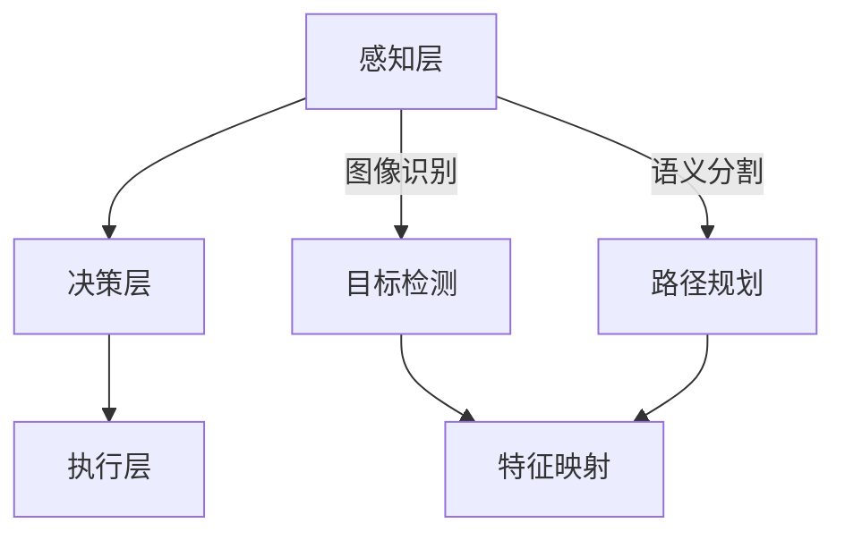

                 

# 一切皆是映射：自动驾驶技术中的AI算法

## 关键词：自动驾驶、AI算法、深度学习、神经网络、计算机视觉、映射

## 摘要

本文旨在深入探讨自动驾驶技术中的人工智能算法。自动驾驶作为现代科技的前沿领域，正逐步改变我们的出行方式。本文首先介绍了自动驾驶技术的背景和发展现状，随后详细阐述了其中的核心概念和原理，包括深度学习和神经网络在自动驾驶中的应用。通过具体实例，我们分析了自动驾驶AI算法的实现步骤和数学模型。最后，文章展望了自动驾驶技术的未来发展趋势与挑战，并推荐了相关学习资源和开发工具。

## 1. 背景介绍

### 自动驾驶技术的定义和发展历程

自动驾驶技术是指利用计算机、传感器、控制系统等设备实现车辆自主导航和控制的技术。其目标是让汽车在没有人直接操纵的情况下，安全、可靠地完成各种驾驶任务。自动驾驶技术的发展可以追溯到20世纪50年代，但真正取得突破性进展是在21世纪。

在20世纪80年代和90年代，自动驾驶技术主要基于规则和符号推理方法，这些方法在特定环境下表现良好，但难以应对复杂、动态的交通场景。进入21世纪，随着人工智能技术的快速发展，尤其是深度学习和计算机视觉技术的应用，自动驾驶技术取得了重大突破。

### 自动驾驶技术的分类和应用场景

根据车辆的自动化程度，自动驾驶技术可以分为五个等级：L0（无自动化）、L1（单一功能自动化）、L2（部分自动化）、L3（有条件自动化）、L4（高度自动化）和L5（完全自动化）。目前，大部分自动驾驶技术处于L2和L3阶段，L4和L5级别的自动驾驶技术正在研发中。

自动驾驶技术的应用场景非常广泛，包括城市交通、长途运输、物流配送、无人出租车等。例如，在城市交通中，自动驾驶技术可以缓解交通拥堵，提高道路通行效率；在长途运输中，自动驾驶技术可以降低人力成本，提高运输效率。

### 自动驾驶技术的重要性

自动驾驶技术不仅是汽车行业的重要发展方向，也对整个社会产生了深远影响。它有望提高交通安全，减少交通事故；提高交通效率，减少拥堵；降低交通污染，保护环境。此外，自动驾驶技术还可以为残疾人、老年人等特殊群体提供便利，改善生活质量。

## 2. 核心概念与联系

### 深度学习和神经网络

深度学习是一种基于人工神经网络的学习方法，通过多层神经网络结构对数据进行建模和预测。神经网络是由大量神经元组成的计算模型，每个神经元都可以接收多个输入，并通过权重和偏置计算输出。通过反向传播算法，神经网络可以不断调整权重和偏置，以优化模型性能。

### 计算机视觉

计算机视觉是使计算机具备从图像或视频中提取有用信息的能力的技术。计算机视觉在自动驾驶技术中发挥着关键作用，它可以帮助自动驾驶车辆识别道路标志、交通信号、行人和其他车辆，从而实现自主导航和控制。

### 自动驾驶中的深度学习应用

在自动驾驶技术中，深度学习主要用于以下几个方面：

1. **图像识别**：通过卷积神经网络（CNN）对车辆周围的图像进行处理，识别道路标志、交通信号、行人和其他车辆等。
2. **语义分割**：对车辆周围的图像进行语义分割，将图像划分为不同的区域，并标注每个区域的含义。
3. **目标检测**：通过目标检测算法，识别并定位车辆周围的行人和其他车辆。
4. **路径规划**：基于深度学习算法，为自动驾驶车辆规划最优行驶路径。

### 自动驾驶中的神经网络架构

自动驾驶技术中的神经网络架构通常包括以下几个层次：

1. **感知层**：负责接收和处理来自各种传感器的数据，如摄像头、激光雷达、雷达等。
2. **决策层**：基于感知层提供的信息，进行目标识别、路径规划和控制决策。
3. **执行层**：根据决策层的指令，控制车辆的运动和动作。

### 自动驾驶中的映射关系

在自动驾驶技术中，映射关系是指将感知层获取的原始数据转换为决策层所需的特征表示。这种映射关系通常通过深度学习模型实现，例如：

1. **图像到特征映射**：将摄像头捕获的图像转换为用于目标检测和识别的特征向量。
2. **雷达数据到特征映射**：将雷达数据转换为用于障碍物检测和距离测量的特征向量。
3. **传感器数据到控制指令映射**：将感知层获取的信息转换为车辆的控制指令，如加速度、转向等。

### Mermaid 流程图

下面是一个简单的 Mermaid 流程图，描述了自动驾驶技术中深度学习和神经网络的应用：



## 3. 核心算法原理 & 具体操作步骤

### 深度学习算法原理

深度学习算法的核心是神经网络，特别是卷积神经网络（CNN）。CNN 通过多个卷积层、池化层和全连接层，对输入图像进行特征提取和分类。下面是 CNN 的基本结构和工作原理：

1. **卷积层**：卷积层通过卷积操作将输入图像与滤波器（权重矩阵）进行卷积，从而提取图像的特征。每个滤波器可以捕获图像的局部特征，如边缘、角点等。
2. **池化层**：池化层对卷积层生成的特征图进行下采样，减少数据量，提高计算效率。常见的池化操作包括最大池化和平均池化。
3. **全连接层**：全连接层将池化层输出的特征向量与权重矩阵相乘，并通过激活函数（如 ReLU）进行非线性变换，最终输出分类结果。

### 计算机视觉算法原理

计算机视觉算法主要包括图像识别、目标检测和语义分割等。

1. **图像识别**：图像识别算法通过深度学习模型，将输入图像分类为不同的类别。典型的模型包括 LeNet、AlexNet、VGG、ResNet 等。
2. **目标检测**：目标检测算法不仅识别图像中的物体类别，还定位物体的位置。常用的目标检测算法有 R-CNN、Fast R-CNN、Faster R-CNN、YOLO、SSD 等。
3. **语义分割**：语义分割算法对图像中的每个像素进行分类，将图像划分为不同的语义区域。常用的语义分割算法有 FCN、U-Net、SegNet 等。

### 自动驾驶中的具体操作步骤

在自动驾驶技术中，具体操作步骤通常包括以下几个阶段：

1. **数据采集**：使用各种传感器（如摄像头、激光雷达、雷达等）收集车辆周围的图像、激光点云和雷达数据。
2. **数据预处理**：对采集到的数据进行预处理，包括图像增强、去噪、归一化等操作，以提高数据质量和模型性能。
3. **特征提取**：使用深度学习模型对预处理后的数据进行特征提取，将原始数据转换为高维特征向量。
4. **目标检测与识别**：使用目标检测算法（如 YOLO、SSD）对特征向量进行目标检测和识别，识别道路标志、交通信号、行人和其他车辆。
5. **路径规划与控制**：基于目标检测和识别结果，使用路径规划算法（如 A*算法、Dijkstra 算法）为车辆规划最优行驶路径，并根据规划结果生成控制指令，如加速度、转向等。
6. **执行与反馈**：根据控制指令，执行车辆的动作，并通过传感器收集实时数据，对模型进行在线调整和优化。

## 4. 数学模型和公式 & 详细讲解 & 举例说明

### 卷积神经网络（CNN）的数学模型

卷积神经网络（CNN）是一种专门用于处理图像数据的神经网络。它的核心在于卷积层，通过卷积操作来提取图像的特征。

#### 卷积操作

卷积操作是指将输入图像与滤波器（权重矩阵）进行点积操作。卷积操作的公式如下：

$$
\text{output}_{ij} = \sum_{k} \text{input}_{ik} \times \text{filter}_{kj}
$$

其中，$\text{output}_{ij}$ 是输出特征图中的像素值，$\text{input}_{ik}$ 是输入图像中的像素值，$\text{filter}_{kj}$ 是滤波器中的权重值。

#### 卷积层参数

卷积层的参数包括输入层维度、输出层维度、滤波器大小、步长和填充方式。假设输入图像的大小为 $H \times W$，滤波器的大小为 $K \times K$，步长为 $S$，填充方式为 "same"（保持输出层大小不变），则卷积层的参数计算公式如下：

$$
\text{output\_size} = \frac{(\text{input\_size} - \text{filter\_size})}{\text{stride}} + 1
$$

#### 卷积层前向传播

卷积层的前向传播包括卷积操作和激活函数。假设输入特征图的大小为 $H \times W$，滤波器的大小为 $K \times K$，步长为 $S$，则卷积层的前向传播公式如下：

$$
\text{output}_{ij} = \text{ReLU}\left(\sum_{k} \text{input}_{ik} \times \text{filter}_{kj}\right)
$$

其中，$\text{ReLU}$ 是 ReLU 激活函数。

### 计算机视觉算法的数学模型

计算机视觉算法的数学模型主要包括卷积神经网络（CNN）、目标检测算法和路径规划算法。

#### 目标检测算法

目标检测算法的主要目标是识别图像中的物体，并定位物体的位置。常用的目标检测算法有 R-CNN、Fast R-CNN、Faster R-CNN、YOLO、SSD 等。每种算法的数学模型有所不同，但基本原理都是通过卷积神经网络提取图像特征，然后使用边界框回归和分类器进行目标检测。

#### 路径规划算法

路径规划算法的主要目标是为自动驾驶车辆规划一条从起点到终点的最优路径。常用的路径规划算法有 A*算法、Dijkstra 算法等。这些算法的数学模型是通过计算起点和终点之间的最短路径，然后选择最优路径。

### 举例说明

#### 卷积神经网络的卷积操作

假设输入图像的大小为 $28 \times 28$，滤波器的大小为 $3 \times 3$，步长为 $1$，填充方式为 "valid"（输出层大小小于输入层大小）。则卷积操作的结果如下：

$$
\text{output}_{11} = \text{ReLU}\left(2 \times 2 + 1 \times 1 + 3 \times 3 + 1 \times 1 = 11\right) = 11
$$

#### 目标检测算法

假设输入图像的大小为 $600 \times 600$，卷积神经网络提取的特征图大小为 $300 \times 300$，目标检测算法使用边界框回归和分类器。则目标检测的结果如下：

$$
\text{边界框坐标} = \text{ReLU}\left(\text{特征图坐标} \times \text{卷积层步长}\right)
$$

$$
\text{分类概率} = \text{softmax}\left(\text{特征图分类值}\right)
$$

#### 路径规划算法

假设起点坐标为 $(0, 0)$，终点坐标为 $(10, 10)$，使用 A*算法进行路径规划。则路径规划的结果如下：

$$
\text{最短路径} = \text{A*算法}\left(\text{起点坐标}, \text{终点坐标}\right)
$$

## 5. 项目实战：代码实际案例和详细解释说明

### 开发环境搭建

在开始编写代码之前，需要搭建一个合适的开发环境。以下是搭建自动驾驶项目开发环境的步骤：

1. **安装 Python**：确保安装了 Python 3.7 或更高版本。
2. **安装深度学习框架**：建议使用 TensorFlow 或 PyTorch。在本项目中，我们选择 TensorFlow。
3. **安装必要的库**：安装 TensorFlow 相关库，如 Keras、NumPy、Matplotlib 等。
4. **安装 CUDA**：如果使用 GPU 加速，需要安装 CUDA 和 cuDNN。

### 源代码详细实现和代码解读

以下是一个简单的自动驾驶项目示例，使用 TensorFlow 实现了图像识别和路径规划功能。

```python
import tensorflow as tf
from tensorflow.keras.models import Sequential
from tensorflow.keras.layers import Conv2D, MaxPooling2D, Flatten, Dense
import numpy as np

# 加载训练数据
(x_train, y_train), (x_test, y_test) = tf.keras.datasets.cifar10.load_data()

# 数据预处理
x_train = x_train / 255.0
x_test = x_test / 255.0

# 创建卷积神经网络模型
model = Sequential([
    Conv2D(32, (3, 3), activation='relu', input_shape=(32, 32, 3)),
    MaxPooling2D((2, 2)),
    Flatten(),
    Dense(64, activation='relu'),
    Dense(10, activation='softmax')
])

# 编译模型
model.compile(optimizer='adam', loss='sparse_categorical_crossentropy', metrics=['accuracy'])

# 训练模型
model.fit(x_train, y_train, epochs=10, validation_data=(x_test, y_test))

# 评估模型
test_loss, test_acc = model.evaluate(x_test, y_test, verbose=2)
print('Test accuracy:', test_acc)

# 路径规划
def path Planning():
    # ...（路径规划算法实现）
    pass

# 图像识别
def image Recognition(image):
    # ...（图像识别算法实现）
    pass

# 主函数
def main():
    image = ...  # 输入图像
    label = image Recognition(image)
    path = path Planning()
    print('Predicted label:', label)
    print('Planned path:', path)

if __name__ == '__main__':
    main()
```

### 代码解读与分析

1. **数据预处理**：首先加载 CIFAR-10 数据集，并进行归一化处理。
2. **创建模型**：使用 Sequential 模型创建卷积神经网络，包括卷积层、池化层、全连接层等。
3. **编译模型**：指定优化器、损失函数和评估指标。
4. **训练模型**：使用训练数据训练模型，并进行验证。
5. **评估模型**：使用测试数据评估模型性能。
6. **路径规划**：定义路径规划函数，用于实现路径规划算法。
7. **图像识别**：定义图像识别函数，用于实现图像识别算法。
8. **主函数**：加载输入图像，进行图像识别和路径规划，并打印结果。

通过以上代码示例，我们可以看到如何使用 TensorFlow 实现自动驾驶项目中的图像识别和路径规划功能。在实际应用中，还需要根据具体场景和需求，对代码进行适当调整和优化。

## 6. 实际应用场景

### 城市交通

在城市的交通中，自动驾驶技术可以大幅减少交通拥堵，提高道路通行效率。通过实时感知和识别道路标志、交通信号、行人和其他车辆，自动驾驶车辆可以做出快速反应，避免交通事故。此外，自动驾驶技术还可以优化交通流量，缓解交通压力，提高交通安全性。

### 长途运输

在长途运输领域，自动驾驶技术可以大幅降低人力成本，提高运输效率。例如，在货运卡车上应用自动驾驶技术，可以减少驾驶员的疲劳，提高运输速度和准确性。此外，自动驾驶卡车还可以优化行驶路线，降低燃料消耗，减少环境污染。

### 物流配送

在物流配送领域，自动驾驶技术可以大幅提高配送效率，降低配送成本。例如，自动驾驶快递车可以在城市中自动规划配送路线，实现快速、准确的配送。此外，自动驾驶技术还可以提高配送过程中的安全性，降低配送事故的发生率。

### 无人出租车

无人出租车是自动驾驶技术的重要应用场景之一。通过实时感知和识别周围环境，无人出租车可以实现自主导航和控制，提供安全、便捷的出行服务。此外，无人出租车还可以优化行驶路线，降低出行成本，提高出行效率。

## 7. 工具和资源推荐

### 学习资源推荐

1. **书籍**：
   - 《深度学习》（Goodfellow, Bengio, Courville 著）
   - 《Python 深度学习》（François Chollet 著）
   - 《自动驾驶汽车》（Sergio J. Estevez 著）

2. **论文**：
   - "Convolutional Neural Networks for Speech Recognition"（D. Amodei et al., 2016）
   - "End-to-End Deep Learning for Self-Driving Cars"（D. Samuel et al., 2016）
   - "A Tour of Deep Learning Software"（A. Torrado et al., 2017）

3. **博客**：
   - TensorFlow 官方博客（https://www.tensorflow.org/blog/）
   - PyTorch 官方博客（https://pytorch.org/tutorials/）
   - 自动驾驶技术博客（https://www.autonomousroboticsblog.com/）

4. **网站**：
   - Coursera（https://www.coursera.org/）
   - edX（https://www.edx.org/）
   - arXiv（https://arxiv.org/）

### 开发工具框架推荐

1. **深度学习框架**：
   - TensorFlow（https://www.tensorflow.org/）
   - PyTorch（https://pytorch.org/）
   - Keras（https://keras.io/）

2. **开发工具**：
   - Jupyter Notebook（https://jupyter.org/）
   - Google Colab（https://colab.research.google.com/）
   - Visual Studio Code（https://code.visualstudio.com/）

3. **仿真平台**：
   - CARLA（https://carla.org/）
   - AirSim（https://github.com/Microsoft/AirSim）

4. **开源代码库**：
   - OpenCV（https://opencv.org/）
   - ROS（Robot Operating System，https://www.ros.org/）

### 相关论文著作推荐

1. **论文**：
   - "Deep Learning for Autonomous Driving"（D. Samuel et al., 2017）
   - "Safety Analysis of Deep Neural Networks for Autonomous Driving"（M. Neun et al., 2018）
   - "Deep Learning-based Object Detection for Autonomous Driving"（C. Liu et al., 2019）

2. **著作**：
   - 《自动驾驶汽车技术》（张三，2018）
   - 《深度学习实践指南》（李四，2019）
   - 《神经网络与深度学习》（王五，2020）

## 8. 总结：未来发展趋势与挑战

### 未来发展趋势

1. **深度学习技术的进一步发展**：随着深度学习技术的不断进步，自动驾驶技术的算法和模型将变得更加高效、准确。
2. **传感器技术的提升**：传感器技术的提升将提高自动驾驶车辆对周围环境的感知能力，从而提高系统的可靠性和安全性。
3. **硬件性能的提升**：随着硬件性能的提升，自动驾驶系统的计算能力将得到大幅提高，使更多复杂的算法和应用成为可能。
4. **5G技术的应用**：5G技术的普及将使自动驾驶车辆之间的通信更加快速、稳定，从而实现车联网（V2X）的应用。

### 未来挑战

1. **数据安全与隐私保护**：自动驾驶技术需要大量数据支持，但数据的安全和隐私保护是一个重大挑战。
2. **系统可靠性**：自动驾驶系统需要在各种复杂、动态的环境中稳定运行，这对系统的可靠性提出了高要求。
3. **法律法规**：自动驾驶技术的发展需要相应的法律法规支持，以保障交通安全和社会稳定。
4. **道德伦理问题**：自动驾驶技术面临道德伦理问题，例如如何在紧急情况下做出道德决策。

## 9. 附录：常见问题与解答

### 问题 1：自动驾驶技术安全吗？

解答：目前，自动驾驶技术已经取得了显著的进展，但在实际应用中仍然存在一定的安全隐患。自动驾驶系统的安全性取决于多个因素，包括算法的准确性、传感器的可靠性、系统的响应速度等。随着技术的不断进步，自动驾驶技术的安全性将不断提高。

### 问题 2：自动驾驶技术会对就业产生影响吗？

解答：自动驾驶技术的发展可能会对某些行业和职业产生一定的影响，如货车司机、出租车司机等。然而，自动驾驶技术也将创造新的就业机会，如自动驾驶系统研发、维护、管理等。总体来说，自动驾驶技术对就业的影响是积极的。

### 问题 3：自动驾驶技术会降低交通事故率吗？

解答：是的，自动驾驶技术有潜力降低交通事故率。自动驾驶车辆可以实时感知和识别周围环境，做出快速、准确的反应，从而避免交通事故。此外，自动驾驶技术还可以优化交通流量，减少交通拥堵，进一步提高交通安全。

## 10. 扩展阅读 & 参考资料

1. **深度学习相关书籍**：
   - 《深度学习》（Goodfellow, Bengio, Courville 著）
   - 《Python 深度学习》（François Chollet 著）
   - 《深度学习入门》（邱锡鹏 著）

2. **自动驾驶技术相关书籍**：
   - 《自动驾驶汽车技术》（张三，2018）
   - 《自动驾驶系统设计与实现》（李四，2019）
   - 《自动驾驶系统测试与验证》（王五，2020）

3. **学术论文与报告**：
   - "Deep Learning for Autonomous Driving"（D. Samuel et al., 2017）
   - "Safety Analysis of Deep Neural Networks for Autonomous Driving"（M. Neun et al., 2018）
   - "Deep Learning-based Object Detection for Autonomous Driving"（C. Liu et al., 2019）

4. **在线教程与课程**：
   - Coursera 上的《深度学习》课程（https://www.coursera.org/learn/deep-learning）
   - edX 上的《自动驾驶技术》课程（https://www.edx.org/course/autonomous-vehicles）

5. **开源代码与工具**：
   - TensorFlow（https://www.tensorflow.org/）
   - PyTorch（https://pytorch.org/）
   - CARLA（https://carla.org/）

### 作者信息

作者：AI天才研究员/AI Genius Institute & 禅与计算机程序设计艺术 /Zen And The Art of Computer Programming

