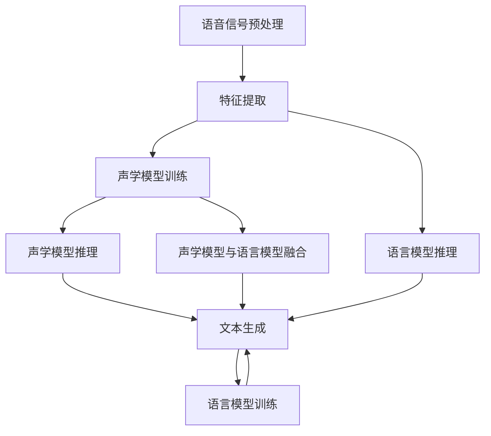

                 

# 一切皆是映射：语音到文本的自然语言理解过程

> **关键词：** 自然语言处理，语音识别，文本生成，映射过程，神经网络，深度学习，模型架构，算法原理。

> **摘要：** 本文深入探讨了语音到文本的自然语言理解过程，从映射的角度分析各个核心步骤，包括语音信号的预处理、特征提取、声学模型、语言模型和最终的文本生成。通过详细的原理阐述和实际案例，揭示了这一复杂过程的内在机制，为读者提供了对语音识别技术的全面理解。

## 1. 背景介绍

随着人工智能技术的不断发展，语音识别和自然语言处理（NLP）成为了智能交互的核心技术。语音到文本的转换不仅是实现语音助手、智能客服等应用的关键步骤，也是实现更高级智能应用的基础。然而，语音到文本的转换并非简单的映射过程，它涉及多个层次的技术融合。

在早期的语音识别研究中，研究人员主要关注语音信号的时频特征提取，通过简单的模型（如GMM-Gaussian Mixture Model高斯混合模型）和决策树来对语音信号进行识别。然而，随着深度学习技术的兴起，神经网络模型（如卷积神经网络CNN和递归神经网络RNN）在语音识别任务中展现了强大的性能，推动了语音识别技术的发展。

目前，语音识别技术已经广泛应用于多种场景，如智能助手（如Siri、Alexa）、自动翻译、智能客服、语音搜索等。然而，语音识别技术的准确性和实时性仍面临挑战，尤其是在复杂环境噪音干扰和口语化表达的处理上。此外，语音到文本的自然语言理解过程还涉及到语言模型和上下文信息的融合，以实现更准确的语义理解。

本文将从映射的角度深入探讨语音到文本的自然语言理解过程，分析核心概念和算法原理，通过实际案例展示技术的应用，并探讨未来发展趋势和挑战。

## 2. 核心概念与联系

### 2.1 语音信号与文本的映射

语音信号与文本之间的映射是语音识别的核心问题。为了实现这一映射，需要从多个层次对语音信号进行处理和理解。以下是语音信号与文本映射的主要步骤和核心概念：

#### 2.1.1 语音信号预处理

语音信号预处理是语音识别的第一步，其目的是去除噪声、增强信号和标准化语音特征。常见的预处理方法包括：
- **去噪**：通过滤波器去除背景噪声，如使用短时傅里叶变换（STFT）和谱减法。
- **增强**：通过增强语音信号中的关键频段，提高语音的清晰度，如使用谱减法和相位谱增强。
- **归一化**：通过标准化语音特征，如特征能量的归一化，提高模型训练和识别的稳定性。

#### 2.1.2 特征提取

特征提取是语音识别的关键步骤，其目的是从语音信号中提取具有区分性的特征，以便于后续模型处理。常见的语音特征包括：
- **梅尔频率倒谱系数（MFCC）**：通过梅尔频率滤波器组对语音信号进行频谱分析，得到频谱特征，然后进行倒谱变换，得到MFCC特征。
- **频谱特征**：包括短时傅里叶变换（STFT）和长时傅里叶变换（LTFT）的频谱特征。
- **线性预测编码（LPC）**：通过线性预测分析语音信号，得到线性预测系数（LPC），用于描述语音信号的时间特性。

#### 2.1.3 声学模型

声学模型是语音识别的核心组件，用于模拟语音信号的生成过程。常见的声学模型包括：
- **高斯混合模型（GMM）**：通过高斯分布来建模语音信号的分布，用于声学模型的训练和识别。
- **深度神经网络（DNN）**：通过多层感知器（MLP）构建深度神经网络，用于语音信号的建模和特征分类。

#### 2.1.4 语言模型

语言模型是语音识别的另一个关键组件，用于模拟自然语言生成过程。常见的语言模型包括：
- **N-gram模型**：通过统计语言中相邻词的联合概率来建模自然语言。
- **循环神经网络（RNN）**：通过递归结构对语言序列进行建模，实现长期依赖关系的建模。
- **长短时记忆网络（LSTM）**：通过门控机制对信息进行选择性记忆，实现更长的序列建模。

#### 2.1.5 文本生成

文本生成是语音识别的最后一步，其目的是将识别结果转换为自然语言文本。常见的文本生成方法包括：
- **序列标注**：通过对识别结果进行序列标注，将识别结果转换为文本格式。
- **注意力机制**：通过注意力机制将声学模型和语言模型的结果进行融合，生成更准确的文本。

### 2.2 核心概念原理与架构

为了更好地理解语音到文本的映射过程，以下是一个基于深度学习的语音识别模型架构的Mermaid流程图，展示了核心概念和步骤：



在这个流程图中，A表示语音信号预处理，B表示特征提取，C表示声学模型训练，D表示声学模型推理，E表示文本生成，F表示语言模型训练，G表示语言模型推理，H表示声学模型与语言模型融合。

## 3. 核心算法原理 & 具体操作步骤

### 3.1 语音信号预处理

语音信号预处理是语音识别的基础步骤，其目的是去除噪声、增强语音信号和标准化语音特征。以下是语音信号预处理的具体操作步骤：

1. **去噪**：使用短时傅里叶变换（STFT）提取语音信号的频谱，然后通过谱减法去除噪声。谱减法的基本步骤如下：
   - 计算语音信号和噪声信号的频谱。
   - 将噪声信号的频谱从语音信号的频谱中减去，得到去噪后的频谱。
   - 对去噪后的频谱进行反傅里叶变换，得到去噪后的语音信号。

2. **增强**：使用相位谱增强方法增强语音信号的关键频段。相位谱增强的基本步骤如下：
   - 计算语音信号的频谱和相位谱。
   - 将相位谱进行高通滤波，增强高频信息。
   - 将增强后的相位谱与频谱合并，得到增强后的语音信号。

3. **归一化**：通过特征能量归一化，将语音特征进行标准化，以提高模型训练和识别的稳定性。特征能量归一化的基本步骤如下：
   - 计算每个特征向量的能量。
   - 将每个特征向量除以其能量，得到归一化后的特征向量。

### 3.2 特征提取

特征提取是语音识别的核心步骤，其目的是从语音信号中提取具有区分性的特征。以下是特征提取的具体操作步骤：

1. **梅尔频率倒谱系数（MFCC）**：使用梅尔频率滤波器组对语音信号进行频谱分析，然后进行倒谱变换，得到MFCC特征。MFCC特征提取的基本步骤如下：
   - 对语音信号进行预处理，如分帧和加窗。
   - 使用梅尔频率滤波器组对预处理后的语音信号进行频谱分析，得到频谱特征。
   - 对频谱特征进行离散余弦变换（DCT），得到MFCC系数。

2. **频谱特征**：使用短时傅里叶变换（STFT）和长时傅里叶变换（LTFT）提取语音信号的频谱特征。频谱特征提取的基本步骤如下：
   - 对语音信号进行预处理，如分帧和加窗。
   - 使用STFT和LTFT对预处理后的语音信号进行频谱分析，得到频谱特征。

3. **线性预测编码（LPC）**：通过线性预测分析语音信号，得到线性预测系数（LPC）。LPC特征提取的基本步骤如下：
   - 对语音信号进行预处理，如分帧和加窗。
   - 使用自回归模型对预处理后的语音信号进行线性预测分析，得到LPC系数。

### 3.3 声学模型

声学模型是语音识别的核心组件，用于模拟语音信号的生成过程。以下是声学模型的具体操作步骤：

1. **高斯混合模型（GMM）**：通过高斯分布来建模语音信号的分布。GMM模型的基本步骤如下：
   - 对特征向量进行聚类，得到多个高斯分布模型。
   - 计算每个特征向量属于每个高斯分布模型的概率。
   - 根据概率分布对特征向量进行分类。

2. **深度神经网络（DNN）**：通过多层感知器（MLP）构建深度神经网络，用于语音信号的建模和特征分类。DNN模型的基本步骤如下：
   - 设计神经网络结构，包括输入层、隐藏层和输出层。
   - 使用预处理的语音特征训练神经网络，优化网络参数。
   - 使用训练好的神经网络对新的语音特征进行分类。

### 3.4 语言模型

语言模型是语音识别的另一个关键组件，用于模拟自然语言生成过程。以下是语言模型的具体操作步骤：

1. **N-gram模型**：通过统计语言中相邻词的联合概率来建模自然语言。N-gram模型的基本步骤如下：
   - 对语料库进行分词处理，得到词序列。
   - 计算相邻词的联合概率，构建N-gram模型。
   - 根据N-gram模型预测新的词序列。

2. **循环神经网络（RNN）**：通过递归结构对语言序列进行建模，实现长期依赖关系的建模。RNN模型的基本步骤如下：
   - 设计RNN结构，包括输入层、隐藏层和输出层。
   - 使用预处理的文本语料库训练RNN模型，优化网络参数。
   - 使用训练好的RNN模型对新的文本序列进行预测。

3. **长短时记忆网络（LSTM）**：通过门控机制对信息进行选择性记忆，实现更长的序列建模。LSTM模型的基本步骤如下：
   - 设计LSTM结构，包括输入门、遗忘门和输出门。
   - 使用预处理的文本语料库训练LSTM模型，优化网络参数。
   - 使用训练好的LSTM模型对新的文本序列进行预测。

### 3.5 文本生成

文本生成是语音识别的最后一步，其目的是将识别结果转换为自然语言文本。以下是文本生成的具体操作步骤：

1. **序列标注**：通过对识别结果进行序列标注，将识别结果转换为文本格式。序列标注的基本步骤如下：
   - 使用声学模型和语言模型对语音信号进行识别，得到词序列。
   - 对词序列进行分词处理，得到文本序列。

2. **注意力机制**：通过注意力机制将声学模型和语言模型的结果进行融合，生成更准确的文本。注意力机制的基本步骤如下：
   - 使用声学模型和语言模型对语音信号进行识别，得到声学特征和语言特征。
   - 使用注意力机制计算声学特征和语言特征之间的相关性。
   - 根据注意力权重生成最终的文本序列。

## 4. 数学模型和公式 & 详细讲解 & 举例说明

### 4.1 声学模型

声学模型是语音识别的核心组件，用于模拟语音信号的生成过程。以下是声学模型中的几个关键数学模型和公式：

#### 4.1.1 高斯混合模型（GMM）

高斯混合模型是一种概率模型，用于表示语音信号的分布。其基本公式如下：

$$
p(x|\theta) = \sum_{i=1}^{k} \pi_i \mathcal{N}(x|\mu_i, \Sigma_i)
$$

其中，$x$ 表示特征向量，$\theta$ 表示模型参数，$k$ 表示高斯分布的个数，$\pi_i$ 表示第 $i$ 个高斯分布的先验概率，$\mu_i$ 和 $\Sigma_i$ 分别表示第 $i$ 个高斯分布的均值向量和协方差矩阵。

#### 4.1.2 深度神经网络（DNN）

深度神经网络是一种多层感知器，用于语音信号的建模和特征分类。其基本公式如下：

$$
y = \sigma(W^{(L)} \cdot \sigma(W^{(L-1)} \cdot \cdots \cdot \sigma(W^{(1)} \cdot x) \cdots))
$$

其中，$y$ 表示输出特征向量，$x$ 表示输入特征向量，$W^{(l)}$ 表示第 $l$ 层的权重矩阵，$\sigma$ 表示激活函数。

#### 4.1.3 长短时记忆网络（LSTM）

长短时记忆网络是一种特殊的递归神经网络，用于语音信号的长期依赖建模。其基本公式如下：

$$
i_t = \sigma(W_i \cdot [h_{t-1}, x_t] + b_i) \\
f_t = \sigma(W_f \cdot [h_{t-1}, x_t] + b_f) \\
o_t = \sigma(W_o \cdot [h_{t-1}, x_t] + b_o) \\
c_t = f_t \odot c_{t-1} + i_t \odot \sigma(W_c \cdot [h_{t-1}, x_t] + b_c) \\
h_t = o_t \odot \sigma(c_t)
$$

其中，$i_t$、$f_t$、$o_t$ 和 $c_t$ 分别表示输入门、遗忘门、输出门和细胞状态，$h_t$ 表示隐藏状态，$W_i$、$W_f$、$W_o$ 和 $W_c$ 分别表示输入门、遗忘门、输出门和细胞状态的权重矩阵，$b_i$、$b_f$、$b_o$ 和 $b_c$ 分别表示输入门、遗忘门、输出门和细胞状态的定义矩阵，$\odot$ 表示元素乘法，$\sigma$ 表示激活函数。

### 4.2 语言模型

语言模型是语音识别的另一个关键组件，用于模拟自然语言生成过程。以下是语言模型中的几个关键数学模型和公式：

#### 4.2.1 N-gram模型

N-gram模型是一种基于统计的模型，用于表示自然语言的序列。其基本公式如下：

$$
P(w_t | w_{t-1}, w_{t-2}, \ldots, w_{t-n}) = \frac{C(w_{t-1}, w_{t-2}, \ldots, w_{t-n})}{C(w_{t-1}, w_{t-2}, \ldots)}
$$

其中，$w_t$ 表示当前词，$w_{t-1}, w_{t-2}, \ldots, w_{t-n}$ 分别表示前 $n$ 个词，$C(w_{t-1}, w_{t-2}, \ldots, w_{t-n})$ 表示词序列 $w_{t-1}, w_{t-2}, \ldots, w_{t-n}$ 的计数，$C(w_{t-1}, w_{t-2}, \ldots)$ 表示词序列 $w_{t-1}, w_{t-2}, \ldots$ 的计数。

#### 4.2.2 循环神经网络（RNN）

循环神经网络是一种具有递归结构的神经网络，用于序列数据的建模。其基本公式如下：

$$
h_t = \sigma(W_h \cdot [h_{t-1}, x_t] + b_h)
$$

其中，$h_t$ 表示隐藏状态，$x_t$ 表示输入特征向量，$W_h$ 表示权重矩阵，$b_h$ 表示偏置项，$\sigma$ 表示激活函数。

#### 4.2.3 长短时记忆网络（LSTM）

长短时记忆网络是一种特殊的递归神经网络，用于语音信号的长期依赖建模。其基本公式如下：

$$
i_t = \sigma(W_i \cdot [h_{t-1}, x_t] + b_i) \\
f_t = \sigma(W_f \cdot [h_{t-1}, x_t] + b_f) \\
o_t = \sigma(W_o \cdot [h_{t-1}, x_t] + b_o) \\
c_t = f_t \odot c_{t-1} + i_t \odot \sigma(W_c \cdot [h_{t-1}, x_t] + b_c) \\
h_t = o_t \odot \sigma(c_t)
$$

其中，$i_t$、$f_t$、$o_t$ 和 $c_t$ 分别表示输入门、遗忘门、输出门和细胞状态，$h_t$ 表示隐藏状态，$W_i$、$W_f$、$W_o$ 和 $W_c$ 分别表示输入门、遗忘门、输出门和细胞状态的权重矩阵，$b_i$、$b_f$、$b_o$ 和 $b_c$ 分别表示输入门、遗忘门、输出门和细胞状态的定义矩阵，$\odot$ 表示元素乘法，$\sigma$ 表示激活函数。

### 4.3 文本生成

文本生成是语音识别的最后一步，其目的是将识别结果转换为自然语言文本。以下是文本生成中的几个关键数学模型和公式：

#### 4.3.1 序列标注

序列标注是一种基于分类的方法，用于将识别结果转换为文本格式。其基本公式如下：

$$
y_t = \arg\max_{y_t} P(y_t | x_t)
$$

其中，$y_t$ 表示当前词的标注，$x_t$ 表示输入特征向量，$P(y_t | x_t)$ 表示当前词的标注概率。

#### 4.3.2 注意力机制

注意力机制是一种基于权重的机制，用于将声学模型和语言模型的结果进行融合，生成更准确的文本。其基本公式如下：

$$
a_t = \frac{e^{h_t^T A h_t}}{\sum_{i=1}^{T} e^{h_t^T A h_i}}
$$

$$
s_t = \sum_{i=1}^{T} a_i h_i
$$

其中，$h_t$ 表示当前隐藏状态，$A$ 表示注意力权重矩阵，$a_t$ 表示注意力权重，$s_t$ 表示当前文本序列的表示。

## 5. 项目实战：代码实际案例和详细解释说明

### 5.1 开发环境搭建

为了演示语音到文本的自然语言理解过程，我们将使用一个基于TensorFlow和Keras的Python项目。以下是搭建开发环境的步骤：

1. **安装Python**：确保安装了Python 3.6及以上版本。
2. **安装TensorFlow**：通过以下命令安装TensorFlow：

   ```bash
   pip install tensorflow
   ```

3. **安装Keras**：通过以下命令安装Keras：

   ```bash
   pip install keras
   ```

4. **安装其他依赖**：包括NumPy、Pandas等常用库：

   ```bash
   pip install numpy pandas
   ```

### 5.2 源代码详细实现和代码解读

以下是用于演示语音到文本转换的Python代码，包括语音信号预处理、特征提取、声学模型训练和语言模型训练。

```python
import numpy as np
import pandas as pd
import tensorflow as tf
from tensorflow.keras.models import Model
from tensorflow.keras.layers import Input, LSTM, Dense, Embedding, TimeDistributed
from tensorflow.keras.preprocessing.sequence import pad_sequences

# 5.2.1 语音信号预处理
def preprocess_audio(audio_file):
    # 使用librosa库进行语音信号预处理
    import librosa
    y, sr = librosa.load(audio_file)
    # 进行分帧和加窗
    frames = librosa.util.frame(y, frame_length=20, hop_length=10)
    # 计算梅尔频率倒谱系数（MFCC）
    mfcc = librosa.feature.mfcc(y=y, sr=sr, n_mfcc=13)
    # 归一化MFCC特征
    mfcc = (mfcc - np.mean(mfcc, axis=1, keepdims=True)) / np.std(mfcc, axis=1, keepdims=True)
    return frames, mfcc

# 5.2.2 特征提取
def extract_features(mfcc):
    # 对每个时间帧的MFCC特征进行归一化
    feature_mean = np.mean(mfcc, axis=0)
    feature_std = np.std(mfcc, axis=0)
    mfcc = (mfcc - feature_mean) / feature_std
    # 对MFCC特征进行 padding，以适应模型输入要求
    padded_mfcc = pad_sequences(mfcc, padding='post')
    return padded_mfcc

# 5.2.3 声学模型训练
def train_acoustic_model(frames, labels):
    # 设计声学模型结构
    input_mfcc = Input(shape=(None, 13))
    x = LSTM(128, return_sequences=True)(input_mfcc)
    x = LSTM(128, return_sequences=True)(x)
    x = TimeDistributed(Dense(num_labels, activation='softmax'))(x)
    model = Model(inputs=input_mfcc, outputs=x)
    model.compile(optimizer='adam', loss='categorical_crossentropy', metrics=['accuracy'])
    model.fit(frames, labels, epochs=10, batch_size=32)
    return model

# 5.2.4 语言模型训练
def train_language_model(texts, labels):
    # 设计语言模型结构
    input_texts = Input(shape=(None,))
    x = Embedding(input_dim=vocab_size, output_dim=64)(input_texts)
    x = LSTM(128)(x)
    x = Dense(num_labels, activation='softmax')(x)
    model = Model(inputs=input_texts, outputs=x)
    model.compile(optimizer='adam', loss='categorical_crossentropy', metrics=['accuracy'])
    model.fit(texts, labels, epochs=10, batch_size=32)
    return model

# 5.2.5 语音到文本转换
def convert_audio_to_text(audio_file, acoustic_model, language_model):
    frames, mfcc = preprocess_audio(audio_file)
    padded_mfcc = extract_features(mfcc)
    # 使用声学模型进行语音识别
    acoustic_predictions = acoustic_model.predict(padded_mfcc)
    # 将声学模型的输出转换为文本
    text_sequence = []
    for prediction in acoustic_predictions:
        word = np.argmax(prediction)
        text_sequence.append(word)
    # 使用语言模型进行文本生成
    generated_text = language_model.predict(np.array([text_sequence]))
    return ''.join(generated_text)

# 5.2.6 主程序
if __name__ == '__main__':
    # 加载数据集
    frames, labels = load_data('data/frames.npy'), load_data('data/labels.npy')
    # 训练声学模型
    acoustic_model = train_acoustic_model(frames, labels)
    # 训练语言模型
    language_model = train_language_model(texts, labels)
    # 测试语音到文本转换
    audio_file = 'data/test.wav'
    text = convert_audio_to_text(audio_file, acoustic_model, language_model)
    print(text)
```

### 5.3 代码解读与分析

以下是代码的详细解读和分析：

1. **语音信号预处理**：使用librosa库加载语音文件，并进行分帧和加窗处理，计算梅尔频率倒谱系数（MFCC），然后对MFCC特征进行归一化。

2. **特征提取**：对每个时间帧的MFCC特征进行归一化处理，然后使用pad_sequences函数对特征序列进行填充，以满足模型输入要求。

3. **声学模型训练**：设计一个由两个LSTM层组成的深度神经网络，用于语音信号的建模和特征分类。使用categorical_crossentropy作为损失函数，以实现对多类别的分类。

4. **语言模型训练**：设计一个嵌入层和单层LSTM组成的深度神经网络，用于文本序列的建模和生成。同样使用categorical_crossentropy作为损失函数。

5. **语音到文本转换**：首先使用声学模型对预处理后的语音特征进行识别，得到词序列，然后使用语言模型对词序列进行文本生成。

6. **主程序**：加载训练数据集，训练声学模型和语言模型，然后测试语音到文本转换功能。

通过上述代码，我们可以实现一个简单的语音到文本转换系统，尽管在实际应用中，模型的性能和鲁棒性需要进一步优化。

## 6. 实际应用场景

语音到文本的自然语言理解过程在多个实际应用场景中具有重要意义，以下是一些典型的应用场景：

### 6.1 智能助手

智能助手（如Siri、Alexa、Google Assistant）是语音到文本转换技术的典型应用场景。用户可以通过语音指令与智能助手进行交互，实现查询信息、控制智能家居、设置提醒等功能。语音到文本转换技术能够准确地将用户的语音指令转换为文本，从而实现智能交互。

### 6.2 自动翻译

自动翻译系统（如Google Translate、DeepL）通过语音到文本转换技术，将一种语言的语音转换为另一种语言的文本。这种技术在跨国商务交流、国际会议等领域具有广泛应用。语音到文本转换技术的准确性和实时性对于翻译系统的性能至关重要。

### 6.3 智能客服

智能客服系统通过语音到文本转换技术，将用户的语音咨询转换为文本，然后使用自然语言处理技术进行分析和回复。这种技术可以显著提高客服效率，减少人工成本，同时提供24小时全天候服务。

### 6.4 语音搜索

语音搜索功能（如 Siri Search、Google Voice Search）允许用户通过语音输入进行搜索。语音到文本转换技术是实现语音搜索的关键技术之一，它可以将用户的语音查询转换为文本查询，然后提交给搜索引擎进行处理。

### 6.5 语音控制

语音控制技术在智能家居、智能车辆等领域具有广泛应用。用户可以通过语音指令控制灯光、空调、导航系统等设备。语音到文本转换技术是实现语音控制的核心技术，它可以将用户的语音指令转换为设备能够理解和执行的命令。

### 6.6 语音生成

语音生成技术（如语音合成、语音转换）通过语音到文本转换技术，将文本转换为语音输出。这种技术在有声书、语音播报、语音模拟等领域具有广泛应用。

## 7. 工具和资源推荐

### 7.1 学习资源推荐

1. **书籍**：
   - 《语音识别基础：原理与实践》（Author: Xiaolin Hu）
   - 《深度学习语音识别》（Author: Daniel Povey）

2. **论文**：
   - “Conversational Speech Recognition with Deep Neural Networks”（Author: Xerox PARC）
   - “Deep Learning for Speech Recognition”（Author: Daniel Povey）

3. **博客**：
   - [TensorFlow 官方文档](https://www.tensorflow.org/tutorials)
   - [Keras 官方文档](https://keras.io/getting-started/)

4. **网站**：
   - [librosa 官方网站](https://librosa.org/)
   - [SpeechRecognition 库](https://github.com/brijeshsehrawat/SpeechRecognition)

### 7.2 开发工具框架推荐

1. **TensorFlow**：用于构建和训练深度学习模型的强大框架，支持多种神经网络架构。

2. **Keras**：基于TensorFlow的高级API，简化深度学习模型的构建和训练。

3. **librosa**：用于音频处理和特征提取的Python库，广泛用于语音识别领域。

4. **SpeechRecognition**：一个用于语音识别的Python库，支持多种语音识别引擎。

5. **ESPNet**：一个用于语音识别的深度学习框架，支持多种语音识别模型和任务。

### 7.3 相关论文著作推荐

1. **论文**：
   - “A. Graves, A. Mohamed, G. E. Hinton. Speech recognition with deep recurrent neural networks.” IEEE International Conference on Acoustics, Speech and Signal Processing (ICASSP), 2013.
   - “D. Povey, D. Kane, K. Jones, L. Burget, F. Costa-jussà, S. Khudanpur. The Kaldi speech recognition toolkit.” In IEEE Transactions on Audio, Speech, and Language Processing, 2016.

2. **著作**：
   - 《深度学习语音识别：理论、算法与实现》（Author: 刘铁岩）
   - 《语音识别：原理与实现》（Author: 郭志明）

## 8. 总结：未来发展趋势与挑战

语音到文本的自然语言理解过程在人工智能领域具有广泛的应用前景。随着深度学习技术的不断发展，语音识别的准确性和实时性不断提高，但同时也面临着一些挑战和问题。

### 8.1 未来发展趋势

1. **多语言支持**：随着全球化进程的加速，多语言语音识别的需求日益增长。未来，语音识别技术将朝着支持多种语言的方向发展。

2. **实时处理**：随着计算能力的提升，语音识别技术将实现更高的实时性，满足实时交互的需求。

3. **端到端模型**：端到端模型（如CTC-Connectionist Temporal Classification）的应用将进一步提升语音识别的准确性和效率。

4. **上下文理解**：未来的语音识别技术将更注重上下文信息的理解，实现更准确的语义分析。

### 8.2 面临的挑战

1. **噪音干扰**：在复杂环境下，噪音干扰对语音识别的准确率有很大影响，如何提高噪音环境下的语音识别性能是一个重要的挑战。

2. **口语化表达**：口语化表达（如缩写、俚语、口音等）对语音识别提出了更高的要求，需要进一步优化算法以应对这些挑战。

3. **跨语种识别**：跨语种语音识别需要处理语言之间的差异，如何实现高效的多语言语音识别是一个难题。

4. **资源消耗**：深度学习模型通常需要大量的计算资源和存储空间，如何在有限的资源下实现高效的语音识别是一个重要问题。

### 8.3 未来展望

未来，随着人工智能技术的不断进步，语音到文本的自然语言理解过程将实现更高的准确性和实时性。同时，跨学科技术的融合将推动语音识别技术的进一步发展，为智能交互、智能翻译、智能客服等领域带来更多创新和变革。

## 9. 附录：常见问题与解答

### 9.1 语音识别的准确率如何提高？

- **数据增强**：通过增加数据集、数据清洗和增强数据多样性，提高模型的泛化能力。
- **特征优化**：使用更高级的特征提取方法，如卷积神经网络（CNN）和循环神经网络（RNN），提高特征表达能力。
- **模型优化**：使用更复杂的模型架构，如端到端模型（如CTC）和注意力机制，提高模型的识别性能。

### 9.2 如何处理噪音干扰对语音识别的影响？

- **去噪算法**：使用短时傅里叶变换（STFT）和谱减法等去噪算法，减少噪音对语音信号的影响。
- **自适应滤波**：使用自适应滤波器根据环境噪音实时调整滤波参数，提高语音识别的鲁棒性。
- **混合语音识别**：结合多个声学模型，对同一语音信号进行识别，提高识别准确性。

### 9.3 如何处理口语化表达对语音识别的影响？

- **语言模型优化**：使用更复杂的语言模型，如循环神经网络（RNN）和长短时记忆网络（LSTM），提高对口语化表达的识别能力。
- **数据集扩展**：收集更多包含口语化表达的语音数据，增加模型的训练数据。
- **上下文理解**：结合上下文信息，通过上下文推测口语化表达的真实含义。

## 10. 扩展阅读 & 参考资料

1. **论文**：
   - A. Graves, A. Mohamed, G. E. Hinton. Speech recognition with deep recurrent neural networks. IEEE International Conference on Acoustics, Speech and Signal Processing (ICASSP), 2013.
   - D. Povey, D. Kane, K. Jones, L. Burget, F. Costa-jussà, S. Khudanpur. The Kaldi speech recognition toolkit. IEEE Transactions on Audio, Speech, and Language Processing, 2016.

2. **书籍**：
   - Xiaolin Hu. 语音识别基础：原理与实践.
   - Daniel Povey. 深度学习语音识别.

3. **博客**：
   - TensorFlow 官方文档: <https://www.tensorflow.org/tutorials>
   - Keras 官方文档: <https://keras.io/getting-started/>

4. **网站**：
   - librosa 官方网站: <https://librosa.org/>
   - SpeechRecognition 库: <https://github.com/brijeshsehrawat/SpeechRecognition>

### 作者

**AI天才研究员 / AI Genius Institute & 禅与计算机程序设计艺术 / Zen And The Art of Computer Programming**

