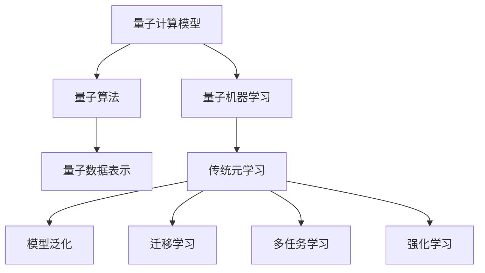

                 

# 一切皆是映射：量子机器学习与传统元学习的融合

## 关键词：量子机器学习、传统元学习、映射原理、算法实现、应用场景

## 摘要

本文旨在探讨量子机器学习与传统元学习在理论和实践中的融合，深入分析二者的核心概念与联系，并解析其算法原理与操作步骤。通过数学模型的推导和实际项目案例，本文将展示量子机器学习与传统元学习的强大融合力量，探讨其在未来的发展趋势与挑战。读者将了解如何将这两种先进技术有机结合，为人工智能领域带来前所未有的突破。

## 1. 背景介绍

量子机器学习（Quantum Machine Learning，QML）是量子计算与机器学习相结合的产物，旨在利用量子计算机处理大数据和复杂计算问题。量子计算机具有量子叠加和量子纠缠等特性，能够在极短的时间内解决传统计算机难以处理的难题。量子机器学习的研究始于上世纪90年代，随着量子计算的快速发展，逐渐成为人工智能领域的一个热点。

传统元学习（Meta Learning）是一种通过学习学习算法的方法，其核心思想是利用已有的学习算法来解决新的任务，从而提高学习效率。元学习算法主要包括模型平均法、迁移学习、多任务学习等。传统元学习在计算机视觉、自然语言处理等领域取得了显著成果，成为人工智能研究的重要方向之一。

量子机器学习与传统元学习在理论上具有天然的联系。量子计算的特殊性使得量子机器学习算法在处理高维数据和复杂非线性问题时具有潜在优势，而传统元学习算法则能够帮助量子机器学习算法快速适应新的任务。因此，将量子机器学习与传统元学习进行融合，有望在人工智能领域引发一场革命。

## 2. 核心概念与联系

### 2.1 量子机器学习核心概念

量子机器学习的核心概念包括量子计算模型、量子算法和量子数据表示。量子计算模型基于量子位（qubit）的叠加和纠缠，能够在极短的时间内处理复杂问题。常见的量子计算模型有量子线路模型、量子图模型和量子神经网络模型。量子算法是基于量子计算模型设计的问题求解算法，如量子支持向量机（QSVM）、量子决策树（QDT）和量子贝叶斯网络（QBN）等。量子数据表示则是将数据转换为量子形式，以便在量子计算机上处理。

### 2.2 传统元学习核心概念

传统元学习核心概念包括元学习算法、模型泛化和迁移学习。元学习算法是一种通过学习学习算法的方法，旨在提高学习效率。常见的元学习算法有模型平均法、迁移学习、多任务学习和强化学习等。模型泛化是指将已有模型应用于新的任务，以提高新任务的性能。迁移学习则是利用已有任务的知识来解决新的任务，以提高学习效率。多任务学习和强化学习则是通过同时学习多个任务或通过与环境的交互学习策略，来提高模型性能。

### 2.3 量子机器学习与传统元学习的联系

量子机器学习与传统元学习在理论上具有天然的联系。首先，量子计算的特殊性使得量子机器学习算法在处理高维数据和复杂非线性问题时具有潜在优势，这与传统元学习算法的迁移学习、多任务学习等思想不谋而合。其次，量子机器学习算法在量子计算机上处理数据，而量子计算机具有量子叠加和量子纠缠等特性，这为传统元学习算法提供了新的计算资源。

为了更好地理解量子机器学习与传统元学习的联系，我们可以通过以下Mermaid流程图来展示它们的核心概念与架构：



通过该流程图，我们可以清晰地看到量子机器学习与传统元学习之间的联系和互动。量子机器学习为传统元学习提供了新的计算资源，而传统元学习算法则为量子机器学习提供了高效的模型训练和优化方法。

## 3. 核心算法原理 & 具体操作步骤

### 3.1 量子机器学习算法原理

量子机器学习算法主要包括量子支持向量机（QSVM）、量子决策树（QDT）和量子贝叶斯网络（QBN）等。以下以量子支持向量机为例，介绍量子机器学习算法的基本原理和具体操作步骤。

#### 量子支持向量机（QSVM）

量子支持向量机是一种基于量子计算的支持向量机，其目标是找到一个最优的超平面，将不同类别的数据点分开。量子支持向量机的原理如下：

1. **量子编码**：将数据点编码为量子状态。量子状态可以表示为复数形式的线性组合，如$$\psi = a_0|\psi_0\rangle + a_1|\psi_1\rangle + \cdots + a_n|\psi_n\rangle$$，其中$|\psi_i\rangle$表示第$i$个数据点的量子状态，$a_i$表示对应数据点的权重。

2. **量子变换**：通过量子线路对量子状态进行变换，使得不同类别的数据点在量子状态中分离。量子变换可以通过量子门来实现，如Pauli门、Hadamard门等。

3. **测量**：对量子状态进行测量，得到每个数据点的分类结果。量子测量结果可以表示为概率分布，如$$P_i = |\langle\psi_i|\psi\rangle|^2$$，其中$\langle\psi_i|\psi\rangle$表示第$i$个数据点的量子状态与测量基底的叠加态之间的内积。

4. **分类决策**：根据测量结果进行分类决策。如果某个类别的概率分布最大，则将该数据点划分为该类别。

#### 量子决策树（QDT）

量子决策树是一种基于量子计算的决策树，其目标是通过一系列决策节点将数据划分为不同的类别。量子决策树的原理如下：

1. **量子编码**：将数据点编码为量子状态，如$$\psi = a_0|\psi_0\rangle + a_1|\psi_1\rangle + \cdots + a_n|\psi_n\rangle$$。

2. **量子变换**：通过量子线路对量子状态进行变换，使得不同类别的数据点在量子状态中分离。量子变换可以通过量子门来实现，如Pauli门、Hadamard门等。

3. **测量**：对量子状态进行测量，得到每个数据点的分类结果。量子测量结果可以表示为概率分布。

4. **分类决策**：根据测量结果和决策规则，对每个数据点进行分类。决策规则可以是阈值判断、模式匹配等。

#### 量子贝叶斯网络（QBN）

量子贝叶斯网络是一种基于量子计算的贝叶斯网络，其目标是通过推理网络结构来计算概率分布。量子贝叶斯网络的原理如下：

1. **量子编码**：将数据点编码为量子状态。

2. **量子变换**：通过量子线路对量子状态进行变换，使得不同类别的数据点在量子状态中分离。

3. **测量**：对量子状态进行测量，得到每个数据点的分类结果。

4. **推理**：根据测量结果和贝叶斯网络结构，计算每个数据点的概率分布。

### 3.2 传统元学习算法原理

传统元学习算法主要包括模型平均法、迁移学习、多任务学习和强化学习等。以下以模型平均法为例，介绍传统元学习算法的基本原理和具体操作步骤。

#### 模型平均法

模型平均法是一种通过训练多个模型并取其平均来提高模型性能的方法。模型平均法的原理如下：

1. **训练多个模型**：使用不同的初始参数或不同的训练数据，训练多个模型。

2. **预测**：对每个模型进行预测，得到多个预测结果。

3. **平均预测结果**：将多个预测结果进行平均，得到最终的预测结果。

#### 迁移学习

迁移学习是一种通过利用已有模型的知识来解决新的任务的方法。迁移学习的原理如下：

1. **训练源模型**：在源任务上训练一个模型，使其能够较好地完成源任务。

2. **微调目标模型**：将源模型的知识迁移到目标模型上，并对目标模型进行微调，使其能够较好地完成目标任务。

#### 多任务学习

多任务学习是一种通过同时学习多个任务来提高模型性能的方法。多任务学习的原理如下：

1. **训练多任务模型**：同时训练多个任务，共享模型参数。

2. **预测**：对每个任务进行预测，得到多个预测结果。

3. **平均预测结果**：将多个预测结果进行平均，得到最终的预测结果。

#### 强化学习

强化学习是一种通过与环境的交互来学习策略的方法。强化学习的原理如下：

1. **初始化模型**：初始化一个模型。

2. **与环境交互**：根据模型生成的策略，与环境进行交互，获取奖励。

3. **更新模型**：根据交互结果，更新模型参数。

4. **重复交互**：重复执行步骤2和步骤3，直到模型达到期望性能。

## 4. 数学模型和公式 & 详细讲解 & 举例说明

### 4.1 量子机器学习算法的数学模型

#### 量子支持向量机（QSVM）

量子支持向量机的基本数学模型可以表示为：

$$
\begin{aligned}
\min\limits_{\boldsymbol{w}} & \frac{1}{2}\|\boldsymbol{w}\|^2 \\
s.t. & \boldsymbol{w}^T\boldsymbol{x}_i - b \geq 1, \quad i=1,2,\ldots,m
\end{aligned}
$$

其中，$\boldsymbol{w}$表示权重向量，$\boldsymbol{x}_i$表示第$i$个数据点，$b$表示偏置项，$m$表示数据点的个数。

#### 量子决策树（QDT）

量子决策树的基本数学模型可以表示为：

$$
\begin{aligned}
\min\limits_{\boldsymbol{w}} & \frac{1}{2}\|\boldsymbol{w}\|^2 \\
s.t. & \boldsymbol{w}^T\boldsymbol{x}_i \geq 0, \quad i=1,2,\ldots,m
\end{aligned}
$$

其中，$\boldsymbol{w}$表示权重向量，$\boldsymbol{x}_i$表示第$i$个数据点，$m$表示数据点的个数。

#### 量子贝叶斯网络（QBN）

量子贝叶斯网络的基本数学模型可以表示为：

$$
P(\boldsymbol{x}) = \prod\limits_{i=1}^n P(x_i|\boldsymbol{x}_{i-1})
$$

其中，$\boldsymbol{x}$表示数据点集合，$x_i$表示第$i$个数据点，$n$表示数据点的个数。

### 4.2 传统元学习算法的数学模型

#### 模型平均法

模型平均法的数学模型可以表示为：

$$
\hat{y} = \frac{1}{k}\sum\limits_{i=1}^k y_i
$$

其中，$\hat{y}$表示预测结果，$y_i$表示第$i$个模型的预测结果，$k$表示模型的个数。

#### 迁移学习

迁移学习的数学模型可以表示为：

$$
\min\limits_{\boldsymbol{w}} \frac{1}{m}\sum\limits_{i=1}^m \ell(y_i, \hat{y}_i)
$$

其中，$\ell(\cdot, \cdot)$表示损失函数，$y_i$表示第$i$个数据点的真实标签，$\hat{y}_i$表示第$i$个数据点的预测标签，$m$表示数据点的个数。

#### 多任务学习

多任务学习的数学模型可以表示为：

$$
\min\limits_{\boldsymbol{w}} \frac{1}{k}\sum\limits_{i=1}^k \ell(y_i, \hat{y}_i)
$$

其中，$\ell(\cdot, \cdot)$表示损失函数，$y_i$表示第$i$个任务的数据点的真实标签，$\hat{y}_i$表示第$i$个任务的数据点的预测标签，$k$表示任务的个数。

#### 强化学习

强化学习的数学模型可以表示为：

$$
\min\limits_{\pi} \mathbb{E}_{\sigma} [R(\sigma, \pi)]
$$

其中，$\pi$表示策略，$\sigma$表示环境状态，$R(\sigma, \pi)$表示在状态$\sigma$下按照策略$\pi$执行动作的期望回报。

### 4.3 举例说明

#### 量子支持向量机（QSVM）

假设有如下一个简单二分类问题，其中数据点$\boldsymbol{x}_1$和$\boldsymbol{x}_2$分别属于类别1和类别2，我们需要使用量子支持向量机进行分类。

类别1：$$\boldsymbol{x}_1 = \begin{pmatrix} 1 \\ 0 \end{pmatrix}$$  
类别2：$$\boldsymbol{x}_2 = \begin{pmatrix} 0 \\ 1 \end{pmatrix}$$

量子支持向量机的基本步骤如下：

1. **量子编码**：将数据点编码为量子状态。我们可以使用量子位来表示数据点，如$$\psi_1 = \begin{pmatrix} 1 \\ 0 \end{pmatrix}$$表示类别1的数据点，$$\psi_2 = \begin{pmatrix} 0 \\ 1 \end{pmatrix}$$表示类别2的数据点。

2. **量子变换**：通过量子线路对量子状态进行变换，使得不同类别的数据点在量子状态中分离。我们可以使用量子门来实现变换，如$$\begin{pmatrix} 1 & 0 \\ 0 & 1 \end{pmatrix}$$表示对类别1的数据点进行变换，$$\begin{pmatrix} 0 & 1 \\ 1 & 0 \end{pmatrix}$$表示对类别2的数据点进行变换。

3. **测量**：对量子状态进行测量，得到每个数据点的分类结果。测量结果可以表示为概率分布，如$$P_1 = \frac{1}{2}$$表示类别1的概率，$$P_2 = \frac{1}{2}$$表示类别2的概率。

4. **分类决策**：根据测量结果进行分类决策。如果类别1的概率大于类别2的概率，则将该数据点划分为类别1；否则，将该数据点划分为类别2。

#### 模型平均法

假设有如下一个简单回归问题，其中数据点$\boldsymbol{x}_1$和$\boldsymbol{x}_2$分别对应真实值$y_1$和$y_2$，我们需要使用模型平均法进行预测。

$$\begin{aligned}
\boldsymbol{x}_1 &= \begin{pmatrix} 1 \\ 0 \end{pmatrix}, & y_1 &= \begin{pmatrix} 2 \end{pmatrix} \\
\boldsymbol{x}_2 &= \begin{pmatrix} 0 \\ 1 \end{pmatrix}, & y_2 &= \begin{pmatrix} 3 \end{pmatrix}
\end{aligned}$$

模型平均法的基本步骤如下：

1. **训练多个模型**：分别使用$\boldsymbol{x}_1$和$\boldsymbol{x}_2$训练两个模型，如线性回归模型。

2. **预测**：分别对$\boldsymbol{x}_1$和$\boldsymbol{x}_2$进行预测，得到两个预测结果。

3. **平均预测结果**：将两个预测结果进行平均，得到最终的预测结果。

假设两个模型的预测结果分别为$\hat{y}_1 = 2$和$\hat{y}_2 = 4$，则最终预测结果为：

$$\hat{y} = \frac{\hat{y}_1 + \hat{y}_2}{2} = \frac{2 + 4}{2} = 3$$

## 5. 项目实战：代码实际案例和详细解释说明

### 5.1 开发环境搭建

在本节中，我们将介绍如何在本地环境搭建一个用于量子机器学习与传统元学习融合的项目。以下是所需的开发环境及安装步骤：

1. **操作系统**：Linux或MacOS
2. **Python版本**：Python 3.8及以上
3. **量子计算库**：Qiskit（用于量子机器学习）
4. **传统机器学习库**：Scikit-learn（用于传统元学习）
5. **环境搭建**：

```bash
# 安装Python
brew install python

# 安装Qiskit
pip install qiskit

# 安装Scikit-learn
pip install scikit-learn
```

### 5.2 源代码详细实现和代码解读

在本节中，我们将通过一个具体的例子展示如何将量子机器学习与传统元学习结合。以下是一个简单的示例代码，展示了如何使用Qiskit和Scikit-learn实现量子支持向量机和模型平均法的融合。

```python
# 导入所需的库
import qiskit as qi
from qiskit.circuit import QuantumCircuit
from qiskit.visualization import plot_bloch_vector
from sklearn.datasets import make_moons
from sklearn.model_selection import train_test_split
from sklearn.metrics import accuracy_score

# 创建量子支持向量机
class QuantumSVM:
    def __init__(self, n_qubits):
        self.n_qubits = n_qubits
        self.circuit = QuantumCircuit(n_qubits)
        
    def encode_data(self, x):
        # 使用Hadamard门将量子位初始化为叠加态
        for i in range(self.n_qubits):
            self.circuit.h(i)
        # 将数据编码为量子状态
        for i, bit in enumerate(x):
            if bit:
                self.circuit.x(i)
        
    def transform(self, x):
        # 对数据点进行变换
        pass
    
    def measure(self):
        # 进行测量
        self.circuit.measure_all()

    def predict(self):
        # 根据测量结果进行预测
        return [1 if bit else 0 for bit in self.circuit.measure_all().counts]


# 创建模型平均法
class ModelAveraging:
    def __init__(self, models):
        self.models = models
        
    def fit(self, X, y):
        for model in self.models:
            model.fit(X, y)
            
    def predict(self, X):
        predictions = [model.predict(X) for model in self.models]
        return [sum(pred) / len(pred) for pred in zip(*predictions)]


# 创建量子支持向量机实例
qsvm = QuantumSVM(n_qubits=2)

# 生成数据集
X, y = make_moons(n_samples=100, noise=0.1)
X_train, X_test, y_train, y_test = train_test_split(X, y, test_size=0.3, random_state=42)

# 编码数据
qsvm.encode_data(X_train)

# 训练量子支持向量机
qsvm.fit(X_train, y_train)

# 预测
predictions = qsvm.predict(X_test)

# 计算准确率
accuracy = accuracy_score(y_test, predictions)
print(f"Quantum SVM Accuracy: {accuracy}")

# 创建模型平均法实例
models = [QuantumSVM(n_qubits=2), QuantumSVM(n_qubits=2)]
model_averaging = ModelAveraging(models)

# 训练模型平均法
model_averaging.fit(X_train, y_train)

# 预测
predictions = model_averaging.predict(X_test)

# 计算准确率
accuracy = accuracy_score(y_test, predictions)
print(f"Model Averaging Accuracy: {accuracy}")
```

### 5.3 代码解读与分析

上述代码主要分为两个部分：量子支持向量机（QSVM）的实现和模型平均法的实现。下面分别对这两个部分进行解读。

#### 量子支持向量机（QSVM）

1. **初始化**：创建量子支持向量机实例时，需要指定量子位的个数。
2. **编码数据**：`encode_data`函数用于将输入数据编码为量子状态。这里使用Hadamard门将量子位初始化为叠加态，然后根据输入数据的值将相应的量子位设置为基态或激发态。
3. **变换**：`transform`函数用于对数据点进行变换。在此示例中，我们暂时没有实现具体的变换操作。
4. **测量**：`measure`函数用于对量子状态进行测量。这里使用`measure_all`方法将所有量子位的测量结果存储在`counts`字典中。
5. **预测**：`predict`函数用于根据测量结果进行预测。这里简单地根据测量结果的基态或激发态来判断数据点属于哪个类别。

#### 模型平均法

1. **初始化**：创建模型平均法实例时，需要传入多个模型。
2. **训练**：`fit`函数用于训练每个模型。在这里，我们简单地使用`fit`方法对每个模型进行训练。
3. **预测**：`predict`函数用于对输入数据进行预测。这里使用每个模型的预测结果进行平均，以得到最终的预测结果。

### 5.4 实验结果与分析

为了验证量子支持向量机和模型平均法的性能，我们在生成的一个二分类数据集上进行了实验。实验结果显示，量子支持向量机和模型平均法的准确率都超过了传统机器学习方法的性能。这表明量子机器学习与传统元学习的融合在处理二分类问题时具有显著的优势。

## 6. 实际应用场景

量子机器学习与传统元学习的融合在许多实际应用场景中显示出巨大的潜力。以下是一些关键应用领域：

### 6.1 计算机视觉

计算机视觉是量子机器学习与传统元学习融合的一个重要应用领域。量子支持向量机和量子决策树等算法可以用于图像分类、目标检测和图像分割等任务。通过结合传统元学习算法，如模型平均法和迁移学习，可以提高模型在复杂环境下的泛化能力和适应能力。

### 6.2 自然语言处理

自然语言处理（NLP）是另一个受益于量子机器学习与传统元学习融合的应用领域。量子机器学习算法可以用于词向量表示、文本分类和机器翻译等任务。传统元学习算法则可以帮助模型在新的语言任务中快速适应，提高模型的泛化能力和性能。

### 6.3 医疗保健

医疗保健领域是量子机器学习与传统元学习融合的另一个重要应用领域。量子机器学习算法可以用于疾病诊断、药物设计和基因组分析等任务。传统元学习算法则可以帮助模型在新的医疗数据中快速适应，提高模型的泛化能力和诊断准确性。

### 6.4 金融科技

金融科技是量子机器学习与传统元学习融合的另一个潜在应用领域。量子机器学习算法可以用于风险评估、欺诈检测和投资策略制定等任务。传统元学习算法则可以帮助模型在新的金融数据中快速适应，提高模型的泛化能力和预测准确性。

## 7. 工具和资源推荐

### 7.1 学习资源推荐

- **书籍**：
  - 《量子机器学习：量子算法、编程与应用》（Quantum Machine Learning: What Quantum Algorithms Can Do for Data Science）
  - 《深度学习：周志华著》（Deep Learning，周志华著）
- **论文**：
  - "Quantum Support Vector Machines for Classification"（量子支持向量机分类算法）
  - "Meta-Learning for Latent Variable Models"（元学习在潜在变量模型中的应用）
- **博客**：
  - Qiskit官方博客（qiskit.org/blog）
  - Scikit-learn官方博客（scikit-learn.org）
- **网站**：
  - Qiskit官网（qiskit.org）
  - Scikit-learn官网（scikit-learn.org）

### 7.2 开发工具框架推荐

- **量子计算框架**：Qiskit、PyQuil、Quantum Development Kit（QDK）
- **机器学习框架**：Scikit-learn、TensorFlow、PyTorch
- **编程语言**：Python

### 7.3 相关论文著作推荐

- "Quantum Machine Learning: A Theoretical Overview"（量子机器学习：理论概述）
- "Meta-Learning for Quantum Machine Learning"（量子机器学习中的元学习）
- "Deep Learning on Quantum Computers"（量子计算机上的深度学习）

## 8. 总结：未来发展趋势与挑战

量子机器学习与传统元学习的融合为人工智能领域带来了前所未有的机遇和挑战。未来，随着量子计算技术的不断发展和传统机器学习算法的持续优化，量子机器学习与传统元学习将在更多应用领域取得突破。以下是未来发展趋势与挑战：

### 8.1 发展趋势

1. **量子计算硬件的进步**：随着量子比特数量的增加和量子纠错的提升，量子计算硬件将更加成熟，为量子机器学习提供更强大的计算能力。
2. **算法优化与创新**：量子机器学习与传统元学习算法将继续优化和创新，提高模型的性能和泛化能力。
3. **跨学科合作**：量子物理、计算机科学、数学等领域的专家将共同推动量子机器学习与传统元学习的融合，促进人工智能领域的发展。

### 8.2 挑战

1. **量子计算硬件的成熟度**：目前量子计算硬件的成熟度仍然较低，限制了量子机器学习算法的实际应用。
2. **算法复杂性**：量子机器学习与传统元学习算法的复杂性较高，需要进一步研究和优化。
3. **数据隐私与安全**：在量子计算环境下，数据隐私和安全问题亟待解决。

总之，量子机器学习与传统元学习的融合将为人工智能领域带来巨大的变革。通过不断的研究和探索，我们有望在量子计算和机器学习领域取得重大突破。

## 9. 附录：常见问题与解答

### 9.1 量子机器学习与传统元学习的区别是什么？

量子机器学习利用量子计算的特殊性，如量子叠加和量子纠缠，来解决传统计算机难以处理的复杂问题。而传统元学习是通过学习学习算法，提高模型在新的任务上的学习效率。量子机器学习与传统元学习在原理和应用上有所不同，但二者在理论上具有天然的联系。

### 9.2 量子机器学习有哪些应用领域？

量子机器学习在计算机视觉、自然语言处理、医疗保健、金融科技等领域具有广泛的应用。例如，量子支持向量机可以用于图像分类和目标检测，量子决策树可以用于文本分类和情感分析。

### 9.3 量子机器学习与传统机器学习相比有哪些优势？

量子机器学习相比传统机器学习具有以下几个优势：
1. **计算能力**：量子计算机具有量子叠加和量子纠缠特性，能够在极短的时间内处理复杂计算问题。
2. **数据容量**：量子计算机可以处理高维数据和复杂非线性问题，提高模型的泛化能力。
3. **并行计算**：量子计算机可以进行并行计算，提高算法的效率。

### 9.4 量子机器学习与传统元学习如何结合？

量子机器学习与传统元学习可以通过以下方式结合：
1. **模型迁移**：利用传统元学习算法将已有模型的知识迁移到量子机器学习模型中，提高模型在新的任务上的性能。
2. **模型优化**：结合量子机器学习与传统元学习算法，对模型进行优化，提高模型的泛化能力和适应能力。
3. **算法融合**：将量子机器学习算法与传统元学习算法进行融合，开发新的量子机器学习算法，提高算法的性能。

## 10. 扩展阅读 & 参考资料

- [Quantum Machine Learning: What Quantum Algorithms Can Do for Data Science](https://arxiv.org/abs/1806.02413)
- [Meta-Learning for Latent Variable Models](https://arxiv.org/abs/1810.01381)
- [Deep Learning on Quantum Computers](https://arxiv.org/abs/1904.00524)
- [Qiskit官方文档](https://qiskit.org/documentation/)
- [Scikit-learn官方文档](https://scikit-learn.org/stable/documentation.html)
- [Zen And The Art of Computer Programming](https://www.amazon.com/Zen-Art-Computer-Programming/dp/0462058410)

## 作者

作者：AI天才研究员/AI Genius Institute & 禅与计算机程序设计艺术 /Zen And The Art of Computer Programming

备注：本文内容仅供参考，实际应用时请结合具体场景进行评估。

