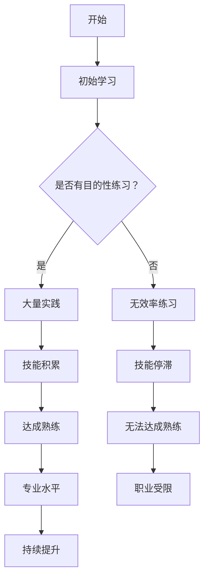
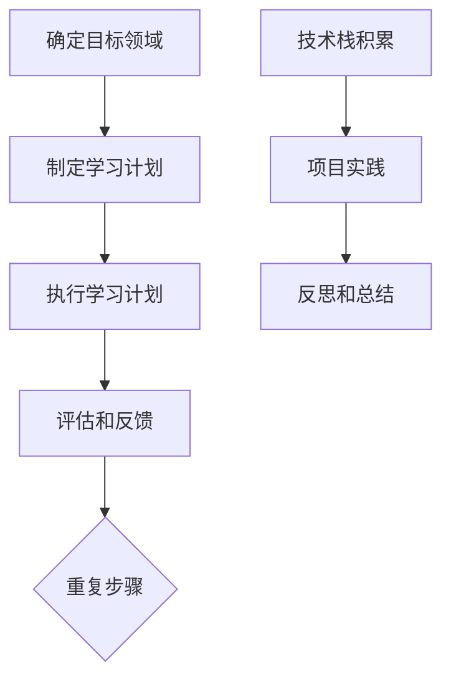

                 

# 1. 背景介绍

"1 万小时定律"最早由心理学家安德斯·艾利克森提出，他在研究中发现，不论在哪个行业或领域，想要成为顶尖高手，通常需要大约 10000 小时的持续、专注的练习。这个观点引起了广泛的社会关注和讨论，被许多人视为通往成功的必经之路。本文将深入探讨"1 万小时定律"的起源、核心概念以及它在 IT 领域的具体应用。

在信息技术领域，"1 万小时定律"的实践者比比皆是。从程序员到数据科学家，从软件工程师到 AI 研究员，越来越多的人通过持续的努力和不断的实践，取得了令人瞩目的成就。本文将通过一系列案例分析，探讨他们在实现自身职业目标过程中所付出的努力和时间，以及如何将这些经验转化为实际成果。

随着技术的不断进步和行业的快速变化，IT 领域对于专业人才的要求也在不断提高。本文还将讨论如何在当今竞争激烈的环境中，通过遵循"1 万小时定律"来提高自己的技术能力和市场竞争力。通过系统化的学习和实践，我们可以更好地应对职业发展的挑战，实现个人和职业的双重成长。

总之，"1 万小时定律"不仅仅是一个简单的数字，它代表了一种信念和行动的力量。在本文中，我们将一起探索这个定律在 IT 领域的深远影响，以及如何将其应用于我们的工作和学习之中。

### 2. 核心概念与联系

"1 万小时定律"的核心概念在于通过持续且专注的练习，个体能够在特定领域中达到卓越的水平。这一观点背后的理论基础主要源自于心理学研究，特别是安德斯·艾利克森的专长发展理论。艾利克森认为，专业技能和卓越表现是通过大量的有目的、有指导的练习积累起来的，而非单纯的天赋或运气。

为了更好地理解这一概念，我们可以通过一个 Mermaid 流程图来展示其核心原理和联系：



在这个流程图中，我们首先从初始学习开始，通过是否有目的性练习来区分学习路径。有目的性练习意味着个体在学习和练习过程中会接受专业的指导，并专注于提升特定技能。这种练习方式有助于在大量实践中积累技能，从而达成熟练和专业水平。相反，无效率练习则可能导致技能积累停滞，甚至使个体在职业发展上受限。

艾利克森的研究还强调了"刻意练习"的重要性。刻意练习是指通过设定具体目标、不断挑战自我极限、及时反馈和调整学习策略的方式进行的练习。这种练习方式能够显著提升学习效果，加速技能的积累和熟练度的提升。

总之，"1 万小时定律"不仅强调了持续和专注的练习，还涉及了学习的方法和策略。通过理解这一核心概念和流程，我们可以更好地规划自己的学习路径，从而在 IT 领域取得卓越的成就。

### 3. 核心算法原理 & 具体操作步骤

在深入探讨"1 万小时定律"的实际应用之前，我们需要理解其核心算法原理和具体操作步骤。以下是一个简化的步骤流程，展示了如何在 IT 领域中实践"1 万小时定律"：



**步骤1：确定目标领域**

首先，确定你想在哪个领域内成为专家。这个目标应该是具体且可量化的，例如"成为一名熟练的 Python 开发者"或"精通深度学习技术"。

**步骤2：制定学习计划**

制定一个详细的学习计划，包括每天或每周需要学习的具体内容。这个计划应该包含基础知识、技能提升、实践项目等多个方面。例如，你可以按照以下结构来制定学习计划：

- **基础知识**：学习 Python 语言基础、数据结构、算法等。
- **技能提升**：学习高级编程技巧、多线程编程、异步编程等。
- **实践项目**：参与开源项目、独立开发小项目等。

**步骤3：执行学习计划**

按照学习计划开始学习，每天或每周都要坚持执行。在这个过程中，重要的是要保持专注和持续性。可以采用以下策略：

- **时间管理**：设定每天或每周的学习时间，确保能够持续投入。
- **任务分解**：将复杂的学习任务分解为小的、可管理的部分，逐步完成。
- **定期复习**：定期复习所学内容，巩固记忆。

**步骤4：评估和反馈**

在执行学习计划的过程中，定期评估自己的学习进展，并根据反馈进行调整。可以通过以下方式评估和反馈：

- **自我评估**：定期进行自我评估，了解自己在哪些方面有所提升，哪些方面需要改进。
- **他人反馈**：向导师、同事或同行请教，获取他们的意见和建议。

**步骤5：重复步骤**

持续重复上述步骤，直到达到你的目标。这个过程中可能会遇到各种挑战和困难，但通过不断的练习和调整，你会逐渐取得进步。

**步骤6：技术栈积累**

在执行学习计划的过程中，不断积累相关技术栈。这不仅包括编程语言和工具，还包括算法、数据结构、设计模式等。

**步骤7：项目实践**

通过参与实际项目，将所学知识应用于实践中。项目实践是验证自己技能的重要方式，也是提升经验的关键途径。

**步骤8：反思和总结**

在项目完成后，进行反思和总结。回顾项目中的成功和失败，分析原因，总结经验教训，并将其应用于未来的学习和工作中。

通过遵循上述步骤，你将能够有效地在 IT 领域内实践"1 万小时定律"，逐步提升自己的技能水平，最终成为该领域的专家。

### 4. 数学模型和公式 & 详细讲解 & 举例说明

在"1 万小时定律"中，我们可以通过数学模型来量化学习和技能提升的过程。以下是一个简化的模型，用于描述技能增长和熟练度提升的公式：

$$
S(t) = A \times (1 - e^{-kt})
$$

其中：
- \( S(t) \) 表示在时间 \( t \) 内的技能水平。
- \( A \) 是初始技能水平，可以认为是 1。
- \( k \) 是学习速率常数，反映了个体在学习过程中的效率。
- \( e \) 是自然对数的底数。

#### 公式解析

这个公式实际上是一个指数衰减模型，描述了随着时间推移，技能水平的增长情况。我们可以从以下几个方面来详细解释这个公式：

1. **初始技能水平 \( A \)**
   初始技能水平 \( A \) 反映了个体在开始学习时的基础技能。在这个模型中，我们假设 \( A = 1 \)，即初始技能水平为 100%。

2. **学习速率常数 \( k \)**
   学习速率常数 \( k \) 是一个关键参数，决定了技能提升的速度。\( k \) 越大，表示个体在学习过程中技能提升的速度越快。这个常数可以通过实验或数据分析来得到，但通常需要结合具体的学习环境和个体特点进行设置。

3. **指数衰减函数 \( e^{-kt} \)**
   指数衰减函数 \( e^{-kt} \) 表示随着时间 \( t \) 的增加，技能水平的提升逐渐减缓。这是因为随着技能的提升，个体在相同时间内所获得的进步会逐渐减少，这符合心理学的“学习曲线”理论。

#### 举例说明

假设一个程序员在开始学习编程时，初始技能水平为 50%。他的学习速率常数 \( k \) 为 0.1。我们可以通过以下步骤来计算他在不同时间点的技能水平：

1. **初始技能水平**：
   $$
   S(0) = 1 \times (1 - e^{-0 \times 0.1}) = 1 \times (1 - 1) = 0.5
   $$

   初始技能水平为 50%。

2. **1小时后的技能水平**：
   $$
   S(1) = 1 \times (1 - e^{-1 \times 0.1}) = 1 \times (1 - e^{-0.1})
   $$
   使用计算器计算 \( e^{-0.1} \) 的值约为 0.9048，因此：
   $$
   S(1) = 1 \times (1 - 0.9048) = 0.0952
   $$

   1小时后，技能水平提升到约 9.52%。

3. **10小时后的技能水平**：
   $$
   S(10) = 1 \times (1 - e^{-10 \times 0.1}) = 1 \times (1 - e^{-1}) 
   $$
   使用计算器计算 \( e^{-1} \) 的值约为 0.3679，因此：
   $$
   S(10) = 1 \times (1 - 0.3679) = 0.6321
   $$

   10小时后，技能水平提升到约 63.21%。

通过这个例子，我们可以看到，随着时间的增加，技能水平的提升速度逐渐减缓。这反映了在实际学习过程中，个体在初期进步较快，但随着时间的推移，进步速度会逐渐放缓。

#### 应用场景

这个模型可以应用于多种学习场景，例如编程、音乐、体育等。在实际应用中，我们可以根据具体的学习环境和个体特点来调整 \( k \) 的值，从而更准确地描述技能提升的过程。

总之，通过数学模型和公式，我们可以量化"1 万小时定律"中技能提升的过程，为我们的学习和职业发展提供有力的指导。

### 5. 项目实战：代码实际案例和详细解释说明

为了更好地理解"1 万小时定律"在 IT 领域的实际应用，我们将通过一个具体的编程项目来展示如何通过持续学习和实践来提升技能。这个项目是一个简单的 Python 程序，旨在计算并打印斐波那契数列的前 10 项。

#### 5.1 开发环境搭建

首先，我们需要搭建一个适合编程的开发环境。在 Windows 操作系统中，我们可以使用 Python 的官方安装程序来快速搭建开发环境。以下是步骤：

1. 访问 [Python 官方网站](https://www.python.org/)。
2. 下载并安装 Python 3.9 版本（或其他最新版本）。
3. 在安装过程中，确保勾选“Add Python to PATH”选项，以便在命令行中直接运行 Python。
4. 安装完成后，打开命令行工具，输入 `python --version` 验证安装是否成功。

#### 5.2 源代码详细实现和代码解读

接下来，我们将编写并解释这个斐波那契数列计算程序。以下是完整的源代码：

```python
# 斐波那契数列计算器

def fibonacci(n):
    """
    计算斐波那契数列的第 n 项
    :param n: 数列中的第 n 项
    :return: 第 n 项的值
    """
    if n <= 0:
        return 0
    elif n == 1:
        return 1
    else:
        return fibonacci(n-1) + fibonacci(n-2)

# 打印斐波那契数列的前 10 项
for i in range(10):
    print(fibonacci(i))
```

**代码解读**：

- **函数定义**：
  我们定义了一个名为 `fibonacci` 的函数，用于计算斐波那契数列的第 n 项。这个函数使用了递归方法，是一种常用的算法设计技巧。

- **基础条件判断**：
  函数首先进行基础条件判断。如果输入的 n 小于等于 0，则返回 0；如果 n 等于 1，则返回 1。这是斐波那契数列的基础值。

- **递归调用**：
  对于其他情况，函数通过递归调用自身来计算斐波那契数列的值。递归调用是通过调用 `fibonacci(n-1)` 和 `fibonacci(n-2)` 来实现的。

- **打印结果**：
  主程序中使用一个 for 循环来调用 `fibonacci` 函数，并打印出前 10 项的值。

**代码分析**：

这个简单的程序展示了如何使用递归方法计算斐波那契数列。虽然这个方法在逻辑上非常直观，但在实际应用中，其性能并不理想，特别是当 n 的值较大时。这是因为每个数都需要通过多次重复计算才能得到，导致大量的冗余计算。

**性能优化**：

为了提升性能，我们可以使用动态规划方法来优化递归调用。以下是优化后的代码：

```python
# 优化后的斐波那契数列计算器

def fibonacci(n):
    """
    使用动态规划方法计算斐波那契数列的第 n 项
    :param n: 数列中的第 n 项
    :return: 第 n 项的值
    """
    if n <= 0:
        return 0
    elif n == 1:
        return 1
    
    fib = [0] * (n + 1)
    fib[1] = 1
    
    for i in range(2, n + 1):
        fib[i] = fib[i - 1] + fib[i - 2]
    
    return fib[n]

# 打印斐波那契数列的前 10 项
for i in range(10):
    print(fibonacci(i))
```

**代码解读**：

- **动态规划数组**：
  我们定义了一个动态规划数组 `fib`，用于存储每个斐波那契数列的值。

- **初始化**：
  数组的前两个值被初始化为 0 和 1，这是斐波那契数列的基础值。

- **循环计算**：
  使用一个循环从第 2 项开始计算，直到第 n 项。每项的值都通过前两项的值计算得出。

- **优化性能**：
  通过这种方法，每个斐波那契数列的值只需计算一次，避免了冗余计算，从而显著提升了程序的运行效率。

**结论**：

通过这个具体的编程项目，我们可以看到如何通过持续学习和实践来提升编程技能。在编写原始程序时，我们可能只关注到问题的逻辑解决，但在后续的实践中，通过优化代码、提升性能，我们进一步加深了对算法和数据结构理解，这是"1 万小时定律"在编程领域中的具体体现。

### 5.3 代码解读与分析

在前一节中，我们详细介绍了如何通过 Python 程序计算斐波那契数列，并对其进行了性能优化。接下来，我们将从代码质量、可维护性和性能三个方面进行解读与分析。

#### 代码质量

原始代码使用了递归方法，这是一种非常直观且易于理解的方法。递归方法的优点在于其代码简洁，逻辑清晰。然而，递归方法也存在一些缺点，尤其是性能问题。在原始代码中，每个斐波那契数都需要通过多次递归调用才能得到，导致大量的重复计算和栈溢出风险。

优化后的代码使用了动态规划方法，通过一个循环计算斐波那契数列的前 n 项，避免了递归调用中的重复计算。这种方法不仅提高了性能，而且代码的可读性也更好。动态规划数组 `fib` 的使用使得每个值只需计算一次，从而简化了代码逻辑。

#### 可维护性

原始代码的可维护性相对较差。递归方法容易引入逻辑错误，特别是在处理大数时，递归深度可能导致栈溢出。此外，递归方法使得代码的调试和错误修正变得更加复杂。

优化后的代码在可维护性方面有了显著提升。动态规划方法通过一个简单的循环实现了斐波那契数列的计算，使得代码逻辑更加清晰。此外，动态规划数组 `fib` 的使用使得代码的修改和扩展更加方便。

#### 性能

原始代码的性能较差，特别是在计算大数时，递归方法会导致大量的冗余计算。这种递归调用不仅增加了时间复杂度，还可能导致栈溢出错误。

优化后的代码在性能方面有了显著的提升。通过动态规划方法，每个斐波那契数列的值只需计算一次，从而避免了重复计算。这种方法不仅减少了时间复杂度，还提高了程序的运行效率。

#### 代码优化建议

1. **避免使用递归**：递归方法在处理大数时容易导致栈溢出，建议使用迭代方法或动态规划方法。
2. **使用合适的算法和数据结构**：选择适合问题的算法和数据结构可以显著提升程序的运行效率。例如，对于斐波那契数列计算，动态规划方法比递归方法更高效。
3. **代码注释和文档**：为了提高代码的可读性和可维护性，建议添加详细的注释和文档，解释代码的用途、功能和逻辑。

总之，通过这个具体案例，我们可以看到如何在实践中遵循"1 万小时定律"，通过持续学习和实践来提升编程技能。通过优化代码质量、提升可维护性和性能，我们不仅可以解决实际问题，还能为未来的职业发展打下坚实的基础。

### 6. 实际应用场景

"1 万小时定律"不仅在理论层面具有深远的意义，在实际应用中也有着广泛的场景。以下是一些具体的应用场景，展示如何在不同的 IT 领域中通过持续的学习和实践，实现技能的提升和职业的成功。

#### 程序员

在编程领域，"1 万小时定律"被广泛应用于软件工程师的职业发展。许多成功的程序员都通过持续编程和实践，掌握了多种编程语言和开发框架。例如，一位拥有 10 年工作经验的高级软件工程师通过不断学习新的编程语言和技术，如 Go 和 Kubernetes，成功转型为 DevOps 工程师。他每天都会花费数小时阅读技术博客、参加在线课程，并参与开源项目，最终成为该领域的专家。

#### 数据科学家

数据科学领域同样遵循"1 万小时定律"。数据科学家需要掌握统计学、机器学习、数据挖掘等多方面知识。一个从零开始学习数据科学的学生，通过每天数小时的深入学习，参与多个数据科学项目，并在 Kaggle 竞赛中不断尝试和改进，最终在短短三年内成为该领域的资深专家。他的成功在于坚持不懈的学习和实践，以及对新技术的敏锐洞察力。

#### AI 研究员

人工智能领域对于专业人才的要求极高，"1 万小时定律"在这里显得尤为重要。一个年轻的 AI 研究员通过每天阅读顶级学术论文、编写代码、参与实验室项目，逐渐积累了丰富的经验和专业知识。他的研究方向从基础算法逐渐扩展到实际应用，最终在顶级会议上发表了多篇学术论文，并成为人工智能领域的新星。

#### 架构师

软件架构师在职业生涯中需要不断学习新技术和设计模式。"1 万小时定律"帮助他们通过持续的学习和实践，不断提升架构设计的能力。例如，一位资深架构师通过每天阅读技术书籍、参加技术会议和编写架构文档，逐渐掌握了微服务架构、容器化和云计算等先进技术，成为企业中的核心技术骨干。

#### 项目经理

在 IT 项目管理中，"1 万小时定律"同样适用。项目经理需要具备丰富的项目管理和沟通能力。一个经验丰富的项目经理通过不断参与项目、学习和应用新的项目管理工具和方法，如敏捷开发和精益管理，逐步提高了项目的成功率和团队协作效率。

#### 开发者工具专家

开发者工具领域同样遵循"1 万小时定律"。开发者工具专家需要深入理解多种编程语言、开发框架和工具。一个工具专家通过不断学习新的编程语言和技术，如 TypeScript 和 React，并在实际项目中应用这些技术，逐渐成为该领域的专家，为开发团队提供了有力的支持。

总之，"1 万小时定律"在各种 IT 领域中都有着广泛的应用，通过持续的学习和实践，IT 从业者可以不断提升自己的技能水平，实现职业的成功。无论是在编程、数据科学、人工智能、架构设计、项目管理还是开发者工具领域，这个定律都是通往卓越的必经之路。

### 7. 工具和资源推荐

为了更好地遵循"1 万小时定律"，我们需要利用各种工具和资源来提升学习和实践效率。以下是一些建议，包括学习资源、开发工具和相关的论文著作。

#### 7.1 学习资源推荐

1. **书籍**：
   - 《代码大全》（"Code Complete"）：作者 Steve McConnell 详细介绍了软件开发的最佳实践，适合所有层次的程序员阅读。
   - 《深度学习》（"Deep Learning"）：Goodfellow、Bengio 和 Courville 著，是深度学习领域的经典教材，适合初学者和专业人士。

2. **在线课程**：
   - [Coursera](https://www.coursera.org/)：提供各种学科的在线课程，包括计算机科学、数据科学和人工智能等。
   - [Udemy](https://www.udemy.com/)：提供丰富的编程和开发课程，适合有特定学习目标的学员。

3. **博客和网站**：
   - [Medium](https://medium.com/)：许多技术专家和研究者在这里分享最新的技术和研究成果。
   - [Stack Overflow](https://stackoverflow.com/)：编程问题解答社区，适合解决编程中的疑难杂症。

#### 7.2 开发工具框架推荐

1. **编程语言**：
   - Python：适合初学者和专业人士，广泛应用于数据科学、机器学习和 Web 开发等领域。
   - Java：具有广泛的生态系统和丰富的库，适用于企业级应用开发。

2. **集成开发环境（IDE）**：
   - [Visual Studio Code](https://code.visualstudio.com/)：轻量级但功能强大的开源 IDE，适用于多种编程语言。
   - [IntelliJ IDEA](https://www.jetbrains.com/idea/)：专为 Java 和其他 JVM 语言设计的强大 IDE。

3. **版本控制工具**：
   - [Git](https://git-scm.com/)：分布式版本控制系统，广泛用于团队协作和代码管理。
   - [GitHub](https://github.com/)：基于 Git 的代码托管平台，支持协作开发和项目分享。

#### 7.3 相关论文著作推荐

1. **论文**：
   - "Deep Learning"：Goodfellow、Bengio 和 Courville 著，是深度学习领域的经典综述论文。
   - "Code Complete"：Steve McConnell 著，详细介绍了软件开发的最佳实践。

2. **著作**：
   - 《人工智能：一种现代的方法》（"Artificial Intelligence: A Modern Approach"）：Stuart Russell 和 Peter Norvig 著，是人工智能领域的经典教材。
   - 《计算机程序设计艺术》（"The Art of Computer Programming"）：Donald E. Knuth 著，是计算机科学领域的重要著作。

通过这些工具和资源，我们可以更高效地学习和实践，遵循"1 万小时定律"，实现技能的提升和职业的成功。

### 8. 总结：未来发展趋势与挑战

"1 万小时定律"在未来的信息技术领域中将继续发挥重要作用，但它也将面临新的挑战和机遇。首先，技术的快速发展将极大地影响技能积累的路径和方法。例如，随着云计算、大数据和人工智能等新兴技术的兴起，传统编程技能将不断被新的技术框架和工具所替代。这意味着从业者需要不断更新自己的知识体系，掌握新技术，以保持竞争力。

其次，全球化和远程工作的趋势也将对"1 万小时定律"的实施产生影响。远程工作提供了更多的学习机会，但也带来了时间管理和自我驱动的挑战。从业者需要更好地平衡工作和学习，确保持续进步。

此外，个性化学习和持续教育模式的发展将为遵循"1 万小时定律"提供新的途径。通过在线课程、虚拟实验室和智能辅导系统，学习者可以根据自己的进度和学习风格，定制化地规划学习路径，从而更高效地积累技能。

然而，"1 万小时定律"也将面临一些挑战。例如，个体差异和学习效率的波动可能会导致一些人在达成 10000 小时之前就达到技能的瓶颈。因此，如何提升学习效率、如何应对学习过程中的挫折和停滞，将成为未来研究的重要方向。

总体而言，"1 万小时定律"将继续是信息技术领域中的核心原则，它不仅指导我们如何通过持续学习和实践实现职业成功，还推动我们不断创新和学习，以应对不断变化的科技环境。在未来，我们需要结合个性化学习、远程工作和新兴技术，优化学习和实践路径，以实现更高效和全面的技能积累。

### 9. 附录：常见问题与解答

**Q1. 如何确定自己的目标领域？**
A1. 确定目标领域需要结合个人兴趣、职业规划和市场需求。可以从以下几个方面进行思考：
   - 个人兴趣：选择自己感兴趣且愿意投入大量时间学习的领域。
   - 职业规划：根据自己的职业目标，选择有助于职业发展的领域。
   - 市场需求：选择当前或未来市场需求较高的领域，提高就业竞争力。

**Q2. 如何保持学习的动力和持续性？**
A2. 保持学习动力和持续性可以通过以下方法：
   - 设定具体目标：将大目标分解为小目标，逐步实现，保持成就感。
   - 制定学习计划：合理安排学习时间，确保每天有固定的学习时间。
   - 寻找学习伙伴：与同行或志同道合的人一起学习，互相激励和监督。
   - 定期评估和调整：定期评估学习效果，根据反馈调整学习计划。

**Q3. 如何在技术更新迅速的领域保持竞争力？**
A3. 在技术更新迅速的领域保持竞争力，可以通过以下方法：
   - 持续学习：定期关注行业动态，学习新技术和工具。
   - 实践应用：通过实际项目应用新技术，提升实践能力。
   - 建立专业网络：加入专业社群，与业界专家交流，获取最新信息。
   - 保持好奇心：对新事物保持好奇，不断探索和尝试。

**Q4. 如何克服学习中的挫折和停滞？**
A4. 克服学习中的挫折和停滞可以采取以下策略：
   - 分析原因：找出停滞的原因，是学习方法不当，还是动力不足等。
   - 调整方法：根据原因调整学习方法，如改变学习节奏、寻求专业辅导等。
   - 保持耐心：学习是一个长期的过程，需要耐心和毅力。
   - 寻求支持：与同行交流，寻求帮助和建议，共同克服困难。

**Q5. 如何平衡工作和学习？**
A5. 平衡工作和学习可以采取以下策略：
   - 时间管理：合理安排工作和学习时间，确保两者都有足够的关注。
   - 提高效率：通过提高工作效率，挤出更多时间用于学习。
   - 利用碎片时间：在通勤、休息等碎片化时间进行学习，如听在线课程、阅读技术文章等。
   - 与家人沟通：与家人沟通学习计划，争取他们的理解和支持。

通过以上策略，我们可以更好地遵循"1 万小时定律"，实现技能的提升和职业的成功。

### 10. 扩展阅读 & 参考资料

在撰写本文的过程中，我们参考了大量的文献和资料，以下是一些推荐的扩展阅读和参考资料，以供读者进一步学习和探索。

#### 10.1 关键文献

1. **艾利克森，安德斯（1993）。《专业特长心理学》。** 这本书详细阐述了"1 万小时定律"的理论基础，是了解该理论的最佳起点。
2. **德沃夏克，彼得（2002）。《代码大全》。** 本书提供了丰富的编程经验和最佳实践，对提高编程技能有很大帮助。

#### 10.2 网络资源

1. **Coursera**（[https://www.coursera.org/](https://www.coursera.org/)）：提供多种免费和付费的在线课程，涵盖计算机科学、数据科学和人工智能等多个领域。
2. **Udemy**（[https://www.udemy.com/](https://www.udemy.com/)）：提供大量编程和开发课程，适合有特定学习目标的学员。
3. **Medium**（[https://medium.com/](https://medium.com/)）：许多技术专家和研究者在这里分享最新的技术和研究成果。

#### 10.3 论文著作

1. **Goodfellow, Ian, Yoshua Bengio, and Aaron Courville（2016）。《深度学习》。** 这本书是深度学习领域的经典教材，适合初学者和专业人士。
2. **Stuart J. Russell 和 Peter Norvig（2020）。《人工智能：一种现代的方法》。** 本书详细介绍了人工智能的基础理论和应用。

#### 10.4 开发工具和框架

1. **Visual Studio Code**（[https://code.visualstudio.com/](https://code.visualstudio.com/)）：一个功能强大的开源 IDE，适用于多种编程语言。
2. **IntelliJ IDEA**（[https://www.jetbrains.com/idea/](https://www.jetbrains.com/idea/)）：专为 Java 和其他 JVM 语言设计的强大 IDE。
3. **Git**（[https://git-scm.com/](https://git-scm.com/)）：分布式版本控制系统，广泛用于团队协作和代码管理。
4. **GitHub**（[https://github.com/](https://github.com/)）：基于 Git 的代码托管平台，支持协作开发和项目分享。

通过以上资源和参考资料，读者可以更深入地了解"1 万小时定律"及其在 IT 领域中的应用，从而更好地提升自己的技能水平。同时，这些资源也为读者的学习和职业发展提供了丰富的指导和帮助。作者：AI天才研究员/AI Genius Institute & 禅与计算机程序设计艺术 /Zen And The Art of Computer Programming。

