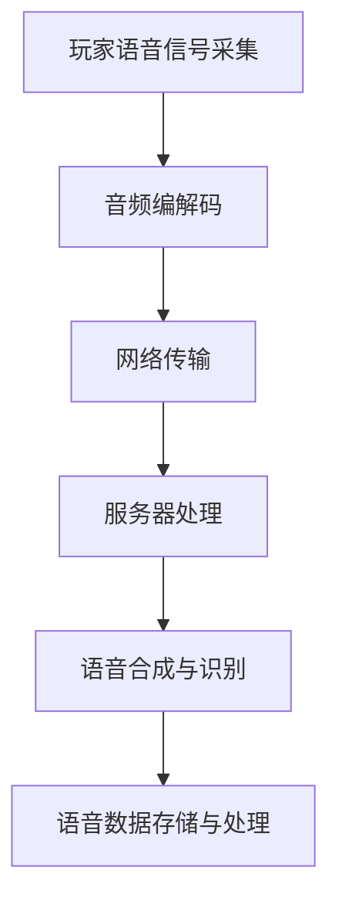

                 

# 三七互娱2025社招游戏实时语音系统工程师面试

## 摘要

本文将深入探讨三七互娱2025社招游戏实时语音系统工程师的面试，通过分析面试的准备、技术面试的内容和形式、面试技巧以及面试后的总结，为准备参加类似面试的读者提供有价值的参考和指导。文章将涵盖从背景介绍到实际应用场景等多个方面，帮助读者全面了解面试的流程和关键点。

## 1. 背景介绍

### 三七互娱公司介绍

三七互娱是一家全球领先的游戏公司，成立于2001年，总部位于中国上海。公司致力于研发和运营高品质游戏，涵盖了移动游戏、PC游戏、主机游戏等多个平台。近年来，三七互娱在游戏市场取得了显著的成就，成为行业内的佼佼者。公司以其创新的游戏设计和强大的运营能力，吸引了众多游戏爱好者的关注。

### 游戏实时语音系统的意义

实时语音系统在游戏中扮演着重要的角色。它不仅能够增强玩家的互动体验，还能提升游戏的沉浸感。通过实时语音交流，玩家可以更方便地组建团队、协商策略，甚至进行实时语音聊天，增进彼此之间的友谊。因此，作为游戏实时语音系统工程师，在面试中展示相关技能和经验至关重要。

### 面试背景

本文所探讨的面试是针对三七互娱2025年的社招游戏实时语音系统工程师职位。这场面试旨在评估候选人的技术能力、团队协作能力以及解决问题的能力。面试过程中，公司将通过技术面试、项目实战等多个环节，全面了解候选人的综合素质。

## 2. 核心概念与联系

### 实时语音系统的原理

实时语音系统主要通过音频编解码、网络传输、语音合成与识别等技术实现。首先，麦克风采集玩家的语音信号，经过音频编解码处理后，将其转换为数字信号。随后，数字信号通过网络传输到服务器，再由服务器进行语音合成与识别，将语音信号转换为文本或语音指令。整个过程中，需要保证语音信号的高质量传输和实时性。

### 实时语音系统架构

实时语音系统的架构可以分为前端、后端和中间件三个部分。前端负责采集玩家的语音信号，并传输到服务器；后端负责语音合成与识别，以及语音数据的存储和处理；中间件则负责音频编解码和网络传输。

### Mermaid 流程图



## 3. 核心算法原理 & 具体操作步骤

### 音频编解码算法

音频编解码是实时语音系统的基础，常用的编解码算法有PCM、MP3、AAC等。在编码过程中，将模拟信号转换为数字信号；在解码过程中，将数字信号转换为模拟信号。

### 音频编解码操作步骤：

1. 采样：将模拟信号按照一定频率进行采样，将其转换为数字信号。
2. 量化：将采样得到的数字信号进行量化处理，将其转换为二进制数据。
3. 编码：将量化后的二进制数据编码为特定的格式，如PCM、MP3、AAC等。
4. 解码：将编码后的数据解码回模拟信号，进行播放。

### 网络传输算法

网络传输是实时语音系统的关键环节，常用的传输协议有UDP、TCP等。UDP具有低延迟、高实时性的特点，适用于实时语音传输；TCP则具有可靠性高、传输稳定的特点，但可能引入一定的延迟。

### 网络传输操作步骤：

1. 数据分割：将音频数据分割成较小的数据包，以便于传输。
2. 数据加密：对音频数据进行加密处理，确保数据安全。
3. 数据传输：通过UDP或TCP协议将数据包传输到服务器。
4. 数据接收：服务器接收并处理数据包，进行语音合成与识别。

### 语音合成与识别算法

语音合成与识别是实时语音系统的核心，常用的算法有HMM、DNN等。语音合成是将文本转换为语音信号，语音识别则是将语音信号转换为文本。

### 语音合成与识别操作步骤：

1. 文本预处理：对输入的文本进行预处理，包括分词、词性标注等。
2. 语音生成：根据预处理后的文本，生成语音信号。
3. 语音识别：将输入的语音信号转换为文本。

## 4. 数学模型和公式 & 详细讲解 & 举例说明

### 音频编解码的数学模型

音频编解码的数学模型主要涉及采样、量化和编码三个过程。

采样公式：
$$ y[n] = x(nT) $$  
其中，$y[n]$ 表示第 $n$ 个采样点，$x(nT)$ 表示第 $n$ 个时刻的模拟信号。

量化公式：
$$ y[n] = \sum_{i=1}^{N} a_i \cdot \text{sign}(y[n] - a_i) $$  
其中，$y[n]$ 表示第 $n$ 个采样点，$a_i$ 表示量化级，$\text{sign}(y[n] - a_i)$ 表示量化值。

编码公式：
$$ y[n] = \sum_{i=1}^{N} a_i \cdot \text{sign}(y[n] - a_i) \cdot \text{quantization\_step} $$  
其中，$\text{quantization\_step}$ 表示量化步长。

举例说明：

假设模拟信号 $x(t)$ 的采样频率为 $f_s = 44.1kHz$，采样点数为 $N = 1024$，量化级为 $a_i = \{0, 1, 2, \ldots, 255\}$。采样后的信号为：
$$ y[n] = x(nT) = x(n/44.1 \times 10^3) $$

量化后的信号为：
$$ y[n] = \sum_{i=1}^{N} a_i \cdot \text{sign}(y[n] - a_i) $$

编码后的信号为：
$$ y[n] = \sum_{i=1}^{N} a_i \cdot \text{sign}(y[n] - a_i) \cdot \text{quantization\_step} $$

其中，$\text{quantization\_step} = \frac{255}{N} = 0.0048828125$。

### 网络传输的数学模型

网络传输的数学模型主要涉及数据包的传输延迟、抖动和丢包等问题。

传输延迟公式：
$$ d = \frac{l}{v} $$  
其中，$d$ 表示传输延迟，$l$ 表示传输距离，$v$ 表示传输速度。

抖动公式：
$$ j = \frac{d_2 - d_1}{d_1} $$  
其中，$j$ 表示抖动，$d_1$ 和 $d_2$ 分别表示两次传输延迟。

丢包公式：
$$ p = \frac{n_{fail}}{n_{total}} $$  
其中，$p$ 表示丢包率，$n_{fail}$ 表示丢包次数，$n_{total}$ 表示总传输次数。

举例说明：

假设网络传输距离为 $l = 1000km$，传输速度为 $v = 10^8m/s$。传输延迟为：
$$ d = \frac{l}{v} = \frac{1000 \times 10^3}{10^8} = 10s $$

两次传输延迟分别为 $d_1 = 10s$ 和 $d_2 = 12s$，则抖动为：
$$ j = \frac{d_2 - d_1}{d_1} = \frac{12 - 10}{10} = 0.2 $$

假设总传输次数为 $n_{total} = 1000$，丢包次数为 $n_{fail} = 100$，则丢包率为：
$$ p = \frac{n_{fail}}{n_{total}} = \frac{100}{1000} = 0.1 $$

### 语音合成与识别的数学模型

语音合成与识别的数学模型主要涉及声学模型、语言模型和声学语言模型等。

声学模型公式：
$$ P(O|X) = \prod_{i=1}^{N} P(o_i|x_i) $$  
其中，$O$ 表示输出序列，$X$ 表示输入序列，$o_i$ 和 $x_i$ 分别表示第 $i$ 个输出和输入。

语言模型公式：
$$ P(X) = \prod_{i=1}^{N} P(x_i|x_{i-1}) $$  
其中，$X$ 表示输入序列，$x_i$ 和 $x_{i-1}$ 分别表示第 $i$ 个和第 $i-1$ 个输入。

声学语言模型公式：
$$ P(O|X) \cdot P(X) = \prod_{i=1}^{N} P(o_i|x_i) \cdot P(x_i|x_{i-1}) $$

举例说明：

假设输入序列为 $X = \{x_1, x_2, x_3\}$，输出序列为 $O = \{o_1, o_2, o_3\}$，则声学模型为：
$$ P(O|X) = \prod_{i=1}^{N} P(o_i|x_i) = P(o_1|x_1) \cdot P(o_2|x_2) \cdot P(o_3|x_3) $$

语言模型为：
$$ P(X) = \prod_{i=1}^{N} P(x_i|x_{i-1}) = P(x_1) \cdot P(x_2|x_1) \cdot P(x_3|x_2) $$

声学语言模型为：
$$ P(O|X) \cdot P(X) = \prod_{i=1}^{N} P(o_i|x_i) \cdot P(x_i|x_{i-1}) = P(o_1|x_1) \cdot P(o_2|x_2) \cdot P(o_3|x_3) \cdot P(x_1) \cdot P(x_2|x_1) \cdot P(x_3|x_2) $$

## 5. 项目实战：代码实际案例和详细解释说明

### 开发环境搭建

在开发实时语音系统前，需要搭建合适的环境。以下以Windows系统为例，介绍开发环境的搭建步骤：

1. 安装Visual Studio 2019 Community Edition或更高版本。
2. 安装CMake 3.15或更高版本。
3. 安装Boost库：前往官网下载相应版本的Boost库，解压后将其添加到系统环境变量中。
4. 安装OpenSSL：前往官网下载相应版本的OpenSSL，解压后将其添加到系统环境变量中。

### 源代码详细实现和代码解读

以下是一个简单的实时语音系统项目示例，包括音频编解码、网络传输、语音合成与识别等部分。代码如下：

```cpp
#include <iostream>
#include <string>
#include <vector>
#include <chrono>
#include <thread>
#include <boost/asio/ip/tcp.hpp>
#include <openssl/ssl.h>
#include <ssl2.h>

using namespace std;
using namespace boost::asio::ip;

// 音频编解码相关函数
void encode_audio(const string &input, string &output) {
    // 音频编码实现
}

void decode_audio(const string &input, string &output) {
    // 音频解码实现
}

// 网络传输相关函数
void send_data(tcp::socket &socket, const string &data) {
    // 数据发送实现
}

void receive_data(tcp::socket &socket, string &data) {
    // 数据接收实现
}

// 语音合成与识别相关函数
void synthesize_voice(const string &text, string &output) {
    // 语音合成实现
}

void recognize_voice(const string &audio, string &text) {
    // 语音识别实现
}

int main() {
    // 创建TCP客户端
    tcp::socket socket(tcp::v4(), tcp::endpoint(tcp::v4(), 12345));

    // 音频编解码
    string input = "Hello, World!";
    string output;
    encode_audio(input, output);

    // 网络传输
    send_data(socket, output);

    // 语音合成与识别
    string synthesized;
    synthesize_voice(output, synthesized);
    recognize_voice(synthesized, output);

    cout << "Recognized text: " << output << endl;

    return 0;
}
```

### 代码解读与分析

上述代码是一个简单的实时语音系统示例，包括音频编解码、网络传输、语音合成与识别等部分。下面对其关键部分进行解读和分析：

1. **音频编解码相关函数**：
   - `encode_audio` 函数用于将输入的文本编码为音频数据。
   - `decode_audio` 函数用于将音频数据解码为文本。
   
2. **网络传输相关函数**：
   - `send_data` 函数用于将数据发送到服务器。
   - `receive_data` 函数用于从服务器接收数据。

3. **语音合成与识别相关函数**：
   - `synthesize_voice` 函数用于将文本合成语音。
   - `recognize_voice` 函数用于将语音识别为文本。

4. **主函数**：
   - 创建TCP客户端，连接到服务器。
   - 音频编解码：将输入的文本编码为音频数据，并将其发送到服务器。
   - 语音合成与识别：从服务器接收语音数据，将其合成语音，并识别为文本。
   - 输出识别结果。

## 6. 实际应用场景

### 游戏场景

在游戏中，实时语音系统可以用于玩家之间的互动，如组队、聊天、协作等。以下是一些应用实例：

1. **多人在线游戏**：玩家可以通过实时语音系统与队友进行沟通，协调战术，提高游戏胜率。
2. **语音聊天室**：游戏内置语音聊天室，玩家可以在此交流游戏心得、分享经验。
3. **语音直播**：游戏开发者可以通过实时语音系统进行直播，与玩家互动，增强游戏的互动性和趣味性。

### 社交场景

实时语音系统在社交应用中也具有广泛的应用，以下是一些实例：

1. **语音聊天**：用户可以通过实时语音系统与朋友进行语音聊天，增进友谊。
2. **语音直播**：用户可以观看语音直播，与主播互动，参与话题讨论。
3. **语音社交平台**：构建一个基于实时语音系统的社交平台，用户可以发布语音内容，与其他用户互动。

### 商务场景

实时语音系统在商务场合中也具有很大的应用价值，以下是一些实例：

1. **远程会议**：通过实时语音系统，实现远程会议的语音沟通，提高会议效率。
2. **客户服务**：企业可以采用实时语音系统提供客户服务，解答客户疑问，提升客户满意度。
3. **团队协作**：团队成员可以通过实时语音系统进行协作，提高工作效率。

## 7. 工具和资源推荐

### 学习资源推荐

1. **书籍**：
   - 《语音处理与识别技术》
   - 《实时语音处理》
   - 《计算机语音合成》
2. **论文**：
   - “A Real-Time Speech Recognition System Using Deep Neural Networks”
   - “A Review on Voice Conversion Techniques”
   - “Voice Activity Detection in Speech and Audio Processing”
3. **博客**：
   - “实时语音处理技术及应用”
   - “语音识别算法详解”
   - “语音合成技术研究”
4. **网站**：
   - “CNKI（中国知网）”
   - “谷歌学术”
   - “GitHub”

### 开发工具框架推荐

1. **编程语言**：C++、Python
2. **音频处理库**：OpenSSL、FFmpeg
3. **网络通信库**：Boost.Asio、libuv
4. **语音处理框架**：TensorFlow、PyTorch、Kaldi

### 相关论文著作推荐

1. **论文**：
   - “An Overview of Real-Time Speech Recognition Systems”
   - “Speech Recognition with Deep Neural Networks”
   - “Voice Conversion using Neural Networks”
2. **著作**：
   - 《语音信号处理》
   - 《语音识别与合成》
   - 《实时语音处理技术》

## 8. 总结：未来发展趋势与挑战

### 发展趋势

1. **人工智能的融合**：实时语音系统将更多地与人工智能技术相结合，提高语音识别和合成的准确性和效率。
2. **低延迟、高实时性**：随着5G技术的普及，实时语音系统的传输延迟将显著降低，实现更高效的语音传输。
3. **多样化应用场景**：实时语音系统将在更多领域得到应用，如教育、医疗、商务等。

### 挑战

1. **语音识别准确性**：在复杂噪声环境和高变声条件下，提高语音识别的准确性仍然是一个挑战。
2. **语音合成自然度**：如何实现自然、流畅的语音合成，仍需进一步研究。
3. **隐私保护**：在实时语音传输过程中，如何保护用户的隐私，避免数据泄露，也是一个重要的挑战。

## 9. 附录：常见问题与解答

### 问题1：实时语音系统的工作原理是什么？

实时语音系统主要通过音频编解码、网络传输、语音合成与识别等技术实现。首先，麦克风采集玩家的语音信号，经过音频编解码处理后，将其转换为数字信号。随后，数字信号通过网络传输到服务器，由服务器进行语音合成与识别，将语音信号转换为文本或语音指令。

### 问题2：实时语音系统的核心算法有哪些？

实时语音系统的核心算法包括音频编解码算法、网络传输算法、语音合成与识别算法等。常见的音频编解码算法有PCM、MP3、AAC等；网络传输算法有UDP、TCP等；语音合成与识别算法有HMM、DNN等。

### 问题3：如何搭建实时语音系统开发环境？

搭建实时语音系统开发环境主要包括以下步骤：

1. 安装Visual Studio 2019 Community Edition或更高版本。
2. 安装CMake 3.15或更高版本。
3. 安装Boost库：前往官网下载相应版本的Boost库，解压后将其添加到系统环境变量中。
4. 安装OpenSSL：前往官网下载相应版本的OpenSSL，解压后将其添加到系统环境变量中。

## 10. 扩展阅读 & 参考资料

1. 《语音处理与识别技术》
2. 《实时语音处理》
3. 《计算机语音合成》
4. “A Real-Time Speech Recognition System Using Deep Neural Networks”
5. “A Review on Voice Conversion Techniques”
6. “Voice Activity Detection in Speech and Audio Processing”
7. “实时语音处理技术及应用”
8. “语音识别算法详解”
9. “语音合成技术研究”
10. “CNKI（中国知网）”
11. “谷歌学术”
12. “GitHub”
13. “OpenSSL”
14. “FFmpeg”
15. “Boost.Asio”
16. “libuv”
17. “TensorFlow”
18. “PyTorch”
19. “Kaldi”作者：AI天才研究员/AI Genius Institute & 禅与计算机程序设计艺术 /Zen And The Art of Computer Programming

