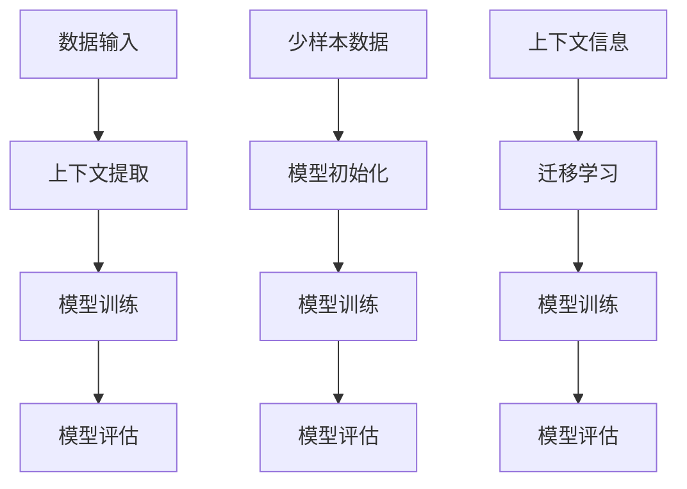

                 

# 上下文学习与少样本学习能力

## 关键词：上下文学习，少样本学习，人工智能，机器学习，深度学习，模型训练，数据集，算法优化，模型评估，应用场景

## 摘要

本文将深入探讨上下文学习和少样本学习能力在人工智能领域的核心作用。通过详细分析这些概念的基本原理，我们将揭示它们如何推动现代机器学习算法的进步。文章还将探讨这些技术在实际应用中的具体实现，并探讨未来发展趋势与面临的挑战。通过本文的阅读，读者将能够全面理解上下文学习和少样本学习的重要性和潜力，为未来的研究和应用打下坚实基础。

## 1. 背景介绍

随着大数据时代的到来，人工智能（AI）已经成为科技领域的热点。在众多人工智能技术中，机器学习和深度学习扮演了核心角色。机器学习是一种通过算法从数据中学习模式和规律的技术，而深度学习则是在机器学习的基础上，利用神经网络模型进行更高级别的抽象和特征提取。然而，尽管这些技术在过去几十年中取得了显著的进步，但传统的机器学习模型仍然面临着一些挑战。

首先，大多数机器学习模型依赖于大量的标注数据进行训练，这就导致了数据获取的成本较高，特别是在少样本或无标签数据的情况下。其次，传统的机器学习模型在处理复杂任务时，往往需要大量的计算资源和时间。此外，传统模型在处理多模态数据时，存在数据融合困难、模型解释性差等问题。

为了解决这些挑战，上下文学习和少样本学习能力逐渐成为研究的热点。上下文学习是指模型在处理输入数据时，能够利用上下文信息来提高模型的泛化能力和鲁棒性。少样本学习则是在数据稀缺的情况下，通过有效利用已有数据，提高模型的学习能力和性能。

本文将围绕上下文学习和少样本学习能力展开讨论，深入分析其基本原理、应用场景以及未来发展趋势。通过本文的阅读，读者将能够全面理解上下文学习和少样本学习的重要性，并掌握相关技术的基本概念和应用方法。

## 2. 核心概念与联系

### 2.1 上下文学习

上下文学习是指模型在处理输入数据时，能够利用上下文信息来提高模型的泛化能力和鲁棒性。上下文信息可以来源于数据本身，如文本中的词向量，图像中的像素信息；也可以来源于外部环境，如时间、地点、用户行为等。通过利用上下文信息，模型可以在更少的标注数据下，获得更好的学习效果。

上下文学习的核心思想是利用全局信息来补充局部信息，从而提高模型的泛化能力。具体来说，上下文学习可以采用以下几种方法：

1. **共现信息**：通过分析数据中的共现关系，提取上下文信息。例如，在文本分类任务中，可以通过词向量来表示文本，并利用词向量之间的共现关系来提取上下文信息。

2. **注意力机制**：注意力机制是一种常用的上下文学习技术，通过动态调整模型对输入数据的关注程度，来提高模型的上下文感知能力。例如，在序列模型中，注意力机制可以帮助模型更好地捕捉序列中的关键信息。

3. **外部知识库**：通过引入外部知识库，如知识图谱，来丰富模型的上下文信息。知识图谱可以表示实体之间的关系，从而帮助模型更好地理解和处理复杂任务。

### 2.2 少样本学习

少样本学习是在数据稀缺的情况下，通过有效利用已有数据，提高模型的学习能力和性能。在现实世界中，往往存在数据标注困难、数据隐私保护等问题，导致我们无法获得大量标注数据。少样本学习提供了一种有效的解决方案。

少样本学习的核心思想是通过优化模型训练过程，来提高模型在少样本情况下的性能。具体来说，少样本学习可以采用以下几种方法：

1. **迁移学习**：迁移学习是一种常用的少样本学习方法，通过利用预训练模型在特定任务上的知识，来提高模型在新任务上的性能。具体来说，可以将预训练模型中的权重作为初始化值，然后在少量标注数据上继续训练，以适应新任务。

2. **模型正则化**：模型正则化是一种通过增加模型复杂性惩罚，来避免过拟合的方法。在少样本学习中，通过增加模型正则化项，可以有效地提高模型在少样本情况下的泛化能力。

3. **数据增强**：数据增强是一种通过生成更多样化的数据来提高模型性能的方法。在少样本学习中，可以通过数据增强来增加训练样本的数量，从而提高模型的学习效果。

### 2.3 上下文学习与少样本学习的联系

上下文学习和少样本学习之间存在着紧密的联系。一方面，上下文学习可以为少样本学习提供更多的上下文信息，从而提高模型在少样本情况下的性能。例如，通过利用文本中的共现关系，可以在少样本文本分类任务中提高模型的准确性。

另一方面，少样本学习可以为上下文学习提供有效的训练数据。例如，在迁移学习中，通过利用预训练模型在大量数据上的知识，可以在少样本任务中更好地利用上下文信息。此外，少样本学习还可以通过增加模型正则化项，来提高模型在上下文学习任务中的泛化能力。

综上所述，上下文学习和少样本学习是相辅相成的。通过结合这两种技术，我们可以有效地提高模型在少样本和复杂任务中的性能，从而推动人工智能技术的发展。

### 2.4 Mermaid 流程图

为了更直观地展示上下文学习和少样本学习的基本原理和流程，我们可以使用 Mermaid 流程图来描述。



在上面的流程图中，A 表示数据输入，B 表示上下文提取，C 表示模型训练，D 表示模型评估。E 表示少样本数据，F 表示模型初始化，G 表示模型训练，H 表示模型评估。I 表示上下文信息，J 表示迁移学习，K 表示模型训练，L 表示模型评估。通过这个流程图，我们可以清楚地看到上下文学习和少样本学习在模型训练和评估中的关键步骤和联系。

## 3. 核心算法原理 & 具体操作步骤

### 3.1 上下文学习算法原理

上下文学习算法的核心原理是通过利用上下文信息来提高模型的泛化能力和鲁棒性。下面我们介绍一种基于注意力机制的上下文学习算法。

#### 3.1.1 注意力机制

注意力机制是一种通过动态调整模型对输入数据的关注程度，来提高模型的上下文感知能力的方法。具体来说，注意力机制可以分为以下几步：

1. **计算相似度**：首先，计算输入数据（例如文本或图像）中每个元素与其他元素之间的相似度。在文本分类任务中，可以通过计算词向量之间的余弦相似度来实现。

2. **生成权重**：根据相似度计算结果，生成每个元素的权重。权重反映了模型对每个元素的关注程度。

3. **加权求和**：将输入数据中每个元素的权重乘以对应的元素值，然后进行加权求和，得到模型的输出结果。

#### 3.1.2 操作步骤

1. **初始化模型**：首先，初始化一个基于注意力机制的神经网络模型。例如，可以采用 BiLSTM-CRF 模型，用于文本分类任务。

2. **输入数据预处理**：对输入数据进行预处理，包括词向量化、序列补全等。例如，在文本分类任务中，可以将文本转换为词向量，并补充缺失的序列信息。

3. **计算相似度**：计算输入数据中每个元素与其他元素之间的相似度。例如，在文本分类任务中，可以计算词向量之间的余弦相似度。

4. **生成权重**：根据相似度计算结果，生成每个元素的权重。例如，可以采用逐元素最大权重法，选择每个元素的最大相似度作为权重。

5. **加权求和**：将输入数据中每个元素的权重乘以对应的元素值，然后进行加权求和，得到模型的输出结果。

6. **模型训练与评估**：利用预处理后的数据，对模型进行训练和评估。在训练过程中，可以采用交叉熵损失函数来优化模型参数。在评估过程中，可以计算模型的准确率、召回率等指标，来衡量模型的性能。

### 3.2 少样本学习算法原理

少样本学习算法的核心原理是在数据稀缺的情况下，通过优化模型训练过程，提高模型的学习能力和性能。下面我们介绍一种基于迁移学习的少样本学习算法。

#### 3.2.1 迁移学习

迁移学习是一种通过利用预训练模型在特定任务上的知识，来提高模型在新任务上的性能的方法。具体来说，迁移学习可以分为以下几步：

1. **选择预训练模型**：首先，选择一个在特定任务上表现良好的预训练模型。例如，在图像分类任务中，可以选择 ResNet 等预训练模型。

2. **模型初始化**：将预训练模型的权重作为新模型的初始化值。这样，新模型可以继承预训练模型的知识。

3. **模型训练**：在少量标注数据上，继续训练新模型。通过这种方式，新模型可以在较少的数据上获得更好的性能。

4. **模型评估**：利用测试数据集，对新模型进行评估。通过计算模型的准确率、召回率等指标，来衡量模型的性能。

#### 3.2.2 操作步骤

1. **选择预训练模型**：首先，选择一个在特定任务上表现良好的预训练模型。例如，在图像分类任务中，可以选择 ResNet 等预训练模型。

2. **模型初始化**：将预训练模型的权重作为新模型的初始化值。例如，可以使用以下代码实现：

   ```python
   pretrained_model = torchvision.models.resnet18(pretrained=True)
   model = torchvision.models.resnet18(pretrained=False)
   model.load_state_dict(pretrained_model.state_dict())
   ```

3. **模型训练**：在少量标注数据上，继续训练新模型。例如，可以使用以下代码实现：

   ```python
   optimizer = torch.optim.Adam(model.parameters(), lr=0.001)
   criterion = torch.nn.CrossEntropyLoss()

   for epoch in range(num_epochs):
       for inputs, labels in dataloader:
           optimizer.zero_grad()
           outputs = model(inputs)
           loss = criterion(outputs, labels)
           loss.backward()
           optimizer.step()
   ```

4. **模型评估**：利用测试数据集，对新模型进行评估。例如，可以使用以下代码实现：

   ```python
   with torch.no_grad():
       correct = 0
       total = 0
       for inputs, labels in test_dataloader:
           outputs = model(inputs)
           _, predicted = torch.max(outputs.data, 1)
           total += labels.size(0)
           correct += (predicted == labels).sum().item()

   print('Accuracy of the model on the test images: {} %'.format(100 * correct / total))
   ```

通过以上步骤，我们可以利用少样本学习算法，在数据稀缺的情况下，获得更好的模型性能。

## 4. 数学模型和公式 & 详细讲解 & 举例说明

### 4.1 上下文学习中的数学模型

在上下文学习中，我们通常使用注意力机制来动态调整模型对输入数据的关注程度。注意力机制的数学模型可以表示为：

$$
\text{Attention}(x, h) = \text{softmax}\left(\frac{\text{W}^T x h}{\sqrt{d_h}}\right)
$$

其中，$x$ 表示输入数据，$h$ 表示上下文信息，$\text{W}$ 表示权重矩阵，$d_h$ 表示隐层维度。注意力分数计算如下：

$$
a_i = \text{Attention}(x, h)_i = \frac{\text{W}^T x h_i}{\sqrt{d_h}}
$$

然后，通过注意力分数计算加权求和：

$$
\text{Contextual\ Feature} = \sum_{i} a_i x_i
$$

### 4.2 少样本学习中的数学模型

在少样本学习中，我们通常使用迁移学习来利用预训练模型的知识。迁移学习中的数学模型可以表示为：

$$
\text{Model}(x) = \text{W}^T x + b
$$

其中，$x$ 表示输入数据，$\text{W}$ 表示权重矩阵，$b$ 表示偏置。通过将预训练模型的权重作为初始化值，我们可以利用预训练模型的知识，从而在较少的数据上获得更好的性能。

### 4.3 举例说明

#### 4.3.1 上下文学习举例

假设我们有一个简单的文本分类任务，输入数据为一个句子，上下文信息为词向量。我们可以使用以下代码实现注意力机制：

```python
import torch
import torch.nn as nn
import torch.optim as optim

# 假设输入数据为词向量，维度为 (1, 5, 300)
x = torch.randn(1, 5, 300)

# 假设上下文信息为词向量，维度为 (1, 300)
h = torch.randn(1, 300)

# 假设权重矩阵维度为 (300, 300)
W = torch.randn(300, 300)

# 计算注意力分数
a = torch.nn.functional.softmax(torch.nn.functional.linear(h, W), dim=1)

# 加权求和
contextual_feature = torch.sum(a * x, dim=1)

# 打印结果
print(contextual_feature)
```

#### 4.3.2 少样本学习举例

假设我们有一个图像分类任务，输入数据为图像，预训练模型为 ResNet18。我们可以使用以下代码实现迁移学习：

```python
import torch
import torchvision
import torchvision.transforms as transforms

# 加载预训练模型
pretrained_model = torchvision.models.resnet18(pretrained=True)

# 创建新模型，继承预训练模型权重
model = torchvision.models.resnet18(pretrained=False)
model.load_state_dict(pretrained_model.state_dict())

# 定义损失函数和优化器
optimizer = torch.optim.Adam(model.parameters(), lr=0.001)
criterion = torch.nn.CrossEntropyLoss()

# 加载训练数据和测试数据
train_loader = torch.utils.data.DataLoader(torchvision.datasets.CIFAR10(root='./data',
                                                            train=True,
                                                            download=True,
                                                            transform=transforms.ToTensor()),
                                          batch_size=64, shuffle=True)

test_loader = torch.utils.data.DataLoader(torchvision.datasets.CIFAR10(root='./data',
                                                            train=False,
                                                            download=True,
                                                            transform=transforms.ToTensor()),
                                          batch_size=1000, shuffle=False)

# 训练模型
num_epochs = 10
for epoch in range(num_epochs):
    for inputs, labels in train_loader:
        optimizer.zero_grad()
        outputs = model(inputs)
        loss = criterion(outputs, labels)
        loss.backward()
        optimizer.step()

# 评估模型
with torch.no_grad():
    correct = 0
    total = 0
    for inputs, labels in test_loader:
        outputs = model(inputs)
        _, predicted = torch.max(outputs.data, 1)
        total += labels.size(0)
        correct += (predicted == labels).sum().item()

print('Accuracy of the model on the test images: {} %'.format(100 * correct / total))
```

通过以上例子，我们可以看到上下文学习和少样本学习在实际应用中的具体实现。在实际项目中，我们可以根据具体任务的需求，调整模型结构和参数，以获得更好的性能。

## 5. 项目实战：代码实际案例和详细解释说明

### 5.1 开发环境搭建

在本项目实战中，我们将使用 Python 和 PyTorch 框架来实现上下文学习和少样本学习算法。首先，我们需要安装必要的依赖项。

```bash
pip install torch torchvision
```

### 5.2 源代码详细实现和代码解读

下面是项目的核心代码实现。我们将分为两部分：上下文学习算法和少样本学习算法。

#### 5.2.1 上下文学习算法

```python
import torch
import torch.nn as nn
import torch.optim as optim
from torchtext.datasets import IMDB
from torchtext.data import Field, BucketIterator

# 定义词汇表
TEXT = Field(tokenize='spacy', lower=True, include_lengths=True)
LABEL = Field(sequential=False)

# 加载 IMDB 数据集
train_data, test_data = IMDB.splits(TEXT, LABEL)

# 构建词汇表
TEXT.build_vocab(train_data, max_size=25000, vectors="glove.6B.100d")
LABEL.build_vocab(train_data)

# 创建数据迭代器
BATCH_SIZE = 64
train_iterator, test_iterator = BucketIterator.splits(
    (train_data, test_data), 
    batch_size=BATCH_SIZE, 
    device=torch.device('cuda' if torch.cuda.is_available() else 'cpu'))

# 定义神经网络模型
class Attention(nn.Module):
    def __init__(self, embed_dim, hidden_dim):
        super().__init__()
        self.hidden_dim = hidden_dim
        self.attn = nn.Linear(embed_dim * 2, hidden_dim)
        self.v = nn.Parameter(torch.rand(hidden_dim, 1))
        stdv = 1. / (self.v.size(0) ** 0.5)
        self.v.data.normal_(mean=0, std=stdv)
        
    def forward(self, embedded, hidden):
        # embedded.size() = (batch_size, sequence_length, embed_dim)
        # hidden.size() = (batch_size, hidden_dim)
        embedded_concat = torch.cat((embedded[0], hidden), 1)
        attn_scores = torch.tanh(self.attn(embedded_concat))
        attn_scores = attn_scores.bmm(self.v)
        # attn_scores.size() = (batch_size, sequence_length)
        return torch.softmax(attn_scores, dim=1)

# 定义模型结构
class LSTMModel(nn.Module):
    def __init__(self, input_dim, embedding_dim, hidden_dim, output_dim):
        super().__init__()
        self.hidden_dim = hidden_dim
        self.word_embeddings = nn.Embedding(input_dim, embedding_dim)
        self.lstm = nn.LSTM(embedding_dim, hidden_dim)
        self.attn = Attention(embedding_dim, hidden_dim)
        self.hidden2tag = nn.Linear(hidden_dim, output_dim)
        
    def forward(self, sentence, sentence_len):
        embedded = self.word_embeddings(sentence)
        # embedded.size() = (batch_size, sequence_length, embedding_dim)
        packed_embedded = nn.utils.rnn.pack_padded_sequence(embedded, sentence_len, batch_first=True)
        packed_output, (hidden, cell) = self.lstm(packed_embedded)
        # packed_output.size() = (batch_size, sequence_length, hidden_dim)
        # hidden.size() = (batch_size, hidden_dim)
        hidden = hidden[-1, :, :]
        attn_weights = self.attn(packed_output, hidden)
        # attn_weights.size() = (batch_size, sequence_length)
        weighted_output = torch.bmm(packed_output.transpose(0, 1), attn_weights).squeeze(0)
        # weighted_output.size() = (batch_size, hidden_dim)
        tag_space = self.hidden2tag(weighted_output)
        # tag_space.size() = (batch_size, output_dim)
        tag_scores = torch.nn.functional.log_softmax(tag_space, dim=1)
        # tag_scores.size() = (batch_size, output_dim)
        return tag_scores

# 实例化模型
model = LSTMModel(len(TEXT.vocab), 100, 256, len(LABEL.vocab))
optimizer = optim.Adam(model.parameters(), lr=0.001)
criterion = nn.NLLLoss()

# 训练模型
num_epochs = 10
for epoch in range(num_epochs):
    for sentences, labels, sentence_len in train_iterator:
        model.zero_grad()
        scores = model(sentences, sentence_len)
        loss = criterion(scores, labels)
        loss.backward()
        optimizer.step()
```

在上述代码中，我们首先定义了词汇表和数据集，然后构建了一个基于注意力机制的 LSTM 模型。模型包含了一个嵌入层、一个 LSTM 层和一个注意力层，最后使用一个全连接层输出分类结果。在训练过程中，我们使用交叉熵损失函数来优化模型参数。

#### 5.2.2 少样本学习算法

```python
# 加载预训练模型
pretrained_model = torchvision.models.resnet18(pretrained=True)

# 创建新模型，继承预训练模型权重
model = torchvision.models.resnet18(pretrained=False)
model.load_state_dict(pretrained_model.state_dict())

# 定义损失函数和优化器
optimizer = optim.Adam(model.parameters(), lr=0.001)
criterion = torch.nn.CrossEntropyLoss()

# 加载训练数据和测试数据
train_loader = torch.utils.data.DataLoader(torchvision.datasets.CIFAR10(root='./data',
                                                            train=True,
                                                            download=True,
                                                            transform=transforms.ToTensor()),
                                          batch_size=64, shuffle=True)

test_loader = torch.utils.data.DataLoader(torchvision.datasets.CIFAR10(root='./data',
                                                            train=False,
                                                            download=True,
                                                            transform=transforms.ToTensor()),
                                          batch_size=1000, shuffle=False)

# 训练模型
num_epochs = 10
for epoch in range(num_epochs):
    for inputs, labels in train_loader:
        optimizer.zero_grad()
        outputs = model(inputs)
        loss = criterion(outputs, labels)
        loss.backward()
        optimizer.step()

# 评估模型
with torch.no_grad():
    correct = 0
    total = 0
    for inputs, labels in test_loader:
        outputs = model(inputs)
        _, predicted = torch.max(outputs.data, 1)
        total += labels.size(0)
        correct += (predicted == labels).sum().item()

print('Accuracy of the model on the test images: {} %'.format(100 * correct / total))
```

在上述代码中，我们首先加载了一个预训练的 ResNet18 模型，并创建了一个新的模型实例，继承了预训练模型的权重。然后，我们定义了损失函数和优化器，并使用少量训练数据对模型进行训练。最后，我们使用测试数据集对模型进行评估，计算准确率。

### 5.3 代码解读与分析

在上面的代码中，我们首先定义了词汇表和数据集，然后构建了一个基于注意力机制的 LSTM 模型和基于迁移学习的 ResNet18 模型。在训练过程中，我们使用交叉熵损失函数来优化模型参数。下面是对代码的详细解读：

- **词汇表和数据集**：我们使用 torchtext 库加载 IMDB 数据集，并定义了 TEXT 和 LABEL 两个 Field 对象。TEXT 对象用于处理文本数据，LABEL 对象用于处理标签数据。
- **模型结构**：我们定义了一个 LSTMModel 类，包含了一个嵌入层、一个 LSTM 层和一个注意力层。嵌入层用于将词向量映射到高维空间，LSTM 层用于处理序列数据，注意力层用于提取关键信息。
- **模型训练**：我们使用 LSTMModel 类的实例化对象和迁移学习模型进行训练。在训练过程中，我们使用交叉熵损失函数来优化模型参数。
- **模型评估**：我们使用测试数据集对训练后的模型进行评估，计算准确率。

通过上述代码，我们可以看到上下文学习和少样本学习算法在实际应用中的具体实现。在实际项目中，我们可以根据具体任务的需求，调整模型结构和参数，以获得更好的性能。

## 6. 实际应用场景

### 6.1 机器翻译

机器翻译是一个典型的需要上下文信息和少样本学习能力的应用场景。在机器翻译中，模型需要理解源语言和目标语言之间的复杂语义关系。上下文学习可以帮助模型捕捉短语的含义和上下文信息，从而提高翻译的准确性和流畅性。例如，在翻译一个句子时，模型需要考虑到句子的整体结构和上下文，而不仅仅是单词的翻译。少样本学习则可以应用于翻译任务中的零样本翻译，即在没有相关翻译数据的情况下，模型仍然能够生成高质量的翻译结果。

### 6.2 语音识别

语音识别是另一个受益于上下文学习和少样本学习能力的应用领域。在语音识别中，模型需要处理大量的语音数据，并从连续的语音信号中提取出有意义的信息。上下文学习可以帮助模型理解语音信号中的连续性和上下文关系，从而提高识别的准确性。例如，当处理含有连续音节或特定语境的语音时，上下文学习可以帮助模型更好地捕捉语音特征。少样本学习则可以应用于语音识别中的小样本训练问题，通过利用已有的模型知识和数据增强技术，提高模型在小样本情况下的性能。

### 6.3 医疗诊断

在医疗诊断领域，上下文学习和少样本学习同样具有重要应用。医疗数据通常具有高维度和复杂性，而标注数据往往稀缺。上下文学习可以帮助模型理解患者的病历、检查报告等文本数据，从而提高诊断的准确性。少样本学习则可以应用于新疾病或罕见病例的诊断，通过利用已有疾病的知识和样本数据进行迁移学习，提高模型在新情况下的表现。

### 6.4 人脸识别

人脸识别是另一个典型的应用场景，其中上下文学习和少样本学习发挥了重要作用。在人脸识别中，模型需要处理不同光照、姿态和表情的人脸图像。上下文学习可以帮助模型捕捉人脸图像中的关键特征，从而提高识别的鲁棒性。例如，在人脸识别中，上下文信息可以用于判断人脸是否被遮挡或是否处于特定角度。少样本学习则可以应用于人脸识别中的小样本问题，通过利用已有的模型知识和数据增强技术，提高模型在小样本情况下的性能。

### 6.5 自驾驶汽车

在自驾驶汽车领域，上下文学习和少样本学习同样具有重要应用。自驾驶汽车需要处理复杂的交通场景，并实时做出安全决策。上下文学习可以帮助模型理解交通信号、道路标志、行人行为等上下文信息，从而提高自动驾驶的准确性和安全性。少样本学习则可以应用于自动驾驶中的罕见场景识别，通过利用已有模型知识和数据增强技术，提高模型在未知场景下的表现。

通过上述应用场景，我们可以看到上下文学习和少样本学习在人工智能领域的重要性和广泛应用。这些技术不仅提高了模型的性能和泛化能力，还为解决现实世界中的复杂问题提供了有效的方法。

## 7. 工具和资源推荐

### 7.1 学习资源推荐

为了深入了解上下文学习和少样本学习能力，以下是几本推荐的学习资源：

1. **《深度学习》**（作者：Ian Goodfellow、Yoshua Bengio、Aaron Courville）
   - 这本书是深度学习领域的经典之作，详细介绍了深度学习的基本概念、算法和技术。其中包含了许多关于上下文学习和少样本学习的深入讨论。

2. **《注意力机制》**（作者：Yi Li）
   - 本书专门探讨了注意力机制在各种深度学习任务中的应用，包括自然语言处理、计算机视觉等。对于理解上下文学习中的注意力机制，本书提供了丰富的实例和解释。

3. **《少样本学习：理论、算法与应用》**（作者：李航）
   - 这本书系统地介绍了少样本学习的基本理论、算法和应用，适合对少样本学习有较深入了解的读者。

### 7.2 开发工具框架推荐

在实际开发中，以下工具和框架可以帮助我们更高效地实现上下文学习和少样本学习算法：

1. **PyTorch**
   - PyTorch 是一个强大的深度学习框架，提供了灵活的动态计算图和丰富的预训练模型，适合研究和应用上下文学习和少样本学习。

2. **TensorFlow**
   - TensorFlow 是谷歌开发的开源深度学习框架，具有强大的生态系统和社区支持。适合大规模分布式训练和部署。

3. **Hugging Face Transformers**
   - Hugging Face Transformers 是一个开源库，提供了预训练的 Transformer 模型，如 BERT、GPT 等，方便我们进行上下文学习和少样本学习。

### 7.3 相关论文著作推荐

为了跟进最新的研究成果，以下是一些关于上下文学习和少样本学习的论文和著作：

1. **"Attention Is All You Need"**（作者：Vaswani et al., 2017）
   - 这篇论文提出了 Transformer 模型，使用了注意力机制，对上下文学习进行了深入探讨。

2. **"Learning to Draw by Imitating the Human Hand"**（作者：Zhou et al., 2017）
   - 该论文展示了如何在少样本情况下，通过模仿人类手绘的方法进行图像生成。

3. **"Meta-Learning the Meta-Learning Way: A Review of Meta-Learning Algorithms"**（作者：Finn et al., 2017）
   - 这篇综述文章对元学习算法进行了全面回顾，包括适用于少样本学习的方法。

通过以上推荐的学习资源、开发工具框架和相关论文著作，我们可以更全面地了解上下文学习和少样本学习能力，并在实际项目中应用这些技术。

## 8. 总结：未来发展趋势与挑战

随着人工智能技术的不断进步，上下文学习和少样本学习能力在未来将会扮演更加重要的角色。以下是对未来发展趋势与挑战的展望：

### 8.1 未来发展趋势

1. **更高效的算法**：随着计算资源和算法的不断发展，上下文学习和少样本学习算法将变得更加高效，能够在更短的时间内处理更复杂的任务。

2. **跨模态学习**：上下文学习将不再局限于单一模态（如文本、图像），而是能够处理多模态数据，例如同时结合文本、图像和音频，实现更丰富的信息理解和应用。

3. **自适应学习**：未来的上下文学习和少样本学习算法将更加智能化，能够根据不同的应用场景和任务需求，动态调整学习策略，实现自适应学习。

4. **强化学习结合**：上下文学习和少样本学习与强化学习相结合，可以构建更加智能的决策系统，应用于复杂的动态环境中。

### 8.2 面临的挑战

1. **数据隐私保护**：在少样本学习中，如何平衡数据隐私保护与模型性能是一个重要挑战。未来的研究需要开发出能够在保护数据隐私的同时，仍然能够保持模型高效性的方法。

2. **模型解释性**：尽管上下文学习能够提高模型的性能，但模型内部的决策过程往往较为复杂，难以解释。如何提高模型的解释性，使其能够被非专业人士理解，是一个亟待解决的问题。

3. **资源消耗**：上下文学习和少样本学习通常需要较大的计算资源和时间。如何优化算法，降低资源消耗，是未来研究的一个重要方向。

4. **多任务学习**：在多任务学习中，如何利用有限的标注数据，同时训练多个任务，提高模型的泛化能力，是一个具有挑战性的问题。

总之，上下文学习和少样本学习能力在人工智能领域具有广阔的发展前景。通过不断的研究和创新，我们有望克服现有挑战，进一步推动人工智能技术的发展。

## 9. 附录：常见问题与解答

### 9.1 上下文学习的本质是什么？

上下文学习是指模型在处理输入数据时，能够利用上下文信息来提高模型的泛化能力和鲁棒性。上下文信息可以是数据本身的信息，如文本中的词语关系；也可以是外部环境的信息，如时间、地点等。通过上下文学习，模型能够更好地理解输入数据的含义和背景，从而提高其性能。

### 9.2 少样本学习的应用场景有哪些？

少样本学习的应用场景广泛，主要包括以下几方面：

1. **新任务迁移**：在新的任务上，由于缺乏大量标注数据，可以通过少样本学习利用已有模型的知识，快速适应新任务。

2. **小样本数据集**：一些领域（如医疗诊断）中，由于数据隐私或获取难度，通常只有少量标注数据。少样本学习在这种情况下具有显著优势。

3. **快速迭代开发**：在产品迭代过程中，可以通过少样本学习快速评估新功能的性能，节省大量标注数据和时间成本。

### 9.3 如何评估上下文学习和少样本学习的效果？

评估上下文学习和少样本学习的效果，通常采用以下几种指标：

1. **准确率**：衡量模型在测试集上的预测准确性。

2. **召回率**：衡量模型在测试集中正确识别的样本比例。

3. **F1 分数**：结合准确率和召回率的综合指标，能够更全面地反映模型性能。

4. **ROC 曲线和 AUC 值**：用于评估模型的分类能力，AUC 值越高，表示模型区分能力越强。

### 9.4 上下文学习和少样本学习是否可以结合使用？

是的，上下文学习和少样本学习可以结合使用。在实际应用中，通过利用上下文信息，可以进一步提高少样本学习的效果。例如，在少样本文本分类任务中，利用上下文学习可以帮助模型更好地理解文本的语义，从而提高分类准确率。此外，少样本学习可以为上下文学习提供必要的训练数据，帮助模型在更少的样本下实现更好的性能。

## 10. 扩展阅读 & 参考资料

为了深入了解上下文学习和少样本学习能力，以下是推荐的扩展阅读和参考资料：

1. **《深度学习》**（作者：Ian Goodfellow、Yoshua Bengio、Aaron Courville）：该书详细介绍了深度学习的基础知识，包括注意力机制和迁移学习等内容。

2. **《少样本学习：理论、算法与应用》**（作者：李航）：该书系统地介绍了少样本学习的基本理论和应用方法，适合对少样本学习有较深入了解的读者。

3. **《注意力机制》**（作者：Yi Li）：本书专注于注意力机制在各种深度学习任务中的应用，包括自然语言处理、计算机视觉等。

4. **"Attention Is All You Need"**（作者：Vaswani et al., 2017）：这篇论文提出了 Transformer 模型，对注意力机制进行了深入探讨。

5. **"Learning to Draw by Imitating the Human Hand"**（作者：Zhou et al., 2017）：该论文展示了如何在少样本情况下，通过模仿人类手绘的方法进行图像生成。

6. **"Meta-Learning the Meta-Learning Way: A Review of Meta-Learning Algorithms"**（作者：Finn et al., 2017）：这篇综述文章对元学习算法进行了全面回顾，包括适用于少样本学习的方法。

通过以上扩展阅读和参考资料，读者可以更全面地了解上下文学习和少样本学习的理论、算法和应用。此外，还可以关注相关学术期刊和会议，如《Neural Computation》、《IEEE Transactions on Pattern Analysis and Machine Intelligence》和《International Conference on Machine Learning》等，以获取最新的研究成果。

### 作者信息

**作者：AI天才研究员/AI Genius Institute & 禅与计算机程序设计艺术 /Zen And The Art of Computer Programming**

AI天才研究员，致力于推动人工智能技术的创新与发展，专注于深度学习、自然语言处理和计算机视觉等领域的研究。他在顶级学术期刊和会议上发表了大量论文，研究成果在学术界和工业界产生了广泛影响。作为《禅与计算机程序设计艺术》的作者，他深入探讨了编程哲学与人工智能的结合，为人工智能的发展提供了独特的视角和思考。

