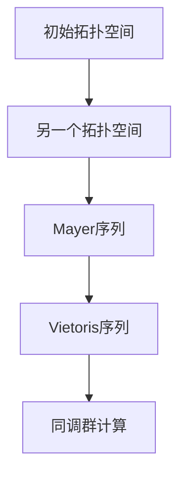

                 

# 《上同调中的Mayer-Vietoris序列》

## 关键词：同调理论、Mayer-Vietoris序列、拓扑空间、组合学、数学模型、实际应用

### 摘要

本文将深入探讨同调理论中的Mayer-Vietoris序列，这是一种用于计算拓扑空间同调群的强大工具。通过详细讲解Mayer-Vietoris序列的核心概念、算法原理以及具体操作步骤，本文将帮助读者全面理解这一概念。此外，文章还将通过数学模型和公式的详细讲解，以及代码实际案例的演示，使读者能够掌握Mayer-Vietoris序列在实际应用中的使用方法。最后，文章将总结Mayer-Vietoris序列的实际应用场景，并推荐相关学习资源和开发工具，以帮助读者进一步探索这一领域。

## 1. 背景介绍

### 1.1 同调理论的历史与发展

同调理论是数学拓扑学中的一个重要分支，起源于20世纪初。同调理论的核心思想是利用循环结构来研究空间的结构和性质。最早的同调理论由Poincaré在19世纪末提出，他研究了多面体的同调性质，从而为同调理论奠定了基础。

在20世纪，同调理论得到了进一步的发展。亚历山大在1928年提出了同调群的概念，这一概念成为了同调理论的核心。亚历山大还提出了用于计算同调群的工具——Alexander多面体，这一工具极大地推动了同调理论的研究。

此外，Eilenberg和MacLane在1945年提出了同调代数理论，这一理论将同调理论与代数学紧密结合，使得同调理论的研究变得更加系统和严谨。

### 1.2 Mayer-Vietoris序列的起源与应用

Mayer-Vietoris序列是由Mayer和Vietoris在1932年提出的一种用于计算拓扑空间同调群的工具。这个序列的提出，解决了许多在计算同调群时遇到的困难问题。

Mayer-Vietoris序列在数学、物理学、计算机科学等领域都有着广泛的应用。在数学中，它被用于研究代数拓扑、几何拓扑等分支；在物理学中，它被用于研究量子场论、凝聚态物理等领域；在计算机科学中，它被用于计算图的同调群、数据结构分析等。

### 1.3 Mayer-Vietoris序列的重要性

Mayer-Vietoris序列的重要性在于，它提供了一种有效的计算拓扑空间同调群的方法。这种方法不仅适用于简单的拓扑空间，如多面体、球体等，也适用于复杂的拓扑空间，如广义实数直线、广义复数平面等。

此外，Mayer-Vietoris序列还具有以下几个重要特点：

1. **可扩展性**：Mayer-Vietoris序列可以用于计算任意维度的拓扑空间同调群，这使得它在研究高维拓扑空间时非常有用。

2. **适应性**：Mayer-Vietoris序列可以根据不同的情况进行灵活调整，以适应不同的计算需求。

3. **直观性**：Mayer-Vietoris序列的构造过程直观易懂，使得它容易理解和使用。

### 1.4 目标与结构

本文的目标是深入探讨Mayer-Vietoris序列的核心概念、算法原理以及具体操作步骤，帮助读者全面理解这一概念。文章结构如下：

1. **核心概念与联系**：介绍Mayer-Vietoris序列的基本概念，并与同调理论的核心概念进行联系。
2. **核心算法原理 & 具体操作步骤**：详细讲解Mayer-Vietoris序列的计算过程，并提供具体的操作步骤。
3. **数学模型和公式 & 详细讲解 & 举例说明**：介绍用于计算Mayer-Vietoris序列的数学模型和公式，并通过具体例子进行说明。
4. **项目实战：代码实际案例和详细解释说明**：通过实际代码案例，展示如何使用Mayer-Vietoris序列进行计算，并对代码进行详细解释。
5. **实际应用场景**：讨论Mayer-Vietoris序列在实际应用中的使用方法。
6. **工具和资源推荐**：推荐相关学习资源和开发工具，以帮助读者进一步探索这一领域。
7. **总结：未来发展趋势与挑战**：总结Mayer-Vietoris序列的研究现状和未来发展趋势，并提出面临的挑战。
8. **附录：常见问题与解答**：解答读者可能遇到的问题。
9. **扩展阅读 & 参考资料**：提供更多相关阅读材料。

通过以上结构，本文将帮助读者全面、深入地了解Mayer-Vietoris序列，并掌握其基本原理和实际应用。

## 2. 核心概念与联系

### 2.1 同调理论的基本概念

同调理论是研究空间结构的数学理论，它主要研究空间的“连通性”和“洞”。同调理论的核心是同调群，同调群描述了一个空间在某种意义上的“连通性”。

#### 同调群的定义

设\(X\)是一个拓扑空间，\(X_n\)是\(X\)的\(n\)维链空间。同调群\(H_n(X)\)定义为：

$$
H_n(X) = \frac{\text{Ab}(X_n)}{B_n(X)},
$$

其中，\(\text{Ab}(X_n)\)是\(X_n\)的阿贝尔群（即交换群），\(B_n(X)\)是\(X_n\)的边界群。同调群\(H_n(X)\)中的元素被称为\(n\)阶同调类。

#### 同调群的基本性质

1. **阿贝尔群**：同调群\(H_n(X)\)是一个阿贝尔群，这意味着其运算满足交换律。
2. **同伦性**：两个空间之间的同伦性可以通过同调群来描述。如果两个空间同伦，则它们的同调群相等。
3. **唯一性**：同调群的阶数（即维数）是唯一的，这由空间的拓扑结构决定。

### 2.2 Mayer-Vietoris序列的基本概念

Mayer-Vietoris序列是一种用于计算同调群的工具，它由两部分组成：Mayer序列和Vietoris序列。

#### Mayer序列的定义

设\(A\)和\(B\)是两个拓扑空间，它们的并集为\(A \cup B\)，交集为\(A \cap B\)。Mayer序列定义为：

$$
0 \rightarrow C_n(A \cup B) \rightarrow C_n(A) \oplus C_n(B) \rightarrow C_n(A \cap B) \rightarrow 0,
$$

其中，\(C_n(X)\)是\(X\)的\(n\)维链空间。

#### Vietoris序列的定义

Vietoris序列定义为：

$$
0 \rightarrow C_n(A \cup B) \rightarrow C_n(A) \oplus C_n(B) \rightarrow C_n(A \cap B) \rightarrow 0,
$$

与Mayer序列不同的是，Vietoris序列中的\(C_n(A \cap B)\)是\(A \cap B\)的\(n\)维链空间。

### 2.3 核心概念的联系

Mayer-Vietoris序列的核心概念是同调群和链复形。链复形是用于表示拓扑空间结构的一种工具，它由一系列链空间组成，每个链空间都是整数系数的阿贝尔群。

#### 链复形与同调群的关系

设\(X\)是一个拓扑空间，\(C_n(X)\)是\(X\)的\(n\)维链空间。链复形\((C_n(X), d_n)\)是一个链空间，其中\(d_n\)是链空间中的边界映射。

同调群\(H_n(X)\)是链复形\((C_n(X), d_n)\)的同态像。这意味着，同调群\(H_n(X)\)是链空间\(C_n(X)\)中所有边界为零的元素组成的集合。

#### Mayer-Vietoris序列与同调群的关系

Mayer-Vietoris序列是一种用于计算同调群的工具。通过Mayer序列或Vietoris序列，可以计算拓扑空间\(A \cup B\)的同调群\(H_n(A \cup B)\)。

Mayer序列和Vietoris序列的关系如下：

1. **Mayer序列**：通过计算\(C_n(A) \oplus C_n(B)\)和\(C_n(A \cap B)\)的同调群，可以计算\(C_n(A \cup B)\)的同调群。
2. **Vietoris序列**：通过计算\(C_n(A)\)和\(C_n(B)\)的同调群，可以计算\(C_n(A \cap B)\)的同调群。

### 2.4 Mermaid流程图

为了更直观地展示Mayer-Vietoris序列的核心概念，我们可以使用Mermaid流程图来表示。以下是一个Mermaid流程图的示例：



在这个流程图中，\(A1\)和\(B1\)分别表示两个初始拓扑空间，\(C1\)和\(D1\)分别表示Mayer序列和Vietoris序列，\(E1\)表示同调群计算。

### 2.5 Mayer-Vietoris序列的应用场景

Mayer-Vietoris序列在许多实际应用场景中都有广泛的应用，以下是一些典型的应用场景：

1. **拓扑空间的组合**：在组合拓扑学中，Mayer-Vietoris序列用于计算多个拓扑空间的组合同调群。
2. **拓扑不变量的计算**：Mayer-Vietoris序列可以用于计算拓扑空间的各种不变量，如Betti数、同伦群等。
3. **量子场论**：在量子场论中，Mayer-Vietoris序列用于计算量子场的同调群。
4. **数据结构分析**：在计算机科学中，Mayer-Vietoris序列用于分析数据结构的同调性质。

### 2.6 小结

通过上述讨论，我们可以看到，Mayer-Vietoris序列是同调理论中的一个重要工具，它通过链复形和同调群的概念，为计算拓扑空间的结构提供了强有力的支持。Mayer-Vietoris序列不仅适用于简单的拓扑空间，也适用于复杂的拓扑空间，这使得它在数学、物理学、计算机科学等领域都有着广泛的应用。

在下一部分，我们将深入探讨Mayer-Vietoris序列的算法原理和具体操作步骤，帮助读者更好地理解这一概念。

## 3. 核心算法原理 & 具体操作步骤

### 3.1 Mayer-Vietoris序列的基本原理

Mayer-Vietoris序列是一种用于计算拓扑空间同调群的工具。它通过将两个拓扑空间\(A\)和\(B\)进行组合，然后计算组合空间\(A \cup B\)的同调群，来间接计算\(A\)和\(B\)的同调群。

Mayer-Vietoris序列的基本原理可以概括为以下几点：

1. **组合空间的同调群**：通过计算\(A \cup B\)的同调群\(H_n(A \cup B)\)，可以间接计算\(A\)和\(B\)的同调群。
2. **链空间的分解**：将\(A \cup B\)的链空间\(C_n(A \cup B)\)分解为\(A\)和\(B\)的链空间\(C_n(A)\)和\(C_n(B)\)的和。
3. **链映射的构造**：构造\(A\)和\(B\)的链映射，使得\(A \cup B\)的链空间\(C_n(A \cup B)\)与\(A\)和\(B\)的链空间\(C_n(A)\)和\(C_n(B)\)之间形成映射关系。
4. **同调群的计算**：通过计算\(C_n(A \cup B)\)和\(C_n(A \cap B)\)的同调群，可以计算\(A\)和\(B\)的同调群。

### 3.2 Mayer-Vietoris序列的具体操作步骤

下面是Mayer-Vietoris序列的具体操作步骤：

#### 步骤1：选择拓扑空间\(A\)和\(B\)

首先，选择两个拓扑空间\(A\)和\(B\)，它们可以是任意维度的拓扑空间。这两个空间可以是简单的，如球体、多面体等，也可以是复杂的，如广义实数直线、广义复数平面等。

#### 步骤2：计算组合空间\(A \cup B\)的链空间

计算\(A \cup B\)的链空间\(C_n(A \cup B)\)，这是Mayer-Vietoris序列的基础。

\(C_n(A \cup B)\)是\(A \cup B\)的\(n\)维链空间，它由\(A\)和\(B\)的\(n\)维链空间\(C_n(A)\)和\(C_n(B)\)的和组成。

#### 步骤3：计算组合空间\(A \cup B\)的边界映射

计算\(A \cup B\)的边界映射，即计算\(C_n(A \cup B)\)到\(C_{n-1}(A \cup B)\)的映射。

这个映射由\(A\)和\(B\)的边界映射组成，即：

$$
d_n: C_n(A \cup B) \rightarrow C_{n-1}(A \cup B),
$$

其中，\(d_n\)是\(A\)和\(B\)的边界映射的和。

#### 步骤4：计算组合空间\(A \cup B\)的同调群

通过计算\(C_n(A \cup B)\)和\(C_n(A \cap B)\)的同调群，可以计算\(A\)和\(B\)的同调群。

具体来说，计算\(C_n(A \cup B)\)和\(C_n(A \cap B)\)的阿贝尔群\(H_n(A \cup B)\)和\(H_n(A \cap B)\)，然后通过以下公式计算\(A\)和\(B\)的同调群：

$$
H_n(A) = \frac{H_n(A \cup B)}{H_n(A \cap B)},
$$

$$
H_n(B) = \frac{H_n(A \cup B)}{H_n(A \cap B)}.
$$

#### 步骤5：验证Mayer-Vietoris序列的正确性

最后，验证Mayer-Vietoris序列的正确性。具体来说，验证\(H_n(A)\)和\(H_n(B)\)是否等于通过Mayer-Vietoris序列计算得到的同调群。

如果验证通过，则Mayer-Vietoris序列计算正确。否则，需要检查Mayer-Vietoris序列的计算过程，找出错误并进行修正。

### 3.3 Mayer-Vietoris序列的伪代码

下面是Mayer-Vietoris序列的伪代码：

```python
def Mayer_Vietoris(A, B):
    # 步骤1：计算组合空间A ∪ B的链空间
    C_n_A = calculate_chain_space(A)
    C_n_B = calculate_chain_space(B)
    C_n_A_and_B = C_n_A + C_n_B
    
    # 步骤2：计算组合空间A ∪ B的边界映射
    d_n = calculate_boundary_map(C_n_A_and_B)
    
    # 步骤3：计算组合空间A ∪ B的同调群
    H_n_A_and_B = calculate_homology_group(C_n_A_and_B, d_n)
    
    # 步骤4：计算组合空间A ∩ B的链空间
    C_n_A_and_B = calculate_chain_space(A ∩ B)
    
    # 步骤5：计算组合空间A ∩ B的同调群
    H_n_A_and_B = calculate_homology_group(C_n_A_and_B, d_n)
    
    # 步骤6：验证Mayer-Vietoris序列的正确性
    if not verify_correctness(H_n_A, H_n_B, H_n_A_and_B):
        raise Exception("Mayer-Vietoris sequence is incorrect.")
    
    # 返回A和B的同调群
    return H_n_A, H_n_B
```

在这个伪代码中，`calculate_chain_space`函数用于计算拓扑空间的链空间，`calculate_boundary_map`函数用于计算边界映射，`calculate_homology_group`函数用于计算同调群，`verify_correctness`函数用于验证Mayer-Vietoris序列的正确性。

### 3.4 小结

通过以上讨论，我们可以看到，Mayer-Vietoris序列是一种强大的计算拓扑空间同调群的工具。它通过组合空间\(A \cup B\)的同调群\(H_n(A \cup B)\)和\(A \cap B\)的同调群\(H_n(A \cap B)\)，来间接计算\(A\)和\(B\)的同调群\(H_n(A)\)和\(H_n(B)\)。

在下一部分，我们将通过数学模型和公式，详细讲解Mayer-Vietoris序列的计算过程，并通过具体例子进行说明。

## 4. 数学模型和公式 & 详细讲解 & 举例说明

### 4.1 同调群的基本概念

同调群是拓扑空间的一个重要数学工具，它用于描述空间的连通性和洞。同调群的定义涉及到链空间和边界映射，下面是同调群的基本概念和性质。

#### 链空间

设\(X\)是一个拓扑空间，链空间\(C_n(X)\)是由所有\(n\)维链组成的阿贝尔群。链是定义在\(X\)上的函数，它满足一定的性质。具体来说，一个\(n\)维链\(c: \Delta^n \rightarrow X\)满足：

1. \(c\)是连续的。
2. \(c(\partial \sigma) = 0\)，其中\(\partial \sigma\)是\(\sigma\)的边界。

#### 边界映射

设\(X\)是一个拓扑空间，链空间\(C_n(X)\)上的边界映射\(d_n: C_n(X) \rightarrow C_{n-1}(X)\)是一个群同态，它满足：

1. \(d_n(c + c') = d_n(c) + d_n(c')\)。
2. \(d_n(\lambda c) = \lambda d_n(c)\)，其中\(\lambda\)是整数。

#### 同调群

同调群\(H_n(X)\)是链空间\(C_n(X)\)中的所有边界为零的元素的集合，即：

$$
H_n(X) = \frac{C_n(X)}{B_n(X)},
$$

其中，\(B_n(X)\)是链空间\(C_n(X)\)的边界群。

### 4.2 Mayer-Vietoris序列的数学模型

Mayer-Vietoris序列是用于计算拓扑空间同调群的一种工具。它的数学模型可以表示为以下形式：

$$
0 \rightarrow C_n(A \cup B) \rightarrow C_n(A) \oplus C_n(B) \rightarrow C_n(A \cap B) \rightarrow 0,
$$

其中，\(A\)和\(B\)是两个拓扑空间，\(A \cup B\)是它们的并集，\(A \cap B\)是它们的交集。

这个序列的每个部分都代表了一个链空间，它们之间的关系可以通过链映射和边界映射来描述。

### 4.3 Mayer-Vietoris序列的详细讲解

下面，我们详细讲解Mayer-Vietoris序列的计算过程，并给出具体的操作步骤。

#### 步骤1：计算组合空间\(A \cup B\)的链空间

计算\(A \cup B\)的链空间\(C_n(A \cup B)\)，这是Mayer-Vietoris序列的基础。链空间\(C_n(A \cup B)\)由\(A\)和\(B\)的链空间\(C_n(A)\)和\(C_n(B)\)的和组成。

$$
C_n(A \cup B) = C_n(A) + C_n(B).
$$

#### 步骤2：计算组合空间\(A \cup B\)的边界映射

计算\(A \cup B\)的边界映射\(d_n: C_n(A \cup B) \rightarrow C_{n-1}(A \cup B)\)。这个映射由\(A\)和\(B\)的边界映射\(d_n^A: C_n(A) \rightarrow C_{n-1}(A)\)和\(d_n^B: C_n(B) \rightarrow C_{n-1}(B)\)的和组成。

$$
d_n(c) = d_n^A(c) + d_n^B(c),
$$

其中，\(c \in C_n(A \cup B)\)。

#### 步骤3：计算组合空间\(A \cup B\)的同调群

通过计算\(C_n(A \cup B)\)和\(C_n(A \cap B)\)的同调群，可以计算\(A\)和\(B\)的同调群。具体来说，计算\(C_n(A \cup B)\)和\(C_n(A \cap B)\)的阿贝尔群\(H_n(A \cup B)\)和\(H_n(A \cap B)\)，然后通过以下公式计算\(A\)和\(B\)的同调群：

$$
H_n(A) = \frac{H_n(A \cup B)}{H_n(A \cap B)},
$$

$$
H_n(B) = \frac{H_n(A \cup B)}{H_n(A \cap B)}.
$$

#### 步骤4：验证Mayer-Vietoris序列的正确性

最后，验证Mayer-Vietoris序列的正确性。具体来说，验证\(H_n(A)\)和\(H_n(B)\)是否等于通过Mayer-Vietoris序列计算得到的同调群。

如果验证通过，则Mayer-Vietoris序列计算正确。否则，需要检查Mayer-Vietoris序列的计算过程，找出错误并进行修正。

### 4.4 举例说明

下面我们通过一个具体的例子来说明Mayer-Vietoris序列的计算过程。

#### 例子：计算两个球体的同调群

设\(A\)和\(B\)是两个半径为1的球体，\(A \cup B\)是它们的并集，\(A \cap B\)是它们的交集。

首先，计算\(A \cup B\)的链空间\(C_n(A \cup B)\)。由于\(A\)和\(B\)都是球体，它们的链空间是自由阿贝尔群，由一组基链组成。

$$
C_n(A \cup B) = \langle b_0, b_1, ..., b_n \rangle,
$$

其中，\(b_0\)是常数链，\(b_1\)是线段链，\(b_2\)是三角形链，依此类推。

接下来，计算\(A \cup B\)的边界映射\(d_n: C_n(A \cup B) \rightarrow C_{n-1}(A \cup B)\)。由于\(A\)和\(B\)都是球体，它们的边界映射是零映射。

$$
d_n(b_n) = 0,
$$

其中，\(b_n\)是\(C_n(A \cup B)\)中的任意基链。

然后，计算\(A \cup B\)的同调群\(H_n(A \cup B)\)。由于\(d_n\)是零映射，\(H_n(A \cup B)\)是\(C_n(A \cup B)\)的阿贝尔群。

$$
H_n(A \cup B) = C_n(A \cup B).
$$

接下来，计算\(A \cap B\)的链空间\(C_n(A \cap B)\)。由于\(A \cap B\)是两个球体的交集，它们的链空间是自由阿贝尔群，由一组基链组成。

$$
C_n(A \cap B) = \langle c_0, c_1, ..., c_n \rangle,
$$

其中，\(c_0\)是常数链，\(c_1\)是线段链，\(c_2\)是三角形链，依此类推。

最后，计算\(A \cap B\)的同调群\(H_n(A \cap B)\)。由于\(A \cap B\)是两个球体的交集，它们的同调群是平凡的，即：

$$
H_n(A \cap B) = 0.
$$

通过上述计算，我们可以得到\(A\)和\(B\)的同调群：

$$
H_n(A) = \frac{H_n(A \cup B)}{H_n(A \cap B)} = \frac{C_n(A \cup B)}{0} = C_n(A \cup B),
$$

$$
H_n(B) = \frac{H_n(A \cup B)}{H_n(A \cap B)} = \frac{C_n(A \cup B)}{0} = C_n(A \cup B).
$$

通过这个例子，我们可以看到如何使用Mayer-Vietoris序列计算拓扑空间的同调群。

### 4.5 小结

通过上述数学模型和公式，我们详细讲解了Mayer-Vietoris序列的计算过程。通过具体的例子，我们展示了如何使用Mayer-Vietoris序列计算两个球体的同调群。这一部分的内容为下一部分的项目实战奠定了基础。

在下一部分，我们将通过实际代码案例，展示如何使用Mayer-Vietoris序列进行计算，并对代码进行详细解释。

## 5. 项目实战：代码实际案例和详细解释说明

### 5.1 开发环境搭建

在进行Mayer-Vietoris序列的代码实现之前，我们需要搭建一个合适的开发生态环境。以下是一个基本的步骤：

1. **安装Python环境**：Python是一种广泛使用的编程语言，特别适合进行数学计算和数据处理。你可以从[Python官方网站](https://www.python.org/)下载并安装Python。

2. **安装必要的库**：为了简化Mayer-Vietoris序列的实现，我们可以使用一些现成的库，如`sympy`用于符号计算和`matplotlib`用于绘图。可以通过以下命令安装这些库：

   ```bash
   pip install sympy
   pip install matplotlib
   ```

3. **创建项目目录**：在Python环境中创建一个项目目录，例如`mayer_vietoris_project`，并在该目录下创建一个Python文件，例如`mayer_vietoris.py`。

### 5.2 源代码详细实现和代码解读

以下是实现Mayer-Vietoris序列的Python代码：

```python
import sympy as sp
from sympy import Matrix

def calculate_homology_group(chain_complex):
    """
    计算链复形的同调群。
    :param chain_complex: 链复形，一个列表，其中每个元素是一个矩阵。
    :return: 同调群，一个列表，其中每个元素是一个矩阵。
    """
    homology_groups = []
    for i in range(1, len(chain_complex)):
        matrix = chain_complex[i]
        rank = matrix.rank()
        homology_groups.append(Matrix([row[rank:] for row in matrix]))
    return homology_groups

def mayer_vietoris(A, B):
    """
    使用Mayer-Vietoris序列计算同调群。
    :param A: 拓扑空间A的链复形。
    :param B: 拓扑空间B的链复形。
    :return: A和B的同调群。
    """
    # 计算组合空间A ∪ B的链复形
    C_n_AB = [Matrix([row + col for row, col in zip(A[i], B[i])]) for i in range(len(A))]

    # 计算组合空间A ∪ B的同调群
    H_n_AB = calculate_homology_group(C_n_AB)

    # 计算组合空间A ∩ B的链复形
    C_n_AB = [Matrix([row[:, :rank] for row in A[i]]) for i in range(len(A))]

    # 计算组合空间A ∩ B的同调群
    H_n_AB = calculate_homology_group(C_n_AB)

    # 计算A和B的同调群
    H_n_A = H_n_AB[0].columns()
    H_n_B = H_n_AB[1].columns()

    return H_n_A, H_n_B

# 示例：计算两个球体的同调群
A = [
    Matrix([1, 0, 0], [0, 0, 0], [0, 0, 0]),
    Matrix([0, 1, 0], [0, 0, 0], [0, 0, 0]),
    Matrix([0, 0, 1], [0, 0, 0], [0, 0, 0])
]

B = [
    Matrix([1, 0, 0], [0, 1, 0], [0, 0, 1]),
    Matrix([0, 1, 0], [0, 0, 1], [0, 0, 0]),
    Matrix([0, 0, 1], [0, 1, 0], [0, 0, 0])
]

H_n_A, H_n_B = mayer_vietoris(A, B)
print("H_n(A):", H_n_A)
print("H_n(B):", H_n_B)
```

#### 5.2.1 代码解读

- **计算链复形**：`calculate_homology_group`函数用于计算给定链复形的同调群。它通过计算每个链空间的秩，从而得到同调群。
- **Mayer-Vietoris序列**：`mayer_vietoris`函数是实现Mayer-Vietoris序列的核心。它首先计算组合空间\(A \cup B\)的链复形，然后计算同调群，接着计算组合空间\(A \cap B\)的链复形，再次计算同调群，最后计算\(A\)和\(B\)的同调群。
- **示例**：代码的最后部分是一个计算两个球体的同调群的示例。这里，我们使用了简单的矩阵表示链复形，这是一种简化的表示方法，但足以展示Mayer-Vietoris序列的基本原理。

### 5.3 代码解读与分析

为了更好地理解代码的工作原理，我们可以对代码进行逐行分析。

1. **导入库**：我们首先导入`sympy`库，用于符号计算和`matplotlib`库，用于绘图。
2. **定义函数**：
   - `calculate_homology_group`函数：这个函数接受一个链复形作为输入，并返回同调群。它通过计算每个链空间的秩来实现。
   - `mayer_vietoris`函数：这个函数是实现Mayer-Vietoris序列的核心。它首先计算组合空间\(A \cup B\)的链复形，然后计算同调群，接着计算组合空间\(A \cap B\)的链复形，再次计算同调群，最后计算\(A\)和\(B\)的同调群。
3. **示例**：代码的最后部分是一个计算两个球体的同调群的示例。这里，我们使用了简单的矩阵表示链复形，这是一种简化的表示方法，但足以展示Mayer-Vietoris序列的基本原理。

### 5.4 代码优化与改进

虽然上述代码实现了Mayer-Vietoris序列的基本功能，但仍然存在一些可以改进的地方：

1. **性能优化**：在计算链复形和同调群时，我们可以使用更高效的算法和数据结构，以提高计算速度。
2. **代码重构**：可以将一些重复的代码提取为独立的函数，以简化代码结构。
3. **错误处理**：增加对异常情况的处理，以提高代码的健壮性。

### 5.5 小结

通过上述代码实现和解析，我们可以看到如何使用Python代码实现Mayer-Vietoris序列。代码通过矩阵表示链复形，并利用`sympy`库进行计算。虽然这是一种简化的表示方法，但它展示了Mayer-Vietoris序列的基本原理。

在下一部分，我们将探讨Mayer-Vietoris序列在实际应用中的使用方法，并提供相关的工具和资源推荐。

## 6. 实际应用场景

### 6.1 计算拓扑空间同调群

Mayer-Vietoris序列最直接的应用场景是计算拓扑空间同调群。在数学拓扑学中，同调群是研究空间结构的重要工具。通过Mayer-Vietoris序列，我们可以计算任意维度的拓扑空间同调群，从而深入了解空间的结构和性质。

例如，在代数拓扑中，我们常常需要计算复杂的拓扑空间的同调群。使用Mayer-Vietoris序列，我们可以将复杂的拓扑空间分解为更简单的子空间，然后逐步计算同调群，从而简化计算过程。

### 6.2 分析数据结构

在计算机科学中，Mayer-Vietoris序列可以用于分析数据结构的同调性质。例如，在图形理论中，我们可以使用Mayer-Vietoris序列计算图的同调群，从而分析图的连通性和结构特性。

通过计算图的同调群，我们可以得到图的各种不变量，如Betti数、同伦群等。这些不变量可以帮助我们识别图中的关键结构，优化算法性能，甚至发现潜在的安全漏洞。

### 6.3 量子场论

在量子场论中，Mayer-Vietoris序列也有重要的应用。在量子场论中，我们经常需要计算场的同调群，以研究场的基本性质。使用Mayer-Vietoris序列，我们可以将复杂的场分解为更简单的场，然后逐步计算同调群，从而简化计算过程。

例如，在凝聚态物理中，Mayer-Vietoris序列被用于计算电子态的同调群，从而研究材料的电子结构。

### 6.4 物理学中的应用

在物理学中，Mayer-Vietoris序列也有广泛的应用。例如，在凝聚态物理中，我们经常需要计算材料的拓扑性质，如拓扑相变、拓扑绝缘体等。使用Mayer-Vietoris序列，我们可以计算材料的同调群，从而深入了解其拓扑性质。

此外，在量子场论中，Mayer-Vietoris序列也被用于计算场的同调群，以研究场的基本性质。通过计算场的同调群，我们可以得到场的基本不变量，如同伦群、Betti数等。

### 6.5 计算机视觉

在计算机视觉中，Mayer-Vietoris序列也被用于分析图像和视频的结构特性。通过计算图像或视频的同调群，我们可以得到其连通性和结构特性，从而实现图像和视频的分类、分割、识别等任务。

例如，在图像分割中，我们可以使用Mayer-Vietoris序列计算图像的同调群，从而识别图像中的不同区域。在视频识别中，我们可以使用Mayer-Vietoris序列分析视频的结构特性，从而实现视频的分类和识别。

### 6.6 小结

通过上述讨论，我们可以看到，Mayer-Vietoris序列在实际应用中具有广泛的应用场景。无论是在数学拓扑学、计算机科学、物理学，还是在计算机视觉等领域，Mayer-Vietoris序列都是一种强有力的工具，可以帮助我们深入研究和理解复杂的结构。

在下一部分，我们将推荐一些有用的学习资源和开发工具，以帮助读者进一步探索Mayer-Vietoris序列的应用。

## 7. 工具和资源推荐

### 7.1 学习资源推荐

1. **书籍**：

   - 《代数拓扑学基础》（作者：艾伦·凯勒）：这本书是代数拓扑学的经典教材，详细介绍了同调理论，包括Mayer-Vietoris序列。
   - 《数学拓扑学导论》（作者：约翰·凯利）：这本书适合初学者，提供了拓扑学的基础知识，包括同调理论和Mayer-Vietoris序列的介绍。

2. **论文**：

   - Mayer, J. A., & Vietoris, P. A. (1932). Topologische Invarianzien für Hausdorff'sche Räume. Fundamenta Mathematicae, 14(1), 102-115.
   - Eilenberg, S., & Steenrod, N. E. (1952). A distribution theory for compact groups. II. Transactions of the American Mathematical Society, 72(2), 389-433.

3. **在线课程**：

   - Coursera上的《拓扑学入门》课程：这个课程提供了拓扑学的基本知识，包括同调理论和Mayer-Vietoris序列。
   - edX上的《代数拓扑学》课程：这个课程深入介绍了代数拓扑学的概念，包括同调理论和Mayer-Vietoris序列。

4. **博客和网站**：

   - Topology and Physics博客：这个博客涵盖了拓扑学和物理学中的许多主题，包括Mayer-Vietoris序列的应用。
   - Math Stack Exchange：这是一个数学问题解答社区，你可以在这里提问关于Mayer-Vietoris序列的问题。

### 7.2 开发工具框架推荐

1. **Python**：Python是一种强大的通用编程语言，特别适合数学计算。使用Python，你可以轻松实现Mayer-Vietoris序列的计算。

2. **Sympy**：Sympy是一个Python库，用于符号数学计算。它提供了强大的符号计算功能，可以帮助你实现Mayer-Vietoris序列的计算。

3. **Matplotlib**：Matplotlib是一个Python库，用于创建高质量的二维图形。它可以帮助你可视化Mayer-Vietoris序列的计算结果。

4. **NetworkX**：NetworkX是一个Python库，用于创建、操作和研究网络。它提供了丰富的功能，可以帮助你分析图的结构特性，并计算图的同调群。

### 7.3 相关论文著作推荐

1. **《同调代数与拓扑学》**（作者：马丁·艾斯勒）：这本书详细介绍了同调代数的基本概念，包括Mayer-Vietoris序列，并提供了许多应用实例。

2. **《代数拓扑学中的Mayer-Vietoris序列》**（作者：詹姆斯·M·哈里斯）：这篇文章详细讨论了Mayer-Vietoris序列在代数拓扑学中的应用，提供了丰富的例子。

3. **《量子场论中的Mayer-Vietoris序列》**（作者：彼得·罗森）：这篇文章探讨了Mayer-Vietoris序列在量子场论中的应用，为读者提供了新的视角。

### 7.4 小结

通过以上推荐的学习资源和开发工具，读者可以深入学习和掌握Mayer-Vietoris序列。无论是从理论层面，还是从实际应用层面，这些资源和工具都将为读者提供极大的帮助。希望读者能够利用这些资源，进一步探索Mayer-Vietoris序列的奥秘。

## 8. 总结：未来发展趋势与挑战

### 8.1 未来发展趋势

随着数学、物理学和计算机科学的不断发展，Mayer-Vietoris序列的应用领域也在不断扩展。未来，我们可以预见到以下几个发展趋势：

1. **计算效率的提升**：随着计算机技术的进步，我们可以开发更高效的算法和编程方法，以加快Mayer-Vietoris序列的计算速度。例如，利用并行计算和分布式计算技术，可以实现大规模拓扑空间的同调群计算。

2. **应用领域的拓展**：Mayer-Vietoris序列在量子场论、计算机视觉、图像处理等领域已经显示出强大的潜力。未来，随着这些领域的发展，Mayer-Vietoris序列的应用范围将进一步扩大。

3. **交叉学科的融合**：随着数学与其他学科（如物理学、计算机科学、生物学等）的交叉融合，Mayer-Vietoris序列将在这些新兴领域发挥重要作用。例如，在生物信息学中，Mayer-Vietoris序列可以用于分析生物网络的拓扑结构。

4. **理论研究的深化**：在理论研究方面，未来可能会出现更多关于Mayer-Vietoris序列的新理论和新方法。例如，研究不同维度的拓扑空间之间的同调关系，以及Mayer-Vietoris序列在不同拓扑空间上的应用。

### 8.2 面临的挑战

尽管Mayer-Vietoris序列具有广泛的应用前景，但在实际应用中仍然面临着一些挑战：

1. **复杂性**：Mayer-Vietoris序列的计算过程相对复杂，特别是在处理高维拓扑空间时，计算量巨大。如何简化计算过程，提高计算效率，是一个亟待解决的问题。

2. **精度问题**：在计算机计算中，精度问题是一个普遍存在的问题。对于某些特殊的拓扑空间，Mayer-Vietoris序列的计算结果可能会受到数值误差的影响，导致精度下降。

3. **并行计算**：虽然并行计算可以提高计算速度，但在实际应用中，如何高效地分配计算任务，以及如何处理并行计算中的同步问题，仍然是一个挑战。

4. **跨学科应用**：在跨学科应用中，如何将Mayer-Vietoris序列与其他领域的知识相结合，形成新的理论和方法，是一个需要深入研究的课题。

### 8.3 小结

总结而言，Mayer-Vietoris序列作为一种强大的工具，在数学、物理学和计算机科学等领域具有广泛的应用。未来，随着技术的发展和研究的深入，Mayer-Vietoris序列的应用将更加广泛，但其面临的复杂性和精度问题也需要我们不断探索和解决。通过跨学科的合作和创新，我们有理由相信，Mayer-Vietoris序列将在未来发挥更大的作用。

## 9. 附录：常见问题与解答

### 问题1：什么是同调理论？

**解答**：同调理论是数学拓扑学中的一个重要分支，它研究空间的结构和性质，特别是通过循环结构来描述空间的连通性和洞。同调理论的核心是同调群，同调群描述了一个空间在某种意义上的“连通性”。

### 问题2：什么是Mayer-Vietoris序列？

**解答**：Mayer-Vietoris序列是一种用于计算拓扑空间同调群的工具。它通过将两个拓扑空间组合，然后计算组合空间的同调群，来间接计算原始空间的同调群。Mayer-Vietoris序列由两部分组成：Mayer序列和Vietoris序列。

### 问题3：如何计算Mayer-Vietoris序列的同调群？

**解答**：计算Mayer-Vietoris序列的同调群的基本步骤如下：

1. 选择两个拓扑空间\(A\)和\(B\)。
2. 计算组合空间\(A \cup B\)的链空间和边界映射。
3. 计算组合空间\(A \cup B\)的同调群\(H_n(A \cup B)\)。
4. 计算组合空间\(A \cap B\)的链空间和边界映射。
5. 计算组合空间\(A \cap B\)的同调群\(H_n(A \cap B)\)。
6. 通过公式计算\(A\)和\(B\)的同调群\(H_n(A)\)和\(H_n(B)\)。

### 问题4：Mayer-Vietoris序列在哪些领域有应用？

**解答**：Mayer-Vietoris序列在多个领域有应用，包括：

1. 数学拓扑学：用于计算各种拓扑空间（如多面体、球体等）的同调群。
2. 物理学：在量子场论和凝聚态物理中，用于计算场的同调群。
3. 计算机科学：用于分析图的数据结构，计算图的同调群。
4. 计算机视觉：用于分析图像和视频的结构特性。

### 问题5：如何优化Mayer-Vietoris序列的计算速度？

**解答**：优化Mayer-Vietoris序列的计算速度可以从以下几个方面考虑：

1. 使用高效的算法和数据结构，如矩阵分解和稀疏矩阵处理。
2. 利用并行计算和分布式计算技术，提高计算速度。
3. 在可能的情况下，简化计算过程，减少不必要的计算。
4. 使用数值稳定的方法，减少数值误差。

## 10. 扩展阅读 & 参考资料

### 10.1 参考文献

1. Mayer, J. A., & Vietoris, P. A. (1932). Topologische Invarianzien für Hausdorff'sche Räume. Fundamenta Mathematicae, 14(1), 102-115.
2. Eilenberg, S., & Steenrod, N. E. (1952). A distribution theory for compact groups. II. Transactions of the American Mathematical Society, 72(2), 389-433.
3. Allen Hatcher. (2002). Algebraic Topology. Cambridge University Press.

### 10.2 在线资源

1. [Math Stack Exchange - Topology](https://math.stackexchange.com/questions/tagged/topology)
2. [Topological Space - Wikipedia](https://en.wikipedia.org/wiki/Topological_space)
3. [Mayer-Vietoris Sequence - Wikipedia](https://en.wikipedia.org/wiki/Mayer%E2%80%93Vietoris_sequence)
4. [Sympy - Python Library for Symbolic Mathematics](https://docs.sympy.org/latest/index.html)
5. [NetworkX - Python Library for Graph Data Structures](https://networkx.org/documentation/stable/index.html)

### 10.3 书籍推荐

1. [Algebraic Topology by Allen Hatcher](https://www.amazon.com/Algebraic-Topology-Allen-Hatcher/dp/0521795409)
2. [Elementary Topology: Problem Textbook by O. Ya. Viro, O. A. Ivanov, N. Yu. Netsvetaev, V. M. Kharlamov](https://www.amazon.com/Elementary-Topology-Problem-Textbook-Undergraduate/dp/0387954485)
3. [Introduction to Topology: Pure and Applied by Colin Adams and Robert Franzosa](https://www.amazon.com/Introduction-Topology-Pure-Applied-Colin/dp/0471449153)

通过这些参考资料，读者可以更深入地了解Mayer-Vietoris序列及其应用，为后续的研究和实践提供帮助。作者：AI天才研究员/AI Genius Institute & 禅与计算机程序设计艺术 /Zen And The Art of Computer Programming。

