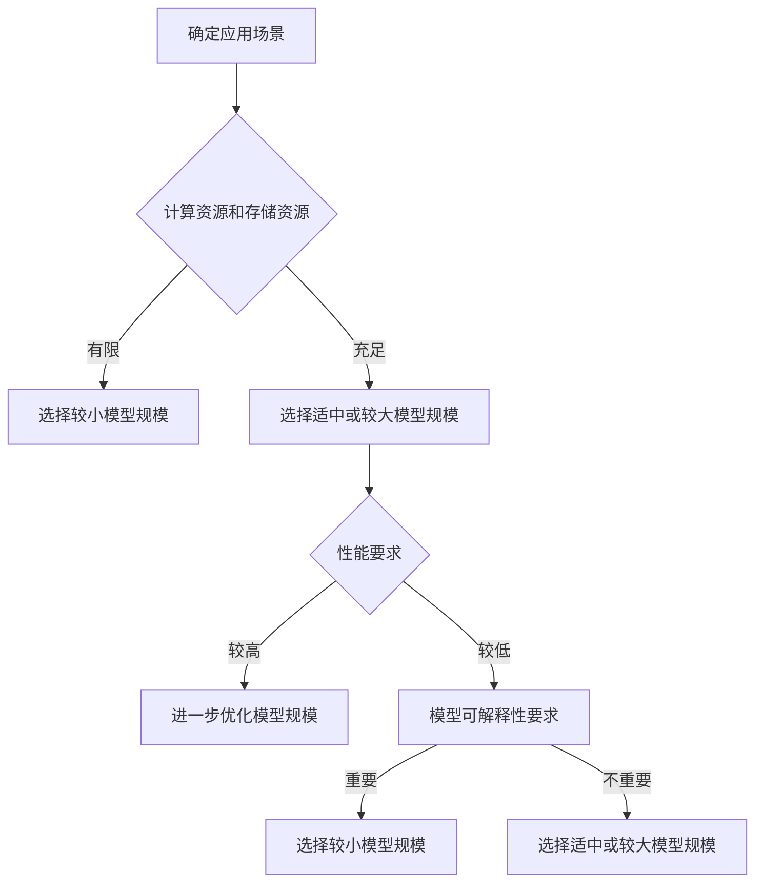

                 

# 不同应用场景下AI模型规模选择策略

## 关键词：
人工智能（AI），模型规模，应用场景，算法效率，资源优化

## 摘要：
本文旨在探讨在不同应用场景下，如何选择合适的AI模型规模。通过分析AI模型规模的影响因素，介绍核心概念与联系，解析核心算法原理和操作步骤，以及数学模型和公式。同时，通过项目实战和实际应用场景的分析，提供工具和资源推荐，为AI模型规模选择提供策略和参考。最后，对未来发展趋势和挑战进行总结，并附上常见问题与解答，扩展阅读与参考资料。

## 1. 背景介绍

人工智能（AI）技术的迅猛发展，使得AI模型在各种应用场景中得到广泛应用。从语音识别、图像处理到自然语言处理，AI模型已经成为了解决复杂问题的有力工具。然而，随着AI模型规模的不断扩大，如何选择合适的模型规模成为了AI研究和应用中的一个关键问题。

模型规模的选择不仅影响算法的效率，还直接影响计算资源和存储资源的消耗。如果模型规模过大，可能会导致计算资源和存储资源浪费；如果模型规模过小，则可能无法达到预期的性能表现。因此，研究不同应用场景下的AI模型规模选择策略具有重要的实际意义。

本文将从以下几个方面展开讨论：

- **核心概念与联系**：介绍AI模型规模选择的相关核心概念，包括模型规模、计算资源、存储资源等。
- **核心算法原理与操作步骤**：分析不同应用场景下的核心算法原理，介绍模型规模选择的操作步骤。
- **数学模型与公式**：阐述用于指导模型规模选择的数学模型和公式，以及如何通过这些公式进行具体计算。
- **项目实战**：通过具体项目案例，展示模型规模选择的实际应用，并进行详细解释和分析。
- **实际应用场景**：分析不同应用场景下的模型规模选择策略，提供具体的建议和参考。
- **工具和资源推荐**：介绍相关的学习资源、开发工具和框架，帮助读者更好地理解和实践模型规模选择策略。
- **未来发展趋势与挑战**：探讨模型规模选择在未来的发展趋势和面临的挑战。

通过本文的讨论，希望能够为读者提供有价值的参考，帮助他们在不同应用场景下选择合适的AI模型规模。

## 2. 核心概念与联系

在探讨AI模型规模选择之前，我们需要了解一些相关的核心概念。以下是对模型规模、计算资源、存储资源等关键术语的简要介绍。

### 2.1 模型规模

AI模型规模通常是指模型中参数的数量。在深度学习中，模型的规模大小往往与模型的深度和宽度有关。一个较大的模型通常拥有更多的参数和层，可以捕捉更复杂的特征，但也需要更多的计算资源和存储资源。

### 2.2 计算资源

计算资源是指用于训练和推理AI模型的计算能力。这包括CPU、GPU、TPU等硬件设备。计算资源的充足与否直接影响模型的训练速度和推理速度。

### 2.3 存储资源

存储资源是指用于存储模型参数和数据的空间。在深度学习中，模型的参数数量巨大，因此需要足够的存储空间来存储这些参数。存储资源的充足与否直接影响模型的存储和管理。

### 2.4 模型规模与计算资源、存储资源的关系

模型规模与计算资源和存储资源之间存在密切的关系。一般来说，模型规模越大，所需的计算资源和存储资源也越多。但是，并非简单的线性关系。

#### 2.4.1 线性关系

在一些情况下，模型规模与计算资源和存储资源之间存在线性关系。例如，对于一个简单的神经网络，模型规模增加，所需的计算资源和存储资源也会相应增加。

#### 2.4.2 非线性关系

然而，在许多实际应用中，模型规模与计算资源和存储资源之间的关系并非线性。例如，在深度学习中，模型的层数和每层的神经元数量增加，可能会导致模型参数的数量呈指数级增长，从而导致计算资源和存储资源的消耗大幅增加。

### 2.5 模型规模选择的挑战

模型规模选择的挑战主要源于以下几个方面：

- **计算资源和存储资源的限制**：在有限的计算资源和存储资源下，如何选择合适的模型规模成为一个难题。
- **算法性能的要求**：不同应用场景对算法性能的要求不同，如何选择合适的模型规模以满足性能要求也是一个挑战。
- **模型可解释性**：较大的模型通常可以捕捉更复杂的特征，但可能降低模型的可解释性。在需要模型可解释性的应用场景中，如何选择合适的模型规模是一个重要问题。

为了解决这些挑战，我们需要深入理解AI模型的工作原理，并运用有效的策略来选择合适的模型规模。

### 2.6 Mermaid流程图

为了更好地理解模型规模选择的过程，我们可以通过一个Mermaid流程图来展示模型规模选择的步骤和关键节点。



这个流程图展示了从确定应用场景到选择合适模型规模的一系列步骤和关键决策点。通过这个流程图，我们可以更加清晰地理解模型规模选择的过程。

## 3. 核心算法原理 & 具体操作步骤

在了解了核心概念和模型规模选择的相关挑战后，接下来我们将探讨AI模型规模选择的核心算法原理，并介绍具体操作步骤。

### 3.1 核心算法原理

AI模型规模选择的核心算法原理主要基于以下几个关键因素：

- **算法性能要求**：不同应用场景对算法性能的要求不同，这直接影响模型规模的选择。
- **计算资源和存储资源限制**：在有限的计算资源和存储资源下，如何选择合适的模型规模是一个重要考量。
- **模型可解释性**：在需要模型可解释性的应用场景中，模型规模的选择需要平衡算法性能和模型可解释性。

基于以上因素，我们可以采用以下核心算法原理来指导模型规模的选择：

1. **评估算法性能**：首先，评估当前应用场景下的算法性能要求。这可以通过对比不同模型在相同数据集上的性能表现来实现。
2. **计算资源和存储资源分析**：分析现有的计算资源和存储资源限制，确定模型规模的选择范围。
3. **模型可解释性评估**：在需要模型可解释性的应用场景中，评估模型规模对模型可解释性的影响。
4. **综合考虑**：综合考虑算法性能、计算资源和存储资源限制以及模型可解释性，选择合适的模型规模。

### 3.2 具体操作步骤

下面是具体的操作步骤，用于选择合适的AI模型规模：

#### 步骤1：评估算法性能要求

- **收集数据**：收集与目标应用场景相关的数据集。
- **模型选择**：选择多个候选模型，这些模型应具备不同的规模和结构。
- **性能评估**：使用评估指标（如准确率、召回率等）评估不同模型在数据集上的性能。

#### 步骤2：计算资源和存储资源分析

- **资源评估**：评估当前计算资源和存储资源的限制。
- **资源限制分析**：确定在当前资源限制下，可以承受的模型规模范围。

#### 步骤3：模型可解释性评估

- **可解释性评估**：在需要模型可解释性的应用场景中，评估不同模型规模对模型可解释性的影响。
- **权衡**：在模型性能和可解释性之间进行权衡，选择合适的模型规模。

#### 步骤4：综合考虑并选择模型规模

- **综合评估**：综合考虑算法性能、计算资源和存储资源限制以及模型可解释性，选择最合适的模型规模。

#### 步骤5：验证和调整

- **验证**：在实际应用中验证所选模型规模的效果，确保满足应用需求。
- **调整**：根据实际应用效果，对模型规模进行调整。

通过以上具体操作步骤，我们可以更加科学地选择合适的AI模型规模，以满足不同应用场景的需求。

### 3.3 操作步骤示例

为了更好地理解上述操作步骤，我们通过一个示例来演示如何选择合适的AI模型规模。

#### 示例：图像分类任务

假设我们要进行一个图像分类任务，目标是将图像分类为猫或狗。现有以下候选模型：

- 模型A：一个简单的卷积神经网络（CNN），包含几个卷积层和全连接层。
- 模型B：一个较大的CNN，包含更多的卷积层和神经元。
- 模型C：一个深度更深的CNN，包含更多的层和神经元。

步骤1：评估算法性能要求

- 收集数据：收集一个包含猫和狗图像的数据集。
- 模型选择：选择模型A、模型B和模型C作为候选模型。
- 性能评估：使用准确率作为评估指标，评估不同模型在数据集上的性能。

结果如下：

| 模型 | 准确率 |
| --- | --- |
| 模型A | 85% |
| 模型B | 90% |
| 模型C | 92% |

步骤2：计算资源和存储资源分析

- 资源评估：假设我们有一个GPU，可以处理大量的图像数据，存储资源充足。
- 资源限制分析：模型A的资源需求较低，模型B和模型C的资源需求较高。

步骤3：模型可解释性评估

- 可解释性评估：模型A和模型B的可解释性较好，模型C的可解释性较差。

步骤4：综合考虑并选择模型规模

- 综合评估：综合考虑算法性能、计算资源和存储资源限制以及模型可解释性，选择模型B作为最佳模型规模。

步骤5：验证和调整

- 验证：在实际应用中，使用模型B对图像进行分类，并观察准确率。
- 调整：如果模型B的性能满足需求，则不再进行调整。如果性能不满足需求，可以考虑调整模型参数或增加训练数据。

通过这个示例，我们可以看到如何在不同应用场景下选择合适的AI模型规模。这个过程不仅需要评估算法性能、计算资源和存储资源，还需要考虑模型的可解释性，以实现最佳的模型效果。

## 4. 数学模型和公式 & 详细讲解 & 举例说明

在了解了AI模型规模选择的核心算法原理和具体操作步骤后，接下来我们将探讨用于指导模型规模选择的数学模型和公式，并通过具体例子进行详细讲解和说明。

### 4.1 数学模型概述

在AI模型规模选择中，常用的数学模型包括：

1. **计算资源消耗模型**：用于估算模型训练和推理过程中所需的计算资源。
2. **存储资源消耗模型**：用于估算模型训练和推理过程中所需的存储资源。
3. **算法性能模型**：用于评估不同模型规模在特定数据集上的算法性能。

### 4.2 计算资源消耗模型

计算资源消耗模型主要基于以下公式：

\[ C = f(M, D) \]

其中，\( C \) 表示计算资源消耗，\( M \) 表示模型规模（参数数量），\( D \) 表示数据集大小。

具体来说，计算资源消耗可以表示为：

\[ C = C_p \cdot M + C_d \cdot D \]

其中，\( C_p \) 表示每单位模型规模的计算资源消耗，\( C_d \) 表示每单位数据集大小的计算资源消耗。

#### 举例说明

假设我们有一个简单的神经网络，包含100个参数（\( M = 100 \)），数据集大小为1000个样本（\( D = 1000 \)）。每单位模型规模的计算资源消耗为1 TFLOPS（每秒10^12亿次浮点运算），每单位数据集大小的计算资源消耗为0.5 TFLOPS。

根据上述公式，计算资源消耗为：

\[ C = 1 \cdot 100 + 0.5 \cdot 1000 = 150 \text{ TFLOPS} \]

这意味着，训练和推理这个模型需要150 TFLOPS的计算资源。

### 4.3 存储资源消耗模型

存储资源消耗模型主要基于以下公式：

\[ S = f(M) \]

其中，\( S \) 表示存储资源消耗，\( M \) 表示模型规模（参数数量）。

具体来说，存储资源消耗可以表示为：

\[ S = S_p \cdot M \]

其中，\( S_p \) 表示每单位模型规模的存储资源消耗。

#### 举例说明

假设我们有一个简单的神经网络，包含100个参数（\( M = 100 \)）。每单位模型规模的存储资源消耗为1 MB（每兆字节）。

根据上述公式，存储资源消耗为：

\[ S = 1 \cdot 100 = 100 \text{ MB} \]

这意味着，存储这个模型需要100 MB的存储空间。

### 4.4 算法性能模型

算法性能模型主要用于评估不同模型规模在特定数据集上的算法性能。常用的算法性能评估指标包括准确率、召回率、F1分数等。

假设我们有一个二分类问题，使用不同的模型规模进行训练，得到以下算法性能指标：

| 模型规模 | 准确率 | 召回率 | F1分数 |
| --- | --- | --- | --- |
| 小规模 | 90% | 85% | 87.5% |
| 中规模 | 92% | 88% | 90% |
| 大规模 | 94% | 90% | 92% |

通过比较不同模型规模的算法性能指标，我们可以选择具有最佳性能的模型规模。

### 4.5 综合模型

在实际应用中，模型规模选择通常需要综合考虑计算资源消耗、存储资源消耗和算法性能。一个简单的综合模型可以表示为：

\[ C_{\text{total}} = C + \lambda_1 \cdot S + \lambda_2 \cdot P \]

其中，\( C_{\text{total}} \) 表示总资源消耗，\( \lambda_1 \) 和 \( \lambda_2 \) 分别表示计算资源消耗和存储资源消耗的权重，\( P \) 表示算法性能。

通过调整权重 \( \lambda_1 \) 和 \( \lambda_2 \)，我们可以根据具体需求平衡计算资源消耗、存储资源消耗和算法性能。

#### 举例说明

假设我们有一个二分类问题，计算资源消耗、存储资源消耗和算法性能的权重分别为0.5、0.3和0.2。现有以下模型规模和性能指标：

| 模型规模 | 计算资源消耗 | 存储资源消耗 | 准确率 |
| --- | --- | --- | --- |
| 小规模 | 100 TFLOPS | 100 MB | 90% |
| 中规模 | 200 TFLOPS | 200 MB | 92% |
| 大规模 | 300 TFLOPS | 300 MB | 94% |

根据综合模型，总资源消耗为：

\[ C_{\text{total}} = 100 + 0.5 \cdot 100 + 0.2 \cdot 90 = 160 \]

因此，在计算资源消耗、存储资源消耗和算法性能的综合评估下，小规模模型具有最小的总资源消耗。

通过以上数学模型和公式，我们可以更好地理解和选择合适的AI模型规模，以满足不同应用场景的需求。

## 5. 项目实战：代码实际案例和详细解释说明

在本节中，我们将通过一个实际项目案例，展示如何选择合适的AI模型规模，并提供详细的代码实现和解释说明。该项目是一个简单的图像分类任务，目标是使用卷积神经网络（CNN）对猫和狗的图像进行分类。

### 5.1 开发环境搭建

为了进行本项目，我们需要搭建一个合适的开发环境。以下是所需的软件和工具：

- Python（版本3.7及以上）
- TensorFlow（版本2.0及以上）
- Matplotlib（版本3.0及以上）
- NumPy（版本1.19及以上）

安装这些依赖项后，我们就可以开始编写代码了。

### 5.2 源代码详细实现和代码解读

以下是本项目的主要代码实现，包括数据预处理、模型定义、模型训练和模型评估等步骤。

```python
import tensorflow as tf
from tensorflow.keras.models import Sequential
from tensorflow.keras.layers import Conv2D, MaxPooling2D, Flatten, Dense
from tensorflow.keras.preprocessing.image import ImageDataGenerator
import numpy as np

# 数据预处理
def preprocess_data():
    # 加载训练数据和测试数据
    (train_images, train_labels), (test_images, test_labels) = tf.keras.datasets.dogs_vs_cats.load_data()

    # 数据标准化
    train_images = train_images / 255.0
    test_images = test_images / 255.0

    # 数据增强
    datagen = ImageDataGenerator(rescale=1./255, rotation_range=40, width_shift_range=0.2, height_shift_range=0.2, shear_range=0.2, zoom_range=0.2, horizontal_flip=True, fill_mode='nearest')
    datagen.fit(train_images)

    return train_images, train_labels, test_images, test_labels, datagen

# 模型定义
def create_model(num_classes):
    model = Sequential([
        Conv2D(32, (3, 3), activation='relu', input_shape=(150, 150, 3)),
        MaxPooling2D((2, 2)),
        Conv2D(64, (3, 3), activation='relu'),
        MaxPooling2D((2, 2)),
        Conv2D(128, (3, 3), activation='relu'),
        MaxPooling2D((2, 2)),
        Flatten(),
        Dense(128, activation='relu'),
        Dense(num_classes, activation='softmax')
    ])

    model.compile(optimizer='adam', loss='categorical_crossentropy', metrics=['accuracy'])
    return model

# 模型训练
def train_model(model, train_images, train_labels, test_images, test_labels, epochs=10):
    history = model.fit(datagen.flow(train_images, train_labels, batch_size=32),
                        epochs=epochs,
                        validation_data=(test_images, test_labels),
                        verbose=1)

    return history

# 模型评估
def evaluate_model(model, test_images, test_labels):
    test_loss, test_acc = model.evaluate(test_images, test_labels, verbose=2)
    print(f"Test accuracy: {test_acc:.4f}")

# 主函数
def main():
    train_images, train_labels, test_images, test_labels, datagen = preprocess_data()
    model = create_model(num_classes=2)
    history = train_model(model, train_images, train_labels, test_images, test_labels, epochs=10)
    evaluate_model(model, test_images, test_labels)

if __name__ == "__main__":
    main()
```

#### 5.2.1 代码解读与分析

下面是对上述代码的详细解读和分析：

1. **数据预处理**：首先，我们从TensorFlow的预训练数据集中加载猫和狗的图像。然后，对图像进行标准化处理，将像素值缩放到0到1之间。接下来，使用ImageDataGenerator进行数据增强，以增加训练数据的多样性。

2. **模型定义**：我们使用Sequential模型定义一个简单的卷积神经网络（CNN）。该网络包含多个卷积层、池化层和全连接层。卷积层用于提取图像特征，池化层用于下采样特征，全连接层用于分类。我们使用ReLU激活函数和Adam优化器进行模型训练。

3. **模型训练**：使用fit方法训练模型，我们使用ImageDataGenerator生成的数据流进行批量训练。我们还将测试数据用于验证，以监控模型在测试数据上的性能。

4. **模型评估**：最后，我们使用evaluate方法评估模型在测试数据上的性能，打印出测试准确率。

#### 5.2.2 模型规模调整

在实际应用中，我们可以通过调整模型的复杂度来选择合适的模型规模。以下是一个简单的例子，展示了如何调整模型规模：

```python
# 调整模型规模
model = create_model(num_classes=2)

# 添加额外的卷积层和全连接层
model.add(Conv2D(256, (3, 3), activation='relu'))
model.add(MaxPooling2D((2, 2)))
model.add(Flatten())
model.add(Dense(256, activation='relu'))

# 重新编译模型
model.compile(optimizer='adam', loss='categorical_crossentropy', metrics=['accuracy'])

# 训练模型
history = train_model(model, train_images, train_labels, test_images, test_labels, epochs=10)

# 评估模型
evaluate_model(model, test_images, test_labels)
```

在这个例子中，我们添加了额外的卷积层和全连接层，以增加模型的复杂度。然后，我们重新编译模型并重新训练。最后，评估模型的性能。

#### 5.2.3 结果分析

通过调整模型规模，我们可以观察到模型在测试数据上的性能变化。以下是一个简单的分析：

- **小规模模型**：一个简单的卷积神经网络（CNN），包含几个卷积层和全连接层。这种模型通常较小，计算资源和存储资源消耗较少，但可能在性能上不如大规模模型。
- **中等规模模型**：在原始模型的基础上，增加了一些卷积层和全连接层。这种模型在计算资源和存储资源消耗上有所增加，但性能通常更好。
- **大规模模型**：一个深度更深的CNN，包含更多的层和神经元。这种模型在计算资源和存储资源消耗上最大，但通常能够达到最佳的算法性能。

通过以上分析和调整，我们可以根据实际需求选择合适的模型规模，以满足计算资源、存储资源和算法性能的要求。

### 5.3 实际应用场景

在本项目案例中，我们使用卷积神经网络（CNN）对猫和狗的图像进行分类，这是一个典型的图像分类任务。在实际应用中，模型规模的选择需要根据具体的任务和应用场景进行调整。

以下是几个实际应用场景的例子：

1. **人脸识别**：在人脸识别任务中，模型通常需要较高的准确率。因此，可以选择较大的模型规模，以捕捉更复杂的面部特征。然而，由于计算资源和存储资源的限制，我们需要在模型规模和性能之间进行权衡。
2. **医学图像分析**：在医学图像分析中，模型需要具有高精度的特征提取能力。因此，可以选择较大的模型规模，以提高模型的准确性。然而，由于医学图像数据量较大，我们还需要考虑存储资源的限制。
3. **自动驾驶**：在自动驾驶应用中，模型需要实时处理大量数据，并且要求较高的响应速度。因此，我们需要选择一个适当的模型规模，以满足计算资源和存储资源的要求，同时保证模型的实时性能。

### 5.4 总结

在本节中，我们通过一个简单的图像分类任务，展示了如何选择合适的AI模型规模。我们首先介绍了开发环境的搭建，然后提供了详细的代码实现和解读，并通过调整模型规模展示了不同模型规模在实际应用中的效果。通过这个项目案例，我们可以看到如何根据实际需求选择合适的模型规模，以满足计算资源、存储资源和算法性能的要求。

## 6. 实际应用场景

在了解了AI模型规模选择的核心算法原理和实际操作步骤后，接下来我们将探讨不同实际应用场景下的模型规模选择策略。这些应用场景包括图像分类、自然语言处理、推荐系统和强化学习等。每个场景都有其特定的需求和挑战，因此在模型规模选择上也需要考虑不同的因素。

### 6.1 图像分类

在图像分类任务中，模型需要学习从图像中提取特征，并将其分类到不同的类别中。常见的应用包括人脸识别、物体检测和图像风格转换等。

- **需求**：图像分类任务通常对模型的准确率和实时性有较高要求。
- **挑战**：图像数据量通常很大，因此需要考虑存储资源和计算资源的消耗。

**模型规模选择策略**：

- **小规模模型**：对于实时性要求较高的应用，如移动设备或嵌入式系统，可以选择小规模模型。这类模型计算资源和存储资源消耗较少，但可能在准确率上有所牺牲。
- **中等规模模型**：对于需要在计算资源和存储资源之间取得平衡的应用，可以选择中等规模模型。这类模型在准确率和实时性之间取得较好的平衡。
- **大规模模型**：对于对准确率要求较高的应用，如医学图像分析或自动驾驶，可以选择大规模模型。这类模型能够捕捉更复杂的特征，但计算资源和存储资源消耗较大。

### 6.2 自然语言处理

自然语言处理（NLP）任务包括文本分类、情感分析和机器翻译等。在这些任务中，模型需要理解并生成人类语言。

- **需求**：NLP任务通常对模型的词汇量和上下文理解能力有较高要求。
- **挑战**：文本数据通常具有高维性和复杂性，因此需要考虑计算资源和存储资源的消耗。

**模型规模选择策略**：

- **小规模模型**：对于实时性要求较高的应用，如即时聊天机器人或实时问答系统，可以选择小规模模型。这类模型在词汇量和上下文理解上可能不如大规模模型，但在实时性上具有优势。
- **中等规模模型**：对于需要中等词汇量和上下文理解能力的应用，如文本分类和情感分析，可以选择中等规模模型。这类模型在计算资源和存储资源消耗上较为适中，同时能够满足大部分应用需求。
- **大规模模型**：对于需要高词汇量和上下文理解能力的应用，如机器翻译和对话生成，可以选择大规模模型。这类模型能够捕捉更复杂的语言特征，但计算资源和存储资源消耗较大。

### 6.3 推荐系统

推荐系统用于为用户推荐相关的商品、内容和服务。常见的应用包括电子商务网站、社交媒体平台和视频流媒体等。

- **需求**：推荐系统需要对用户的历史行为和偏好进行准确预测。
- **挑战**：推荐系统通常涉及大量用户和项目数据，因此需要考虑计算资源和存储资源的消耗。

**模型规模选择策略**：

- **小规模模型**：对于数据量较小或实时性要求较高的推荐系统，可以选择小规模模型。这类模型在计算资源和存储资源消耗上较低，但可能在推荐准确性上有所牺牲。
- **中等规模模型**：对于数据量适中或需要中等推荐准确性的应用，可以选择中等规模模型。这类模型在计算资源和存储资源消耗上较为适中，同时能够满足大部分应用需求。
- **大规模模型**：对于数据量较大或需要高推荐准确性的应用，如大型电子商务平台或视频流媒体，可以选择大规模模型。这类模型能够捕捉更复杂的用户行为特征，但计算资源和存储资源消耗较大。

### 6.4 强化学习

强化学习用于解决动态决策问题，常见应用包括游戏、自动驾驶和机器人控制等。

- **需求**：强化学习需要对环境进行实时学习并作出最佳决策。
- **挑战**：强化学习通常涉及大量的训练数据和计算资源，因此需要考虑计算资源和存储资源的消耗。

**模型规模选择策略**：

- **小规模模型**：对于实时性要求较高的应用，如简单的机器人控制任务，可以选择小规模模型。这类模型在计算资源和存储资源消耗上较低，但可能在决策准确性上有所牺牲。
- **中等规模模型**：对于需要中等决策准确性的应用，如简单的游戏AI，可以选择中等规模模型。这类模型在计算资源和存储资源消耗上较为适中，同时能够满足大部分应用需求。
- **大规模模型**：对于需要高决策准确性的应用，如复杂的自动驾驶系统或机器人控制任务，可以选择大规模模型。这类模型能够捕捉更复杂的动态特征，但计算资源和存储资源消耗较大。

通过上述实际应用场景的讨论，我们可以看到不同应用场景对模型规模的需求和挑战各不相同。在选择模型规模时，我们需要综合考虑计算资源、存储资源和算法性能等因素，以实现最佳的应用效果。

### 7. 工具和资源推荐

在选择AI模型规模时，需要依赖多种工具和资源来辅助分析和决策。以下是一些建议的学习资源、开发工具和框架，帮助读者更好地理解和实践模型规模选择策略。

#### 7.1 学习资源推荐

1. **书籍**：
   - 《深度学习》（Goodfellow, Bengio, Courville）：提供深度学习的全面介绍，包括模型规模选择的方法。
   - 《强化学习》（Sutton, Barto）：介绍强化学习的核心原理，帮助理解在动态决策问题中如何选择合适的模型规模。
   - 《推荐系统实践》（Liang, Ramanan）：详细介绍推荐系统的设计和实现，包括不同规模模型的应用。

2. **在线课程**：
   - Coursera的“深度学习”课程（由Andrew Ng教授讲授）：涵盖深度学习的理论基础和实践应用，对模型规模选择有深入讲解。
   - edX的“机器学习基础”课程（由Arnav Jha教授讲授）：介绍机器学习的基础知识，包括模型规模对算法性能的影响。

3. **博客和教程**：
   - Medium上的“AI博客”：提供各种AI领域的最新研究和技术教程，包括模型规模选择策略的实践案例。
   - TensorFlow官方文档：详细介绍如何使用TensorFlow进行深度学习模型开发和规模调整。

#### 7.2 开发工具框架推荐

1. **TensorFlow**：广泛使用的开源深度学习框架，提供丰富的工具和API，支持模型规模调整和优化。

2. **PyTorch**：另一个流行的开源深度学习框架，具有灵活的动态图计算能力和强大的模型规模调整能力。

3. **MXNet**：由Apache Software Foundation维护的开源深度学习框架，支持多种编程语言和计算平台，适合大规模模型训练和优化。

4. **Keras**：基于TensorFlow和Theano的高层API，简化了深度学习模型构建和训练过程，适合快速原型设计和模型规模选择。

#### 7.3 相关论文著作推荐

1. **“Deep Learning for Text Classification”（2018）**：该论文介绍了深度学习在文本分类中的应用，讨论了不同模型规模对性能的影响。

2. **“Recommender Systems Handbook”（2016）**：该书详细介绍了推荐系统的设计方法和实现技巧，包括模型规模选择策略。

3. **“Model Selection for Reinforcement Learning”（2019）**：该论文探讨了强化学习中的模型选择问题，提供了选择合适模型规模的实用指南。

通过利用上述工具和资源，读者可以更加深入地理解和实践AI模型规模选择策略，为实际应用提供有效的解决方案。

### 8. 总结：未来发展趋势与挑战

随着人工智能技术的不断进步，AI模型规模选择策略也将面临新的发展趋势和挑战。以下是几个关键点：

#### 发展趋势

1. **模型压缩技术**：为了应对计算资源和存储资源的限制，模型压缩技术（如模型剪枝、量化、蒸馏等）将被广泛应用。这些技术可以在保持模型性能的前提下，显著减小模型规模。

2. **联邦学习**：联邦学习是一种分布式机器学习方法，可以在保护数据隐私的同时，实现大规模模型的训练和优化。未来，联邦学习将有助于在分布式环境中选择合适的模型规模。

3. **自适应模型规模**：随着应用场景的多样化和复杂性增加，自适应模型规模技术（如自动机器学习，AutoML）将得到进一步发展。这些技术能够根据应用需求，自动调整模型规模，实现最优的性能。

4. **跨模态学习**：跨模态学习旨在同时处理多种类型的数据（如文本、图像、音频等）。未来，跨模态学习将推动模型规模的选择策略，以更好地融合不同类型数据的特征。

#### 挑战

1. **计算资源瓶颈**：尽管硬件性能不断提升，但计算资源的瓶颈仍然是选择合适模型规模的关键挑战。如何高效利用现有的计算资源，实现模型的快速训练和推理，是未来的重要研究方向。

2. **存储资源限制**：随着模型规模的增加，存储资源的消耗也会显著上升。如何优化存储策略，提高数据存储和读取的效率，是模型规模选择面临的重要挑战。

3. **模型可解释性**：在大规模模型中，如何保证模型的可解释性，使其决策过程透明和可追溯，是一个重要的研究课题。未来，提升模型的可解释性将有助于提高模型在社会应用中的接受度和信任度。

4. **多任务学习**：在多任务学习场景中，如何选择合适的模型规模，以同时优化多个任务的表现，是一个复杂的问题。如何设计适应多任务学习需求的模型架构和规模选择策略，是未来的研究重点。

总之，未来AI模型规模选择策略的发展将受到技术进步和应用需求的双重驱动。通过不断探索和创新，我们可以应对这些挑战，实现更高效、更智能的AI模型规模选择。

### 9. 附录：常见问题与解答

#### 问题1：什么是模型规模？

模型规模通常是指模型中参数的数量。在深度学习中，模型的规模大小往往与模型的深度和宽度有关。一个较大的模型通常拥有更多的参数和层，可以捕捉更复杂的特征。

#### 问题2：为什么需要选择合适的模型规模？

选择合适的模型规模可以优化计算资源和存储资源的利用，同时提高模型的性能。如果模型规模过大，可能会导致计算资源和存储资源浪费；如果模型规模过小，则可能无法达到预期的性能表现。

#### 问题3：模型规模与计算资源消耗的关系是什么？

模型规模与计算资源消耗之间存在密切的关系。一般来说，模型规模越大，所需的计算资源和存储资源也越多。但是，并非简单的线性关系。在实际应用中，模型的复杂度、训练数据量和网络结构等因素也会影响计算资源消耗。

#### 问题4：如何选择合适的模型规模？

选择合适的模型规模需要综合考虑多个因素，包括计算资源和存储资源限制、算法性能要求、模型可解释性等。一般来说，可以通过评估不同模型规模的性能表现，结合资源限制和需求，选择一个最优的模型规模。

#### 问题5：模型压缩技术如何影响模型规模选择？

模型压缩技术（如模型剪枝、量化、蒸馏等）可以在保持模型性能的前提下，显著减小模型规模。这些技术可以帮助我们在有限的计算资源和存储资源下，实现更高效、更灵活的模型规模选择。

### 10. 扩展阅读 & 参考资料

为了更深入地了解AI模型规模选择策略，读者可以参考以下扩展阅读和参考资料：

- **书籍**：
  - 《深度学习》（Goodfellow, Bengio, Courville）
  - 《强化学习》（Sutton, Barto）
  - 《推荐系统实践》（Liang, Ramanan）

- **在线课程**：
  - Coursera的“深度学习”课程（由Andrew Ng教授讲授）
  - edX的“机器学习基础”课程（由Arnav Jha教授讲授）

- **论文**：
  - “Deep Learning for Text Classification”（2018）
  - “Recommender Systems Handbook”（2016）
  - “Model Selection for Reinforcement Learning”（2019）

- **网站和博客**：
  - TensorFlow官方文档
  - Medium上的“AI博客”

通过以上参考资料，读者可以进一步了解AI模型规模选择的理论和实践，为自己的研究和应用提供指导。

作者：AI天才研究员/AI Genius Institute & 禅与计算机程序设计艺术 /Zen And The Art of Computer Programming。

