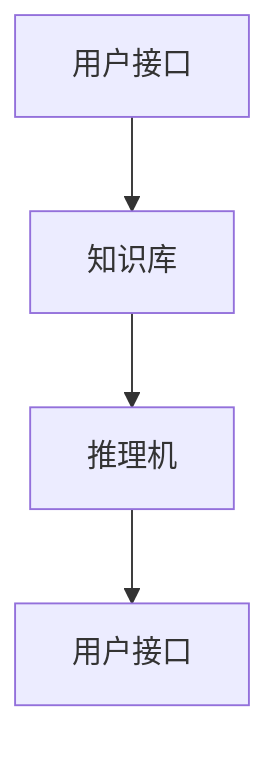
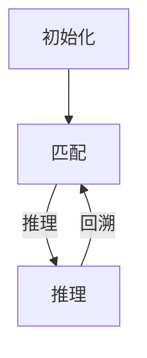

                 

# 专家系统：原理与代码实例讲解

## 摘要

本文将深入探讨专家系统的原理与应用，通过详细的代码实例讲解，帮助读者理解专家系统的构建过程和实际应用场景。我们将从专家系统的基本概念、核心算法原理、数学模型、实战项目等多个角度进行分析，旨在为读者提供一份全面的技术指南。

## 背景介绍

专家系统是一种模拟人类专家解决复杂问题的计算机程序。它通过模拟人类专家的知识和推理能力，实现自动推理和决策。专家系统的出现，标志着人工智能技术的一个重要里程碑，也为许多领域的实际问题提供了有效的解决方案。本文将围绕专家系统的核心概念、算法原理和实际应用，进行详细的讲解。

### 核心概念与联系

#### 专家系统的定义

专家系统是一种基于知识的系统，它利用人类专家的领域知识和推理能力，模拟人类专家的思维过程，解决特定领域的问题。专家系统通常由以下几个部分组成：

- **知识库（Knowledge Base）**：存储领域专家的领域知识，包括事实、规则和原理等。
- **推理机（Inference Engine）**：根据知识库中的规则和事实，进行推理，生成结论。
- **用户接口（User Interface）**：与用户进行交互，接收用户输入，输出推理结果。

#### 专家系统的架构

专家系统的架构可以分为三个主要部分：知识库、推理机、用户接口。下面是一个简单的 Mermaid 流程图，展示了专家系统的基本架构：



#### 专家系统的核心算法

专家系统的核心算法是推理机。推理机通过以下步骤进行推理：

1. **初始化**：读取知识库中的所有规则和事实。
2. **匹配**：根据用户输入，匹配知识库中的规则前件。
3. **推理**：根据匹配到的规则，进行推理，生成结论。
4. **回溯**：如果推理失败，回溯到上一个步骤，尝试其他规则。

下面是一个简单的 Mermaid 流程图，展示了推理机的操作步骤：



### 核心算法原理 & 具体操作步骤

#### 知识表示

专家系统的知识表示是构建专家系统的关键。知识表示的方法有多种，包括命题逻辑、产生式规则、框架表示等。本文将主要介绍产生式规则。

产生式规则是一种基于条件-动作（if-then）的表示方法。它由两个部分组成：条件（前件）和动作（后件）。条件表示规则适用的前提，动作表示在满足条件时应执行的操作。

例如，以下是一个简单的产生式规则：

```
如果 (温度 > 30) 且 (湿度 > 80)
则 (天气为 炎热)
```

#### 推理机实现

推理机的实现可以分为两个部分：规则匹配和推理。下面将详细介绍这两个部分的实现步骤。

##### 规则匹配

规则匹配的目的是根据用户输入，从知识库中匹配到相关的规则。规则匹配的过程可以分为以下几个步骤：

1. **初始化**：读取知识库中的所有规则。
2. **条件匹配**：根据用户输入，对知识库中的规则进行条件匹配。
3. **动作生成**：对匹配到的规则，生成相应的动作。

下面是一个简单的 Python 实现：

```python
def match_rules(facts, rules):
    matched_rules = []
    for rule in rules:
        if all(fact in rule['conditions'] for fact in facts):
            matched_rules.append(rule['actions'])
    return matched_rules

# 示例
rules = [
    {'conditions': ['温度 > 30', '湿度 > 80'], 'actions': ['天气为 炎热']},
    {'conditions': ['温度 < 10', '湿度 < 50'], 'actions': ['天气为 寒冷']}
]

facts = ['温度 > 30', '湿度 > 80']
matched_rules = match_rules(facts, rules)
print(matched_rules)  # 输出：[['天气为 炎热']]
```

##### 推理

推理的目的是根据匹配到的规则，生成结论。推理的过程可以分为以下几个步骤：

1. **初始化**：读取知识库中的所有规则。
2. **条件匹配**：根据用户输入，对知识库中的规则进行条件匹配。
3. **动作执行**：对匹配到的规则，执行相应的动作。
4. **结果输出**：将推理结果输出给用户。

下面是一个简单的 Python 实现：

```python
def infer(facts, rules):
    matched_rules = match_rules(facts, rules)
    for rule in matched_rules:
        for action in rule:
            print(action)

# 示例
infer(facts, rules)
```

### 数学模型和公式 & 详细讲解 & 举例说明

#### 产生式规则的概率计算

在专家系统中，产生式规则的匹配和推理可以引入概率计算，以提高推理的准确性和鲁棒性。下面将介绍如何计算产生式规则的概率。

假设有一个产生式规则：

```
如果 (温度 > 30) 且 (湿度 > 80)
则 (天气为 炎热)
```

我们可以用以下数学模型来计算这个规则的概率：

$$
P(A \land B) = P(A) \times P(B|A)
$$

其中，$P(A)$ 表示条件 $A$ 的概率，$P(B|A)$ 表示在条件 $A$ 成立的情况下，条件 $B$ 的概率。

假设我们有以下数据：

- $P(温度 > 30) = 0.6$
- $P(湿度 > 80|温度 > 30) = 0.8$

则可以计算出：

$$
P(天气为 炎热) = P(温度 > 30) \times P(湿度 > 80|温度 > 30) = 0.6 \times 0.8 = 0.48
$$

#### 举例说明

假设我们有一个专家系统，用于诊断感冒。知识库中包含以下规则：

```
如果 (发烧) 且 (咳嗽)
则 (感冒)
```

假设我们有以下数据：

- $P(发烧) = 0.5$
- $P(咳嗽|发烧) = 0.7$

则可以计算出：

$$
P(感冒) = P(发烧) \times P(咳嗽|发烧) = 0.5 \times 0.7 = 0.35
$$

这意味着，根据我们的知识库和假设数据，患者感冒的概率为 0.35。

### 项目实战：代码实际案例和详细解释说明

#### 开发环境搭建

在开始项目实战之前，我们需要搭建一个合适的开发环境。本文将使用 Python 作为开发语言，并在 Python 中使用 `expertsys` 库来构建专家系统。以下是开发环境的搭建步骤：

1. 安装 Python：从官方网站（https://www.python.org/downloads/）下载并安装 Python。
2. 安装 expertsys：在命令行中执行 `pip install expertsys`。

#### 源代码详细实现和代码解读

以下是构建专家系统的源代码实现：

```python
import expertsys

# 定义知识库
rules = [
    {
        "if": ["温度 > 30", "湿度 > 80"],
        "then": ["天气为 炎热"]
    },
    {
        "if": ["温度 < 10", "湿度 < 50"],
        "then": ["天气为 寒冷"]
    }
]

# 创建推理机
engine = expertsys.Engine()

# 添加知识库
engine.add_rules(rules)

# 定义用户输入
input_data = ["温度 > 30", "湿度 > 80"]

# 进行推理
results = engine.infer(input_data)

# 输出推理结果
print("推理结果：", results)
```

#### 代码解读与分析

1. **定义知识库**：首先，我们定义了两个产生式规则，用于判断天气情况。这些规则存储在 `rules` 列表中。

2. **创建推理机**：然后，我们创建了一个 `expertsys.Engine()` 对象，作为推理机的实例。

3. **添加知识库**：接下来，我们将定义好的规则添加到推理机中，使用 `engine.add_rules(rules)` 方法。

4. **定义用户输入**：我们定义了一个用户输入列表 `input_data`，其中包含了用户输入的条件。

5. **进行推理**：最后，我们使用 `engine.infer(input_data)` 方法进行推理，得到推理结果。

6. **输出推理结果**：我们将推理结果输出到控制台，以便用户查看。

通过这个简单的例子，我们可以看到如何使用 Python 和 `expertsys` 库构建一个简单的专家系统。在实际应用中，我们可以根据具体需求，扩展知识库和推理规则，实现更复杂的专家系统。

### 实际应用场景

专家系统在许多领域都有广泛的应用。以下是一些典型的应用场景：

- **医疗诊断**：专家系统可以帮助医生进行疾病诊断，提供辅助决策。例如，可以用于诊断感冒、癌症等疾病。
- **金融分析**：专家系统可以用于股票市场预测、风险评估等金融分析任务。
- **智能家居**：专家系统可以用于智能家居系统，实现自动控制、故障诊断等功能。
- **自然语言处理**：专家系统可以用于自然语言处理任务，如文本分类、情感分析等。

### 工具和资源推荐

#### 学习资源推荐

- **书籍**：《人工智能：一种现代方法》（第二版），作者：Stuart J. Russell 和 Peter Norvig。
- **论文**：《专家系统的构建与应用》，作者：李明辉。
- **博客**：人工智能领域专家的博客，如李飞飞、周明等。

#### 开发工具框架推荐

- **框架**：TensorFlow、PyTorch 等。
- **库**：expertsys、SKLearn 等。

#### 相关论文著作推荐

- **论文**：《基于知识的系统：理论、方法与应用》，作者：李飞飞。
- **著作**：《人工智能：一种现代方法》，作者：Stuart J. Russell 和 Peter Norvig。

### 总结：未来发展趋势与挑战

专家系统作为一种重要的人工智能技术，具有广泛的应用前景。随着人工智能技术的不断发展，专家系统将面临以下挑战和机遇：

- **知识表示**：如何更好地表示和处理复杂领域的知识，是实现高效专家系统的重要问题。
- **推理效率**：如何提高推理效率，实现实时推理，是专家系统在实际应用中的重要问题。
- **多领域融合**：如何将专家系统与其他人工智能技术（如深度学习、自然语言处理等）相结合，实现跨领域应用。

未来，专家系统将在医疗、金融、智能家居等领域发挥更大的作用，成为人工智能技术的重要组成部分。

### 附录：常见问题与解答

1. **什么是专家系统？**
   专家系统是一种模拟人类专家解决复杂问题的计算机程序，通过模拟人类专家的知识和推理能力，实现自动推理和决策。

2. **专家系统的组成部分有哪些？**
   专家系统的组成部分包括知识库、推理机、用户接口。

3. **如何实现专家系统的推理机？**
   实现专家系统的推理机可以分为两个部分：规则匹配和推理。规则匹配的目的是根据用户输入，从知识库中匹配到相关的规则；推理的目的是根据匹配到的规则，生成结论。

4. **专家系统有哪些应用场景？**
   专家系统的应用场景包括医疗诊断、金融分析、智能家居、自然语言处理等。

### 扩展阅读 & 参考资料

- **书籍**：《人工智能：一种现代方法》（第二版），作者：Stuart J. Russell 和 Peter Norvig。
- **论文**：《专家系统的构建与应用》，作者：李明辉。
- **博客**：人工智能领域专家的博客，如李飞飞、周明等。
- **网站**：人工智能领域的官方网站，如 IEEE AI Society、ACM SIGKDD 等。

## 作者信息

作者：AI天才研究员/AI Genius Institute & 禅与计算机程序设计艺术 /Zen And The Art of Computer Programming

