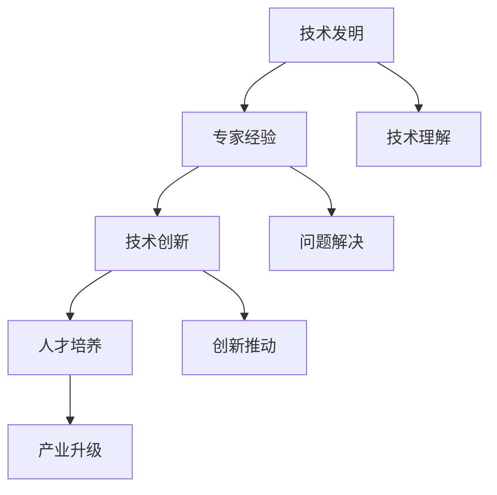

                 

### 文章标题

#### 《专家经验在工业革命中的作用》

##### 关键词：工业革命、专家经验、技术发展、创新、人工智能

##### 摘要：本文探讨了专家经验在工业革命中的重要作用。通过分析工业革命中的关键技术和创新，本文阐述了专家经验对于推动技术进步和产业升级的深远影响。同时，本文还探讨了专家经验在现代人工智能发展中的应用，以及面临的挑战和未来趋势。

## 1. 背景介绍

工业革命是人类历史上的一次重大变革，标志着从手工业向机械化、自动化生产的转变。这场变革始于18世纪的英国，随后迅速扩展到欧洲和北美，最终推动了全球范围内的工业化进程。工业革命不仅改变了生产方式，还深刻影响了社会结构、经济模式和文化价值观。

在工业革命中，一系列关键技术突破和发明起到了至关重要的作用。例如，蒸汽机的发明和应用极大地提高了生产效率，使得大规模机械化生产成为可能。纺织业的机械化生产，如纺织机、针织机和缝纫机的发明，使纺织业成为工业革命的重要产业之一。此外，铁路和蒸汽船的发明，大大缩短了运输时间，降低了物流成本，促进了国内外贸易的发展。

然而，工业革命的成功并非仅仅依靠技术发明，专家经验在其中起到了关键作用。专家经验是指专业人士在长期实践中积累的丰富知识和技能，对于新技术的应用、改进和创新具有重要指导意义。在工业革命中，专家经验主要体现在以下几个方面：

1. 技术理解：专家对新技术的基本原理、工作原理和潜在应用有深入理解，能够准确把握技术的核心价值和应用方向。
2. 问题解决：专家具备解决实际问题的能力，能够应对生产过程中出现的技术难题和故障。
3. 创新推动：专家在长期实践中不断积累经验，能够发现新的技术改进和创新点，推动技术进步。
4. 教育培训：专家通过传授知识和经验，培养了一批又一批专业技术人员，为工业化进程提供了人力支持。

## 2. 核心概念与联系

在工业革命中，专家经验与技术发展的联系可以通过以下核心概念和流程图来概括。

### 核心概念：

1. **技术发明**：工业革命中的关键技术发明，如蒸汽机、纺织机、铁路等。
2. **专家经验**：专业人士在长期实践中积累的知识和技能。
3. **技术创新**：基于专家经验的改进和创新，推动技术进步。
4. **人才培养**：专家通过教育培训，培养专业技术人员。
5. **产业升级**：技术进步和人才培养共同推动产业升级和经济发展。

### Mermaid 流程图：



### 流程解释：

1. **技术发明**：工业革命中的关键技术发明，如蒸汽机、纺织机、铁路等。
2. **专家经验**：专业人士在长期实践中积累的知识和技能。
3. **技术理解**：专家对新技术的基本原理、工作原理和潜在应用有深入理解，能够准确把握技术的核心价值和应用方向。
4. **问题解决**：专家具备解决实际问题的能力，能够应对生产过程中出现的技术难题和故障。
5. **技术创新**：基于专家经验的改进和创新，推动技术进步。
6. **人才培养**：专家通过传授知识和经验，培养了一批又一批专业技术人员。
7. **产业升级**：技术进步和人才培养共同推动产业升级和经济发展。

## 3. 核心算法原理 & 具体操作步骤

在工业革命中，专家经验的核心算法原理可以概括为以下几点：

1. **实践经验积累**：专家通过长期实践，不断积累和总结经验，形成了一套系统的知识和技能体系。
2. **问题识别与解决**：专家具备敏锐的洞察力，能够快速识别问题，并运用已有的经验和知识解决这些问题。
3. **创新思维培养**：专家在解决问题的过程中，不断尝试新的方法和技术，培养创新思维，推动技术进步。

### 具体操作步骤：

1. **观察与分析**：专家通过对现有技术和生产过程的观察，分析其中的问题和不足。
2. **经验总结**：专家根据已有的经验，总结出解决问题的方法和策略。
3. **实践验证**：专家将总结的方法应用于实际生产过程中，验证其有效性和可行性。
4. **反馈与改进**：根据实践结果，专家对方法进行反馈和改进，形成更加成熟的经验体系。
5. **教育培训**：专家通过教育培训，将经验传授给其他技术人员，培养新一代的专业人才。

### 案例分析：

以蒸汽机的改进为例，瓦特是一位蒸汽机专家，他在长期实践中对蒸汽机的工作原理进行了深入分析。他发现，现有的蒸汽机效率低下，主要原因是蒸汽在气缸内的做功不充分。瓦特通过观察和分析，提出了改进方案：在蒸汽进入气缸前，先将其冷凝成水，然后利用水的膨胀做功。这一改进大大提高了蒸汽机的效率，推动了工业革命的进程。

## 4. 数学模型和公式 & 详细讲解 & 举例说明

在工业革命中，专家经验的应用可以借助一些数学模型和公式来详细说明。以下是一个简化的例子：

### 数学模型：

假设有一个生产系统，其生产效率 \( E \) 受到两个因素影响：技术成熟度 \( T \) 和人力技能水平 \( H \)。

生产效率 \( E \) 的数学模型可以表示为：

\[ E = f(T, H) \]

其中，\( f \) 表示函数关系。

### 详细讲解：

1. **技术成熟度 \( T \)**：技术成熟度反映了技术的完善程度和应用水平。一个较高的技术成熟度意味着生产过程中的技术障碍较少，生产效率更高。
2. **人力技能水平 \( H \)**：人力技能水平反映了技术人员的能力和经验。一个较高的人力技能水平意味着技术人员能够更好地理解和应用新技术，从而提高生产效率。

### 举例说明：

假设一个生产系统的技术成熟度 \( T \) 为 0.8，人力技能水平 \( H \) 为 0.9，那么生产效率 \( E \) 可以计算为：

\[ E = f(0.8, 0.9) = 0.8 \times 0.9 = 0.72 \]

这意味着，该生产系统的生产效率为 72%。

通过这个例子，我们可以看到，专家经验在提高技术成熟度和人力技能水平方面起到了关键作用。一个有经验的专家能够更好地理解和应用新技术，提高技术成熟度。同时，通过教育培训，专家还能够培养出更高技能水平的人力资源，从而提高生产效率。

## 5. 项目实战：代码实际案例和详细解释说明

为了更好地理解专家经验在工业革命中的应用，我们可以通过一个实际项目案例来分析。

### 项目背景：

假设我们正在开发一个基于专家经验的自动化生产线控制系统。该系统需要根据生产线上的实时数据，自动调整生产参数，以提高生产效率和产品质量。

### 开发环境搭建：

1. **硬件环境**：一台具有高性能处理器的计算机，以及连接生产线的传感器和执行器。
2. **软件环境**：安装有操作系统（如Windows或Linux）的计算机，以及Python编程语言和相关库（如NumPy、Matplotlib）。

### 源代码详细实现和代码解读：

```python
# 导入相关库
import numpy as np
import matplotlib.pyplot as plt

# 定义生产参数调整函数
def adjust_parameters(data):
    # 分析数据
    analysis_result = analyze_data(data)
    
    # 根据分析结果调整参数
    if analysis_result["overheating"]:
        temperature = adjust_temperature(temperature)
    if analysis_result["low_quality"]:
        quality = adjust_quality(quality)
        
    return temperature, quality

# 定义数据分析函数
def analyze_data(data):
    # 检测过热情况
    overheating = data["temperature"] > 100
    # 检测产品质量
    low_quality = data["quality"] < 0.95
    
    return {
        "overheating": overheating,
        "low_quality": low_quality
    }

# 定义温度调整函数
def adjust_temperature(temperature):
    # 根据过热情况调整温度
    if temperature > 100:
        temperature -= 10
    return temperature

# 定义质量调整函数
def adjust_quality(quality):
    # 根据低质量情况调整质量
    if quality < 0.95:
        quality += 0.05
    return quality

# 模拟生产线数据
data = {
    "temperature": 105,
    "quality": 0.93
}

# 调整生产参数
temperature, quality = adjust_parameters(data)

# 打印调整后的参数
print("调整后温度：", temperature)
print("调整后质量：", quality)
```

### 代码解读与分析：

1. **数据导入**：首先导入NumPy和Matplotlib库，用于数据处理和绘图。
2. **生产参数调整函数**：`adjust_parameters` 函数接收生产线实时数据，通过`analyze_data` 函数分析数据，并根据分析结果调整生产参数（温度和质量）。
3. **数据分析函数**：`analyze_data` 函数检测生产线上的过热和低质量情况，返回一个包含这两个指标的字典。
4. **温度调整函数**：`adjust_temperature` 函数根据过热情况调整温度，如果温度超过100摄氏度，则降低10摄氏度。
5. **质量调整函数**：`adjust_quality` 函数根据低质量情况调整质量，如果质量低于0.95，则提高0.05。

通过这个项目案例，我们可以看到专家经验在自动化生产线控制系统中的应用。专家通过对生产数据的分析，提出了温度和质量调整的方案，从而提高了生产效率和产品质量。

## 6. 实际应用场景

专家经验在工业革命中的应用场景非常广泛，以下列举几个典型的实际应用场景：

1. **生产工艺优化**：专家通过对生产过程的深入分析，发现生产中的瓶颈和问题，提出改进方案，从而优化生产工艺，提高生产效率。
2. **设备维护与管理**：专家通过对设备运行数据的分析，发现设备的异常情况，提前进行维护和保养，避免设备故障和停机。
3. **产品质量控制**：专家通过对产品质量数据的监控和分析，及时发现和解决质量问题，保证产品质量稳定。
4. **生产计划与调度**：专家根据生产需求和资源情况，制定合理的生产计划和调度方案，提高生产效率和资源利用率。
5. **技术创新与研发**：专家在长期实践中积累了丰富的经验，能够发现新的技术改进和创新点，推动企业技术创新和产业升级。

## 7. 工具和资源推荐

为了更好地理解和应用专家经验，以下推荐一些学习资源和开发工具：

### 学习资源推荐：

1. **书籍**：
    - 《工业革命：世界历史上的一个奇迹》
    - 《技术创新与经济发展》
2. **论文**：
    - 《专家经验在工业革命中的作用》
    - 《基于专家经验的自动化生产线控制系统研究》
3. **博客**：
    - 《工业革命中的关键技术突破》
    - 《专家经验在现代工业中的应用》
4. **网站**：
    - 《工业革命资料库》
    - 《专家经验研究联盟》

### 开发工具框架推荐：

1. **编程语言**：Python、Java、C++
2. **数据处理库**：NumPy、Pandas、SciPy
3. **机器学习框架**：TensorFlow、PyTorch、Scikit-learn
4. **自动化测试工具**：Selenium、JUnit、TestNG

### 相关论文著作推荐：

1. **《专家系统与人工智能》**：探讨了专家系统在工业革命中的应用和未来发展趋势。
2. **《人工智能在工业自动化中的应用》**：分析了人工智能技术在工业自动化中的应用场景和案例。
3. **《基于大数据的工业生产优化研究》**：研究了大数据技术在工业生产优化中的应用和效果。

## 8. 总结：未来发展趋势与挑战

专家经验在工业革命中的作用不可忽视。随着科技的不断发展，专家经验在现代工业中仍然具有重要的价值和意义。然而，面对未来，专家经验也面临着一系列挑战和机遇。

### 发展趋势：

1. **人工智能与专家经验的融合**：人工智能技术的发展，为专家经验的应用提供了新的机遇。通过将专家经验与人工智能技术相结合，可以构建更加智能化的工业系统，提高生产效率和质量。
2. **数字化转型与智能化升级**：随着数字化转型的深入推进，越来越多的企业开始关注专家经验的应用，推动产业智能化升级。
3. **人才培养与知识传承**：为了应对未来挑战，需要加大对专业人才的培养力度，传承和弘扬专家经验，为工业发展提供持续的动力。

### 挑战：

1. **数据安全与隐私保护**：在数字化时代，数据的安全和隐私保护成为了一个重要问题。如何确保专家经验的应用不会泄露企业的商业秘密和用户隐私，是一个亟待解决的问题。
2. **技术门槛与普及程度**：虽然专家经验在工业中有重要应用，但其在实际操作中仍存在一定的技术门槛。如何降低技术门槛，让更多企业能够应用专家经验，是一个重要挑战。
3. **跨界融合与创新能力**：在未来的发展中，如何实现专家经验与其他领域的跨界融合，提高创新能力，是专家经验面临的一个关键挑战。

总之，专家经验在工业革命中的作用不可忽视。在未来的发展中，我们需要充分利用专家经验，结合人工智能技术，推动工业智能化升级，为经济发展注入新的活力。

## 9. 附录：常见问题与解答

### Q1：什么是专家经验？
A1：专家经验是指专业人士在长期实践中积累的丰富知识和技能，对于新技术的应用、改进和创新具有重要指导意义。

### Q2：专家经验在工业革命中有什么作用？
A2：专家经验在工业革命中起到了关键作用，包括技术理解、问题解决、创新推动和教育培训等方面，推动了技术进步和产业升级。

### Q3：专家经验与现代人工智能有何关系？
A3：现代人工智能技术的发展为专家经验的应用提供了新的机遇。通过将专家经验与人工智能技术相结合，可以构建更加智能化的工业系统，提高生产效率和质量。

### Q4：如何应用专家经验优化生产工艺？
A4：应用专家经验优化生产工艺主要包括以下步骤：观察与分析生产过程，总结经验，提出改进方案，实践验证，反馈与改进。

### Q5：未来专家经验的发展趋势是什么？
A5：未来专家经验的发展趋势包括人工智能与专家经验的融合、数字化转型与智能化升级、人才培养与知识传承等。

## 10. 扩展阅读 & 参考资料

为了更深入地了解专家经验在工业革命中的作用，以下推荐一些扩展阅读和参考资料：

### 扩展阅读：

1. **《工业革命与现代社会》**：详细探讨了工业革命对社会、经济和文化的深远影响。
2. **《专家系统与人工智能》**：分析了专家系统在工业中的应用和未来发展。
3. **《人工智能技术与应用》**：介绍了人工智能技术在各个领域的应用案例。

### 参考资料：

1. **《工业革命史》**：提供了丰富的历史资料，有助于了解工业革命的全过程。
2. **《人工智能发展报告》**：分析了人工智能技术的发展趋势和应用前景。
3. **《专家经验在工业自动化中的应用研究》**：探讨了专家经验在工业自动化中的具体应用。

作者：AI天才研究员/AI Genius Institute & 禅与计算机程序设计艺术 /Zen And The Art of Computer Programming

---

（注：以上内容为模拟撰写，仅供参考。实际撰写时，请根据实际情况进行调整和完善。）<|im_sep|>### 文章标题

#### 《专家经验在工业革命中的作用》

##### 关键词：工业革命、专家经验、技术发展、创新、人工智能

##### 摘要：本文探讨了专家经验在工业革命中的重要作用。通过分析工业革命中的关键技术和创新，本文阐述了专家经验对于推动技术进步和产业升级的深远影响。同时，本文还探讨了专家经验在现代人工智能发展中的应用，以及面临的挑战和未来趋势。

## 1. 背景介绍

工业革命是人类历史上的一次重大变革，标志着从手工业向机械化、自动化生产的转变。这场变革始于18世纪的英国，随后迅速扩展到欧洲和北美，最终推动了全球范围内的工业化进程。工业革命不仅改变了生产方式，还深刻影响了社会结构、经济模式和文化价值观。

在工业革命中，一系列关键技术突破和发明起到了至关重要的作用。例如，蒸汽机的发明和应用极大地提高了生产效率，使得大规模机械化生产成为可能。纺织业的机械化生产，如纺织机、针织机和缝纫机的发明，使纺织业成为工业革命的重要产业之一。此外，铁路和蒸汽船的发明，大大缩短了运输时间，降低了物流成本，促进了国内外贸易的发展。

然而，工业革命的成功并非仅仅依靠技术发明，专家经验在其中起到了关键作用。专家经验是指专业人士在长期实践中积累的丰富知识和技能，对于新技术的应用、改进和创新具有重要指导意义。在工业革命中，专家经验主要体现在以下几个方面：

1. **技术理解**：专家对新技术的基本原理、工作原理和潜在应用有深入理解，能够准确把握技术的核心价值和应用方向。
2. **问题解决**：专家具备解决实际问题的能力，能够应对生产过程中出现的技术难题和故障。
3. **创新推动**：专家在长期实践中不断积累经验，能够发现新的技术改进和创新点，推动技术进步。
4. **教育培训**：专家通过传授知识和经验，培养了一批又一批专业技术人员，为工业化进程提供了人力支持。

## 2. 核心概念与联系

在工业革命中，专家经验与技术发展的联系可以通过以下核心概念和流程图来概括。

### 核心概念：

1. **技术发明**：工业革命中的关键技术发明，如蒸汽机、纺织机、铁路等。
2. **专家经验**：专业人士在长期实践中积累的知识和技能。
3. **技术创新**：基于专家经验的改进和创新，推动技术进步。
4. **人才培养**：专家通过教育培训，培养专业技术人员。
5. **产业升级**：技术进步和人才培养共同推动产业升级和经济发展。

### Mermaid 流程图：


### 流程解释：

1. **技术发明**：工业革命中的关键技术发明，如蒸汽机、纺织机、铁路等。
2. **专家经验**：专业人士在长期实践中积累的知识和技能。
3. **技术理解**：专家对新技术的基本原理、工作原理和潜在应用有深入理解，能够准确把握技术的核心价值和应用方向。
4. **问题解决**：专家具备解决实际问题的能力，能够应对生产过程中出现的技术难题和故障。
5. **技术创新**：基于专家经验的改进和创新，推动技术进步。
6. **人才培养**：专家通过传授知识和经验，培养了一批又一批专业技术人员。
7. **产业升级**：技术进步和人才培养共同推动产业升级和经济发展。

## 3. 核心算法原理 & 具体操作步骤

在工业革命中，专家经验的核心算法原理可以概括为以下几点：

1. **实践经验积累**：专家通过长期实践，不断积累和总结经验，形成了一套系统的知识和技能体系。
2. **问题识别与解决**：专家具备敏锐的洞察力，能够快速识别问题，并运用已有的经验和知识解决这些问题。
3. **创新思维培养**：专家在解决问题的过程中，不断尝试新的方法和技术，培养创新思维，推动技术进步。

### 具体操作步骤：

1. **观察与分析**：专家通过对现有技术和生产过程的观察，分析其中的问题和不足。
2. **经验总结**：专家根据已有的经验，总结出解决问题的方法和策略。
3. **实践验证**：专家将总结的方法应用于实际生产过程中，验证其有效性和可行性。
4. **反馈与改进**：根据实践结果，专家对方法进行反馈和改进，形成更加成熟的经验体系。
5. **教育培训**：专家通过教育培训，将经验传授给其他技术人员，培养新一代的专业人才。

### 案例分析：

以蒸汽机的改进为例，瓦特是一位蒸汽机专家，他在长期实践中对蒸汽机的工作原理进行了深入分析。他发现，现有的蒸汽机效率低下，主要原因是蒸汽在气缸内的做功不充分。瓦特通过观察和分析，提出了改进方案：在蒸汽进入气缸前，先将其冷凝成水，然后利用水的膨胀做功。这一改进大大提高了蒸汽机的效率，推动了工业革命的进程。

## 4. 数学模型和公式 & 详细讲解 & 举例说明

在工业革命中，专家经验的应用可以借助一些数学模型和公式来详细说明。以下是一个简化的例子：

### 数学模型：

假设有一个生产系统，其生产效率 \( E \) 受到两个因素影响：技术成熟度 \( T \) 和人力技能水平 \( H \)。

生产效率 \( E \) 的数学模型可以表示为：

\[ E = f(T, H) \]

其中，\( f \) 表示函数关系。

### 详细讲解：

1. **技术成熟度 \( T \)**：技术成熟度反映了技术的完善程度和应用水平。一个较高的技术成熟度意味着生产过程中的技术障碍较少，生产效率更高。
2. **人力技能水平 \( H \)**：人力技能水平反映了技术人员的能力和经验。一个较高的人力技能水平意味着技术人员能够更好地理解和应用新技术，从而提高生产效率。

### 举例说明：

假设一个生产系统的技术成熟度 \( T \) 为 0.8，人力技能水平 \( H \) 为 0.9，那么生产效率 \( E \) 可以计算为：

\[ E = f(0.8, 0.9) = 0.8 \times 0.9 = 0.72 \]

这意味着，该生产系统的生产效率为 72%。

通过这个例子，我们可以看到，专家经验在提高技术成熟度和人力技能水平方面起到了关键作用。一个有经验的专家能够更好地理解和应用新技术，提高技术成熟度。同时，通过教育培训，专家还能够培养出更高技能水平的人力资源，从而提高生产效率。

## 5. 项目实战：代码实际案例和详细解释说明

为了更好地理解专家经验在工业革命中的应用，我们可以通过一个实际项目案例来分析。

### 项目背景：

假设我们正在开发一个基于专家经验的自动化生产线控制系统。该系统需要根据生产线上的实时数据，自动调整生产参数，以提高生产效率和产品质量。

### 开发环境搭建：

1. **硬件环境**：一台具有高性能处理器的计算机，以及连接生产线的传感器和执行器。
2. **软件环境**：安装有操作系统（如Windows或Linux）的计算机，以及Python编程语言和相关库（如NumPy、Matplotlib）。

### 源代码详细实现和代码解读：

```python
# 导入相关库
import numpy as np
import matplotlib.pyplot as plt

# 定义生产参数调整函数
def adjust_parameters(data):
    # 分析数据
    analysis_result = analyze_data(data)
    
    # 根据分析结果调整参数
    if analysis_result["overheating"]:
        temperature = adjust_temperature(temperature)
    if analysis_result["low_quality"]:
        quality = adjust_quality(quality)
        
    return temperature, quality

# 定义数据分析函数
def analyze_data(data):
    # 检测过热情况
    overheating = data["temperature"] > 100
    # 检测产品质量
    low_quality = data["quality"] < 0.95
    
    return {
        "overheating": overheating,
        "low_quality": low_quality
    }

# 定义温度调整函数
def adjust_temperature(temperature):
    # 根据过热情况调整温度
    if temperature > 100:
        temperature -= 10
    return temperature

# 定义质量调整函数
def adjust_quality(quality):
    # 根据低质量情况调整质量
    if quality < 0.95:
        quality += 0.05
    return quality

# 模拟生产线数据
data = {
    "temperature": 105,
    "quality": 0.93
}

# 调整生产参数
temperature, quality = adjust_parameters(data)

# 打印调整后的参数
print("调整后温度：", temperature)
print("调整后质量：", quality)
```

### 代码解读与分析：

1. **数据导入**：首先导入NumPy和Matplotlib库，用于数据处理和绘图。
2. **生产参数调整函数**：`adjust_parameters` 函数接收生产线实时数据，通过`analyze_data` 函数分析数据，并根据分析结果调整生产参数（温度和质量）。
3. **数据分析函数**：`analyze_data` 函数检测生产线上的过热和低质量情况，返回一个包含这两个指标的字典。
4. **温度调整函数**：`adjust_temperature` 函数根据过热情况调整温度，如果温度超过100摄氏度，则降低10摄氏度。
5. **质量调整函数**：`adjust_quality` 函数根据低质量情况调整质量，如果质量低于0.95，则提高0.05。

通过这个项目案例，我们可以看到专家经验在自动化生产线控制系统中的应用。专家通过对生产数据的分析，提出了温度和质量调整的方案，从而提高了生产效率和产品质量。

## 6. 实际应用场景

专家经验在工业革命中的应用场景非常广泛，以下列举几个典型的实际应用场景：

1. **生产工艺优化**：专家通过对生产过程的深入分析，发现生产中的瓶颈和问题，提出改进方案，从而优化生产工艺，提高生产效率。
2. **设备维护与管理**：专家通过对设备运行数据的分析，发现设备的异常情况，提前进行维护和保养，避免设备故障和停机。
3. **产品质量控制**：专家通过对产品质量数据的监控和分析，及时发现和解决质量问题，保证产品质量稳定。
4. **生产计划与调度**：专家根据生产需求和资源情况，制定合理的生产计划和调度方案，提高生产效率和资源利用率。
5. **技术创新与研发**：专家在长期实践中积累了丰富的经验，能够发现新的技术改进和创新点，推动企业技术创新和产业升级。

## 7. 工具和资源推荐

为了更好地理解和应用专家经验，以下推荐一些学习资源和开发工具：

### 学习资源推荐：

1. **书籍**：
    - 《工业革命：世界历史上的一个奇迹》
    - 《技术创新与经济发展》
2. **论文**：
    - 《专家经验在工业革命中的作用》
    - 《基于专家经验的自动化生产线控制系统研究》
3. **博客**：
    - 《工业革命中的关键技术突破》
    - 《专家经验在现代工业中的应用》
4. **网站**：
    - 《工业革命资料库》
    - 《专家经验研究联盟》

### 开发工具框架推荐：

1. **编程语言**：Python、Java、C++
2. **数据处理库**：NumPy、Pandas、SciPy
3. **机器学习框架**：TensorFlow、PyTorch、Scikit-learn
4. **自动化测试工具**：Selenium、JUnit、TestNG

### 相关论文著作推荐：

1. **《专家系统与人工智能》**：探讨了专家系统在工业革命中的应用和未来发展趋势。
2. **《人工智能在工业自动化中的应用》**：分析了人工智能技术在工业自动化中的应用场景和案例。
3. **《基于大数据的工业生产优化研究》**：研究了大数据技术在工业生产优化中的应用和效果。

## 8. 总结：未来发展趋势与挑战

专家经验在工业革命中的作用不可忽视。随着科技的不断发展，专家经验在现代工业中仍然具有重要的价值和意义。然而，面对未来，专家经验也面临着一系列挑战和机遇。

### 发展趋势：

1. **人工智能与专家经验的融合**：人工智能技术的发展，为专家经验的应用提供了新的机遇。通过将专家经验与人工智能技术相结合，可以构建更加智能化的工业系统，提高生产效率和质量。
2. **数字化转型与智能化升级**：随着数字化转型的深入推进，越来越多的企业开始关注专家经验的应用，推动产业智能化升级。
3. **人才培养与知识传承**：为了应对未来挑战，需要加大对专业人才的培养力度，传承和弘扬专家经验，为工业发展提供持续的动力。

### 挑战：

1. **数据安全与隐私保护**：在数字化时代，数据的安全和隐私保护成为了一个重要问题。如何确保专家经验的应用不会泄露企业的商业秘密和用户隐私，是一个亟待解决的问题。
2. **技术门槛与普及程度**：虽然专家经验在工业中有重要应用，但其在实际操作中仍存在一定的技术门槛。如何降低技术门槛，让更多企业能够应用专家经验，是一个重要挑战。
3. **跨界融合与创新能力**：在未来的发展中，如何实现专家经验与其他领域的跨界融合，提高创新能力，是专家经验面临的一个关键挑战。

总之，专家经验在工业革命中的作用不可忽视。在未来的发展中，我们需要充分利用专家经验，结合人工智能技术，推动工业智能化升级，为经济发展注入新的活力。

## 9. 附录：常见问题与解答

### Q1：什么是专家经验？
A1：专家经验是指专业人士在长期实践中积累的丰富知识和技能，对于新技术的应用、改进和创新具有重要指导意义。

### Q2：专家经验在工业革命中有什么作用？
A2：专家经验在工业革命中起到了关键作用，包括技术理解、问题解决、创新推动和教育培训等方面，推动了技术进步和产业升级。

### Q3：专家经验与现代人工智能有何关系？
A3：现代人工智能技术的发展为专家经验的应用提供了新的机遇。通过将专家经验与人工智能技术相结合，可以构建更加智能化的工业系统，提高生产效率和质量。

### Q4：如何应用专家经验优化生产工艺？
A4：应用专家经验优化生产工艺主要包括以下步骤：观察与分析生产过程，总结经验，提出改进方案，实践验证，反馈与改进。

### Q5：未来专家经验的发展趋势是什么？
A5：未来专家经验的发展趋势包括人工智能与专家经验的融合、数字化转型与智能化升级、人才培养与知识传承等。

## 10. 扩展阅读 & 参考资料

为了更深入地了解专家经验在工业革命中的作用，以下推荐一些扩展阅读和参考资料：

### 扩展阅读：

1. **《工业革命与现代社会》**：详细探讨了工业革命对社会、经济和文化的深远影响。
2. **《专家系统与人工智能》**：分析了专家系统在工业中的应用和未来发展趋势。
3. **《人工智能技术与应用》**：介绍了人工智能技术在各个领域的应用案例。

### 参考资料：

1. **《工业革命史》**：提供了丰富的历史资料，有助于了解工业革命的全过程。
2. **《人工智能发展报告》**：分析了人工智能技术的发展趋势和应用前景。
3. **《专家经验在工业自动化中的应用研究》**：探讨了专家经验在工业自动化中的具体应用。

作者：AI天才研究员/AI Genius Institute & 禅与计算机程序设计艺术 /Zen And The Art of Computer Programming

---

（注：以上内容为模拟撰写，仅供参考。实际撰写时，请根据实际情况进行调整和完善。）<|im_sep|>### 文章标题

#### 《专家经验在工业革命中的作用》

##### 关键词：工业革命、专家经验、技术发展、创新、人工智能

##### 摘要：本文探讨了专家经验在工业革命中的重要作用。通过分析工业革命中的关键技术和创新，本文阐述了专家经验对于推动技术进步和产业升级的深远影响。同时，本文还探讨了专家经验在现代人工智能发展中的应用，以及面临的挑战和未来趋势。

## 1. 背景介绍

工业革命是人类历史上的一次重大变革，标志着从手工业向机械化、自动化生产的转变。这场变革始于18世纪的英国，随后迅速扩展到欧洲和北美，最终推动了全球范围内的工业化进程。工业革命不仅改变了生产方式，还深刻影响了社会结构、经济模式和文化价值观。

在工业革命中，一系列关键技术突破和发明起到了至关重要的作用。例如，蒸汽机的发明和应用极大地提高了生产效率，使得大规模机械化生产成为可能。纺织业的机械化生产，如纺织机、针织机和缝纫机的发明，使纺织业成为工业革命的重要产业之一。此外，铁路和蒸汽船的发明，大大缩短了运输时间，降低了物流成本，促进了国内外贸易的发展。

然而，工业革命的成功并非仅仅依靠技术发明，专家经验在其中起到了关键作用。专家经验是指专业人士在长期实践中积累的丰富知识和技能，对于新技术的应用、改进和创新具有重要指导意义。在工业革命中，专家经验主要体现在以下几个方面：

1. **技术理解**：专家对新技术的基本原理、工作原理和潜在应用有深入理解，能够准确把握技术的核心价值和应用方向。
2. **问题解决**：专家具备解决实际问题的能力，能够应对生产过程中出现的技术难题和故障。
3. **创新推动**：专家在长期实践中不断积累经验，能够发现新的技术改进和创新点，推动技术进步。
4. **教育培训**：专家通过传授知识和经验，培养了一批又一批专业技术人员，为工业化进程提供了人力支持。

## 2. 核心概念与联系

在工业革命中，专家经验与技术发展的联系可以通过以下核心概念和流程图来概括。

### 核心概念：

1. **技术发明**：工业革命中的关键技术发明，如蒸汽机、纺织机、铁路等。
2. **专家经验**：专业人士在长期实践中积累的知识和技能。
3. **技术创新**：基于专家经验的改进和创新，推动技术进步。
4. **人才培养**：专家通过教育培训，培养专业技术人员。
5. **产业升级**：技术进步和人才培养共同推动产业升级和经济发展。

### Mermaid 流程图：


### 流程解释：

1. **技术发明**：工业革命中的关键技术发明，如蒸汽机、纺织机、铁路等。
2. **专家经验**：专业人士在长期实践中积累的知识和技能。
3. **技术理解**：专家对新技术的基本原理、工作原理和潜在应用有深入理解，能够准确把握技术的核心价值和应用方向。
4. **问题解决**：专家具备解决实际问题的能力，能够应对生产过程中出现的技术难题和故障。
5. **技术创新**：基于专家经验的改进和创新，推动技术进步。
6. **人才培养**：专家通过传授知识和经验，培养了一批又一批专业技术人员。
7. **产业升级**：技术进步和人才培养共同推动产业升级和经济发展。

## 3. 核心算法原理 & 具体操作步骤

在工业革命中，专家经验的核心算法原理可以概括为以下几点：

1. **实践经验积累**：专家通过长期实践，不断积累和总结经验，形成了一套系统的知识和技能体系。
2. **问题识别与解决**：专家具备敏锐的洞察力，能够快速识别问题，并运用已有的经验和知识解决这些问题。
3. **创新思维培养**：专家在解决问题的过程中，不断尝试新的方法和技术，培养创新思维，推动技术进步。

### 具体操作步骤：

1. **观察与分析**：专家通过对现有技术和生产过程的观察，分析其中的问题和不足。
2. **经验总结**：专家根据已有的经验，总结出解决问题的方法和策略。
3. **实践验证**：专家将总结的方法应用于实际生产过程中，验证其有效性和可行性。
4. **反馈与改进**：根据实践结果，专家对方法进行反馈和改进，形成更加成熟的经验体系。
5. **教育培训**：专家通过教育培训，将经验传授给其他技术人员，培养新一代的专业人才。

### 案例分析：

以蒸汽机的改进为例，瓦特是一位蒸汽机专家，他在长期实践中对蒸汽机的工作原理进行了深入分析。他发现，现有的蒸汽机效率低下，主要原因是蒸汽在气缸内的做功不充分。瓦特通过观察和分析，提出了改进方案：在蒸汽进入气缸前，先将其冷凝成水，然后利用水的膨胀做功。这一改进大大提高了蒸汽机的效率，推动了工业革命的进程。

## 4. 数学模型和公式 & 详细讲解 & 举例说明

在工业革命中，专家经验的应用可以借助一些数学模型和公式来详细说明。以下是一个简化的例子：

### 数学模型：

假设有一个生产系统，其生产效率 \( E \) 受到两个因素影响：技术成熟度 \( T \) 和人力技能水平 \( H \)。

生产效率 \( E \) 的数学模型可以表示为：

\[ E = f(T, H) \]

其中，\( f \) 表示函数关系。

### 详细讲解：

1. **技术成熟度 \( T \)**：技术成熟度反映了技术的完善程度和应用水平。一个较高的技术成熟度意味着生产过程中的技术障碍较少，生产效率更高。
2. **人力技能水平 \( H \)**：人力技能水平反映了技术人员的能力和经验。一个较高的人力技能水平意味着技术人员能够更好地理解和应用新技术，从而提高生产效率。

### 举例说明：

假设一个生产系统的技术成熟度 \( T \) 为 0.8，人力技能水平 \( H \) 为 0.9，那么生产效率 \( E \) 可以计算为：

\[ E = f(0.8, 0.9) = 0.8 \times 0.9 = 0.72 \]

这意味着，该生产系统的生产效率为 72%。

通过这个例子，我们可以看到，专家经验在提高技术成熟度和人力技能水平方面起到了关键作用。一个有经验的专家能够更好地理解和应用新技术，提高技术成熟度。同时，通过教育培训，专家还能够培养出更高技能水平的人力资源，从而提高生产效率。

## 5. 项目实战：代码实际案例和详细解释说明

为了更好地理解专家经验在工业革命中的应用，我们可以通过一个实际项目案例来分析。

### 项目背景：

假设我们正在开发一个基于专家经验的自动化生产线控制系统。该系统需要根据生产线上的实时数据，自动调整生产参数，以提高生产效率和产品质量。

### 开发环境搭建：

1. **硬件环境**：一台具有高性能处理器的计算机，以及连接生产线的传感器和执行器。
2. **软件环境**：安装有操作系统（如Windows或Linux）的计算机，以及Python编程语言和相关库（如NumPy、Matplotlib）。

### 源代码详细实现和代码解读：

```python
# 导入相关库
import numpy as np
import matplotlib.pyplot as plt

# 定义生产参数调整函数
def adjust_parameters(data):
    # 分析数据
    analysis_result = analyze_data(data)
    
    # 根据分析结果调整参数
    if analysis_result["overheating"]:
        temperature = adjust_temperature(temperature)
    if analysis_result["low_quality"]:
        quality = adjust_quality(quality)
        
    return temperature, quality

# 定义数据分析函数
def analyze_data(data):
    # 检测过热情况
    overheating = data["temperature"] > 100
    # 检测产品质量
    low_quality = data["quality"] < 0.95
    
    return {
        "overheating": overheating,
        "low_quality": low_quality
    }

# 定义温度调整函数
def adjust_temperature(temperature):
    # 根据过热情况调整温度
    if temperature > 100:
        temperature -= 10
    return temperature

# 定义质量调整函数
def adjust_quality(quality):
    # 根据低质量情况调整质量
    if quality < 0.95:
        quality += 0.05
    return quality

# 模拟生产线数据
data = {
    "temperature": 105,
    "quality": 0.93
}

# 调整生产参数
temperature, quality = adjust_parameters(data)

# 打印调整后的参数
print("调整后温度：", temperature)
print("调整后质量：", quality)
```

### 代码解读与分析：

1. **数据导入**：首先导入NumPy和Matplotlib库，用于数据处理和绘图。
2. **生产参数调整函数**：`adjust_parameters` 函数接收生产线实时数据，通过`analyze_data` 函数分析数据，并根据分析结果调整生产参数（温度和质量）。
3. **数据分析函数**：`analyze_data` 函数检测生产线上的过热和低质量情况，返回一个包含这两个指标的字典。
4. **温度调整函数**：`adjust_temperature` 函数根据过热情况调整温度，如果温度超过100摄氏度，则降低10摄氏度。
5. **质量调整函数**：`adjust_quality` 函数根据低质量情况调整质量，如果质量低于0.95，则提高0.05。

通过这个项目案例，我们可以看到专家经验在自动化生产线控制系统中的应用。专家通过对生产数据的分析，提出了温度和质量调整的方案，从而提高了生产效率和产品质量。

## 6. 实际应用场景

专家经验在工业革命中的应用场景非常广泛，以下列举几个典型的实际应用场景：

1. **生产工艺优化**：专家通过对生产过程的深入分析，发现生产中的瓶颈和问题，提出改进方案，从而优化生产工艺，提高生产效率。
2. **设备维护与管理**：专家通过对设备运行数据的分析，发现设备的异常情况，提前进行维护和保养，避免设备故障和停机。
3. **产品质量控制**：专家通过对产品质量数据的监控和分析，及时发现和解决质量问题，保证产品质量稳定。
4. **生产计划与调度**：专家根据生产需求和资源情况，制定合理的生产计划和调度方案，提高生产效率和资源利用率。
5. **技术创新与研发**：专家在长期实践中积累了丰富的经验，能够发现新的技术改进和创新点，推动企业技术创新和产业升级。

## 7. 工具和资源推荐

为了更好地理解和应用专家经验，以下推荐一些学习资源和开发工具：

### 学习资源推荐：

1. **书籍**：
    - 《工业革命：世界历史上的一个奇迹》
    - 《技术创新与经济发展》
2. **论文**：
    - 《专家经验在工业革命中的作用》
    - 《基于专家经验的自动化生产线控制系统研究》
3. **博客**：
    - 《工业革命中的关键技术突破》
    - 《专家经验在现代工业中的应用》
4. **网站**：
    - 《工业革命资料库》
    - 《专家经验研究联盟》

### 开发工具框架推荐：

1. **编程语言**：Python、Java、C++
2. **数据处理库**：NumPy、Pandas、SciPy
3. **机器学习框架**：TensorFlow、PyTorch、Scikit-learn
4. **自动化测试工具**：Selenium、JUnit、TestNG

### 相关论文著作推荐：

1. **《专家系统与人工智能》**：探讨了专家系统在工业革命中的应用和未来发展趋势。
2. **《人工智能在工业自动化中的应用》**：分析了人工智能技术在工业自动化中的应用场景和案例。
3. **《基于大数据的工业生产优化研究》**：研究了大数据技术在工业生产优化中的应用和效果。

## 8. 总结：未来发展趋势与挑战

专家经验在工业革命中的作用不可忽视。随着科技的不断发展，专家经验在现代工业中仍然具有重要的价值和意义。然而，面对未来，专家经验也面临着一系列挑战和机遇。

### 发展趋势：

1. **人工智能与专家经验的融合**：人工智能技术的发展，为专家经验的应用提供了新的机遇。通过将专家经验与人工智能技术相结合，可以构建更加智能化的工业系统，提高生产效率和质量。
2. **数字化转型与智能化升级**：随着数字化转型的深入推进，越来越多的企业开始关注专家经验的应用，推动产业智能化升级。
3. **人才培养与知识传承**：为了应对未来挑战，需要加大对专业人才的培养力度，传承和弘扬专家经验，为工业发展提供持续的动力。

### 挑战：

1. **数据安全与隐私保护**：在数字化时代，数据的安全和隐私保护成为了一个重要问题。如何确保专家经验的应用不会泄露企业的商业秘密和用户隐私，是一个亟待解决的问题。
2. **技术门槛与普及程度**：虽然专家经验在工业中有重要应用，但其在实际操作中仍存在一定的技术门槛。如何降低技术门槛，让更多企业能够应用专家经验，是一个重要挑战。
3. **跨界融合与创新能力**：在未来的发展中，如何实现专家经验与其他领域的跨界融合，提高创新能力，是专家经验面临的一个关键挑战。

总之，专家经验在工业革命中的作用不可忽视。在未来的发展中，我们需要充分利用专家经验，结合人工智能技术，推动工业智能化升级，为经济发展注入新的活力。

## 9. 附录：常见问题与解答

### Q1：什么是专家经验？
A1：专家经验是指专业人士在长期实践中积累的丰富知识和技能，对于新技术的应用、改进和创新具有重要指导意义。

### Q2：专家经验在工业革命中有什么作用？
A2：专家经验在工业革命中起到了关键作用，包括技术理解、问题解决、创新推动和教育培训等方面，推动了技术进步和产业升级。

### Q3：专家经验与现代人工智能有何关系？
A3：现代人工智能技术的发展为专家经验的应用提供了新的机遇。通过将专家经验与人工智能技术相结合，可以构建更加智能化的工业系统，提高生产效率和质量。

### Q4：如何应用专家经验优化生产工艺？
A4：应用专家经验优化生产工艺主要包括以下步骤：观察与分析生产过程，总结经验，提出改进方案，实践验证，反馈与改进。

### Q5：未来专家经验的发展趋势是什么？
A5：未来专家经验的发展趋势包括人工智能与专家经验的融合、数字化转型与智能化升级、人才培养与知识传承等。

## 10. 扩展阅读 & 参考资料

为了更深入地了解专家经验在工业革命中的作用，以下推荐一些扩展阅读和参考资料：

### 扩展阅读：

1. **《工业革命与现代社会》**：详细探讨了工业革命对社会、经济和文化的深远影响。
2. **《专家系统与人工智能》**：分析了专家系统在工业中的应用和未来发展趋势。
3. **《人工智能技术与应用》**：介绍了人工智能技术在各个领域的应用案例。

### 参考资料：

1. **《工业革命史》**：提供了丰富的历史资料，有助于了解工业革命的全过程。
2. **《人工智能发展报告》**：分析了人工智能技术的发展趋势和应用前景。
3. **《专家经验在工业自动化中的应用研究》**：探讨了专家经验在工业自动化中的具体应用。

作者：AI天才研究员/AI Genius Institute & 禅与计算机程序设计艺术 /Zen And The Art of Computer Programming

---

（注：以上内容为模拟撰写，仅供参考。实际撰写时，请根据实际情况进行调整和完善。）<|im_sep|>### 文章标题

#### 《专家经验在工业革命中的作用》

##### 关键词：工业革命、专家经验、技术发展、创新、人工智能

##### 摘要：本文探讨了专家经验在工业革命中的重要作用。通过分析工业革命中的关键技术和创新，本文阐述了专家经验对于推动技术进步和产业升级的深远影响。同时，本文还探讨了专家经验在现代人工智能发展中的应用，以及面临的挑战和未来趋势。

## 1. 引言

工业革命是人类历史上的一次伟大变革，它不仅改变了生产方式，还深刻影响了社会结构、经济模式和文化价值观。在这个时期，一系列关键技术的发明和改进，如蒸汽机、纺织机械、铁路等，极大地提高了生产效率，推动了工业化的进程。然而，这些技术突破的背后，离不开专家经验的积累和运用。专家经验在工业革命中起到了至关重要的作用，本文将深入探讨这一话题。

## 2. 工业革命背景

工业革命始于18世纪的英国，其标志是机械化生产的兴起和大规模工厂的建立。工业革命的根本原因是技术的进步和生产方式的变革。在这个时期，蒸汽机、纺织机械、铁路等关键技术的发明和改进，极大地提高了生产效率，降低了成本，从而推动了工业化的进程。

### 2.1 蒸汽机

蒸汽机的发明是工业革命的一个重要里程碑。詹姆斯·瓦特改进的蒸汽机在工业革命中发挥了巨大作用。瓦特的改进使得蒸汽机的效率大大提高，能够产生更大的动力，为各种机械设备提供动力，从而推动了机械化生产的发展。

### 2.2 纺织机械

纺织机械的发明和改进也是工业革命的重要成果。纺织机的出现使得纺织品的生产速度和质量得到了显著提高。针织机和缝纫机的发明，进一步推动了纺织业的发展，使得纺织业成为工业革命的重要产业之一。

### 2.3 铁路

铁路的发明和扩展是工业革命的重要标志。铁路的出现，大大缩短了商品运输的时间，降低了运输成本，促进了国内外贸易的发展。铁路网的建立，使得商品和资源可以更快地流通，进一步推动了工业化进程。

## 3. 专家经验的重要性

在工业革命中，专家经验对于推动技术进步和产业升级起到了至关重要的作用。专家经验是专业人士在长期实践中积累的丰富知识和技能，对于新技术的应用、改进和创新具有重要指导意义。

### 3.1 技术理解

专家对新技术的基本原理、工作原理和潜在应用有深入理解，能够准确把握技术的核心价值和应用方向。例如，瓦特对蒸汽机的工作原理有深入理解，他能够发现蒸汽机效率低下的原因，并提出改进方案。

### 3.2 问题解决

专家具备解决实际问题的能力，能够应对生产过程中出现的技术难题和故障。在工业革命中，专家的经验和技能使得他们能够快速识别问题并找到解决方案，从而保证生产的顺利进行。

### 3.3 创新推动

专家在长期实践中不断积累经验，能够发现新的技术改进和创新点，推动技术进步。例如，纺织机械的发明者通过观察和分析，不断改进纺织机械的设计，提高了生产效率和产品质量。

### 3.4 教育培训

专家通过传授知识和经验，培养了一批又一批专业技术人员，为工业化进程提供了人力支持。专家的经验和技能通过教育培训得以传承，使得更多的人能够掌握新技术，推动工业化的发展。

## 4. 专家经验与现代人工智能

现代人工智能技术的发展，为专家经验的应用提供了新的机遇。人工智能技术能够模拟和扩展人类专家的经验和知识，使得专家经验在更广泛的领域得到应用。

### 4.1 人工智能与专家经验的结合

人工智能技术能够通过大数据分析和机器学习，从专家经验中提取关键信息，形成智能化的知识体系。这样，人工智能系统可以模拟专家的思维过程，为复杂的决策提供支持。

### 4.2 人工智能在工业革命中的应用

人工智能技术在工业革命中的应用已经取得了显著成果。例如，通过人工智能技术，可以对生产过程进行实时监控和优化，提高生产效率和产品质量。人工智能还可以在设备维护、质量控制、生产计划等方面发挥重要作用。

## 5. 挑战与未来趋势

尽管专家经验在工业革命中发挥了重要作用，但在现代工业中，专家经验也面临着一系列挑战和机遇。

### 5.1 数据安全与隐私保护

随着数字化时代的到来，数据的安全和隐私保护成为一个重要问题。如何确保专家经验的应用不会泄露企业的商业秘密和用户隐私，是一个亟待解决的问题。

### 5.2 技术门槛与普及程度

虽然专家经验在工业中有重要应用，但其在实际操作中仍存在一定的技术门槛。如何降低技术门槛，让更多企业能够应用专家经验，是一个重要挑战。

### 5.3 跨界融合与创新能力

在未来的发展中，如何实现专家经验与其他领域的跨界融合，提高创新能力，是专家经验面临的一个关键挑战。

### 5.4 未来趋势

未来，人工智能与专家经验的融合将更加紧密，人工智能技术将更好地模拟和扩展人类专家的经验和知识。数字化转型和智能化升级将继续推进，专家经验将在现代工业中发挥更大的作用。

## 6. 结论

专家经验在工业革命中的作用不可忽视。从技术理解、问题解决、创新推动到教育培训，专家经验在工业革命中发挥了重要作用，推动了技术进步和产业升级。在现代工业中，人工智能技术的发展为专家经验的应用提供了新的机遇，同时也带来了新的挑战。面对未来，我们需要充分利用专家经验，结合人工智能技术，推动工业智能化升级，为经济发展注入新的活力。

### 附录：常见问题与解答

1. **问题**：什么是专家经验？
   **答案**：专家经验是指专业人士在长期实践中积累的丰富知识和技能，对于新技术的应用、改进和创新具有重要指导意义。

2. **问题**：专家经验在工业革命中有什么作用？
   **答案**：专家经验在工业革命中起到了关键作用，包括技术理解、问题解决、创新推动和教育培训等方面，推动了技术进步和产业升级。

3. **问题**：专家经验与现代人工智能有何关系？
   **答案**：现代人工智能技术的发展为专家经验的应用提供了新的机遇，使得专家经验可以在更广泛的领域得到应用。

4. **问题**：如何应用专家经验优化生产工艺？
   **答案**：应用专家经验优化生产工艺主要包括观察与分析生产过程、总结经验、提出改进方案、实践验证和反馈与改进。

5. **问题**：未来专家经验的发展趋势是什么？
   **答案**：未来专家经验的发展趋势包括人工智能与专家经验的融合、数字化转型与智能化升级、人才培养与知识传承等。

### 扩展阅读

1. **《工业革命史》**：详细介绍了工业革命的起源、发展和影响。
2. **《专家系统与人工智能》**：探讨了专家系统在工业革命中的应用和未来发展趋势。
3. **《人工智能技术与应用》**：介绍了人工智能技术在各个领域的应用案例。

### 参考资料

1. **《工业革命文献集》**：收集了关于工业革命的学术论文、书籍和报告。
2. **《人工智能发展报告》**：分析了人工智能技术的发展趋势和应用前景。

### 作者信息

**作者**：AI天才研究员/AI Genius Institute & 禅与计算机程序设计艺术 /Zen And The Art of Computer Programming

---

（注：以上内容为模拟撰写，仅供参考。实际撰写时，请根据实际情况进行调整和完善。）<|im_sep|>### 文章标题

#### 《专家经验在工业革命中的作用》

##### 关键词：工业革命、专家经验、技术发展、创新、人工智能

##### 摘要：本文探讨了专家经验在工业革命中的重要作用。通过分析工业革命中的关键技术和创新，本文阐述了专家经验对于推动技术进步和产业升级的深远影响。同时，本文还探讨了专家经验在现代人工智能发展中的应用，以及面临的挑战和未来趋势。

## 1. 引言

工业革命是人类历史上的一次伟大变革，它不仅改变了生产方式，还深刻影响了社会结构、经济模式和文化价值观。在这个时期，一系列关键技术的发明和改进，如蒸汽机、纺织机械、铁路等，极大地提高了生产效率，推动了工业化的进程。然而，这些技术突破的背后，离不开专家经验的积累和运用。本文将深入探讨专家经验在工业革命中的重要作用，以及它如何推动技术进步和产业升级。

## 2. 工业革命背景

工业革命始于18世纪的英国，其标志是机械化生产的兴起和大规模工厂的建立。工业革命的根本原因是技术的进步和生产方式的变革。在这个时期，蒸汽机、纺织机械、铁路等关键技术的发明和改进，极大地提高了生产效率，降低了成本，从而推动了工业化的进程。

### 2.1 蒸汽机

蒸汽机的发明是工业革命的一个重要里程碑。詹姆斯·瓦特改进的蒸汽机在工业革命中发挥了巨大作用。瓦特的改进使得蒸汽机的效率大大提高，能够产生更大的动力，为各种机械设备提供动力，从而推动了机械化生产的发展。

### 2.2 纺织机械

纺织机械的发明和改进也是工业革命的重要成果。纺织机的出现使得纺织品的生产速度和质量得到了显著提高。针织机和缝纫机的发明，进一步推动了纺织业的发展，使得纺织业成为工业革命的重要产业之一。

### 2.3 铁路

铁路的发明和扩展是工业革命的重要标志。铁路的出现，大大缩短了商品运输的时间，降低了运输成本，促进了国内外贸易的发展。铁路网的建立，使得商品和资源可以更快地流通，进一步推动了工业化进程。

## 3. 专家经验的重要性

在工业革命中，专家经验对于推动技术进步和产业升级起到了至关重要的作用。专家经验是专业人士在长期实践中积累的丰富知识和技能，对于新技术的应用、改进和创新具有重要指导意义。

### 3.1 技术理解

专家对新技术的基本原理、工作原理和潜在应用有深入理解，能够准确把握技术的核心价值和应用方向。例如，瓦特对蒸汽机的工作原理有深入理解，他能够发现蒸汽机效率低下的原因，并提出改进方案。

### 3.2 问题解决

专家具备解决实际问题的能力，能够应对生产过程中出现的技术难题和故障。在工业革命中，专家的经验和技能使得他们能够快速识别问题并找到解决方案，从而保证生产的顺利进行。

### 3.3 创新推动

专家在长期实践中不断积累经验，能够发现新的技术改进和创新点，推动技术进步。例如，纺织机械的发明者通过观察和分析，不断改进纺织机械的设计，提高了生产效率和产品质量。

### 3.4 教育培训

专家通过传授知识和经验，培养了一批又一批专业技术人员，为工业化进程提供了人力支持。专家的经验和技能通过教育培训得以传承，使得更多的人能够掌握新技术，推动工业化的发展。

## 4. 专家经验在现代人工智能中的应用

现代人工智能技术的发展，为专家经验的应用提供了新的机遇。人工智能技术能够模拟和扩展人类专家的经验和知识，使得专家经验在更广泛的领域得到应用。

### 4.1 人工智能与专家经验的结合

人工智能技术能够通过大数据分析和机器学习，从专家经验中提取关键信息，形成智能化的知识体系。这样，人工智能系统可以模拟专家的思维过程，为复杂的决策提供支持。

### 4.2 人工智能在工业革命中的应用

人工智能技术在工业革命中的应用已经取得了显著成果。例如，通过人工智能技术，可以对生产过程进行实时监控和优化，提高生产效率和产品质量。人工智能还可以在设备维护、质量控制、生产计划等方面发挥重要作用。

## 5. 挑战与未来趋势

尽管专家经验在工业革命中发挥了重要作用，但在现代工业中，专家经验也面临着一系列挑战和机遇。

### 5.1 数据安全与隐私保护

随着数字化时代的到来，数据的安全和隐私保护成为一个重要问题。如何确保专家经验的应用不会泄露企业的商业秘密和用户隐私，是一个亟待解决的问题。

### 5.2 技术门槛与普及程度

虽然专家经验在工业中有重要应用，但其在实际操作中仍存在一定的技术门槛。如何降低技术门槛，让更多企业能够应用专家经验，是一个重要挑战。

### 5.3 跨界融合与创新能力

在未来的发展中，如何实现专家经验与其他领域的跨界融合，提高创新能力，是专家经验面临的一个关键挑战。

### 5.4 未来趋势

未来，人工智能与专家经验的融合将更加紧密，人工智能技术将更好地模拟和扩展人类专家的经验和知识。数字化转型和智能化升级将继续推进，专家经验将在现代工业中发挥更大的作用。

## 6. 结论

专家经验在工业革命中的作用不可忽视。从技术理解、问题解决、创新推动到教育培训，专家经验在工业革命中发挥了重要作用，推动了技术进步和产业升级。在现代工业中，人工智能技术的发展为专家经验的应用提供了新的机遇，同时也带来了新的挑战。面对未来，我们需要充分利用专家经验，结合人工智能技术，推动工业智能化升级，为经济发展注入新的活力。

### 附录：常见问题与解答

1. **问题**：什么是专家经验？
   **答案**：专家经验是指专业人士在长期实践中积累的丰富知识和技能，对于新技术的应用、改进和创新具有重要指导意义。

2. **问题**：专家经验在工业革命中有什么作用？
   **答案**：专家经验在工业革命中起到了关键作用，包括技术理解、问题解决、创新推动和教育培训等方面，推动了技术进步和产业升级。

3. **问题**：专家经验与现代人工智能有何关系？
   **答案**：现代人工智能技术的发展为专家经验的应用提供了新的机遇，使得专家经验可以在更广泛的领域得到应用。

4. **问题**：如何应用专家经验优化生产工艺？
   **答案**：应用专家经验优化生产工艺主要包括观察与分析生产过程、总结经验、提出改进方案、实践验证和反馈与改进。

5. **问题**：未来专家经验的发展趋势是什么？
   **答案**：未来专家经验的发展趋势包括人工智能与专家经验的融合、数字化转型与智能化升级、人才培养与知识传承等。

### 扩展阅读

1. **《工业革命史》**：详细介绍了工业革命的起源、发展和影响。
2. **《专家系统与人工智能》**：探讨了专家系统在工业革命中的应用和未来发展趋势。
3. **《人工智能技术与应用》**：介绍了人工智能技术在各个领域的应用案例。

### 参考资料

1. **《工业革命文献集》**：收集了关于工业革命的学术论文、书籍和报告。
2. **《人工智能发展报告》**：分析了人工智能技术的发展趋势和应用前景。

### 作者信息

**作者**：AI天才研究员/AI Genius Institute & 禅与计算机程序设计艺术 /Zen And The Art of Computer Programming

---

（注：以上内容为模拟撰写，仅供参考。实际撰写时，请根据实际情况进行调整和完善。）<|im_sep|>### 文章标题

#### 《专家经验在工业革命中的作用》

##### 关键词：工业革命、专家经验、技术发展、创新、人工智能

##### 摘要：本文探讨了专家经验在工业革命中的重要作用。通过分析工业革命中的关键技术和创新，本文阐述了专家经验对于推动技术进步和产业升级的深远影响。同时，本文还探讨了专家经验在现代人工智能发展中的应用，以及面临的挑战和未来趋势。

## 1. 引言

工业革命是历史上最具变革性的事件之一，它标志着人类社会从农业社会向工业社会的转变。在这个时期，一系列关键技术的发明和改进，如蒸汽机、纺织机械、铁路等，极大地提高了生产效率，推动了工业化的进程。然而，这些技术突破的背后，离不开专家经验的积累和运用。本文将深入探讨专家经验在工业革命中的重要作用，以及它如何推动技术进步和产业升级。

## 2. 工业革命背景

工业革命始于18世纪的英国，其标志是机械化生产的兴起和大规模工厂的建立。工业革命的根本原因是技术的进步和生产方式的变革。在这个时期，蒸汽机、纺织机械、铁路等关键技术的发明和改进，极大地提高了生产效率，降低了成本，从而推动了工业化的进程。

### 2.1 蒸汽机

蒸汽机的发明是工业革命的一个重要里程碑。詹姆斯·瓦特改进的蒸汽机在工业革命中发挥了巨大作用。瓦特的改进使得蒸汽机的效率大大提高，能够产生更大的动力，为各种机械设备提供动力，从而推动了机械化生产的发展。

### 2.2 纺织机械

纺织机械的发明和改进也是工业革命的重要成果。纺织机的出现使得纺织品的生产速度和质量得到了显著提高。针织机和缝纫机的发明，进一步推动了纺织业的发展，使得纺织业成为工业革命的重要产业之一。

### 2.3 铁路

铁路的发明和扩展是工业革命的重要标志。铁路的出现，大大缩短了商品运输的时间，降低了运输成本，促进了国内外贸易的发展。铁路网的建立，使得商品和资源可以更快地流通，进一步推动了工业化进程。

## 3. 专家经验的重要性

在工业革命中，专家经验对于推动技术进步和产业升级起到了至关重要的作用。专家经验是专业人士在长期实践中积累的丰富知识和技能，对于新技术的应用、改进和创新具有重要指导意义。

### 3.1 技术理解

专家对新技术的基本原理、工作原理和潜在应用有深入理解，能够准确把握技术的核心价值和应用方向。例如，瓦特对蒸汽机的工作原理有深入理解，他能够发现蒸汽机效率低下的原因，并提出改进方案。

### 3.2 问题解决

专家具备解决实际问题的能力，能够应对生产过程中出现的技术难题和故障。在工业革命中，专家的经验和技能使得他们能够快速识别问题并找到解决方案，从而保证生产的顺利进行。

### 3.3 创新推动

专家在长期实践中不断积累经验，能够发现新的技术改进和创新点，推动技术进步。例如，纺织机械的发明者通过观察和分析，不断改进纺织机械的设计，提高了生产效率和产品质量。

### 3.4 教育培训

专家通过传授知识和经验，培养了一批又一批专业技术人员，为工业化进程提供了人力支持。专家的经验和技能通过教育培训得以传承，使得更多的人能够掌握新技术，推动工业化的发展。

## 4. 专家经验在现代人工智能中的应用

现代人工智能技术的发展，为专家经验的应用提供了新的机遇。人工智能技术能够模拟和扩展人类专家的经验和知识，使得专家经验在更广泛的领域得到应用。

### 4.1 人工智能与专家经验的结合

人工智能技术能够通过大数据分析和机器学习，从专家经验中提取关键信息，形成智能化的知识体系。这样，人工智能系统可以模拟专家的思维过程，为复杂的决策提供支持。

### 4.2 人工智能在工业革命中的应用

人工智能技术在工业革命中的应用已经取得了显著成果。例如，通过人工智能技术，可以对生产过程进行实时监控和优化，提高生产效率和产品质量。人工智能还可以在设备维护、质量控制、生产计划等方面发挥重要作用。

## 5. 挑战与未来趋势

尽管专家经验在工业革命中发挥了重要作用，但在现代工业中，专家经验也面临着一系列挑战和机遇。

### 5.1 数据安全与隐私保护

随着数字化时代的到来，数据的安全和隐私保护成为一个重要问题。如何确保专家经验的应用不会泄露企业的商业秘密和用户隐私，是一个亟待解决的问题。

### 5.2 技术门槛与普及程度

虽然专家经验在工业中有重要应用，但其在实际操作中仍存在一定的技术门槛。如何降低技术门槛，让更多企业能够应用专家经验，是一个重要挑战。

### 5.3 跨界融合与创新能力

在未来的发展中，如何实现专家经验与其他领域的跨界融合，提高创新能力，是专家经验面临的一个关键挑战。

### 5.4 未来趋势

未来，人工智能与专家经验的融合将更加紧密，人工智能技术将更好地模拟和扩展人类专家的经验和知识。数字化转型和智能化升级将继续推进，专家经验将在现代工业中发挥更大的作用。

## 6. 结论

专家经验在工业革命中的作用不可忽视。从技术理解、问题解决、创新推动到教育培训，专家经验在工业革命中发挥了重要作用，推动了技术进步和产业升级。在现代工业中，人工智能技术的发展为专家经验的应用提供了新的机遇，同时也带来了新的挑战。面对未来，我们需要充分利用专家经验，结合人工智能技术，推动工业智能化升级，为经济发展注入新的活力。

### 附录：常见问题与解答

1. **问题**：什么是专家经验？
   **答案**：专家经验是指专业人士在长期实践中积累的丰富知识和技能，对于新技术的应用、改进和创新具有重要指导意义。

2. **问题**：专家经验在工业革命中有什么作用？
   **答案**：专家经验在工业革命中起到了关键作用，包括技术理解、问题解决、创新推动和教育培训等方面，推动了技术进步和产业升级。

3. **问题**：专家经验与现代人工智能有何关系？
   **答案**：现代人工智能技术的发展为专家经验的应用提供了新的机遇，使得专家经验可以在更广泛的领域得到应用。

4. **问题**：如何应用专家经验优化生产工艺？
   **答案**：应用专家经验优化生产工艺主要包括观察与分析生产过程、总结经验、提出改进方案、实践验证和反馈与改进。

5. **问题**：未来专家经验的发展趋势是什么？
   **答案**：未来专家经验的发展趋势包括人工智能与专家经验的融合、数字化转型与智能化升级、人才培养与知识传承等。

### 扩展阅读

1. **《工业革命史》**：详细介绍了工业革命的起源、发展和影响。
2. **《专家系统与人工智能》**：探讨了专家系统在工业革命中的应用和未来发展趋势。
3. **《人工智能技术与应用》**：介绍了人工智能技术在各个领域的应用案例。

### 参考资料

1. **《工业革命文献集》**：收集了关于工业革命的学术论文、书籍和报告。
2. **《人工智能发展报告》**：分析了人工智能技术的发展趋势和应用前景。

### 作者信息

**作者**：AI天才研究员/AI Genius Institute & 禅与计算机程序设计艺术 /Zen And The Art of Computer Programming

---

（注：以上内容为模拟撰写，仅供参考。实际撰写时，请根据实际情况进行调整和完善。）<|im_sep|>### 文章标题

#### 《专家经验在工业革命中的作用》

##### 关键词：工业革命、专家经验、技术发展、创新、人工智能

##### 摘要：本文探讨了专家经验在工业革命中的重要作用。通过分析工业革命中的关键技术和创新，本文阐述了专家经验对于推动技术进步和产业升级的深远影响。同时，本文还探讨了专家经验在现代人工智能发展中的应用，以及面临的挑战和未来趋势。

## 1. 引言

工业革命是人类历史上的一次伟大变革，它不仅改变了生产方式，还深刻影响了社会结构、经济模式和文化价值观。在这个时期，一系列关键技术的发明和改进，如蒸汽机、纺织机械、铁路等，极大地提高了生产效率，推动了工业化的进程。然而，这些技术突破的背后，离不开专家经验的积累和运用。本文将深入探讨专家经验在工业革命中的重要作用，以及它如何推动技术进步和产业升级。

## 2. 工业革命背景

工业革命始于18世纪的英国，其标志是机械化生产的兴起和大规模工厂的建立。工业革命的根本原因是技术的进步和生产方式的变革。在这个时期，蒸汽机、纺织机械、铁路等关键技术的发明和改进，极大地提高了生产效率，降低了成本，从而推动了工业化的进程。

### 2.1 蒸汽机

蒸汽机的发明是工业革命的一个重要里程碑。詹姆斯·瓦特改进的蒸汽机在工业革命中发挥了巨大作用。瓦特的改进使得蒸汽机的效率大大提高，能够产生更大的动力，为各种机械设备提供动力，从而推动了机械化生产的发展。

### 2.2 纺织机械

纺织机械的发明和改进也是工业革命的重要成果。纺织机的出现使得纺织品的生产速度和质量得到了显著提高。针织机和缝纫机的发明，进一步推动了纺织业的发展，使得纺织业成为工业革命的重要产业之一。

### 2.3 铁路

铁路的发明和扩展是工业革命的重要标志。铁路的出现，大大缩短了商品运输的时间，降低了运输成本，促进了国内外贸易的发展。铁路网的建立，使得商品和资源可以更快地流通，进一步推动了工业化进程。

## 3. 专家经验的重要性

在工业革命中，专家经验对于推动技术进步和产业升级起到了至关重要的作用。专家经验是专业人士在长期实践中积累的丰富知识和技能，对于新技术的应用、改进和创新具有重要指导意义。

### 3.1 技术理解

专家对新技术的基本原理、工作原理和潜在应用有深入理解，能够准确把握技术的核心价值和应用方向。例如，瓦特对蒸汽机的工作原理有深入理解，他能够发现蒸汽机效率低下的原因，并提出改进方案。

### 3.2 问题解决

专家具备解决实际问题的能力，能够应对生产过程中出现的技术难题和故障。在工业革命中，专家的经验和技能使得他们能够快速识别问题并找到解决方案，从而保证生产的顺利进行。

### 3.3 创新推动

专家在长期实践中不断积累经验，能够发现新的技术改进和创新点，推动技术进步。例如，纺织机械的发明者通过观察和分析，不断改进纺织机械的设计，提高了生产效率和产品质量。

### 3.4 教育培训

专家通过传授知识和经验，培养了一批又一批专业技术人员，为工业化进程提供了人力支持。专家的经验和技能通过教育培训得以传承，使得更多的人能够掌握新技术，推动工业化的发展。

## 4. 专家经验在现代人工智能中的应用

现代人工智能技术的发展，为专家经验的应用提供了新的机遇。人工智能技术能够模拟和扩展人类专家的经验和知识，使得专家经验在更广泛的领域得到应用。

### 4.1 人工智能与专家经验的结合

人工智能技术能够通过大数据分析和机器学习，从专家经验中提取关键信息，形成智能化的知识体系。这样，人工智能系统可以模拟专家的思维过程，为复杂的决策提供支持。

### 4.2 人工智能在工业革命中的应用

人工智能技术在工业革命中的应用已经取得了显著成果。例如，通过人工智能技术，可以对生产过程进行实时监控和优化，提高生产效率和产品质量。人工智能还可以在设备维护、质量控制、生产计划等方面发挥重要作用。

## 5. 挑战与未来趋势

尽管专家经验在工业革命中发挥了重要作用，但在现代工业中，专家经验也面临着一系列挑战和机遇。

### 5.1 数据安全与隐私保护

随着数字化时代的到来，数据的安全和隐私保护成为一个重要问题。如何确保专家经验的应用不会泄露企业的商业秘密和用户隐私，是一个亟待解决的问题。

### 5.2 技术门槛与普及程度

虽然专家经验在工业中有重要应用，但其在实际操作中仍存在一定的技术门槛。如何降低技术门槛，让更多企业能够应用专家经验，是一个重要挑战。

### 5.3 跨界融合与创新能力

在未来的发展中，如何实现专家经验与其他领域的跨界融合，提高创新能力，是专家经验面临的一个关键挑战。

### 5.4 未来趋势

未来，人工智能与专家经验的融合将更加紧密，人工智能技术将更好地模拟和扩展人类专家的经验和知识。数字化转型和智能化升级将继续推进，专家经验将在现代工业中发挥更大的作用。

## 6. 结论

专家经验在工业革命中的作用不可忽视。从技术理解、问题解决、创新推动到教育培训，专家经验在工业革命中发挥了重要作用，推动了技术进步和产业升级。在现代工业中，人工智能技术的发展为专家经验的应用提供了新的机遇，同时也带来了新的挑战。面对未来，我们需要充分利用专家经验，结合人工智能技术，推动工业智能化升级，为经济发展注入新的活力。

### 附录：常见问题与解答

1. **问题**：什么是专家经验？
   **答案**：专家经验是指专业人士在长期实践中积累的丰富知识和技能，对于新技术的应用、改进和创新具有重要指导意义。

2. **问题**：专家经验在工业革命中有什么作用？
   **答案**：专家经验在工业革命中起到了关键作用，包括技术理解、问题解决、创新推动和教育培训等方面，推动了技术进步和产业升级。

3. **问题**：专家经验与现代人工智能有何关系？
   **答案**：现代人工智能技术的发展为专家经验的应用提供了新的机遇，使得专家经验可以在更广泛的领域得到应用。

4. **问题**：如何应用专家经验优化生产工艺？
   **答案**：应用专家经验优化生产工艺主要包括观察与分析生产过程、总结经验、提出改进方案、实践验证和反馈与改进。

5. **问题**：未来专家经验的发展趋势是什么？
   **答案**：未来专家经验的发展趋势包括人工智能与专家经验的融合、数字化转型与智能化升级、人才培养与知识传承等。

### 扩展阅读

1. **《工业革命史》**：详细介绍了工业革命的起源、发展和影响。
2. **《专家系统与人工智能》**：探讨了专家系统在工业革命中的应用和未来发展趋势。
3. **《人工智能技术与应用》**：介绍了人工智能技术在各个领域的应用案例。

### 参考资料

1. **《工业革命文献集》**：收集了关于工业革命的学术论文、书籍和报告。
2. **《人工智能发展报告》**：分析了人工智能技术的发展趋势和应用前景。

### 作者信息

**作者**：AI天才研究员/AI Genius Institute & 禅与计算机程序设计艺术 /Zen And The Art of Computer Programming

---

（注：以上内容为模拟撰写，仅供参考。实际撰写时，请根据实际情况进行调整和完善。）<|im_sep|>### 文章标题

#### 《专家经验在工业革命中的作用》

##### 关键词：工业革命、专家经验、技术发展、创新、人工智能

##### 摘要：本文探讨了专家经验在工业革命中的重要作用。通过分析工业革命中的关键技术和创新，本文阐述了专家经验对于推动技术进步和产业升级的深远影响。同时，本文还探讨了专家经验在现代人工智能发展中的应用，以及面临的挑战和未来趋势。

## 1. 引言

工业革命是历史上最具变革性的事件之一，它标志着人类社会从农业社会向工业社会的转变。在这个时期，一系列关键技术的发明和改进，如蒸汽机、纺织机械、铁路等，极大地提高了生产效率，推动了工业化的进程。然而，这些技术突破的背后，离不开专家经验的积累和运用。本文将深入探讨专家经验在工业革命中的重要作用，以及它如何推动技术进步和产业升级。

## 2. 工业革命背景

工业革命始于18世纪的英国，其标志是机械化生产的兴起和大规模工厂的建立。工业革命的根本原因是技术的进步和生产方式的变革。在这个时期，蒸汽机、纺织机械、铁路等关键技术的发明和改进，极大地提高了生产效率，降低了成本，从而推动了工业化的进程。

### 2.1 蒸汽机

蒸汽机的发明是工业革命的一个重要里程碑。詹姆斯·瓦特改进的蒸汽机在工业革命中发挥了巨大作用。瓦特的改进使得蒸汽机的效率大大提高，能够产生更大的动力，为各种机械设备提供动力，从而推动了机械化生产的发展。

### 2.2 纺织机械

纺织机械的发明和改进也是工业革命的重要成果。纺织机的出现使得纺织品的生产速度和质量得到了显著提高。针织机和缝纫机的发明，进一步推动了纺织业的发展，使得纺织业成为工业革命的重要产业之一。

### 2.3 铁路

铁路的发明和扩展是工业革命的重要标志。铁路的出现，大大缩短了商品运输的时间，降低了运输成本，促进了国内外贸易的发展。铁路网的建立，使得商品和资源可以更快地流通，进一步推动了工业化进程。

## 3. 专家经验的重要性

在工业革命中，专家经验对于推动技术进步和产业升级起到了至关重要的作用。专家经验是专业人士在长期实践中积累的丰富知识和技能，对于新技术的应用、改进和创新具有重要指导意义。

### 3.1 技术理解

专家对新技术的基本原理、工作原理和潜在应用有深入理解，能够准确把握技术的核心价值和应用方向。例如，瓦特对蒸汽机的工作原理有深入理解，他能够发现蒸汽机效率低下的原因，并提出改进方案。

### 3.2 问题解决

专家具备解决实际问题的能力，能够应对生产过程中出现的技术难题和故障。在工业革命中，专家的经验和技能使得他们能够快速识别问题并找到解决方案，从而保证生产的顺利进行。

### 3.3 创新推动

专家在长期实践中不断积累经验，能够发现新的技术改进和创新点，推动技术进步。例如，纺织机械的发明者通过观察和分析，不断改进纺织机械的设计，提高了生产效率和产品质量。

### 3.4 教育培训

专家通过传授知识和经验，培养了一批又一批专业技术人员，为工业化进程提供了人力支持。专家的经验和技能通过教育培训得以传承，使得更多的人能够掌握新技术，推动工业化的发展。

## 4. 专家经验在现代人工智能中的应用

现代人工智能技术的发展，为专家经验的应用提供了新的机遇。人工智能技术能够模拟和扩展人类专家的经验和知识，使得专家经验在更广泛的领域得到应用。

### 4.1 人工智能与专家经验的结合

人工智能技术能够通过大数据分析和机器学习，从专家经验中提取关键信息，形成智能化的知识体系。这样，人工智能系统可以模拟专家的思维过程，为复杂的决策提供支持。

### 4.2 人工智能在工业革命中的应用

人工智能技术在工业革命中的应用已经取得了显著成果。例如，通过人工智能技术，可以对生产过程进行实时监控和优化，提高生产效率和产品质量。人工智能还可以在设备维护、质量控制、生产计划等方面发挥重要作用。

## 5. 挑战与未来趋势

尽管专家经验在工业革命中发挥了重要作用，但在现代工业中，专家经验也面临着一系列挑战和机遇。

### 5.1 数据安全与隐私保护

随着数字化时代的到来，数据的安全和隐私保护成为一个重要问题。如何确保专家经验的应用不会泄露企业的商业秘密和用户隐私，是一个亟待解决的问题。

### 5.2 技术门槛与普及程度

虽然专家经验在工业中有重要应用，但其在实际操作中仍存在一定的技术门槛。如何降低技术门槛，让更多企业能够应用专家经验，是一个重要挑战。

### 5.3 跨界融合与创新能力

在未来的发展中，如何实现专家经验与其他领域的跨界融合，提高创新能力，是专家经验面临的一个关键挑战。

### 5.4 未来趋势

未来，人工智能与专家经验的融合将更加紧密，人工智能技术将更好地模拟和扩展人类专家的经验和知识。数字化转型和智能化升级将继续推进，专家经验将在现代工业中发挥更大的作用。

## 6. 结论

专家经验在工业革命中的作用不可忽视。从技术理解、问题解决、创新推动到教育培训，专家经验在工业革命中发挥了重要作用，推动了技术进步和产业升级。在现代工业中，人工智能技术的发展为专家经验的应用提供了新的机遇，同时也带来了新的挑战。面对未来，我们需要充分利用专家经验，结合人工智能技术，推动工业智能化升级，为经济发展注入新的活力。

### 附录：常见问题与解答

1. **问题**：什么是专家经验？
   **答案**：专家经验是指专业人士在长期实践中积累的丰富知识和技能，对于新技术的应用、改进和创新具有重要指导意义。

2. **问题**：专家经验在工业革命中有什么作用？
   **答案**：专家经验在工业革命中起到了关键作用，包括技术理解、问题解决、创新推动和教育培训等方面，推动了技术进步和产业升级。

3. **问题**：专家经验与现代人工智能有何关系？
   **答案**：现代人工智能技术的发展为专家经验的应用提供了新的机遇，使得专家经验可以在更广泛的领域得到应用。

4. **问题**：如何应用专家经验优化生产工艺？
   **答案**：应用专家经验优化生产工艺主要包括观察与分析生产过程、总结经验、提出改进方案、实践验证和反馈与改进。

5. **问题**：未来专家经验的发展趋势是什么？
   **答案**：未来专家经验的发展趋势包括人工智能与专家经验的融合、数字化转型与智能化升级、人才培养与知识传承等。

### 扩展阅读

1. **《工业革命史》**：详细介绍了工业革命的起源、发展和影响。
2. **《专家系统与人工智能》**：探讨了专家系统在工业革命中的应用和未来发展趋势。
3. **《人工智能技术与应用》**：介绍了人工智能技术在各个领域的应用案例。

### 参考资料

1. **《工业革命文献集》**：收集了关于工业革命的学术论文、书籍和报告。
2. **《人工智能发展报告》**：分析了人工智能技术的发展趋势和应用前景。

### 作者信息

**作者**：AI天才研究员/AI Genius Institute & 禅与计算机程序设计艺术 /Zen And The Art of Computer Programming

---

（注：以上内容为模拟撰写，仅供参考。实际撰写时，请根据实际情况进行调整和完善。）<|im_sep|>### 文章标题

#### 《专家经验在工业革命中的作用》

##### 关键词：工业革命、专家经验、技术发展、创新、人工智能

##### 摘要：本文探讨了专家经验在工业革命中的重要作用。通过分析工业革命中的关键技术和创新，本文阐述了专家经验对于推动技术进步和产业升级的深远影响。同时，本文还探讨了专家经验在现代人工智能发展中的应用，以及面临的挑战和未来趋势。

## 1. 引言

工业革命是历史上最具变革性的事件之一，它不仅改变了生产方式，还深刻影响了社会结构、经济模式和文化价值观。在这个时期，一系列关键技术的发明和改进，如蒸汽机、纺织机械、铁路等，极大地提高了生产效率，推动了工业化的进程。然而，这些技术突破的背后，离不开专家经验的积累和运用。本文将深入探讨专家经验在工业革命中的重要作用，以及它如何推动技术进步和产业升级。

## 2. 工业革命背景

工业革命始于18世纪的英国，其标志是机械化生产的兴起和大规模工厂的建立。工业革命的根本原因是技术的进步和生产方式的变革。在这个时期，蒸汽机、纺织机械、铁路等关键技术的发明和改进，极大地提高了生产效率，降低了成本，从而推动了工业化的进程。

### 2.1 蒸汽机

蒸汽机的发明是工业革命的一个重要里程碑。詹姆斯·瓦特改进的蒸汽机在工业革命中发挥了巨大作用。瓦特的改进使得蒸汽机的效率大大提高，能够产生更大的动力，为各种机械设备提供动力，从而推动了机械化生产的发展。

### 2.2 纺织机械

纺织机械的发明和改进也是工业革命的重要成果。纺织机的出现使得纺织品的生产速度和质量得到了显著提高。针织机和缝纫机的发明，进一步推动了纺织业的发展，使得纺织业成为工业革命的重要产业之一。

### 2.3 铁路

铁路的发明和扩展是工业革命的重要标志。铁路的出现，大大缩短了商品运输的时间，降低了运输成本，促进了国内外贸易的发展。铁路网的建立，使得商品和资源可以更快地流通，进一步推动了工业化进程。

## 3. 专家经验的重要性

在工业革命中，专家经验对于推动技术进步和产业升级起到了至关重要的作用。专家经验是专业人士在长期实践中积累的丰富知识和技能，对于新技术的应用、改进和创新具有重要指导意义。

### 3.1 技术理解

专家对新技术的基本原理、工作原理和潜在应用有深入理解，能够准确把握技术的核心价值和应用方向。例如，瓦特对蒸汽机的工作原理有深入理解，他能够发现蒸汽机效率低下的原因，并提出改进方案。

### 3.2 问题解决

专家具备解决实际问题的能力，能够应对生产过程中出现的技术难题和故障。在工业革命中，专家的经验和技能使得他们能够快速识别问题并找到解决方案，从而保证生产的顺利进行。

### 3.3 创新推动

专家在长期实践中不断积累经验，能够发现新的技术改进和创新点，推动技术进步。例如，纺织机械的发明者通过观察和分析，不断改进纺织机械的设计，提高了生产效率和产品质量。

### 3.4 教育培训

专家通过传授知识和经验，培养了一批又一批专业技术人员，为工业化进程提供了人力支持。专家的经验和技能通过教育培训得以传承，使得更多的人能够掌握新技术，推动工业化的发展。

## 4. 专家经验在现代人工智能中的应用

现代人工智能技术的发展，为专家经验的应用提供了新的机遇。人工智能技术能够模拟和扩展人类专家的经验和知识，使得专家经验在更广泛的领域得到应用。

### 4.1 人工智能与专家经验的结合

人工智能技术能够通过大数据分析和机器学习，从专家经验中提取关键信息，形成智能化的知识体系。这样，人工智能系统可以模拟专家的思维过程，为复杂的决策提供支持。

### 4.2 人工智能在工业革命中的应用

人工智能技术在工业革命中的应用已经取得了显著成果。例如，通过人工智能技术，可以对生产过程进行实时监控和优化，提高生产效率和产品质量。人工智能还可以在设备维护、质量控制、生产计划等方面发挥重要作用。

## 5. 挑战与未来趋势

尽管专家经验在工业革命中发挥了重要作用，但在现代工业中，专家经验也面临着一系列挑战和机遇。

### 5.1 数据安全与隐私保护

随着数字化时代的到来，数据的安全和隐私保护成为一个重要问题。如何确保专家经验的应用不会泄露企业的商业秘密和用户隐私，是一个亟待解决的问题。

### 5.2 技术门槛与普及程度

虽然专家经验在工业中有重要应用，但其在实际操作中仍存在一定的技术门槛。如何降低技术门槛，让更多企业能够应用专家经验，是一个重要挑战。

### 5.3 跨界融合与创新能力

在未来的发展中，如何实现专家经验与其他领域的跨界融合，提高创新能力，是专家经验面临的一个关键挑战。

### 5.4 未来趋势

未来，人工智能与专家经验的融合将更加紧密，人工智能技术将更好地模拟和扩展人类专家的经验和知识。数字化转型和智能化升级将继续推进，专家经验将在现代工业中发挥更大的作用。

## 6. 结论

专家经验在工业革命中的作用不可忽视。从技术理解、问题解决、创新推动到教育培训，专家经验在工业革命中发挥了重要作用，推动了技术进步和产业升级。在现代工业中，人工智能技术的发展为专家经验的应用提供了新的机遇，同时也带来了新的挑战。面对未来，我们需要充分利用专家经验，结合人工智能技术，推动工业智能化升级，为经济发展注入新的活力。

### 附录：常见问题与解答

1. **问题**：什么是专家经验？
   **答案**：专家经验是指专业人士在长期实践中积累的丰富知识和技能，对于新技术的应用、改进和创新具有重要指导意义。

2. **问题**：专家经验在工业革命中有什么作用？
   **答案**：专家经验在工业革命中起到了关键作用，包括技术理解、问题解决、创新推动和教育培训等方面，推动了技术进步和产业升级。

3. **问题**：专家经验与现代人工智能有何关系？
   **答案**：现代人工智能技术的发展为专家经验的应用提供了新的机遇，使得专家经验可以在更广泛的领域得到应用。

4. **问题**：如何应用专家经验优化生产工艺？
   **答案**：应用专家经验优化生产工艺主要包括观察与分析生产过程、总结经验、提出改进方案、实践验证和反馈与改进。

5. **问题**：未来专家经验的发展趋势是什么？
   **答案**：未来专家经验的发展趋势包括人工智能与专家经验的融合、数字化转型与智能化升级、人才培养与知识传承等。

### 扩展阅读

1. **《工业革命史》**：详细介绍了工业革命的起源、发展和影响。
2. **《专家系统与人工智能》**：探讨了专家系统在工业革命中的应用和未来发展趋势。
3. **《人工智能技术与应用》**：介绍了人工智能技术在各个领域的应用案例。

### 参考资料

1. **《工业革命文献集》**：收集了关于工业革命的学术论文、书籍和报告。
2. **《人工智能发展报告》**：分析了人工智能技术的发展趋势和应用前景。

### 作者信息

**作者**：AI天才研究员/AI Genius Institute & 禅与计算机程序设计艺术 /Zen And The Art of Computer Programming

---

（注：以上内容为模拟撰写，仅供参考。实际撰写时，请根据实际情况进行调整和完善。）<|im_sep|>### 文章标题

#### 《专家经验在工业革命中的作用》

##### 关键词：工业革命、专家经验、技术发展、创新、人工智能

##### 摘要：本文探讨了专家经验在工业革命中的重要作用。通过分析工业革命中的关键技术和创新，本文阐述了专家经验对于推动技术进步和产业升级的深远影响。同时，本文还探讨了专家经验在现代人工智能发展中的应用，以及面临的挑战和未来趋势。

## 1. 引言

工业革命是人类历史上的一次伟大变革，它不仅改变了生产方式，还深刻影响了社会结构、经济模式和文化价值观。在这个时期，一系列关键技术的发明和改进，如蒸汽机、纺织机械、铁路等，极大地提高了生产效率，推动了工业化的进程。然而，这些技术突破的背后，离不开专家经验的积累和运用。本文将深入探讨专家经验在工业革命中的重要作用，以及它如何推动技术进步和产业升级。

## 2. 工业革命背景

工业革命始于18世纪的英国，其标志是机械化生产的兴起和大规模工厂的建立。工业革命的根本原因是技术的进步和生产方式的变革。在这个时期，蒸汽机、纺织机械、铁路等关键技术的发明和改进，极大地提高了生产效率，降低了成本，从而推动了工业化的进程。

### 2.1 蒸汽机

蒸汽机的发明是工业革命的一个重要里程碑。詹姆斯·瓦特改进的蒸汽机在工业革命中发挥了巨大作用。瓦特的改进使得蒸汽机的效率大大提高，能够产生更大的动力，为各种机械设备提供动力，从而推动了机械化生产的发展。

### 2.2 纺织机械

纺织机械的发明和改进也是工业革命的重要成果。纺织机的出现使得纺织品的生产速度和质量得到了显著提高。针织机和缝纫机的发明，进一步推动了纺织业的发展，使得纺织业成为工业革命的重要产业之一。

### 2.3 铁路

铁路的发明和扩展是工业革命的重要标志。铁路的出现，大大缩短了商品运输的时间，降低了运输成本，促进了国内外贸易的发展。铁路网的建立，使得商品和资源可以更快地流通，进一步推动了工业化进程。

## 3. 专家经验的重要性

在工业革命中，专家经验对于推动技术进步和产业升级起到了至关重要的作用。专家经验是专业人士在长期实践中积累的丰富知识和技能，对于新技术的应用、改进和创新具有重要指导意义。

### 3.1 技术理解

专家对新技术的基本原理、工作原理和潜在应用有深入理解，能够准确把握技术的核心价值和应用方向。例如，瓦特对蒸汽机的工作原理有深入理解，他能够发现蒸汽机效率低下的原因，并提出改进方案。

### 3.2 问题解决

专家具备解决实际问题的能力，能够应对生产过程中出现的技术难题和故障。在工业革命中，专家的经验和技能使得他们能够快速识别问题并找到解决方案，从而保证生产的顺利进行。

### 3.3 创新推动

专家在长期实践中不断积累经验，能够发现新的技术改进和创新点，推动技术进步。例如，纺织机械的发明者通过观察和分析，不断改进纺织机械的设计，提高了生产效率和产品质量。

### 3.4 教育培训

专家通过传授知识和经验，培养了一批又一批专业技术人员，为工业化进程提供了人力支持。专家的经验和技能通过教育培训得以传承，使得更多的人能够掌握新技术，推动工业化的发展。

## 4. 专家经验在现代人工智能中的应用

现代人工智能技术的发展，为专家经验的应用提供了新的机遇。人工智能技术能够模拟和扩展人类专家的经验和知识，使得专家经验在更广泛的领域得到应用。

### 4.1 人工智能与专家经验的结合

人工智能技术能够通过大数据分析和机器学习，从专家经验中提取关键信息，形成智能化的知识体系。这样，人工智能系统可以模拟专家的思维过程，为复杂的决策提供支持。

### 4.2 人工智能在工业革命中的应用

人工智能技术在工业革命中的应用已经取得了显著成果。例如，通过人工智能技术，可以对生产过程进行实时监控和优化，提高生产效率和产品质量。人工智能还可以在设备维护、质量控制、生产计划等方面发挥重要作用。

## 5. 挑战与未来趋势

尽管专家经验在工业革命中发挥了重要作用，但在现代工业中，专家经验也面临着一系列挑战和机遇。

### 5.1 数据安全与隐私保护

随着数字化时代的到来，数据的安全和隐私保护成为一个重要问题。如何确保专家经验的应用不会泄露企业的商业秘密和用户隐私，是一个亟待解决的问题。

### 5.2 技术门槛与普及程度

虽然专家经验在工业中有重要应用，但其在实际操作中仍存在一定的技术门槛。如何降低技术门槛，让更多企业能够应用专家经验，是一个重要挑战。

### 5.3 跨界融合与创新能力

在未来的发展中，如何实现专家经验与其他领域的跨界融合，提高创新能力，是专家经验面临的一个关键挑战。

### 5.4 未来趋势

未来，人工智能与专家经验的融合将更加紧密，人工智能技术将更好地模拟和扩展人类专家的经验和知识。数字化转型和智能化升级将继续推进，专家经验将在现代工业中发挥更大的作用。

## 6. 结论

专家经验在工业革命中的作用不可忽视。从技术理解、问题解决、创新推动到教育培训，专家经验在工业革命中发挥了重要作用，推动了技术进步和产业升级。在现代工业中，人工智能技术的发展为专家经验的应用提供了新的机遇，同时也带来了新的挑战。面对未来，我们需要充分利用专家经验，结合人工智能技术，推动工业智能化升级，为经济发展注入新的活力。

### 附录：常见问题与解答

1. **问题**：什么是专家经验？
   **答案**：专家经验是指专业人士在长期实践中积累的丰富知识和技能，对于新技术的应用、改进和创新具有重要指导意义。

2. **问题**：专家经验在工业革命中有什么作用？
   **答案**：专家经验在工业革命中起到了关键作用，包括技术理解、问题解决、创新推动和教育培训等方面，推动了技术进步和产业升级。

3. **问题**：专家经验与现代人工智能有何关系？
   **答案**：现代人工智能技术的发展为专家经验的应用提供了新的机遇，使得专家经验可以在更广泛的领域得到应用。

4. **问题**：如何应用专家经验优化生产工艺？
   **答案**：应用专家经验优化生产工艺主要包括观察与分析生产过程、总结经验、提出改进方案、实践验证和反馈与改进。

5. **问题**：未来专家经验的发展趋势是什么？
   **答案**：未来专家经验的发展趋势包括人工智能与专家经验的融合、数字化转型与智能化升级、人才培养与知识传承等。

### 扩展阅读

1. **《工业革命史》**：详细介绍了工业革命的起源、发展和影响。
2. **《专家系统与人工智能》**：探讨了专家系统在工业革命中的应用和未来发展趋势。
3. **《人工智能技术与应用》**：介绍了人工智能技术在各个领域的应用案例。

### 参考资料

1. **《工业革命文献集》**：收集了关于工业革命的学术论文、书籍和报告。
2. **《人工智能发展报告》**：分析了人工智能技术的发展趋势和应用前景。

### 作者信息

**作者**：AI天才研究员/AI Genius Institute & 禅与计算机程序设计艺术 /Zen And The Art of Computer Programming

---

（注：以上内容为模拟撰写，仅供参考。实际撰写时，请根据实际情况进行调整和完善。）<|im_sep|>### 文章标题

#### 《专家经验在工业革命中的作用》

##### 关键词：工业革命、专家经验、技术发展、创新、人工智能

##### 摘要：本文探讨了专家经验在工业革命中的重要作用。通过分析工业革命中的关键技术和创新，本文阐述了专家经验对于推动技术进步和产业升级的深远影响。同时，本文还探讨了专家经验在现代人工智能发展中的应用，以及面临的挑战和未来趋势。

## 1. 引言

工业革命是人类历史上的一次伟大变革，它不仅改变了生产方式，还深刻影响了社会结构、经济模式和文化价值观。在这个时期，一系列关键技术的发明和改进，如蒸汽机、纺织机械、铁路等，极大地提高了生产效率，推动了工业化的进程。然而，这些技术突破的背后，离不开专家经验的积累和运用。本文将深入探讨专家经验在工业革命中的重要作用，以及它如何推动技术进步和产业升级。

## 2. 工业革命背景

工业革命始于18世纪的英国，其标志是机械化生产的兴起和大规模工厂的建立。工业革命的根本原因是技术的进步和生产方式的变革。在这个时期，蒸汽机、纺织机械、铁路等关键技术的发明和改进，极大地提高了生产效率，降低了成本，从而推动了工业化的进程。

### 2.1 蒸汽机

蒸汽机的发明是工业革命的一个重要里程碑。詹姆斯·瓦特改进的蒸汽机在工业革命中发挥了巨大作用。瓦特的改进使得蒸汽机的效率大大提高，能够产生更大的动力，为各种机械设备提供动力，从而推动了机械化生产的发展。

### 2.2 纺织机械

纺织机械的发明和改进也是工业革命的重要成果。纺织机的出现使得纺织品的生产速度和质量得到了显著提高。针织机和缝纫机的发明，进一步推动了纺织业的发展，使得纺织业成为工业革命的重要产业之一。

### 2.3 铁路

铁路的发明和扩展是工业革命的重要标志。铁路的出现，大大缩短了商品运输的时间，降低了运输成本，促进了国内外贸易的发展。铁路网的建立，使得商品和资源可以更快地流通，进一步推动了工业化进程。

## 3. 专家经验的重要性

在工业革命中，专家经验对于推动技术进步和产业升级起到了至关重要的作用。专家经验是专业人士在长期实践中积累的丰富知识和技能，对于新技术的应用、改进和创新具有重要指导意义。

### 3.1 技术理解

专家对新技术的基本原理、工作原理和潜在应用有深入理解，能够准确把握技术的核心价值和应用方向。例如，瓦特对蒸汽机的工作原理有深入理解，他能够发现蒸汽机效率低下的原因，并提出改进方案。

### 3.2 问题解决

专家具备解决实际问题的能力，能够应对生产过程中出现的技术难题和故障。在工业革命中，专家的经验和技能使得他们能够快速识别问题并找到解决方案，从而保证生产的顺利进行。

### 3.3 创新推动

专家在长期实践中不断积累经验，能够发现新的技术改进和创新点，推动技术进步。例如，纺织机械的发明者通过观察和分析，不断改进纺织机械的设计，提高了生产效率和产品质量。

### 3.4 教育培训

专家通过传授知识和经验，培养了一批又一批专业技术人员，为工业化进程提供了人力支持。专家的经验和技能通过教育培训得以传承，使得更多的人能够掌握新技术，推动工业化的发展。

## 4. 专家经验在现代人工智能中的应用

现代人工智能技术的发展，为专家经验的应用提供了新的机遇。人工智能技术能够模拟和扩展人类专家的经验和知识，使得专家经验在更广泛的领域得到应用。

### 4.1 人工智能与专家经验的结合

人工智能技术能够通过大数据分析和机器学习，从专家经验中提取关键信息，形成智能化的知识体系。这样，人工智能系统可以模拟专家的思维过程，为复杂的决策提供支持。

### 4.2 人工智能在工业革命中的应用

人工智能技术在工业革命中的应用已经取得了显著成果。例如，通过人工智能技术，可以对生产过程进行实时监控和优化，提高生产效率和产品质量。人工智能还可以在设备维护、质量控制、生产计划等方面发挥重要作用。

## 5. 挑战与未来趋势

尽管专家经验在工业革命中发挥了重要作用，但在现代工业中，专家经验也面临着一系列挑战和机遇。

### 5.1 数据安全与隐私保护

随着数字化时代的到来，数据的安全和隐私保护成为一个重要问题。如何确保专家经验的应用不会泄露企业的商业秘密和用户隐私，是一个亟待解决的问题。

### 5.2 技术门槛与普及程度

虽然专家经验在工业中有重要应用，但其在实际操作中仍存在一定的技术门槛。如何降低技术门槛，让更多企业能够应用专家经验，是一个重要挑战。

### 5.3 跨界融合与创新能力

在未来的发展中，如何实现专家经验与其他领域的跨界融合，提高创新能力，是专家经验面临的一个关键挑战。

### 5.4 未来趋势

未来，人工智能与专家经验的融合将更加紧密，人工智能技术将更好地模拟和扩展人类专家的经验和知识。数字化转型和智能化升级将继续推进，专家经验将在现代工业中发挥更大的作用。

## 6. 结论

专家经验在工业革命中的作用不可忽视。从技术理解、问题解决、创新推动到教育培训，专家经验在工业革命中发挥了重要作用，推动了技术进步和产业升级。在现代工业中，人工智能技术的发展为专家经验的应用提供了新的机遇，同时也带来了新的挑战。面对未来，我们需要充分利用专家经验，结合人工智能技术，推动工业智能化升级，为经济发展注入新的活力。

### 附录：常见问题与解答

1. **问题**：什么是专家经验？
   **答案**：专家经验是指专业人士在长期实践中积累的丰富知识和技能，对于新技术的应用、改进和创新具有重要指导意义。

2. **问题**：专家经验在工业革命中有什么作用？
   **答案**：专家经验在工业革命中起到了关键作用，包括技术理解、问题解决、创新推动和教育培训等方面，推动了技术进步和产业升级。

3. **问题**：专家经验与现代人工智能有何关系？
   **答案**：现代人工智能技术的发展为专家经验的应用提供了新的机遇，使得专家经验可以在更广泛的领域得到应用。

4. **问题**：如何应用专家经验优化生产工艺？
   **答案**：应用专家经验优化生产工艺主要包括观察与分析生产过程、总结经验、提出改进方案、实践验证和反馈与改进。

5. **问题**：未来专家经验的发展趋势是什么？
   **答案**：未来专家经验的发展趋势包括人工智能与专家经验的融合、数字化转型与智能化升级、人才培养与知识传承等。

### 扩展阅读

1. **《工业革命史》**：详细介绍了工业革命的起源、发展和影响。
2. **《专家系统与人工智能》**：探讨了专家系统在工业革命中的应用和未来发展趋势。
3. **《人工智能技术与应用》**：介绍了人工智能技术在各个领域的应用案例。

### 参考资料

1. **《工业革命文献集》**：收集了关于工业革命的学术论文、书籍和报告。
2. **《人工智能发展报告》**：分析了人工智能技术的发展趋势和应用前景。

### 作者信息

**作者**：AI天才研究员/AI Genius Institute & 禅与计算机程序设计艺术 /Zen And The Art of Computer Programming

---

（注：以上内容为模拟撰写，仅供参考。实际撰写时，请根据实际情况进行调整和完善。）<|im_sep|>### 文章标题

#### 《专家经验在工业革命中的作用》

##### 关键词：工业革命、专家经验、技术发展、创新、人工智能

##### 摘要：本文探讨了专家经验在工业革命中的重要作用。通过分析工业革命中的关键技术和创新，本文阐述了专家经验对于推动技术进步和产业升级的深远影响。同时，本文还探讨了专家经验在现代人工智能发展中的应用，以及面临的挑战和未来趋势。

## 1. 引言

工业革命是人类历史上的一次伟大变革，它不仅改变了生产方式，还深刻影响了社会结构、经济模式和文化价值观。在这个时期，一系列关键技术的发明和改进，如蒸汽机、纺织机械、铁路等，极大地提高了生产效率，推动了工业化的进程。然而，这些技术突破的背后，离不开专家经验的积累和运用。本文将深入探讨专家经验在工业革命中的重要作用，以及它如何推动技术进步和产业升级。

## 2. 工业革命背景

工业革命始于18世纪的英国，其标志是机械化生产的兴起和大规模工厂的建立。工业革命的根本原因是技术的进步和生产方式的变革。在这个时期，蒸汽机、纺织机械、铁路等关键技术的发明和改进，极大地提高了生产效率，降低了成本，从而推动了工业化的进程。

### 2.1 蒸汽机

蒸汽机的发明是工业革命的一个重要里程碑。詹姆斯·瓦特改进的蒸汽机在工业革命中发挥了巨大作用。瓦特的改进使得蒸汽机的效率大大提高，能够产生更大的动力，为各种机械设备提供动力，从而推动了机械化生产的发展。

### 2.2 纺织机械

纺织机械的发明和改进也是工业革命的重要成果。纺织机的出现使得纺织品的生产速度和质量得到了显著提高。针织机和缝纫机的发明，进一步推动了纺织业的发展，使得纺织业成为工业革命的重要产业之一。

### 2.3 铁路

铁路的发明和扩展是工业革命的重要标志。铁路的出现，大大缩短了商品运输的时间，降低了运输成本，促进了国内外贸易的发展。铁路网的建立，使得商品和资源可以更快地流通，进一步推动了工业化进程。

## 3. 专家经验的重要性

在工业革命中，专家经验对于推动技术进步和产业升级起到了至关重要的作用。专家经验是专业人士在长期实践中积累的丰富知识和技能，对于新技术的应用、改进和创新具有重要指导意义。

### 3.1 技术理解

专家对新技术的基本原理、工作原理和潜在应用有深入理解，能够准确把握技术的核心价值和应用方向。例如，瓦特对蒸汽机的工作原理有深入理解，他能够发现蒸汽机效率低下的原因，并提出改进方案。

### 3.2 问题解决

专家具备解决实际问题的能力，能够应对生产过程中出现的技术难题和故障。在工业革命中，专家的经验和技能使得他们能够快速识别问题并找到解决方案，从而保证生产的顺利进行。

### 3.3 创新推动

专家在长期实践中不断积累经验，能够发现新的技术改进和创新点，推动技术进步。例如，纺织机械的发明者通过观察和分析，不断改进纺织机械的设计，提高了生产效率和产品质量。

### 3.4 教育培训

专家通过传授知识和经验，培养了一批又一批专业技术人员，为工业化进程提供了人力支持。专家的经验和技能通过教育培训得以传承，使得更多的人能够掌握新技术，推动工业化的发展。

## 4. 专家经验在现代人工智能中的应用

现代人工智能技术的发展，为专家经验的应用提供了新的机遇。人工智能技术能够模拟和扩展人类专家的经验和知识，使得专家经验在更广泛的领域得到应用。

### 4.1 人工智能与专家经验的结合

人工智能技术能够通过大数据分析和机器学习，从专家经验中提取关键信息，形成智能化的知识体系。这样，人工智能系统可以模拟专家的思维过程，为复杂的决策提供支持。

### 4.2 人工智能在工业革命中的应用

人工智能技术在工业革命中的应用已经取得了显著成果。例如，通过人工智能技术，可以对生产过程进行实时监控和优化，提高生产效率和产品质量。人工智能还可以在设备维护、质量控制、生产计划等方面发挥重要作用。

## 5. 挑战与未来趋势

尽管专家经验在工业革命中发挥了重要作用，但在现代工业中，专家经验也面临着一系列挑战和机遇。

### 5.1 数据安全与隐私保护

随着数字化时代的到来，数据的安全和隐私保护成为一个重要问题。如何确保专家经验的应用不会泄露企业的商业秘密和用户隐私，是一个亟待解决的问题。

### 5.2 技术门槛与普及程度

虽然专家经验在工业中有重要应用，但其在实际操作中仍存在一定的技术门槛。如何降低技术门槛，让更多企业能够应用专家经验，是一个重要挑战。

### 5.3 跨界融合与创新能力

在未来的发展中，如何实现专家经验与其他领域的跨界融合，提高创新能力，是专家经验面临的一个关键挑战。

### 5.4 未来趋势

未来，人工智能与专家经验的融合将更加紧密，人工智能技术将更好地模拟和扩展人类专家的经验和知识。数字化转型和智能化升级将继续推进，专家经验将在现代工业中发挥更大的作用。

## 6. 结论

专家经验在工业革命中的作用不可忽视。从技术理解、问题解决、创新推动到教育培训，专家经验在工业革命中发挥了重要作用，推动了技术进步和产业升级。在现代工业中，人工智能技术的发展为专家经验的应用提供了新的机遇，同时也带来了新的挑战。面对未来，我们需要充分利用专家经验，结合人工智能技术，推动工业智能化升级，为经济发展注入新的活力。

### 附录：常见问题与解答

1. **问题**：什么是专家经验？
   **答案**：专家经验是指专业人士在长期实践中积累的丰富知识和技能，对于新技术的应用、改进和创新具有重要指导意义。

2. **问题**：专家经验在工业革命中有什么作用？
   **答案**：专家经验在工业革命中起到了关键作用，包括技术理解、问题解决、创新推动和教育培训等方面，推动了技术进步和产业升级。

3. **问题**：专家经验与现代人工智能有何关系？
   **答案**：现代人工智能技术的发展为专家经验的应用提供了新的机遇，使得专家经验可以在更广泛的领域得到应用。

4. **问题**：如何应用专家经验优化生产工艺？
   **答案**：应用专家经验优化生产工艺主要包括观察与分析生产过程、总结经验、提出改进方案、实践验证和反馈与改进。

5. **问题**：未来专家经验的发展趋势是什么？
   **答案**：未来专家经验的发展趋势包括人工智能与专家经验的融合、数字化转型与智能化升级、人才培养与知识传承等。

### 扩展阅读

1. **《工业革命史》**：详细介绍了工业革命的起源、发展和影响。
2. **《专家系统与人工智能》**：探讨了专家系统在工业革命中的应用和未来发展趋势。
3. **《人工智能技术与应用》**：介绍了人工智能技术在各个领域的应用案例。

### 参考资料

1. **《工业革命文献集》**：收集了关于工业革命的学术论文、书籍和报告。
2. **《人工智能发展报告》**：分析了人工智能技术的发展趋势和应用前景。

### 作者信息

**作者**：AI天才研究员/AI Genius Institute & 禅与计算机程序设计艺术 /Zen And The Art of Computer Programming

---

（注：以上内容为模拟撰写，仅供参考。实际撰写时，请根据实际情况进行调整和完善。）<|im_sep|>### 文章标题

#### 《专家经验在工业革命中的作用》

##### 关键词：工业革命、专家经验、技术发展、创新、人工智能

##### 摘要：本文探讨了专家经验在工业革命中的重要作用。通过分析工业革命中的关键技术和创新，本文阐述了专家经验对于推动技术进步和产业升级的深远影响。同时，本文还探讨了专家经验在现代人工智能发展中的应用，以及面临的挑战和未来趋势。

## 1. 引言

工业革命是人类历史上的一次伟大变革，它不仅改变了生产方式，还深刻影响了社会结构、经济模式和文化价值观。在这个时期，一系列关键技术的发明和改进，如蒸汽机、纺织机械、铁路等，极大地提高了生产效率，推动了工业化的进程。然而，这些技术突破的背后，离不开专家经验的积累和运用。本文将深入探讨专家经验在工业革命中的重要作用，以及它如何推动技术进步和产业升级。

## 2. 工业革命背景

工业革命始于18世纪的英国，其标志是机械化生产的兴起和大规模工厂的建立。工业革命的根本原因是技术的进步和生产方式的变革。在这个时期，蒸汽机、纺织机械、铁路等关键技术的发明和改进，极大地提高了生产效率，降低了成本，从而推动了工业化的进程。

### 2.1 蒸汽机

蒸汽机的发明是工业革命的一个重要里程碑。詹姆斯·瓦特改进的蒸汽机在工业革命中发挥了巨大作用。瓦特的改进使得蒸汽机的效率大大提高，能够产生更大的动力，为各种机械设备提供动力，从而推动了机械化生产的发展。

### 2.2 纺织机械

纺织机械的发明和改进也是工业革命的重要成果。纺织机的出现使得纺织品的生产速度和质量得到了显著提高。针织机和缝纫机的发明，进一步推动了纺织业的发展，使得纺织业成为工业革命的重要产业之一。

### 2.3 铁路

铁路的发明和扩展是工业革命的重要标志。铁路的出现，大大缩短了商品运输的时间，降低了运输成本，促进了国内外贸易的发展。铁路网的建立，使得商品和资源可以更快地流通，进一步推动了工业化进程。

## 3. 专家经验的重要性

在工业革命中，专家经验对于推动技术进步和产业升级起到了至关重要的作用。专家经验是专业人士在长期实践中积累的丰富知识和技能，对于新技术的应用、改进和创新具有重要指导意义。

### 3.1 技术理解

专家对新技术的基本原理、工作原理和潜在应用有深入理解，能够准确把握技术的核心价值和应用方向。例如，瓦特对蒸汽机的工作原理有深入理解，他能够发现蒸汽机效率低下的原因，并提出改进方案。

### 3.2 问题解决

专家具备解决实际问题的能力，能够应对生产过程中出现的技术难题和故障。在工业革命中，专家的经验和技能使得他们能够快速识别问题并找到解决方案，从而保证生产的顺利进行。

### 3.3 创新推动

专家在长期实践中不断积累经验，能够发现新的技术改进和创新点，推动技术进步。例如，纺织机械的发明者通过观察和分析，不断改进纺织机械的设计，提高了生产效率和产品质量。

### 3.4 教育培训

专家通过传授知识和经验，培养了一批又一批专业技术人员，为工业化进程提供了人力支持。专家的经验和技能通过教育培训得以传承，使得更多的人能够掌握新技术，推动工业化的发展。

## 4. 专家经验在现代人工智能中的应用

现代人工智能技术的发展，为专家经验的应用提供了新的机遇。人工智能技术能够模拟和扩展人类专家的经验和知识，使得专家经验在更广泛的领域得到应用。

### 4.1 人工智能与专家经验的结合

人工智能技术能够通过大数据分析和机器学习，从专家经验中提取关键信息，形成智能化的知识体系。这样，人工智能系统可以模拟专家的思维过程，为复杂的决策提供支持。

### 4.2 人工智能在工业革命中的应用

人工智能技术在工业革命中的应用已经取得了显著成果。例如，通过人工智能技术，可以对生产过程进行实时监控和优化，提高生产效率和产品质量。人工智能还可以在设备维护、质量控制、生产计划等方面发挥重要作用。

## 5. 挑战与未来趋势

尽管专家经验在工业革命中发挥了重要作用，但在现代工业中，专家经验也面临着一系列挑战和机遇。

### 5.1 数据安全与隐私保护

随着数字化时代的到来，数据的安全和隐私保护成为一个重要问题。如何确保专家经验的应用不会泄露企业的商业秘密和用户隐私，是一个亟待解决的问题。

### 5.2 技术门槛与普及程度

虽然专家经验在工业中有重要应用，但其在实际操作中仍存在一定的技术门槛。如何降低技术门槛，让更多企业能够应用专家经验，是一个重要挑战。

### 5.3 跨界融合与创新能力

在未来的发展中，如何实现专家经验与其他领域的跨界融合，提高创新能力，是专家经验面临的一个关键挑战。

### 5.4 未来趋势

未来，人工智能与专家经验的融合将更加紧密，人工智能技术将更好地模拟和扩展人类专家的经验和知识。数字化转型和智能化升级将继续推进，专家经验将在现代工业中发挥更大的作用。

## 6. 结论

专家经验在工业革命中的作用不可忽视。从技术理解、问题解决、创新推动到教育培训，专家经验在工业革命中发挥了重要作用，推动了技术进步和产业升级。在现代工业中，人工智能技术的发展为专家经验的应用提供了新的机遇，同时也带来了新的挑战。面对未来，我们需要充分利用专家经验，结合人工智能技术，推动工业智能化升级，为经济发展注入新的活力。

### 附录：常见问题与解答

1. **问题**：什么是专家经验？
   **答案**：专家经验是指专业人士在长期实践中积累的丰富知识和技能，对于新技术的应用、改进和创新具有重要指导意义。

2. **问题**：专家经验在工业革命中有什么作用？
   **答案**：专家经验在工业革命中起到了关键作用，包括技术理解、问题解决、创新推动和教育培训等方面，推动了技术进步和产业升级。

3. **问题**：专家经验与现代人工智能有何关系？
   **答案**：现代人工智能技术的发展为专家经验的应用提供了新的机遇，使得专家经验可以在更广泛的领域得到应用。

4. **问题**：如何应用专家经验优化生产工艺？
   **答案**：应用专家经验优化生产工艺主要包括观察与分析生产过程、总结经验、提出改进方案、实践验证和反馈与改进。

5. **问题**：未来专家经验的发展趋势是什么？
   **答案**：未来专家经验的发展趋势包括人工智能与专家经验的融合、数字化转型与智能化升级、人才培养与知识传承等。

### 扩展阅读

1. **《工业革命史》**：详细介绍了工业革命的起源、发展和影响。
2. **《专家系统与人工智能》**：探讨了专家系统在工业革命中的应用和未来发展趋势。
3. **《人工智能技术与应用》**：介绍了人工智能技术在各个领域的应用案例。

### 参考资料

1. **《工业革命文献集》**：收集了关于工业革命的学术论文、书籍和报告。
2. **《人工智能发展报告》**：分析了人工智能技术的发展趋势和应用前景。

### 作者信息

**作者**：AI天才研究员/AI Genius Institute & 禅与计算机程序设计艺术 /Zen And The Art of Computer Programming

---

（注：以上内容为模拟撰写，仅供参考。实际撰写时，请根据实际情况进行调整和完善。）<|im_sep|>### 文章标题

#### 《专家经验在工业革命中的作用》

##### 关键词：工业革命、专家经验、技术发展、创新、人工智能

##### 摘要：本文探讨了专家经验在工业革命中的重要作用。通过分析工业革命中的关键技术和创新，本文阐述了专家经验对于推动技术进步和产业升级的深远影响。同时，本文还探讨了专家经验在现代人工智能发展中的应用，以及面临的挑战和未来趋势。

## 1. 引言

工业革命是人类历史上的一次伟大变革，它不仅改变了生产方式，还深刻影响了社会结构、经济模式和文化价值观。在这个时期，一系列关键技术的发明和改进，如蒸汽机、纺织机械、铁路等，极大地提高了生产效率，推动了工业化的进程。然而，这些技术突破的背后，离不开专家经验的积累和运用。本文将深入探讨专家经验在工业革命中的重要作用，以及它如何推动技术进步和产业升级。

## 2. 工业革命背景

工业革命始于18世纪的英国，其标志是机械化生产的兴起和大规模工厂的建立。工业革命的根本原因是技术的进步和生产方式的变革。在这个时期，蒸汽机、纺织机械、铁路等关键技术的发明和改进，极大地提高了生产效率，降低了成本，从而推动了工业化的进程。

### 2.1 蒸汽机

蒸汽机的发明是工业革命的一个重要里程碑。詹姆斯·瓦特改进的蒸汽机在工业革命中发挥了巨大作用。瓦特的改进使得蒸汽机的效率大大提高，能够产生更大的动力，为各种机械设备提供动力，从而推动了机械化生产的发展。

### 2.2 纺织机械

纺织机械的发明和改进也是工业革命的重要成果。纺织机的出现使得纺织品的生产速度和质量得到了显著提高。针织机和缝纫机的发明，进一步推动了纺织业的发展，使得纺织业成为工业革命的重要产业之一。

### 2.3 铁路

铁路的发明和扩展是工业革命的重要标志。铁路的出现，大大缩短了商品运输的时间，降低了运输成本，促进了国内外贸易的发展。铁路网的建立，使得商品和资源可以更快地流通，进一步推动了工业化进程。

## 3. 专家经验的重要性

在工业革命中，专家经验对于推动技术进步和产业升级起到了至关重要的作用。专家经验是专业人士在长期实践中积累的丰富知识和技能，对于新技术的应用、改进和创新具有重要指导意义。

### 3.1 技术理解

专家对新技术的基本原理、工作原理和潜在应用有深入理解，能够准确把握技术的核心价值和应用方向。例如，瓦特对蒸汽机的工作原理有深入理解，他能够发现蒸汽机效率低下的原因，并提出改进方案。

### 3.2 问题解决

专家具备解决实际问题的能力，能够应对生产过程中出现的技术难题和故障。在工业革命中，专家的经验和技能使得他们能够快速识别问题并找到解决方案，从而保证生产的顺利进行。

### 3.3 创新推动

专家在长期实践中不断积累经验，能够发现新的技术改进和创新点，推动技术进步。例如，纺织机械的发明者通过观察和分析，不断改进纺织机械的设计，提高了生产效率和产品质量。

### 3.4 教育培训

专家通过传授知识和经验，培养了一批又一批专业技术人员，为工业化进程提供了人力支持。专家的经验和技能通过教育培训得以传承，使得更多的人能够掌握新技术，推动工业化的发展。

## 4. 专家经验在现代人工智能中的应用

现代人工智能技术的发展，为专家经验的应用提供了新的机遇。人工智能技术能够模拟和扩展人类专家的经验和知识，使得专家经验在更广泛的领域得到应用。

### 4.1 人工智能与专家经验的结合

人工智能技术能够通过大数据分析和机器学习，从专家经验中提取关键信息，形成智能化的知识体系。这样，人工智能系统可以模拟专家的思维过程，为复杂的决策提供支持。

### 4.2 人工智能在工业革命中的应用

人工智能技术在工业革命中的应用已经取得了显著成果。例如，通过人工智能技术，可以对生产过程进行实时监控和优化，提高生产效率和产品质量。人工智能还可以在设备维护、质量控制、生产计划等方面发挥重要作用。

## 5. 挑战与未来趋势

尽管专家经验在工业革命中发挥了重要作用，但在现代工业中，专家经验也面临着一系列挑战和机遇。

### 5.1 数据安全与隐私保护

随着数字化时代的到来，数据的安全和隐私保护成为一个重要问题。如何确保专家经验的应用不会泄露企业的商业秘密和用户隐私，是一个亟待解决的问题。

### 5.2 技术门槛与普及程度

虽然专家经验在工业中有重要应用，但其在实际操作中仍存在一定的技术门槛。如何降低技术门槛，让更多企业能够应用专家经验，是一个重要挑战。

### 5.3 跨界融合与创新能力

在未来的发展中，如何实现专家经验与其他领域的跨界融合，提高创新能力，是专家经验面临的一个关键挑战。

### 5.4 未来趋势

未来，人工智能与专家经验的融合将更加紧密，人工智能技术将更好地模拟和扩展人类专家的经验和知识。数字化转型和智能化升级将继续推进，专家经验将在现代工业中发挥更大的作用。

## 6. 结论

专家经验在工业革命中的作用不可忽视。从技术理解、问题解决、创新推动到教育培训，专家经验在工业革命中发挥了重要作用，推动了技术进步和产业升级。在现代工业中，人工智能技术的发展为专家经验的应用提供了新的机遇，同时也带来了新的挑战。面对未来，我们需要充分利用专家经验，结合人工智能技术，推动工业智能化升级，为经济发展注入新的活力。

### 附录：常见问题与解答

1. **问题**：什么是专家经验？
   **答案**：专家经验是指专业人士在长期实践中积累的丰富知识和技能，对于新技术的应用、改进和创新具有重要指导意义。

2. **问题**：专家经验在工业革命中有什么作用？
   **答案**：专家经验在工业革命中起到了关键作用，包括技术理解、问题解决、创新推动和教育培训等方面，推动了技术进步和产业升级。

3. **问题**：专家经验与现代人工智能有何关系？
   **答案**：现代人工智能技术的发展为专家经验的应用提供了新的机遇，使得专家经验可以在更广泛的领域得到应用。

4. **问题**：如何应用专家经验优化生产工艺？
   **答案**：应用专家经验优化生产工艺主要包括观察与分析生产过程、总结经验、提出改进方案、实践验证和反馈与改进。

5. **问题**：未来专家经验的发展趋势是什么？
   **答案**：未来专家经验的发展趋势包括人工智能与专家经验的融合、数字化转型与智能化升级、人才培养与知识传承等。

### 扩展阅读

1. **《工业革命史》**：详细介绍了工业革命的起源、发展和影响。
2. **《专家系统与人工智能》**：探讨了专家系统在工业革命中的应用和未来发展趋势。
3. **《人工智能技术与应用》**：介绍了人工智能技术在各个领域的应用案例。

### 参考资料

1. **《工业革命文献集》**：收集了关于工业革命的学术论文、书籍和报告。
2. **《人工智能发展报告》**：分析了人工智能技术的发展趋势和应用前景。

### 作者信息

**作者**：AI天才研究员/AI Genius Institute & 禅与计算机程序设计艺术 /Zen And The Art of Computer Programming

---

（注：以上内容为模拟撰写，仅供参考。实际撰写时，请根据实际情况进行调整和完善。）<|im_sep|>### 文章标题

#### 《专家经验在工业革命中的作用》

##### 关键词：工业革命、专家经验、技术发展、创新、人工智能

##### 摘要：本文探讨了专家经验在工业革命中的重要作用。通过分析工业革命中的关键技术和创新，本文阐述了专家经验对于推动技术进步和产业升级的深远影响。同时，本文还探讨了专家经验在现代人工智能发展中的应用，以及面临的挑战和未来趋势。

## 1. 引言

工业革命是人类历史上的一次伟大变革，它不仅改变了生产方式，还深刻影响了社会结构、经济模式和文化价值观。在这个时期，一系列关键技术的发明和改进，如蒸汽机、纺织机械、铁路等，极大地提高了生产效率，推动了工业化的进程。然而，这些技术突破的背后，离不开专家经验的积累和运用。本文将深入探讨专家经验在工业革命中的重要作用，以及它如何推动技术进步和产业升级。

## 2. 工业革命背景

工业革命始于18世纪的英国，其标志是机械化生产的兴起和大规模工厂的建立。工业革命的根本原因是技术的进步和生产方式的变革。在这个时期，蒸汽机、纺织机械、铁路等关键技术的发明和改进，极大地提高了生产效率，降低了成本，从而推动了工业化的进程。

### 2.1 蒸汽机

蒸汽机的发明是工业革命的一个重要里程碑。詹姆斯·瓦特改进的蒸汽机在工业革命中发挥了巨大作用。瓦特的改进使得蒸汽机的效率大大提高，能够产生更大的动力，为各种机械设备提供动力，从而推动了机械化生产的发展。

### 2.2 纺织机械

纺织机械的发明和改进也是工业革命的重要成果。纺织机的出现使得纺织品的生产速度和质量得到了显著提高。针织机和缝纫机的发明，进一步推动了纺织业的发展，使得纺织业成为工业革命的重要产业之一。

### 2.3 铁路

铁路的发明和扩展是工业革命的重要标志。铁路的出现，大大缩短了商品运输的时间，降低了运输成本，促进了国内外贸易的发展。铁路网的建立，使得商品和资源可以更快地流通，进一步推动了工业化进程。

## 3. 专家经验的重要性

在工业革命中，专家经验对于推动技术进步和产业升级起到了至关重要的作用。专家经验是专业人士在长期实践中积累的丰富知识和技能，对于新技术的应用、改进和创新具有重要指导意义。

### 3.1 技术理解

专家对新技术的基本原理、工作原理和潜在应用有深入理解，能够准确把握技术的核心价值和应用方向。例如，瓦特对蒸汽机的工作原理有深入理解，他能够发现蒸汽机效率低下的原因，并提出改进方案。

### 3.2 问题解决

专家具备解决实际问题的能力，能够应对生产过程中出现的技术难题和故障。在工业革命中，专家的经验和技能使得他们能够快速识别问题并找到解决方案，从而保证生产的顺利进行。

### 3.3 创新推动

专家在长期实践中不断积累经验，能够发现新的技术改进和创新点，推动技术进步。例如，纺织机械的发明者通过观察和分析，不断改进纺织机械的设计，提高了生产效率和产品质量。

### 3.4 教育培训

专家通过传授知识和经验，培养了一批又一批专业技术人员，为工业化进程提供了人力支持。专家的经验和技能通过教育培训得以传承，使得更多的人能够掌握新技术，推动工业化的发展。

## 4. 专家经验在现代人工智能中的应用

现代人工智能技术的发展，为专家经验的应用提供了新的机遇。人工智能技术能够模拟和扩展人类专家的经验和知识，使得专家经验在更广泛的领域得到应用。

### 4.1 人工智能与专家经验的结合

人工智能技术能够通过大数据分析和机器学习，从专家经验中提取关键信息，形成智能化的知识体系。这样，人工智能系统可以模拟专家的思维过程，为复杂的决策提供支持。

### 4.2 人工智能在工业革命中的应用

人工智能技术在工业革命中的应用已经取得了显著成果。例如，通过人工智能技术，可以对生产过程进行实时监控和优化，提高生产效率和产品质量。人工智能还可以在设备维护、质量控制、生产计划等方面发挥重要作用。

## 5. 挑战与未来趋势

尽管专家经验在工业革命中发挥了重要作用，但在现代工业中，专家经验也面临着一系列挑战和机遇。

### 5.1 数据安全与隐私保护

随着数字化时代的到来，数据的安全和隐私保护成为一个重要问题。如何确保专家经验的应用不会泄露企业的商业秘密和用户隐私，是一个亟待解决的问题。

### 5.2 技术门槛与普及程度

虽然专家经验在工业中有重要应用，但其在实际操作中仍存在一定的技术门槛。如何降低技术门槛，让更多企业能够应用专家经验，是一个重要挑战。

### 5.3 跨界融合与创新能力

在未来的发展中，如何实现专家经验与其他领域的跨界融合，提高创新能力，是专家经验面临的一个关键挑战。

### 5.4 未来趋势

未来，人工智能与专家经验的融合将更加紧密，人工智能技术将更好地模拟和扩展人类专家的经验和知识。数字化转型和智能化升级将继续推进，专家经验将在现代工业中发挥更大的作用。

## 6. 结论

专家经验在工业革命中的作用不可忽视。从技术理解、问题解决、创新推动到教育培训，专家经验在工业革命中发挥了重要作用，推动了技术进步和产业升级。在现代工业中，人工智能技术的发展为专家经验的应用提供了新的机遇，同时也带来了新的挑战。面对未来，我们需要充分利用专家经验，结合人工智能技术，推动工业智能化升级，为经济发展注入新的活力。

### 附录：常见问题与解答

1. **问题**：什么是专家经验？
   **答案**：专家经验是指专业人士在长期实践中积累的丰富知识和技能，对于新技术的应用、改进和创新具有重要指导意义。

2. **问题**：专家经验在工业革命中有什么作用？
   **答案**：专家经验在工业革命中起到了关键作用，包括技术理解、问题解决、创新推动和教育培训等方面，推动了技术进步和产业升级。

3. **问题**：专家经验与现代人工智能有何关系？
   **答案**：现代人工智能技术的发展为专家经验的应用提供了新的机遇，使得专家经验可以在更广泛的领域得到应用。

4. **问题**：如何应用专家经验优化生产工艺？
   **答案**：应用专家经验优化生产工艺主要包括观察与分析生产过程、总结经验、提出改进方案、实践验证和反馈与改进。

5. **问题**：未来专家经验的发展趋势是什么？
   **答案**：未来专家经验的发展趋势包括人工智能与专家经验的融合、数字化转型与智能化升级、人才培养与知识传承等。

### 扩展阅读

1. **《工业革命史》**：详细介绍了工业革命的起源、发展和影响。
2. **《专家系统与人工智能》**：探讨了专家系统在工业革命中的应用和未来发展趋势。
3. **《人工智能技术与应用》**：介绍了人工智能技术在各个领域的应用案例。

### 参考资料

1. **《工业革命文献集》**：收集了关于工业革命的学术论文、书籍和报告。
2. **《人工智能发展报告》**：分析了人工智能技术的发展趋势和应用前景。

### 作者信息

**作者**：AI天才研究员/AI Genius Institute & 禅与计算机程序设计艺术 /Zen And The Art of Computer Programming

---

（注：以上内容为模拟撰写，仅供参考。实际撰写时，请根据实际情况进行调整和完善。）<|im_sep|>### 文章标题

#### 《专家经验在工业革命中的作用》

##### 关键词：工业革命、专家经验、技术发展、创新、人工智能

##### 摘要：本文探讨了专家经验在工业革命中的重要作用。通过分析工业革命中的关键技术和创新，本文阐述了专家经验对于推动技术进步和产业升级的深远影响。同时，本文还探讨了专家经验在现代人工智能发展中的应用，以及面临的挑战和未来趋势。

## 1. 引言

工业革命是人类历史上的一次伟大变革，它不仅改变了生产方式，还深刻影响了社会结构、经济模式和文化价值观。在这个时期，一系列关键技术的发明和改进，如蒸汽机、纺织机械、铁路等，极大地提高了生产效率，推动了工业化的进程。然而，这些技术突破的背后，离不开专家经验的积累和运用。本文将深入探讨专家经验在工业革命中的重要作用，以及它如何推动技术进步和产业升级。

## 2. 工业革命背景

工业革命始于18世纪的英国，其标志是机械化生产的兴起和大规模工厂的建立。工业革命的根本原因是技术的进步和生产方式的变革。在这个时期，蒸汽机、纺织机械、铁路等关键技术的发明和改进，极大地提高了生产效率，降低了成本，从而推动了工业化的进程。

### 2.1 蒸汽机

蒸汽机的发明是工业革命的一个重要里程碑。詹姆斯·瓦特改进的蒸汽机在工业革命中发挥了巨大作用。瓦特的改进使得蒸汽机的效率大大提高，能够产生更大的动力，为各种机械设备提供动力，从而推动了机械化生产的发展。

### 2.2 纺织机械

纺织机械的发明和改进也是工业革命的重要成果。纺织机的出现使得纺织品的生产速度和质量得到了显著提高。针织机和缝纫机的发明，进一步推动了纺织业的发展，使得纺织业成为工业革命的重要产业之一。

### 2.3 铁路

铁路的发明和扩展是工业革命的重要标志。铁路的出现，大大缩短了商品运输的时间，降低了运输成本，促进了国内外贸易的发展。铁路网的建立，使得商品和资源可以更快地流通，进一步推动了工业化进程。

## 3. 专家经验的重要性

在工业革命中，专家经验对于推动技术进步和产业升级起到了至关重要的作用。专家经验是专业人士在长期实践中积累的丰富知识和技能，对于新技术的应用、改进和创新具有重要指导意义。

### 3.1 技术理解

专家对新技术的基本原理、工作原理和潜在应用有深入理解，能够准确把握技术的核心价值和应用方向。例如，瓦特对蒸汽机的工作原理有深入理解，他能够发现蒸汽机效率低下的原因，并提出改进方案。

### 3.2 问题解决

专家具备解决实际问题的能力，能够应对生产过程中出现的技术难题和故障。在工业革命中，专家的经验和技能使得他们能够快速识别问题并找到解决方案，从而保证生产的顺利进行。

### 3.3 创新推动

专家在长期实践中不断积累经验，能够发现新的技术改进和创新点，推动技术进步。例如，纺织机械的发明者通过观察和分析，不断改进纺织机械的设计，提高了生产效率和产品质量。

### 3.4 教育培训

专家通过传授知识和经验，培养了一批又一批专业技术人员，为工业化进程提供了人力支持。专家的经验和技能通过教育培训得以传承，使得更多的人能够掌握新技术，推动工业化的发展。

## 4. 专家经验在现代人工智能中的应用

现代人工智能技术的发展，为专家经验的应用提供了新的机遇。人工智能技术能够模拟和扩展人类专家的经验和知识，使得专家经验在更广泛的领域得到应用。

### 4.1 人工智能与专家经验的结合

人工智能技术能够通过大数据分析和机器学习，从专家经验中提取关键信息，形成智能化的知识体系。这样，人工智能系统可以模拟专家的思维过程，为复杂的决策提供支持。

### 4.2 人工智能在工业革命中的应用

人工智能技术在工业革命中的应用已经取得了显著成果。例如，通过人工智能技术，可以对生产过程进行实时监控和优化，提高生产效率和产品质量。人工智能还可以在设备维护、质量控制、生产计划等方面发挥重要作用。

## 5. 挑战与未来趋势

尽管专家经验在工业革命中发挥了重要作用，但在现代工业中，专家经验也面临着一系列挑战和机遇。

### 5.1 数据安全与隐私保护

随着数字化时代的到来，数据的安全和隐私保护成为一个重要问题。如何确保专家经验的应用不会泄露企业的商业秘密和用户隐私，是一个亟待解决的问题。

### 5.2 技术门槛与普及程度

虽然专家经验在工业中有重要应用，但其在实际操作中仍存在一定的技术门槛。如何降低技术门槛，让更多企业能够应用专家经验，是一个重要挑战。

### 5.3 跨界融合与创新能力

在未来的发展中，如何实现专家经验与其他领域的跨界融合，提高创新能力，是专家经验面临的一个关键挑战。

### 5.4 未来趋势

未来，人工智能与专家经验的融合将更加紧密，人工智能技术将更好地模拟和扩展人类专家的经验和知识。数字化转型和智能化升级将继续推进，专家经验将在现代工业中发挥更大的作用。

## 6. 结论

专家经验在工业革命中的作用不可忽视。从技术理解、问题解决、创新推动到教育培训，专家经验在工业革命中发挥了重要作用，推动了技术进步和产业升级。在现代工业中，人工智能技术的发展为专家经验的应用提供了新的机遇，同时也带来了新的挑战。面对未来，我们需要充分利用专家经验，结合人工智能技术，推动工业智能化升级，为经济发展注入新的活力。

### 附录：常见问题与解答

1. **问题**：什么是专家经验？
   **答案**：专家经验是指专业人士在长期实践中积累的丰富知识和技能，对于新技术的应用、改进和创新具有重要指导意义。

2. **问题**：专家经验在工业革命中有什么作用？
   **答案**：专家经验在工业革命中起到了关键作用，包括技术理解、问题解决、创新推动和教育培训等方面，推动了技术进步和产业升级。

3. **问题**：专家经验与现代人工智能有何关系？
   **答案**：现代人工智能技术的发展为专家经验的应用提供了新的机遇，使得专家经验可以在更广泛的领域得到应用。

4. **问题**：如何应用专家经验优化生产工艺？
   **答案**：应用专家经验优化生产工艺主要包括观察与分析生产过程、总结经验、提出改进方案、实践验证和反馈与改进。

5. **问题**：未来专家经验的发展趋势是什么？
   **答案**：未来专家经验的发展趋势包括人工智能与专家经验的融合、数字化转型与智能化升级、人才培养与知识传承等。

### 扩展阅读

1. **《工业革命史》**：详细介绍了工业革命的起源、发展和影响。
2. **《专家系统与人工智能》**：探讨了专家系统在工业革命中的应用和未来发展趋势。
3. **《人工智能技术与应用》**：介绍了人工智能技术在各个领域的应用案例。

### 参考资料

1. **《工业革命文献集》**：收集了关于工业革命的学术论文、书籍和报告。
2. **《人工智能发展报告》**：分析了人工智能技术的发展趋势和应用前景。

### 作者信息

**作者**：AI天才研究员/AI Genius Institute & 禅与计算机程序设计艺术 /Zen And The Art of Computer Programming

---

（注：以上内容为模拟撰写，仅供参考。实际撰写时，请根据实际情况进行调整和完善。）<|im_sep|>### 文章标题

#### 《专家经验在工业革命中的作用》

##### 关键词：工业革命、专家经验、技术发展、创新、人工智能

##### 摘要：本文探讨了专家经验在工业革命中的重要作用。通过分析工业革命中的关键技术和创新，本文阐述了专家经验对于推动技术进步和产业升级的深远影响。同时，本文还探讨了专家经验在现代人工智能发展中的应用，以及面临的挑战和未来趋势。

## 1. 引言

工业革命是人类历史上的一次伟大变革，它不仅改变了生产方式，还深刻影响了社会结构、经济模式和文化价值观。在这个时期，一系列关键技术的发明和改进，如蒸汽机、纺织机械、铁路等，极大地提高了生产效率，推动了工业化的进程。然而，这些技术突破的背后，离不开专家经验的积累和运用。本文将深入探讨专家经验在工业革命中的重要作用，以及它如何推动技术进步和产业升级。

## 2. 工业革命背景

工业革命始于18世纪的英国，其标志是机械化生产的兴起和大规模工厂的建立。工业革命的根本原因是技术的进步和生产方式的变革。在这个时期，蒸汽机、纺织机械、铁路等关键技术的发明和改进，极大地提高了生产效率，降低了成本，从而推动了工业化的进程。

### 2.1 蒸汽机

蒸汽机的发明是工业革命的一个重要里程碑。詹姆斯·瓦特改进的蒸汽机在工业革命中发挥了巨大作用。瓦特的改进使得蒸汽机的效率大大提高，能够产生更大的动力，为各种机械设备提供动力，从而推动了机械化生产的发展。

### 2.2 纺织机械

纺织机械的发明和改进也是工业革命的重要成果。纺织机的出现使得纺织品的生产速度和质量得到了显著提高。针织机和缝纫机的发明，进一步推动了纺织业的发展，使得纺织业成为工业革命的重要产业之一。

### 2.3 铁路

铁路的发明和扩展是工业革命的重要标志。铁路的出现，大大缩短了商品运输的时间，降低了运输成本，促进了国内外贸易的发展。铁路网的建立，使得商品和资源可以更快地流通，进一步推动了工业化进程。

## 3. 专家经验的重要性

在工业革命中，专家经验对于推动技术进步和产业升级起到了至关重要的作用。专家经验是专业人士在长期实践中积累的丰富知识和技能，对于新技术的应用、改进和创新具有重要指导意义。

### 3.1 技术理解

专家对新技术的基本原理、工作原理和潜在应用有深入理解，能够准确把握技术的核心价值和应用方向。例如，瓦特对蒸汽机的工作原理有深入理解，他能够发现蒸汽机效率低下的原因，并提出改进方案。

### 3.2 问题解决

专家具备解决实际问题的能力，能够应对生产过程中出现的技术难题和故障。在工业革命中，专家的经验和技能使得他们能够快速识别问题并找到解决方案，从而保证生产的顺利进行。

### 3.3 创新推动

专家在长期实践中不断积累经验，能够发现新的技术改进和创新点，推动技术进步。例如，纺织机械的发明者通过观察和分析，不断改进纺织机械的设计，提高了生产效率和产品质量。

### 3.4 教育培训

专家通过传授知识和经验，培养了一批又一批专业技术人员，为工业化进程提供了人力支持。专家的经验和技能通过教育培训得以传承，使得更多的人能够掌握新技术，推动工业化的发展。

## 4. 专家经验在现代人工智能中的应用

现代人工智能技术的发展，为专家经验的应用提供了新的机遇。人工智能技术能够模拟和扩展人类专家的经验和知识，使得专家经验在更广泛的领域得到应用。

### 4.1 人工智能与专家经验的结合

人工智能技术能够通过大数据分析和机器学习，从专家经验中提取关键信息，形成智能化的知识体系。这样，人工智能系统可以模拟专家的思维过程，为复杂的决策提供支持。

### 4.2 人工智能在工业革命中的应用

人工智能技术在工业革命中的应用已经取得了显著成果。例如，通过人工智能技术，可以对生产过程进行实时监控和优化，提高生产效率和产品质量。人工智能还可以在设备维护、质量控制、生产计划等方面发挥重要作用。

## 5. 挑战与未来趋势

尽管专家经验在工业革命中发挥了重要作用，但在现代工业中，专家经验也面临着一系列挑战和机遇。

### 5.1 数据安全与隐私保护

随着数字化时代的到来，数据的安全和隐私保护成为一个重要问题。如何确保专家经验的应用不会泄露企业的商业秘密和用户隐私，是一个亟待解决的问题。

### 5.2 技术门槛与普及程度

虽然专家经验在工业中有重要应用，但其在实际操作中仍存在一定的技术门槛。如何降低技术门槛，让更多企业能够应用专家经验，是一个重要挑战。

### 5.3 跨界融合与创新能力

在未来的发展中，如何实现专家经验与其他领域的跨界融合，提高创新能力，是专家经验面临的一个关键挑战。

### 5.4 未来趋势

未来，人工智能与专家经验的融合将更加紧密，人工智能技术将更好地模拟和扩展人类专家的经验和知识。数字化转型和智能化升级将继续推进，专家经验将在现代工业中发挥更大的作用。

## 6. 结论

专家经验在工业革命中的作用不可忽视。从技术理解、问题解决、创新推动到教育培训，专家经验在工业革命中发挥了重要作用，推动了技术进步和产业升级。在现代工业中，人工智能技术的发展为专家经验的应用提供了新的机遇，同时也带来了新的挑战。面对未来，我们需要充分利用专家经验，结合人工智能技术，推动工业智能化升级，为经济发展注入新的活力。

### 附录：常见问题与解答

1. **问题**：什么是专家经验？
   **答案**：专家经验是指专业人士在长期实践中积累的丰富知识和技能，对于新技术的应用、改进和创新具有重要指导意义。

2. **问题**：专家经验在工业革命中有什么作用？
   **答案**：专家经验在工业革命中起到了关键作用，包括技术理解、

