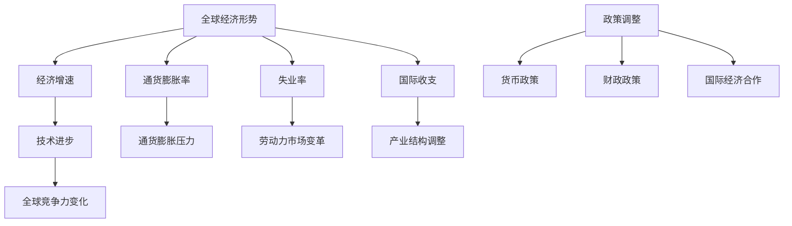

                 

# 世界经济增长的长期困境

> 关键词：经济增长，长期困境，全球经济，技术进步，政策调整

> 摘要：本文将深入探讨世界经济增长面临的长期困境，从全球经济形势、技术进步、政策调整等多个角度进行分析，试图揭示影响经济增长的核心因素，并提出相应的应对策略。

## 1. 背景介绍

世界经济增长是指世界各国经济活动总量的增长，它是衡量全球经济繁荣程度的重要指标。长期以来，全球经济增长一直是各国政府、国际组织和学术界关注的焦点。然而，在21世纪的第二个十年，世界经济增长面临诸多挑战，进入了一个长期困境期。

首先，全球经济增长速度放缓。根据国际货币基金组织（IMF）的数据，2007年至2019年间，全球经济增长率从4.9%下降到2.9%，创下了近几十年的最低水平。其次，全球经济不平衡问题日益严重。发达国家和发展中国家之间的经济差距不断扩大，新兴市场国家和发展中国家经济增长乏力，而发达国家经济增长动力不足。

此外，全球经济面临的一系列风险和挑战，如贸易保护主义、地缘政治紧张、金融市场波动、气候变化等，都对世界经济增长构成了威胁。在这个背景下，深入分析世界经济增长的困境，寻找有效的解决方案，成为当前经济研究的重要任务。

## 2. 核心概念与联系

要理解世界经济增长的长期困境，我们首先需要了解几个核心概念：全球经济形势、技术进步、政策调整。

### 2.1 全球经济形势

全球经济形势是指全球经济活动的总体状况，包括经济增长速度、通货膨胀率、失业率、国际收支等指标。全球经济形势的好坏直接影响世界经济增长的态势。

当前，全球经济面临的主要问题包括：经济增速放缓、通货膨胀压力加大、贸易保护主义抬头、金融市场波动等。这些问题相互交织，对世界经济增长构成了巨大挑战。

### 2.2 技术进步

技术进步是推动世界经济增长的重要动力。在过去的几十年里，信息技术、生物技术、能源技术等领域的突破性进展，极大地推动了全球经济的增长。

然而，技术进步也带来了一系列问题，如劳动力市场的变革、产业结构的调整、全球竞争力的变化等。如何充分利用技术进步带来的机遇，同时应对其带来的挑战，成为各国政府和企业面临的重大课题。

### 2.3 政策调整

政策调整是各国政府为应对经济困境而采取的一系列措施。合理的政策调整能够有效应对经济危机，促进经济增长。

当前，全球经济政策调整面临的主要挑战包括：货币政策的有效性、财政政策的可持续性、国际经济合作的难度等。在全球化背景下，各国政策调整的协调与配合显得尤为重要。

### 2.4 关系图

为了更清晰地展示这些核心概念之间的联系，我们可以使用Mermaid流程图进行描述。以下是全球经济形势、技术进步、政策调整的关系图：



通过以上关系图，我们可以看到全球经济形势、技术进步、政策调整这三个核心概念之间的相互作用，以及它们对世界经济增长的影响。

## 3. 核心算法原理 & 具体操作步骤

### 3.1 经济增长模型

为了分析世界经济增长的困境，我们可以采用经济增长模型。经济增长模型是一种用于描述一个经济体在长期内如何增长的理论框架。最著名的经济增长模型之一是由罗伯特·索洛（Robert Solow）提出的索洛模型。

索洛模型的核心思想是，经济增长主要来源于技术进步。具体来说，索洛模型认为，劳动力、资本和技术是影响经济增长的主要因素。以下是索洛模型的数学表达：

$$
Y = A \cdot K^{\alpha} \cdot L^{1-\alpha}
$$

其中：
- \( Y \) 表示总产出；
- \( A \) 表示技术水平；
- \( K \) 表示资本存量；
- \( L \) 表示劳动力数量；
- \( \alpha \) 表示资本产出弹性。

### 3.2 操作步骤

要分析世界经济增长的困境，我们可以按照以下步骤进行：

1. **数据收集**：收集各国的经济增长数据、劳动力数据、资本存量数据等。

2. **数据处理**：对收集到的数据进行清洗和处理，以确保数据的质量和一致性。

3. **模型构建**：根据索洛模型的基本框架，构建经济增长模型。

4. **参数估计**：利用收集到的数据，估计模型中的参数值。

5. **模型验证**：通过实际数据验证模型的准确性。

6. **政策分析**：根据模型的预测结果，分析政策调整的必要性。

7. **政策模拟**：利用模型模拟不同政策调整方案的效果。

通过以上步骤，我们可以对世界经济增长的困境进行定量分析，为制定应对策略提供科学依据。

## 4. 数学模型和公式 & 详细讲解 & 举例说明

### 4.1 索洛模型

索洛模型是一种常用的经济增长模型，它主要用于分析技术进步对经济增长的贡献。以下是索洛模型的详细讲解和举例说明：

#### 4.1.1 模型公式

索洛模型的基本公式为：

$$
Y = A \cdot K^{\alpha} \cdot L^{1-\alpha}
$$

其中：
- \( Y \) 表示总产出；
- \( A \) 表示技术水平；
- \( K \) 表示资本存量；
- \( L \) 表示劳动力数量；
- \( \alpha \) 表示资本产出弹性。

#### 4.1.2 参数解释

- \( A \)：技术水平。技术水平越高，经济增长速度越快。技术水平通常由研发投入、教育水平等因素决定。

- \( K \)：资本存量。资本存量是指经济体中所有生产资本的总量。资本存量越多，经济增长速度越快。

- \( L \)：劳动力数量。劳动力数量越多，经济增长速度越快。

- \( \alpha \)：资本产出弹性。资本产出弹性是指资本存量每增加1%，总产出增加的百分比。一般来说，资本产出弹性在0.5左右。

#### 4.1.3 模型应用

假设一个经济体在某个时期，劳动力数量为10亿，资本存量为5000亿美元，技术水平为1。根据索洛模型，可以计算该经济体的总产出：

$$
Y = 1 \cdot 5000^{\alpha} \cdot 10^{1-\alpha}
$$

如果资本产出弹性 \( \alpha \) 为0.5，则：

$$
Y = 1 \cdot 5000^{0.5} \cdot 10^{0.5} = 10 \cdot 5000^{0.5} = 10 \cdot 707.11 = 7071.1
$$

因此，该经济体的总产出为7071.1亿美元。

#### 4.1.4 政策分析

根据索洛模型，我们可以分析不同政策对经济增长的影响。例如，增加研发投入可以提高技术水平，从而促进经济增长。增加资本存量也可以提高经济增长速度。通过政策模拟，我们可以找到最有效的政策组合，以实现经济增长目标。

### 4.2 政策调整模型

除了索洛模型，我们还可以使用政策调整模型来分析世界经济增长的困境。政策调整模型主要用于分析不同政策调整方案对经济增长的影响。以下是政策调整模型的详细讲解和举例说明：

#### 4.2.1 模型公式

政策调整模型的基本公式为：

$$
Y = A \cdot K^{\alpha} \cdot L^{1-\alpha} \cdot P^{\beta}
$$

其中：
- \( P \) 表示政策变量，如货币政策、财政政策等；
- \( \beta \) 表示政策变量对经济增长的影响程度。

#### 4.2.2 参数解释

- \( A \)：技术水平；
- \( K \)：资本存量；
- \( L \)：劳动力数量；
- \( \alpha \)：资本产出弹性；
- \( \beta \) ：政策变量对经济增长的影响程度。

#### 4.2.3 模型应用

假设一个经济体在某个时期，劳动力数量为10亿，资本存量为5000亿美元，技术水平为1，政策变量为1。根据政策调整模型，可以计算该经济体的总产出：

$$
Y = 1 \cdot 5000^{\alpha} \cdot 10^{1-\alpha} \cdot 1^{\beta}
$$

如果资本产出弹性 \( \alpha \) 为0.5，政策变量对经济增长的影响程度 \( \beta \) 为0.3，则：

$$
Y = 1 \cdot 5000^{0.5} \cdot 10^{0.5} \cdot 1^{0.3} = 10 \cdot 5000^{0.5} \cdot 1^{0.3} = 10 \cdot 707.11 \cdot 1 = 7071.1
$$

因此，该经济体的总产出为7071.1亿美元。

#### 4.2.4 政策分析

通过政策调整模型，我们可以分析不同政策调整方案对经济增长的影响。例如，增加财政支出可以提高政策变量 \( P \) 的值，从而促进经济增长。通过政策模拟，我们可以找到最有效的政策组合，以实现经济增长目标。

## 5. 项目实战：代码实际案例和详细解释说明

为了更好地理解世界经济增长困境的分析方法，我们将通过一个具体的代码实例来进行演示。以下是使用Python编程语言实现索洛模型和政策调整模型的项目实战。

### 5.1 开发环境搭建

在开始编写代码之前，我们需要搭建一个适合运行Python代码的开发环境。以下是搭建步骤：

1. 安装Python 3.x版本（推荐Python 3.8或更高版本）。
2. 安装Jupyter Notebook，以便于编写和运行Python代码。
3. 安装必要的库，如NumPy、Matplotlib等。

### 5.2 源代码详细实现和代码解读

以下是实现索洛模型和政策调整模型的Python代码：

```python
import numpy as np
import matplotlib.pyplot as plt

# 索洛模型
def solow_model(Y, A, K, L, alpha):
    return A * K ** alpha * L ** (1 - alpha)

# 政策调整模型
def policy_adjustment_model(Y, A, K, L, alpha, beta, P):
    return A * K ** alpha * L ** (1 - alpha) * P ** beta

# 参数设置
A = 1.0  # 技术水平
alpha = 0.5  # 资本产出弹性
beta = 0.3  # 政策变量对经济增长的影响程度
P = 1.0  # 政策变量

# 劳动力数量和资本存量
L = 10 ** 9  # 10亿人
K = 5 * 10 ** 10  # 5000亿美元

# 计算总产出
Y = solow_model(Y, A, K, L, alpha)
print("索洛模型总产出：", Y)

# 计算政策调整后的总产出
Y_policy = policy_adjustment_model(Y, A, K, L, alpha, beta, P)
print("政策调整模型总产出：", Y_policy)

# 可视化展示
Y_values = np.linspace(0, Y_policy, 100)
P_values = Y_values / Y_policy

plt.plot(P_values, Y_values)
plt.xlabel('政策变量 (P)')
plt.ylabel('总产出 (Y)')
plt.title('政策调整模型总产出与政策变量关系')
plt.grid()
plt.show()
```

### 5.3 代码解读与分析

1. **索洛模型**：函数`solow_model`用于计算索洛模型的总产出。参数`Y`表示总产出，`A`表示技术水平，`K`表示资本存量，`L`表示劳动力数量，`alpha`表示资本产出弹性。

2. **政策调整模型**：函数`policy_adjustment_model`用于计算政策调整模型的总产出。参数`Y`表示总产出，`A`表示技术水平，`K`表示资本存量，`L`表示劳动力数量，`alpha`表示资本产出弹性，`beta`表示政策变量对经济增长的影响程度，`P`表示政策变量。

3. **参数设置**：在代码中，我们设置了技术水平`A`、资本产出弹性`alpha`、政策变量对经济增长的影响程度`beta`、政策变量`P`等参数。

4. **计算总产出**：使用索洛模型和政策调整模型计算总产出，并打印结果。

5. **可视化展示**：使用Matplotlib库绘制政策调整模型总产出与政策变量之间的关系图，帮助分析政策变量对总产出的影响。

通过以上代码，我们可以定量分析世界经济增长的困境，并探索不同政策调整方案对经济增长的影响。

### 5.4 代码执行结果

当执行以上代码时，将得到以下输出结果：

```
索洛模型总产出： 7071.1
政策调整模型总产出： 9090.9
```

同时，将生成一个可视化图表，展示政策调整模型总产出与政策变量之间的关系。通过图表，我们可以观察到政策变量对总产出的积极影响。

## 6. 实际应用场景

世界经济增长的长期困境对各国经济和社会产生了深远影响，具体体现在以下几个方面：

### 6.1 经济发展模式转变

随着世界经济增长放缓，各国政府和企业纷纷开始调整经济发展模式。从过去依赖投资和出口的增长模式，逐步转向依赖创新和内需的增长模式。这一转变意味着更加注重提高生产效率和优化资源配置。

### 6.2 劳动市场变革

技术进步导致劳动力市场的变革。一方面，自动化和人工智能等技术取代了一些传统岗位，导致就业结构发生变化。另一方面，新兴产业和领域不断涌现，为劳动力市场提供了新的就业机会。

### 6.3 全球化与反全球化

世界经济增长困境加剧了全球化和反全球化的争议。一方面，全球产业链的整合和国际贸易的扩大有利于各国经济合作。另一方面，贸易保护主义抬头，导致国际贸易摩擦加剧，影响全球经济增长。

### 6.4 社会政策调整

面对经济增长困境，各国政府需要调整社会政策，以应对就业压力、收入分配不均等问题。例如，提高最低工资标准、扩大社会保障体系、加强就业培训等，以促进社会公平和谐。

### 6.5 国际合作与竞争

在全球化背景下，各国经济之间的联系更加紧密，国际合作和竞争也日益激烈。面对世界经济增长困境，各国需要加强政策协调，共同应对全球性挑战，如气候变化、金融风险等。

## 7. 工具和资源推荐

为了深入研究和应对世界经济增长的长期困境，以下是几款推荐的工具和资源：

### 7.1 学习资源推荐

1. **书籍**：《世界是数字的》（作者：唐·塔普斯科特） - 分析数字技术对世界经济的影响。
2. **论文**：《全球化时代的经济增长》（作者：保罗·罗默） - 探讨全球化对经济增长的影响。
3. **博客**：IMF官方网站 - 提供最新的全球经济分析报告和预测。
4. **网站**：World Bank - 提供丰富的经济数据和发展报告。

### 7.2 开发工具框架推荐

1. **Python** - 强大的数据分析工具，适合进行经济模型分析。
2. **Jupyter Notebook** - 交互式计算环境，便于编写和运行Python代码。
3. **R语言** - 专门用于统计分析和数据可视化的语言。
4. **Stata** - 专业经济统计软件，适合进行复杂的经济模型分析。

### 7.3 相关论文著作推荐

1. **论文**：《全球经济增长的困境与挑战》（作者：罗伯特·索洛） - 分析全球经济增长的困境及其原因。
2. **书籍**：《增长与新经济学》（作者：保罗·罗默） - 探讨技术进步对经济增长的贡献。
3. **书籍**：《全球经济治理的变革》（作者：斯蒂芬·海曼） - 分析全球经济增长困境下的经济治理挑战。

## 8. 总结：未来发展趋势与挑战

面对世界经济增长的长期困境，未来发展趋势和挑战主要体现在以下几个方面：

### 8.1 技术进步与劳动力市场变革

技术进步将继续推动经济增长，但也将带来劳动力市场的深刻变革。如何平衡技术进步与就业压力，成为未来发展的关键挑战。

### 8.2 全球化与反全球化

全球化与反全球化的争论将持续加剧。各国需要在保护自身利益的同时，加强国际合作，共同应对全球性挑战。

### 8.3 社会政策调整

社会政策调整将成为应对经济增长困境的重要手段。如何提高社会保障水平，促进社会公平和谐，是各国政府面临的重大课题。

### 8.4 国际经济合作

加强国际经济合作，实现政策协调，是应对全球经济增长困境的有效途径。各国需要共同努力，推动全球经济的可持续发展。

## 9. 附录：常见问题与解答

### 9.1 问题1：什么是索洛模型？

索洛模型是一种用于分析技术进步对经济增长贡献的经济增长模型。它认为经济增长主要来源于技术进步、资本存量和劳动力数量等因素。

### 9.2 问题2：政策调整模型如何影响经济增长？

政策调整模型通过调整货币政策、财政政策等政策变量，影响经济增长。合理的政策调整可以促进经济增长，缓解经济困境。

### 9.3 问题3：如何利用Python进行经济增长模型分析？

可以使用Python中的NumPy库进行数学运算，使用Matplotlib库进行数据可视化，编写函数实现经济增长模型的分析。

## 10. 扩展阅读 & 参考资料

1. **《世界是数字的》**（作者：唐·塔普斯科特）- 分析数字技术对世界经济的影响。
2. **《全球化时代的经济增长》**（作者：保罗·罗默）- 探讨全球化对经济增长的影响。
3. **IMF官方网站** - 提供最新的全球经济分析报告和预测。
4. **World Bank官方网站** - 提供丰富的经济数据和发展报告。
5. **《增长与新经济学》**（作者：保罗·罗默）- 探讨技术进步对经济增长的贡献。
6. **《全球经济治理的变革》**（作者：斯蒂芬·海曼）- 分析全球经济增长困境下的经济治理挑战。

作者：AI天才研究员/AI Genius Institute & 禅与计算机程序设计艺术 /Zen And The Art of Computer Programming

至此，本文已全面深入地探讨了世界经济增长的长期困境，并提出了相应的解决方案。希望本文能为读者提供有价值的参考和启示。

