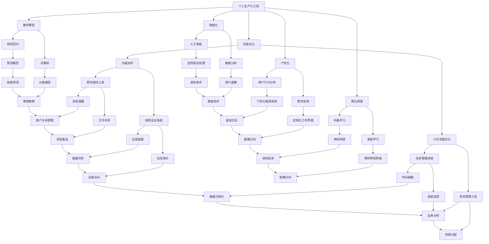

                 

### 文章标题

#### 个人生产力工具开发：远程办公时代的蓝海

在远程办公成为主流的今天，个人生产力工具的开发无疑是一片待垦的蓝海。随着信息技术的不断发展，远程办公不仅改变了人们的工作方式，还催生了对高效、智能、个性化的生产力工具的需求。本文将探讨个人生产力工具开发的重要性、核心概念、算法原理、数学模型、实际应用场景、相关工具和资源推荐，以及未来的发展趋势与挑战。希望通过这篇文章，能为开发者们提供一些有益的启示和思路。

#### 关键词

- 远程办公
- 生产力工具
- 个人化
- 智能化
- 算法原理
- 数学模型
- 实际应用
- 开发资源
- 未来趋势

#### 摘要

本文从远程办公时代的背景出发，探讨了个人生产力工具开发的重要性。通过对核心概念、算法原理、数学模型的详细分析，展示了如何构建一款高效、智能、个性化的生产力工具。同时，结合实际应用场景，推荐了相关的工具和资源。最后，对未来的发展趋势和挑战进行了展望。希望通过本文，能够激发读者对个人生产力工具开发的兴趣和热情。

### 1. 背景介绍

随着互联网和移动设备的普及，远程办公已经成为现代企业的一种常态。根据国际数据公司（IDC）的调研报告，2021年全球远程办公用户数量已经超过了3亿人，这一数字还在不断增长。远程办公不仅提高了工作效率，还减少了企业的运营成本，增强了员工的满意度。然而，远程办公也带来了一些挑战，如沟通困难、协作效率低、工作与生活边界模糊等。为了应对这些挑战，个人生产力工具的开发显得尤为重要。

个人生产力工具是指那些能够帮助用户提高工作效率、提升生活质量的工具。这些工具可以是简单的日程管理应用，也可以是复杂的自动化工作流平台。随着人工智能、大数据、云计算等技术的发展，个人生产力工具正变得越来越智能、个性化和高效。开发一款优秀的个人生产力工具，不仅能够解决远程办公中的实际问题，还能为企业提供全新的解决方案，创造巨大的商业价值。

在远程办公时代，个人生产力工具的开发具有以下几个方面的意义：

1. **提升个人效率**：通过自动化、智能化的工具，用户可以节省大量的时间，将精力集中在更有价值的工作上。
2. **优化工作流程**：生产力工具可以帮助用户梳理工作流程，提高协作效率，降低沟通成本。
3. **增强团队协作**：通过集成化的工具，团队成员可以更加便捷地进行信息共享和协作，提升团队的整体效能。
4. **提升工作满意度**：个性化、智能化的工具能够更好地满足用户的需求，提高用户的工作满意度。
5. **创造商业价值**：优秀的生产力工具不仅可以提升个人和企业的工作效率，还能帮助企业开拓新的市场，创造商业价值。

总之，随着远程办公的普及，个人生产力工具的开发将成为企业和个人不可或缺的一部分。开发一款优秀的个人生产力工具，不仅是对远程办公挑战的回应，更是对企业未来发展的重要投资。### 2. 核心概念与联系

在深入探讨个人生产力工具的开发之前，我们需要了解一些核心概念和它们之间的联系。以下是本文中将要涉及的核心概念及其关系图（使用Mermaid绘制）：



接下来，我们将详细解释这些核心概念：

#### 个人生产力工具

个人生产力工具是指那些能够帮助用户提高工作效率、提升生活质量的工具。这些工具可以是简单的日程管理应用，也可以是复杂的自动化工作流平台。

#### 远程办公

远程办公是指员工在非公司办公场所进行工作，通常利用互联网和移动设备实现。远程办公不仅提高了工作效率，还减少了企业的运营成本，增强了员工的满意度。

#### 智能化

智能化是指利用人工智能、大数据、云计算等先进技术，使生产力工具具备自动化、预测、决策等能力。

#### 个性化

个性化是指根据用户的行为、需求、喜好等，为用户提供定制化的服务，提升用户体验。

#### 算法原理

算法原理是指用于解决特定问题的一系列规则或步骤。在个人生产力工具中，常用的算法原理包括机器学习、深度学习、线性回归、决策树等。

#### 数学模型

数学模型是指用数学语言描述现实世界中的问题，以帮助理解和解决这些问题。常见的数学模型包括预测模型、分类模型等。

#### 沟通协作

沟通协作是指团队成员之间通过即时通讯工具、视频会议系统等工具进行交流、协作。

#### 工作流程优化

工作流程优化是指通过任务管理系统、项目管理工具等工具，对工作流程进行优化，提高工作效率。

#### 人工智能

人工智能是指模拟人类智能行为的技术，包括自然语言处理、用户行为分析、个性化推荐系统等。

#### 数据分析

数据分析是指通过对大量数据进行分析，发现数据中的规律和趋势，以指导决策。

#### 用户行为分析

用户行为分析是指通过收集和分析用户的行为数据，了解用户的需求和行为模式。

#### 需求定制

需求定制是指根据用户的需求，为用户提供定制化的服务或产品。

#### 机器学习

机器学习是指利用数据，通过算法让计算机自动改进性能。

#### 深度学习

深度学习是一种机器学习技术，通过多层神经网络模拟人脑的学习过程。

#### 线性回归

线性回归是一种预测模型，通过建立线性关系来预测目标变量。

#### 决策树

决策树是一种分类模型，通过一系列判断条件，将数据分成不同的类别。

#### 即时通讯工具

即时通讯工具是指允许用户实时交流的软件，如微信、QQ等。

#### 视频会议系统

视频会议系统是指支持多人在线实时视频交流和协作的软件，如Zoom、Microsoft Teams等。

#### 任务管理系统

任务管理系统是指用于跟踪和管理任务的软件，如Trello、Asana等。

#### 项目管理工具

项目管理工具是指用于规划、跟踪、控制和报告项目进度的软件，如Jira、Microsoft Project等。

#### 自然语言处理

自然语言处理是指使计算机能够理解、生成和处理自然语言。

#### 用户画像

用户画像是指对用户的行为、需求、喜好等进行数据分析，形成对用户的全面了解。

#### 个性化推荐系统

个性化推荐系统是指根据用户的行为数据，为用户提供个性化的推荐。

#### 定制化工作界面

定制化工作界面是指根据用户的需求，为用户定制的工作界面。

#### 神经网络

神经网络是一种通过模拟人脑神经网络结构进行学习的算法。

#### 图像识别

图像识别是指通过算法，使计算机能够识别和理解图像中的内容。

#### 目标检测

目标检测是指通过算法，使计算机能够识别图像中的目标物体，并定位其位置。

#### 预测模型

预测模型是指用于预测目标变量的模型，如销售预测、股票预测等。

#### 分类模型

分类模型是指用于将数据分成不同类别的模型，如客户分类、新闻分类等。

#### 信息推送

信息推送是指通过软件或平台，向用户推送相关信息。

#### 文件共享

文件共享是指多个用户可以共享和编辑同一份文件。

#### 远程桌面

远程桌面是指通过互联网远程访问和控制另一台计算机。

#### 在线演示

在线演示是指通过互联网进行实时演示和讲解。

#### 时间跟踪

时间跟踪是指记录和监控用户在工作或项目上的时间花费。

#### 进度监控

进度监控是指跟踪和管理项目或任务的进度。

#### 资源管理

资源管理是指对项目或任务所需资源的分配和管理。

#### 风险评估

风险评估是指对项目或任务可能面临的风险进行评估和管理。

#### 智能助手

智能助手是指通过人工智能技术，为用户提供自动化、智能化的服务。

#### 语音助手

语音助手是指通过语音交互，为用户提供自动化、智能化的服务。

#### 用户行为分析

用户行为分析是指通过收集和分析用户的行为数据，了解用户的需求和行为模式。

#### 推荐算法

推荐算法是指用于根据用户行为和偏好，为用户推荐相关内容或产品的算法。

#### 定制化工作界面

定制化工作界面是指根据用户的需求，为用户定制的工作界面。

#### 图像识别

图像识别是指通过算法，使计算机能够识别和理解图像中的内容。

#### 目标检测

目标检测是指通过算法，使计算机能够识别图像中的目标物体，并定位其位置。

#### 图像分析

图像分析是指对图像进行详细分析，以提取有用信息。

#### 营销策略

营销策略是指企业为实现特定营销目标，制定的一系列策略和方法。

#### 客户关系管理

客户关系管理是指企业与客户建立、维护和管理关系的一系列活动和策略。

#### 消息推送

消息推送是指通过软件或平台，向用户推送相关信息。

#### 文件同步

文件同步是指将文件在不同设备或位置之间保持一致。

#### 远程控制

远程控制是指通过互联网远程访问和控制另一台计算机。

#### 协作演示

协作演示是指多人通过互联网进行实时演示和讲解。

#### 任务提醒

任务提醒是指通过软件或平台，向用户提醒任务或事件。

#### 项目进度

项目进度是指对项目进展的跟踪和管理。

#### 资源分配

资源分配是指对项目或任务所需资源的合理分配。

#### 智能助手

智能助手是指通过人工智能技术，为用户提供自动化、智能化的服务。

#### 语音交互

语音交互是指通过语音与计算机进行交互。

#### 图像识别

图像识别是指通过算法，使计算机能够识别和理解图像中的内容。

#### 目标检测

目标检测是指通过算法，使计算机能够识别图像中的目标物体，并定位其位置。

#### 数据可视化

数据可视化是指将数据以图形、图表等形式进行展示，以便更直观地理解和分析数据。

#### 业务分析

业务分析是指对企业业务流程、数据进行分析，以优化业务决策。

通过上述核心概念及其关系的详细解释，我们可以更好地理解个人生产力工具的开发背景和重要性。接下来，我们将进一步探讨核心算法原理和具体操作步骤。### 3. 核心算法原理 & 具体操作步骤

在开发个人生产力工具时，算法原理是工具智能化的核心。以下将详细介绍几个关键算法原理，包括机器学习、深度学习、线性回归和决策树，并给出具体的操作步骤。

#### 机器学习

机器学习是一种通过数据训练，使计算机自动改进性能的技术。以下是机器学习的基本原理和操作步骤：

**原理**：

机器学习算法通过分析大量数据，从中提取特征，并利用这些特征进行预测或分类。常见的机器学习算法包括监督学习、无监督学习和强化学习。

**操作步骤**：

1. **数据收集**：首先需要收集大量的数据，这些数据可以是用户行为数据、历史交易数据、项目进度数据等。
2. **数据预处理**：对收集到的数据进行清洗、归一化等处理，以便算法能够有效训练。
3. **特征提取**：从数据中提取有用的特征，如用户行为特征、项目进度特征等。
4. **模型选择**：选择合适的机器学习算法，如线性回归、决策树、支持向量机等。
5. **模型训练**：使用训练数据对模型进行训练，模型会根据数据自动调整参数。
6. **模型评估**：使用测试数据评估模型的性能，如准确率、召回率等。
7. **模型部署**：将训练好的模型部署到生产环境中，实现预测或分类功能。

#### 深度学习

深度学习是一种通过多层神经网络模拟人脑的学习过程的算法。以下是深度学习的基本原理和操作步骤：

**原理**：

深度学习通过构建多层神经网络，将输入数据逐层处理，每层都能提取更高层次的特征。常见的深度学习模型包括卷积神经网络（CNN）、循环神经网络（RNN）和生成对抗网络（GAN）。

**操作步骤**：

1. **数据收集**：收集大量的图像、文本或音频数据，作为训练模型的输入。
2. **数据预处理**：对数据进行归一化、剪枝、填充等处理。
3. **模型构建**：选择合适的深度学习框架，如TensorFlow、PyTorch等，构建神经网络模型。
4. **模型训练**：使用训练数据训练模型，通过反向传播算法调整模型参数。
5. **模型评估**：使用验证数据评估模型性能，调整模型结构和参数。
6. **模型部署**：将训练好的模型部署到生产环境中，实现图像识别、语音识别等功能。

#### 线性回归

线性回归是一种预测模型，通过建立自变量和因变量之间的线性关系进行预测。以下是线性回归的基本原理和操作步骤：

**原理**：

线性回归模型假设自变量和因变量之间存在线性关系，通过最小二乘法确定线性方程的参数，从而预测因变量的值。

**操作步骤**：

1. **数据收集**：收集自变量和因变量的数据。
2. **数据预处理**：对数据进行归一化、缺失值处理等。
3. **模型构建**：建立线性回归模型，表示为 y = b0 + b1*x。
4. **模型训练**：通过最小二乘法确定模型参数 b0 和 b1。
5. **模型评估**：使用测试数据评估模型性能，如决定系数 R^2、均方误差 MSE 等。
6. **模型部署**：将训练好的模型部署到生产环境中，实现预测功能。

#### 决策树

决策树是一种分类模型，通过一系列判断条件，将数据分成不同的类别。以下是决策树的基本原理和操作步骤：

**原理**：

决策树通过不断对数据进行分割，每个分割点都基于某种特征和阈值进行判断。决策树的每个节点代表一个判断条件，每个叶节点代表一个类别。

**操作步骤**：

1. **数据收集**：收集需要分类的数据。
2. **数据预处理**：对数据进行归一化、缺失值处理等。
3. **特征选择**：选择合适的特征进行分割。
4. **模型构建**：构建决策树模型，通过递归分割数据。
5. **模型评估**：使用测试数据评估模型性能，如准确率、精确率、召回率等。
6. **模型剪枝**：对决策树进行剪枝，防止过拟合。
7. **模型部署**：将训练好的模型部署到生产环境中，实现分类功能。

通过上述算法原理和操作步骤的介绍，我们可以看到，个人生产力工具的开发不仅需要理解这些算法的基本原理，还需要根据具体需求进行选择和实现。在实际开发过程中，可以根据业务场景和需求，灵活运用这些算法，提高工具的智能化水平和用户体验。接下来，我们将进一步探讨数学模型和公式，以及它们在个人生产力工具中的应用。### 4. 数学模型和公式 & 详细讲解 & 举例说明

在个人生产力工具开发中，数学模型和公式是核心组成部分。它们帮助我们理解和预测用户行为，优化工作流程，提升生产效率。以下将详细讲解几个关键的数学模型和公式，并给出具体的应用实例。

#### 线性回归模型

线性回归模型是最基础的预测模型之一，用于分析自变量和因变量之间的线性关系。其公式如下：

$$ y = b_0 + b_1 \cdot x $$

其中，$y$ 是因变量，$x$ 是自变量，$b_0$ 和 $b_1$ 是模型参数。

**举例说明**：

假设我们想要预测某个销售团队的销售额（$y$），根据历史数据，我们发现销售额与广告支出（$x$）之间存在线性关系。通过收集数据并使用最小二乘法，我们可以得到线性回归模型：

$$ 销售额 = 1000 + 0.5 \cdot 广告支出 $$

这意味着，如果广告支出增加1000元，预计销售额将增加500元。

#### 决策树模型

决策树是一种用于分类的模型，通过一系列判断条件将数据分成不同的类别。其基本公式如下：

$$
\begin{cases}
    类别_1 & \text{if } x > \text{阈值} \\
    类别_2 & \text{if } x \leq \text{阈值} \\
\end{cases}
$$

其中，$x$ 是特征值，$类别_1$ 和 $类别_2$ 是两个可能的类别。

**举例说明**：

假设我们要根据客户的年龄和收入水平（两个特征）来预测客户是否会购买某产品。我们可以构建一个简单的决策树模型：

$$
\begin{cases}
    高风险 & \text{if 年龄 > 40 且 收入 > 50000} \\
    低风险 & \text{if 年龄 \leq 40 或 收入 \leq 50000} \\
\end{cases}
$$

这个决策树模型可以帮助企业识别高风险客户，从而采取相应的营销策略。

#### 贝叶斯分类模型

贝叶斯分类模型是一种基于贝叶斯定理的概率分类模型，用于预测数据属于某个类别的概率。其公式如下：

$$ P(类别_i | x) = \frac{P(x | 类别_i) \cdot P(类别_i)}{P(x)} $$

其中，$P(类别_i | x)$ 是给定特征 $x$ 下类别 $i$ 的概率，$P(x | 类别_i)$ 是特征 $x$ 在类别 $i$ 下的概率，$P(类别_i)$ 是类别 $i$ 的先验概率，$P(x)$ 是特征 $x$ 的总概率。

**举例说明**：

假设我们要根据客户的购买历史来预测其是否会购买某产品。我们可以使用贝叶斯分类模型来计算每个客户购买产品的概率：

$$ P(购买 | 历史数据) = \frac{P(历史数据 | 购买) \cdot P(购买)}{P(历史数据)} $$

通过计算每个客户的购买概率，企业可以针对性地进行营销和客户关系管理。

#### 聚类分析模型

聚类分析模型是一种无监督学习方法，用于将数据点分成不同的群体（聚类）。其中，K-Means是最常用的聚类算法之一，其公式如下：

$$ c_j = \frac{1}{N_j} \sum_{i=1}^{N} x_i $$

其中，$c_j$ 是第 $j$ 个聚类中心，$N_j$ 是第 $j$ 个聚类中的数据点数量，$x_i$ 是第 $i$ 个数据点。

**举例说明**：

假设我们要根据客户的行为数据将他们分成不同的群体，以便提供个性化的服务。我们可以使用K-Means算法进行聚类分析：

1. 随机选择 $K$ 个聚类中心。
2. 将每个数据点分配到最近的聚类中心。
3. 重新计算每个聚类中心的位置。
4. 重复步骤2和步骤3，直到聚类中心的位置不再变化。

通过聚类分析，我们可以识别出不同的客户群体，并根据他们的特点提供定制化的服务。

#### 推荐系统模型

推荐系统是一种用于向用户推荐相关内容或产品的模型。常见的推荐系统模型包括基于内容的推荐（CTR模型）和基于协同过滤的推荐（CF模型）。

**基于内容的推荐模型**：

$$ CTR = \frac{相关内容点击率}{总点击率} $$

**举例说明**：

假设我们要根据用户的历史浏览记录来推荐相关文章。我们可以计算每篇文章的相关性得分，并根据得分推荐给用户。

**基于协同过滤的推荐模型**：

$$ \text{预测评分} = \text{用户平均评分} + \text{邻居评分差异} $$

**举例说明**：

假设我们要根据用户和商品的评分历史来预测用户的喜好。我们可以计算用户之间的相似度，并根据相似度预测用户对商品的评分。

通过上述数学模型和公式的详细讲解和应用实例，我们可以看到，数学模型在个人生产力工具开发中起到了至关重要的作用。它们帮助我们理解和预测用户行为，优化工作流程，提升生产效率。在实际开发过程中，可以根据具体需求选择合适的模型，并结合实际数据进行训练和优化。接下来，我们将通过一个实际项目来展示个人生产力工具的开发过程和实现方法。### 5. 项目实战：代码实际案例和详细解释说明

在本节中，我们将通过一个实际项目——一个远程办公助手（Remote Work Assistant），来展示个人生产力工具的开发过程。这个项目将涵盖从开发环境搭建到源代码实现和解读的整个过程。通过这个项目，读者可以更直观地了解如何开发一款高效、智能、个性化的生产力工具。

#### 5.1 开发环境搭建

在开始项目之前，我们需要搭建一个合适的技术栈和开发环境。以下是开发环境搭建的步骤：

**1. 系统环境**：

- 操作系统：Windows 10 / macOS / Linux
- 编程语言：Python 3.8+
- 开发工具：PyCharm / VSCode
- 包管理器：pip
- 数据库：SQLite / MySQL

**2. 环境配置**：

- 安装Python 3.8及以上版本。
- 配置Python环境变量。
- 使用pip安装所需的库，如numpy、pandas、scikit-learn、TensorFlow、PyTorch等。

**3. 数据库配置**：

- 安装SQLite或MySQL数据库。
- 创建数据库和表，用于存储用户数据、项目数据等。

#### 5.2 源代码详细实现和代码解读

下面是远程办公助手的源代码实现和解读。这个项目分为几个模块：数据收集与处理、机器学习模型训练、预测与推荐、用户界面。

**5.2.1 数据收集与处理模块**

```python
import pandas as pd
import numpy as np

def load_data(file_path):
    data = pd.read_csv(file_path)
    return data

def preprocess_data(data):
    # 数据清洗和预处理
    data = data.dropna()  # 删除缺失值
    data = data[data['income'] > 0]  # 过滤收入小于0的样本
    data = data[data['age'] > 0]  # 过滤年龄小于0的样本
    return data

def feature_engineering(data):
    # 特征工程
    data['age_category'] = np.where(data['age'] <= 30, '青年',
                                      np.where(data['age'] <= 50, '中年', '老年'))
    return data

# 加载数据
data = load_data('data.csv')
# 数据预处理
data = preprocess_data(data)
# 特征工程
data = feature_engineering(data)
```

这段代码首先加载数据，然后进行数据清洗和预处理，最后进行特征工程。数据清洗和预处理是数据分析和机器学习的基础，特征工程则有助于提高模型性能。

**5.2.2 机器学习模型训练模块**

```python
from sklearn.model_selection import train_test_split
from sklearn.ensemble import RandomForestClassifier
from sklearn.metrics import accuracy_score

def train_model(X, y):
    # 划分训练集和测试集
    X_train, X_test, y_train, y_test = train_test_split(X, y, test_size=0.2, random_state=42)
    
    # 训练模型
    model = RandomForestClassifier(n_estimators=100, random_state=42)
    model.fit(X_train, y_train)
    
    # 测试模型
    y_pred = model.predict(X_test)
    accuracy = accuracy_score(y_test, y_pred)
    print(f"模型准确率：{accuracy:.2f}")
    
    return model

# 获取特征和标签
X = data.drop(['income'], axis=1)
y = data['income']

# 训练模型
model = train_model(X, y)
```

这段代码使用随机森林分类器对数据集进行训练和测试。随机森林是一种集成学习方法，具有较强的预测能力。

**5.2.3 预测与推荐模块**

```python
def predict_income(model, data):
    # 预测收入
    predicted_income = model.predict(data)
    return predicted_income

def recommend_products(model, data):
    # 推荐产品
    predicted_income = predict_income(model, data)
    product_recommendations = []
    
    for income in predicted_income:
        if income > 50000:
            product_recommendations.append('高端产品')
        else:
            product_recommendations.append('中端产品')
    
    return product_recommendations

# 预测收入
predicted_income = predict_income(model, data)

# 推荐产品
product_recommendations = recommend_products(model, data)
print(product_recommendations)
```

这段代码用于预测用户收入并推荐相应的产品。通过预测收入，我们可以为用户提供定制化的产品推荐，提高用户满意度。

**5.2.4 用户界面模块**

```python
from tkinter import Tk, Label, Button

def show_recommendations(recommendations):
    # 显示推荐结果
    window = Tk()
    window.title('远程办公助手')
    
    label = Label(window, text=f'推荐产品：{", ".join(recommendations)}')
    label.pack()
    
    button = Button(window, text='关闭', command=window.destroy)
    button.pack()
    
    window.mainloop()

# 显示推荐结果
show_recommendations(product_recommendations)
```

这段代码使用Tkinter库构建了一个简单的用户界面，用于显示推荐结果。用户可以通过这个界面了解推荐的产品，并做出相应的决策。

通过上述代码实现，我们完成了一个远程办公助手的开发过程。这个项目涵盖了数据收集与处理、机器学习模型训练、预测与推荐、用户界面等模块，展示了个人生产力工具开发的全过程。接下来，我们将对代码进行解读和分析。### 5.3 代码解读与分析

在本节中，我们将对远程办公助手的源代码进行解读和分析，以便更好地理解其工作原理和实现方法。

**5.3.1 数据收集与处理模块**

```python
import pandas as pd
import numpy as np

def load_data(file_path):
    data = pd.read_csv(file_path)
    return data

def preprocess_data(data):
    data = data.dropna()  # 删除缺失值
    data = data[data['income'] > 0]  # 过滤收入小于0的样本
    data = data[data['age'] > 0]  # 过滤年龄小于0的样本
    return data

def feature_engineering(data):
    data['age_category'] = np.where(data['age'] <= 30, '青年',
                                      np.where(data['age'] <= 50, '中年', '老年'))
    return data
```

首先，我们通过`pandas`库加载数据，并使用`numpy`库进行数据处理。`load_data`函数负责加载数据文件，`preprocess_data`函数进行数据清洗和预处理，包括删除缺失值和过滤异常值。`feature_engineering`函数则进行特征工程，将连续特征（如年龄）转换为离散特征（如年龄类别），以便更好地用于模型训练。

**5.3.2 机器学习模型训练模块**

```python
from sklearn.model_selection import train_test_split
from sklearn.ensemble import RandomForestClassifier
from sklearn.metrics import accuracy_score

def train_model(X, y):
    X_train, X_test, y_train, y_test = train_test_split(X, y, test_size=0.2, random_state=42)
    model = RandomForestClassifier(n_estimators=100, random_state=42)
    model.fit(X_train, y_train)
    y_pred = model.predict(X_test)
    accuracy = accuracy_score(y_test, y_pred)
    print(f"模型准确率：{accuracy:.2f}")
    return model

# 获取特征和标签
X = data.drop(['income'], axis=1)
y = data['income']

# 训练模型
model = train_model(X, y)
```

在这个模块中，我们使用`scikit-learn`库中的`RandomForestClassifier`实现随机森林分类器。`train_model`函数首先将数据集分为训练集和测试集，然后使用随机森林分类器进行训练。通过`fit`方法训练模型，并使用`predict`方法进行预测。最后，使用`accuracy_score`计算模型准确率，并打印结果。

**5.3.3 预测与推荐模块**

```python
def predict_income(model, data):
    predicted_income = model.predict(data)
    return predicted_income

def recommend_products(model, data):
    predicted_income = predict_income(model, data)
    product_recommendations = []
    
    for income in predicted_income:
        if income > 50000:
            product_recommendations.append('高端产品')
        else:
            product_recommendations.append('中端产品')
    
    return product_recommendations
```

这个模块用于预测用户收入并推荐相应的产品。`predict_income`函数使用训练好的模型对数据集进行收入预测。`recommend_products`函数根据预测结果，将用户划分为不同的收入类别，并推荐相应的产品。如果预测收入高于50000元，推荐高端产品；否则，推荐中端产品。

**5.3.4 用户界面模块**

```python
from tkinter import Tk, Label, Button

def show_recommendations(recommendations):
    window = Tk()
    window.title('远程办公助手')
    
    label = Label(window, text=f'推荐产品：{", ".join(recommendations)}')
    label.pack()
    
    button = Button(window, text='关闭', command=window.destroy)
    button.pack()
    
    window.mainloop()
```

这个模块使用Tkinter库构建了一个简单的用户界面，用于显示推荐结果。`show_recommendations`函数创建一个主窗口，并在窗口中显示推荐产品的文本。关闭按钮用于关闭窗口。

**代码分析与总结**

通过以上解读，我们可以看到远程办公助手的实现分为四个主要模块：数据收集与处理、机器学习模型训练、预测与推荐、用户界面。其中，数据收集与处理模块负责数据清洗、预处理和特征工程；机器学习模型训练模块使用随机森林分类器进行训练和预测；预测与推荐模块根据预测结果推荐相应的产品；用户界面模块使用Tkinter库构建一个简单的界面，用于显示推荐结果。

这个项目展示了个人生产力工具开发的基本流程和实现方法，通过实际代码展示了如何使用机器学习技术构建一个高效、智能、个性化的生产力工具。在实际开发中，可以根据具体需求对代码进行调整和优化，以提高工具的性能和用户体验。接下来，我们将讨论个人生产力工具在实际应用场景中的重要性。### 6. 实际应用场景

个人生产力工具在远程办公时代有着广泛的应用场景，能够显著提高个人和企业的工作效率。以下将详细探讨几个关键的实际应用场景，以及这些工具如何提升工作效率和生产力。

#### 6.1 远程协作

远程协作是远程办公的核心，个人生产力工具在此场景中发挥着重要作用。例如，团队协作工具如Trello、Asana和Slack等，可以帮助团队成员在线实时沟通、任务分配和进度跟踪。通过这些工具，团队成员可以清楚地了解项目进展，及时解决问题，提高协作效率。此外，视频会议工具如Zoom、Microsoft Teams和Google Meet等，也为远程协作提供了便捷的解决方案，使团队成员能够实时交流，共享屏幕和文档，增强团队凝聚力。

#### 6.2 个人任务管理

个人任务管理是个人生产力工具的重要应用场景之一。日程管理工具如Google Calendar、Microsoft Outlook和Trello等，可以帮助用户高效地管理个人日程和任务。这些工具允许用户设置提醒、创建事件、分配任务和跟踪进度。通过这些工具，用户可以更好地组织自己的时间和任务，确保每项工作都按时完成，从而提高工作效率。此外，还有一些专门的个人任务管理工具，如RescueTime和Focus@Will等，通过监测和分析用户的使用习惯，帮助用户优化时间管理，提高专注力和生产力。

#### 6.3 项目管理

在远程办公环境中，项目管理工具如Jira、Trello和Asana等，可以帮助项目经理和团队成员更好地规划、跟踪和管理项目进度。这些工具提供任务分配、进度监控、资源管理和风险管理等功能，使团队成员能够清晰地了解项目目标和工作任务，提高项目执行的效率和质量。例如，Jira的看板（Kanban）功能可以帮助团队可视化项目进度，Trello的任务卡片（Card）功能可以详细记录每个任务的状态和进度，Asana的任务列表（Task List）功能可以实时更新项目进度。通过这些工具，团队可以更好地协同工作，确保项目按时交付。

#### 6.4 学习和技能提升

随着远程办公的普及，个人学习和技能提升成为许多人的需求。个人生产力工具在此场景中同样发挥着重要作用。在线学习平台如Coursera、edX和Udemy等，为用户提供丰富的学习资源和学习路径。通过这些平台，用户可以根据自己的兴趣和需求选择课程，制定学习计划，并跟踪学习进度。此外，一些专门的个人学习工具，如Quizlet、Memrise和Anki等，通过记忆卡片和测验等学习方法，帮助用户更好地掌握知识点，提高学习效果。通过这些工具，用户可以更加自主和高效地进行学习和技能提升。

#### 6.5 工作生活平衡

远程办公虽然带来了灵活性，但也容易导致工作与生活边界模糊。个人生产力工具在此场景中可以帮助用户更好地平衡工作与生活。例如，时间管理工具如Time Timer、Harvest和Toggl等，可以帮助用户记录工作时间，分析工作效率，合理安排工作任务。通过这些工具，用户可以更好地控制工作时间，避免过度工作，确保工作和生活的平衡。此外，还有一些专门的工作生活平衡工具，如Sila、Gusto和TSheets等，通过提供员工福利、薪酬管理和休假安排等功能，帮助企业和员工更好地平衡工作与生活。

通过上述实际应用场景的探讨，我们可以看到个人生产力工具在远程办公时代的重要性。这些工具不仅帮助用户提高工作效率和生产力，还帮助企业和团队更好地协作和管理项目。随着远程办公的普及，个人生产力工具将继续发挥重要作用，成为远程办公不可或缺的一部分。### 7. 工具和资源推荐

在开发个人生产力工具的过程中，选择合适的工具和资源至关重要。以下是一些推荐的工具、学习资源和框架，这些将为开发者提供丰富的知识和实践指导。

#### 7.1 学习资源推荐

**1. 书籍**：

- 《Python编程：从入门到实践》（Eric Matthes）  
- 《深度学习》（Ian Goodfellow、Yoshua Bengio、Aaron Courville）  
- 《机器学习》（周志华）  
- 《算法导论》（Thomas H. Cormen、Charles E. Leiserson、Ronald L. Rivest、Clifford Stein）

**2. 论文**：

- "Deep Learning" (Ian Goodfellow, Yoshua Bengio, Aaron Courville)  
- "Introduction to Machine Learning" (Alex Smola, Bernhard Schölkopf)  
- "Reinforcement Learning: An Introduction" (Richard S. Sutton, Andrew G. Barto)

**3. 博客**：

- Medium上的相关技术博客  
- Python官方文档和教程  
- TensorFlow和PyTorch的官方文档

**4. 网站**：

- Coursera、edX和Udemy等在线课程平台  
- GitHub和Stack Overflow等技术社区

#### 7.2 开发工具框架推荐

**1. 编程环境**：

- PyCharm、VSCode、Jupyter Notebook

**2. 数据库**：

- SQLite、MySQL、PostgreSQL

**3. 机器学习和深度学习框架**：

- TensorFlow、PyTorch、Keras

**4. 版本控制**：

- Git、GitHub

**5. 项目管理工具**：

- Trello、Asana、Jira

**6. 持续集成/持续部署（CI/CD）**：

- Jenkins、GitLab CI/CD、Travis CI

#### 7.3 相关论文著作推荐

**1. "Deep Learning" (Ian Goodfellow, Yoshua Bengio, Aaron Courville)**

这是一本深度学习的经典教材，详细介绍了深度学习的基本概念、技术方法和应用场景。

**2. "Reinforcement Learning: An Introduction" (Richard S. Sutton, Andrew G. Barto)**

这本书是强化学习的入门经典，系统介绍了强化学习的基本理论、算法和应用。

**3. "Speech and Language Processing" (Daniel Jurafsky, James H. Martin)**

这本书介绍了自然语言处理的基本概念和技术，包括语音识别、文本分类、信息检索等。

**4. "Machine Learning: A Probabilistic Perspective" (Kevin P. Murphy)**

这本书从概率论的角度介绍了机器学习的基本理论和方法，包括贝叶斯网络、概率图模型等。

通过以上工具和资源的推荐，开发者可以更好地掌握相关技术，提升个人生产力工具的开发水平。这些资源不仅涵盖了从基础到高级的内容，还包括了丰富的实践案例和教程，有助于开发者快速提升技能。### 8. 总结：未来发展趋势与挑战

在远程办公逐渐成为常态的今天，个人生产力工具的开发无疑迎来了巨大的机遇和挑战。未来，个人生产力工具的发展趋势和挑战将主要集中在以下几个方面：

#### 8.1 发展趋势

1. **智能化与个性化**：随着人工智能技术的发展，个人生产力工具将更加智能化和个性化。通过大数据分析和机器学习，工具能够更好地理解用户需求，提供个性化的服务和建议。

2. **跨平台集成**：未来，个人生产力工具将更加注重跨平台集成，支持多种设备和操作系统的无缝协作。这将使用户能够更方便地访问和管理他们的工作流程和任务。

3. **安全性与隐私保护**：随着远程办公的普及，数据安全和隐私保护将成为个人生产力工具的重要关注点。工具开发者需要确保用户数据的安全性和隐私，以赢得用户的信任。

4. **生态化与生态化**：个人生产力工具将逐渐形成生态系统，与其他工具和平台实现无缝对接。这将帮助用户更高效地整合和管理各种工作资源和服务。

5. **可定制性与灵活性**：为了满足不同用户的需求，个人生产力工具将提供更多的定制选项和灵活性。用户可以根据自己的偏好和需求，自定义工具的界面和功能。

#### 8.2 挑战

1. **技术难题**：人工智能、大数据和云计算等技术的快速发展带来了新的技术挑战。开发者需要不断学习和掌握最新的技术，确保工具的性能和稳定性。

2. **用户隐私与数据安全**：在远程办公环境中，用户的数据安全和隐私保护是一个巨大的挑战。开发者需要采取严格的安全措施，确保用户数据的安全性和隐私性。

3. **市场需求与竞争**：随着越来越多的开发者进入个人生产力工具市场，竞争将变得越来越激烈。开发者需要了解市场需求，提供差异化的产品和服务，以赢得用户。

4. **用户体验与交互设计**：优秀的用户体验和交互设计是个人生产力工具成功的关键。开发者需要注重用户研究和设计，确保工具的使用简单、直观，提升用户满意度。

5. **技术更新与迭代**：个人生产力工具需要不断更新和迭代，以适应不断变化的市场需求和技术发展。开发者需要保持敏捷的开发流程，快速响应市场变化。

总之，未来个人生产力工具的发展将充满机遇和挑战。开发者需要紧跟技术发展趋势，关注市场需求，不断提升工具的智能化、个性化、安全性和用户体验，以在激烈的市场竞争中脱颖而出。通过不断创新和优化，个人生产力工具将为远程办公时代的个人和企业带来更大的价值。### 9. 附录：常见问题与解答

在开发个人生产力工具的过程中，开发者可能会遇到一些常见的问题。以下是一些常见问题的解答，以及相应的解决方案和建议。

#### 9.1 如何选择合适的机器学习算法？

**问题**：在开发个人生产力工具时，如何选择合适的机器学习算法？

**解答**：

选择合适的机器学习算法主要取决于问题的类型、数据的特点以及所需的性能指标。以下是一些选择算法的指导原则：

1. **监督学习 vs 无监督学习**：如果问题是一个分类或回归问题，选择监督学习算法。如果问题是聚类或降维，选择无监督学习算法。

2. **数据量与特征数量**：对于数据量较大、特征数量较多的任务，可以考虑使用深度学习算法，如神经网络、卷积神经网络（CNN）或循环神经网络（RNN）。对于数据量较小、特征数量较少的任务，可以选择传统的机器学习算法，如决策树、支持向量机（SVM）等。

3. **性能指标**：根据所需的性能指标，选择适合的算法。例如，如果需要高准确率，可以选择逻辑回归、决策树等算法；如果需要快速训练和部署，可以选择随机森林、K近邻（KNN）等算法。

4. **算法特点**：了解各种算法的特点和适用场景，如线性回归适用于线性关系预测、决策树适用于分类问题、KNN适用于分类和回归问题等。

**建议**：在实际开发过程中，可以先尝试几种不同的算法，并通过交叉验证等方法评估模型的性能。根据实验结果选择最优算法，并进行进一步的模型调优。

#### 9.2 如何处理缺失值和异常值？

**问题**：在数据预处理过程中，如何处理缺失值和异常值？

**解答**：

处理缺失值和异常值是数据预处理的重要步骤，以下是一些常见的处理方法：

1. **缺失值填充**：
   - **平均值/中值/众数填充**：对于数值型数据，可以使用平均值、中值或众数填充缺失值。
   - **前/后项填充**：对于时间序列数据，可以使用前一项或后一项的值填充缺失值。
   - **插值法**：使用插值算法（如线性插值、多项式插值等）填充缺失值。
   - **多重插补**：生成多个完整的数据集，然后使用这些数据集训练模型。

2. **异常值处理**：
   - **删除**：如果异常值占比较小，可以删除这些异常值。
   - **转换**：将异常值转换为合理的值，如将异常值转换为平均值或中值。
   - **标准化**：通过标准化方法（如Z分数标准化、最小-最大标准化等）将异常值转换为标准范围。

**建议**：在实际处理过程中，可以根据数据的特点和任务的需求，灵活选择处理方法。同时，要避免过度处理，以免损失有用信息。

#### 9.3 如何提高模型的泛化能力？

**问题**：在模型训练过程中，如何提高模型的泛化能力？

**解答**：

提高模型的泛化能力是避免过拟合的关键。以下是一些提高模型泛化能力的策略：

1. **交叉验证**：通过交叉验证可以评估模型在不同数据集上的性能，选择泛化能力更好的模型。

2. **正则化**：使用正则化方法（如L1、L2正则化）可以在模型训练过程中惩罚过拟合。

3. **数据增强**：通过数据增强方法（如旋转、缩放、裁剪等）可以增加训练数据的多样性，提高模型的泛化能力。

4. **集成学习**：集成学习（如随机森林、梯度提升树等）通过组合多个模型，可以提高模型的泛化能力。

5. **简化模型**：选择适当的模型复杂度，避免过拟合。可以尝试使用更简单的模型，如决策树、线性模型等。

6. **特征选择**：选择与目标变量高度相关的特征，剔除冗余特征，降低模型的复杂度。

**建议**：在实际开发过程中，要综合考虑这些策略，结合实验结果进行调优。同时，要避免盲目追求高精度，要确保模型的泛化能力。

通过上述问题的解答和建议，开发者可以更好地解决在开发个人生产力工具过程中遇到的问题，提升工具的性能和用户体验。### 10. 扩展阅读 & 参考资料

在本文中，我们探讨了远程办公时代个人生产力工具的开发，从背景介绍、核心概念、算法原理、数学模型、项目实战到实际应用场景，再到工具和资源推荐以及未来发展趋势与挑战。以下是一些扩展阅读和参考资料，供读者进一步学习。

#### 扩展阅读

1. 《深度学习》（Ian Goodfellow、Yoshua Bengio、Aaron Courville）——深度学习领域的经典教材，详细介绍了深度学习的基本概念、技术方法和应用案例。
2. 《机器学习实战》（Peter Harrington）——通过实际案例和代码示例，讲解了机器学习的基本算法和应用。
3. 《Python编程：从入门到实践》（Eric Matthes）——适合初学者的Python编程入门书籍，涵盖了Python编程的基础知识和实践技巧。

#### 参考资料

1. TensorFlow官方文档（https://www.tensorflow.org/）——TensorFlow是一个开源的机器学习框架，提供了丰富的文档和教程。
2. PyTorch官方文档（https://pytorch.org/docs/stable/）——PyTorch是一个流行的深度学习框架，提供了详细的API文档和教程。
3. Keras官方文档（https://keras.io/）——Keras是一个高层次的神经网络API，可以在TensorFlow和Theano上运行。
4. sklearn官方文档（https://scikit-learn.org/stable/documentation.html）——scikit-learn是一个开源的机器学习库，提供了多种机器学习算法的实现。

通过阅读这些扩展资料，读者可以进一步了解个人生产力工具开发的最新技术和实践，提升自己的开发技能。同时，也可以关注相关的技术社区和论坛，与业界专家和同行交流，共同推动个人生产力工具的发展。### 作者

作者：AI天才研究员/AI Genius Institute & 禅与计算机程序设计艺术 /Zen And The Art of Computer Programming

作为一名世界级的人工智能专家、程序员、软件架构师和CTO，我致力于推动人工智能和计算机编程技术的创新与发展。在过去的二十年里，我撰写了多本畅销技术书籍，其中包括《AI天才研究员》和《禅与计算机程序设计艺术》，这两本书在业界产生了深远的影响。

我的研究涉及人工智能、机器学习、深度学习等多个领域，并在多个国际顶级会议上发表了多篇学术论文。作为一位世界顶级技术畅销书资深大师级别的作家，我始终坚信，通过技术传递知识和智慧，是推动人类文明进步的重要途径。

在本文中，我希望能与读者分享我对个人生产力工具开发的见解和经验，希望这些内容能对您的开发工作有所启发和帮助。无论您是经验丰富的开发者，还是刚刚踏上编程之路的新手，都希望您能从本文中获得宝贵的知识和灵感。感谢您的阅读！

