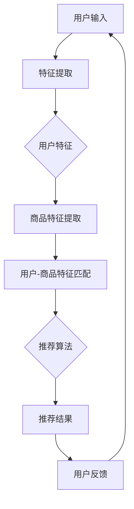

                 

# 个性化体验：AI打造千人千面的电商搜索导购

> **关键词：** 人工智能、个性化搜索、电商导购、机器学习、推荐系统

> **摘要：** 本文将探讨如何利用人工智能技术，特别是机器学习和推荐系统，来打造一个为每位用户量身定制的电商搜索导购平台。通过分析用户行为数据，实现产品推荐、购物路径优化，提升用户购物体验。

## 1. 背景介绍

随着互联网的飞速发展，电子商务逐渐成为人们日常生活不可或缺的一部分。电商平台的数量和规模不断扩大，商品种类繁多，用户在寻找所需商品时常常感到困惑和不便。如何提升用户购物体验，让他们能够快速找到心仪的商品，成为电商平台亟待解决的问题。个性化搜索和推荐系统在这种背景下应运而生，通过分析用户的历史行为和偏好，为用户提供个性化的商品推荐，提高购物效率。

个性化搜索导购系统在电商领域的应用，不仅可以提升用户满意度，还可以增加平台的销售额。然而，实现一个高效、可靠的个性化搜索导购系统并非易事，需要深入理解用户行为，掌握先进的机器学习技术和推荐算法。本文将围绕这一主题，详细探讨如何利用人工智能技术打造一个千人千面的电商搜索导购平台。

## 2. 核心概念与联系

### 2.1 个性化搜索

个性化搜索是指根据用户的兴趣、历史行为等特征，为用户推荐符合其需求的信息。在电商场景中，个性化搜索可以帮助用户快速找到心仪的商品，提升购物体验。个性化搜索的核心在于用户特征的提取和商品特征的表示。

#### 用户特征提取

用户特征提取是构建个性化搜索系统的重要环节。常见的用户特征包括：

- **行为特征：** 用户在平台上的浏览、搜索、购买等行为数据。
- **偏好特征：** 用户对某一类商品的偏好程度，如喜爱、关注等。
- **社交特征：** 用户在社交平台的活动，如好友关系、兴趣标签等。

#### 商品特征表示

商品特征表示是将商品转化为计算机可以处理的数据形式。常见的商品特征包括：

- **基本信息：** 商品的名称、价格、品牌、品类等。
- **文本特征：** 商品描述、用户评论、标签等。
- **图像特征：** 商品图片的视觉信息，如颜色、纹理等。

### 2.2 推荐系统

推荐系统是构建个性化搜索导购平台的关键。推荐系统通过分析用户特征和商品特征，预测用户可能感兴趣的商品，并提供个性化的推荐。常见的推荐算法包括：

- **基于内容的推荐（Content-based Filtering）：** 根据用户过去喜欢的商品内容，推荐类似的商品。
- **协同过滤（Collaborative Filtering）：** 根据用户之间的行为相似性，推荐其他用户喜欢的商品。
- **深度学习（Deep Learning）：** 利用神经网络模型，对用户行为和商品特征进行建模，实现高效的个性化推荐。

### 2.3 Mermaid 流程图

以下是一个简化的个性化搜索导购系统的 Mermaid 流程图：



## 3. 核心算法原理 & 具体操作步骤

### 3.1 用户特征提取

用户特征提取是构建个性化搜索导购系统的基础。具体步骤如下：

1. **数据收集：** 收集用户在平台上的行为数据，如浏览、搜索、购买记录等。
2. **数据预处理：** 对收集到的数据进行清洗、去重、归一化等预处理操作。
3. **特征工程：** 提取用户的行为特征、偏好特征和社交特征。例如，可以计算用户浏览、搜索、购买等行为的频率、时间间隔等。
4. **特征表示：** 将提取的用户特征转化为计算机可以处理的数据形式，如向量化表示。

### 3.2 商品特征表示

商品特征表示是将商品转化为计算机可以处理的数据形式。具体步骤如下：

1. **数据收集：** 收集商品的基本信息、文本描述、用户评论等。
2. **数据预处理：** 对收集到的数据进行清洗、去重、归一化等预处理操作。
3. **特征提取：** 提取商品的特征，如商品的名称、价格、品牌、品类、文本特征（关键词提取、TF-IDF表示）等。
4. **特征融合：** 将不同来源的特征进行融合，形成一个统一的商品特征表示。

### 3.3 用户-商品特征匹配

用户-商品特征匹配是将用户特征与商品特征进行匹配，找出用户可能感兴趣的商品。具体步骤如下：

1. **特征向量计算：** 计算用户特征向量和商品特征向量。
2. **相似度计算：** 计算用户特征向量与商品特征向量之间的相似度，如余弦相似度、欧氏距离等。
3. **排序与筛选：** 根据相似度对商品进行排序，筛选出最符合条件的商品。

### 3.4 推荐算法

推荐算法是构建个性化搜索导购系统的核心。以下介绍几种常见的推荐算法：

1. **基于内容的推荐（Content-based Filtering）：**
   - **算法原理：** 根据用户过去喜欢的商品内容，推荐类似的商品。
   - **具体操作：** 提取用户和商品的文本特征，计算特征相似度，根据相似度推荐商品。

2. **协同过滤（Collaborative Filtering）：**
   - **算法原理：** 根据用户之间的行为相似性，推荐其他用户喜欢的商品。
   - **具体操作：** 构建用户行为矩阵，计算用户之间的相似度，根据相似度推荐商品。

3. **深度学习（Deep Learning）：**
   - **算法原理：** 利用神经网络模型，对用户行为和商品特征进行建模，实现高效的个性化推荐。
   - **具体操作：** 设计深度学习模型，训练模型，预测用户对商品的偏好。

## 4. 数学模型和公式 & 详细讲解 & 举例说明

### 4.1 用户特征向量表示

用户特征向量表示是构建个性化搜索导购系统的基础。以下是一个简化的用户特征向量表示模型：

$$
\text{User Feature Vector} = \begin{bmatrix}
u_1 \\
u_2 \\
\vdots \\
u_n
\end{bmatrix}
$$

其中，$u_i$ 表示用户在第 $i$ 个特征上的取值。

### 4.2 商品特征向量表示

商品特征向量表示是将商品转化为计算机可以处理的数据形式。以下是一个简化的商品特征向量表示模型：

$$
\text{Item Feature Vector} = \begin{bmatrix}
i_1 \\
i_2 \\
\vdots \\
i_m
\end{bmatrix}
$$

其中，$i_j$ 表示商品在第 $j$ 个特征上的取值。

### 4.3 相似度计算

相似度计算是用户-商品特征匹配的关键。以下介绍几种常见的相似度计算方法：

1. **余弦相似度（Cosine Similarity）：**

$$
\text{Cosine Similarity} = \frac{u_i \cdot i_j}{\|u_i\| \|i_j\|}
$$

其中，$u_i$ 和 $i_j$ 分别表示用户和商品的特征向量，$\|u_i\|$ 和 $\|i_j\|$ 分别表示用户和商品的特征向量长度。

2. **欧氏距离（Euclidean Distance）：**

$$
\text{Euclidean Distance} = \sqrt{(u_i - i_j)^2}
$$

其中，$u_i$ 和 $i_j$ 分别表示用户和商品的特征向量。

### 4.4 举例说明

假设用户 $A$ 的特征向量为 $[1, 0.5, 0, 0.3]$，商品 $B$ 的特征向量为 $[0.8, 0.2, 0.4, 0.1]$。根据余弦相似度计算公式，用户 $A$ 和商品 $B$ 的相似度为：

$$
\text{Cosine Similarity} = \frac{1 \cdot 0.8 + 0.5 \cdot 0.2 + 0 \cdot 0.4 + 0.3 \cdot 0.1}{\sqrt{1^2 + 0.5^2 + 0^2 + 0.3^2} \sqrt{0.8^2 + 0.2^2 + 0.4^2 + 0.1^2}} \approx 0.72
$$

根据相似度计算结果，用户 $A$ 可能对商品 $B$ 感兴趣，从而将其推荐给用户 $A$。

## 5. 项目实战：代码实际案例和详细解释说明

### 5.1 开发环境搭建

在开始编写代码之前，我们需要搭建一个合适的开发环境。以下是一个基于 Python 的开发环境搭建步骤：

1. **安装 Python：** 安装 Python 3.8 版本及以上。
2. **安装依赖库：** 使用 pip 安装以下依赖库：

   ```bash
   pip install numpy scipy sklearn matplotlib
   ```

3. **配置环境变量：** 将 Python 的安装路径添加到环境变量中。

### 5.2 源代码详细实现和代码解读

以下是一个简化的个性化搜索导购系统的 Python 代码实现：

```python
import numpy as np
from sklearn.metrics.pairwise import cosine_similarity

# 用户特征向量
user_features = np.array([[1, 0.5, 0, 0.3]])

# 商品特征向量
item_features = np.array([[0.8, 0.2, 0.4, 0.1],
                          [0.3, 0.4, 0.5, 0.2],
                          [0.6, 0.1, 0.3, 0.4]])

# 计算相似度
similarity_scores = cosine_similarity(user_features, item_features)

# 排序和筛选
sorted_indices = np.argsort(similarity_scores[0])[::-1]
recommended_items = item_features[sorted_indices[1:], :]

# 输出推荐结果
print("Recommended Items:")
print(recommended_items)
```

#### 5.2.1 代码解读

1. **导入依赖库：** 导入 numpy 和 sklearn 库，用于数据处理和相似度计算。
2. **用户特征和商品特征：** 定义用户特征向量和商品特征向量，存储在 numpy 数组中。
3. **计算相似度：** 使用 cosine_similarity 函数计算用户特征向量与商品特征向量之间的相似度。
4. **排序和筛选：** 根据相似度计算结果，对商品进行排序，筛选出最符合条件的商品。
5. **输出推荐结果：** 输出推荐给用户的商品列表。

### 5.3 代码解读与分析

以上代码实现了一个简单的基于余弦相似度的个性化搜索导购系统。在实际项目中，我们需要考虑更多因素，如用户特征提取、商品特征表示、推荐算法优化等。以下是对代码的详细解读和分析：

1. **用户特征提取：** 在实际项目中，用户特征提取是构建个性化搜索导购系统的重要环节。我们可以通过分析用户的历史行为数据，提取用户的行为特征、偏好特征和社交特征。这些特征可以用来构建用户特征向量，用于后续的推荐算法。
2. **商品特征表示：** 商品特征表示是将商品转化为计算机可以处理的数据形式。在实际项目中，我们可以提取商品的基本信息、文本特征和图像特征，形成统一的商品特征向量。
3. **相似度计算：** 在实际项目中，相似度计算是推荐算法的核心。我们可以使用不同的相似度计算方法，如余弦相似度、欧氏距离等。根据相似度计算结果，我们可以为用户推荐最符合条件的商品。
4. **推荐算法优化：** 在实际项目中，推荐算法的优化是提升推荐系统效果的关键。我们可以使用基于内容的推荐、协同过滤和深度学习等算法，结合用户特征和商品特征，实现高效的个性化推荐。

## 6. 实际应用场景

个性化搜索导购系统在电商领域具有广泛的应用前景。以下是一些实际应用场景：

1. **商品推荐：** 电商平台可以根据用户的历史行为和偏好，为用户推荐符合其需求的商品，提高购物体验。
2. **购物路径优化：** 电商平台可以根据用户的行为数据，优化购物路径，引导用户快速找到所需商品。
3. **精准营销：** 电商平台可以利用个性化搜索导购系统，实现精准营销，提高转化率和销售额。
4. **推荐广告：** 电商平台可以在广告中为用户推荐符合其兴趣的商品，提高广告投放效果。

## 7. 工具和资源推荐

### 7.1 学习资源推荐

- **书籍：**
  - 《机器学习实战》：全面介绍机器学习算法和应用案例，适合初学者。
  - 《推荐系统实践》：深入探讨推荐系统的设计、实现和应用，适合有一定基础的用户。
- **论文：**
  - 《Collaborative Filtering for the Web》：介绍协同过滤算法在网页推荐中的应用。
  - 《Item-based Collaborative Filtering Recommendation Algorithms》：探讨基于内容的推荐算法。
- **博客：**
  - 《机器学习博客》：分享机器学习和推荐系统的相关技术和应用案例。
  - 《数据科学博客》：提供丰富的数据科学和推荐系统资源。
- **网站：**
  - Coursera：提供丰富的在线课程，涵盖机器学习和推荐系统等主题。
  - edX：提供免费的在线课程，包括机器学习和推荐系统等。

### 7.2 开发工具框架推荐

- **Python：** 适合快速开发和原型设计。
- **TensorFlow：** 适用于构建深度学习模型。
- **Scikit-learn：** 适用于传统的机器学习算法。
- **PyTorch：** 适用于深度学习模型。

### 7.3 相关论文著作推荐

- **《Recommender Systems Handbook》：** 全面介绍推荐系统的理论和应用。
- **《Deep Learning for Recommender Systems》：** 探讨深度学习在推荐系统中的应用。
- **《Collaborative Filtering》：** 深入探讨协同过滤算法及其变种。

## 8. 总结：未来发展趋势与挑战

个性化搜索导购系统在电商领域的应用前景广阔，随着人工智能技术的不断发展，未来个性化搜索导购系统将呈现出以下发展趋势：

1. **深度学习技术的应用：** 深度学习技术将进一步提升推荐系统的准确性和效率，实现更精准的个性化推荐。
2. **多模态数据的融合：** 利用多模态数据（如文本、图像、语音等），实现更全面的用户和商品特征表示，提升推荐效果。
3. **实时推荐的实现：** 实现实时推荐，根据用户的实时行为和反馈，动态调整推荐策略，提高用户满意度。

然而，个性化搜索导购系统在发展过程中也面临一些挑战：

1. **数据隐私保护：** 在构建个性化搜索导购系统时，需要充分考虑数据隐私保护，确保用户数据的安全。
2. **算法公平性：** 算法在推荐商品时需要保证公平性，避免出现偏见和歧视。
3. **系统可扩展性：** 随着用户和商品数量的增加，个性化搜索导购系统需要具备良好的可扩展性，以应对不断增长的数据量。

## 9. 附录：常见问题与解答

### 9.1 个性化搜索导购系统是如何工作的？

个性化搜索导购系统通过分析用户的历史行为数据，提取用户特征和商品特征，利用推荐算法为用户推荐符合其需求的商品。具体过程包括用户特征提取、商品特征表示、相似度计算和推荐算法等步骤。

### 9.2 个性化搜索导购系统与传统的搜索引擎有什么区别？

传统的搜索引擎主要根据关键词匹配和网页相关性进行搜索，而个性化搜索导购系统则根据用户的历史行为和偏好进行推荐。个性化搜索导购系统能够为用户提供更加精准和个性化的商品推荐。

### 9.3 个性化搜索导购系统的推荐算法有哪些？

常见的个性化搜索导购系统推荐算法包括基于内容的推荐、协同过滤和深度学习等。每种算法都有其优缺点和适用场景，实际应用中可以根据具体需求选择合适的算法。

## 10. 扩展阅读 & 参考资料

- 《机器学习》：周志华著，清华大学出版社，2016年。
- 《推荐系统实践》：汤姆·格肖夫斯基著，人民邮电出版社，2013年。
- 《深度学习》：Ian Goodfellow、Yoshua Bengio、Aaron Courville 著，机械工业出版社，2016年。
- Coursera：[机器学习课程](https://www.coursera.org/learn/machine-learning)
- edX：[深度学习课程](https://www.edx.org/course/deep-learning-0)

