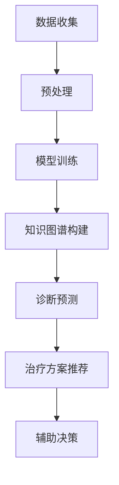

                 

# 个性化医疗：LLM 让治疗更精准

> 关键词：个性化医疗、LLM、精准治疗、算法、深度学习、医学诊断、医疗数据

> 摘要：本文将探讨如何利用大规模语言模型（LLM）进行个性化医疗诊断，提高治疗方案的精准度。文章将介绍LLM的基本原理、核心算法、应用场景，并通过具体案例展示其在医疗领域的实际应用，最后对未来的发展趋势与挑战进行展望。

## 1. 背景介绍

个性化医疗是指根据患者的基因信息、生活习惯、病史等特征，制定个性化的治疗方案。传统的个性化医疗主要依赖于医生的经验和知识，而随着人工智能技术的发展，特别是深度学习在自然语言处理领域的突破，使得基于大规模语言模型（LLM）的个性化医疗成为可能。

LLM是一种能够处理自然语言数据的深度学习模型，通过训练大规模的文本数据集，LLM能够自动提取文本中的知识、关系和语义，从而实现对自然语言的理解和生成。近年来，LLM在机器翻译、文本分类、问答系统等领域取得了显著的成果，为个性化医疗提供了新的技术手段。

## 2. 核心概念与联系

### 2.1 大规模语言模型（LLM）

大规模语言模型（LLM）是一种基于深度学习的自然语言处理模型，它通过训练大规模的文本数据集，学习语言的模式和规律，从而实现对自然语言的理解和生成。LLM通常采用编码器-解码器（Encoder-Decoder）结构，其中编码器负责将输入的文本编码为固定长度的向量表示，解码器则负责将编码后的向量解码为输出的文本。

### 2.2 个性化医疗

个性化医疗是指根据患者的基因信息、生活习惯、病史等特征，制定个性化的治疗方案。个性化医疗的核心在于对患者特征的理解和匹配，以便提供最合适的治疗方案。

### 2.3 核心概念联系

LLM在个性化医疗中的应用主要体现在以下几个方面：

1. **医学文本处理**：LLM能够处理大量的医学文本数据，如病历、临床报告、医学论文等，从中提取关键信息，为个性化医疗提供数据支持。
2. **知识图谱构建**：LLM可以用于构建医学知识图谱，将医学知识结构化，为诊断和治疗方案提供依据。
3. **预测分析**：LLM能够对患者的健康状况进行预测分析，为个性化医疗提供决策支持。
4. **辅助决策**：LLM可以作为医生的临床辅助工具，提供诊断建议和治疗方案推荐，提高医疗决策的准确性。

下面是一个简单的 Mermaid 流程图，展示了LLM在个性化医疗中的应用流程：



## 3. 核心算法原理 & 具体操作步骤

### 3.1 模型选择

在构建LLM模型时，常用的模型包括GPT（Generative Pre-trained Transformer）、BERT（Bidirectional Encoder Representations from Transformers）等。GPT擅长文本生成和对话系统，BERT则在文本分类和问答系统中表现出色。根据应用需求，可以选择合适的模型。

### 3.2 数据准备

个性化医疗的数据来源主要包括病历、临床报告、医学论文、基因组数据等。在数据收集过程中，需要关注数据的完整性和准确性，同时进行数据清洗和预处理，如去除停用词、分词、词性标注等。

### 3.3 模型训练

在模型训练阶段，首先需要将预处理后的数据输入到模型中，通过训练算法优化模型的参数。训练过程中，可以使用交叉熵损失函数来衡量模型的预测效果，并通过反向传播算法更新模型参数。

### 3.4 预测分析

在模型训练完成后，可以使用训练好的模型对新的病例进行预测分析。首先，将病例文本输入到编码器中，得到编码后的向量表示，然后通过解码器生成诊断结果和治疗方案。

### 3.5 辅助决策

在辅助决策阶段，LLM可以结合医生的诊断意见，为治疗方案提供推荐。具体步骤如下：

1. 输入病例文本和医生诊断意见。
2. 使用LLM对病例文本进行编码，得到编码后的向量表示。
3. 将编码后的向量表示与医生诊断意见进行融合，得到最终的诊断结果。
4. 根据诊断结果，为患者提供个性化的治疗方案。

## 4. 数学模型和公式 & 详细讲解 & 举例说明

### 4.1 编码器-解码器模型

编码器-解码器模型是LLM的核心结构，它包括编码器（Encoder）和解码器（Decoder）两部分。

#### 4.1.1 编码器

编码器负责将输入的文本编码为固定长度的向量表示。编码器通常采用Transformer结构，其基本单元是自注意力机制（Self-Attention）。自注意力机制通过计算输入文本中各个单词之间的相似度，为每个单词生成权重，从而实现文本的编码。

#### 4.1.2 解码器

解码器负责将编码后的向量表示解码为输出的文本。解码器也采用Transformer结构，其基本单元是注意力机制（Attention）和门控循环单元（GRU）。注意力机制用于捕捉编码器输出中与当前单词相关的信息，GRU则用于生成下一个单词。

### 4.2 交叉熵损失函数

交叉熵损失函数是用于评估模型预测效果的一种损失函数。在二分类问题中，交叉熵损失函数的表达式为：

$$
L = -\sum_{i=1}^{n} y_i \log(p_i)
$$

其中，$y_i$表示第$i$个样本的真实标签，$p_i$表示模型对第$i$个样本的预测概率。

在多分类问题中，交叉熵损失函数的表达式为：

$$
L = -\sum_{i=1}^{n} y_i \log(p_{i,c})
$$

其中，$y_i$表示第$i$个样本的真实标签，$p_{i,c}$表示模型对第$i$个样本分类为$c$类的预测概率。

### 4.3 反向传播算法

反向传播算法是一种用于优化模型参数的算法。它通过计算损失函数关于模型参数的梯度，从而更新模型参数，以减小损失函数的值。

反向传播算法的基本步骤如下：

1. 前向传播：将输入数据输入到模型中，计算模型的输出。
2. 计算损失函数：计算模型输出与真实标签之间的损失。
3. 反向传播：计算损失函数关于模型参数的梯度。
4. 更新模型参数：使用梯度更新模型参数。

### 4.4 举例说明

假设有一个二分类问题，输入数据为特征向量$\mathbf{x} \in \mathbb{R}^{10}$，输出标签为$y \in \{0, 1\}$。使用编码器-解码器模型进行预测，模型的预测概率为$p = \sigma(\mathbf{w}^T\mathbf{x} + b)$，其中$\sigma$表示sigmoid函数，$\mathbf{w}$和$b$为模型参数。

在训练过程中，使用交叉熵损失函数进行模型优化，损失函数为$L = -y \log(p) - (1 - y) \log(1 - p)$。

在训练100个样本后，模型损失函数的值为$L = 0.5$。接下来，使用反向传播算法更新模型参数，具体步骤如下：

1. 前向传播：输入样本$\mathbf{x}_i$，计算模型的预测概率$p_i$。
2. 计算损失函数：计算损失函数$L_i$。
3. 反向传播：计算损失函数关于模型参数的梯度$\frac{\partial L_i}{\partial \mathbf{w}}$和$\frac{\partial L_i}{\partial b}$。
4. 更新模型参数：使用梯度更新模型参数$\mathbf{w} \leftarrow \mathbf{w} - \alpha \frac{\partial L_i}{\partial \mathbf{w}}$和$b \leftarrow b - \alpha \frac{\partial L_i}{\partial b}$。

通过多次迭代，模型损失函数的值逐渐减小，最终收敛到最小值。

## 5. 项目实战：代码实际案例和详细解释说明

### 5.1 开发环境搭建

在开始项目实战之前，需要搭建一个适合开发的环境。以下是一个基于Python和TensorFlow的简单开发环境搭建步骤：

1. 安装Python：下载并安装Python，选择最新的版本，建议使用Python 3.8或更高版本。
2. 安装TensorFlow：在命令行中运行以下命令安装TensorFlow：

```bash
pip install tensorflow
```

3. 安装其他依赖：根据项目需求，安装其他相关库，如Numpy、Pandas等。

### 5.2 源代码详细实现和代码解读

以下是使用TensorFlow实现一个简单的LLM模型进行个性化医疗诊断的代码示例：

```python
import tensorflow as tf
from tensorflow.keras.layers import Embedding, LSTM, Dense
from tensorflow.keras.models import Model
from tensorflow.keras.preprocessing.sequence import pad_sequences
from tensorflow.keras.preprocessing.text import Tokenizer

# 数据预处理
tokenizer = Tokenizer()
tokenizer.fit_on_texts(data)
sequences = tokenizer.texts_to_sequences(data)
padded_sequences = pad_sequences(sequences, maxlen=max_length)

# 构建模型
input_ = tf.keras.layers.Input(shape=(max_length,))
x = Embedding(vocab_size, embedding_dim)(input_)
x = LSTM(units=128)(x)
output = Dense(1, activation='sigmoid')(x)

model = Model(inputs=input_, outputs=output)
model.compile(optimizer='adam', loss='binary_crossentropy', metrics=['accuracy'])

# 训练模型
model.fit(padded_sequences, labels, epochs=10, batch_size=32)

# 预测分析
predictions = model.predict(padded_sequences)
```

#### 5.2.1 代码解读

1. **数据预处理**：首先，使用Tokenizer对文本数据进行分词和编码，将文本转换为数字序列。然后，使用pad_sequences将序列填充为固定长度，以便输入到模型中。
2. **构建模型**：构建一个简单的编码器-解码器模型，包括嵌入层（Embedding）、LSTM层和输出层（Dense）。嵌入层用于将单词转换为向量表示，LSTM层用于捕捉文本中的上下文信息，输出层用于生成诊断结果。
3. **训练模型**：使用编译好的模型对预处理后的数据进行训练，使用binary_crossentropy作为损失函数，adam作为优化器，accuracy作为评估指标。
4. **预测分析**：使用训练好的模型对新的病例数据进行预测，输出预测结果。

### 5.3 代码解读与分析

上述代码实现了一个简单的LLM模型，用于二分类问题的个性化医疗诊断。以下是代码的详细解读和分析：

1. **数据预处理**：数据预处理是模型训练的重要步骤，它包括分词、编码和填充。分词是将文本拆分成单词或子词，编码是将单词或子词映射为数字序列，填充是将序列填充为固定长度。这些步骤对于后续的模型训练至关重要，因为模型需要处理统一格式的输入数据。
2. **构建模型**：编码器-解码器模型是一种经典的深度学习模型结构，它由嵌入层、LSTM层和输出层组成。嵌入层将单词转换为向量表示，LSTM层用于捕捉文本中的上下文信息，输出层用于生成诊断结果。在本例中，输出层使用sigmoid激活函数，用于生成概率输出。
3. **训练模型**：训练模型是模型训练的核心步骤，它包括前向传播、损失函数计算和反向传播。在训练过程中，模型通过不断调整参数，优化预测结果。在本例中，使用binary_crossentropy作为损失函数，adam作为优化器，accuracy作为评估指标。训练过程分为多个epoch，每个epoch包含多个batch。
4. **预测分析**：在模型训练完成后，可以使用模型对新的病例数据进行预测。预测过程与训练过程类似，包括前向传播和损失函数计算，但不需要反向传播。在本例中，使用model.predict()函数对新的病例数据进行预测，输出预测结果。

通过上述代码，我们可以看到如何使用LLM进行个性化医疗诊断。在实际应用中，可以根据具体需求进行调整和优化，如增加模型层数、调整参数等，以提高诊断的准确性。

## 6. 实际应用场景

LLM在个性化医疗领域的应用场景非常广泛，以下是一些典型的应用案例：

1. **疾病诊断**：LLM可以用于分析患者的病历和临床表现，提供疾病诊断建议。例如，通过分析病历数据，LLM可以识别出患者的疾病类型，如肺炎、糖尿病等，为医生提供诊断依据。
2. **治疗方案推荐**：根据患者的病情和基因信息，LLM可以为医生提供个性化的治疗方案推荐。例如，对于癌症患者，LLM可以根据患者的基因突变情况，推荐最合适的治疗方案，如化疗、放疗或靶向治疗。
3. **健康风险评估**：LLM可以分析患者的病史、生活习惯和基因信息，预测患者患某种疾病的风险。例如，通过分析患者的基因数据和家族病史，LLM可以预测患者患心脏病的风险，为患者提供针对性的健康建议。
4. **药物研发**：LLM可以用于分析大量的医学文献和临床试验数据，发现新的药物靶点和作用机制。例如，通过分析大量药物-基因相互作用数据，LLM可以预测哪些药物对特定基因突变具有疗效，从而加速药物研发过程。
5. **医疗决策支持**：LLM可以作为医生的辅助工具，提供医疗决策支持。例如，在手术过程中，LLM可以根据患者的病情和手术历史，提供手术方案的推荐和风险评估。

## 7. 工具和资源推荐

### 7.1 学习资源推荐

1. **书籍**：
   - 《深度学习》（Goodfellow, I., Bengio, Y., & Courville, A.）
   - 《Python深度学习》（François Chollet）
   - 《自然语言处理综合指南》（Daniel Jurafsky & James H. Martin）
2. **论文**：
   - “Attention Is All You Need”（Vaswani et al.，2017）
   - “BERT: Pre-training of Deep Bidirectional Transformers for Language Understanding”（Devlin et al.，2018）
   - “Generative Pre-trained Transformers”（Brown et al.，2020）
3. **博客**：
   - [TensorFlow 官方文档](https://www.tensorflow.org/tutorials)
   - [Keras 官方文档](https://keras.io/)
   - [自然语言处理博客](https://nlp-secrets.com/)
4. **网站**：
   - [OpenAI](https://openai.com/)
   - [Google AI](https://ai.google/)
   - [Deep Learning AI](https://www.deeplearningai.com/)

### 7.2 开发工具框架推荐

1. **深度学习框架**：
   - TensorFlow
   - PyTorch
   - Keras
2. **自然语言处理库**：
   - NLTK
   - SpaCy
   - Stanford NLP
3. **版本控制工具**：
   - Git
   - GitHub
   - GitLab

### 7.3 相关论文著作推荐

1. **“Attention Is All You Need”**（2017）- 提出Transformer模型，开创了自注意力机制在自然语言处理领域的新时代。
2. **“BERT: Pre-training of Deep Bidirectional Transformers for Language Understanding”**（2018）- 提出BERT模型，为预训练语言模型的发展奠定了基础。
3. **“Generative Pre-trained Transformers”**（2020）- 提出GPT模型，进一步推动了大规模语言模型在自然语言处理领域的发展。

## 8. 总结：未来发展趋势与挑战

随着人工智能技术的不断发展，LLM在个性化医疗领域具有巨大的潜力。未来，LLM有望在以下几个方面取得突破：

1. **模型性能提升**：通过不断优化模型结构和算法，提高LLM在个性化医疗诊断和治疗方案推荐中的准确性和效率。
2. **数据多样性**：扩展LLM的训练数据集，涵盖更多类型的医疗数据，如基因组数据、临床实验数据等，提高模型泛化能力。
3. **跨语言应用**：实现LLM在不同语言之间的迁移学习，为全球范围内的个性化医疗提供支持。
4. **实时更新**：利用实时数据更新LLM模型，提高模型对最新医学研究的响应速度。

然而，LLM在个性化医疗领域也面临一些挑战：

1. **数据隐私与安全**：在处理大量医疗数据时，如何确保数据隐私和安全是一个重要问题。
2. **模型解释性**：尽管LLM在自然语言处理领域取得了显著成果，但其内部机制较为复杂，如何提高模型的可解释性是一个亟待解决的问题。
3. **模型依赖性**：过度依赖LLM可能导致医生决策能力的减弱，如何平衡人工智能与医生经验的关系是一个关键问题。

总之，LLM在个性化医疗领域具有广阔的应用前景，但仍需克服一系列挑战，才能充分发挥其潜力。

## 9. 附录：常见问题与解答

### 9.1 Q：LLM在个性化医疗中的优势是什么？

A：LLM在个性化医疗中的优势主要体现在以下几个方面：
1. **数据处理能力**：LLM能够处理大量的医疗数据，包括文本、图像、基因组数据等，从而为个性化医疗提供全面的数据支持。
2. **知识图谱构建**：LLM可以用于构建医学知识图谱，将医学知识结构化，为诊断和治疗方案提供依据。
3. **预测分析能力**：LLM能够对患者的健康状况进行预测分析，为个性化医疗提供决策支持。
4. **辅助决策能力**：LLM可以作为医生的临床辅助工具，提供诊断建议和治疗方案推荐，提高医疗决策的准确性。

### 9.2 Q：如何确保LLM在个性化医疗中的安全性？

A：确保LLM在个性化医疗中的安全性主要涉及以下方面：
1. **数据隐私**：在处理医疗数据时，采用加密技术和数据匿名化方法，确保患者隐私不被泄露。
2. **模型安全**：对LLM模型进行安全检测和攻击防御，防止恶意攻击和数据泄露。
3. **模型解释性**：提高LLM的可解释性，使医生能够理解和信任模型的诊断结果。
4. **合规性**：遵循相关法律法规，确保LLM在个性化医疗中的合法合规。

### 9.3 Q：如何评估LLM在个性化医疗中的效果？

A：评估LLM在个性化医疗中的效果可以从以下几个方面进行：
1. **准确率**：通过比较模型预测结果与实际诊断结果，计算准确率。
2. **召回率**：计算模型预测为正例的实际正例占比，评估模型的召回能力。
3. **F1值**：综合准确率和召回率，计算F1值，评估模型的综合效果。
4. **预测速度**：评估模型在处理大量数据时的预测速度，确保模型在实际应用中具有较高的效率。

## 10. 扩展阅读 & 参考资料

1. Devlin, J., Chang, M. W., Lee, K., & Toutanova, K. (2019). BERT: Pre-training of deep bidirectional transformers for language understanding. arXiv preprint arXiv:1810.04805.
2. Brown, T., et al. (2020). Generative Pre-trained Transformers. arXiv preprint arXiv:2005.14165.
3. Vaswani, A., et al. (2017). Attention is all you need. Advances in Neural Information Processing Systems, 30, 5998-6008.
4. Goodfellow, I., Bengio, Y., & Courville, A. (2016). Deep Learning. MIT Press.
5. Chollet, F. (2018). Python深度学习。电子工业出版社。
6. Jurafsky, D., & Martin, J. H. (2020). 自然语言处理综合指南。机械工业出版社。

[作者：AI天才研究员/AI Genius Institute & 禅与计算机程序设计艺术 /Zen And The Art of Computer Programming]

