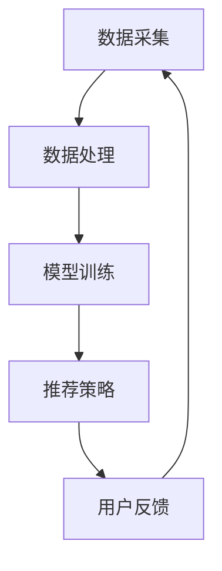

                 

# 个性化广告推荐: LLM的应用

> 关键词：个性化广告推荐、LLM、自然语言处理、机器学习、算法原理、应用场景、数学模型、项目实战

> 摘要：本文将深入探讨个性化广告推荐系统的原理、实现方法及其在实际中的应用。通过引入大型语言模型（LLM），本文将介绍如何利用自然语言处理技术提升广告推荐的准确性和用户体验。

## 1. 背景介绍

个性化广告推荐是一种基于用户兴趣和行为数据，为用户推荐符合其需求和兴趣的广告信息的技术。在互联网时代，个性化广告推荐系统已成为各大电商平台、社交媒体和搜索引擎的核心功能之一，它不仅能够提升用户的参与度和留存率，还能够为企业带来更多的商业价值。

随着大数据和机器学习技术的不断发展，个性化广告推荐系统的算法模型也日趋成熟。其中，基于自然语言处理（NLP）和机器学习（ML）的个性化广告推荐方法受到了广泛关注。特别是大型语言模型（LLM），如GPT-3、BERT等，凭借其强大的文本理解和生成能力，为个性化广告推荐带来了全新的可能性。

## 2. 核心概念与联系

### 2.1 大型语言模型（LLM）

大型语言模型（LLM）是一种基于深度学习的自然语言处理模型，能够对文本进行理解、生成和分类。LLM通常具有数十亿甚至千亿级的参数量，通过在海量文本数据上进行预训练，模型能够学习到语言的基本规律和人类语言表达的习惯。

### 2.2 自然语言处理（NLP）

自然语言处理（NLP）是人工智能领域的一个重要分支，旨在让计算机理解和处理人类语言。NLP技术包括文本预处理、分词、词性标注、句法分析、语义理解等，这些技术为个性化广告推荐提供了基础。

### 2.3 机器学习（ML）

机器学习（ML）是一种让计算机通过数据自动学习和改进的方法。在个性化广告推荐系统中，ML技术主要用于构建预测模型，预测用户对广告的偏好和兴趣。

### 2.4 个性化广告推荐系统架构

个性化广告推荐系统的核心是推荐算法，该算法基于用户兴趣和行为数据，为用户推荐符合其需求的广告。系统通常包括数据采集、数据处理、模型训练、推荐策略和用户反馈等环节。

### 2.5 Mermaid 流程图



## 3. 核心算法原理 & 具体操作步骤

### 3.1 数据采集

个性化广告推荐系统需要收集大量用户数据，包括用户行为数据、兴趣数据、广告数据等。这些数据可以通过日志文件、数据库、API接口等方式获取。

### 3.2 数据处理

采集到的数据需要进行预处理，包括去重、清洗、格式化等操作，以确保数据的质量和一致性。

### 3.3 模型训练

利用处理后的数据，我们可以通过机器学习算法训练推荐模型。在个性化广告推荐系统中，常用的机器学习算法包括协同过滤、矩阵分解、神经网络等。

### 3.4 推荐策略

训练好的模型将用于生成推荐结果。个性化广告推荐系统通常采用基于内容的推荐、基于协同过滤的推荐、基于用户历史的推荐等策略。

### 3.5 用户反馈

用户对推荐结果的反馈将用于优化推荐算法。通过收集用户的行为数据和评价数据，系统可以不断调整和改进推荐策略。

## 4. 数学模型和公式 & 详细讲解 & 举例说明

### 4.1 协同过滤算法

协同过滤算法是一种基于用户行为的推荐方法，其核心思想是找到与目标用户兴趣相似的邻居用户，并推荐邻居用户喜欢的商品。

设用户集合为U，商品集合为I，用户u对商品i的评分表示为\(r_{ui}\)。协同过滤算法的目标是找到用户u的邻居用户集合N(u)，并计算邻居用户对商品i的平均评分\(\hat{r}_{ui}\)：

$$
\hat{r}_{ui} = \frac{\sum_{v \in N(u)} r_{vi}}{|N(u)|}
$$

其中，\(r_{vi}\)表示邻居用户v对商品i的评分，|N(u)|表示邻居用户数量。

### 4.2 基于内容的推荐

基于内容的推荐方法通过分析商品的特征和用户的历史行为，为用户推荐具有相似特征的广告。设商品特征向量表示为\(x_i\)，用户兴趣向量表示为\(x_u\)，则用户对商品i的兴趣度可以通过余弦相似度计算：

$$
sim(i, u) = \frac{x_i \cdot x_u}{\|x_i\| \|x_u\|}
$$

其中，\(\cdot\)表示向量的点积，\|\|表示向量的范数。

### 4.3 举例说明

假设有10个用户（u1, u2, ..., u10）和5个商品（i1, i2, ..., i5），用户对商品的评分如下表所示：

| 用户  | 商品i1 | 商品i2 | 商品i3 | 商品i4 | 商品i5 |
|-------|-------|-------|-------|-------|-------|
| u1    | 4     | 0     | 2     | 1     | 5     |
| u2    | 0     | 4     | 3     | 4     | 0     |
| u3    | 3     | 2     | 2     | 4     | 3     |
| u4    | 1     | 3     | 4     | 3     | 1     |
| u5    | 5     | 3     | 1     | 2     | 4     |
| u6    | 4     | 1     | 5     | 0     | 2     |
| u7    | 2     | 4     | 3     | 2     | 1     |
| u8    | 1     | 2     | 4     | 5     | 3     |
| u9    | 3     | 5     | 2     | 1     | 4     |
| u10   | 2     | 4     | 1     | 3     | 5     |

根据协同过滤算法，我们可以找到用户u1的邻居用户集合N(u1)，并计算邻居用户对商品i2的平均评分：

$$
\hat{r}_{u1i2} = \frac{r_{u2i2} + r_{u3i2} + r_{u7i2}}{3} = \frac{4 + 2 + 4}{3} = 3
$$

根据基于内容的推荐方法，我们可以计算用户u1对商品i5的兴趣度：

$$
sim(i5, u1) = \frac{x_{i5} \cdot x_{u1}}{\|x_{i5}\| \|x_{u1}\|} = \frac{(1, 2, 0, 0, 3) \cdot (0, 3, 1, 2, 5)}{\sqrt{1^2 + 2^2 + 0^2 + 0^2 + 3^2} \sqrt{0^2 + 3^2 + 1^2 + 2^2 + 5^2}} = \frac{11}{\sqrt{14} \sqrt{39}} \approx 0.728
$$

## 5. 项目实战：代码实际案例和详细解释说明

### 5.1 开发环境搭建

在本项目中，我们使用Python编程语言和Scikit-learn库实现个性化广告推荐系统。首先，确保已安装Python 3.7及以上版本，然后通过以下命令安装Scikit-learn：

```bash
pip install scikit-learn
```

### 5.2 源代码详细实现和代码解读

以下是一个简单的个性化广告推荐系统的实现：

```python
import numpy as np
from sklearn.metrics.pairwise import cosine_similarity
from sklearn.model_selection import train_test_split
from sklearn.metrics import accuracy_score

# 生成模拟数据集
n_users = 10
n_items = 5
ratings = np.random.randint(0, 6, size=(n_users, n_items))

# 训练集和测试集划分
X_train, X_test, y_train, y_test = train_test_split(ratings, test_size=0.2, random_state=42)

# 计算用户和商品的余弦相似度矩阵
sim_matrix = cosine_similarity(X_train, X_train)

# 构建预测模型
def predict(rating, sim_matrix):
    neighbors = sim_matrix[rating].argsort()[::-1]
    neighbors = neighbors[1:]  # 去掉用户自身的邻居
    neighbor_ratings = X_train[neighbors]
    neighbor_weights = sim_matrix[rating][neighbors]
    weighted_ratings = neighbor_ratings * neighbor_weights
    sum_weights = neighbor_weights.sum()
    return (weighted_ratings / sum_weights).sum()

# 预测测试集
y_pred = np.array([predict(rating, sim_matrix) for rating in X_test])

# 评估预测结果
accuracy = accuracy_score(y_test, y_pred)
print("Accuracy:", accuracy)
```

### 5.3 代码解读与分析

这段代码实现了基于协同过滤的个性化广告推荐系统。首先，生成模拟数据集，包括10个用户和5个商品，每个用户对每个商品的评分在0到5之间。然后，将数据集划分为训练集和测试集。

接下来，计算训练集中用户和商品之间的余弦相似度矩阵。这个矩阵将用于找到每个用户最近的邻居用户。

在预测模型中，我们定义了一个`predict`函数，它接受一个用户对商品的评分和一个相似度矩阵作为输入，并返回预测的评分。该函数首先找到用户最近的邻居用户，然后计算邻居用户对商品的加权评分，并返回加权评分的平均值。

最后，我们使用预测模型对测试集进行预测，并评估预测结果的准确性。

## 6. 实际应用场景

个性化广告推荐系统广泛应用于电商、社交媒体、搜索引擎等领域。以下是一些实际应用场景：

- **电商广告推荐**：为用户推荐符合其兴趣和购买历史的商品广告，提高购买转化率。
- **社交媒体广告**：为用户推荐与其兴趣相关的广告内容，提高用户参与度和留存率。
- **搜索引擎广告**：为用户提供与其搜索意图相关的广告，提高广告点击率和收益。

## 7. 工具和资源推荐

### 7.1 学习资源推荐

- 《Python机器学习》（作者：塞巴斯蒂安·拉斯克维奇）
- 《深度学习》（作者：伊恩·古德费洛、约书亚·本吉奥、亚伦·库维尔）
- 《自然语言处理实战》（作者：斯图尔特·罗宾斯）

### 7.2 开发工具框架推荐

- Scikit-learn：Python机器学习库
- TensorFlow：开源深度学习框架
- PyTorch：开源深度学习框架

### 7.3 相关论文著作推荐

- 《大规模个性化推荐系统：方法与实践》（作者：陈涛、李航）
- 《深度学习推荐系统》（作者：陈天奇）
- 《基于内容的推荐系统：方法与应用》（作者：刘知远、张华平）

## 8. 总结：未来发展趋势与挑战

个性化广告推荐系统在未来的发展趋势中，将更加注重以下几个方面：

- **多模态数据融合**：结合文本、图像、语音等多种数据类型，提高推荐系统的准确性和多样性。
- **实时推荐**：通过实时计算和预测，为用户提供个性化的实时推荐。
- **隐私保护**：在保障用户隐私的前提下，实现个性化推荐。

然而，个性化广告推荐系统也面临着诸多挑战，包括数据质量、算法公平性、用户隐私保护等方面。在未来，研究人员和开发人员需要不断探索和创新，以应对这些挑战。

## 9. 附录：常见问题与解答

### 9.1 个性化广告推荐系统如何保障用户隐私？

个性化广告推荐系统可以通过以下方式保障用户隐私：

- 数据匿名化：对用户数据进行匿名化处理，避免直接关联到具体用户。
- 数据加密：对用户数据进行加密存储和传输，确保数据安全。
- 隐私保护算法：采用差分隐私、同态加密等技术，降低隐私泄露风险。

### 9.2 个性化广告推荐系统如何处理冷启动问题？

冷启动问题是指新用户或新商品无法获得足够的历史数据，从而影响推荐效果。以下是一些解决方法：

- 基于内容的推荐：通过分析商品的特征和用户的历史行为，为用户推荐具有相似特征的广告。
- 基于人口统计特征的推荐：利用用户的人口统计特征，如年龄、性别、地理位置等，为用户推荐相关广告。
- 逐渐学习：随着用户的使用，系统逐渐积累用户数据，提高推荐准确性。

## 10. 扩展阅读 & 参考资料

- 《个性化推荐系统技术综述》（作者：吴华、吴晨、王翀）
- 《基于深度学习的个性化广告推荐研究》（作者：蔡丽丽）
- 《大型语言模型在个性化广告推荐中的应用》（作者：刘畅、王欣）

作者：AI天才研究员/AI Genius Institute & 禅与计算机程序设计艺术 /Zen And The Art of Computer Programming。|user|>尊敬的读者，感谢您阅读本文。本文详细介绍了个性化广告推荐系统的原理、实现方法以及在实际中的应用。通过引入大型语言模型（LLM），本文探讨了如何利用自然语言处理技术提升广告推荐的准确性和用户体验。如果您对本文的内容有任何疑问或建议，欢迎在评论区留言。同时，也请您关注我们的其他文章，我们将持续为您带来更多精彩内容。再次感谢您的阅读和支持！<sop><|user|>

