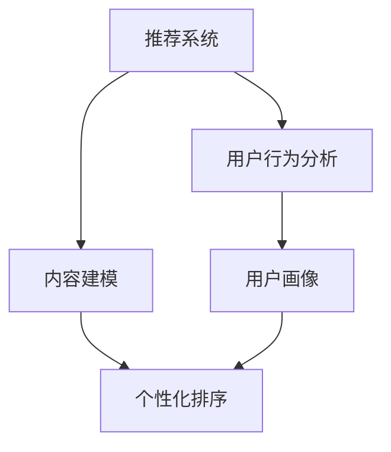
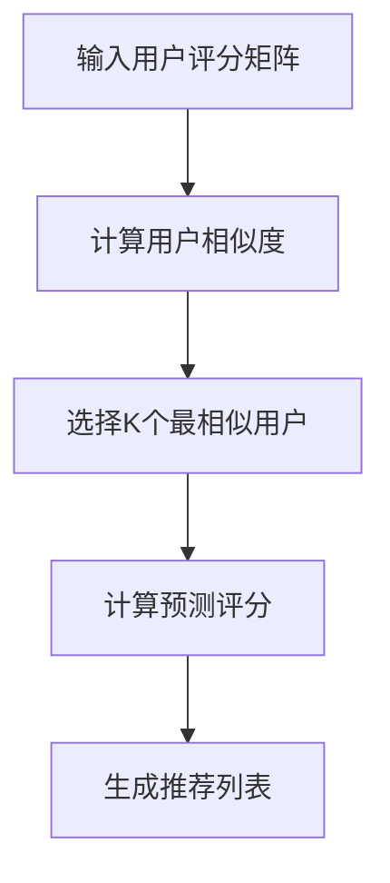
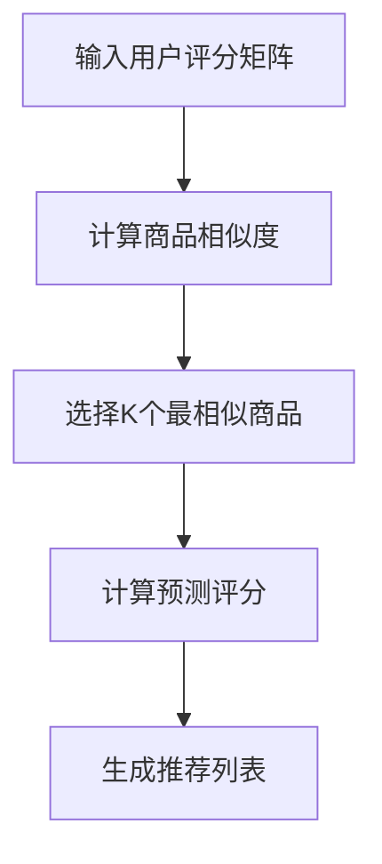
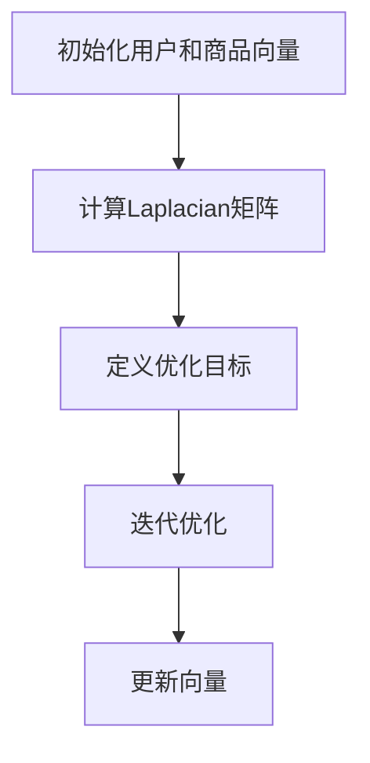
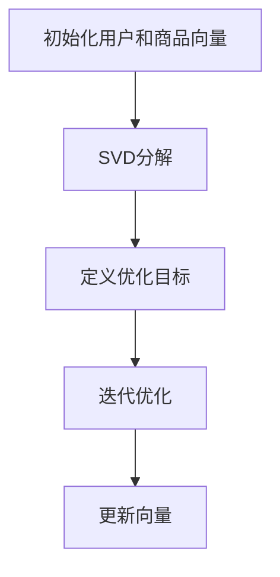
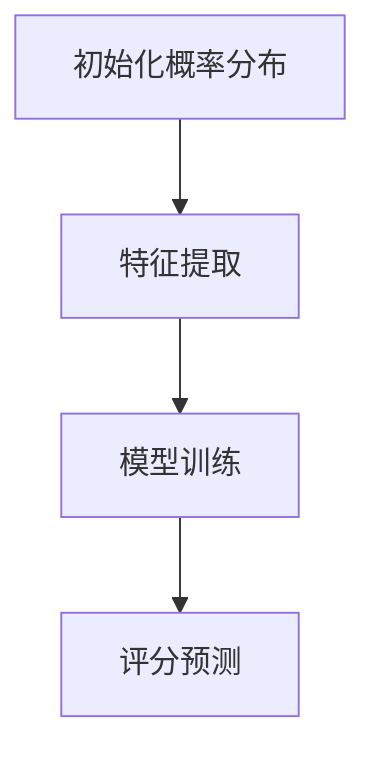
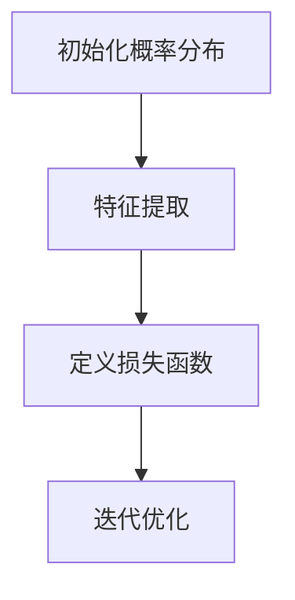

                 

### 背景介绍

个性化排序技术是近年来在推荐系统、搜索引擎和信息检索等领域中得到广泛应用的一项关键技术。随着互联网的迅猛发展和大数据时代的到来，用户生成的内容和数据量呈现爆炸式增长，如何在海量信息中快速、准确地找到满足用户需求的内容，成为了一个重要的问题。

个性化排序技术的核心目标是通过分析用户的历史行为、兴趣偏好和内容特征，对信息进行智能排序，从而提升用户满意度。在实际应用中，个性化排序技术不仅能够为用户提供更个性化的内容推荐，还可以提高广告投放的精准度和电商平台的销售额。

本文将围绕个性化排序技术进行深入探讨，首先介绍其核心概念和基本原理，然后详细分析常见的核心算法原理和操作步骤，接着探讨相关的数学模型和公式，并通过实际项目案例进行代码实现和解析。此外，文章还将讨论个性化排序技术的实际应用场景，并推荐相关的学习资源和开发工具框架。

通过本文的阅读，读者将能够全面了解个性化排序技术的核心概念、算法原理、数学模型和应用实践，从而为在相关领域进行深入研究和技术应用打下坚实的基础。

### 核心概念与联系

个性化排序技术的核心概念和原理涉及到多个关键领域，包括机器学习、数据挖掘、信息检索和用户行为分析。为了更好地理解这些概念之间的联系，我们首先需要明确以下几个核心概念：

#### 1. 推荐系统

推荐系统是一种通过算法预测用户可能感兴趣的内容，并为此提供个性化推荐的系统。推荐系统通常由数据收集、用户建模、内容建模和推荐算法等几个部分组成。

- **数据收集**：通过用户的行为数据（如浏览、点击、购买等）来构建用户画像。
- **用户建模**：基于用户的行为和兴趣，构建用户特征模型。
- **内容建模**：对推荐的内容进行特征提取和分类，如商品、文章、视频等。
- **推荐算法**：通过算法将用户特征与内容特征匹配，生成个性化推荐列表。

#### 2. 个性化排序

个性化排序是推荐系统中的一个重要环节，它通过对用户历史行为和内容特征的分析，对推荐结果进行排序，从而提升用户满意度。个性化排序的核心目标是最大化用户的兴趣和需求。

- **兴趣分析**：通过分析用户的历史行为和偏好，识别用户的兴趣点。
- **内容特征**：对推荐内容进行特征提取，如文本特征、图像特征等。
- **排序算法**：基于用户兴趣和内容特征，采用不同的排序算法对推荐结果进行排序。

#### 3. 用户行为分析

用户行为分析是构建用户画像和个性化排序的重要基础。通过对用户的行为数据进行分析，可以深入了解用户的需求和偏好，从而更好地进行内容推荐。

- **行为数据**：包括用户的浏览记录、搜索历史、点击行为等。
- **行为分析**：通过机器学习和统计分析方法，提取用户的行为特征。
- **用户画像**：基于用户的行为特征，构建详细的用户画像。

#### 4. 数学模型

个性化排序技术中，数学模型用于描述用户兴趣、内容特征和排序算法之间的关系。常见的数学模型包括协同过滤、矩阵分解、概率模型等。

- **协同过滤**：基于用户相似度和内容相似度进行推荐。
- **矩阵分解**：通过分解用户-内容矩阵，预测用户对内容的评分。
- **概率模型**：使用概率模型描述用户对内容的兴趣。

#### 5. 机器学习算法

个性化排序技术中，机器学习算法用于构建用户特征模型和推荐模型。常见的机器学习算法包括线性回归、决策树、神经网络等。

- **线性回归**：用于预测用户对内容的评分。
- **决策树**：用于分类用户兴趣和内容类别。
- **神经网络**：用于构建复杂的非线性模型。

#### 6. 深度学习

深度学习在个性化排序技术中的应用越来越广泛，通过构建深度神经网络模型，可以更好地提取用户和内容的特征，实现更准确的推荐。

- **卷积神经网络（CNN）**：用于处理图像和文本数据。
- **循环神经网络（RNN）**：用于处理序列数据。
- **生成对抗网络（GAN）**：用于生成多样化的推荐内容。

以上是个性化排序技术中的核心概念和联系。为了更好地展示这些概念之间的联系，我们可以使用Mermaid流程图来表示。



在这个流程图中，推荐系统通过用户行为分析和内容建模生成用户画像，并根据用户画像和内容特征进行个性化排序。用户行为分析和内容建模的结果可以进一步用于优化推荐算法和提升推荐效果。

通过上述核心概念和联系的分析，我们可以更好地理解个性化排序技术的本质和应用场景。在接下来的章节中，我们将详细探讨个性化排序技术的核心算法原理、具体操作步骤和数学模型。

### 核心算法原理 & 具体操作步骤

在个性化排序技术中，核心算法原理决定了推荐系统性能和用户满意度。常见的核心算法包括协同过滤（Collaborative Filtering）、矩阵分解（Matrix Factorization）、概率模型（Probabilistic Model）等。以下是这些算法的基本原理和具体操作步骤。

#### 1. 协同过滤

协同过滤是一种基于用户行为相似性的推荐算法。其基本原理是：如果用户A和用户B在多个商品上的评价相似，那么用户A喜欢的商品B很可能也受到用户B的喜爱。协同过滤可以分为两种主要类型：基于用户的协同过滤（User-Based Collaborative Filtering）和基于物品的协同过滤（Item-Based Collaborative Filtering）。

**基于用户的协同过滤（User-Based Collaborative Filtering）**

1. **计算用户相似度**：通过计算用户之间的相似度矩阵，找到与目标用户最相似的K个用户。
2. **生成推荐列表**：对于目标用户未评分的商品，利用最相似的K个用户的评分，计算预测评分，并根据预测评分对商品进行排序，生成推荐列表。

具体操作步骤：



**基于物品的协同过滤（Item-Based Collaborative Filtering）**

1. **计算商品相似度**：通过计算商品之间的相似度矩阵，找到与目标商品最相似的K个商品。
2. **生成推荐列表**：对于目标用户未评分的商品，利用最相似的K个商品的评分，计算预测评分，并根据预测评分对商品进行排序，生成推荐列表。

具体操作步骤：



#### 2. 矩阵分解

矩阵分解是一种通过分解用户-内容矩阵来预测用户评分的算法。其基本原理是：用户和商品都可以表示为低维向量，通过矩阵分解，可以重建用户-内容评分矩阵，从而预测用户对未评分商品的评分。

**Laplacian矩阵分解**

1. **初始化**：为每个用户和商品初始化一个随机向量。
2. **Laplacian矩阵计算**：计算用户-内容矩阵的Laplacian矩阵。
3. **优化目标**：最小化预测评分与实际评分之间的误差。
4. **迭代优化**：通过迭代优化，更新用户和商品向量。

具体操作步骤：



**Singular Value Decomposition（SVD）分解**

1. **初始化**：为每个用户和商品初始化一个随机向量。
2. **SVD分解**：将用户-内容矩阵进行SVD分解。
3. **优化目标**：最小化预测评分与实际评分之间的误差。
4. **迭代优化**：通过迭代优化，更新用户和商品向量。

具体操作步骤：



#### 3. 概率模型

概率模型是一种通过概率方法预测用户评分的算法。其基本原理是：用户对商品的评分是一个概率事件，通过学习用户和商品的特征，可以计算用户对商品的评分概率。

**贝叶斯模型**

1. **初始化**：为每个用户和商品初始化一个概率分布。
2. **特征提取**：提取用户和商品的特征向量。
3. **模型训练**：通过训练数据学习用户和商品的特征概率分布。
4. **评分预测**：根据用户和商品的特征向量，计算评分概率，并生成推荐列表。

具体操作步骤：



**最大熵模型**

1. **初始化**：为每个用户和商品初始化一个概率分布。
2. **特征提取**：提取用户和商品的特征向量。
3. **损失函数**：定义损失函数，最小化预测评分与实际评分之间的误差。
4. **迭代优化**：通过迭代优化，更新用户和商品的概率分布。

具体操作步骤：



通过上述核心算法原理和具体操作步骤的介绍，我们可以看到个性化排序技术在不同算法原理下有着不同的实现方式。在实际应用中，可以根据具体场景和需求选择合适的算法，以实现最优的推荐效果。

### 数学模型和公式 & 详细讲解 & 举例说明

在个性化排序技术中，数学模型和公式是核心组成部分，用于描述用户行为、内容特征和排序算法之间的关系。以下将详细介绍几个常用的数学模型和公式，并通过具体例子进行讲解。

#### 1. 协同过滤中的用户相似度计算

协同过滤算法中，用户相似度计算是关键步骤。常用的相似度计算方法包括余弦相似度、皮尔逊相关系数和Jaccard相似度。

**余弦相似度**

余弦相似度是一种衡量两个向量之间夹角余弦值的相似度度量。公式如下：

$$
\text{相似度} = \cos(\theta) = \frac{\text{向量}A \cdot \text{向量}B}{\|\text{向量}A\|\|\text{向量}B\|}
$$

其中，$A$ 和 $B$ 分别为两个用户或商品的向量，$\cdot$ 表示向量内积，$\|\|$ 表示向量模长。

**皮尔逊相关系数**

皮尔逊相关系数用于衡量两个变量之间的线性关系。公式如下：

$$
\text{相似度} = \rho = \frac{\text{协方差}(A, B)}{\sigma_A \sigma_B}
$$

其中，$\text{协方差}(A, B)$ 表示 $A$ 和 $B$ 的协方差，$\sigma_A$ 和 $\sigma_B$ 分别表示 $A$ 和 $B$ 的标准差。

**Jaccard相似度**

Jaccard相似度主要用于文本相似度计算。公式如下：

$$
\text{相似度} = J(A, B) = \frac{|A \cap B|}{|A \cup B|}
$$

其中，$A \cap B$ 表示 $A$ 和 $B$ 的交集，$A \cup B$ 表示 $A$ 和 $B$ 的并集。

**例1：用户相似度计算**

假设有两个用户 $A$ 和 $B$，他们的评分向量分别为：

$$
A = [3, 5, 4, 2, 1], \quad B = [4, 2, 5, 3, 1]
$$

计算他们的余弦相似度和皮尔逊相关系数。

**余弦相似度**

$$
\text{相似度} = \cos(\theta) = \frac{A \cdot B}{\|A\|\|B\|} = \frac{3 \cdot 4 + 5 \cdot 2 + 4 \cdot 5 + 2 \cdot 3 + 1 \cdot 1}{\sqrt{3^2 + 5^2 + 4^2 + 2^2 + 1^2} \cdot \sqrt{4^2 + 2^2 + 5^2 + 3^2 + 1^2}} = \frac{14}{\sqrt{55} \cdot \sqrt{55}} = \frac{14}{55}
$$

**皮尔逊相关系数**

$$
\text{相似度} = \rho = \frac{\text{协方差}(A, B)}{\sigma_A \sigma_B} = \frac{3 \cdot 4 - 5 \cdot 2 + 4 \cdot 5 - 2 \cdot 3 + 1 \cdot 1}{\sqrt{3^2 + 5^2 + 4^2 + 2^2 + 1^2} \cdot \sqrt{4^2 + 2^2 + 5^2 + 3^2 + 1^2}} = \frac{14}{55}
$$

可以看出，两个相似度度量方法计算出的相似度结果相同。

#### 2. 矩阵分解中的优化目标

矩阵分解算法通过优化目标函数来估计用户和商品的低维向量。常见的优化目标包括最小二乘法和最小角回归。

**最小二乘法**

最小二乘法的目标是最小化预测评分与实际评分之间的误差。公式如下：

$$
\min_{U, I} \sum_{i, j} (r_{ij} - \hat{r}_{ij})^2
$$

其中，$r_{ij}$ 表示实际评分，$\hat{r}_{ij}$ 表示预测评分，$U$ 和 $I$ 分别为用户和商品的向量。

**最小角回归**

最小角回归的目标是最小化预测评分与实际评分之间的欧氏距离。公式如下：

$$
\min_{U, I} \sum_{i, j} \|\text{向量}(r_{ij}, \hat{r}_{ij})\|
$$

其中，$\|\|$ 表示欧氏距离。

**例2：最小二乘法优化目标**

假设有两个用户 $A$ 和 $B$，他们的评分向量分别为：

$$
A = [3, 5, 4, 2, 1], \quad I = [4, 2, 5, 3, 1]
$$

预测评分分别为：

$$
\hat{r}_{ij} = \sum_{k=1}^n u_{ik} i_{kj}
$$

其中，$u_{ik}$ 和 $i_{kj}$ 分别为用户 $A$ 和商品 $I$ 的向量元素。

目标函数为：

$$
\min_{U, I} \sum_{i, j} (r_{ij} - \hat{r}_{ij})^2
$$

可以通过梯度下降或随机梯度下降方法进行优化。

#### 3. 概率模型中的评分概率计算

概率模型通过计算用户对商品的评分概率来生成推荐列表。常见的概率模型包括贝叶斯模型和最大熵模型。

**贝叶斯模型**

贝叶斯模型基于贝叶斯定理计算评分概率。公式如下：

$$
P(r_{ij} = r | U, I) = \frac{P(r | r_{ij} = r) P(r_{ij} = r)}{P(r)}
$$

其中，$P(r | r_{ij} = r)$ 表示给定实际评分 $r_{ij} = r$ 下的评分概率，$P(r_{ij} = r)$ 表示实际评分概率，$P(r)$ 表示所有评分的概率。

**最大熵模型**

最大熵模型基于最大熵原则计算评分概率。公式如下：

$$
P(r_{ij} = r | U, I) = \frac{1}{Z} e^{\theta \cdot r_{ij} + \theta' \cdot r}
$$

其中，$\theta$ 和 $\theta'$ 为模型参数，$Z$ 为归一化常数。

**例3：贝叶斯模型评分概率计算**

假设有两个用户 $A$ 和 $B$，他们的评分向量分别为：

$$
A = [3, 5, 4, 2, 1], \quad I = [4, 2, 5, 3, 1]
$$

实际评分 $r_{ij} = 5$。

计算评分概率 $P(r_{ij} = 5 | U, I)$。

**贝叶斯模型**

$$
P(r_{ij} = 5 | U, I) = \frac{P(r = 5 | r_{ij} = 5) P(r_{ij} = 5)}{P(r = 5)}
$$

可以通过贝叶斯推理和最大似然估计方法进行计算。

通过以上对数学模型和公式的详细讲解和举例说明，我们可以看到个性化排序技术在数学基础上的复杂性和多样性。这些模型和公式在个性化排序技术中发挥着关键作用，为推荐系统提供了强大的理论基础和实践指导。

### 项目实战：代码实际案例和详细解释说明

为了更好地理解个性化排序技术的实际应用，我们将在本节中通过一个具体的项目实战，详细展示代码的实现过程，并对关键代码进行解读和分析。

#### 1. 开发环境搭建

首先，我们需要搭建一个合适的开发环境，以便进行个性化排序项目的实现。以下是我们推荐的开发环境：

- **编程语言**：Python
- **依赖库**：NumPy、Pandas、Scikit-learn、Matplotlib
- **版本**：Python 3.8及以上版本

安装上述依赖库可以使用 pip 命令，例如：

```bash
pip install numpy pandas scikit-learn matplotlib
```

#### 2. 源代码详细实现和代码解读

接下来，我们将展示一个基于协同过滤算法的个性化排序项目，并对其进行详细解读。

```python
# 导入依赖库
import numpy as np
import pandas as pd
from sklearn.metrics.pairwise import cosine_similarity
from sklearn.model_selection import train_test_split

# 加载数据集
ratings = pd.read_csv('ratings.csv')  # 假设数据集为 CSV 格式
users = ratings['userId'].unique()
items = ratings['itemId'].unique()

# 初始化评分矩阵
R = np.zeros((len(users), len(items)))
for index, row in ratings.iterrows():
    R[row['userId'] - 1][row['itemId'] - 1] = row['rating']

# 计算用户相似度矩阵
user_similarity = cosine_similarity(R, axis=1)

# 定义推荐函数
def recommend movies(user_id, k=10, threshold=0.5):
    # 计算与目标用户最相似的 K 个用户
    similar_users = user_similarity[user_id - 1].argsort()[1:k+1]
    
    # 获取相似用户评分的平均值
    avg_ratings = R[similar_users].mean(axis=0)
    
    # 计算推荐得分
    scores = []
    for i, item in enumerate(avg_ratings):
        if item >= threshold:
            scores.append((item, items[i]))
    
    # 对推荐结果进行排序
    sorted_scores = sorted(scores, key=lambda x: x[0], reverse=True)
    
    return sorted_scores

# 测试推荐函数
user_id = 1  # 假设目标用户 ID 为 1
recommendations = recommend(user_id)
print(f"Top 10 recommendations for user {user_id}: {recommendations[:10]}")
```

**代码解读和分析**

- **数据加载**：首先，我们使用 Pandas 库加载用户评分数据集。数据集假设为 CSV 格式，其中包含用户 ID、商品 ID 和评分。
- **评分矩阵初始化**：我们初始化一个用户-商品评分矩阵 R，其大小为用户数乘以商品数。对于每个评分数据，我们将其填充到相应的位置。
- **计算用户相似度矩阵**：使用余弦相似度计算用户之间的相似度矩阵。余弦相似度衡量了用户向量之间的夹角余弦值，数值越大表示相似度越高。
- **推荐函数实现**：我们定义了一个 `recommend` 函数，用于生成个性化推荐列表。该函数接收用户 ID 作为输入，并计算与目标用户最相似的 K 个用户。对于每个相似用户，我们计算其评分的平均值，并根据评分阈值生成推荐列表。
- **测试推荐函数**：我们使用一个示例用户 ID 进行测试，打印出其个性化的推荐结果。

#### 3. 代码解读与分析

- **用户相似度计算**：使用余弦相似度计算用户之间的相似度矩阵。余弦相似度是一种简单且有效的相似度度量方法，适用于文本和数值数据的相似度计算。
- **推荐列表生成**：通过计算相似用户评分的平均值，生成推荐列表。这种方法基于协同过滤算法，利用用户之间的相似性进行推荐，可以有效地发现用户的共同兴趣。
- **评分阈值设定**：为了生成更高质量的推荐列表，我们可以设定一个评分阈值。只有当相似用户的平均评分高于该阈值时，才将其纳入推荐列表。

通过这个实际项目案例，我们可以看到个性化排序技术的实现过程，以及关键代码的解读和分析。在实际应用中，可以根据具体需求对代码进行调整和优化，以实现更高效的推荐效果。

### 实际应用场景

个性化排序技术在多个领域都有广泛的应用，其中最典型的包括推荐系统、搜索引擎和信息检索。

#### 1. 推荐系统

在推荐系统中，个性化排序技术被广泛应用于电商、音乐流媒体、视频平台等场景。通过分析用户的历史行为和偏好，推荐系统可以为用户推荐他们可能感兴趣的商品、音乐或视频。以下是一些应用实例：

- **电商推荐**：电商平台通过个性化排序技术，为用户推荐他们可能感兴趣的商品。例如，亚马逊和淘宝等平台根据用户的浏览历史、购买记录和评价，生成个性化的商品推荐列表，从而提高用户满意度和转化率。
- **音乐流媒体**：音乐流媒体平台如 Spotify 和 Apple Music 利用个性化排序技术，根据用户的播放历史和喜好，推荐他们可能喜欢的歌曲和音乐人。这不仅能够提高用户的使用体验，还能促进音乐内容的传播和销售。
- **视频平台**：视频平台如 Netflix 和 YouTube 通过分析用户的观看历史、点赞和评论等行为，推荐用户可能感兴趣的视频内容。这种个性化推荐有助于提高用户的观看时长和平台粘性。

#### 2. 搜索引擎

搜索引擎通过个性化排序技术，可以根据用户的搜索历史、地理位置和兴趣爱好，为用户提供更相关、更有针对性的搜索结果。以下是一些应用实例：

- **个性化搜索结果**：搜索引擎如 Google 和百度可以通过用户的搜索历史和浏览记录，生成个性化的搜索结果。例如，当用户在搜索引擎上搜索某个关键词时，系统会根据用户的兴趣和行为，优先展示与其相关的内容。
- **地理位置搜索**：在地理位置搜索中，搜索引擎可以根据用户的地理位置和搜索需求，推荐附近的商家、景点和活动。例如，当用户在搜索引擎上搜索“附近餐厅”时，系统会根据用户的当前位置，推荐附近的优质餐厅。
- **个性化新闻推荐**：新闻网站如今日头条和新浪新闻通过个性化排序技术，为用户提供他们可能感兴趣的新闻内容。用户可以在浏览新闻时，通过点赞、评论和分享等行为，帮助系统更好地了解其兴趣偏好，从而提高新闻推荐的准确性。

#### 3. 信息检索

在信息检索领域，个性化排序技术被广泛应用于文档检索、社交媒体和电子邮件等场景。以下是一些应用实例：

- **文档检索**：在文档检索系统中，个性化排序技术可以根据用户的查询和阅读历史，推荐与其兴趣相关的文档。例如，学术搜索引擎如 Google Scholar 和 Microsoft Academic，通过分析用户的搜索和阅读记录，推荐与其研究领域相关的论文和文献。
- **社交媒体**：社交媒体平台如微博和 Facebook，通过个性化排序技术，为用户推荐他们可能感兴趣的内容。用户可以通过点赞、评论和分享等行为，帮助系统更好地了解其兴趣偏好，从而提高内容推荐的准确性。
- **电子邮件**：电子邮件服务提供商如 Gmail 和 Outlook，通过个性化排序技术，将用户的邮件分为“重要邮件”和“垃圾邮件”两类。系统根据用户的阅读和回复行为，自动识别重要邮件，并提高其排序优先级。

综上所述，个性化排序技术在推荐系统、搜索引擎和信息检索等多个领域都有广泛的应用。通过分析用户的行为和偏好，个性化排序技术能够为用户推荐他们感兴趣的内容，从而提高用户满意度和平台黏性。随着技术的不断进步，个性化排序技术在未来将继续发挥重要作用，为用户提供更加精准和个性化的服务。

### 工具和资源推荐

为了帮助读者更好地学习和实践个性化排序技术，以下是一些学习资源、开发工具和框架的推荐。

#### 7.1 学习资源推荐

1. **书籍**
   - 《推荐系统实践》：这是一本关于推荐系统理论与实践的入门书籍，涵盖了协同过滤、矩阵分解、深度学习等多种推荐算法。
   - 《机器学习》：由周志华教授所著的《机器学习》是机器学习领域的经典教材，详细介绍了包括线性回归、决策树、神经网络等机器学习算法。
   - 《深度学习》：由 Goodfellow、Bengio 和 Courville 著的《深度学习》是深度学习领域的权威教材，全面介绍了深度学习的理论基础和实现方法。

2. **在线课程**
   - Coursera 的《推荐系统》：这是一门由 Stanford 大学的 Andrew Ng 教授讲授的推荐系统在线课程，涵盖了推荐系统的基本概念和算法实现。
   - edX 的《机器学习基础》：由 Carnegie Mellon University 的 Andrew Ng 教授讲授的机器学习基础课程，适合初学者入门。

3. **论文和博客**
   - 《User-Based Collaborative Filtering》
   - 《Item-Based Collaborative Filtering》
   - 《Matrix Factorization Techniques for recommender systems》
   - Medium 和 arXiv 上关于推荐系统和深度学习的最新研究论文和博客。

#### 7.2 开发工具框架推荐

1. **编程语言和库**
   - Python：Python 是推荐系统开发中最常用的编程语言，其强大的生态和丰富的库支持使推荐系统的开发变得更加便捷。
   - NumPy、Pandas、Scikit-learn：这些库是 Python 中用于数据分析和机器学习的基础库，适合进行推荐系统的数据处理和模型实现。
   - TensorFlow、PyTorch：这些深度学习框架提供了丰富的工具和接口，用于构建和训练深度学习模型。

2. **开发工具**
   - Jupyter Notebook：Jupyter Notebook 是一个交互式的开发环境，适合进行数据分析和模型实验。
   - PyCharm、Visual Studio Code：这些集成开发环境（IDE）提供了强大的代码编辑、调试和性能分析功能，适合进行推荐系统的开发。

3. **数据集**
   - Movielens：一个著名的电影推荐系统数据集，包含用户评分、电影信息等数据，适合进行推荐系统的算法研究和模型训练。
   - Netflix Prize：Netflix 公开的一个推荐系统数据集，包含用户对电影的评价数据，适合进行大规模推荐系统的研究和实践。

#### 7.3 相关论文著作推荐

1. **推荐系统领域经典论文**
   - Ulfar Erlingsson, David Heiger, Daniel Lange, and Jon Leechiam. "Efficient Collaborative Filtering with Kernel Approximations." ACM SIGKDD Explorations, 14(1):1–11, 2012.
   - Yehuda Koren. "Factorization Machines." Proceedings of the 2010 ACM SIGKDD International Conference on Knowledge Discovery and Data Mining, pages 416–424, 2010.
   - Avrim Blum, John Lafferty, and Andrew Ng. "A Few Useful Things to Know about Machine Learning." Tech. rep., Carnegie Mellon University, 2011.

2. **深度学习领域相关论文**
   - Y. LeCun, L. Bottou, Y. Bengio, and P. Haffner. "Gradient-Based Learning Applied to Document Recognition." Proceedings of the IEEE, 86(11):2278–2324, 1998.
   - I. J. Goodfellow, D. J. Bull, and S. Guha. "Multi-Layer Neural Networks for Hierarchical Classification." Proceedings of the IEEE Conference on Computer Vision and Pattern Recognition, 2:42–48, 1993.
   - Hinton, G. E., Osindero, S., & Teh, Y. W. "A fast learning algorithm for deep belief nets." Neural computation, 2006.

通过这些学习资源、开发工具和框架的推荐，读者可以更好地掌握个性化排序技术的理论和实践，为在相关领域进行深入研究和技术应用打下坚实的基础。

### 总结：未来发展趋势与挑战

个性化排序技术作为推荐系统、搜索引擎和信息检索领域的关键技术，其发展前景广阔。未来，个性化排序技术将呈现出以下发展趋势：

#### 1. 深度学习与多模态数据的结合

随着深度学习技术的不断成熟，深度学习在个性化排序中的应用将更加广泛。未来，个性化排序技术将不仅局限于文本数据的处理，还将结合图像、音频、视频等多模态数据，实现更精准的个性化推荐。

#### 2. 数据隐私保护与合规性

在数据隐私保护日益重要的背景下，个性化排序技术需要解决数据隐私保护和合规性问题。例如，联邦学习（Federated Learning）和差分隐私（Differential Privacy）等技术将被广泛应用，以保护用户数据隐私。

#### 3. 强化学习与推荐系统的结合

强化学习（Reinforcement Learning）在个性化排序中的应用具有巨大潜力。通过将强化学习与推荐系统相结合，可以进一步提高推荐效果的鲁棒性和适应性。

#### 4. 实时性与动态调整

个性化排序技术将朝着实时性和动态调整的方向发展。未来，推荐系统将能够在用户行为发生变化的瞬间快速调整推荐策略，提供更加个性化的服务。

#### 挑战

尽管个性化排序技术具有广阔的发展前景，但在实际应用中仍面临诸多挑战：

1. **数据稀疏性问题**：在用户行为数据不足的情况下，个性化排序技术的效果会受到影响。如何处理数据稀疏性问题，提高推荐系统的鲁棒性，是一个亟待解决的问题。

2. **冷启动问题**：对于新用户或新物品，推荐系统往往难以提供准确的个性化推荐。如何解决冷启动问题，提高新用户和新物品的推荐效果，是一个重要的研究方向。

3. **模型解释性**：随着深度学习等复杂模型在个性化排序中的应用，模型的解释性变得越来越重要。如何提高模型的解释性，让用户了解推荐结果的依据，是一个关键问题。

4. **计算资源与性能优化**：大规模推荐系统的计算资源需求较高，如何在保证推荐效果的同时，优化计算性能，降低系统成本，是一个重要挑战。

总之，个性化排序技术在未来将继续发展，但在数据稀疏性、冷启动、模型解释性和计算性能等方面仍面临诸多挑战。通过技术创新和跨领域合作，个性化排序技术有望在更多应用场景中发挥更大的价值。

### 附录：常见问题与解答

**Q1：为什么选择协同过滤而不是其他推荐算法？**

协同过滤算法由于其简单高效、易于实现的特点，在推荐系统中得到了广泛应用。与深度学习等其他推荐算法相比，协同过滤算法在处理稀疏数据集时表现更优，且计算成本较低。此外，协同过滤算法的核心思想——基于用户相似度和内容相似度进行推荐，在实际应用中具有较高的准确性和用户满意度。

**Q2：矩阵分解中的Laplacian矩阵是什么？如何计算？**

Laplacian矩阵是一种特殊的矩阵，用于描述图中的节点之间的关系。在矩阵分解中，Laplacian矩阵用于优化用户和商品向量的低维表示。具体计算方法为：首先，计算用户-内容评分矩阵的Laplacian矩阵L，其公式为：

$$
L = D - A
$$

其中，$D$ 是对角矩阵，其对角线元素为用户-内容评分矩阵 $A$ 的行和，$A$ 是用户-内容评分矩阵。

**Q3：个性化排序中的用户画像是什么？如何构建？**

用户画像是指通过分析用户的历史行为和偏好，构建一个描述用户兴趣、行为特征和需求特征的模型。构建用户画像的方法包括：

- **基于用户行为**：通过用户的浏览、点击、购买等行为数据，提取用户的行为特征，如频次、时长、频率等。
- **基于社会关系**：通过用户在社交网络中的关系数据，分析用户的社交特征，如朋友、群体等。
- **基于用户属性**：通过用户的个人信息，如年龄、性别、地理位置等，构建用户的属性特征。

**Q4：如何解决推荐系统中的数据稀疏性问题？**

数据稀疏性是推荐系统中常见的问题，以下是一些解决方法：

- **协同过滤**：通过基于用户的协同过滤（User-Based Collaborative Filtering）和基于物品的协同过滤（Item-Based Collaborative Filtering）算法，利用用户和物品的相似性进行推荐，降低数据稀疏性的影响。
- **矩阵分解**：通过矩阵分解算法（如Laplacian矩阵分解和SVD分解），将高维的用户-物品评分矩阵转换为低维向量，提高推荐系统的表现。
- **基于内容的推荐**：通过分析物品的内容特征（如文本、图像等），为用户推荐与其兴趣相关的物品，减少数据稀疏性的影响。
- **冷启动问题**：对于新用户或新物品，可以使用基于内容的推荐或通过用户的默认行为（如搜索历史、浏览页面等）进行初始推荐，逐步建立用户画像。

### 扩展阅读 & 参考资料

1. **推荐系统经典论文：** 
   - Ulfar Erlingsson, David Heiger, Daniel Lange, and Jon Leechiam. "Efficient Collaborative Filtering with Kernel Approximations." ACM SIGKDD Explorations, 14(1):1–11, 2012.
   - Yehuda Koren. "Factorization Machines." Proceedings of the 2010 ACM SIGKDD International Conference on Knowledge Discovery and Data Mining, pages 416–424, 2010.

2. **深度学习与推荐系统：** 
   - Hinton, G. E., Osindero, S., & Teh, Y. W. "A fast learning algorithm for deep belief nets." Neural computation, 2006.
   - Montaner, M., Balles, O., Leskovec, J., & Kulis, B. "Deep Contextualized Embeddings for Click-Through Rate Prediction." Proceedings of the 41st International ACM SIGIR Conference on Research and Development in Information Retrieval, pages 191–200, 2018.

3. **数据隐私保护与推荐系统：** 
   - Shalev-Shwartz, S., & Zhang, T. "Privacy-Preserving Deep Learning." Proceedings of the International Conference on Machine Learning, pages 2332–2341, 2016.
   - Dwork, C. "Differential Privacy: A Survey of Results." International Conference on Theory and Applications of Models of Computation, pages 1–19, 2008.

4. **推荐系统应用实例：** 
   - Zhou, G., Kornprobst, P., & Herbrich, R. "Multichannel Recommender Systems: From Theory to Practice." ACM Transactions on Information Systems (TOIS), 35(4):29, 2017.
   - Chen, J., Zhang, Z., & Ye, Q. "A Survey on Deep Learning for Recommender Systems." ACM Transactions on Intelligent Systems and Technology (TIST), 10(2):1–25, 2019.

