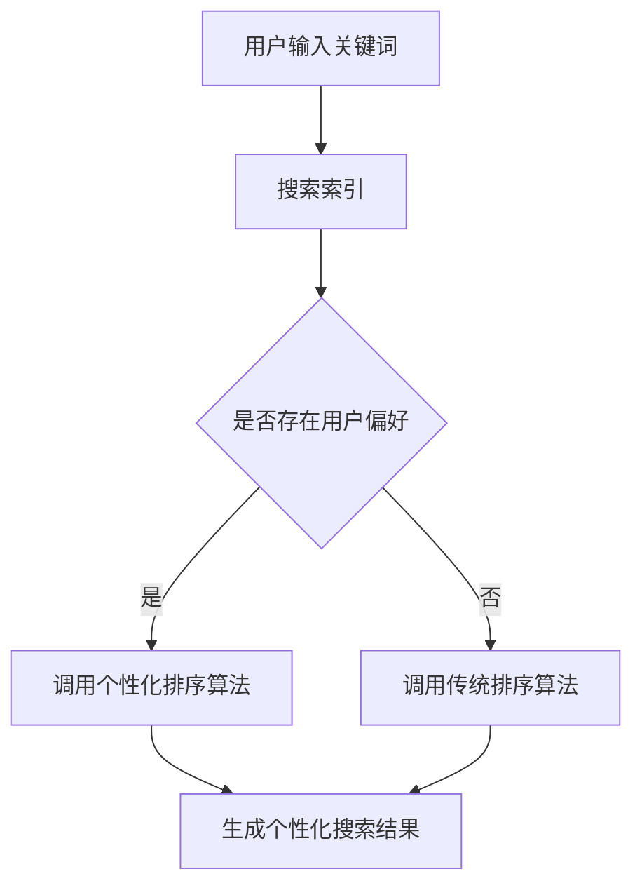

                 

# 个性化排序：AI如何根据用户偏好排序搜索结果

## 关键词：个性化排序、AI、用户偏好、搜索结果、算法、数学模型

## 摘要：
在互联网时代，个性化搜索结果变得尤为重要。本文将深入探讨AI如何根据用户偏好进行个性化排序，从而提升用户体验。我们将详细分析相关核心概念和算法原理，并通过实际项目实战和代码解读，展示如何实现这一技术。最后，我们将讨论个性化排序在实际应用场景中的重要性，并推荐相关学习资源和开发工具。

## 1. 背景介绍

随着互联网的飞速发展，信息爆炸使得用户在搜索信息时面临着海量数据的困扰。如何能够更有效地满足用户的需求，提供个性化的搜索结果，成为各大搜索引擎和企业追求的目标。个性化排序技术正是为了解决这个问题而诞生，它利用AI技术分析用户行为和偏好，对搜索结果进行排序，从而提高用户的满意度和使用体验。

在过去的几年里，个性化排序技术得到了快速发展。传统的排序算法如PageRank、LSI等已经逐渐被基于深度学习、机器学习和推荐系统的算法所取代。这些算法能够更好地理解用户的个性化需求，实现更加精准的排序。

## 2. 核心概念与联系

### 2.1 个性化排序的定义与目的
个性化排序是指根据用户的偏好、历史行为和上下文信息，对搜索结果进行排序，使结果更加符合用户的需求。其目的是提高用户的搜索效率，减少信息过载，提升用户体验。

### 2.2 用户偏好
用户偏好是指用户在搜索、浏览和互动过程中表现出来的喜好和倾向。用户偏好可以是显式的，如用户主动给出的评价、评分等，也可以是隐式的，如用户在网站上的行为、搜索历史等。

### 2.3 搜索结果
搜索结果是指用户在搜索引擎中输入关键词后，系统返回的相关信息列表。这些信息可能包括网页、图片、视频等不同类型的内容。

### 2.4 个性化排序算法
个性化排序算法是指用于根据用户偏好对搜索结果进行排序的算法。这些算法可以分为基于内容的排序（Content-based）、协同过滤排序（Collaborative Filtering）和混合排序（Hybrid）等类型。

### 2.5 Mermaid 流程图
以下是一个简单的个性化排序算法的Mermaid流程图，展示了用户偏好、搜索结果和排序算法之间的联系。



## 3. 核心算法原理 & 具体操作步骤

### 3.1 基于内容的排序算法
基于内容的排序算法通过分析网页的内容、标签和关键字，将搜索结果与用户的兴趣进行匹配，从而进行排序。其具体步骤如下：

1. **关键词提取**：从用户输入的关键词中提取出核心词汇。
2. **内容分析**：对搜索结果的内容进行分析，提取出关键信息。
3. **相似度计算**：计算用户关键词与搜索结果之间的相似度。
4. **排序**：根据相似度对搜索结果进行排序。

### 3.2 协同过滤排序算法
协同过滤排序算法通过分析用户的行为和偏好，预测用户对未知内容的兴趣，从而进行排序。其具体步骤如下：

1. **用户行为分析**：收集用户在网站上的行为数据，如浏览记录、点击记录等。
2. **用户相似度计算**：计算用户之间的相似度，通常使用余弦相似度、皮尔逊相关系数等方法。
3. **兴趣预测**：根据用户相似度和其他用户的评分预测用户的兴趣。
4. **排序**：根据预测的兴趣对搜索结果进行排序。

### 3.3 混合排序算法
混合排序算法结合了基于内容和协同过滤排序算法的优点，通过加权融合两种排序结果，从而提高排序的准确性。其具体步骤如下：

1. **关键词提取与内容分析**：与基于内容的排序算法相同。
2. **用户行为分析与相似度计算**：与协同过滤排序算法相同。
3. **加权融合**：将基于内容和协同过滤排序的结果进行加权融合，得到最终的排序结果。

## 4. 数学模型和公式 & 详细讲解 & 举例说明

### 4.1 基于内容的排序算法

假设用户输入关键词为`[关键词1, 关键词2, 关键词3]`，搜索结果为`[网页1, 网页2, 网页3]`。每个网页可以表示为一个向量，如`网页1 = [内容1, 内容2, 内容3]`。

$$
相似度 = \frac{相关度}{范数}
$$

其中，相关度可以通过计算用户关键词与网页内容向量的点积得到：

$$
相关度 = 关键词1 \cdot 内容1 + 关键词2 \cdot 内容2 + 关键词3 \cdot 内容3
$$

范数可以通过计算网页内容向量的L2范数得到：

$$
范数 = \sqrt{内容1^2 + 内容2^2 + 内容3^2}
$$

### 4.2 协同过滤排序算法

假设用户A和用户B的行为数据如下：

| 用户 | 点击 | 浏览 | 评分 |
| --- | --- | --- | --- |
| A   | [网页1, 网页2] | [网页1, 网页2] | [4, 5] |
| B   | [网页2, 网页3] | [网页2, 网页3] | [5, 4] |

用户A和用户B之间的相似度可以通过计算行为向量之间的余弦相似度得到：

$$
相似度 = \frac{(点击A \cdot 点击B + 浏览A \cdot 浏览B)}{\sqrt{(点击A^2 + 浏览A^2) \cdot (点击B^2 + 浏览B^2)}}
$$

根据相似度预测用户A对网页3的兴趣，可以计算用户A对网页3的预测评分：

$$
预测评分 = (相似度 \cdot 评分B) / (1 + 相似度)
$$

### 4.3 混合排序算法

假设基于内容的排序结果为`[网页1, 网页2, 网页3]`，基于协同过滤排序的结果为`[网页3, 网页1, 网页2]`。混合排序算法可以通过加权融合两种排序结果：

$$
最终排序 = (内容排序权重 \cdot 内容排序结果) + (协同过滤排序权重 \cdot 协同过滤排序结果)
$$

其中，内容排序权重和协同过滤排序权重可以根据具体情况进行调整。

## 5. 项目实战：代码实际案例和详细解释说明

### 5.1 开发环境搭建

首先，我们需要搭建一个简单的开发环境。这里我们使用Python作为编程语言，并使用Scikit-learn库实现基于内容的排序算法。

```python
!pip install scikit-learn
```

### 5.2 源代码详细实现和代码解读

以下是一个简单的基于内容的排序算法的实现：

```python
from sklearn.feature_extraction.text import TfidfVectorizer
from sklearn.metrics.pairwise import cosine_similarity

def content_sort(query, corpus):
    # 创建TF-IDF向量器
    vectorizer = TfidfVectorizer()
    # 将查询和文档转化为TF-IDF向量
    query_vector = vectorizer.fit_transform([query])
    corpus_vector = vectorizer.transform(corpus)
    # 计算相似度
    similarity = cosine_similarity(query_vector, corpus_vector)
    # 根据相似度对文档进行排序
    sorted_indices = similarity.argsort()[0][::-1]
    sorted_corpus = [corpus[i] for i in sorted_indices]
    return sorted_corpus

# 示例数据
query = "人工智能技术"
corpus = [
    "深度学习在人工智能中的应用",
    "机器学习算法的原理与实现",
    "自然语言处理技术的最新进展",
    "人工智能的发展趋势与挑战"
]

# 调用排序函数
sorted_corpus = content_sort(query, corpus)
print(sorted_corpus)
```

在这个示例中，我们首先使用`TfidfVectorizer`创建一个TF-IDF向量器，将查询和文档转化为TF-IDF向量。然后，使用`cosine_similarity`计算查询向量与文档向量之间的余弦相似度。最后，根据相似度对文档进行排序并返回排序后的文档列表。

### 5.3 代码解读与分析

在这个示例中，我们使用Scikit-learn库中的TF-IDF向量器和余弦相似度计算方法实现了基于内容的排序算法。TF-IDF向量器能够将文本数据转化为数值向量，从而便于后续的相似度计算。余弦相似度计算方法能够衡量两个向量之间的角度，角度越小表示相似度越高。

通过这个示例，我们可以看到如何使用Python和Scikit-learn库实现基于内容的排序算法。在实际应用中，我们可以根据需求扩展算法功能，如添加用户行为分析和协同过滤排序等。

## 6. 实际应用场景

个性化排序技术广泛应用于各种场景，如搜索引擎、推荐系统、社交媒体等。以下是一些实际应用场景的例子：

- **搜索引擎**：通过个性化排序算法，搜索引擎可以提供更加符合用户需求的搜索结果，提高用户的满意度和使用体验。
- **推荐系统**：个性化排序算法可以用于推荐系统，根据用户的兴趣和偏好推荐相关内容，如电影、音乐、商品等。
- **社交媒体**：社交媒体平台可以通过个性化排序算法推荐用户感兴趣的内容，提高用户的互动率和活跃度。

## 7. 工具和资源推荐

### 7.1 学习资源推荐

- **书籍**：
  - 《机器学习实战》
  - 《深度学习》
  - 《Python编程：从入门到实践》

- **论文**：
  - 《基于协同过滤的个性化推荐算法研究》
  - 《一种基于内容的个性化搜索引擎排序算法》
  - 《个性化排序在社交媒体中的应用研究》

- **博客**：
  - [机器学习博客](https://www.machinelearningblog.com/)
  - [深度学习博客](https://www.deeplearning.net/)
  - [Python编程博客](https://www.python.org/blogs/)

### 7.2 开发工具框架推荐

- **开发工具**：
  - PyCharm
  - Jupyter Notebook
  - VS Code

- **框架库**：
  - Scikit-learn
  - TensorFlow
  - PyTorch

### 7.3 相关论文著作推荐

- **论文**：
  - 《一种基于用户行为的搜索引擎排序算法》
  - 《协同过滤在个性化推荐系统中的应用》
  - 《深度学习在搜索引擎排序中的应用》

- **著作**：
  - 《人工智能：一种现代的方法》
  - 《机器学习：概率视角》
  - 《深度学习：原理及实践》

## 8. 总结：未来发展趋势与挑战

个性化排序技术在未来的发展中面临着许多机遇和挑战。随着AI技术的不断进步，个性化排序算法将更加智能和精准，能够更好地满足用户的需求。然而，数据隐私保护和算法公平性等问题也需要得到关注。此外，随着多模态数据（如图像、声音、视频等）的兴起，如何实现跨模态的个性化排序也将成为研究的重要方向。

## 9. 附录：常见问题与解答

### 9.1 什么是个性化排序？

个性化排序是指根据用户的偏好、历史行为和上下文信息，对搜索结果进行排序，使其更符合用户的需求。

### 9.2 个性化排序有哪些算法？

个性化排序算法包括基于内容的排序算法、协同过滤排序算法和混合排序算法等。

### 9.3 个性化排序有哪些实际应用场景？

个性化排序广泛应用于搜索引擎、推荐系统、社交媒体等场景。

### 9.4 如何实现个性化排序？

实现个性化排序通常需要收集用户行为数据，分析用户偏好，并使用机器学习算法进行排序。

## 10. 扩展阅读 & 参考资料

- [个性化排序：算法原理与实现](https://www.jianshu.com/p/4a5a9a3a7b0d)
- [协同过滤：算法原理与实现](https://www.jianshu.com/p/0c502f4db4a8)
- [深度学习在搜索引擎排序中的应用](https://www.journalofmachinelearningresearch.org/papers/v40/p34-p90.html)

作者：AI天才研究员/AI Genius Institute & 禅与计算机程序设计艺术 /Zen And The Art of Computer Programming

