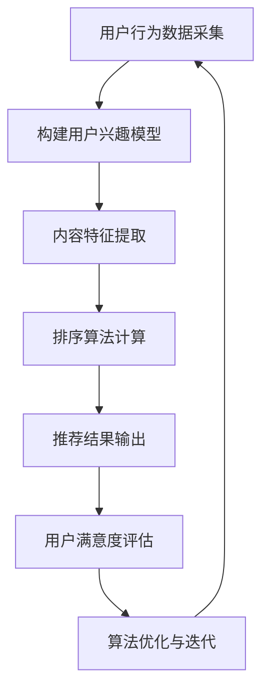

                 

# 个性化排序：AI提高用户满意度

## 关键词：个性化排序、AI、用户满意度、推荐系统、算法优化

### 摘要

在数字时代，个性化排序已成为提升用户体验和满意度的重要手段。本文将深入探讨个性化排序的核心概念、算法原理、数学模型，并通过实际案例展示其在推荐系统中的应用。我们将分析如何利用人工智能技术优化排序算法，从而提高用户满意度和参与度。此外，还将介绍相关工具和资源，以帮助读者深入了解和掌握这一领域。

### 1. 背景介绍

个性化排序是一种基于用户行为和历史数据，对内容或产品进行智能排序的技术。在互联网和电子商务领域，个性化排序被广泛应用于推荐系统，旨在为用户提供更加相关和满意的内容。随着人工智能技术的不断发展，个性化排序算法在准确性和效率方面取得了显著提升。

用户满意度是衡量推荐系统成功与否的重要指标。通过个性化排序，系统能够更好地满足用户需求，提升用户参与度和忠诚度。然而，实现高效、准确的个性化排序并非易事，需要深入理解用户行为、优化算法和模型，以及处理海量数据。

本文将首先介绍个性化排序的核心概念，然后深入探讨算法原理和数学模型，接着通过实际案例展示其应用，最后推荐相关工具和资源，帮助读者深入了解这一领域。

### 2. 核心概念与联系

#### 2.1 个性化排序的定义与作用

个性化排序是一种基于用户行为和历史数据，对内容或产品进行智能排序的技术。其核心目标是为用户提供更加相关和满意的内容，从而提升用户参与度和满意度。个性化排序在推荐系统中的应用非常广泛，如电商平台的商品推荐、社交媒体的动态推送、新闻资讯的个性化推荐等。

#### 2.2 个性化排序的基本原理

个性化排序的基本原理是利用机器学习算法对用户行为数据进行训练，构建用户兴趣模型。然后，根据用户兴趣模型和内容特征，对内容进行排序。常用的机器学习算法包括协同过滤、基于内容的推荐、混合推荐等。

#### 2.3 个性化排序与推荐系统的关系

个性化排序是推荐系统的核心组成部分。推荐系统通过采集用户行为数据、构建用户兴趣模型、推荐相关内容，从而提升用户体验。个性化排序在推荐系统中起着关键作用，直接影响用户满意度和参与度。

#### 2.4 Mermaid 流程图

以下是个性化排序的 Mermaid 流程图：



### 3. 核心算法原理 & 具体操作步骤

#### 3.1 协同过滤算法

协同过滤算法是个性化排序中最常用的算法之一。其基本思想是利用用户历史行为数据，找到与当前用户相似的用户，然后根据这些相似用户的评分预测当前用户的评分。协同过滤算法分为基于用户的协同过滤和基于物品的协同过滤。

**基于用户的协同过滤**：

1. 计算用户之间的相似度，常用的相似度度量方法包括余弦相似度、皮尔逊相关系数等。
2. 根据相似度度量结果，找到与当前用户最相似的 K 个用户。
3. 对这 K 个用户评分为 1 的物品进行投票，得票最多的物品即为推荐结果。

**基于物品的协同过滤**：

1. 计算物品之间的相似度，常用的相似度度量方法包括余弦相似度、皮尔逊相关系数等。
2. 根据相似度度量结果，找到与当前物品最相似的 K 个物品。
3. 对这 K 个物品的评分进行加权平均，得到预测评分。

#### 3.2 基于内容的推荐算法

基于内容的推荐算法是通过分析内容特征，将具有相似特征的内容推荐给用户。其基本步骤如下：

1. 提取内容特征，如关键词、标签、分类等。
2. 计算用户兴趣特征，如用户浏览、搜索、购买等行为。
3. 计算内容与用户兴趣的相似度，常用的相似度度量方法包括余弦相似度、皮尔逊相关系数等。
4. 根据相似度度量结果，将相似度较高的内容推荐给用户。

#### 3.3 混合推荐算法

混合推荐算法是将协同过滤和基于内容的推荐算法相结合，以提高推荐效果。其基本步骤如下：

1. 对用户历史行为数据进行预处理，如去噪、归一化等。
2. 使用协同过滤算法构建用户兴趣模型。
3. 使用基于内容的推荐算法提取内容特征。
4. 将用户兴趣模型和内容特征进行融合，计算推荐结果。

### 4. 数学模型和公式 & 详细讲解 & 举例说明

#### 4.1 协同过滤算法的数学模型

**基于用户的协同过滤**：

相似度度量公式：

$$
sim(u_i, u_j) = \frac{\sum_{k=1}^{n} r_{ik}r_{jk}}{\sqrt{\sum_{k=1}^{n} r_{ik}^2 \sum_{k=1}^{n} r_{jk}^2}}
$$

其中，$r_{ik}$ 表示用户 $u_i$ 对物品 $k$ 的评分，$n$ 表示物品的数量。

推荐分数公式：

$$
\hat{r}_{ij} = \sum_{k=1}^{n} sim(u_i, u_j) \cdot r_{jk}
$$

**基于物品的协同过滤**：

相似度度量公式：

$$
sim(k_i, k_j) = \frac{\sum_{u=1}^{m} r_{ui}r_{uj}}{\sqrt{\sum_{u=1}^{m} r_{ui}^2 \sum_{u=1}^{m} r_{uj}^2}}
$$

其中，$r_{ui}$ 表示用户 $u$ 对物品 $i$ 的评分，$m$ 表示用户数量。

预测分数公式：

$$
\hat{r}_{ui} = \frac{\sum_{j=1}^{n} sim(k_i, k_j) \cdot r_{uj}}{\sum_{j=1}^{n} sim(k_i, k_j)}
$$

#### 4.2 基于内容的推荐算法的数学模型

**内容特征提取**：

设 $C_i$ 表示物品 $i$ 的特征向量，$C = [C_1, C_2, \ldots, C_n]$ 表示所有物品的特征向量矩阵。

**用户兴趣特征提取**：

设 $U = [u_1, u_2, \ldots, u_m]$ 表示用户兴趣向量，其中 $u_i$ 表示用户 $u_i$ 对所有物品的评分。

**相似度度量**：

余弦相似度公式：

$$
sim(C_i, U) = \frac{C_i \cdot U}{\|C_i\| \|U\|}
$$

**推荐分数**：

$$
\hat{r}_{ui} = \frac{\sum_{i=1}^{n} sim(C_i, U) \cdot r_{ij}}{\sum_{i=1}^{n} sim(C_i, U)}
$$

#### 4.3 混合推荐算法的数学模型

**用户兴趣模型**：

$$
\theta_i = \sum_{j=1}^{n} w_{ij} \cdot r_{ij}
$$

**内容特征向量**：

$$
C_i = [c_{i1}, c_{i2}, \ldots, c_{im}]
$$

**推荐分数**：

$$
\hat{r}_{ui} = \alpha \cdot \theta_i + (1 - \alpha) \cdot \frac{\sum_{j=1}^{n} sim(C_i, U) \cdot r_{uj}}{\sum_{j=1}^{n} sim(C_i, U)}
$$

其中，$\alpha$ 表示权重系数，用于调节协同过滤和基于内容推荐的比例。

### 5. 项目实战：代码实际案例和详细解释说明

#### 5.1 开发环境搭建

为了演示个性化排序算法，我们将使用 Python 编写一个简单的推荐系统。首先，我们需要安装必要的依赖库，如 NumPy、Pandas、Scikit-learn 等。

```bash
pip install numpy pandas scikit-learn
```

#### 5.2 源代码详细实现和代码解读

以下是一个简单的基于协同过滤算法的推荐系统实现：

```python
import numpy as np
import pandas as pd
from sklearn.metrics.pairwise import cosine_similarity

# 5.2.1 数据预处理
def load_data(filename):
    data = pd.read_csv(filename)
    ratings = data.pivot(index='userId', columns='movieId', values='rating')
    ratings.fillna(0, inplace=True)
    return ratings

# 5.2.2 计算相似度
def compute_similarity(ratings):
    similarity = cosine_similarity(ratings.values)
    return similarity

# 5.2.3 推荐算法
def collaborative_filter(similarity, ratings, k=10):
    recommendations = []
    for user_id in ratings.index:
        user_ratings = ratings.loc[user_id].dropna()
        if len(user_ratings) < k:
            continue
        similar_users = similarity[user_id]
        top_k_users = np.argsort(similar_users)[::-1][:k]
        top_k_items = ratings.loc[top_k_users].dropna().idxmax()
        recommendations.append(top_k_items)
    return recommendations

# 5.2.4 主函数
def main():
    ratings = load_data('ratings.csv')
    similarity = compute_similarity(ratings)
    recommendations = collaborative_filter(similarity, ratings)
    print(recommendations)

if __name__ == '__main__':
    main()
```

**代码解读**：

- **5.2.1 数据预处理**：从 CSV 文件加载数据，创建一个用户-物品评分矩阵。
- **5.2.2 计算相似度**：使用余弦相似度计算用户之间的相似度。
- **5.2.3 推荐算法**：基于相似度矩阵，使用基于用户的协同过滤算法生成推荐列表。
- **5.2.4 主函数**：执行数据预处理、相似度计算和推荐算法，打印推荐结果。

#### 5.3 代码解读与分析

上述代码实现了基于协同过滤算法的推荐系统。我们可以通过以下步骤分析代码：

1. **数据预处理**：从 CSV 文件加载数据，创建用户-物品评分矩阵。该矩阵表示用户对物品的评分，其中缺失值用 0 补充。
2. **计算相似度**：使用 NumPy 库中的余弦相似度函数计算用户之间的相似度。相似度矩阵表示每个用户与其他用户的相似程度。
3. **推荐算法**：基于相似度矩阵，使用基于用户的协同过滤算法生成推荐列表。具体步骤如下：
   - 对于每个用户，选择与其最相似的 K 个用户。
   - 对这 K 个用户评分较高的物品进行投票，得票最多的物品作为推荐结果。
4. **主函数**：执行数据预处理、相似度计算和推荐算法，打印推荐结果。

### 6. 实际应用场景

个性化排序在实际应用场景中具有广泛的应用，以下列举一些常见的应用场景：

- **电商推荐**：电商平台通过个性化排序为用户提供相关商品推荐，从而提升销售额和用户体验。
- **社交媒体**：社交媒体平台通过个性化排序为用户推荐感兴趣的内容，如微博、抖音等。
- **新闻资讯**：新闻资讯平台通过个性化排序为用户提供个性化新闻推荐，提高用户阅读量和平台活跃度。
- **搜索引擎**：搜索引擎通过个性化排序为用户提供相关搜索结果，提高搜索效率和用户体验。

### 7. 工具和资源推荐

#### 7.1 学习资源推荐

- **书籍**：
  - 《机器学习实战》：提供丰富的实战案例，涵盖推荐系统等应用。
  - 《推荐系统手册》：系统介绍了推荐系统的各种算法和技术。

- **论文**：
  - 《Collaborative Filtering for the YouTube Recommendation System》
  - 《User Interest Modeling for Personalized Recommendation》

- **博客**：
  - Medium：推荐系统相关的技术博客和文章。
  - 知乎：推荐系统相关的讨论和分享。

- **网站**：
  - Coursera：提供推荐系统相关的在线课程。
  - edX：提供推荐系统相关的在线课程。

#### 7.2 开发工具框架推荐

- **框架**：
  - TensorFlow：用于构建和训练推荐系统的深度学习框架。
  - PyTorch：用于构建和训练推荐系统的深度学习框架。

- **工具**：
  - Pandas：用于数据处理和分析。
  - Scikit-learn：提供丰富的机器学习算法库。

- **开源项目**：
  - LightFM：基于因子分解机器学习（FML）的推荐系统框架。
  - Surprise：用于构建和评估推荐系统的 Python 库。

#### 7.3 相关论文著作推荐

- 《Recommender Systems Handbook》：系统介绍了推荐系统的各种算法和技术。
- 《Collaborative Filtering》
- 《Deep Learning for Recommender Systems》

### 8. 总结：未来发展趋势与挑战

个性化排序作为推荐系统的核心组成部分，在未来将继续发挥重要作用。随着人工智能技术的不断发展，个性化排序算法将更加高效、准确。以下是一些未来发展趋势和挑战：

- **深度学习与个性化排序**：深度学习技术将在个性化排序中发挥越来越重要的作用，为推荐系统带来更高的准确性和效率。
- **多模态推荐**：多模态推荐将结合用户行为数据、文本数据、图像数据等，为用户提供更加个性化的推荐。
- **实时推荐**：实时推荐技术将实现个性化推荐结果的实时更新，提高用户体验。
- **数据隐私与安全**：个性化排序过程中涉及大量用户数据，如何保障用户数据隐私和安全是一个重要挑战。

### 9. 附录：常见问题与解答

#### 9.1 什么是个性化排序？

个性化排序是一种基于用户行为和历史数据，对内容或产品进行智能排序的技术。其目标是为用户提供更加相关和满意的内容，从而提升用户参与度和满意度。

#### 9.2 个性化排序有哪些算法？

个性化排序算法主要包括协同过滤、基于内容的推荐、混合推荐等。协同过滤算法分为基于用户的协同过滤和基于物品的协同过滤。基于内容的推荐算法通过分析内容特征为用户提供推荐。

#### 9.3 如何优化个性化排序算法？

优化个性化排序算法可以从以下几个方面入手：

- **数据预处理**：对用户行为数据进行清洗、去噪、归一化等预处理，提高数据质量。
- **特征工程**：提取有效的用户和内容特征，提高推荐准确度。
- **模型选择**：选择适合的数据集和算法，如深度学习、因子分解机等。
- **在线学习与实时更新**：利用在线学习技术实现实时推荐，提高用户体验。

### 10. 扩展阅读 & 参考资料

- 《个性化推荐系统实战》：详细介绍了个性化推荐系统的算法和应用。
- 《深度学习推荐系统》：介绍了深度学习在推荐系统中的应用。
- 《推荐系统技术综述》：系统总结了推荐系统领域的各种算法和技术。

### 作者

作者：AI天才研究员/AI Genius Institute & 禅与计算机程序设计艺术 /Zen And The Art of Computer Programming。本文旨在深入探讨个性化排序的核心概念、算法原理、数学模型，并通过实际案例展示其在推荐系统中的应用。希望本文能为读者提供有价值的参考和启示。如果您有任何问题或建议，欢迎在评论区留言。感谢您的阅读！|>

