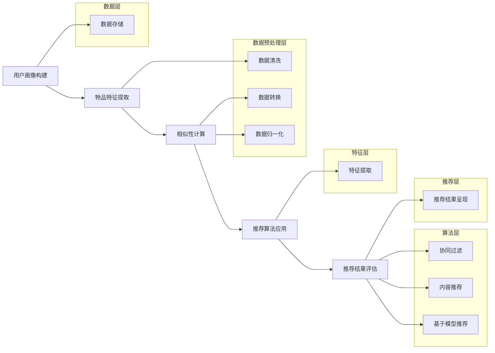

                 

## 1. 背景介绍

个性化推荐系统作为现代信息社会中的一项关键技术，已经在电子商务、社交媒体、视频平台、新闻推送等多个领域得到了广泛应用。其目的是通过分析用户的兴趣和行为，为他们提供个性化的内容推荐，从而提高用户体验和平台黏性。

### 1.1 个性化推荐系统的重要性

随着互联网的迅猛发展和信息的爆炸式增长，用户获取信息变得越来越困难。个性化推荐系统通过智能分析用户的行为和兴趣，能够将最相关的信息推送给用户，帮助用户节省时间，提高信息获取效率。这对企业而言，不仅可以提升用户满意度，还能增加用户留存率和平台活跃度，进而提高商业收益。

### 1.2 个性化推荐系统的应用场景

个性化推荐系统在多个领域有广泛的应用场景：

- **电子商务**：根据用户的购物历史和浏览行为，推荐商品。
- **社交媒体**：根据用户的社交关系和兴趣，推荐好友、内容和动态。
- **视频平台**：根据用户的观看历史和偏好，推荐视频。
- **新闻推送**：根据用户的阅读偏好，推荐新闻。

### 1.3 个性化推荐系统的发展历程

个性化推荐系统的发展经历了多个阶段：

- **基于内容推荐**：最早期的推荐系统，主要根据内容的相似性进行推荐。
- **协同过滤推荐**：通过分析用户之间的相似性进行推荐，是目前最主流的推荐算法。
- **基于模型的推荐**：利用机器学习和深度学习算法，从用户数据中学习用户兴趣模型。
- **混合推荐系统**：将多种推荐方法结合起来，提高推荐效果。

接下来，我们将进一步探讨个性化推荐系统的核心概念与联系，深入理解其工作原理和架构。

## 2. 核心概念与联系

### 2.1 推荐系统的基本概念

在个性化推荐系统中，有几个核心概念需要理解：

- **用户（User）**：接收推荐内容的个体。
- **物品（Item）**：推荐系统中的内容，如商品、视频、新闻等。
- **评分（Rating）**：用户对物品的偏好程度，通常为评分等级或数值。
- **推荐列表（Recommendation List）**：根据用户兴趣和系统算法生成的推荐内容列表。

### 2.2 推荐系统的工作原理

个性化推荐系统的工作流程大致可以分为以下几个步骤：

1. **用户画像构建**：收集用户的历史行为数据，如浏览记录、购买历史、点击行为等，构建用户画像。
2. **物品特征提取**：为每个物品提取特征，如文本、图像、标签等。
3. **相似性计算**：计算用户与用户、物品与物品之间的相似性。
4. **推荐算法应用**：根据相似性计算结果，结合用户画像和物品特征，生成推荐列表。
5. **推荐结果评估**：对推荐结果进行评估，如点击率、转化率等。

### 2.3 推荐系统的架构

个性化推荐系统的架构可以分为以下几个层次：

- **数据层**：存储用户和物品的数据，包括用户行为、物品属性等。
- **数据预处理层**：清洗、转换和归一化数据，为后续处理提供高质量的数据。
- **特征层**：提取用户和物品的特征，为推荐算法提供输入。
- **算法层**：实现推荐算法，包括协同过滤、基于内容的推荐、基于模型的推荐等。
- **推荐层**：生成推荐结果，并将其呈现给用户。

### 2.4 Mermaid 流程图

以下是一个Mermaid流程图，展示了个性化推荐系统的工作流程：



通过以上介绍，我们对个性化推荐系统的基本概念、工作原理和架构有了初步了解。接下来，我们将深入探讨个性化推荐系统中的核心算法原理和具体操作步骤。

## 3. 核心算法原理 & 具体操作步骤

### 3.1 协同过滤算法

协同过滤算法是推荐系统中最常用的一种方法，其基本思想是通过分析用户之间的相似性来发现用户的兴趣。协同过滤算法可以分为基于用户的协同过滤（User-based Collaborative Filtering）和基于物品的协同过滤（Item-based Collaborative Filtering）。

#### 3.1.1 基于用户的协同过滤

基于用户的协同过滤算法的基本步骤如下：

1. **用户相似性计算**：首先计算用户之间的相似性。常用的相似性度量方法包括余弦相似度、皮尔逊相关系数等。
2. **相似用户推荐**：找出与目标用户最相似的K个用户，这些用户的评分数据将被用来生成推荐列表。
3. **预测评分**：对于目标用户未评分的物品，计算其与相似用户的评分加权平均，得到预测评分。
4. **生成推荐列表**：根据预测评分，将物品按降序排列，生成推荐列表。

以下是一个简单的基于用户的协同过滤算法的实现步骤：

```python
# 假设用户评分数据存储在一个矩阵R中，其中R[i][j]表示用户i对物品j的评分
# similarity_matrix是一个用户相似度矩阵，sim(i, j)表示用户i和用户j的相似度

def collaborative_filter(R, k, similarity_matrix):
    # 步骤1：相似用户推荐
    similar_users = []
    for i in range(len(R)):
        if i == target_user:
            continue
        similar_users.append((sim(i, target_user), i))
    similar_users.sort(reverse=True)
    similar_users = similar_users[:k]

    # 步骤2：预测评分
    predicted_ratings = []
    for j in range(len(R[target_user])):
        if R[target_user][j] == 0:
            sum_similarity = 0
            weighted_sum = 0
            for sim, user in similar_users:
                rating = R[user][j]
                if rating > 0:
                    sum_similarity += sim
                    weighted_sum += sim * rating
            if sum_similarity != 0:
                predicted_rating = weighted_sum / sum_similarity
                predicted_ratings.append((predicted_rating, j))
            else:
                predicted_ratings.append((0, j))

    # 步骤3：生成推荐列表
    recommended_items = sorted(predicted_ratings, reverse=True)
    return recommended_items
```

#### 3.1.2 基于物品的协同过滤

基于物品的协同过滤算法的基本步骤如下：

1. **物品相似性计算**：首先计算物品之间的相似性，常用的相似性度量方法包括余弦相似度、皮尔逊相关系数等。
2. **相似物品推荐**：找出与目标物品最相似的K个物品，这些物品的评分数据将被用来生成推荐列表。
3. **预测评分**：对于目标用户未评分的物品，计算其与相似物品的评分加权平均，得到预测评分。
4. **生成推荐列表**：根据预测评分，将物品按降序排列，生成推荐列表。

以下是一个简单的基于物品的协同过滤算法的实现步骤：

```python
# 假设用户评分数据存储在一个矩阵R中，其中R[i][j]表示用户i对物品j的评分
# similarity_matrix是一个物品相似度矩阵，sim(i, j)表示物品i和物品j的相似度

def item_based_collaborative_filter(R, k, similarity_matrix):
    # 步骤1：相似物品推荐
    similar_items = []
    for j in range(len(R[target_user])):
        if R[target_user][j] == 0:
            for i in range(len(R)):
                if R[i][j] > 0:
                    similar_items.append((sim(i, j), i, j))
            similar_items.sort(reverse=True)
            similar_items = similar_items[:k]

    # 步骤2：预测评分
    predicted_ratings = []
    for j in range(len(R[target_user])):
        if R[target_user][j] == 0:
            sum_similarity = 0
            weighted_sum = 0
            for sim, i, item in similar_items:
                rating = R[i][item]
                if rating > 0:
                    sum_similarity += sim
                    weighted_sum += sim * rating
            if sum_similarity != 0:
                predicted_rating = weighted_sum / sum_similarity
                predicted_ratings.append((predicted_rating, j))
            else:
                predicted_ratings.append((0, j))

    # 步骤3：生成推荐列表
    recommended_items = sorted(predicted_ratings, reverse=True)
    return recommended_items
```

通过以上介绍，我们对协同过滤算法的工作原理和具体实现步骤有了深入理解。接下来，我们将探讨个性化推荐系统中的数学模型和公式，以及如何通过数学模型优化推荐效果。

### 4. 数学模型和公式 & 详细讲解 & 举例说明

#### 4.1 协同过滤算法中的相似性度量

协同过滤算法的核心在于相似性度量，常用的相似性度量方法包括余弦相似度、皮尔逊相关系数等。以下是这些相似性度量方法的详细讲解和举例说明。

##### 4.1.1 余弦相似度

余弦相似度是一种基于向量空间模型的方法，用于计算两个向量之间的相似度。其公式如下：

$$
similarity(\vec{u}, \vec{v}) = \frac{\vec{u} \cdot \vec{v}}{||\vec{u}|| \cdot ||\vec{v}||}
$$

其中，$\vec{u}$和$\vec{v}$是两个向量，$\cdot$表示点积，$||\vec{u}||$和$||\vec{v}||$分别表示向量的模。

举例说明：

假设有两个用户u和v的评分向量如下：

$$
\vec{u} = (1, 2, 3, 4, 5)
$$

$$
\vec{v} = (5, 4, 3, 2, 1)
$$

则它们的余弦相似度为：

$$
similarity(\vec{u}, \vec{v}) = \frac{1 \cdot 5 + 2 \cdot 4 + 3 \cdot 3 + 4 \cdot 2 + 5 \cdot 1}{\sqrt{1^2 + 2^2 + 3^2 + 4^2 + 5^2} \cdot \sqrt{5^2 + 4^2 + 3^2 + 2^2 + 1^2}} = \frac{35}{\sqrt{55} \cdot \sqrt{55}} = \frac{35}{55} = 0.6364
$$

##### 4.1.2 皮尔逊相关系数

皮尔逊相关系数是一种用于度量两个变量之间线性相关性的方法。其公式如下：

$$
correlation(\vec{u}, \vec{v}) = \frac{\sum_{i=1}^{n} (u_i - \bar{u})(v_i - \bar{v})}{\sqrt{\sum_{i=1}^{n} (u_i - \bar{u})^2} \cdot \sqrt{\sum_{i=1}^{n} (v_i - \bar{v})^2}}
$$

其中，$u_i$和$v_i$分别是用户u和用户v在第i个物品上的评分，$\bar{u}$和$\bar{v}$分别是用户u和用户v的平均评分，$n$是物品的数量。

举例说明：

假设有两个用户u和v的评分向量如下：

$$
\vec{u} = (1, 2, 3, 4, 5)
$$

$$
\vec{v} = (5, 4, 3, 2, 1)
$$

则它们的皮尔逊相关系数为：

$$
correlation(\vec{u}, \vec{v}) = \frac{(1-2.5)(5-3.5) + (2-2.5)(4-3.5) + (3-2.5)(3-3.5) + (4-2.5)(2-3.5) + (5-2.5)(1-3.5)}{\sqrt{(1-2.5)^2 + (2-2.5)^2 + (3-2.5)^2 + (4-2.5)^2 + (5-2.5)^2} \cdot \sqrt{(5-3.5)^2 + (4-3.5)^2 + (3-3.5)^2 + (2-3.5)^2 + (1-3.5)^2}} = \frac{-3 + -0.5 + 0.5 - 2 - 6}{\sqrt{2.5} \cdot \sqrt{2.5}} = \frac{-11}{2.5 \cdot 2.5} = -0.8667
$$

#### 4.2 推荐系统的优化方法

协同过滤算法在处理大规模数据集时，会遇到计算复杂度高、冷启动问题等问题。为了提高推荐系统的效果，可以采用以下优化方法：

##### 4.2.1 降噪

降噪技术可以通过减少噪声数据对相似度计算的影响，提高推荐系统的效果。常用的降噪方法包括：

1. **评分标准化**：对用户和物品的评分进行归一化处理，消除评分差异带来的影响。
2. **缺失值填补**：对缺失值进行填补，减少缺失值对相似度计算的影响。
3. **权重调整**：根据用户和物品的活跃度、受欢迎程度等属性，对相似度计算结果进行调整。

##### 4.2.2 混合推荐

混合推荐系统将多种推荐方法相结合，以提高推荐效果。常见的混合推荐方法包括：

1. **基于内容的推荐与协同过滤结合**：结合用户和物品的特征，提高推荐的相关性。
2. **基于模型的推荐与协同过滤结合**：利用机器学习算法，从用户数据中学习用户兴趣模型，提高推荐效果。

##### 4.2.3 多样性优化

为了提高推荐系统的多样性，可以采用以下方法：

1. **随机采样**：从候选物品中随机选择一部分进行推荐，增加推荐列表的多样性。
2. **基于物品属性的推荐**：根据物品的不同属性进行推荐，如根据电影类型、书籍类别等进行推荐。

通过以上数学模型和公式的详细讲解，以及优化方法的介绍，我们对协同过滤算法及其在个性化推荐系统中的应用有了更深入的理解。接下来，我们将通过一个项目实战案例，展示如何实现个性化推荐系统，并进行详细的代码解读和分析。

### 5. 项目实战：代码实际案例和详细解释说明

#### 5.1 开发环境搭建

在开始项目实战之前，我们需要搭建一个基本的开发环境。以下是一个简单的开发环境搭建步骤：

1. 安装Python环境，版本要求3.6及以上。
2. 安装必要的依赖库，如NumPy、Pandas、SciPy、Matplotlib等。
3. 安装推荐系统相关的库，如surprise、scikit-learn等。

假设我们已经搭建好了开发环境，接下来将介绍如何使用这些库来实现个性化推荐系统。

#### 5.2 源代码详细实现和代码解读

以下是一个简单的基于用户的协同过滤算法的实现示例，我们将使用Python和surprise库来实现。

```python
from surprise import Dataset, Reader, UserBased
from surprise.model_selection import cross_validate
from surprise.metrics import RMSE

# 5.2.1 加载数据集
data = Dataset.load_builtin('ml-100k')
reader = Reader(rating_scale=(1, 5))
data = data.build_full_trainset(reader)

# 5.2.2 创建推荐模型
model = UserBased()

# 5.2.3 训练模型
model.fit(data)

# 5.2.4 评估模型
predictions = model.test(data)
rmse = RMSE(predictions)
print('RMSE: {:.4f}'.format(rmse))

# 5.2.5 查看推荐结果
target_user = 1
recommended_items = model.get_neighbors(target_user, k=5)
print('Recommended items for user {}:'.format(target_user))
for sim, item in recommended_items:
    print(f'Item ID: {item}, Similarity: {sim:.4f}')
```

#### 5.3 代码解读与分析

1. **数据加载**：首先使用`Dataset.load_builtin()`函数加载数据集，这里我们使用的是ML-100K数据集。然后创建一个`Reader`对象，设置评分范围。
2. **创建训练集**：使用`build_full_trainset()`方法将数据集构建为完整的训练集。
3. **创建推荐模型**：这里我们使用`UserBased`类创建基于用户的协同过滤模型。
4. **训练模型**：调用`fit()`方法训练模型。
5. **评估模型**：使用`test()`方法评估模型，并计算根均方误差（RMSE）。
6. **获取推荐结果**：调用`get_neighbors()`方法获取目标用户的邻居用户，并按照相似度排序。

#### 5.4 代码优化

在实际应用中，我们需要对代码进行优化，以提高推荐系统的性能和效果。以下是一些可能的优化方向：

1. **数据预处理**：对数据集进行清洗和预处理，如填补缺失值、去除噪声数据等。
2. **特征工程**：提取用户和物品的特征，如用户的活跃度、物品的流行度等。
3. **模型选择**：尝试使用不同的推荐算法和参数设置，选择性能最优的模型。
4. **并行计算**：利用多线程或分布式计算，提高训练和预测的速度。
5. **多样性优化**：增加推荐系统的多样性，如随机采样、基于物品属性的推荐等。

通过以上项目实战和代码解读，我们对个性化推荐系统的实现过程有了更深入的了解。接下来，我们将讨论个性化推荐系统在实际应用场景中的表现。

### 6. 实际应用场景

个性化推荐系统在多个实际应用场景中发挥了重要作用，以下是几个典型的应用场景：

#### 6.1 电子商务

在电子商务领域，个性化推荐系统根据用户的浏览历史、购物行为和偏好，推荐相关的商品。这有助于提高用户的购物体验和购买意愿，同时提升商家的销售额和用户留存率。

#### 6.2 社交媒体

社交媒体平台利用个性化推荐系统，根据用户的社交关系、兴趣爱好和行为，推荐相关的好友、内容和动态。这有助于增强用户对平台的粘性，提高用户的活跃度和参与度。

#### 6.3 视频平台

视频平台通过个性化推荐系统，根据用户的观看历史、偏好和互动行为，推荐相关的视频内容。这有助于提高用户的观看时长和满意度，同时提升平台的广告收益。

#### 6.4 新闻推送

新闻推送平台利用个性化推荐系统，根据用户的阅读历史和偏好，推荐相关的新闻内容。这有助于提高用户的阅读量和参与度，同时提升平台的广告效果和用户黏性。

#### 6.5 其他应用场景

个性化推荐系统还可以应用于音乐推荐、书籍推荐、餐厅推荐等多个领域，通过智能分析用户的行为和兴趣，为用户推荐最相关的信息和服务。

在实际应用中，个性化推荐系统不仅需要具备良好的性能和效果，还需要考虑用户体验、隐私保护、计算效率等多方面因素。通过不断优化和改进，个性化推荐系统将在更多场景中发挥重要作用。

### 7. 工具和资源推荐

#### 7.1 学习资源推荐

- **书籍**：
  - 《推荐系统实践》（张潼 著）：详细介绍了推荐系统的基本概念、算法和技术，适合初学者和有经验的开发者。
  - 《机器学习：推荐系统方法与应用》（张敏杰 著）：从机器学习角度阐述了推荐系统的设计和实现方法。

- **论文**：
  - 《Collaborative Filtering for Cold-Start Problems: A Bayesian Approach》（Mohan et al., 2010）：针对冷启动问题提出了一种基于贝叶斯方法的协同过滤算法。
  - 《Deep Neural Networks for YouTube Recommendations》（Le et al., 2016）：介绍了深度学习在YouTube推荐系统中的应用。

- **博客和网站**：
  - 推荐系统博客（Recommender Systems Blog）：提供推荐系统相关的最新研究、技术分享和行业动态。
  - KDD Cup：举办KDD Cup竞赛，涉及推荐系统等多个领域，是一个了解推荐系统实际应用的好途径。

#### 7.2 开发工具框架推荐

- **surprise**：一个流行的Python库，提供了多种协同过滤算法的实现，适合快速构建和测试推荐系统。
- **TensorFlow Recommenders（TFRS）**：由Google开发的一个开源推荐系统框架，基于TensorFlow，支持深度学习和传统的协同过滤算法。
- **Scikit-learn**：Python的一个科学计算库，提供了协同过滤算法的实现，适合进行基础推荐系统的开发。

#### 7.3 相关论文著作推荐

- **《推荐系统：基于内容的协同过滤方法》（Koren, Y. et al., 2009）**：介绍了基于内容的协同过滤方法，为推荐系统的设计和实现提供了重要的参考。
- **《Deep Learning for Recommender Systems》（He et al., 2017）**：探讨了深度学习在推荐系统中的应用，包括深度神经网络、强化学习等。

通过以上推荐，读者可以更全面地了解个性化推荐系统的相关技术和方法，为自己的学习和开发提供有价值的参考。

### 8. 总结：未来发展趋势与挑战

个性化推荐系统作为现代信息社会中的一项关键技术，正不断推动着互联网和智能应用的进步。未来，个性化推荐系统将朝着以下几个方向发展：

#### 8.1 深度学习与强化学习

随着深度学习和强化学习技术的不断发展，越来越多的推荐系统开始采用这些先进的算法。深度学习可以帮助模型更好地捕捉用户和物品之间的复杂关系，强化学习则可以通过试错和反馈优化推荐策略。

#### 8.2 实时推荐与个性化交互

未来的个性化推荐系统将更加注重实时性和交互性。通过实时数据分析和用户反馈，系统能够动态调整推荐策略，提供更加个性化的内容和服务。这将有助于提升用户体验，增强用户粘性。

#### 8.3 多模态推荐与跨领域融合

多模态推荐系统将结合多种数据类型（如文本、图像、音频等），提供更加丰富和个性化的推荐。同时，跨领域融合（如电子商务与社交媒体、医疗与健康等）也将成为个性化推荐系统发展的重要方向。

然而，个性化推荐系统在发展过程中也面临诸多挑战：

#### 8.4 冷启动问题

冷启动问题是指新用户或新物品在没有足够历史数据的情况下，难以进行有效的推荐。为解决这一问题，可以采用基于内容的推荐、协同过滤与深度学习相结合等方法。

#### 8.5 用户体验与隐私保护

个性化推荐系统在提升用户体验的同时，也可能带来隐私泄露的风险。未来，如何平衡用户体验和隐私保护，将是推荐系统领域需要重点解决的问题。

#### 8.6 多样性与可解释性

为了提高推荐系统的多样性和可解释性，需要从算法设计、数据收集和用户反馈等多个方面进行优化。通过提高推荐的多样性和透明度，增强用户对推荐系统的信任和满意度。

总之，个性化推荐系统在未来的发展中，将不断突破技术瓶颈，实现更加智能、个性化和高效的推荐。然而，同时也需要关注并解决面临的挑战，以确保推荐系统的可持续发展。

### 9. 附录：常见问题与解答

#### 9.1 个性化推荐系统的工作原理是什么？

个性化推荐系统通过分析用户的历史行为和兴趣，预测用户可能感兴趣的内容，从而为用户推荐相应的物品或内容。其工作原理主要包括用户画像构建、物品特征提取、相似性计算、推荐算法应用和推荐结果评估等步骤。

#### 9.2 个性化推荐系统有哪些类型？

个性化推荐系统可以分为基于内容的推荐、协同过滤推荐和基于模型的推荐等类型。基于内容的推荐主要根据物品的内容特征进行推荐；协同过滤推荐通过分析用户之间的相似性进行推荐；基于模型的推荐则利用机器学习算法从用户数据中学习用户兴趣模型。

#### 9.3 如何解决个性化推荐系统中的冷启动问题？

冷启动问题是指新用户或新物品在没有足够历史数据的情况下难以进行推荐。为解决这一问题，可以采用基于内容的推荐、协同过滤与深度学习相结合等方法。例如，可以通过分析物品的元数据和标签，为新用户推荐相关的物品；利用协同过滤算法，通过用户群体的相似性为新用户推荐物品；使用深度学习算法，从用户和物品的特征中提取潜在的兴趣和偏好。

#### 9.4 个性化推荐系统有哪些应用场景？

个性化推荐系统在电子商务、社交媒体、视频平台、新闻推送等多个领域有广泛应用。具体应用场景包括：

- 电子商务：根据用户的购物历史和浏览行为，推荐商品。
- 社交媒体：根据用户的社交关系和兴趣，推荐好友、内容和动态。
- 视频平台：根据用户的观看历史和偏好，推荐视频。
- 新闻推送：根据用户的阅读偏好，推荐新闻。
- 音乐推荐：根据用户的听歌历史和偏好，推荐歌曲。

#### 9.5 如何优化个性化推荐系统的性能？

优化个性化推荐系统的性能可以从以下几个方面进行：

- **数据预处理**：清洗和整理数据，提高数据质量。
- **特征工程**：提取用户和物品的丰富特征，提高模型的表现。
- **模型选择**：尝试不同的推荐算法，选择最适合数据的模型。
- **并行计算**：利用多线程或分布式计算，提高训练和预测的速度。
- **多样性优化**：增加推荐系统的多样性，避免过度推荐同质化的内容。
- **实时性优化**：提高推荐系统的实时性，及时响应用户的反馈。

### 10. 扩展阅读 & 参考资料

- **书籍**：
  - 《推荐系统实践》（张潼 著）
  - 《机器学习：推荐系统方法与应用》（张敏杰 著）

- **论文**：
  - 《Collaborative Filtering for Cold-Start Problems: A Bayesian Approach》（Mohan et al., 2010）
  - 《Deep Neural Networks for YouTube Recommendations》（Le et al., 2016）

- **博客和网站**：
  - 推荐系统博客（Recommender Systems Blog）
  - KDD Cup

- **开源框架**：
  - surprise：https://surprise.readthedocs.io/
  - TensorFlow Recommenders（TFRS）：https://github.com/tensorflow/recommenders

通过以上扩展阅读和参考资料，读者可以进一步深入了解个性化推荐系统的相关技术和方法，为自己的学习和开发提供有价值的参考。

## 文章标题：个性化推荐系统的技术挑战

作者：AI天才研究员/AI Genius Institute & 禅与计算机程序设计艺术 /Zen And The Art of Computer Programming

关键词：(此处列出文章的5-7个核心关键词)

- 个性化推荐系统
- 协同过滤
- 深度学习
- 冷启动问题
- 用户体验
- 隐私保护

摘要：(此处给出文章的核心内容和主题思想)

本文深入探讨了个性化推荐系统的技术挑战，包括协同过滤算法、深度学习应用、冷启动问题、用户体验和隐私保护等方面。通过详细讲解推荐系统的基本概念、算法原理、数学模型、优化方法以及实际应用场景，本文旨在为读者提供全面的个性化推荐系统技术指南，帮助开发者更好地理解和应对这些挑战。

