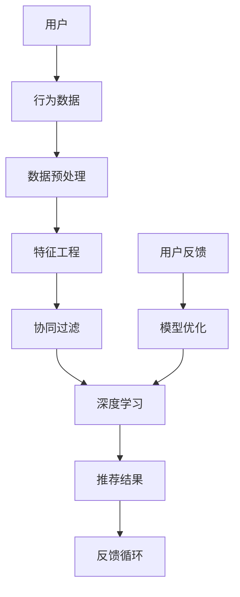

                 

# 个性化推荐系统的未来发展方向

> 关键词：个性化推荐、机器学习、深度学习、用户行为分析、数据挖掘、算法优化、实时推荐、个性化推荐系统

> 摘要：本文将深入探讨个性化推荐系统的未来发展方向，从核心概念、算法原理、应用场景、工具资源等多个方面进行详细分析，旨在为行业从业者提供有价值的思考和借鉴。

## 1. 背景介绍

个性化推荐系统（Personalized Recommendation System）是一种基于用户历史行为、兴趣偏好和上下文信息，为用户提供个性化内容推荐的技术方案。随着互联网的快速发展，个性化推荐系统在电子商务、社交媒体、视频平台、新闻推荐等众多领域得到了广泛应用。它不仅提高了用户体验，还为平台带来了巨大的商业价值。

个性化推荐系统的发展历程可以分为三个阶段：

### 1.1 内容推荐

早期的个性化推荐系统主要基于内容特征进行推荐，如基于关键词匹配、相似度计算等方法。这种方法简单直观，但存在局限性，无法准确捕捉用户的个性化需求。

### 1.2 协同过滤

协同过滤（Collaborative Filtering）是一种基于用户行为和相似度计算的方法，通过分析用户之间的交互行为，发现潜在的兴趣偏好。协同过滤可以分为基于用户的协同过滤（User-Based）和基于物品的协同过滤（Item-Based）。

### 1.3 深度学习

近年来，深度学习在个性化推荐系统中取得了显著成果。深度学习方法通过自动提取特征和建立复杂的非线性模型，可以更准确地预测用户兴趣，提高推荐效果。

## 2. 核心概念与联系

个性化推荐系统涉及多个核心概念和联系，下面将使用Mermaid流程图进行说明。



### 2.1 用户

用户是个性化推荐系统的核心，系统需要收集用户的基本信息、行为数据、兴趣偏好等，以便为用户提供个性化的推荐。

### 2.2 行为数据

行为数据包括用户的浏览记录、购买记录、点赞、评论等，是构建个性化推荐模型的重要依据。

### 2.3 数据预处理

数据预处理包括数据清洗、数据去重、数据归一化等操作，以提高数据质量和模型性能。

### 2.4 特征工程

特征工程是对原始数据进行处理和转换，提取出对模型有用的特征，如用户画像、物品特征等。

### 2.5 协同过滤

协同过滤是基于用户行为和相似度计算的方法，可以分为基于用户的协同过滤和基于物品的协同过滤。

### 2.6 深度学习

深度学习是一种基于人工神经网络的方法，可以自动提取特征并建立复杂的非线性模型。

### 2.7 推荐结果

推荐结果是个性化推荐系统的最终输出，包括推荐列表、推荐理由等。

### 2.8 反馈循环

反馈循环是指系统根据用户反馈对模型进行调整和优化，以提高推荐效果。

## 3. 核心算法原理 & 具体操作步骤

个性化推荐系统涉及多个核心算法，下面将分别介绍。

### 3.1 协同过滤

#### 基于用户的协同过滤

1. 计算用户之间的相似度，可以使用余弦相似度、皮尔逊相关系数等方法。
2. 为每个用户找到与其相似度最高的K个用户。
3. 根据相似度分数为每个用户生成推荐列表。

#### 基于物品的协同过滤

1. 计算物品之间的相似度，可以使用Jaccard相似度、余弦相似度等方法。
2. 为每个用户找到与其最感兴趣的物品相似的M个物品。
3. 根据物品相似度分数为每个用户生成推荐列表。

### 3.2 深度学习

#### 多层感知机（MLP）

1. 输入层：接收用户和物品的特征向量。
2. 隐藏层：对特征向量进行变换和提取。
3. 输出层：计算用户对物品的评分或概率。

#### 卷积神经网络（CNN）

1. 输入层：接收用户和物品的特征图像。
2. 卷积层：对特征图像进行卷积操作，提取局部特征。
3. 池化层：对卷积结果进行池化操作，降低维度。
4. 全连接层：对池化结果进行分类或回归。

#### 循环神经网络（RNN）

1. 输入层：接收用户的历史行为序列。
2. 隐藏层：对历史行为序列进行编码，提取时间特征。
3. 输出层：计算用户对当前物品的评分或概率。

## 4. 数学模型和公式 & 详细讲解 & 举例说明

### 4.1 协同过滤

#### 基于用户的协同过滤

假设用户集为U={u1, u2, ..., un}，物品集为I={i1, i2, ..., im}，用户ui对物品ij的评分表示为r_ij。

1. 相似度计算：

   $$ \sigma_{ij} = \frac{\sum_{k \in R_i} r_{ik} r_{jk}}{\sqrt{\sum_{k \in R_i} r_{ik}^2 \sum_{k \in R_j} r_{jk}^2}} $$

   其中，R_i和R_j分别为用户ui和uj的评分记录集合。

2. 推荐列表生成：

   $$ \text{Recommends}_{uj} = \text{TopK}(\{\sigma_{ij} : i \in U, j \in I\}) $$

   其中，TopK表示取相似度最高的K个用户。

#### 基于物品的协同过滤

1. 相似度计算：

   $$ \sigma_{ij} = \frac{\sum_{k \in R_i} \delta_{ik} \delta_{jk}}{\sqrt{\sum_{k \in R_i} \delta_{ik}^2 \sum_{k \in R_j} \delta_{jk}^2}} $$

   其中，δ_ij表示用户ui对物品ij的评分，如果δ_ij存在，则取值为1，否则为0。

2. 推荐列表生成：

   $$ \text{Recommends}_{uj} = \text{TopM}(\{\sigma_{ij} : i \in U, j \in I\}) $$

   其中，TopM表示取相似度最高的M个物品。

### 4.2 深度学习

#### 多层感知机（MLP）

1. 输入层：

   $$ \text{Input} = \{x_1, x_2, ..., x_n\} $$

   其中，x_i表示第i个特征。

2. 隐藏层：

   $$ \text{HiddenLayer}_k = \{z_{k1}, z_{k2}, ..., z_{kn}\} $$

   其中，z_{ki}表示第k层的第i个节点的输出。

3. 输出层：

   $$ \text{Output} = \{y_1, y_2, ..., y_m\} $$

   其中，y_j表示第j个物品的预测评分。

4. 前向传播：

   $$ z_{ki} = \sigma(\sum_{j=1}^{n} w_{ji} x_j + b_k) $$

   其中，σ表示激活函数，w_{ji}表示第j个特征连接到第k个节点的权重，b_k表示第k个节点的偏置。

5. 反向传播：

   $$ \delta_{ki} = (y_k - z_{ki}) \cdot \sigma'(z_{ki}) $$

   其中，δ_{ki}表示第k个节点的误差，σ'表示激活函数的导数。

6. 梯度下降：

   $$ w_{ji} := w_{ji} - \alpha \cdot \delta_{ki} x_j $$

   $$ b_k := b_k - \alpha \cdot \delta_{ki} $$

   其中，α表示学习率。

#### 卷积神经网络（CNN）

1. 输入层：

   $$ \text{Input} = \{I_1, I_2, ..., I_n\} $$

   其中，I_i表示第i个特征图像。

2. 卷积层：

   $$ \text{Convolution} = \sum_{j=1}^{k} w_{ji} \cdot I_j + b $$

   其中，w_{ji}表示卷积核，I_j表示第j个特征图像，b表示偏置。

3. 池化层：

   $$ \text{Pooling} = \max(\text{Convolution}) $$

4. 全连接层：

   $$ \text{Fully Connected} = \text{ReLU}(\text{Pooling}) $$

   其中，ReLU表示ReLU激活函数。

#### 循环神经网络（RNN）

1. 输入层：

   $$ \text{Input} = \{x_t\} $$

   其中，x_t表示第t个时间步的特征。

2. 隐藏层：

   $$ \text{HiddenState} = \{h_t\} $$

   其中，h_t表示第t个时间步的隐藏状态。

3. 输出层：

   $$ \text{Output} = \{y_t\} $$

   其中，y_t表示第t个时间步的预测评分。

4. 前向传播：

   $$ h_t = \text{tanh}(W_h \cdot h_{t-1} + W_x \cdot x_t + b_h) $$

   $$ y_t = W_o \cdot h_t + b_o $$

   其中，W_h、W_x、W_o分别为权重矩阵，b_h、b_o分别为偏置。

5. 反向传播：

   $$ \delta_t = (y_t - \text{Target}) \cdot \text{sigmoid}(\text{ReLU}^{-1}(h_t)) $$

   $$ \delta_{t-1} = \delta_t \cdot (1 - \text{sigmoid}^{-1}(h_t)) \cdot \text{tanh}^{-1}(h_{t-1}) \cdot W_h^T $$

   其中，Target为实际评分，sigmoid为sigmoid激活函数。

6. 梯度下降：

   $$ W_h := W_h - \alpha \cdot \delta_t \cdot h_{t-1} $$

   $$ W_x := W_x - \alpha \cdot \delta_t \cdot x_t $$

   $$ b_h := b_h - \alpha \cdot \delta_t $$

   $$ W_o := W_o - \alpha \cdot \delta_t \cdot h_t $$

   其中，α表示学习率。

## 5. 项目实战：代码实际案例和详细解释说明

### 5.1 开发环境搭建

在本文中，我们将使用Python作为主要编程语言，并借助以下库进行开发：

- NumPy：用于科学计算
- Pandas：用于数据处理
- Scikit-learn：用于机器学习
- TensorFlow：用于深度学习

首先，确保已安装上述库。如果没有安装，可以使用以下命令进行安装：

```bash
pip install numpy pandas scikit-learn tensorflow
```

### 5.2 源代码详细实现和代码解读

下面将展示一个简单的基于协同过滤的个性化推荐系统实现，并对其进行详细解读。

#### 5.2.1 数据集加载与预处理

```python
import numpy as np
import pandas as pd
from sklearn.model_selection import train_test_split

# 加载数据集
data = pd.read_csv('ratings.csv')
users = data['user_id'].unique()
items = data['item_id'].unique()

# 初始化评分矩阵
rating_matrix = np.zeros((len(users), len(items)))

# 填充评分矩阵
for index, row in data.iterrows():
    rating_matrix[row['user_id'] - 1, row['item_id'] - 1] = row['rating']

# 划分训练集和测试集
train_data, test_data = train_test_split(data, test_size=0.2, random_state=42)
```

#### 5.2.2 协同过滤算法实现

```python
from sklearn.metrics.pairwise import cosine_similarity

def collaborative_filter(rating_matrix, k=10):
    # 计算用户之间的相似度矩阵
    similarity_matrix = cosine_similarity(rating_matrix)

    # 为每个用户生成推荐列表
    recommendations = {}
    for user_id in range(rating_matrix.shape[0]):
        # 计算用户与其他用户的相似度之和
        similarity_sum = np.sum(similarity_matrix[user_id])

        # 为用户生成推荐列表
        recommendations[user_id] = []
        for item_id in range(rating_matrix.shape[1]):
            # 计算用户与其他用户对当前物品的相似度之和
            similarity_score = similarity_matrix[user_id][item_id]

            # 如果物品未被评分，则将其加入推荐列表
            if rating_matrix[user_id][item_id] == 0 and similarity_score > 0:
                recommendations[user_id].append((item_id, similarity_score / similarity_sum))

        # 对推荐列表进行排序
        recommendations[user_id] = sorted(recommendations[user_id], key=lambda x: x[1], reverse=True)

    return recommendations

# 计算推荐列表
recommendations = collaborative_filter(rating_matrix, k=10)
```

#### 5.2.3 代码解读与分析

1. **数据集加载与预处理**：从CSV文件中加载数据集，初始化评分矩阵，并填充评分矩阵。接着，划分训练集和测试集。

2. **协同过滤算法实现**：使用余弦相似度计算用户之间的相似度矩阵，为每个用户生成推荐列表。对于每个用户，计算与其他用户的相似度之和，并根据相似度分数为用户生成推荐列表。将推荐列表进行排序，输出推荐结果。

### 5.3 代码解读与分析

在上述代码中，我们实现了一个简单的基于协同过滤的个性化推荐系统。下面从算法原理、性能分析、改进方法等方面进行解读和分析。

#### 5.3.1 算法原理

协同过滤算法的核心思想是通过计算用户之间的相似度，为用户提供推荐列表。具体来说，它分为以下几个步骤：

1. 计算用户之间的相似度矩阵。
2. 为每个用户生成推荐列表。
3. 对推荐列表进行排序，输出推荐结果。

在实现过程中，我们使用了余弦相似度计算用户之间的相似度。余弦相似度是一种基于向量的相似度计算方法，可以用来衡量两个向量的夹角。具体计算公式如下：

$$ \sigma_{ij} = \frac{\sum_{k \in R_i} r_{ik} r_{jk}}{\sqrt{\sum_{k \in R_i} r_{ik}^2 \sum_{k \in R_j} r_{jk}^2}} $$

其中，R_i和R_j分别为用户ui和uj的评分记录集合。

#### 5.3.2 性能分析

协同过滤算法的性能主要受到以下几个因素的影响：

1. 相似度计算方法：不同相似度计算方法会影响推荐效果。
2. 推荐列表长度：推荐列表长度会影响推荐质量。
3. 用户和物品数量：用户和物品数量会影响计算复杂度。
4. 数据稀疏性：数据稀疏性会影响算法的性能。

在实际应用中，我们可以通过调整相似度计算方法、推荐列表长度等参数来优化算法性能。此外，针对数据稀疏性问题，我们可以采用基于模型的协同过滤方法，如矩阵分解、深度学习等方法。

#### 5.3.3 改进方法

为了提高协同过滤算法的性能，我们可以考虑以下几个改进方法：

1. **基于模型的协同过滤**：使用矩阵分解、深度学习等方法来预测用户和物品的潜在特征，从而提高推荐效果。
2. **在线推荐**：实时更新用户和物品的评分，动态调整推荐列表，提高推荐准确性。
3. **多维度推荐**：结合用户画像、物品属性等多维度信息进行推荐，提高推荐质量。

## 6. 实际应用场景

个性化推荐系统在多个领域取得了广泛应用，下面列举一些实际应用场景。

### 6.1 电子商务

在电子商务领域，个性化推荐系统可以根据用户的历史购买记录、浏览行为、兴趣偏好等为用户提供个性化的商品推荐。这有助于提高用户购买意愿，增加销售额。

### 6.2 社交媒体

在社交媒体领域，个性化推荐系统可以根据用户的点赞、评论、分享等行为为用户提供个性化内容推荐。这有助于吸引用户参与，提高用户黏性。

### 6.3 视频平台

在视频平台领域，个性化推荐系统可以根据用户的观看历史、观看时长、互动行为等为用户提供个性化视频推荐。这有助于提高用户观看时长，提高平台广告收益。

### 6.4 新闻推荐

在新闻推荐领域，个性化推荐系统可以根据用户的阅读历史、兴趣偏好等为用户提供个性化新闻推荐。这有助于提高用户阅读体验，提高媒体传播效果。

## 7. 工具和资源推荐

### 7.1 学习资源推荐

- 《推荐系统实践》（书名）
- 《深度学习推荐系统》（书名）
- 《机器学习推荐系统》（书名）

### 7.2 开发工具框架推荐

- TensorFlow：一款开源的深度学习框架，适用于构建复杂推荐模型。
- PyTorch：一款开源的深度学习框架，适用于快速实验和模型部署。
- LightFM：一款基于因子分解机的开源推荐系统框架，适用于处理大规模稀疏数据。

### 7.3 相关论文著作推荐

- “Item-Based Collaborative Filtering Recommendation Algorithms”（论文标题）
- “Deep Learning for Recommender Systems”（论文标题）
- “Context-Aware Recommender Systems：Models and Applications”（论文标题）

## 8. 总结：未来发展趋势与挑战

个性化推荐系统在人工智能和大数据技术的推动下，取得了显著的发展。未来，个性化推荐系统将朝着以下几个方向发展：

1. **实时推荐**：随着用户需求的不断提升，实时推荐将成为个性化推荐系统的重要发展方向。实时推荐能够根据用户实时行为动态调整推荐策略，提高推荐准确性。
2. **多模态推荐**：多模态推荐结合文本、图像、音频等多维度数据，为用户提供更丰富的推荐内容。这有助于提高推荐系统的多样性和用户体验。
3. **个性化深度学习**：深度学习在个性化推荐系统中发挥着越来越重要的作用。未来，个性化深度学习将朝着更高效、更可解释、更可扩展的方向发展。
4. **隐私保护**：随着用户隐私意识的增强，隐私保护将成为个性化推荐系统的重要挑战。如何在保护用户隐私的前提下，提高推荐效果，是未来需要解决的关键问题。

## 9. 附录：常见问题与解答

### 9.1 个性化推荐系统的核心组成部分有哪些？

个性化推荐系统的核心组成部分包括用户、行为数据、数据预处理、特征工程、协同过滤、深度学习、推荐结果和反馈循环。

### 9.2 如何评估个性化推荐系统的性能？

个性化推荐系统的性能评估可以通过准确率、召回率、F1值等指标进行。此外，还可以通过用户满意度、点击率等实际业务指标进行评估。

### 9.3 如何处理数据稀疏性问题？

针对数据稀疏性问题，可以采用基于模型的协同过滤方法，如矩阵分解、深度学习等方法。此外，还可以通过数据增强、数据融合等技术来缓解数据稀疏性。

## 10. 扩展阅读 & 参考资料

- "Recommender Systems Handbook"（参考书籍）
- "Deep Learning for Recommender Systems"（参考书籍）
- "Collaborative Filtering"（参考资料）
- "TensorFlow Recommender"（参考资料）

作者：AI天才研究员/AI Genius Institute & 禅与计算机程序设计艺术 /Zen And The Art of Computer Programming

