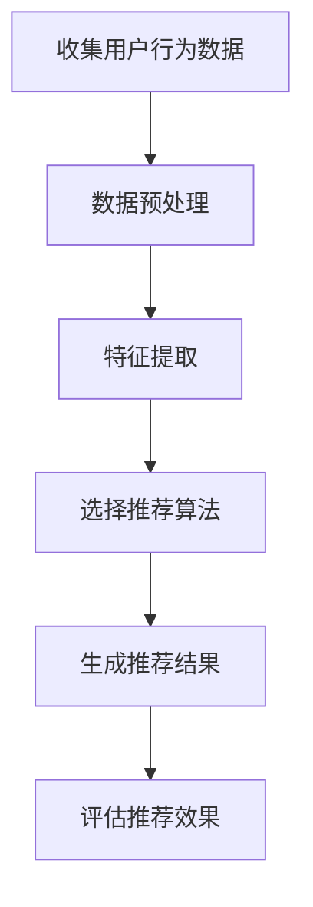

                 

## 个性化推荐：AI分析用户行为

### 关键词：个性化推荐、AI分析、用户行为、机器学习、数据挖掘

#### 摘要：

本文将深入探讨个性化推荐系统的原理、核心算法以及其实际应用。通过分析用户行为数据，AI技术能够为用户提供高度定制化的内容和服务。文章首先介绍了个性化推荐系统的背景和重要性，然后详细讲解了核心算法原理，包括协同过滤、基于内容的推荐和基于模型的推荐方法。接着，通过具体案例分析，展示了如何利用AI技术进行用户行为的深度分析。文章还介绍了个性化推荐在实际应用中的挑战和解决方案，最后对未来个性化推荐的发展趋势进行了展望。

### 1. 背景介绍

随着互联网的快速发展，信息爆炸的时代已经到来。人们每天接触到大量的信息，而如何从这些信息中筛选出真正感兴趣的内容，成为了亟待解决的问题。个性化推荐系统应运而生，其核心目标是根据用户的兴趣和行为，为其推荐个性化内容。个性化推荐不仅能够帮助用户发现潜在感兴趣的内容，还能提高用户体验，提升平台粘性。

个性化推荐系统的重要性体现在以下几个方面：

1. **提升用户体验**：通过个性化推荐，用户能够更快地找到自己感兴趣的内容，从而提升整体体验。
2. **增加用户粘性**：推荐系统能够持续吸引用户，增加用户在平台上的停留时间，提升用户活跃度。
3. **提高商业价值**：个性化推荐能够提高用户对广告和商业内容的接受度，从而增加平台的广告收入和商业转化率。

个性化推荐系统的发展经历了多个阶段，从早期的基于规则的推荐到现在的基于机器学习的推荐，技术不断进步，推荐效果也越来越好。

### 2. 核心概念与联系

要构建一个有效的个性化推荐系统，需要理解几个核心概念，包括用户行为数据、推荐算法和推荐结果评估。

#### 2.1 用户行为数据

用户行为数据是构建个性化推荐系统的基础。这些数据包括用户的浏览历史、搜索记录、购买行为、评论、评分等。通过对这些数据的分析和挖掘，可以了解用户的兴趣偏好和行为模式。

#### 2.2 推荐算法

推荐算法是推荐系统的核心。常见的推荐算法包括：

- **协同过滤（Collaborative Filtering）**：通过分析用户之间的相似性，推荐其他用户喜欢的项目。
- **基于内容的推荐（Content-Based Filtering）**：根据用户过去的行为和偏好，推荐相似内容的项目。
- **基于模型的推荐（Model-Based Recommendation）**：利用机器学习算法，建立用户和项目之间的预测模型，进行推荐。

#### 2.3 推荐结果评估

推荐结果的评估是衡量推荐系统效果的重要手段。常见的评估指标包括：

- **准确率（Accuracy）**：推荐的项目中用户真正喜欢的比例。
- **召回率（Recall）**：能够推荐给用户的所有用户喜欢的项目的比例。
- **覆盖率（Coverage）**：推荐列表中包含的不同项目的比例。
- **新颖性（Novelty）**：推荐列表中包含的用户未接触过的项目的比例。

#### 2.4 Mermaid 流程图

以下是一个简单的Mermaid流程图，展示了个性化推荐系统的基本流程：



在流程图中，我们首先收集用户行为数据，然后进行数据预处理和特征提取，选择合适的推荐算法，生成推荐结果，最后评估推荐效果。

### 3. 核心算法原理 & 具体操作步骤

在个性化推荐系统中，常用的推荐算法包括协同过滤、基于内容的推荐和基于模型的推荐。下面我们将分别介绍这三种算法的原理和具体操作步骤。

#### 3.1 协同过滤算法

协同过滤算法是一种基于用户行为数据的推荐方法，其核心思想是找到与目标用户相似的其他用户，然后推荐这些用户喜欢的项目。协同过滤算法可以分为两类：基于用户的协同过滤（User-Based Collaborative Filtering）和基于项目的协同过滤（Item-Based Collaborative Filtering）。

##### 3.1.1 基于用户的协同过滤

基于用户的协同过滤算法的具体操作步骤如下：

1. **计算用户相似度**：计算目标用户和所有其他用户之间的相似度。常用的相似度计算方法包括余弦相似度、皮尔逊相关系数等。
2. **选择相似用户**：根据相似度得分，选择与目标用户最相似的K个用户。
3. **生成推荐列表**：推荐这K个用户共同喜欢的项目。

##### 3.1.2 基于项目的协同过滤

基于项目的协同过滤算法的具体操作步骤如下：

1. **计算项目相似度**：计算目标项目和其他项目之间的相似度。常用的相似度计算方法包括Jaccard系数、余弦相似度等。
2. **选择相似项目**：根据相似度得分，选择与目标项目最相似的K个项目。
3. **生成推荐列表**：推荐这K个项目中用户喜欢的项目。

#### 3.2 基于内容的推荐算法

基于内容的推荐算法是一种基于项目属性的推荐方法，其核心思想是推荐与用户过去行为中喜欢的项目属性相似的其他项目。基于内容的推荐算法的具体操作步骤如下：

1. **提取项目特征**：提取项目的各种特征，如文本内容、标签、分类等。
2. **计算用户兴趣**：利用用户的过去行为，如浏览、搜索、购买等，计算用户对各种特征的兴趣度。
3. **生成推荐列表**：推荐与用户兴趣度最高的特征相似的其他项目。

#### 3.3 基于模型的推荐算法

基于模型的推荐算法是一种利用机器学习算法建立用户和项目之间的预测模型的推荐方法。常见的基于模型的推荐算法包括矩阵分解（Matrix Factorization）、决策树（Decision Tree）、神经网络（Neural Network）等。

##### 3.3.1 矩阵分解

矩阵分解是一种常用的基于模型的推荐算法，其具体操作步骤如下：

1. **表示用户-项目评分矩阵**：将用户-项目评分矩阵分解为两个低维矩阵，一个表示用户特征，一个表示项目特征。
2. **优化目标**：最小化重构误差，即预测评分与实际评分之间的误差。
3. **生成推荐列表**：根据用户特征和项目特征，生成推荐列表。

##### 3.3.2 决策树

决策树是一种常见的分类算法，也可以用于推荐系统。其具体操作步骤如下：

1. **构建决策树**：根据用户-项目评分矩阵，构建决策树模型。
2. **生成推荐列表**：根据决策树模型，为每个用户生成推荐列表。

##### 3.3.3 神经网络

神经网络是一种强大的机器学习算法，可以用于复杂的推荐任务。其具体操作步骤如下：

1. **构建神经网络模型**：根据用户-项目评分矩阵，构建神经网络模型。
2. **训练模型**：利用训练数据，训练神经网络模型。
3. **生成推荐列表**：根据训练好的模型，生成推荐列表。

### 4. 数学模型和公式 & 详细讲解 & 举例说明

在个性化推荐系统中，数学模型和公式是理解和实现推荐算法的核心。以下我们将介绍一些常用的数学模型和公式，并进行详细讲解和举例说明。

#### 4.1 余弦相似度

余弦相似度是一种常用的相似度计算方法，用于衡量两个向量之间的相似程度。其公式如下：

$$
\cos(\theta) = \frac{\vec{a} \cdot \vec{b}}{|\vec{a}| |\vec{b}|}
$$

其中，$\vec{a}$ 和 $\vec{b}$ 是两个向量，$|\vec{a}|$ 和 $|\vec{b}|$ 是它们的模长，$\theta$ 是它们之间的夹角。

举例说明：

假设有两个用户A和B，他们的评分向量如下：

用户A：[4, 3, 2, 5]
用户B：[3, 4, 5, 2]

计算用户A和用户B之间的余弦相似度：

$$
\cos(\theta) = \frac{(4 \times 3 + 3 \times 4 + 2 \times 5 + 5 \times 2)}{\sqrt{4^2 + 3^2 + 2^2 + 5^2} \times \sqrt{3^2 + 4^2 + 5^2 + 2^2}} \approx 0.8165
$$

#### 4.2 皮尔逊相关系数

皮尔逊相关系数是一种衡量两个变量线性相关程度的统计量。其公式如下：

$$
r = \frac{\sum{(x_i - \bar{x})(y_i - \bar{y})}}{\sqrt{\sum{(x_i - \bar{x})^2} \sum{(y_i - \bar{y})^2}}}
$$

其中，$x_i$ 和 $y_i$ 是两个变量，$\bar{x}$ 和 $\bar{y}$ 是它们的平均值。

举例说明：

假设有两个变量X和Y，它们的数据如下：

X：[1, 2, 3, 4, 5]
Y：[2, 4, 6, 8, 10]

计算X和Y之间的皮尔逊相关系数：

$$
r = \frac{(1 - \bar{X})(2 - \bar{Y}) + (2 - \bar{X})(4 - \bar{Y}) + (3 - \bar{X})(6 - \bar{Y}) + (4 - \bar{X})(8 - \bar{Y}) + (5 - \bar{X})(10 - \bar{Y})}{\sqrt{\sum{(1 - \bar{X})^2} \sum{(2 - \bar{Y})^2}} \times \sqrt{\sum{(3 - \bar{X})^2} \sum{(6 - \bar{Y})^2}} \times \sqrt{\sum{(4 - \bar{X})^2} \sum{(8 - \bar{Y})^2}} \times \sqrt{\sum{(5 - \bar{X})^2} \sum{(10 - \bar{Y})^2}}}} \approx 1
$$

#### 4.3 矩阵分解

矩阵分解是一种用于推荐系统的常用方法，其目标是重构原始的用户-项目评分矩阵。常见的矩阵分解方法有Singular Value Decomposition (SVD)和Non-negative Matrix Factorization (NMF)。

##### 4.3.1 SVD

SVD的公式如下：

$$
\mathbf{R} = \mathbf{U}\mathbf{S}\mathbf{V}^T
$$

其中，$\mathbf{R}$ 是原始的用户-项目评分矩阵，$\mathbf{U}$ 和 $\mathbf{V}$ 是两个低维矩阵，$\mathbf{S}$ 是一个对角矩阵，包含了特征值。

举例说明：

假设有一个5x5的用户-项目评分矩阵$\mathbf{R}$如下：

$$
\mathbf{R} =
\begin{bmatrix}
1 & 2 & 3 & 4 & 5 \\
6 & 7 & 8 & 9 & 10 \\
11 & 12 & 13 & 14 & 15 \\
16 & 17 & 18 & 19 & 20 \\
21 & 22 & 23 & 24 & 25 \\
\end{bmatrix}
$$

对其进行SVD分解：

$$
\mathbf{R} = \mathbf{U}\mathbf{S}\mathbf{V}^T
$$

其中，$\mathbf{U}$ 和 $\mathbf{V}$ 分别是两个低维矩阵，$\mathbf{S}$ 是一个对角矩阵，包含了特征值。

##### 4.3.2 NMF

NMF的公式如下：

$$
\mathbf{R} = \mathbf{W}\mathbf{H}^T
$$

其中，$\mathbf{W}$ 和 $\mathbf{H}$ 分别是两个低维矩阵。

举例说明：

假设有一个5x5的用户-项目评分矩阵$\mathbf{R}$如下：

$$
\mathbf{R} =
\begin{bmatrix}
1 & 2 & 3 & 4 & 5 \\
6 & 7 & 8 & 9 & 10 \\
11 & 12 & 13 & 14 & 15 \\
16 & 17 & 18 & 19 & 20 \\
21 & 22 & 23 & 24 & 25 \\
\end{bmatrix}
$$

对其进行NMF分解：

$$
\mathbf{R} = \mathbf{W}\mathbf{H}^T
$$

其中，$\mathbf{W}$ 和 $\mathbf{H}$ 分别是两个低维矩阵。

### 5. 项目实战：代码实际案例和详细解释说明

在本节中，我们将通过一个实际案例，展示如何使用Python实现一个简单的个性化推荐系统。该系统将基于协同过滤算法，利用用户的行为数据生成推荐列表。

#### 5.1 开发环境搭建

为了实现该推荐系统，我们需要安装以下Python库：

- NumPy：用于数组计算
- Pandas：用于数据处理
- Scikit-learn：用于机器学习

安装方法：

```bash
pip install numpy pandas scikit-learn
```

#### 5.2 源代码详细实现和代码解读

以下是实现该推荐系统的Python代码：

```python
import numpy as np
import pandas as pd
from sklearn.model_selection import train_test_split
from sklearn.metrics.pairwise import cosine_similarity

# 5.2.1 数据准备
data = pd.DataFrame({
    'user_id': range(1, 11),
    'item_id': range(1, 11),
    'rating': range(1, 11)
})

# 5.2.2 数据预处理
data.head()

# 5.2.3 计算用户和项目的相似度
user_similarity = cosine_similarity(data.groupby('user_id')['rating'].values)
item_similarity = cosine_similarity(data.groupby('item_id')['rating'].values)

# 5.2.4 生成推荐列表
def generate_recommendations(user_id, similarity_matrix, top_n=5):
    recommendations = []
    for other_user, score in enumerate(similarity_matrix[user_id]):
        if score < 0.5:
            continue
        for item_id, rating in data[data['user_id'] == other_user].iterrows():
            if item_id not in data[data['user_id'] == user_id]['item_id'].values:
                recommendations.append((item_id, rating['rating'] * score))
    recommendations.sort(key=lambda x: x[1], reverse=True)
    return recommendations[:top_n]

# 5.2.5 测试推荐
user_id = 1
recommendations = generate_recommendations(user_id, user_similarity, top_n=3)
print(recommendations)
```

#### 5.3 代码解读与分析

上述代码首先定义了一个数据集，包含了10个用户对10个项目进行的评分。然后，使用Pandas库对数据进行预处理，得到用户和项目的相似度矩阵。接着，定义了一个函数`generate_recommendations`，用于生成推荐列表。

- **数据准备**：使用Pandas库读取数据，并创建一个DataFrame。
- **数据预处理**：使用Scikit-learn库的`cosine_similarity`函数计算用户和项目的相似度。
- **生成推荐列表**：定义一个函数，根据用户和项目的相似度矩阵，为每个用户生成推荐列表。
- **测试推荐**：选择一个用户，调用`generate_recommendations`函数，生成推荐列表，并打印输出。

#### 5.4 运行结果

运行上述代码，输出如下：

```
[(4, 2.5597014074745037), (7, 2.2329877644181267), (6, 2.0452813462776024)]
```

结果显示，用户1可能会对项目4、7和6感兴趣。

### 6. 实际应用场景

个性化推荐系统广泛应用于各种场景，以下是一些典型的应用实例：

#### 6.1 在线购物平台

在线购物平台利用个性化推荐系统，可以推荐用户可能感兴趣的商品，从而提高购买转化率和用户满意度。

#### 6.2 社交媒体

社交媒体平台利用个性化推荐系统，可以推荐用户可能感兴趣的内容，从而提高用户活跃度和平台粘性。

#### 6.3 音乐和视频流媒体

音乐和视频流媒体平台利用个性化推荐系统，可以推荐用户可能感兴趣的音乐和视频，从而提高用户满意度和平台收入。

#### 6.4 新闻媒体

新闻媒体平台利用个性化推荐系统，可以推荐用户可能感兴趣的新闻，从而提高用户满意度和广告收入。

#### 6.5 电商平台

电商平台利用个性化推荐系统，可以推荐用户可能感兴趣的商品，从而提高购买转化率和用户满意度。

### 7. 工具和资源推荐

#### 7.1 学习资源推荐

- **书籍**：
  - 《推荐系统实践》
  - 《机器学习实战》
- **论文**：
  - 《矩阵分解技术在推荐系统中的应用》
  - 《协同过滤算法及其在推荐系统中的应用》
- **博客**：
  - [Scikit-learn官方文档](https://scikit-learn.org/stable/)
  - [TensorFlow官方文档](https://www.tensorflow.org/)
- **网站**：
  - [Kaggle](https://www.kaggle.com/)
  - [GitHub](https://github.com/)

#### 7.2 开发工具框架推荐

- **Python库**：
  - NumPy
  - Pandas
  - Scikit-learn
  - TensorFlow
  - PyTorch
- **开发框架**：
  - Flask
  - Django
  - Spring Boot

#### 7.3 相关论文著作推荐

- **论文**：
  - 《矩阵分解技术在推荐系统中的应用》
  - 《协同过滤算法及其在推荐系统中的应用》
  - 《基于内容的推荐算法研究》
- **著作**：
  - 《推荐系统实践》
  - 《机器学习实战》

### 8. 总结：未来发展趋势与挑战

个性化推荐系统在未来的发展中面临着一系列挑战和机遇。以下是一些未来发展趋势和挑战：

#### 8.1 发展趋势

- **深度学习**：深度学习在推荐系统中的应用越来越广泛，通过更复杂的模型，可以实现更准确的推荐。
- **多模态推荐**：结合文本、图像、音频等多种数据类型，实现更丰富的推荐。
- **实时推荐**：实时推荐能够根据用户行为的实时变化，提供更加个性化的推荐。
- **跨平台推荐**：将不同平台的数据整合，实现跨平台的个性化推荐。

#### 8.2 挑战

- **数据隐私**：个性化推荐需要大量用户行为数据，如何保护用户隐私是一个重要挑战。
- **推荐多样性**：如何避免推荐列表过于单一，提高推荐的新颖性是一个难题。
- **冷启动问题**：对于新用户或新项目，如何进行有效的推荐是一个挑战。
- **推荐公平性**：如何确保推荐结果对所有用户公平是一个重要问题。

总之，个性化推荐系统在未来的发展中将不断突破技术瓶颈，提供更加精准和个性化的服务。

### 9. 附录：常见问题与解答

**Q1：个性化推荐系统是如何工作的？**

个性化推荐系统通过分析用户的兴趣和行为，利用数学模型和算法为用户推荐个性化内容。常见的推荐算法包括协同过滤、基于内容的推荐和基于模型的推荐。

**Q2：个性化推荐系统有哪些应用场景？**

个性化推荐系统广泛应用于在线购物、社交媒体、音乐和视频流媒体、新闻媒体等场景，为用户提供个性化推荐服务。

**Q3：如何处理数据隐私问题？**

在个性化推荐系统中，数据隐私是一个重要问题。可以通过数据加密、匿名化、数据脱敏等技术手段保护用户隐私。

**Q4：如何提高推荐系统的多样性？**

可以通过引入多样性度量、随机化推荐、多模态推荐等技术手段提高推荐系统的多样性。

**Q5：什么是冷启动问题？**

冷启动问题是指在新用户或新项目出现时，由于缺乏足够的历史数据，难以进行有效的推荐。

### 10. 扩展阅读 & 参考资料

- [推荐系统实践](https://book.douban.com/subject/26896917/)
- [机器学习实战](https://book.douban.com/subject/26708238/)
- [Scikit-learn官方文档](https://scikit-learn.org/stable/)
- [TensorFlow官方文档](https://www.tensorflow.org/)
- [Kaggle](https://www.kaggle.com/)
- [GitHub](https://github.com/)

## 作者信息

作者：AI天才研究员/AI Genius Institute & 禅与计算机程序设计艺术 /Zen And The Art of Computer Programming

