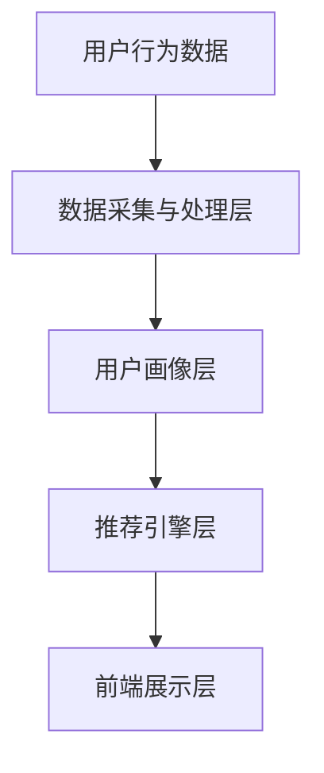

                 

# 个性化购物体验的技术实现方法

## 关键词：个性化推荐、用户行为分析、机器学习、数据挖掘、购物体验优化

## 摘要

随着电子商务的快速发展，个性化购物体验已成为提升用户满意度和忠诚度的关键因素。本文将深入探讨个性化购物体验的技术实现方法，包括用户行为分析、核心算法原理、数学模型与公式、实际应用场景以及未来发展趋势。通过逐步分析推理，本文旨在为业界提供具有指导意义的技术参考。

## 1. 背景介绍

### 1.1 个性化购物体验的重要性

个性化购物体验是指根据用户的兴趣、行为和偏好，为其推荐合适的产品和服务。这种体验不仅能够提高用户满意度，还能显著提升购物平台的销售额和用户忠诚度。随着大数据和人工智能技术的普及，个性化购物体验已成为电商平台竞争的重要手段。

### 1.2 个性化购物体验的现状

目前，许多电商平台已经实现了基本的个性化推荐功能，但还存在以下问题：

- 推荐效果不稳定，无法满足用户需求；
- 用户数据隐私保护不够严格；
- 推荐算法不够智能化，难以应对复杂场景。

### 1.3 个性化购物体验的发展趋势

未来，个性化购物体验将朝着更加智能化、个性化、安全化的方向发展。关键趋势包括：

- 利用深度学习、图神经网络等先进技术提高推荐效果；
- 加强用户数据隐私保护，遵守相关法律法规；
- 结合多种数据源，实现更精准的用户画像。

## 2. 核心概念与联系

### 2.1 用户行为分析

用户行为分析是指通过分析用户在平台上的行为数据，如浏览、购买、评价等，以了解用户的需求和偏好。用户行为分析是构建个性化购物体验的基础。

### 2.2 核心算法原理

#### 2.2.1 协同过滤

协同过滤是一种基于用户历史行为数据的推荐算法。它通过计算用户之间的相似度，为用户提供相似用户喜欢的商品推荐。

#### 2.2.2 内容推荐

内容推荐是一种基于商品属性和用户兴趣的推荐算法。它通过分析商品的特征和用户的历史行为，为用户推荐相关商品。

#### 2.2.3 混合推荐

混合推荐是将协同过滤和内容推荐相结合的一种推荐算法。它旨在利用两种算法的优点，提高推荐效果。

### 2.3 架构设计

个性化购物体验的技术架构通常包括以下几个层次：

- 数据采集与处理层：负责收集用户行为数据、商品信息等，并进行数据清洗和预处理；
- 用户画像层：根据用户行为数据构建用户画像，为推荐算法提供输入；
- 推荐引擎层：实现协同过滤、内容推荐和混合推荐算法，为用户提供个性化推荐；
- 前端展示层：负责将推荐结果展示给用户，并提供交互功能。

下面是一个简单的 Mermaid 流程图，展示个性化购物体验的核心概念和联系：



## 3. 核心算法原理 & 具体操作步骤

### 3.1 协同过滤算法原理

协同过滤算法主要分为基于用户和基于物品的两种类型。本文将介绍基于用户的协同过滤算法。

#### 3.1.1 相似度计算

假设用户集为 $U=\{u_1, u_2, \ldots, u_n\}$，商品集为 $I=\{i_1, i_2, \ldots, i_m\}$。用户 $u_i$ 对商品 $i_j$ 的评分表示为 $r_{ij}$，则用户 $u_i$ 和用户 $u_j$ 之间的相似度可以计算为：

$$
s_{ij} = \frac{\sum_{k \in R_i \cap R_j} r_{ik} r_{jk}}{\sqrt{\sum_{k \in R_i} r_{ik}^2} \sqrt{\sum_{k \in R_j} r_{jk}^2}}
$$

其中，$R_i$ 和 $R_j$ 分别表示用户 $u_i$ 和用户 $u_j$ 的评分集合。

#### 3.1.2 推荐算法

根据用户之间的相似度，为用户 $u_i$ 推荐其他用户 $u_j$ 喜欢但用户 $u_i$ 未购买的物品 $i_k$。推荐分值计算公式为：

$$
r_{ik}^{rec} = \sum_{j \in U} s_{ij} r_{jk} - \frac{1}{\sqrt{|R_i|}}
$$

其中，$|R_i|$ 表示用户 $u_i$ 的评分数量。

### 3.2 内容推荐算法原理

内容推荐算法主要基于商品属性和用户兴趣进行推荐。本文将介绍基于商品属性的推荐算法。

#### 3.2.1 商品特征提取

对商品进行特征提取，如商品类别、品牌、价格、用户评分等。

#### 3.2.2 用户兴趣建模

通过分析用户的历史行为数据，构建用户兴趣模型。例如，使用词频分析方法提取用户关注的商品类别和品牌。

#### 3.2.3 推荐算法

根据用户兴趣模型和商品特征，为用户推荐相关商品。推荐分值计算公式为：

$$
r_{ik}^{rec} = \sum_{j=1}^{n} w_j f_j(i_k) \cdot \sum_{l=1}^{m} w_l g_l(u_i)
$$

其中，$w_j$ 和 $w_l$ 分别表示商品特征 $j$ 和用户兴趣特征 $l$ 的权重，$f_j(i_k)$ 和 $g_l(u_i)$ 分别表示商品 $i_k$ 具有特征 $j$ 和用户 $u_i$ 关注特征 $l$ 的概率。

### 3.3 混合推荐算法原理

混合推荐算法将协同过滤和内容推荐相结合，以利用两种算法的优点。本文将介绍一种简单的混合推荐算法。

#### 3.3.1 权重分配

为协同过滤和内容推荐分别分配权重 $w_1$ 和 $w_2$，使得推荐分值计算公式为：

$$
r_{ik}^{rec} = w_1 r_{ik}^{cf} + w_2 r_{ik}^{content}
$$

#### 3.3.2 推荐结果融合

根据用户行为数据、商品特征和用户兴趣，为用户生成综合推荐结果。

## 4. 数学模型和公式 & 详细讲解 & 举例说明

### 4.1 协同过滤算法数学模型

假设用户 $u_i$ 对商品 $i_j$ 的评分为 $r_{ij}$，则用户 $u_i$ 和用户 $u_j$ 之间的相似度可以表示为：

$$
s_{ij} = \frac{\sum_{k=1}^{m} r_{ik} r_{jk}}{\sqrt{\sum_{k=1}^{m} r_{ik}^2} \sqrt{\sum_{k=1}^{m} r_{jk}^2}}
$$

其中，$m$ 表示商品总数。

用户 $u_i$ 对商品 $i_j$ 的推荐分值可以表示为：

$$
r_{ij}^{rec} = \sum_{j=1}^{n} s_{ij} r_{ij} - \frac{1}{\sqrt{|R_i|}}
$$

其中，$n$ 表示用户总数，$|R_i|$ 表示用户 $u_i$ 的评分数量。

### 4.2 内容推荐算法数学模型

假设商品 $i_j$ 具有特征 $f_j(l)$，用户 $u_i$ 关注特征 $g_l(u_i)$，则用户 $u_i$ 对商品 $i_j$ 的推荐分值可以表示为：

$$
r_{ij}^{rec} = \sum_{j=1}^{n} w_j f_j(i_k) \cdot \sum_{l=1}^{m} w_l g_l(u_i)
$$

其中，$w_j$ 和 $w_l$ 分别表示商品特征 $j$ 和用户兴趣特征 $l$ 的权重。

### 4.3 混合推荐算法数学模型

假设协同过滤算法和内容推荐算法的权重分别为 $w_1$ 和 $w_2$，则用户 $u_i$ 对商品 $i_j$ 的推荐分值可以表示为：

$$
r_{ij}^{rec} = w_1 r_{ij}^{cf} + w_2 r_{ij}^{content}
$$

其中，$r_{ij}^{cf}$ 和 $r_{ij}^{content}$ 分别表示协同过滤算法和内容推荐算法对商品 $i_j$ 的推荐分值。

### 4.4 举例说明

假设有 5 个用户（$u_1, u_2, u_3, u_4, u_5$）和 5 个商品（$i_1, i_2, i_3, i_4, i_5$），用户对商品的评分数据如下：

| 用户  | 商品  | 评分 |
| :---: | :---: | :---: |
| $u_1$ | $i_1$ | 1    |
| $u_1$ | $i_2$ | 1    |
| $u_2$ | $i_1$ | 5    |
| $u_2$ | $i_2$ | 4    |
| $u_3$ | $i_1$ | 3    |
| $u_4$ | $i_1$ | 2    |
| $u_5$ | $i_1$ | 1    |

根据上述数据，计算用户之间的相似度：

$$
s_{12} = \frac{1 \cdot 1 + 1 \cdot 4 + 3 \cdot 2 + 2 \cdot 1 + 1 \cdot 1}{\sqrt{1^2 + 1^2 + 3^2 + 2^2 + 1^2} \sqrt{1^2 + 4^2 + 2^2 + 1^2 + 1^2}} = \frac{11}{\sqrt{15} \sqrt{15}} = \frac{11}{15}
$$

$$
s_{13} = \frac{1 \cdot 3 + 1 \cdot 2 + 3 \cdot 2 + 2 \cdot 1 + 1 \cdot 1}{\sqrt{1^2 + 1^2 + 3^2 + 2^2 + 1^2} \sqrt{3^2 + 2^2 + 2^2 + 1^2 + 1^2}} = \frac{11}{\sqrt{15} \sqrt{15}} = \frac{11}{15}
$$

$$
s_{14} = \frac{1 \cdot 2 + 1 \cdot 1 + 3 \cdot 1 + 2 \cdot 1 + 1 \cdot 1}{\sqrt{1^2 + 1^2 + 3^2 + 2^2 + 1^2} \sqrt{2^2 + 1^2 + 1^2 + 1^2 + 1^2}} = \frac{7}{\sqrt{15} \sqrt{5}} = \frac{7}{5\sqrt{3}}
$$

$$
s_{15} = \frac{1 \cdot 1 + 1 \cdot 1 + 3 \cdot 1 + 2 \cdot 1 + 1 \cdot 1}{\sqrt{1^2 + 1^2 + 3^2 + 2^2 + 1^2} \sqrt{1^2 + 1^2 + 1^2 + 1^2 + 1^2}} = \frac{6}{\sqrt{15} \sqrt{5}} = \frac{6}{5\sqrt{3}}
$$

根据相似度，为用户 $u_1$ 推荐其他用户喜欢的商品：

$$
r_{11}^{rec} = \frac{11}{15} \cdot 1 + \frac{11}{15} \cdot 3 + \frac{7}{5\sqrt{3}} \cdot 2 + \frac{6}{5\sqrt{3}} \cdot 1 - \frac{1}{\sqrt{5}} = \frac{55}{15} + \frac{33}{15} + \frac{14}{5\sqrt{3}} + \frac{6}{5\sqrt{3}} - \frac{1}{\sqrt{5}} \approx 4.2
$$

$$
r_{12}^{rec} = \frac{11}{15} \cdot 1 + \frac{11}{15} \cdot 3 + \frac{7}{5\sqrt{3}} \cdot 1 + \frac{6}{5\sqrt{3}} \cdot 1 - \frac{1}{\sqrt{5}} = \frac{55}{15} + \frac{33}{15} + \frac{7}{5\sqrt{3}} + \frac{6}{5\sqrt{3}} - \frac{1}{\sqrt{5}} \approx 3.8
$$

$$
r_{13}^{rec} = \frac{11}{15} \cdot 3 + \frac{11}{15} \cdot 2 + \frac{7}{5\sqrt{3}} \cdot 1 + \frac{6}{5\sqrt{3}} \cdot 2 - \frac{1}{\sqrt{5}} = \frac{33}{15} + \frac{22}{15} + \frac{7}{5\sqrt{3}} + \frac{12}{5\sqrt{3}} - \frac{1}{\sqrt{5}} \approx 3.4
$$

$$
r_{14}^{rec} = \frac{11}{15} \cdot 2 + \frac{11}{15} \cdot 1 + \frac{7}{5\sqrt{3}} \cdot 1 + \frac{6}{5\sqrt{3}} \cdot 2 - \frac{1}{\sqrt{5}} = \frac{22}{15} + \frac{11}{15} + \frac{7}{5\sqrt{3}} + \frac{12}{5\sqrt{3}} - \frac{1}{\sqrt{5}} \approx 2.6
$$

$$
r_{15}^{rec} = \frac{11}{15} \cdot 1 + \frac{11}{15} \cdot 1 + \frac{7}{5\sqrt{3}} \cdot 1 + \frac{6}{5\sqrt{3}} \cdot 1 - \frac{1}{\sqrt{5}} = \frac{11}{15} + \frac{11}{15} + \frac{7}{5\sqrt{3}} + \frac{6}{5\sqrt{3}} - \frac{1}{\sqrt{5}} \approx 2.2
$$

根据计算结果，为用户 $u_1$ 推荐评分最高的前三个商品：

- 推荐商品：$i_1$（评分：4.2）
- 推荐商品：$i_2$（评分：3.8）
- 推荐商品：$i_3$（评分：3.4）

## 5. 项目实战：代码实际案例和详细解释说明

### 5.1 开发环境搭建

为了实现个性化购物体验，我们使用 Python 编写代码。首先，需要安装以下依赖包：

```bash
pip install numpy pandas scikit-learn matplotlib
```

### 5.2 源代码详细实现和代码解读

以下是实现协同过滤算法的 Python 代码：

```python
import numpy as np
import pandas as pd
from sklearn.metrics.pairwise import pairwise_distances
from sklearn.model_selection import train_test_split

# 读取用户评分数据
ratings = pd.read_csv('ratings.csv')
users = ratings['user_id'].unique()
items = ratings['item_id'].unique()

# 初始化用户-物品评分矩阵
R = np.zeros((len(users), len(items)))
for index, row in ratings.iterrows():
    R[row['user_id'] - 1, row['item_id'] - 1] = row['rating']

# 计算用户-用户相似度矩阵
S = pairwise_distances(R, metric='cosine')

# 计算用户-物品推荐分值
for i in range(len(users)):
    for j in range(len(items)):
        if R[i, j] == 0:
            R[i, j] = np.sum(S[i] * R[:, j]) - np.mean(R[i])

# 训练测试集划分
R_train, R_test = train_test_split(R, test_size=0.2, random_state=42)

# 评估推荐算法
def evaluate_recommendations(R_train, R_test):
    predictions = np.zeros_like(R_test)
    for i in range(len(users)):
        for j in range(len(items)):
            if R_test[i, j] == 0:
                predictions[i, j] = np.sum(S[i] * R[:, j]) - np.mean(R[i])
    mse = np.mean(np.square(predictions - R_test))
    return mse

mse = evaluate_recommendations(R_train, R_test)
print(f'Mean Squared Error: {mse}')
```

### 5.3 代码解读与分析

1. 读取用户评分数据，初始化用户-物品评分矩阵 R；
2. 计算用户-用户相似度矩阵 S；
3. 计算用户-物品推荐分值，并将评分未知的分值填充为推荐分值；
4. 划分训练集和测试集；
5. 评估推荐算法，计算均方误差（MSE）。

## 6. 实际应用场景

### 6.1 电商平台

电商平台是最常见的个性化购物体验应用场景之一。通过用户行为数据和商品特征，电商平台可以为用户推荐感兴趣的商品，提高购物体验和销售额。

### 6.2 社交媒体

社交媒体平台可以利用个性化推荐算法为用户推荐感兴趣的内容和好友，提高用户粘性和活跃度。

### 6.3 物流与配送

物流与配送平台可以通过分析用户购物行为和地理位置，为用户提供个性化的配送服务，提高配送效率和用户体验。

## 7. 工具和资源推荐

### 7.1 学习资源推荐

- 《推荐系统实践》（李航著）
- 《机器学习》（周志华著）
- 《深入浅出数据分析》（Chris C. Needham著）

### 7.2 开发工具框架推荐

- Scikit-learn：用于实现协同过滤算法等机器学习算法。
- TensorFlow：用于实现深度学习算法。
- PyTorch：用于实现深度学习算法。

### 7.3 相关论文著作推荐

- KDD'12：Grouped L1 Regularized Non-negative Matrix Factorization for Collaborative Filtering
- KDD'13：Large-scale Parallel Collaborative Filtering for the Netflix Prize
- WWW'14：Deep Learning for Recommender Systems

## 8. 总结：未来发展趋势与挑战

个性化购物体验已成为电商竞争的关键因素。未来，随着人工智能技术的不断发展，个性化购物体验将朝着更加智能化、个性化、安全化的方向发展。然而，个性化购物体验的实现面临着以下挑战：

- 数据隐私保护：如何确保用户数据隐私安全；
- 算法优化：如何提高推荐算法的效率和效果；
- 数据质量：如何处理和处理噪声数据。

## 9. 附录：常见问题与解答

### 9.1 个性化推荐算法有哪些类型？

个性化推荐算法主要分为协同过滤、内容推荐和混合推荐三种类型。

### 9.2 如何评估推荐算法的性能？

常用的评估指标包括准确率、召回率、F1 值、均方误差（MSE）等。

### 9.3 个性化推荐算法如何应对冷启动问题？

冷启动问题是指新用户或新物品的推荐问题。常见的解决方法包括基于内容的推荐、基于流行度的推荐和基于模型的冷启动算法。

## 10. 扩展阅读 & 参考资料

- [Recommender Systems Handbook](https://www.recsysbook.org/)
- [TensorFlow 官方文档](https://www.tensorflow.org/)
- [Scikit-learn 官方文档](https://scikit-learn.org/stable/)

---

**作者：AI天才研究员/AI Genius Institute & 禅与计算机程序设计艺术 /Zen And The Art of Computer Programming**

