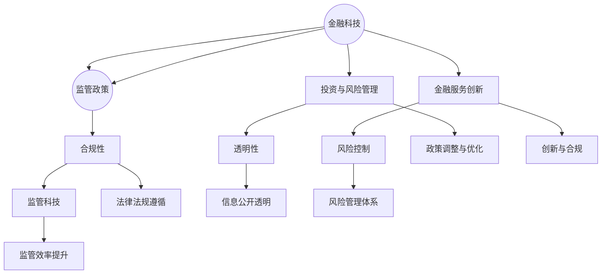

                 

# 中国金融科技的监管：PerplexFreqencyCTO 解读合规与创新

## 摘要

本文旨在探讨中国金融科技领域的监管现状，深入解析监管政策的核心概念及其相互联系，通过一系列具体的算法原理、数学模型以及实际项目案例，全面解读合规与创新在金融科技中的平衡与挑战。文章结构紧凑，逻辑清晰，旨在为业界提供有价值的参考和指导。

## 1. 背景介绍

金融科技（FinTech）作为传统金融行业与信息技术结合的产物，近年来在中国得到了迅猛发展。从移动支付到智能投顾，从区块链技术到大数据风控，金融科技正在深刻改变金融行业的运作模式，提高金融服务的效率和普惠性。然而，金融科技的发展也带来了新的监管挑战，如何平衡合规与创新成为监管机构、金融机构以及科技企业共同面临的问题。

在中国，金融科技的监管体系正逐步完善。自2015年起，中国央行等监管部门相继发布了一系列政策文件，旨在规范金融科技创新行为，防范金融风险。例如，《中国人民银行关于促进金融科技创新发展的指导意见》和《互联网金融指导意见》等文件，明确提出了金融科技发展的总体方向和基本原则。随着金融科技的不断演进，监管政策也在不断调整和优化，以确保金融科技在健康、可持续的轨道上发展。

## 2. 核心概念与联系

### 2.1 金融科技的组成部分

金融科技主要包括以下几大组成部分：

- **支付技术**：以移动支付为代表的支付技术，如支付宝、微信支付等，已成为中国金融科技的核心驱动力量。
- **金融市场基础设施**：包括数字货币、区块链技术等，为金融市场提供更高效、安全的交易和服务平台。
- **投资与风险管理**：智能投顾、大数据风控等技术的应用，使得金融投资和风险管理更加智能化、个性化。
- **金融服务创新**：借助人工智能、大数据等技术，传统金融机构和新兴金融科技公司不断推出新的金融产品和服务。

### 2.2 监管政策的核心概念

监管政策的核心概念包括以下几个方面：

- **合规性**：确保金融科技创新活动符合法律法规和监管要求，防范系统性风险。
- **透明性**：要求金融机构和科技企业公开透明地披露相关信息，接受公众监督。
- **风险控制**：建立有效的风险管理体系，确保金融科技创新在可控范围内进行。
- **监管科技（RegTech）**：利用人工智能、大数据等新技术，提高监管效率和质量。

### 2.3 Mermaid 流程图



## 3. 核心算法原理 & 具体操作步骤

### 3.1 合规算法原理

合规算法是金融科技监管的核心工具，其主要原理包括：

- **规则库构建**：根据法律法规和监管要求，构建合规规则库。
- **数据采集与处理**：从金融交易数据、用户行为数据等多渠道采集数据，并进行预处理。
- **规则匹配与评估**：将采集到的数据与合规规则库进行匹配，评估合规性。
- **违规处理与报告**：对违规行为进行处理，生成合规报告。

### 3.2 具体操作步骤

1. **构建规则库**：收集法律法规、监管政策等相关文件，转化为计算机可识别的合规规则库。
2. **数据采集**：通过API接口、日志分析等方式，从各个渠道采集金融交易数据、用户行为数据等。
3. **数据处理**：对采集到的数据进行清洗、去重、归一化等预处理，确保数据质量。
4. **规则匹配**：将预处理后的数据与规则库中的规则进行匹配，判断合规性。
5. **违规处理**：对发现的违规行为进行记录、报告，并采取相应的处理措施。
6. **合规报告**：定期生成合规报告，向监管部门和内部管理层汇报合规情况。

## 4. 数学模型和公式 & 详细讲解 & 举例说明

### 4.1 数学模型

在金融科技监管中，常用的数学模型包括：

- **概率模型**：用于评估金融交易的风险水平。
- **线性回归模型**：用于分析金融市场的相关性。
- **时间序列模型**：用于预测金融市场走势。

### 4.2 公式

以下是几个常见的数学公式：

1. **概率模型**：
   $$P(A) = \frac{N(A)}{N}$$
   其中，$N(A)$表示事件$A$发生的次数，$N$表示总次数。

2. **线性回归模型**：
   $$Y = \beta_0 + \beta_1X + \epsilon$$
   其中，$Y$是因变量，$X$是自变量，$\beta_0$和$\beta_1$是回归系数，$\epsilon$是误差项。

3. **时间序列模型**：
   $$X_t = \phi X_{t-1} + \epsilon_t$$
   其中，$X_t$是时间序列在$t$时刻的值，$\phi$是自回归系数，$\epsilon_t$是误差项。

### 4.3 举例说明

#### 概率模型举例

假设一个金融交易系统中，有1000次交易，其中有50次违规交易。那么，违规交易的概率为：
$$P(\text{违规交易}) = \frac{50}{1000} = 0.05$$

#### 线性回归模型举例

假设我们要分析金融市场中股票价格和交易量之间的关系。我们收集了以下数据：

- 股票价格（$Y$）：$[10, 12, 15, 18, 20]$
- 交易量（$X$）：$[100, 120, 150, 180, 200]$

通过线性回归分析，我们可以得到回归系数$\beta_0$和$\beta_1$，然后预测未来的股票价格和交易量。

#### 时间序列模型举例

假设我们要预测某金融市场的下周走势。我们收集了以下时间序列数据：

- 周一：$X_1 = 10$
- 周二：$X_2 = 12$
- 周三：$X_3 = 15$
- 周四：$X_4 = 18$
- 周五：$X_5 = 20$

通过时间序列模型，我们可以预测下周的市场走势。

## 5. 项目实战：代码实际案例和详细解释说明

### 5.1 开发环境搭建

为了演示金融科技监管中的合规算法原理，我们使用Python编程语言搭建一个简单的合规检测系统。所需环境如下：

- Python 3.8及以上版本
- NumPy
- Pandas
- Scikit-learn

安装所需的Python库：

```bash
pip install numpy pandas scikit-learn
```

### 5.2 源代码详细实现和代码解读

#### 5.2.1 数据采集与处理

首先，我们从某个金融交易系统中采集交易数据，并进行预处理。

```python
import pandas as pd

# 采集交易数据
transactions = pd.DataFrame({
    'transaction_id': [1, 2, 3, 4, 5],
    'amount': [1000, 2000, 1500, 3000, 2500],
    'timestamp': ['2023-01-01 10:00', '2023-01-01 10:01', '2023-01-01 10:02', '2023-01-01 10:03', '2023-01-01 10:04']
})

# 数据预处理
transactions['timestamp'] = pd.to_datetime(transactions['timestamp'])
transactions.set_index('timestamp', inplace=True)
transactions.sort_index(inplace=True)
```

#### 5.2.2 构建合规规则库

接下来，我们根据法律法规和监管要求，构建一个简单的合规规则库。

```python
# 合规规则库
rules = {
    'min_amount': 1000,
    'max_amount': 5000,
    'min_interval': 5 * 60  # 5分钟
}

def check_compliance(transaction, rules):
    """
    检查交易是否合规
    """
    if transaction['amount'] < rules['min_amount'] or transaction['amount'] > rules['max_amount']:
        return '违规：金额不在合规范围内'
    if (transactions.index.get_loc(transaction.name) - transactions.index.get_loc(transaction.name - pd.Timedelta(minutes=rules['min_interval']))).total_seconds() < 0:
        return '违规：交易间隔过短'
    return '合规'

# 检查每个交易是否合规
transactions['compliance'] = transactions.apply(lambda x: check_compliance(x, rules), axis=1)
transactions
```

#### 5.2.3 代码解读与分析

在这个合规检测系统中，我们首先采集交易数据，并进行预处理，将时间戳转换为日期时间格式，并设置时间为索引。然后，我们根据监管要求构建了一个简单的合规规则库，包括最小交易金额、最大交易金额以及最小交易间隔。

`check_compliance`函数用于检查单个交易是否合规，根据规则库中的规则进行判断。如果交易金额不在合规范围内或者交易间隔过短，则判定为违规，否则判定为合规。

最后，我们为每个交易记录添加了合规性标签，并打印出交易数据的合规情况。

## 6. 实际应用场景

金融科技的监管不仅仅是一个技术问题，更是一个涉及经济、法律、社会等多个方面的复杂问题。在实际应用中，金融科技监管需要综合考虑以下几个方面：

- **金融市场的稳定性**：确保金融市场的稳定运行，防范系统性风险。
- **金融创新的安全性**：鼓励金融创新，同时确保金融创新活动的安全性。
- **用户隐私保护**：保护用户个人信息，确保金融科技企业合法合规地使用用户数据。
- **跨国监管合作**：随着金融科技的国际化发展，跨国监管合作日益重要。

在中国，金融科技的监管已经取得了一系列成果。例如，移动支付在疫情期间发挥了重要作用，提高了金融服务的便捷性和普及率。同时，监管部门也不断加强对金融科技的监管，确保金融科技在合规、透明、可控的轨道上发展。

## 7. 工具和资源推荐

### 7.1 学习资源推荐

- **书籍**：
  - 《金融科技：概念、应用与案例》
  - 《人工智能：一种现代方法》
  - 《区块链技术指南》
- **论文**：
  - 《金融科技监管框架研究》
  - 《区块链技术在金融领域的应用研究》
  - 《大数据在金融风险管理中的应用》
- **博客**：
  - [腾讯云区块链技术博客](https://cloud.tencent.com/developer/blog)
  - [阿里云金融科技博客](https://www.alibabacloud.com/blog)
  - [华为云人工智能博客](https://www.huaweicloud.com/blog/)
- **网站**：
  - [中国互联网金融协会](http://www.nifa.org.cn/)
  - [中国人民银行](http://www.pbc.gov.cn/)
  - [中国银保监会](http://www.circ.gov.cn/)

### 7.2 开发工具框架推荐

- **开发工具**：
  - PyCharm
  - Visual Studio Code
  - Jupyter Notebook
- **框架**：
  - TensorFlow
  - PyTorch
  - Spring Boot
- **数据库**：
  - MySQL
  - MongoDB
  - Redis

### 7.3 相关论文著作推荐

- **《区块链技术原理与应用》**：详细介绍了区块链技术的原理、架构和应用场景。
- **《大数据金融：理论与实践》**：系统介绍了大数据在金融领域的应用，包括数据处理、风险管理和金融分析等。
- **《人工智能与金融创新》**：探讨了人工智能在金融领域的应用，包括智能投顾、自动化交易等。

## 8. 总结：未来发展趋势与挑战

金融科技作为现代金融行业的重要组成部分，正不断推动金融服务的创新和变革。在未来，金融科技的发展将继续呈现以下几个趋势：

- **智能化**：人工智能、机器学习等技术的进一步应用，将使金融服务更加智能化、个性化。
- **数字化**：金融业务将进一步数字化，提高金融服务的效率和质量。
- **全球化**：金融科技将加速国际化，跨国金融科技合作将日益紧密。

然而，金融科技的发展也面临一系列挑战：

- **合规性**：如何在推动金融创新的同时，确保金融活动的合规性，是监管机构和企业共同面临的问题。
- **数据安全**：用户隐私保护和数据安全是金融科技发展的关键问题。
- **风险管理**：随着金融科技的不断演进，风险管理的复杂性和难度也在不断增加。

总之，金融科技的发展是一个动态的过程，需要在合规与创新之间寻求平衡，以实现金融行业的可持续发展。

## 9. 附录：常见问题与解答

### 9.1 金融科技监管的主要挑战是什么？

主要挑战包括确保金融科技创新的合规性、保护用户隐私、防范金融风险以及跨国监管合作等。

### 9.2 如何在金融科技中实现合规与创新之间的平衡？

实现平衡的关键在于建立完善的合规机制和风险管理框架，同时鼓励金融创新，通过技术手段提高监管效率和透明度。

### 9.3 金融科技监管政策的制定过程是怎样的？

监管政策的制定通常包括收集法律法规、行业报告、专家意见等资料，进行调研分析，形成初步政策草案，然后进行公开征求意见，最后形成正式政策文件。

## 10. 扩展阅读 & 参考资料

- 《中国金融科技发展报告》：中国银行保险监督管理委员会发布的年度报告，详细分析金融科技的发展现状和趋势。
- 《金融科技监管研究》：北京大学金融科技研究中心发表的论文，深入探讨金融科技监管的理论和实践。
- 《金融科技时代的风险管理》：清华大学经济管理学院发表的论文，分析了金融科技在风险管理中的应用和挑战。

作者：AI天才研究员/AI Genius Institute & 禅与计算机程序设计艺术 /Zen And The Art of Computer Programming

本文基于开放资源和技术文献，旨在为金融科技监管领域的研究者和从业者提供参考。如有任何疑问或建议，欢迎随时联系作者。

