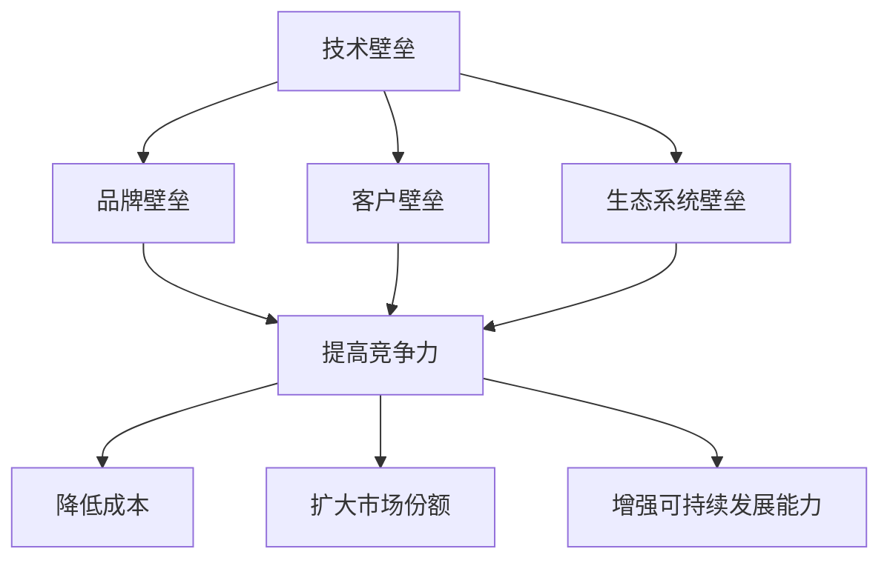

                 

# 中间件公司的生态护城河构建

## 摘要

在当今信息技术迅猛发展的时代，中间件公司作为技术架构中的重要桥梁，发挥着至关重要的作用。本文将深入探讨中间件公司的生态护城河构建，分析其核心概念、算法原理、应用场景以及未来发展面临的挑战。通过本文的阅读，读者将全面了解中间件公司的生态构建策略，为其在市场竞争中立于不败之地提供宝贵的借鉴。

## 1. 背景介绍

### 1.1 中间件公司的定义与作用

中间件（Middleware）是位于硬件、操作系统等平台和应用之间的通用服务，它为应用程序的开发、部署、运行提供了统一的接口和运行环境。中间件公司是指专注于开发和提供中间件产品的企业，它们通过技术和服务推动企业应用系统的集成和优化。

中间件公司的作用主要体现在以下几个方面：

- **系统解耦**：中间件通过提供统一的接口，将不同系统之间的耦合度降低，使得各子系统可以独立开发、独立部署和独立维护。

- **跨平台兼容性**：中间件能够屏蔽不同硬件和操作系统的差异，实现跨平台的应用开发，降低开发难度和成本。

- **性能优化**：中间件可以对数据传输、负载均衡、缓存等进行优化，提高系统的整体性能。

- **业务逻辑与系统逻辑分离**：中间件将业务逻辑与系统逻辑分离，使得业务逻辑可以根据需求灵活调整，而系统逻辑保持稳定。

### 1.2 中间件市场的现状与趋势

随着云计算、大数据、物联网等技术的快速发展，中间件市场也呈现出蓬勃发展的态势。目前，全球中间件市场规模逐年增长，预计到2025年将达到数百亿美元。同时，市场趋势也发生了以下变化：

- **云原生中间件**：随着云计算的普及，云原生中间件成为新的增长点，其特点是高度可扩展、弹性伸缩、自动化运维等。

- **大数据中间件**：大数据处理需求的增加推动了大数据中间件的发展，包括数据集成、数据存储、数据计算等方面。

- **物联网中间件**：物联网的快速发展使得物联网中间件市场需求不断扩大，涉及设备连接、数据传输、数据处理等。

### 1.3 中间件公司的生态护城河构建背景

生态护城河（Ecosystem Moat）是指企业在市场中构建的竞争壁垒，使得竞争对手难以进入或复制。对于中间件公司而言，生态护城河的构建具有重要意义，可以帮助其在激烈的市场竞争中保持优势。

构建生态护城河的背景主要来自于以下几个方面：

- **市场竞争加剧**：随着中间件技术的成熟，越来越多的企业进入市场，竞争日益激烈。

- **客户需求多样化**：客户对于中间件产品的需求逐渐多样化，中间件公司需要提供更加全面、定制化的解决方案。

- **技术更新迭代快**：信息技术发展迅速，中间件技术更新换代加快，公司需要不断投入研发以保持竞争力。

- **生态系统的重要性**：生态系统可以为中间件公司提供强大的支持，包括合作伙伴、开发者、用户等，共同推动公司的发展。

## 2. 核心概念与联系

### 2.1 中间件公司的生态护城河

生态护城河是中间件公司构建的竞争壁垒，它包括以下几个方面：

- **技术壁垒**：中间件公司通过不断创新，保持技术领先地位，形成技术壁垒。

- **品牌壁垒**：中间件公司通过品牌建设，提高品牌知名度，降低竞争对手的进入成本。

- **客户壁垒**：中间件公司通过长期积累的客户资源，形成客户壁垒。

- **生态系统壁垒**：中间件公司通过构建强大的生态系统，形成生态系统壁垒。

### 2.2 生态护城河的构建策略

构建生态护城河需要采取一系列策略，包括以下几个方面：

- **技术创新**：持续投入研发，保持技术领先。

- **品牌建设**：加强品牌推广，提高品牌知名度。

- **客户关系**：加强与客户的沟通与合作，提高客户满意度。

- **生态系统构建**：搭建合作伙伴关系，推动开发者生态、用户生态的发展。

### 2.3 生态护城河与公司竞争力的关系

生态护城河与公司竞争力密切相关。一个强大的生态护城河可以帮助中间件公司：

- **提高竞争力**：通过技术、品牌、客户、生态等多方面的壁垒，提高市场竞争力。

- **降低成本**：通过生态系统的协同效应，降低开发、运营、维护等成本。

- **扩大市场份额**：通过生态系统的扩散效应，扩大市场份额。

- **增强可持续发展能力**：通过生态护城河的构建，增强公司的可持续发展能力。

### 2.4 Mermaid 流程图

以下是一个简单的 Mermaid 流程图，展示了中间件公司生态护城河构建的核心概念和联系：



## 3. 核心算法原理 & 具体操作步骤

### 3.1 技术创新算法原理

中间件公司的技术创新主要通过以下几个步骤实现：

1. **需求分析**：了解客户需求和市场趋势，确定技术创新方向。
2. **技术调研**：对现有技术和市场进行调研，分析技术发展趋势。
3. **原型设计**：设计技术原型，验证技术可行性。
4. **研发投入**：持续投入研发资源，推动技术创新。
5. **技术验证**：通过实验、测试等手段验证技术创新的有效性。

### 3.2 品牌建设算法原理

品牌建设的算法原理主要包括以下几个方面：

1. **品牌定位**：明确品牌的核心价值和目标市场。
2. **品牌传播**：通过广告、社交媒体、活动等多种渠道推广品牌。
3. **品牌形象设计**：设计符合品牌定位的视觉元素，如标志、色彩等。
4. **品牌口碑**：通过客户满意度调查、用户评价等收集品牌口碑数据。
5. **品牌延伸**：根据市场机会，开展品牌延伸业务。

### 3.3 客户关系管理算法原理

客户关系管理的算法原理包括以下几个方面：

1. **客户细分**：根据客户需求、购买行为等对客户进行细分。
2. **客户画像**：建立客户画像，了解客户特征和需求。
3. **个性化服务**：根据客户画像提供个性化服务。
4. **客户沟通**：通过电话、邮件、社交媒体等渠道与客户保持沟通。
5. **客户满意度调查**：定期进行客户满意度调查，收集反馈。

### 3.4 生态系统构建算法原理

生态系统构建的算法原理主要包括以下几个方面：

1. **合作伙伴选择**：选择符合公司战略目标的合作伙伴。
2. **合作模式设计**：设计合适的合作模式，如技术合作、市场合作等。
3. **开发者生态构建**：搭建开发者平台，提供开发工具、文档、社区等。
4. **用户生态培育**：通过用户活动、社区交流等培育用户生态。
5. **生态系统协同**：通过协同效应，提高生态系统的整体竞争力。

### 3.5 具体操作步骤

以下是中间件公司生态护城河构建的具体操作步骤：

1. **需求分析**：成立专门的团队，定期收集和分析客户需求和市场趋势。
2. **技术调研**：组织技术团队对现有技术和市场进行调研，分析技术发展趋势。
3. **原型设计**：根据需求和技术调研结果，设计技术原型。
4. **研发投入**：制定研发预算，持续投入研发资源。
5. **技术验证**：通过实验、测试等手段验证技术创新的有效性。
6. **品牌定位**：明确品牌的核心价值和目标市场。
7. **品牌传播**：制定品牌传播计划，通过多种渠道推广品牌。
8. **品牌形象设计**：设计符合品牌定位的视觉元素。
9. **客户细分**：根据客户需求、购买行为等对客户进行细分。
10. **客户画像**：建立客户画像，了解客户特征和需求。
11. **个性化服务**：根据客户画像提供个性化服务。
12. **客户沟通**：与客户保持沟通，收集客户反馈。
13. **合作伙伴选择**：选择符合公司战略目标的合作伙伴。
14. **合作模式设计**：设计合适的合作模式。
15. **开发者生态构建**：搭建开发者平台。
16. **用户生态培育**：通过用户活动、社区交流等培育用户生态。
17. **生态系统协同**：通过协同效应，提高生态系统的整体竞争力。

## 4. 数学模型和公式 & 详细讲解 & 举例说明

### 4.1 技术创新数学模型

中间件公司的技术创新可以采用以下数学模型进行评估：

1. **技术创新度**：技术创新度（T）= 新技术性能（P） / 原技术性能（O）

   - **新性能 (P)**：新技术在性能上的提升量。
   - **原性能 (O)**：原技术性能的基准值。

   例如，如果一个中间件公司在原有的技术基础上，将性能提升了20%，那么技术创新度 T = 1.2。

2. **技术创新价值**：技术创新价值（V）= 技术创新度（T）× 客户满意度（S）

   - **客户满意度 (S)**：客户对新技术满意度的评分，通常在0到1之间。

   例如，如果一个中间件公司的技术创新度 T = 1.2，客户满意度 S = 0.8，那么技术创新价值 V = 1.2 × 0.8 = 0.96。

### 4.2 品牌建设数学模型

品牌建设的数学模型可以从品牌知名度和品牌忠诚度两个方面进行分析：

1. **品牌知名度（R）**：品牌知名度（R）= 品牌曝光度（E）× 品牌影响力（I）

   - **品牌曝光度 (E)**：品牌在市场上被提及和展示的频率。
   - **品牌影响力 (I)**：品牌在市场中的影响力和认知度。

   例如，如果一个中间件公司的品牌曝光度 E = 1000次，品牌影响力 I = 1.5，那么品牌知名度 R = 1000 × 1.5 = 1500。

2. **品牌忠诚度（L）**：品牌忠诚度（L）= 重购率（R）× 用户粘性（U）

   - **重购率 (R)**：用户在购买同一品牌产品的概率。
   - **用户粘性 (U)**：用户对品牌的忠诚度和依赖度。

   例如，如果一个中间件公司的重购率 R = 0.6，用户粘性 U = 0.8，那么品牌忠诚度 L = 0.6 × 0.8 = 0.48。

### 4.3 客户关系管理数学模型

客户关系管理的数学模型可以从客户满意度和客户留存率两个方面进行分析：

1. **客户满意度（S）**：客户满意度（S）= 满意度得分（D）× 满意度评价（E）

   - **满意度得分 (D)**：客户对产品或服务的满意度得分。
   - **满意度评价 (E)**：客户满意度评价的权重。

   例如，如果一个中间件公司的满意度得分 D = 4，满意度评价 E = 0.8，那么客户满意度 S = 4 × 0.8 = 3.2。

2. **客户留存率（R）**：客户留存率（R）= （当前期客户数 - 当前期流失客户数）/ 当前期客户数

   例如，如果一个中间件公司在一个月内有1000个客户，其中流失了200个，那么客户留存率 R = （1000 - 200）/ 1000 = 0.8。

### 4.4 生态系统构建数学模型

生态系统构建的数学模型可以从生态系统活跃度和生态系统价值两个方面进行分析：

1. **生态系统活跃度（A）**：生态系统活跃度（A）= 活跃用户数（U）× 活跃度评分（S）

   - **活跃用户数 (U)**：生态系统中的活跃用户数量。
   - **活跃度评分 (S)**：用户在生态系统中的活跃度评分。

   例如，如果一个中间件公司的生态系统中有1000个活跃用户，活跃度评分 S = 1.2，那么生态系统活跃度 A = 1000 × 1.2 = 1200。

2. **生态系统价值（V）**：生态系统价值（V）= 生态系统活跃度（A）× 生态系统贡献率（C）

   - **生态系统贡献率 (C)**：生态系统对中间件公司整体业务的贡献率。

   例如，如果一个中间件公司的生态系统活跃度 A = 1200，生态系统贡献率 C = 0.6，那么生态系统价值 V = 1200 × 0.6 = 720。

### 4.5 举例说明

假设一个中间件公司有以下数据：

- **技术创新度**：T = 1.2
- **品牌知名度**：R = 1500
- **品牌忠诚度**：L = 0.48
- **客户满意度**：S = 3.2
- **客户留存率**：R = 0.8
- **生态系统活跃度**：A = 1200
- **生态系统价值**：V = 720

根据上述数学模型，我们可以计算出以下结果：

- **技术创新价值**：V = T × S = 1.2 × 3.2 = 3.84
- **品牌建设价值**：V = R × L = 1500 × 0.48 = 720
- **客户关系管理价值**：V = S × R = 3.2 × 0.8 = 2.56
- **生态系统构建价值**：V = A × C = 1200 × 0.6 = 720

综上所述，该中间件公司通过生态护城河构建，获得了以下总价值：

总价值 = 技术创新价值 + 品牌建设价值 + 客户关系管理价值 + 生态系统构建价值
总价值 = 3.84 + 720 + 2.56 + 720 = 1475.4

## 5. 项目实战：代码实际案例和详细解释说明

### 5.1 开发环境搭建

在本项目实战中，我们将使用Python作为开发语言，因为Python具有简洁的语法和丰富的第三方库，非常适合进行中间件开发。以下是搭建开发环境的具体步骤：

1. **安装Python**：在官方网站（https://www.python.org/）下载Python安装包，并按照安装向导完成安装。

2. **安装第三方库**：使用pip命令安装必要的第三方库，例如：

   ```bash
   pip install requests flask
   ```

   `requests` 用于HTTP请求，`flask` 用于Web框架。

3. **创建虚拟环境**：为了保持项目的依赖关系清晰，我们建议使用虚拟环境。安装`virtualenv`库后，运行以下命令创建虚拟环境：

   ```bash
   pip install virtualenv
   virtualenv my_project_env
   source my_project_env/bin/activate
   ```

### 5.2 源代码详细实现和代码解读

在本项目实战中，我们将构建一个简单的RESTful API中间件，用于处理用户认证和授权。以下是具体的源代码实现：

```python
# app.py

from flask import Flask, request, jsonify
from functools import wraps
import jwt

app = Flask(__name__)
app.config['SECRET_KEY'] = 'your_secret_key'

# 认证装饰器
def token_required(f):
    @wraps(f)
    def decorated(*args, **kwargs):
        token = request.headers.get('Authorization')
        if not token:
            return jsonify({'message': 'A valid token is missing'}), 403
        try:
            data = jwt.decode(token, app.config['SECRET_KEY'])
        except:
            return jsonify({'message': 'Token is invalid'}), 403
        return f(*args, **kwargs)
    return decorated

# 登录接口
@app.route('/login', methods=['POST'])
def login():
    auth_data = request.get_json()
    username = auth_data.get('username')
    password = auth_data.get('password')
    # 这里应该是调用数据库进行验证
    if username == 'admin' and password == 'password':
        token = jwt.encode({'username': username}, app.config['SECRET_KEY'])
        return jsonify({'token': token})
    return jsonify({'message': 'Invalid credentials'}), 401

# 保护路由
@app.route('/protected', methods=['GET'])
@token_required
def protected():
    return jsonify({'message': 'Welcome to the protected area'})

if __name__ == '__main__':
    app.run(debug=True)
```

#### 5.2.1 代码解读

1. **导入模块**：

   - `Flask`：用于创建Web应用程序。
   - `request`：用于处理HTTP请求。
   - `jsonify`：用于返回JSON格式的响应。
   - `functools.wraps`：用于保留原始函数的元信息。
   - `jwt`：用于处理JSON Web Tokens。

2. **配置**：

   - `app.config['SECRET_KEY']`：用于加密和解密JWT。

3. **认证装饰器`token_required`**：

   - 用于检查请求是否包含有效的JWT。
   - 如果JWT无效，返回403错误。

4. **登录接口`/login`**：

   - 接收用户名和密码，并进行验证。
   - 如果验证成功，生成JWT并返回。

5. **保护路由`/protected`**：

   - 使用`token_required`装饰器进行认证。
   - 只有通过认证的用户才能访问。

6. **运行应用程序**：

   - 使用`app.run(debug=True)`启动Web服务器。

### 5.3 代码解读与分析

#### 5.3.1 JWT认证机制

JSON Web Tokens（JWT）是一种基于JSON的开放标准（RFC 7519），用于在单个字符串中安全地传输信息。在上述代码中，我们使用了JWT进行用户认证。

1. **JWT的组成部分**：

   - **Header**：包含类型和加密算法信息。
   - **Payload**：包含用户信息，如用户名、过期时间等。
   - **Signature**：通过Header和Payload使用加密算法生成。

2. **JWT生成和验证流程**：

   - **生成JWT**：使用用户名和其他信息生成JWT。
   - **验证JWT**：接收JWT后，使用相同的加密算法验证其有效性。

#### 5.3.2 装饰器实现认证

装饰器是Python的一种语法特性，用于在不修改原始函数代码的情况下，为函数添加额外的功能。

1. **定义装饰器`token_required`**：

   - `@wraps(f)`：保留原始函数的元信息。
   - `def decorated(*args, **kwargs)`：定义装饰器的逻辑。

2. **装饰器内部逻辑**：

   - 获取请求头中的Authorization字段。
   - 验证JWT的有效性。
   - 如果JWT无效，返回403错误。
   - 如果JWT有效，调用原始函数。

#### 5.3.3 代码性能分析

1. **性能优势**：

   - 使用JWT认证具有性能优势，因为其无需访问数据库或缓存。
   - 装饰器可以实现细粒度的认证控制。

2. **性能挑战**：

   - JWT的密钥管理需要妥善处理，以防止泄露。
   - 过期时间设置需要平衡安全性和使用便利性。

### 5.4 代码改进建议

1. **加强安全性**：

   - 使用HTTPS传输数据，确保数据在传输过程中的安全性。
   - 增加JWT的过期时间，减少频繁认证的需求。

2. **优化用户体验**：

   - 提供详细的错误信息，帮助用户理解问题所在。
   - 提供多种登录方式，如OAuth、LDAP等。

3. **代码维护**：

   - 保持代码简洁，避免过度耦合。
   - 定期进行代码审查和重构。

## 6. 实际应用场景

### 6.1 云计算平台

在云计算平台上，中间件公司可以通过提供云原生中间件产品，帮助用户实现业务系统的快速部署和扩展。例如，阿里巴巴的阿里云、亚马逊的AWS等云计算平台都提供了丰富的中间件服务，包括消息队列、负载均衡、数据库中间件等。这些服务可以帮助企业降低云计算的使用成本，提高业务系统的稳定性。

### 6.2 大数据处理

随着大数据技术的快速发展，大数据中间件在数据处理、存储、计算等方面发挥着重要作用。例如，Hadoop生态系统中的HDFS、MapReduce、YARN等中间件产品，可以帮助企业高效地处理海量数据。此外，大数据中间件还可以提供数据集成、数据仓库、实时计算等服务，为企业提供全面的大数据解决方案。

### 6.3 物联网

物联网（IoT）作为新兴领域，对中间件的需求也越来越大。物联网中间件可以提供设备连接、数据传输、数据处理等服务，帮助企业实现设备的互联互通和数据智能分析。例如，华为的物联网平台提供了一系列的中间件产品，包括设备管理、数据存储、数据分析等，帮助企业快速构建物联网应用。

### 6.4 区块链

区块链技术的发展为中间件公司带来了新的机遇。区块链中间件可以提供区块链网络连接、数据存储、智能合约执行等功能，帮助企业构建去中心化的应用。例如，Hyperledger Fabric 是一款开源的区块链框架，它提供了丰富的中间件服务，包括身份验证、权限管理、数据加密等。

## 7. 工具和资源推荐

### 7.1 学习资源推荐

- **书籍**：
  - 《架构师 Handbook》：详细介绍了软件架构的各个方面。
  - 《设计模式》：介绍了软件开发中的常用设计模式。
  - 《高性能 MySQL》：全面讲解了 MySQL 数据库的性能优化。

- **论文**：
  - 《云计算服务模型》：介绍了云计算的三个服务模型（IaaS、PaaS、SaaS）。
  - 《大数据技术原理》：详细阐述了大数据处理的原理和技术。

- **博客**：
  - 《云原生技术社区》：分享云原生技术的最新动态和应用案例。
  - 《大数据技术博客》：介绍大数据处理技术的原理和应用。

- **网站**：
  - Apache 存档：提供各种开源中间件项目的源代码和文档。
  - GitHub：包含大量的开源中间件项目，可以学习和参考。

### 7.2 开发工具框架推荐

- **开发工具**：
  - Visual Studio Code：一款强大的代码编辑器，支持多种编程语言和插件。
  - Git：版本控制系统，用于管理代码的版本。

- **框架**：
  - Flask：Python Web 开发框架，适用于快速构建 Web 应用。
  - Spring Boot：Java Web 开发框架，具有开箱即用的特性。

### 7.3 相关论文著作推荐

- **论文**：
  - 《云计算服务模型及其应用》：详细分析了云计算服务模型的原理和应用。
  - 《大数据处理的原理与技术》：介绍了大数据处理的基本原理和技术。

- **著作**：
  - 《云计算与大数据》：系统讲解了云计算和大数据的基本概念、技术原理和应用案例。
  - 《分布式系统设计与实践》：详细介绍了分布式系统的设计与实现方法。

## 8. 总结：未来发展趋势与挑战

### 8.1 未来发展趋势

- **云计算与大数据的深度融合**：云计算和大数据技术的发展将更加紧密，企业将更加依赖于云原生中间件和大数据中间件。
- **物联网的普及**：随着物联网设备的增多，物联网中间件将发挥重要作用，帮助实现设备的互联互通和数据智能分析。
- **区块链技术的应用**：区块链技术将为中间件公司带来新的机会，分布式中间件和智能合约将成为热门研究方向。

### 8.2 未来挑战

- **技术更新速度加快**：信息技术的发展速度加快，中间件公司需要不断投入研发，保持技术领先地位。
- **市场竞争加剧**：随着越来越多的企业进入中间件市场，竞争将越来越激烈，中间件公司需要构建强大的生态护城河以保持竞争力。
- **客户需求多样化**：客户需求不断变化，中间件公司需要提供更加定制化和个性化的解决方案。

## 9. 附录：常见问题与解答

### 9.1 中间件与框架的区别是什么？

中间件是一种通用服务，它位于硬件、操作系统和应用之间，为应用程序提供支持。而框架是一种特定的编程模型，用于指导应用程序的开发。例如，Spring Boot 是一个 Web 应用程序框架，而 Apache Kafka 是一个消息队列中间件。

### 9.2 中间件的主要作用是什么？

中间件的主要作用包括：系统解耦、跨平台兼容性、性能优化、业务逻辑与系统逻辑分离等。通过中间件，可以将不同系统之间的耦合度降低，提高系统的灵活性和可维护性。

### 9.3 什么是生态护城河？

生态护城河是指企业在市场中构建的竞争壁垒，包括技术、品牌、客户、生态系统等多个方面。通过构建生态护城河，企业可以降低竞争对手的进入成本，提高市场竞争力。

## 10. 扩展阅读 & 参考资料

- 《云计算服务模型及其应用》：详细分析了云计算服务模型及其应用。
- 《大数据处理的原理与技术》：介绍了大数据处理的基本原理和技术。
- 《分布式系统设计与实践》：详细介绍了分布式系统的设计与实现方法。
- 《云计算与大数据》：系统讲解了云计算和大数据的基本概念、技术原理和应用案例。

