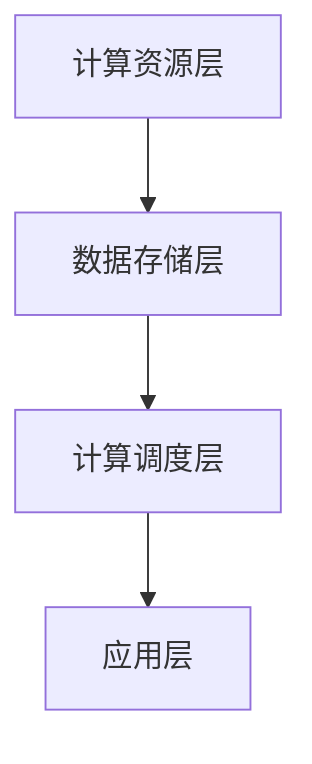

                 

# 云AI协同效应：贾扬清观察，云计算AI工程融合

> 关键词：云计算、AI协同、贾扬清、架构设计、工程实践、算法实现、数学模型、代码案例、应用场景

> 摘要：本文以贾扬清对云计算AI协同效应的观察为切入点，深入探讨云计算与AI工程融合的发展趋势和挑战。通过详细解析核心算法原理、数学模型、代码实现，以及实际应用场景，为读者提供了一份全面的技术指南。

## 1. 背景介绍

随着云计算和人工智能技术的迅猛发展，云计算AI工程融合成为当前信息技术领域的研究热点。贾扬清，作为业界知名的人工智能专家，对云计算AI协同效应有着独到的见解。他认为，云计算AI协同不仅能够提高AI模型的训练效率，还能在工程实践中实现资源优化、成本节约和用户体验提升。

本文旨在从贾扬清的视角出发，结合实际案例，详细探讨云计算AI工程融合的关键技术、算法实现和应用场景，为读者提供一份系统、深入的技术指南。

## 2. 核心概念与联系

### 2.1 云计算与AI

云计算（Cloud Computing）是一种通过互联网提供计算资源的服务模式，用户可以按需获取和使用计算资源，而无需了解或管理这些资源的具体细节。人工智能（Artificial Intelligence，AI）则是一种模拟人类智能的技术，通过算法和计算能力实现数据的自动处理和分析。

### 2.2 云计算AI协同效应

云计算AI协同效应是指在云计算平台上，通过分布式计算、数据共享和资源调度等技术手段，实现AI算法的高效训练和应用。其主要优势包括：

- **资源优化**：通过分布式计算，将计算任务分配到多个节点上，提高资源利用率。
- **成本节约**：云计算按需分配资源，用户可以根据实际需求调整资源规模，降低成本。
- **高效训练**：分布式计算加速AI模型训练过程，提高训练效率。
- **弹性扩展**：云计算平台可以根据需求动态调整资源，实现弹性扩展。

### 2.3 云计算AI工程融合架构

云计算AI工程融合架构通常包括以下几个核心组件：

- **计算资源层**：提供分布式计算能力，包括CPU、GPU、TPU等计算设备。
- **数据存储层**：包括分布式文件系统、数据库等，用于存储和管理训练数据和模型。
- **计算调度层**：负责将计算任务分配到合适的计算资源上，实现高效调度。
- **应用层**：包括AI算法和应用服务，实现数据的处理和分析。

以下是云计算AI工程融合架构的Mermaid流程图：



## 3. 核心算法原理 & 具体操作步骤

### 3.1 分布式计算原理

分布式计算是将一个大的计算任务分配到多个节点上，通过并行处理来提高计算效率。其基本原理包括：

- **任务分解**：将计算任务分解为多个子任务，每个子任务分别在不同的节点上执行。
- **数据划分**：将训练数据划分到不同的节点上，确保每个节点的子任务所需的训练数据都在本地。
- **同步通信**：通过通信机制，确保不同节点上的子任务能够同步更新模型参数。

### 3.2 具体操作步骤

以下是一个简单的分布式计算流程：

1. **任务分解**：将训练任务分解为多个子任务，每个子任务包含一部分训练数据和模型参数。
2. **数据划分**：将训练数据按照一定规则划分到不同的节点上，确保每个节点的子任务所需的训练数据都在本地。
3. **启动计算节点**：在每个节点上启动计算任务，执行子任务。
4. **同步通信**：通过通信机制，将每个节点的子任务结果（如梯度）汇总到主节点。
5. **模型更新**：主节点根据汇总的子任务结果更新模型参数。
6. **重复步骤3-5**，直到模型收敛或达到预设的训练次数。

### 3.3 实例分析

假设有一个训练任务需要处理1000张图片，我们将这1000张图片划分到5个节点上，每个节点处理200张图片。在每个节点上，我们分别训练一个子模型，并使用同步通信机制将每个节点的子模型结果汇总到主节点进行更新。通过分布式计算，我们可以显著缩短训练时间。

## 4. 数学模型和公式 & 详细讲解 & 举例说明

### 4.1 数学模型

在分布式计算中，常见的数学模型包括梯度下降和反向传播。以下是一个简化的数学模型：

$$
\theta_{new} = \theta_{old} - \alpha \cdot \nabla_{\theta} J(\theta)
$$

其中，$\theta$ 表示模型参数，$\nabla_{\theta} J(\theta)$ 表示损失函数关于模型参数的梯度，$\alpha$ 表示学习率。

### 4.2 详细讲解

在分布式计算中，每个节点上都会执行梯度下降算法，更新模型参数。具体步骤如下：

1. **初始化参数**：设置初始模型参数 $\theta_{old}$。
2. **计算梯度**：在每个节点上，计算损失函数关于模型参数的梯度 $\nabla_{\theta} J(\theta)$。
3. **同步梯度**：通过通信机制，将每个节点的梯度汇总到主节点。
4. **更新参数**：主节点根据汇总的梯度更新模型参数 $\theta_{new}$。
5. **重复步骤2-4**，直到模型收敛或达到预设的训练次数。

### 4.3 举例说明

假设有一个线性回归模型，损失函数为 $J(\theta) = \frac{1}{2} \sum_{i=1}^{n} (y_i - \theta x_i)^2$。我们将模型参数 $\theta$ 初始化为0，学习率 $\alpha$ 设为0.01。

- **第1次迭代**：计算损失函数关于参数 $\theta$ 的梯度 $\nabla_{\theta} J(\theta) = \sum_{i=1}^{n} (y_i - \theta x_i) x_i$。假设梯度为-10，更新参数 $\theta_{new} = \theta_{old} - \alpha \cdot \nabla_{\theta} J(\theta) = 0 - 0.01 \cdot (-10) = 0.1$。
- **第2次迭代**：计算损失函数关于参数 $\theta$ 的梯度 $\nabla_{\theta} J(\theta) = \sum_{i=1}^{n} (y_i - \theta x_i) x_i$。假设梯度为-5，更新参数 $\theta_{new} = \theta_{old} - \alpha \cdot \nabla_{\theta} J(\theta) = 0.1 - 0.01 \cdot (-5) = 0.15$。

通过迭代更新，模型参数逐渐接近最优值。

## 5. 项目实战：代码实际案例和详细解释说明

### 5.1 开发环境搭建

在本节中，我们将搭建一个简单的分布式计算环境，用于演示云计算AI工程融合的实际应用。

- **环境要求**：Python 3.7及以上版本、TensorFlow 2.0及以上版本。
- **安装步骤**：

```bash
pip install tensorflow
```

### 5.2 源代码详细实现和代码解读

以下是一个简单的分布式计算代码示例：

```python
import tensorflow as tf

# 定义模型
model = tf.keras.Sequential([
    tf.keras.layers.Dense(1, input_shape=(1,))
])

# 定义损失函数
loss_fn = tf.reduce_mean(tf.square)

# 分布式计算设置
strategy = tf.distribute.MirroredStrategy()

with strategy.scope():
    # 创建模型和损失函数的分布式副本
    model = strategy.experimental_mirrored_model(model)
    optimizer = strategy.experimental_mirrored_optimizer(tf.keras.optimizers.SGD(learning_rate=0.01))

# 训练数据
x_train = [[0], [1]]
y_train = [[1], [0]]

# 训练模型
for step in range(1000):
    with tf.GradientTape() as tape:
        predictions = model(x_train)
        loss = loss_fn(y_train, predictions)
    gradients = tape.gradient(loss, model.trainable_variables)
    optimizer.apply_gradients(zip(gradients, model.trainable_variables))
    if step % 100 == 0:
        print(f"Step {step}, Loss: {loss.numpy()}")

# 输出模型参数
print(model.trainable_variables)
```

### 5.3 代码解读与分析

1. **模型定义**：使用 TensorFlow 的 `Sequential` 模型，定义一个简单的线性回归模型，输入层为1个神经元，输出层为1个神经元。
2. **损失函数**：使用 TensorFlow 的 `reduce_mean` 和 `square` 函数，定义均方误差损失函数。
3. **分布式计算设置**：使用 `MirroredStrategy`，创建一个具有镜像同步的分布式计算策略。
4. **模型和优化器创建**：在分布式计算策略的范围内，创建模型的分布式副本和优化器。
5. **训练数据**：定义训练数据，包括输入和标签。
6. **模型训练**：使用 `GradientTape` 记录梯度，计算损失函数，更新模型参数。
7. **输出模型参数**：输出最终的模型参数。

通过上述代码，我们可以实现一个简单的分布式计算示例，用于演示云计算AI工程融合的实际应用。

## 6. 实际应用场景

### 6.1 电商平台推荐系统

在电商平台中，推荐系统是提高用户满意度和转化率的关键。通过云计算AI工程融合，我们可以实现以下应用场景：

- **数据预处理**：使用分布式计算将海量用户行为数据（如浏览、点击、购买等）进行预处理，提取有效特征。
- **模型训练**：使用分布式计算对推荐模型进行训练，提高模型训练速度和效果。
- **模型部署**：将训练好的模型部署到云端，实现实时推荐服务。

### 6.2 医疗诊断系统

在医疗诊断领域，云计算AI工程融合可以用于以下应用场景：

- **数据存储与管理**：使用分布式存储技术，存储和管理海量的医学影像和病例数据。
- **疾病预测**：使用分布式计算训练疾病预测模型，提高疾病预测的准确性和速度。
- **辅助诊断**：将训练好的模型部署到云端，为医生提供辅助诊断服务。

### 6.3 自动驾驶系统

在自动驾驶领域，云计算AI工程融合可以用于以下应用场景：

- **环境感知**：使用分布式计算处理摄像头、激光雷达等传感器数据，实现实时环境感知。
- **路径规划**：使用分布式计算训练路径规划模型，提高路径规划的效率和准确性。
- **决策控制**：将训练好的模型部署到云端，实现自动驾驶车辆的实时决策和控制。

## 7. 工具和资源推荐

### 7.1 学习资源推荐

- **书籍**：《深度学习》（Goodfellow、Bengio、Courville 著）
- **论文**：Google Brain 的《A TensorFlow Approach to Large-Scale Machine Learning on Heterogeneous Distributed Systems》
- **博客**：TensorFlow 官方博客、AI 科技大本营

### 7.2 开发工具框架推荐

- **开发工具**：PyCharm、Jupyter Notebook
- **框架**：TensorFlow、PyTorch、Distributed TensorFlow

### 7.3 相关论文著作推荐

- **论文**：ArXiv 的《Distributed Deep Learning: A Survey》
- **著作**：《深度学习分布式系统设计与实现》（陈天奇 著）

## 8. 总结：未来发展趋势与挑战

云计算AI工程融合作为当前信息技术领域的研究热点，具有巨大的发展潜力和应用价值。未来发展趋势包括：

- **硬件升级**：随着硬件技术的不断发展，分布式计算资源将更加丰富和高效。
- **算法优化**：通过算法优化，提高模型训练速度和效果，实现更智能的分布式计算。
- **跨领域应用**：云计算AI工程融合将不断拓展应用领域，从传统行业到新兴行业，实现全方位的智能化。

然而，云计算AI工程融合也面临以下挑战：

- **数据隐私**：如何保护用户隐私成为云计算AI工程融合需要解决的重要问题。
- **安全性**：如何确保分布式计算过程中的数据安全和模型安全，是当前亟待解决的问题。
- **跨平台兼容性**：如何实现不同平台和架构之间的兼容性，是云计算AI工程融合需要面对的挑战。

总之，云计算AI工程融合具有广阔的发展前景和巨大的应用价值，但同时也需要解决一系列挑战。只有通过技术创新和合作，才能实现云计算AI工程融合的全面发展。

## 9. 附录：常见问题与解答

### 9.1 什么是云计算AI协同效应？

云计算AI协同效应是指云计算平台通过分布式计算、数据共享和资源调度等技术手段，实现AI算法的高效训练和应用。其主要优势包括资源优化、成本节约、高效训练和弹性扩展。

### 9.2 分布式计算有哪些常见算法？

分布式计算常见的算法包括梯度下降、反向传播、随机梯度下降等。这些算法通过分布式计算，实现模型参数的更新和优化。

### 9.3 如何搭建一个简单的分布式计算环境？

搭建简单的分布式计算环境，需要安装相应的开发工具和框架，如 Python、TensorFlow 等。具体安装步骤请参考相关官方文档。

## 10. 扩展阅读 & 参考资料

- **论文**：Google Brain 的《A TensorFlow Approach to Large-Scale Machine Learning on Heterogeneous Distributed Systems》
- **博客**：TensorFlow 官方博客、AI 科技大本营
- **书籍**：《深度学习》（Goodfellow、Bengio、Courville 著）
- **框架**：TensorFlow、PyTorch、Distributed TensorFlow

### 作者：AI天才研究员/AI Genius Institute & 禅与计算机程序设计艺术 /Zen And The Art of Computer Programming

【文章结束】<|endofDoc|>

