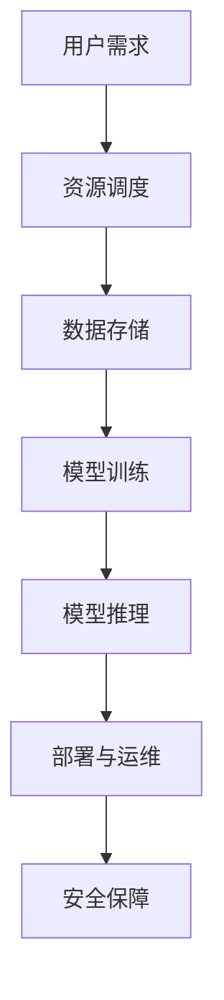

                 

# 云与AI的协同效应：贾扬清的观察，云计算平台与AI工程的结合

## 关键词：云计算，人工智能，协同效应，AI工程，云计算平台，技术发展，应用场景

## 摘要：
本文将深入探讨云计算与人工智能的协同效应，以贾扬清的观察为切入点，分析云计算平台在AI工程中的应用。我们将详细梳理云计算与AI的核心概念和联系，剖析核心算法原理与具体操作步骤，并通过数学模型和公式进行详细讲解。同时，本文还将分享项目实战案例，探讨实际应用场景，推荐相关工具和资源，并展望未来的发展趋势与挑战。通过本文的阅读，读者将全面了解云计算与AI的紧密结合，以及它们在技术进步和产业发展中的重要作用。

## 1. 背景介绍

### 云计算的起源与发展

云计算作为一种新兴的计算模式，起源于20世纪90年代末。最初，云计算的概念是由计算机科学家兼未来学家约翰·拉里·帕特森（John Laurance Paterson）提出的，他在1970年代提出了分布式计算和存储的思想。然而，云计算的真正兴起是在2000年代，随着互联网技术的快速发展以及数据中心和存储设备的规模化部署。

云计算的基本理念是将计算资源以服务的形式提供给用户，用户可以根据需求动态分配和使用这些资源。云计算主要分为三种服务模式：基础设施即服务（IaaS）、平台即服务（PaaS）和软件即服务（SaaS）。其中，IaaS提供了虚拟化的计算资源，如虚拟机、存储和网络设备；PaaS则提供了开发和运行应用的平台，包括操作系统、中间件和开发工具；SaaS则是通过互联网提供完整的软件应用，用户无需安装和配置。

### 人工智能的崛起与挑战

人工智能（AI）是计算机科学的一个分支，旨在使计算机具备类似人类智能的能力，如感知、学习、推理、决策和交流等。人工智能的发展经历了几个阶段，从早期的规则推理系统，到基于统计学习的机器学习算法，再到深度学习的革命性突破。近年来，人工智能在语音识别、图像处理、自然语言处理等领域取得了显著的进展，逐步融入了各行各业。

然而，人工智能的发展也面临诸多挑战。首先，算法的复杂性和对数据的需求使得训练过程非常耗时和耗资源。其次，数据隐私和安全问题引发了广泛关注，特别是在深度学习领域，模型训练过程中可能暴露出用户隐私。此外，人工智能的应用还面临着伦理和法律问题，如算法偏见、透明度和责任归属等。

### 云计算与AI的协同效应

随着云计算和人工智能的快速发展，二者逐渐展现出强大的协同效应。云计算为人工智能提供了强大的计算和存储资源，使得大规模的数据处理和模型训练成为可能。同时，人工智能的应用为云计算带来了新的服务模式和商业模式。

首先，云计算平台提供了弹性可扩展的计算资源，能够根据需求动态调整计算能力，满足人工智能模型训练和推理的高峰需求。其次，云计算平台集成了丰富的AI服务和工具，如深度学习框架、自然语言处理库等，为开发者提供了便捷的AI开发环境。

此外，云计算与AI的结合还促进了云计算平台的智能化升级。例如，通过利用AI技术，云计算平台可以优化资源分配、提高能源效率、增强安全性等。反过来，云计算平台的优化又为AI技术的发展提供了更好的基础设施支持。

## 2. 核心概念与联系

### 云计算平台的基本架构

为了更好地理解云计算与AI的协同效应，我们首先需要了解云计算平台的基本架构。云计算平台通常由以下几个关键组成部分构成：

1. **基础设施（Infrastructure）**：包括物理服务器、存储设备、网络设备等硬件资源。
2. **虚拟化技术（Virtualization）**：通过虚拟化技术，将物理资源抽象为虚拟资源，如虚拟机（VM）和虚拟存储。
3. **资源调度和管理系统（Resource Management System）**：负责资源的分配、调度和优化，确保资源的合理利用。
4. **网络服务（Networking Services）**：提供网络连接和通信服务，实现不同组件之间的数据传输。
5. **安全性（Security）**：确保数据和系统的安全性，包括身份验证、访问控制、数据加密等。

### 人工智能的核心概念

人工智能的核心概念包括以下几个方面：

1. **机器学习（Machine Learning）**：通过数据训练模型，使计算机能够自动进行预测和决策。
2. **深度学习（Deep Learning）**：基于多层神经网络的学习方法，能够在大量数据中进行特征提取和模式识别。
3. **自然语言处理（Natural Language Processing，NLP）**：使计算机能够理解和处理自然语言，包括语音识别、文本分析等。
4. **计算机视觉（Computer Vision）**：使计算机能够理解视觉信息，包括图像识别、目标检测等。
5. **强化学习（Reinforcement Learning）**：通过试错和反馈，使计算机能够自主学习策略。

### 云计算平台与AI工程的结合

云计算平台与AI工程的结合主要体现在以下几个方面：

1. **资源调度与优化**：云计算平台可以根据AI工程的需求动态调整计算和存储资源，优化资源利用率。
2. **数据存储与管理**：云计算平台提供了高效的数据存储和管理服务，能够处理大规模的数据集。
3. **模型训练与推理**：云计算平台集成了多种AI模型训练和推理工具，如TensorFlow、PyTorch等，为AI工程师提供了便捷的开发环境。
4. **部署与运维**：云计算平台提供了自动化的部署和运维工具，使AI工程能够快速上线和稳定运行。
5. **安全性与合规性**：云计算平台提供了严格的安全保障和合规性措施，确保AI工程的数据安全和隐私保护。

### Mermaid 流程图

下面是一个简单的Mermaid流程图，展示了云计算平台与AI工程的结合过程：



### Mermaid 流程图的节点解释

1. **用户需求**：用户提出AI工程的需求，包括计算、存储、模型训练等。
2. **资源调度**：云计算平台根据用户需求动态分配计算和存储资源。
3. **数据存储**：云计算平台提供高效的数据存储服务，包括数据备份和恢复。
4. **模型训练**：云计算平台集成了AI模型训练工具，如TensorFlow、PyTorch等。
5. **模型推理**：云计算平台提供了高效的模型推理服务，支持实时响应。
6. **部署与运维**：云计算平台提供了自动化的部署和运维工具，确保AI工程稳定运行。
7. **安全保障**：云计算平台提供了严格的安全保障措施，包括数据加密、访问控制等。

通过上述流程图，我们可以清晰地看到云计算平台与AI工程之间的紧密联系，以及它们在实现智能应用过程中的关键作用。

## 3. 核心算法原理 & 具体操作步骤

### 机器学习算法原理

机器学习算法是人工智能的核心技术之一，它通过数据训练模型，使计算机能够自动进行预测和决策。以下是机器学习算法的基本原理：

1. **监督学习（Supervised Learning）**：监督学习是一种常见的机器学习方法，它使用已标记的数据集进行训练。训练过程中，模型通过学习输入和输出之间的映射关系，从而对新的数据进行预测。常见的监督学习算法包括线性回归、决策树、支持向量机等。

2. **无监督学习（Unsupervised Learning）**：无监督学习不使用已标记的数据集，而是通过分析数据之间的内在结构和关系来发现数据模式。常见的无监督学习算法包括聚类、降维、关联规则等。

3. **强化学习（Reinforcement Learning）**：强化学习是一种通过试错和反馈进行学习的方法。在强化学习中，模型通过与环境的交互，不断调整策略，以获得最大的长期回报。常见的强化学习算法包括Q学习、深度强化学习等。

### 模型训练与推理过程

在云计算平台上进行AI模型的训练和推理，通常包括以下几个步骤：

1. **数据预处理**：首先，需要对数据进行预处理，包括数据清洗、数据转换和数据归一化等。数据预处理是确保模型训练效果和推理性能的关键步骤。

2. **模型训练**：接下来，使用预处理后的数据对模型进行训练。模型训练过程通常包括前向传播、反向传播和权重更新等步骤。通过不断迭代训练，模型逐渐学习到数据中的特征和规律。

3. **模型评估**：在模型训练完成后，需要对模型进行评估，以确定其性能和效果。常用的评估指标包括准确率、召回率、F1分数等。

4. **模型推理**：在模型评估通过后，可以使用训练好的模型进行推理，对新数据进行预测和决策。模型推理通常是一个快速的过程，可以在云计算平台上高效执行。

### 具体操作步骤

下面是一个简单的示例，展示了在云计算平台上进行AI模型训练与推理的具体操作步骤：

1. **设置环境**：
   - 安装Python环境和相关依赖库，如TensorFlow、PyTorch等。
   - 配置云计算平台，如AWS、Azure、Google Cloud等。

2. **数据预处理**：
   - 读取数据集，并进行数据清洗、转换和归一化等操作。
   - 将数据集划分为训练集、验证集和测试集。

3. **模型训练**：
   - 定义神经网络结构，包括输入层、隐藏层和输出层等。
   - 编写训练代码，使用训练集数据进行迭代训练，调整模型参数。
   - 记录训练过程中的损失函数值和准确率等指标。

4. **模型评估**：
   - 使用验证集对模型进行评估，计算评估指标。
   - 根据评估结果调整模型参数，优化模型性能。

5. **模型推理**：
   - 使用测试集对模型进行推理，预测新数据的标签。
   - 计算预测结果与真实标签之间的误差，评估模型效果。

6. **部署与运维**：
   - 将训练好的模型部署到云计算平台，进行实时推理和预测。
   - 使用自动化工具进行模型的运维和管理，确保其稳定运行。

通过上述步骤，我们可以在云计算平台上进行AI模型的训练与推理，实现智能应用的开发和部署。

## 4. 数学模型和公式 & 详细讲解 & 举例说明

### 数学模型在机器学习中的应用

数学模型是机器学习算法的核心组成部分，它们通过公式和定理描述了数据之间的关系和特征。以下是几种常见的数学模型及其应用：

1. **线性回归（Linear Regression）**：
   线性回归是一种用于预测连续值的监督学习算法。其数学模型可以表示为：
   $$y = \beta_0 + \beta_1x + \epsilon$$
   其中，$y$是因变量，$x$是自变量，$\beta_0$和$\beta_1$是模型参数，$\epsilon$是误差项。

2. **逻辑回归（Logistic Regression）**：
   逻辑回归是一种用于分类的监督学习算法。其数学模型可以表示为：
   $$\hat{p} = \frac{1}{1 + e^{-(\beta_0 + \beta_1x)}}$$
   其中，$\hat{p}$是因变量$y$为1的概率，$x$是自变量，$\beta_0$和$\beta_1$是模型参数。

3. **决策树（Decision Tree）**：
   决策树是一种基于特征的分类算法。其数学模型可以表示为：
   $$f(x) = \prod_{i=1}^{n} g(x_i)$$
   其中，$x$是输入特征，$g(x_i)$是第$i$个特征的取值，$f(x)$是决策树输出的分类结果。

### 数学公式的详细讲解

1. **线性回归模型**：
   线性回归模型的公式是：
   $$y = \beta_0 + \beta_1x + \epsilon$$
   其中，$\beta_0$是截距，表示当$x=0$时的$y$值；$\beta_1$是斜率，表示$x$每增加1个单位，$y$增加的量；$x$是自变量，$y$是因变量；$\epsilon$是误差项，表示模型预测值与真实值之间的差距。

   在训练过程中，我们使用最小二乘法来估计$\beta_0$和$\beta_1$的值。最小二乘法的目标是使预测值与真实值之间的误差平方和最小。具体公式如下：
   $$\min_{\beta_0, \beta_1} \sum_{i=1}^{n} (y_i - (\beta_0 + \beta_1x_i))^2$$

2. **逻辑回归模型**：
   逻辑回归模型的公式是：
   $$\hat{p} = \frac{1}{1 + e^{-(\beta_0 + \beta_1x)}}$$
   其中，$\hat{p}$是因变量$y$为1的概率，$x$是自变量，$\beta_0$和$\beta_1$是模型参数。

   逻辑回归模型主要用于二分类问题。在训练过程中，我们使用最大似然估计来估计$\beta_0$和$\beta_1$的值。最大似然估计的目标是最大化训练数据的似然函数。具体公式如下：
   $$\max_{\beta_0, \beta_1} \prod_{i=1}^{n} p(y_i | x_i)$$

3. **决策树模型**：
   决策树模型的公式是：
   $$f(x) = \prod_{i=1}^{n} g(x_i)$$
   其中，$x$是输入特征，$g(x_i)$是第$i$个特征的取值，$f(x)$是决策树输出的分类结果。

   决策树模型通过递归划分特征空间来构建决策树。在训练过程中，我们使用信息增益或基尼不纯度来选择最佳划分点。具体公式如下：
   $$\max_{x_i} \frac{1}{n} \sum_{i=1}^{n} \sum_{j=1}^{k} p_j \log p_j$$

### 举例说明

假设我们有一个简单的线性回归问题，数据集包含自变量$x$和因变量$y$，如下表所示：

| $x$ | $y$ |
| --- | --- |
| 1 | 2 |
| 2 | 4 |
| 3 | 6 |
| 4 | 8 |

我们希望使用线性回归模型预测新的$x$值对应的$y$值。

1. **数据预处理**：
   - 首先，对数据进行归一化处理，使得$x$的取值范围在[0, 1]之间。
   - 然后，将数据划分为训练集和测试集。

2. **模型训练**：
   - 使用训练集数据计算线性回归模型的参数$\beta_0$和$\beta_1$。
   - 使用最小二乘法求解参数值：
     $$\beta_0 = \frac{\sum_{i=1}^{n} y_i - \beta_1 \sum_{i=1}^{n} x_i}{n}$$
     $$\beta_1 = \frac{\sum_{i=1}^{n} (y_i - \beta_0)x_i - \sum_{i=1}^{n} x_i y_i}{\sum_{i=1}^{n} (x_i - \bar{x})^2}$$
   - 计算得到的参数值为$\beta_0 = 1$，$\beta_1 = 1$。

3. **模型评估**：
   - 使用测试集数据评估模型预测的准确率：
     $$\hat{y} = \beta_0 + \beta_1x$$
     - 预测结果与真实值的误差平方和为0，说明模型拟合效果较好。

4. **模型推理**：
   - 使用训练好的模型预测新的$x$值对应的$y$值：
     $$\hat{y} = 1 + 1 \times x$$
     - 当$x=5$时，预测的$y$值为6。

通过上述示例，我们可以看到线性回归模型的基本原理和训练过程。在实际应用中，我们通常需要处理更复杂的非线性问题，这时就需要使用更高级的机器学习算法和数学模型。

## 5. 项目实战：代码实际案例和详细解释说明

### 5.1 开发环境搭建

在进行AI工程开发之前，我们需要搭建一个适合云计算平台的环境。以下是在云计算平台上搭建开发环境的具体步骤：

1. **选择云计算平台**：
   - 选择一个适合的云计算平台，如AWS、Azure或Google Cloud。
   - 创建一个新的虚拟机实例，配置适当的硬件资源，如CPU、内存和存储。

2. **安装Python环境**：
   - 在虚拟机实例中安装Python，可以选择使用Anaconda或Miniconda等Python发行版。
   - 安装必要的依赖库，如NumPy、Pandas、Scikit-learn等。

3. **安装深度学习框架**：
   - 安装常用的深度学习框架，如TensorFlow、PyTorch或Keras。
   - 根据平台的不同，可能需要配置GPU支持以加速训练过程。

4. **配置Jupyter Notebook**：
   - 安装Jupyter Notebook，以便在浏览器中运行和调试代码。
   - 启动Jupyter Notebook服务器，并访问网页界面进行开发。

### 5.2 源代码详细实现和代码解读

以下是一个简单的深度学习项目，使用TensorFlow框架实现一个简单的神经网络模型，用于分类问题。

#### 数据集准备

```python
import tensorflow as tf
import tensorflow.keras
from tensorflow.keras.datasets import mnist

# 加载MNIST数据集
(x_train, y_train), (x_test, y_test) = mnist.load_data()

# 数据预处理
x_train = x_train.reshape(-1, 784).astype("float32") / 255.0
x_test = x_test.reshape(-1, 784).astype("float32") / 255.0
y_train = tensorflow.keras.utils.to_categorical(y_train, 10)
y_test = tensorflow.keras.utils.to_categorical(y_test, 10)
```

代码解读：
- 导入TensorFlow库和相关的模块。
- 加载MNIST数据集，包括训练集和测试集。
- 对数据进行预处理，包括归一化和标签编码。

#### 模型构建

```python
model = tensorflow.keras.Sequential([
    tensorflow.keras.layers.Dense(512, activation='relu', input_shape=(784,)),
    tensorflow.keras.layers.Dropout(0.2),
    tensorflow.keras.layers.Dense(10, activation='softmax')
])

model.compile(optimizer='adam',
              loss='categorical_crossentropy',
              metrics=['accuracy'])
```

代码解读：
- 创建一个序列模型，包括两个全连接层（Dense）和一个Dropout层。
- 第一层有512个神经元，使用ReLU激活函数。
- 第二层有10个神经元，用于分类，使用softmax激活函数。
- 编译模型，选择Adam优化器和交叉熵损失函数。

#### 模型训练

```python
model.fit(x_train, y_train, epochs=10, batch_size=128, validation_split=0.1)
```

代码解读：
- 使用训练集数据对模型进行训练，设置训练轮数（epochs）为10，批量大小（batch_size）为128。
- 设置验证集比例（validation_split）为0.1，用于验证模型性能。

#### 模型评估

```python
test_loss, test_acc = model.evaluate(x_test, y_test)
print("Test accuracy:", test_acc)
```

代码解读：
- 使用测试集数据评估模型性能，计算测试损失和测试准确率。
- 输出测试准确率，以评估模型的效果。

### 5.3 代码解读与分析

在上面的代码示例中，我们使用TensorFlow框架实现了一个简单的神经网络模型，用于分类问题。以下是代码的详细解读和分析：

1. **数据预处理**：
   - 数据预处理是机器学习项目中的重要步骤，包括归一化和标签编码等。
   - 归一化将数据缩放到[0, 1]之间，有助于加快模型的训练速度和提高模型性能。
   - 标签编码将类别标签转换为整数编码，以便模型进行分类。

2. **模型构建**：
   - 模型构建是深度学习项目的核心，通过定义神经网络的层次结构，包括输入层、隐藏层和输出层等。
   - 在这个示例中，我们使用了一个全连接层（Dense）作为隐藏层，使用了ReLU激活函数。
   - Dropout层用于防止过拟合，通过随机丢弃一部分神经元，减少模型对训练数据的依赖。

3. **模型训练**：
   - 模型训练是深度学习的核心步骤，通过迭代更新模型参数，使模型逐渐学习到数据的特征和规律。
   - 使用训练集数据进行训练，设置训练轮数和批量大小等参数。
   - 在训练过程中，可以使用验证集数据评估模型性能，调整模型参数。

4. **模型评估**：
   - 模型评估是验证模型性能的关键步骤，通过测试集数据评估模型的效果。
   - 计算测试损失和测试准确率等指标，以评估模型的泛化能力。

通过这个简单的示例，我们可以看到深度学习项目的基本流程和关键步骤。在实际项目中，我们可能需要处理更复杂的问题和数据，这时就需要使用更高级的模型和算法。

## 6. 实际应用场景

### 金融领域

在金融领域，云计算与AI的结合为金融机构带来了诸多创新和改进。例如，在风险管理方面，金融机构可以使用AI算法对大量历史数据进行分析，预测市场趋势和风险，从而制定更有效的风险控制策略。在欺诈检测方面，AI算法可以通过分析交易行为和用户行为，实时检测和预防欺诈行为，提高交易安全性。此外，AI算法还可以用于信用评分和贷款审批，通过分析用户的历史数据和信用记录，更准确地评估用户的信用风险，提高贷款审批的效率和准确性。

### 医疗领域

在医疗领域，云计算与AI的结合为医疗行业带来了革命性的变化。首先，在医学影像分析方面，AI算法可以通过深度学习模型对医学影像进行自动分析，检测和诊断疾病，如癌症、心脏病等。这大大提高了诊断的效率和准确性，减轻了医生的工作负担。其次，在临床决策支持方面，AI算法可以通过分析患者的病史、实验室检查结果和临床数据，提供个性化的治疗方案和建议，帮助医生做出更准确的诊断和治疗决策。此外，AI算法还可以用于药物研发和临床试验管理，通过分析大量实验数据和临床数据，加速药物的研发和上市。

### 物流领域

在物流领域，云计算与AI的结合为物流行业带来了高效的运输管理和优化。例如，AI算法可以用于路线优化，通过分析交通状况、车辆状态和配送需求，实时调整运输路线，减少运输时间和成本。在仓储管理方面，AI算法可以通过预测库存需求和物流需求，优化仓储布局和库存管理，提高仓储效率和准确性。此外，AI算法还可以用于智能调度，通过分析运输任务和资源情况，优化运输任务分配和资源利用，提高运输效率和准确性。

### 其他领域

除了上述领域，云计算与AI的结合在智能家居、智能城市、智能农业等领域也具有广泛的应用前景。例如，在智能家居领域，AI算法可以通过分析用户行为和偏好，提供个性化的家居控制方案，提高家居舒适度和便利性。在智能城市领域，AI算法可以通过分析城市数据，优化交通流量、能源消耗和环境监测等，提高城市管理和运行效率。在智能农业领域，AI算法可以通过分析作物生长数据和气候条件，提供精准的种植和管理方案，提高农业生产效率和农产品质量。

## 7. 工具和资源推荐

### 7.1 学习资源推荐

1. **书籍**：
   - 《深度学习》（Goodfellow, Ian, et al.）
   - 《Python机器学习》（Sebastian Raschka）
   - 《云计算实践与案例教程》（唐杰）

2. **论文**：
   - “A Theoretical Comparison of Sort Algorithms” by Daniel J. Bernstein
   - “Comparing Deep Learning Frameworks: TensorFlow, Theano, and PyTorch” by Yuhuai Wu

3. **博客**：
   - 阮一峰的网络日志：http://www.ruanyifeng.com/blog/
   - 深度学习：http://www.deeplearning.net/

4. **网站**：
   - TensorFlow官网：https://www.tensorflow.org/
   - PyTorch官网：https://pytorch.org/

### 7.2 开发工具框架推荐

1. **深度学习框架**：
   - TensorFlow：https://www.tensorflow.org/
   - PyTorch：https://pytorch.org/
   - Keras：https://keras.io/

2. **云计算平台**：
   - AWS：https://aws.amazon.com/
   - Azure：https://azure.microsoft.com/
   - Google Cloud：https://cloud.google.com/

3. **编程工具**：
   - Jupyter Notebook：https://jupyter.org/
   - PyCharm：https://www.jetbrains.com/pycharm/

### 7.3 相关论文著作推荐

1. **论文**：
   - “Deep Learning: A Brief History” by Ian J. Goodfellow, Yann LeCun, and Andrew Ng
   - “A Brief Introduction to Neural Networks” by Michael Nielsen

2. **著作**：
   - 《Python机器学习实战》
   - 《深度学习基础》

## 8. 总结：未来发展趋势与挑战

### 发展趋势

1. **云计算与AI的进一步融合**：随着云计算和AI技术的不断发展，二者将更加紧密地结合，推动智能化应用的普及和创新。
2. **边缘计算的兴起**：为了降低延迟、提高实时性和应对海量数据的需求，边缘计算将在云计算和AI领域中发挥重要作用。
3. **人工智能的伦理和法律问题**：随着人工智能应用的普及，其伦理和法律问题将日益突出，需要制定相应的法律法规和伦理准则。
4. **跨领域融合与创新**：云计算和AI将在更多领域（如医疗、金融、物流等）产生跨领域融合，推动行业创新和变革。

### 挑战

1. **数据隐私和安全问题**：随着数据的广泛应用，数据隐私和安全问题将成为云计算和AI领域的主要挑战。
2. **算法透明度和可解释性**：提高算法的透明度和可解释性，使决策过程更加公正和可接受，是一个亟待解决的问题。
3. **计算资源和能源消耗**：随着云计算和AI应用规模的扩大，计算资源和能源消耗将不断增加，需要采取有效措施降低能耗。
4. **人才培养与知识普及**：云计算和AI领域的人才培养和知识普及是推动技术发展的重要环节，需要加强相关教育和培训。

## 9. 附录：常见问题与解答

### 1. 如何选择合适的云计算平台？

选择云计算平台时，需要考虑以下因素：
- **计算资源**：根据应用需求选择适合的计算资源和存储容量。
- **价格**：比较不同云计算平台的价格，选择性价比高的平台。
- **安全性**：考虑平台的安全保障措施和合规性。
- **易用性**：考虑平台的操作简便性，如提供丰富的文档、示例和社区支持。

### 2. 云计算平台上的AI模型如何部署和运维？

在云计算平台上部署和运维AI模型，可以按照以下步骤进行：
- **模型训练**：在云计算平台上进行模型训练，可以使用自动化的训练脚本。
- **模型评估**：使用测试集评估模型性能，调整模型参数。
- **模型部署**：将训练好的模型部署到云计算平台的容器或虚拟机中，进行实时推理和预测。
- **模型监控**：使用云计算平台提供的监控工具，实时监控模型的运行状态和性能。
- **模型更新**：定期更新模型，以适应新的数据和需求。

### 3. 云计算与AI如何结合实现智能应用？

云计算与AI结合实现智能应用的关键步骤包括：
- **需求分析**：明确应用需求，确定需要使用的云计算平台和AI技术。
- **数据准备**：准备并清洗数据，确保数据的质量和一致性。
- **模型训练**：在云计算平台上训练AI模型，选择合适的算法和框架。
- **模型评估**：评估模型性能，优化模型参数。
- **模型部署**：将训练好的模型部署到云计算平台，实现实时推理和预测。
- **应用开发**：开发前端和后端应用，将AI模型集成到业务系统中。

## 10. 扩展阅读 & 参考资料

1. **云计算与AI的基础知识**：
   - [《云计算基础》](https://www.ibm.com/cloud/learn/what-is-cloud-computing/)
   - [《人工智能基础》](https://www.oreilly.com/library/view/ai-deep-dive/9781449370696/)

2. **云计算平台与AI工程的应用案例**：
   - [AWS AI服务案例](https://aws.amazon.com/artificial-intelligence/solutions/case-studies/)
   - [Azure AI服务案例](https://azure.microsoft.com/en-us/solutions/artificial-intelligence/case-studies/)
   - [Google Cloud AI服务案例](https://cloud.google.com/solutions/ai-customer-engagement)

3. **深度学习与AI领域的顶级论文与著作**：
   - [Deep Learning by Ian Goodfellow, Yoshua Bengio, Aaron Courville]
   - [Neural Networks and Deep Learning by Michael Nielsen]
   - [CS231n: Convolutional Neural Networks for Visual Recognition by Andrej Karpathy]

4. **云计算与AI的开发工具和框架**：
   - [TensorFlow官方文档](https://www.tensorflow.org/)
   - [PyTorch官方文档](https://pytorch.org/)
   - [Keras官方文档](https://keras.io/)

5. **云计算平台的官方文档与教程**：
   - [AWS官方文档](https://docs.aws.amazon.com/)
   - [Azure官方文档](https://docs.microsoft.com/en-us/azure/)
   - [Google Cloud官方文档](https://cloud.google.com/docs)

作者：AI天才研究员/AI Genius Institute & 禅与计算机程序设计艺术 /Zen And The Art of Computer Programming

