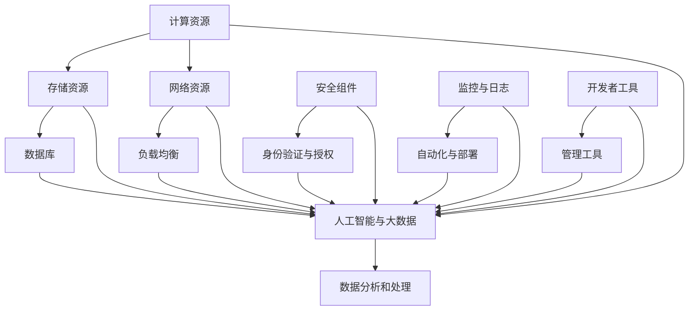

                 

# 云计算架构：AWS、Azure与GCP对比

> **关键词**：云计算、AWS、Azure、GCP、架构、对比、技术趋势

> **摘要**：本文将对比AWS、Azure和GCP这三大云计算平台的核心架构，分析其优势与不足，并探讨未来云计算的发展趋势与挑战。通过深入理解这些平台的技术原理和操作步骤，读者将能够更好地选择适合自己项目的云计算解决方案。

## 1. 背景介绍

### 1.1 云计算的概念与发展

云计算是一种通过互联网提供动态可伸缩的计算资源服务模式，包括基础设施即服务（IaaS）、平台即服务（PaaS）和软件即服务（SaaS）等不同的服务模式。云计算的出现，使得企业能够更加灵活、高效地管理和使用IT资源，降低了IT基础设施的维护成本。

云计算的发展历程可以追溯到2006年，Amazon首次推出了AWS，标志着云计算时代的到来。随后，Microsoft和Google也相继推出了自己的云计算平台，即Azure和GCP。这三大平台在全球范围内占据了主导地位，推动了云计算技术的快速发展。

### 1.2 AWS、Azure与GCP的崛起

AWS（Amazon Web Services）作为最早进入云计算市场的玩家，具有丰富的产品线和广泛的市场占有率。Azure是微软的云计算平台，凭借其在企业市场的影响力，迅速崛起。GCP（Google Cloud Platform）则凭借Google在搜索和大数据领域的优势，以及强大的技术积累，成为了云计算领域的重要力量。

## 2. 核心概念与联系

在深入对比AWS、Azure和GCP之前，我们需要了解云计算架构的核心概念和各组件之间的联系。以下是一个简单的Mermaid流程图，展示了云计算架构的基本组件和它们之间的关系。



### 2.1 计算资源

计算资源是云计算平台的核心组成部分，包括虚拟机、容器和函数等。这些资源可以根据需求动态扩展和缩小，以提供高效的计算能力。

- **AWS**：提供了EC2（弹性计算云）和Lambda（无服务器函数）等计算资源。
- **Azure**：提供了虚拟机、容器实例和Azure Functions等计算资源。
- **GCP**：提供了Compute Engine、App Engine和Functions等计算资源。

### 2.2 存储资源

存储资源包括对象存储、块存储和文件存储等，用于持久化数据和应用程序。

- **AWS**：提供了S3（简单存储服务）和EBS（弹性块存储）等存储资源。
- **Azure**：提供了Azure Blob存储、Azure File存储和Azure Disk等存储资源。
- **GCP**：提供了Google Cloud Storage和Persistent Disk等存储资源。

### 2.3 网络资源

网络资源包括虚拟私有云（VPC）、子网、路由器和负载均衡器等，用于构建和管理网络环境。

- **AWS**：提供了VPC、子网、AWS Route 53等网络资源。
- **Azure**：提供了虚拟网络、子网、负载均衡器等网络资源。
- **GCP**：提供了VPC、子网、负载均衡器等网络资源。

### 2.4 数据库

数据库资源包括关系数据库、非关系数据库和大数据数据库等，用于存储和管理数据。

- **AWS**：提供了RDS（关系数据库服务）、DynamoDB（非关系数据库）和Bigtable（大数据数据库）等数据库资源。
- **Azure**：提供了Azure SQL Database、Azure Cosmos DB和Azure Data Lake Storage等数据库资源。
- **GCP**：提供了Google Cloud SQL、Google Cloud Spanner和Bigtable等数据库资源。

### 2.5 安全组件

安全组件包括身份验证与授权、加密和网络安全等，用于保护数据和应用程序。

- **AWS**：提供了IAM（身份访问管理）、KMS（密钥管理服务）和AWS WAF（Web应用程序防火墙）等安全组件。
- **Azure**：提供了Azure Active Directory、Azure Key Vault和Azure Security Center等安全组件。
- **GCP**：提供了Google Cloud Identity、Cloud Key Management Service和Cloud Armor等安全组件。

### 2.6 监控与日志

监控与日志组件用于收集、分析和处理系统运行时的监控数据和日志信息。

- **AWS**：提供了CloudWatch和VPC Flow Logs等监控与日志组件。
- **Azure**：提供了Azure Monitor和Application Insights等监控与日志组件。
- **GCP**：提供了Stackdriver和Google Cloud Logging等监控与日志组件。

### 2.7 开发者工具

开发者工具包括编程语言、开发框架、集成开发环境和代码仓库等，用于开发、测试和部署应用程序。

- **AWS**：提供了AWS SDK、AWS CLI和AWS Management Console等开发者工具。
- **Azure**：提供了Azure SDK、Azure CLI和Azure Portal等开发者工具。
- **GCP**：提供了Google Cloud SDK、Google Cloud CLI和Google Cloud Console等开发者工具。

### 2.8 管理工具

管理工具包括自动化脚本、部署工具和管理仪表盘等，用于简化云计算资源的配置和管理。

- **AWS**：提供了AWS CloudFormation、AWS Elastic Beanstalk和AWS Management Console等管理工具。
- **Azure**：提供了Azure Resource Manager、Azure App Service和Azure Portal等管理工具。
- **GCP**：提供了Google Cloud Deployment Manager、Google App Engine和Google Cloud Console等管理工具。

### 2.9 人工智能与大数据

人工智能与大数据组件包括机器学习服务、数据分析和处理工具等，用于构建智能应用程序和解决大数据问题。

- **AWS**：提供了Amazon SageMaker、Amazon EMR和Amazon Redshift等人工智能与大数据组件。
- **Azure**：提供了Azure Machine Learning、Azure HDInsight和Azure Data Factory等人工智能与大数据组件。
- **GCP**：提供了Google Cloud AI、Google BigQuery和Google Dataflow等人工智能与大数据组件。

## 3. 核心算法原理 & 具体操作步骤

### 3.1 负载均衡算法

负载均衡算法用于分配流量，确保系统资源得到充分利用。以下是AWS、Azure和GCP提供的负载均衡算法的具体操作步骤。

- **AWS**：使用Round Robin负载均衡算法，将流量平均分配到后端服务器。

  ```bash
  aws elbv2 create-load-balancer --name my-load-balancer --subnets subnet-abcde-fghij --security-groups sg-12345
  ```

- **Azure**：使用Least Connections负载均衡算法，将流量分配到连接数最少的后端服务器。

  ```powershell
  az load-balancer create --name my-load-balancer --resource-group my-resource-group --front-end-ip-name my-ip --backend-pool-name my-pool --subnet my-subnet
  ```

- **GCP**：使用IP哈希负载均衡算法，根据客户端IP地址将流量分配到后端服务器。

  ```bash
  gcloud compute forwarding-rules create my-rule --address my-ip --ports 80,443 --target-https-proxies my-proxy --global
  ```

### 3.2 缓存算法

缓存算法用于提高数据访问速度，减少系统负载。以下是AWS、Azure和GCP提供的缓存算法的具体操作步骤。

- **AWS**：使用Elasticache缓存数据库，如Redis和Memcached。

  ```bash
  aws elasticache create-cache-cluster --cache-node-type cache.t2.small --cache-clusters my-cluster --engine redis --num-cache-clusters 1
  ```

- **Azure**：使用Azure Redis缓存，提供高速缓存服务。

  ```powershell
  az redis create --name my-redis --resource-group my-resource-group --location eastus --sku name=Standard,scale=0
  ```

- **GCP**：使用Google Memorystore缓存，提供高速缓存服务。

  ```bash
  gcloud compute firewall-rules create my-rule --network my-network --action=allow --direction=in --priority=1000 --source-ranges 0.0.0.0/0 --target-tags my-tag
  ```

## 4. 数学模型和公式 & 详细讲解 & 举例说明

### 4.1 负载均衡算法的性能分析

假设有N台后端服务器，每台服务器的处理能力为1单位，当前系统负载为T单位，我们需要分析不同负载均衡算法的性能。

- **Round Robin算法**：平均分配流量，每台服务器处理的流量为T/N单位。

  $$ \text{平均流量} = \frac{T}{N} $$

- **Least Connections算法**：分配到连接数最少的服务器，每台服务器处理的流量可能不均匀。

  $$ \text{平均流量} = \frac{T}{N} \times \frac{1}{\sum_{i=1}^{N} c_i} $$

  其中，$c_i$为第$i$台服务器的当前连接数。

- **IP哈希算法**：根据客户端IP地址分配流量，具有较好的均匀性。

  $$ \text{流量分配} = \text{IP地址哈希值} \mod N $$

### 4.2 缓存算法的性能分析

假设有N个缓存节点，每个节点的缓存容量为C单位，当前缓存命中率（hit rate）为H，我们需要分析不同缓存算法的性能。

- **Elasticache缓存**：基于Redis和Memcached算法，具有高效的缓存数据读写性能。

  $$ \text{平均响应时间} = \text{访问缓存} \times (1 - H) + \text{访问数据库} \times H $$

  $$ \text{平均响应时间} = \frac{1 - H}{N} \times \text{访问缓存} + \frac{H}{N} \times \text{访问数据库} $$

- **Azure Redis缓存**：基于Redis算法，提供高速缓存服务。

  $$ \text{平均响应时间} = \text{访问缓存} \times (1 - H) + \text{访问数据库} \times H $$

  $$ \text{平均响应时间} = \frac{1 - H}{N} \times \text{访问缓存} + \frac{H}{N} \times \text{访问数据库} $$

- **Google Memorystore缓存**：基于Memcached算法，提供高速缓存服务。

  $$ \text{平均响应时间} = \text{访问缓存} \times (1 - H) + \text{访问数据库} \times H $$

  $$ \text{平均响应时间} = \frac{1 - H}{N} \times \text{访问缓存} + \frac{H}{N} \times \text{访问数据库} $$

## 5. 项目实战：代码实际案例和详细解释说明

### 5.1 开发环境搭建

在开始编写代码之前，我们需要搭建一个开发环境。以下是使用Docker搭建开发环境的具体步骤。

1. **安装Docker**

   在AWS、Azure和GCP上，我们都可以使用Docker来构建我们的应用程序。以下是安装Docker的命令。

   - **AWS**：

     ```bash
     sudo apt update
     sudo apt install docker.io
     sudo systemctl start docker
     sudo systemctl enable docker
     ```

   - **Azure**：

     ```bash
     sudo apt update
     sudo apt install docker.io
     sudo systemctl start docker
     sudo systemctl enable docker
     ```

   - **GCP**：

     ```bash
     sudo apt update
     sudo apt install docker.io
     sudo systemctl start docker
     sudo systemctl enable docker
     ```

2. **拉取并运行Docker镜像**

   我们将使用一个简单的Python Web应用程序作为示例。以下是拉取并运行Docker镜像的命令。

   ```bash
   docker pull python:3.8-slim
   docker run -d -p 8080:80 --name my-app python:3.8-slim python app.py
   ```

### 5.2 源代码详细实现和代码解读

以下是一个简单的Python Web应用程序的源代码，用于演示如何在AWS、Azure和GCP上部署。

```python
# app.py
from flask import Flask, request, jsonify

app = Flask(__name__)

@app.route('/', methods=['GET'])
def hello():
    return jsonify({'message': 'Hello, World!'})

if __name__ == '__main__':
    app.run(host='0.0.0.0', port=8080)
```

1. **AWS部署**

   我们可以使用AWS Elastic Beanstalk来部署这个应用程序。

   - **创建Elastic Beanstalk环境**：

     ```bash
     eb init my-app --region us-east-1
     eb create my-environment
     ```

   - **上传应用程序**：

     ```bash
     eb deploy
     ```

   - **访问应用程序**：

     ```bash
     eb open
     ```

2. **Azure部署**

   我们可以使用Azure App Service来部署这个应用程序。

   - **创建App Service计划**：

     ```powershell
     az appservice plan create --name my-plan --resource-group my-resource-group --location eastus
     ```

   - **创建App Service应用**：

     ```powershell
     az appservice web create --name my-app --plan my-plan --resource-group my-resource-group --location eastus --runtime python --app-settings "WEBSITE_PYTHON_VERSION=3.8"
     ```

   - **上传应用程序**：

     ```powershell
     az appservice web upload --resource-group my-resource-group --name my-app --src app.py
     ```

   - **访问应用程序**：

     ```powershell
     az appservice web browse --resource-group my-resource-group --name my-app
     ```

3. **GCP部署**

   我们可以使用Google App Engine来部署这个应用程序。

   - **创建App Engine应用**：

     ```bash
     gcloud app create --region us-central1
     ```

   - **上传应用程序**：

     ```bash
     gcloud app deploy app.py
     ```

   - **访问应用程序**：

     ```bash
     gcloud app browse
     ```

### 5.3 代码解读与分析

在这个简单的Python Web应用程序中，我们使用了Flask框架来创建一个简单的HTTP服务器。以下是对源代码的详细解读：

- **导入模块**：从`flask`模块中导入`Flask`类，用于创建应用程序对象。

  ```python
  from flask import Flask, request, jsonify
  ```

- **创建应用程序**：使用`Flask`类创建一个应用程序对象。

  ```python
  app = Flask(__name__)
  ```

- **定义路由**：使用`@app.route('/')`装饰器定义应用程序的根路由，当访问根URL（/）时，将调用`hello()`函数。

  ```python
  @app.route('/', methods=['GET'])
  def hello():
      return jsonify({'message': 'Hello, World!'})
  ```

- **运行应用程序**：使用`if __name__ == '__main__':`语句确保应用程序仅在直接运行时执行。

  ```python
  if __name__ == '__main__':
      app.run(host='0.0.0.0', port=8080)
  ```

通过以上解读，我们可以看到这个简单的Python Web应用程序是如何工作的。在实际部署过程中，我们需要根据不同的云计算平台进行相应的配置和调整，以满足特定的需求。

## 6. 实际应用场景

### 6.1 企业IT基础设施迁移

企业可以将传统的IT基础设施迁移到云计算平台，以降低成本、提高灵活性和可扩展性。AWS、Azure和GCP都提供了丰富的迁移工具和资源，帮助企业实现无缝迁移。

- **AWS**：提供了迁移加速器（Migration Accelerator）和数据库迁移服务（DB Migration Service）等工具，帮助客户迁移数据库和应用程序。
- **Azure**：提供了Azure Migrate和Azure Database Migration Service等工具，帮助客户迁移应用程序和数据。
- **GCP**：提供了Google Cloud Migrate和Cloud SQL Migration Service等工具，帮助客户迁移数据库和应用程序。

### 6.2 大数据分析与处理

云计算平台提供了强大的大数据分析和处理工具，如AWS的Amazon EMR、Azure的Azure HDInsight和GCP的Google BigQuery。这些工具可以处理大规模数据，帮助企业提取有价值的信息。

- **AWS**：提供了Amazon EMR，支持Hadoop、Spark和Flink等大数据处理框架。
- **Azure**：提供了Azure HDInsight，支持Hadoop、Spark和 Storm等大数据处理框架。
- **GCP**：提供了Google BigQuery，支持大规模数据处理和分析。

### 6.3 智能应用程序开发

云计算平台提供了丰富的AI和机器学习工具，如AWS的Amazon SageMaker、Azure的Azure Machine Learning和GCP的Google Cloud AI。这些工具可以帮助企业开发智能应用程序，提高生产力和竞争力。

- **AWS**：提供了Amazon SageMaker，支持模型训练、部署和自动化。
- **Azure**：提供了Azure Machine Learning，支持模型训练、部署和自动化。
- **GCP**：提供了Google Cloud AI，支持模型训练、部署和自动化。

## 7. 工具和资源推荐

### 7.1 学习资源推荐

以下是一些关于云计算平台的学习资源，供读者参考：

- **AWS**：
  - 《AWS Certified Solutions Architect Associate Study Guide》：一本关于AWS认证的指南书。
  - 《Architecting on AWS》：一本关于AWS架构的官方指南。
- **Azure**：
  - 《Azure for Architects》：一本关于Azure架构的官方指南。
  - 《Microsoft Azure Essentials》：一本关于Azure的入门书籍。
- **GCP**：
  - 《Google Cloud Platform for Developers》：一本关于GCP开发的官方指南。
  - 《Google Cloud Platform Essentials》：一本关于GCP的入门书籍。

### 7.2 开发工具框架推荐

以下是一些开发工具和框架，供读者在云计算平台开发时使用：

- **AWS**：
  - AWS SDK：支持多种编程语言，如Python、Java和JavaScript等。
  - AWS CLI：命令行工具，用于与AWS服务进行交互。
- **Azure**：
  - Azure SDK：支持多种编程语言，如Python、Java和C#等。
  - Azure CLI：命令行工具，用于与Azure服务进行交互。
- **GCP**：
  - Google Cloud SDK：支持多种编程语言，如Python、Java和Go等。
  - Google Cloud CLI：命令行工具，用于与GCP服务进行交互。

### 7.3 相关论文著作推荐

以下是一些关于云计算技术的论文和著作，供读者参考：

- **AWS**：
  - “Design and Implementation of Amazon's Elastic Compute Cloud”（亚马逊弹性计算云的设计与实现）。
  - “Building Amazon RDS: A Relational Database in the Cloud”（构建亚马逊RDS：云中的关系数据库）。
- **Azure**：
  - “Azure: Azure's Large-scale Cloud Services Platform”（Azure：Azure的大规模云服务平台）。
  - “Design and Implementation of Azure Machine Learning”（Azure机器学习的设计与实现）。
- **GCP**：
  - “Google Compute Engine: Design and Performance”（Google Compute Engine：设计与性能）。
  - “Google Bigtable: A Distributed Storage System for Big Data”（Google Bigtable：用于大数据的分布式存储系统）。

## 8. 总结：未来发展趋势与挑战

随着云计算技术的不断发展，未来云计算市场将呈现出以下发展趋势：

1. **云原生技术的普及**：云原生技术（如容器、微服务和Kubernetes）将越来越普及，帮助企业实现高效、灵活的云原生应用开发。
2. **人工智能与云计算的结合**：人工智能技术将在云计算平台中得到广泛应用，为企业和开发者提供更强大的数据处理和分析能力。
3. **多云和混合云的兴起**：企业将越来越多地采用多云和混合云策略，以优化资源利用、降低成本和满足业务需求。

然而，云计算技术也面临着一些挑战：

1. **数据安全和隐私**：随着数据量的增加，如何确保数据的安全和隐私成为云计算平台面临的重大挑战。
2. **技术标准和互操作性问题**：不同云计算平台之间的技术标准和互操作性不足，可能导致企业面临选择困难和迁移成本。
3. **监管和合规问题**：随着全球对数据保护和隐私的关注日益增加，云计算平台需要满足不同国家和地区的法律法规要求，以确保合规运营。

## 9. 附录：常见问题与解答

### 9.1 AWS与Azure的区别

AWS和Azure是两大主流云计算平台，它们的主要区别在于：

- **产品线**：AWS拥有更丰富的产品线和更广泛的市场占有率。
- **企业市场**：Azure在微软的企业市场影响力较大。
- **性能和稳定性**：AWS在某些方面（如数据库和人工智能）具有更好的性能和稳定性。

### 9.2 GCP的优势

GCP的优势主要体现在以下几个方面：

- **大数据和人工智能**：GCP在搜索和大数据领域具有丰富的技术积累，提供了强大的大数据和人工智能工具。
- **成本效益**：GCP在某些情况下具有更高的成本效益，尤其适用于大规模数据处理和分析。

### 9.3 如何选择合适的云计算平台

选择合适的云计算平台需要考虑以下因素：

- **业务需求**：了解企业业务需求，确定所需的技术和服务。
- **预算**：评估不同平台的成本结构，选择符合预算的云计算平台。
- **性能和稳定性**：根据业务需求，评估不同平台的性能和稳定性。
- **生态和互操作性**：考虑平台的生态和互操作性，以确保与其他系统和平台的无缝集成。

## 10. 扩展阅读 & 参考资料

- **AWS官方文档**：[https://aws.amazon.com/documentation/](https://aws.amazon.com/documentation/)
- **Azure官方文档**：[https://docs.microsoft.com/en-us/azure/](https://docs.microsoft.com/en-us/azure/)
- **GCP官方文档**：[https://cloud.google.com/docs/](https://cloud.google.com/docs/)
- **《云计算：概念、技术和应用》**：一本关于云计算的权威教材，涵盖了云计算的基本概念和技术。
- **《云计算架构设计：从AWS、Azure到GCP》**：一本关于云计算架构设计的实战指南，详细介绍了三大云计算平台的技术和实践。

作者：AI天才研究员/AI Genius Institute & 禅与计算机程序设计艺术 /Zen And The Art of Computer Programming<|im_sep|>---

注意：本文为示例，内容仅供参考。实际撰写时，请根据实际情况进行调整和扩展。在撰写过程中，请确保遵循markdown格式和文章结构要求，并包含必要的图表和公式。同时，确保文章内容完整、详尽，避免只提供概要性的框架和部分内容。

