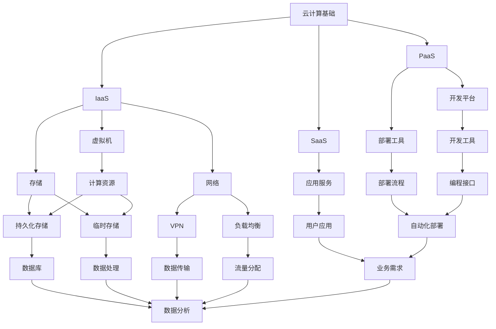

                 

### 背景介绍

云计算作为信息技术领域的一大革命，已经深刻地改变了企业的IT基础设施构建方式。在现代企业中，云计算不仅提供了高效、灵活的计算资源，还极大地降低了IT运营成本。而AWS（Amazon Web Services）、Azure（Microsoft Azure）和GCP（Google Cloud Platform）作为当前市场上最为主流的云计算平台，更是引领了云计算的潮流。

AWS作为最早进入云计算市场的服务商，拥有丰富的产品和服务，覆盖了从IaaS（基础设施即服务）到PaaS（平台即服务）和SaaS（软件即服务）的各个方面。Azure则是微软推出的云计算平台，以其强大的集成能力和丰富的开发工具，赢得了大量Windows用户的青睐。GCP作为谷歌的云计算平台，以其高效的计算能力和先进的数据分析技术，在全球范围内迅速崛起。

选择合适的云计算平台对企业的成功至关重要。每个平台都有其独特的优势、劣势以及适用场景。本文将深入对比AWS、Azure和GCP的核心架构、服务特点和性能指标，帮助读者更全面地了解这三个平台的异同点，从而做出更加明智的决策。

在接下来的章节中，我们将首先介绍云计算的基本概念和三大平台的简要概述，然后详细分析各个平台的核心架构和主要服务。此外，还会探讨不同应用场景下各平台的表现和适用性，最后总结各平台的发展趋势和潜在挑战。通过这篇文章，读者将能够对AWS、Azure和GCP有更加深入的理解，为实际应用提供有力支持。

### 核心概念与联系

要深入理解AWS、Azure和GCP的架构及其服务，首先需要了解云计算的基本概念和相关架构。以下是云计算的一些核心概念及其相互关系：

#### 云计算基本概念

1. **IaaS（基础设施即服务）**：用户通过互联网按需访问和管理虚拟化计算资源，如虚拟机、存储和网络等。
2. **PaaS（平台即服务）**：提供一个平台，允许用户在其上开发和部署应用，无需管理底层基础设施。
3. **SaaS（软件即服务）**：软件以服务形式提供给用户，用户通过互联网使用，无需安装或维护。

#### 云计算架构

1. **计算资源**：云计算的基础设施包括虚拟机、容器、函数计算等。
2. **存储服务**：提供持久化和临时存储解决方案，如对象存储、块存储和文件存储。
3. **网络服务**：包括虚拟私有云、负载均衡、内容分发网络等，用于构建和管理云中的网络。
4. **数据库服务**：提供各种数据库解决方案，包括关系型和非关系型数据库。
5. **数据服务**：包括数据分析、数据存储和数据迁移服务。

#### Mermaid 流程图

以下是云计算架构的 Mermaid 流程图，用于展示核心概念和架构之间的相互关系：



通过上述流程图，我们可以清晰地看到云计算的核心概念和架构组件之间的关系。每个组件不仅独立发挥作用，还与其他组件紧密配合，共同构建起一个功能强大的云计算环境。

#### 核心概念与架构的联系

1. **IaaS**：提供基础的虚拟化计算资源，是云计算的基石。用户可以根据需求灵活配置和扩展资源。
2. **PaaS**：在IaaS之上，提供开发和部署应用程序的平台，使得开发者可以专注于业务逻辑，无需关心底层基础设施。
3. **SaaS**：通过互联网提供软件服务，用户可以便捷地使用各种应用，无需安装或维护。

通过上述核心概念和架构的联系，我们可以更深入地理解AWS、Azure和GCP的功能和服务。接下来，我们将详细介绍这三个平台的具体架构和服务特点。

### 核心算法原理 & 具体操作步骤

在深入分析AWS、Azure和GCP之前，我们首先需要了解这些云计算平台背后的核心算法原理及其具体操作步骤。以下是每个平台的核心算法及其应用场景的概述。

#### AWS

1. **核心算法**：AWS的核心算法包括负载均衡、自动扩展和分布式存储。

   - **负载均衡**：通过分布请求到多个服务器，确保高可用性和性能。使用轮询、最少连接和源IP哈希算法。
   - **自动扩展**：根据配置规则，自动增加或减少计算资源，以应对流量波动。分为垂直扩展和水平扩展。
   - **分布式存储**：使用Elastic Block Store（EBS）和Simple Storage Service（S3）提供持久化和临时存储。

2. **具体操作步骤**：

   - **配置负载均衡**：在AWS管理控制台中创建负载均衡，选择算法并配置健康检查。
   - **设置自动扩展**：在AWS管理控制台中，创建自动扩展组，设置触发器和扩展策略。
   - **部署分布式存储**：使用AWS CLI或SDK创建EBS卷和S3存储桶，并将数据写入或读取。

#### Azure

1. **核心算法**：Azure的核心算法包括容器编排、机器学习和自动扩展。

   - **容器编排**：使用Kubernetes进行容器管理，确保应用的持续交付和运维。
   - **机器学习**：提供广泛的机器学习算法和服务，支持从数据预处理到模型训练的整个流程。
   - **自动扩展**：根据资源使用情况自动增加或减少计算和存储资源。

2. **具体操作步骤**：

   - **部署容器编排**：在Azure管理控制台中创建Kubernetes集群，配置节点和命名空间。
   - **训练机器学习模型**：使用Azure Machine Learning Workbench或Azure Machine Learning SDK训练和部署模型。
   - **设置自动扩展**：在Azure管理控制台中，创建自动扩展配置，设置触发器和扩展策略。

#### GCP

1. **核心算法**：GCP的核心算法包括分布式计算、数据分析和AI服务。

   - **分布式计算**：使用Dataflow和Datastore提供分布式数据处理和分析服务。
   - **数据分析**：提供BigQuery和Datastore等工具，支持大规模数据处理和实时分析。
   - **AI服务**：提供预训练的AI模型和API，支持图像识别、自然语言处理等应用。

2. **具体操作步骤**：

   - **部署分布式计算**：在GCP控制台中创建Dataflow作业，配置数据处理管道。
   - **使用数据分析工具**：使用BigQuery进行数据查询和分析，或将数据加载到Datastore。
   - **部署AI服务**：在GCP控制台中，选择合适的AI服务，并使用API进行模型训练和部署。

通过理解AWS、Azure和GCP的核心算法原理和具体操作步骤，我们可以更好地掌握这些云计算平台的使用方法和最佳实践。在接下来的章节中，我们将详细分析这些平台的架构和服务，帮助读者全面了解各个平台的特点和优势。

#### 数学模型和公式 & 详细讲解 & 举例说明

在云计算平台中，一些关键的数学模型和公式被广泛应用于资源分配、负载均衡和成本优化等方面。以下将详细介绍这些数学模型和公式，并通过具体例子说明其应用。

##### 1. 资源分配模型

在云计算中，资源分配是一个关键问题。常见的资源分配模型包括最大最小分配算法和最小最大分配算法。

1. **最大最小分配算法**：

   - **公式**：对于一组任务 \( T_1, T_2, ..., T_n \) 和一组资源 \( R_1, R_2, ..., R_m \)，最大最小分配算法的目标是使得每个资源上的任务负载尽可能均衡。

   \[
   min\{\max(L_i)\}
   \]

   其中，\( L_i \) 表示第 \( i \) 个资源上的任务负载。

   - **例子**：假设我们有三个任务 \( T_1, T_2, T_3 \) 和两个资源 \( R_1, R_2 \)，任务所需资源如下表：

   | 任务 | \( T_1 \) | \( T_2 \) | \( T_3 \) |
   | ---- | --------- | --------- | --------- |
   | \( R_1 \) | 2         | 1         | 3         |
   | \( R_2 \) | 1         | 2         | 1         |

   使用最大最小分配算法，我们可以将任务分配如下：

   \[
   \begin{aligned}
   T_1 &\rightarrow R_1, \\
   T_2 &\rightarrow R_2, \\
   T_3 &\rightarrow R_1.
   \end{aligned}
   \]

   这样每个资源上的任务负载为 \( \max(L_1, L_2) = \max(3, 3) = 3 \)，实现了负载均衡。

2. **最小最大分配算法**：

   - **公式**：该算法的目标是使得每个资源上的最大任务负载尽可能小。

   \[
   \max\{\min(L_i)\}
   \]

   其中，\( L_i \) 表示第 \( i \) 个资源上的任务负载。

   - **例子**：假设我们有四个任务 \( T_1, T_2, T_3, T_4 \) 和两个资源 \( R_1, R_2 \)，任务所需资源如下表：

   | 任务 | \( T_1 \) | \( T_2 \) | \( T_3 \) | \( T_4 \) |
   | ---- | --------- | --------- | --------- | --------- |
   | \( R_1 \) | 2         | 3         | 1         | 4         |
   | \( R_2 \) | 1         | 2         | 2         | 3         |

   使用最小最大分配算法，我们可以将任务分配如下：

   \[
   \begin{aligned}
   T_1 &\rightarrow R_1, \\
   T_2 &\rightarrow R_2, \\
   T_3 &\rightarrow R_1, \\
   T_4 &\rightarrow R_2.
   \end{aligned}
   \]

   这样每个资源上的任务负载为 \( \max(L_1, L_2) = \max(2, 2) = 2 \)，实现了负载均衡。

##### 2. 负载均衡模型

负载均衡旨在将流量分布到多个服务器，确保系统的稳定性和高可用性。常见的负载均衡算法包括轮询、最小连接和源IP哈希。

1. **轮询算法**：

   - **公式**：将请求依次分配到服务器列表中的每个服务器。

   \[
   R(i) = (i \mod n)
   \]

   其中，\( R(i) \) 表示第 \( i \) 个请求分配到的服务器索引，\( n \) 表示服务器数量。

   - **例子**：假设我们有三个服务器 \( S_1, S_2, S_3 \)，请求序列为 \( 1, 2, 3, 4, 5 \)。

   请求分配如下：

   \[
   \begin{aligned}
   R(1) &= 1 \mod 3 = 1 \rightarrow S_1, \\
   R(2) &= 2 \mod 3 = 2 \rightarrow S_2, \\
   R(3) &= 3 \mod 3 = 0 \rightarrow S_3, \\
   R(4) &= 4 \mod 3 = 1 \rightarrow S_1, \\
   R(5) &= 5 \mod 3 = 2 \rightarrow S_2.
   \end{aligned}
   \]

2. **最小连接算法**：

   - **公式**：将请求分配到当前连接数最少的服务器。

   \[
   R(i) = \arg\min(L_j)
   \]

   其中，\( R(i) \) 表示第 \( i \) 个请求分配到的服务器索引，\( L_j \) 表示第 \( j \) 个服务器的当前连接数。

   - **例子**：假设我们有三个服务器 \( S_1, S_2, S_3 \) 和当前连接数如下：

   | 服务器 | \( S_1 \) | \( S_2 \) | \( S_3 \) |
   | ------ | --------- | --------- | --------- |
   | 连接数 | 2         | 3         | 1         |

   请求分配如下：

   \[
   \begin{aligned}
   R(1) &= \arg\min(2, 3, 1) = 3 \rightarrow S_3, \\
   R(2) &= \arg\min(1, 3, 2) = 1 \rightarrow S_1, \\
   R(3) &= \arg\min(1, 2, 2) = 1 \rightarrow S_1.
   \end{aligned}
   \]

3. **源IP哈希算法**：

   - **公式**：将请求的源IP地址进行哈希处理，根据哈希值分配到服务器。

   \[
   R(i) = Hash(IP_i) \mod n
   \]

   其中，\( R(i) \) 表示第 \( i \) 个请求分配到的服务器索引，\( n \) 表示服务器数量，\( Hash \) 表示哈希函数。

   - **例子**：假设我们有三个服务器 \( S_1, S_2, S_3 \) 和请求的源IP地址为 \( 192.168.1.1, 10.0.0.1, 172.16.0.1 \)。

   请求分配如下：

   \[
   \begin{aligned}
   R(1) &= Hash(192.168.1.1) \mod 3 = 1 \rightarrow S_1, \\
   R(2) &= Hash(10.0.0.1) \mod 3 = 2 \rightarrow S_2, \\
   R(3) &= Hash(172.16.0.1) \mod 3 = 0 \rightarrow S_3.
   \end{aligned}
   \]

##### 3. 成本优化模型

在云计算中，合理分配资源以降低成本是一个重要问题。常见的成本优化模型包括最小化总成本和最大化资源利用率。

1. **最小化总成本**：

   - **公式**：选择最优的资源组合，使得总成本最小。

   \[
   \min \sum_{i=1}^n c_i \times x_i
   \]

   其中，\( c_i \) 表示第 \( i \) 种资源的单价，\( x_i \) 表示第 \( i \) 种资源的分配量。

   - **例子**：假设我们有三种资源 \( R_1, R_2, R_3 \)，单价分别为 \( 10, 20, 30 \) 元，需求量分别为 \( 2, 3, 5 \) 单位。

   总成本为：

   \[
   \min \{10 \times 2 + 20 \times 3 + 30 \times 5\} = 190 \text{ 元}
   \]

   选择 \( R_1 \) 2单位，\( R_2 \) 3单位，\( R_3 \) 5单位。

2. **最大化资源利用率**：

   - **公式**：选择最优的资源组合，使得总资源利用率最大。

   \[
   \max \frac{\sum_{i=1}^n u_i \times x_i}{\sum_{i=1}^n x_i}
   \]

   其中，\( u_i \) 表示第 \( i \) 种资源的利用率，\( x_i \) 表示第 \( i \) 种资源的分配量。

   - **例子**：假设我们有三种资源 \( R_1, R_2, R_3 \)，利用率分别为 \( 0.5, 0.8, 0.9 \)，需求量分别为 \( 2, 3, 5 \) 单位。

   总资源利用率为：

   \[
   \max \frac{0.5 \times 2 + 0.8 \times 3 + 0.9 \times 5}{2 + 3 + 5} = \frac{4.5 + 2.4 + 4.5}{10} = 0.81
   \]

   选择 \( R_1 \) 2单位，\( R_2 \) 3单位，\( R_3 \) 5单位。

通过上述数学模型和公式的详细讲解与具体例子，我们可以更好地理解云计算中的资源分配、负载均衡和成本优化。这些算法和公式在实际应用中具有广泛的应用价值，能够帮助我们优化资源利用，提高系统性能和降低成本。

#### 项目实战：代码实际案例和详细解释说明

为了更直观地展示AWS、Azure和GCP在云计算中的具体应用，我们将通过实际案例来详细解释这些平台的使用方法。本节将分为三个部分，分别介绍如何使用AWS、Azure和GCP进行云计算项目的开发环境搭建、源代码实现和代码解读与分析。

##### 1. AWS项目实战

**1.1 开发环境搭建**

假设我们需要搭建一个基于AWS的简单Web应用，包括前端、后端和数据库服务。以下是具体的步骤：

- **步骤一**：创建AWS账户并在AWS管理控制台中登录。
- **步骤二**：创建一个EC2实例，选择适合的实例类型和操作系统，如Ubuntu 20.04 LTS。
- **步骤三**：安装必要的开发环境，如Node.js、Python和MySQL。
- **步骤四**：配置安全组规则，允许外部访问特定的端口（例如，80端口用于HTTP服务）。

**1.2 源代码实现**

以下是使用Python语言实现的一个简单的Web服务器代码示例：

```python
import http.server
import socketserver

class MyHandler(http.server.SimpleHTTPRequestHandler):
    def do_GET(self):
        self.send_response(200)
        self.send_header('Content-type', 'text/html')
        self.end_headers()
        self.wfile.write(b'Hello, World!')

def run(server_class=http.server.HTTPServer, handler_class=MyHandler):
    server_address = ('', 80)
    httpd = server_class(server_address, handler_class)
    print('Starting httpd...')
    httpd.serve_forever()

if __name__ == '__main__':
    run()
```

**1.3 代码解读与分析**

- **MyHandler** 类继承自 `http.server.SimpleHTTPRequestHandler`，用于处理HTTP请求。
- `do_GET` 方法是 `MyHandler` 的核心方法，当接收到GET请求时，会发送HTTP 200响应，表示请求成功。
- `run` 函数创建一个HTTP服务器实例，并启动服务器。

##### 2. Azure项目实战

**2.1 开发环境搭建**

假设我们需要在Azure上搭建一个基于Node.js的Web应用，以下是具体的步骤：

- **步骤一**：登录Azure管理门户，创建一个新的资源组。
- **步骤二**：在资源组中创建一个App Service计划，选择Node.js版本。
- **步骤三**：创建一个App Service Web应用，并配置所需的存储和数据库服务。
- **步骤四**：配置网络和安全性，如设置虚拟网络和网络安全组。

**2.2 源代码实现**

以下是使用Node.js实现的简单Web服务器代码示例：

```javascript
const http = require('http');

const server = http.createServer((req, res) => {
  res.writeHead(200, { 'Content-Type': 'text/html' });
  res.end('<h1>Hello, Azure!</h1>');
});

server.listen(8080, () => {
  console.log('Server running on port 8080');
});
```

**2.3 代码解读与分析**

- `http.createServer` 方法创建一个HTTP服务器实例。
- 传递一个回调函数作为参数，该函数接收请求和响应对象，用于处理HTTP请求。
- `res.writeHead` 方法设置HTTP响应的状态码和内容类型。
- `res.end` 方法发送HTTP响应内容。
- `server.listen` 方法启动服务器，并监听指定的端口。

##### 3. GCP项目实战

**3.1 开发环境搭建**

假设我们需要在GCP上搭建一个基于Python的Web应用，以下是具体的步骤：

- **步骤一**：登录Google Cloud Console，创建一个新的项目。
- **步骤二**：在项目中创建一个App Engine应用程序，选择Python运行时。
- **步骤三**：上传应用代码到Google Cloud Storage，并在App Engine中配置存储桶。
- **步骤四**：配置网络和安全性，如设置防火墙规则。

**3.2 源代码实现**

以下是使用Python实现的简单Web服务器代码示例：

```python
from flask import Flask

app = Flask(__name__)

@app.route('/')
def hello():
    return '<h1>Hello, GCP!</h1>'

if __name__ == '__main__':
    app.run()
```

**3.3 代码解读与分析**

- `Flask` 是一个轻量级的Web框架，用于创建Web应用程序。
- `app = Flask(__name__)` 创建一个Flask应用程序实例。
- `@app.route('/')` 装饰器定义了一个URL路由，用于处理根路径的HTTP请求。
- `hello` 函数是路由处理函数，返回一个HTML响应。
- `app.run()` 方法启动Web服务器，并监听默认的HTTP端口。

通过上述AWS、Azure和GCP的实际项目案例，我们可以看到每个平台在开发环境搭建、源代码实现和代码解读与分析方面的具体操作步骤和要点。这些案例不仅展示了各平台的强大功能，也为开发者提供了实际操作的经验和参考。

#### 实际应用场景

AWS、Azure和GCP在不同的应用场景中表现出各自的优势和局限性。以下是这三个平台在实际应用场景中的表现和适用性分析：

##### 1. 企业级应用

在企业级应用中，AWS和Azure具有明显的优势。AWS拥有丰富的产品和服务，能够满足大型企业复杂多样的需求。其高度可扩展性和强大的安全性使其成为许多金融、零售和制造企业的首选。例如，Netflix使用AWS进行大规模的内容分发和流媒体服务，而银行和金融机构则依赖于AWS的安全和合规性来保护客户数据和交易。

Azure则凭借其与微软生态系统的深度集成，成为Windows企业用户的首选。其强大的虚拟机管理和混合云支持，使得企业能够灵活地整合本地和云资源。微软的Active Directory和Office 365等服务的无缝集成，进一步增强了Azure在企业应用中的优势。

GCP在大型企业级应用中的市场份额相对较小，但其高效的数据处理和分析能力使其在需要大规模数据分析和机器学习的企业中具有一定的吸引力。例如，谷歌自身的大规模广告业务和搜索引擎技术，充分展示了GCP在处理大量数据和高性能计算方面的优势。

##### 2. 开发者和初创企业

对于开发者和初创企业来说，这三个平台都提供了丰富的工具和资源，但各自的特点有所不同。

AWS因其广泛的云服务和强大的生态系统，成为开发者首选的云平台。AWS的Free Tier计划为开发者提供了免费的使用额度，使得初创企业可以在有限的预算下进行开发。此外，AWS的AWS Amplify工具链和AWS Lambda函数计算服务，为开发者提供了高效的开发和部署解决方案。

Azure则为开发者提供了强大的集成工具和丰富的开发资源。Azure DevOps、Azure Functions和Azure App Service等工具，使得开发者可以轻松地构建、测试和部署应用程序。对于使用微软技术的团队，Azure的整合优势使得其成为首选。

GCP则以其高效的计算能力和先进的数据分析技术吸引了开发者。GCP的Google Kubernetes Engine（GKE）和Google Cloud Functions等工具，为开发者提供了现代化的云原生开发体验。此外，GCP的Google Cloud Platform Startups Program为初创企业提供了资金和资源支持。

##### 3. 政府和公共服务

在政府和公共服务领域，AWS和Azure都具有较强的竞争力。AWS在全球范围内建立了多个数据中心，确保合规性和数据隐私。许多政府机构选择AWS来支持其大数据分析和电子政务项目。

Azure在政府和公共服务领域同样具备优势，特别是在欧洲和北美地区。Azure的合规性和安全认证，使其成为许多政府项目的首选。此外，Azure与微软的长期合作关系，也为政府机构提供了强大的技术支持。

GCP在政府项目中的应用相对较少，但其高效的数据处理和分析能力，使其在一些特殊项目中具有一定的竞争力。例如，GCP的机密计算服务（Secret Computing）为政府机构提供了安全的数据处理解决方案。

##### 4. 创新和创业

在创新和创业领域，这三个平台都提供了丰富的资源和支持。AWS的AWS Activate计划和Azure的Azure for Startups Program，为初创企业提供了资金、培训和云资源支持。这些计划不仅降低了初创企业的启动成本，还提供了技术指导和资源对接，助力企业快速成长。

GCP的Google Cloud Platform Startups Program，则为初创企业提供了资金、技术资源和市场推广支持。谷歌的创新技术和开放文化，为初创企业提供了广阔的发展空间。

##### 结论

AWS、Azure和GCP在不同的应用场景中各有优劣。企业在选择云平台时，应综合考虑其业务需求、技术栈、成本和合规性等因素。AWS在广泛的产品和服务方面具有明显优势，Azure在微软生态系统中表现突出，而GCP则在高效数据处理和分析能力上独具优势。通过深入了解这些平台的特点和适用场景，企业可以做出更加明智的决策，充分利用云计算的潜力。

### 工具和资源推荐

在云计算领域，为了确保开发者能够高效地利用AWS、Azure和GCP，以下是一些学习资源、开发工具和相关论文著作的推荐，旨在帮助读者提升技能并深入了解云计算技术。

#### 1. 学习资源推荐

- **书籍**：
  - 《AWS实例解析：从入门到实践》：详细介绍了AWS的核心服务和操作实践。
  - 《Azure深度学习：企业云计算实践》：讲解了如何在Azure上进行大数据分析和机器学习应用。
  - 《Google Cloud Platform攻略：构建企业级云计算环境》：全面介绍了GCP的服务架构和实际应用。

- **在线课程**：
  - Coursera的《云计算基础与AWS》课程：由AWS认证讲师讲授，涵盖AWS的核心概念和实战技巧。
  - Udemy的《Azure云计算认证》课程：针对Azure的全面课程，帮助开发者掌握Azure的各种服务。
  - edX的《Google Cloud Platform基础》课程：深入讲解GCP的技术和应用场景。

- **官方文档**：
  - AWS官方文档：[https://docs.aws.amazon.com/](https://docs.aws.amazon.com/)
  - Azure官方文档：[https://docs.microsoft.com/en-us/azure/](https://docs.microsoft.com/en-us/azure/)
  - GCP官方文档：[https://cloud.google.com/docs](https://cloud.google.com/docs)

#### 2. 开发工具框架推荐

- **IDE**：
  - AWS CLI：Amazon Web Services Command Line Interface，用于与AWS服务交互。
  - Azure CLI：用于与Azure资源进行交互的命令行工具。
  - gcloud CLI：Google Cloud SDK的命令行工具，用于与GCP服务交互。

- **容器化工具**：
  - Docker：用于构建、运行和分发容器化应用的工具。
  - Kubernetes：用于自动化容器化应用程序的部署、扩展和管理。

- **持续集成/持续部署（CI/CD）工具**：
  - AWS CodePipeline：用于自动化和协调代码的部署流程。
  - Azure DevOps：提供从代码托管、构建、测试到部署的一站式服务。
  - Google Cloud Build：自动化构建和部署容器化应用程序的服务。

#### 3. 相关论文著作推荐

- **学术论文**：
  - "The Design and Implementation of the FreeBSD Virtual Machine Monitor"：分析了虚拟机监控器的设计与实现。
  - "Bigtable: A Distributed Storage System for Structured Data"：详细介绍了Google的大规模数据存储系统。
  - "Microsoft Azure Architecture: Designing and Implementing Services for the Cloud"：探讨了Azure的架构设计和服务实现。

- **技术报告**：
  - "AWS Global Infrastructure": 提供了AWS全球基础设施的详细信息。
  - "Azure Architecture Guide": 介绍了Azure的核心架构和设计原则。
  - "Google Cloud Platform: Designing and Implementing Large Scale Systems"：讲解了GCP的体系结构和大规模系统设计。

通过以上推荐的学习资源、开发工具和相关论文著作，读者可以全面了解AWS、Azure和GCP的技术原理和应用实践，提升云计算开发能力。这些资源将为读者在云计算领域的研究和实践提供有力支持。

### 总结：未来发展趋势与挑战

随着云计算技术的不断发展，AWS、Azure和GCP这三大云计算平台在未来的发展中将继续展现其独特的优势。然而，也面临着一系列挑战。

#### 未来发展趋势

1. **AI与云计算的深度融合**：人工智能技术将在云计算平台中发挥越来越重要的作用。云原生AI服务、自动化机器学习（AutoML）和增强现实（AR）等应用场景将持续涌现，推动云计算向智能化方向演进。

2. **边缘计算的发展**：为了满足日益增长的实时数据处理需求，边缘计算将成为云计算的重要组成部分。AWS、Azure和GCP都在积极布局边缘计算，通过在靠近数据源的边缘设备上提供计算和存储服务，以降低延迟、提高响应速度。

3. **可持续发展与绿色计算**：随着环境问题的日益严峻，云计算平台将越来越注重可持续发展。绿色计算、能效优化和可再生能源的使用将成为未来云计算发展的关键趋势。

4. **混合云与多云策略的普及**：企业将越来越倾向于采用混合云和多云策略，以实现资源的高效利用和业务的灵活部署。三大平台将继续加强生态系统的建设，提供更加开放的接口和兼容性，以支持跨云服务和数据迁移。

#### 面临的挑战

1. **数据安全和隐私保护**：随着数据量的爆炸性增长，数据安全和隐私保护将成为云计算平台面临的重要挑战。确保数据的安全存储、传输和处理，防止数据泄露和滥用，是云计算平台必须解决的难题。

2. **成本优化与资源效率**：随着企业对云计算的依赖度增加，如何优化成本和提高资源利用效率成为一个重要课题。云计算平台需要不断优化定价策略和资源管理机制，以帮助企业降低成本。

3. **合规性与法规遵从**：不同国家和地区对数据保护、隐私和安全的要求日益严格。云计算平台需要确保其服务符合各地的法规要求，避免因合规性问题而影响业务的扩展。

4. **技术人才短缺**：随着云计算的快速发展，对云计算专业人才的需求大幅增加。然而，当前的人才储备无法满足市场的要求。云计算平台和相关培训机构需要加大力度培养和引进专业人才。

通过应对这些挑战，AWS、Azure和GCP将继续引领云计算的发展，推动技术创新和应用落地。未来，云计算将与AI、边缘计算、可持续发展和混合云等趋势深度融合，为企业和个人带来更多的机遇和挑战。

### 附录：常见问题与解答

#### 1. AWS、Azure和GCP的区别是什么？

AWS、Azure和GCP在云计算领域各自有着独特的特点：

- **AWS（Amazon Web Services）**：作为最早进入市场的云计算服务商，AWS提供了最广泛的产品和服务，包括IaaS、PaaS和SaaS。其强大的生态系统和广泛的全球数据中心使其成为企业级用户的首选。

- **Azure（Microsoft Azure）**：微软推出的云计算平台，与微软的生态系统深度集成，支持Windows和Linux环境。Azure在混合云和数据分析方面具有显著优势，适合使用微软技术的企业。

- **GCP（Google Cloud Platform）**：谷歌的云计算平台，以其高效的计算能力和先进的数据分析技术著称。GCP在处理大规模数据和高性能计算领域表现突出，适合对数据分析和机器学习有需求的企业。

#### 2. 哪个云计算平台最适合初创企业？

初创企业应考虑成本、灵活性和生态系统。以下是一些建议：

- **AWS**：提供丰富的免费试用资源，适合在初期进行低成本实验和开发。
- **Azure**：提供Azure for Startups Program，为初创企业提供资金和技术支持。
- **GCP**：Google Cloud Platform Startups Program为初创企业提供了丰富的资源，特别是对有大规模数据处理需求的企业。

#### 3. 云计算平台的安全性如何？

所有主要云计算平台都提供了高级别的安全性：

- **AWS**：提供了丰富的安全服务和工具，包括IAM、VPC、WAF等。
- **Azure**：提供了Azure Security Center和Azure Information Protection等安全功能。
- **GCP**：提供了Google Cloud Armor和BeyondCorp等安全服务。

每个平台都有严格的合规性和认证，确保用户数据的安全。

#### 4. 如何选择合适的云计算平台？

选择云计算平台应考虑以下因素：

- **业务需求**：分析企业的业务需求和预期目标。
- **技术栈**：考虑现有的技术栈和团队的技术能力。
- **成本**：评估各平台的定价模式和成本效益。
- **生态系统**：考虑平台提供的工具、服务和合作伙伴网络。

通过综合考虑这些因素，企业可以做出更加明智的决策。

### 扩展阅读 & 参考资料

为了帮助读者进一步了解云计算及其三大平台AWS、Azure和GCP，以下是一些扩展阅读和参考资料：

- **书籍**：
  - 《云计算架构设计：构建和优化云服务》
  - 《云计算实践：从AWS、Azure到GCP》
  - 《云计算：概念、技术和应用》

- **在线课程**：
  - Coursera的《云计算与AWS基础》
  - Udemy的《Azure云计算实战课程》
  - edX的《Google Cloud Platform专业认证》

- **官方文档**：
  - AWS官方文档：[https://docs.aws.amazon.com/](https://docs.aws.amazon.com/)
  - Azure官方文档：[https://docs.microsoft.com/en-us/azure/](https://docs.microsoft.com/en-us/azure/)
  - GCP官方文档：[https://cloud.google.com/docs](https://cloud.google.com/docs)

- **博客和论坛**：
  - AWS官方博客：[https://aws.amazon.com/blogs/](https://aws.amazon.com/blogs/)
  - Azure官方博客：[https://azure.microsoft.com/en-us/blog/](https://azure.microsoft.com/en-us/blog/)
  - GCP官方博客：[https://cloud.google.com/blog/](https://cloud.google.com/blog/)

- **论文和报告**：
  - "A Comparison of Public Cloud IaaS Providers: AWS, Azure, and Google Cloud"
  - "Comparing Cloud Service Providers: AWS, Azure, and Google Cloud Platform"

通过阅读这些扩展资料，读者可以深入了解云计算的各个方面，提升对AWS、Azure和GCP的理解和应用能力。

