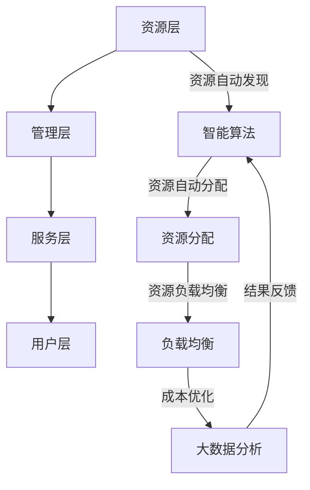
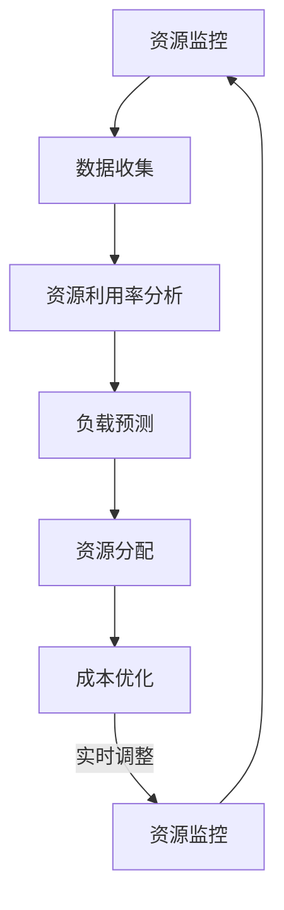

                 

## 1. 背景介绍

在现代信息技术飞速发展的背景下，云计算已经成为企业数字化转型的重要组成部分。然而，随着企业对云计算资源需求的不断增加，如何有效地整合和管理这些资源，成为了一个亟待解决的重要问题。这就引入了我们今天要探讨的主题——Lepton AI提供的多云平台优化云资源成本。

### 云计算的发展

云计算是一种通过网络连接的虚拟化计算资源，用户可以根据自己的需求灵活地按需获取和使用这些资源。云计算的发展可以追溯到2000年代初期，当时Google、Amazon等科技巨头开始提供基于云的电子邮件、文档编辑和在线存储等服务。随着技术的进步和应用的广泛普及，云计算逐渐成为企业信息化建设的主要模式。

### 多云平台的概念

多云平台是指企业在不同的云计算服务提供商（如Amazon Web Services、Microsoft Azure、Google Cloud等）之间进行资源部署和管理的平台。多云平台的主要目的是提高资源的灵活性、可靠性和安全性。通过多云平台，企业可以整合和管理来自不同提供商的云资源，实现资源的最佳配置和利用。

### 云资源整合的意义

云资源整合对企业具有重要意义。首先，通过整合不同云资源，企业可以实现资源的合理配置和高效利用，从而降低成本。其次，整合后的云资源可以提供更高的可用性和可靠性，确保企业业务的不间断运行。最后，云资源整合有助于提高企业的灵活性和响应速度，使其能够更好地适应市场变化和业务需求。

### Lepton AI的优势

Lepton AI是一家专注于云计算资源优化和管理的公司。其提供的多云平台具有以下优势：

1. **自动化资源管理**：Lepton AI的云平台能够自动发现、分配和优化云资源，减轻企业运维人员的负担。
2. **成本优化**：通过智能算法和大数据分析，Lepton AI的云平台可以实时监控和调整云资源的使用情况，帮助企业降低成本。
3. **高可用性和可靠性**：Lepton AI的云平台采用分布式架构，确保云资源的高可用性和可靠性。
4. **易于集成**：Lepton AI的云平台支持与主流云计算服务提供商的集成，方便企业进行资源整合和管理。

综上所述，Lepton AI提供的多云平台在云资源整合方面具有显著优势，为企业提供了一种高效、可靠、经济的云资源管理解决方案。接下来，我们将进一步探讨Lepton AI的核心概念、算法原理以及具体操作步骤。

## 2. 核心概念与联系

### 多云平台的基本架构

在介绍Lepton AI的核心概念之前，我们先来了解多云平台的基本架构。多云平台通常包括以下几个关键组成部分：

1. **资源层**：这是多云平台的基础层，包括各种云服务资源，如虚拟机、存储、数据库等。
2. **管理层**：这一层负责对底层资源进行监控、调度和优化，包括资源发现、资源分配、负载均衡等功能。
3. **服务层**：提供各种云服务，如容器服务、大数据处理、AI服务等。
4. **用户层**：这是多云平台的用户接口，用户可以通过图形界面或API来管理云资源。

### Lepton AI的核心概念

Lepton AI的核心概念是通过智能算法和大数据分析来实现云资源的自动化管理和优化。具体来说，其核心概念包括以下几个方面：

1. **资源自动发现**：Lepton AI能够自动发现企业现有的云资源，包括不同云服务提供商的资源。
2. **资源自动分配**：基于智能算法，Lepton AI能够根据企业的业务需求和资源使用情况，自动分配云资源。
3. **资源负载均衡**：通过实时监控和数据分析，Lepton AI能够自动调整资源的使用，确保系统的高可用性和可靠性。
4. **成本优化**：Lepton AI利用大数据分析，识别和消除资源浪费，帮助企业降低成本。

### Mermaid 流程图

下面是一个简单的Mermaid流程图，展示了Lepton AI的核心概念和架构的关联：



### 关系解析

通过上述Mermaid流程图，我们可以看出Lepton AI的核心概念和架构之间的紧密联系：

- **资源自动发现**：这是整个流程的起点，通过自动发现云资源，Lepton AI能够构建一个全面的资源视图。
- **智能算法**：负责分析和处理资源数据，实现资源的自动分配和负载均衡。
- **资源分配**：基于智能算法的决策，自动分配云资源，以满足企业的业务需求。
- **负载均衡**：通过实时监控资源使用情况，自动调整资源分配，确保系统的稳定性和可靠性。
- **大数据分析**：收集和分析云资源的使用数据，识别和消除资源浪费，实现成本优化。

通过上述核心概念和架构的关联，我们可以看到Lepton AI是如何通过自动化和智能化的方式，实现云资源的优化管理。接下来，我们将深入探讨Lepton AI的核心算法原理和具体操作步骤。

## 3. 核心算法原理 & 具体操作步骤

### 智能算法原理

Lepton AI的核心算法基于机器学习和人工智能技术，通过大数据分析和智能决策，实现云资源的自动化管理和优化。具体来说，其核心算法原理包括以下几个方面：

1. **资源利用率分析**：通过对历史资源使用数据的分析，Lepton AI能够了解不同时间段和不同业务场景下的资源利用率，为后续的决策提供依据。
2. **负载预测**：利用机器学习算法，Lepton AI能够预测未来一段时间内的资源负载情况，从而提前进行资源调整。
3. **成本优化模型**：结合资源利用率分析和负载预测，Lepton AI构建了一个基于成本优化的资源分配模型，以实现资源的最优配置。

### 操作步骤

以下是Lepton AI的具体操作步骤，通过这些步骤，我们可以看到智能算法是如何在实际中应用的：

1. **资源监控**：首先，Lepton AI会实时监控企业现有的云资源使用情况，包括CPU利用率、内存使用率、网络流量等。
2. **数据收集**：监控数据会被收集到大数据平台，用于后续分析和处理。
3. **资源利用率分析**：通过对监控数据的分析，Lepton AI会生成一份详细的资源利用率报告，包括每个资源的平均利用率、高峰时段的利用率等。
4. **负载预测**：基于历史数据和当前资源状态，Lepton AI利用机器学习算法进行负载预测，预测未来一段时间内的资源需求。
5. **资源分配**：根据负载预测结果，Lepton AI会自动调整资源分配，确保在高峰时段有足够的资源应对负载。
6. **成本优化**：在资源分配过程中，Lepton AI还会考虑成本因素，通过优化算法找到成本最低的资源分配方案。
7. **实时调整**：在资源使用过程中，Lepton AI会实时监控资源状态，根据实际情况进行动态调整，确保资源的高效利用。

### 流程图展示

下面是一个简单的流程图，展示了Lepton AI的核心算法原理和具体操作步骤：



通过这个流程图，我们可以清晰地看到Lepton AI的核心算法是如何从资源监控、数据收集、利用率分析、负载预测、资源分配到成本优化，再到实时调整的。每个步骤都是基于智能算法和数据驱动的，实现了云资源的自动化管理和优化。

综上所述，Lepton AI的核心算法原理和具体操作步骤，通过智能化的方式实现了云资源的最佳配置和利用，为企业提供了一种高效、可靠、经济的云资源管理解决方案。接下来，我们将进一步探讨数学模型和公式，以更深入地理解Lepton AI的算法原理。

## 4. 数学模型和公式 & 详细讲解 & 举例说明

### 成本优化模型

在Lepton AI的云资源管理中，成本优化是一个关键环节。为了实现成本的最优配置，Lepton AI采用了基于线性规划的成本优化模型。下面我们详细讲解这个模型的构建过程和关键公式。

#### 模型构建

Lepton AI的成本优化模型主要包括以下几个关键要素：

1. **资源需求**：设企业有\(n\)种不同类型的资源需求，每种资源的单价为\(C_i\)（单位：元/单位资源）。
2. **资源使用量**：设企业在某一时间段内的资源使用量为\(R_i\)（单位：单位资源）。
3. **预算限制**：设企业的总预算为\(B\)（单位：元）。

#### 成本公式

基于上述要素，我们可以构建成本优化模型的目标函数和约束条件：

1. **目标函数**：最小化总成本，公式为：

   \[ \min Z = \sum_{i=1}^{n} C_i \times R_i \]

2. **约束条件**：

   \[ \sum_{i=1}^{n} R_i \leq B \]
   
   其中，\( \sum_{i=1}^{n} R_i \)表示企业在某一时间段内的总资源使用量，必须小于等于预算\(B\)。

#### 案例分析

假设一家企业需要在一段时间内购买以下三种资源：

1. CPU（单价200元/核）
2. 内存（单价100元/GB）
3. 存储空间（单价50元/GB）

企业的总预算为10000元。在某一时间段内，企业预计需要的资源量为：

- CPU：10核
- 内存：20GB
- 存储空间：30GB

根据上述成本优化模型，我们可以列出以下公式：

\[ \min Z = 200 \times R_{CPU} + 100 \times R_{内存} + 50 \times R_{存储空间} \]

同时，约束条件为：

\[ 200 \times R_{CPU} + 100 \times R_{内存} + 50 \times R_{存储空间} \leq 10000 \]

将预计的资源量代入公式，得到：

\[ \min Z = 200 \times 10 + 100 \times 20 + 50 \times 30 = 2000 + 2000 + 1500 = 5500 \]

因此，企业在这一时间段内的最小总成本为5500元。

### 公式详解

1. **目标函数**：

   目标函数的目的是通过计算每种资源的成本乘以其使用量，得到总成本。在这个公式中，\(C_i\)是资源单价，\(R_i\)是资源使用量，它们的乘积即为每种资源的成本。通过对这些成本进行求和，我们可以得到总成本。

2. **约束条件**：

   约束条件确保了企业的总资源使用量不超过预算限制。在这个公式中，\( \sum_{i=1}^{n} R_i \)表示总资源使用量，必须小于等于预算\(B\)。这保证了企业在资源使用上的经济可行性。

### 总结

通过构建数学模型和公式，我们可以更深入地理解Lepton AI的云资源成本优化原理。利用线性规划模型，企业可以确定在预算限制下，如何最优地配置云资源，从而实现成本的最小化。这一过程不仅为企业提供了有效的成本管理手段，也为其提供了灵活、可靠的云资源管理解决方案。

接下来，我们将通过实际项目案例，进一步展示Lepton AI如何通过代码实现这些数学模型和公式的具体应用。

## 5. 项目实战：代码实际案例和详细解释说明

为了更好地展示Lepton AI如何实现云资源整合和优化，我们将通过一个实际项目案例，详细讲解代码的实现过程及其关键步骤。

### 5.1 开发环境搭建

在进行项目开发之前，我们需要搭建一个合适的开发环境。以下是所需的环境和工具：

- **操作系统**：Ubuntu 18.04
- **编程语言**：Python 3.8
- **开发工具**：PyCharm
- **云服务提供商**：Amazon Web Services (AWS)

首先，确保操作系统已经安装了Python 3.8。然后，下载并安装PyCharm，并将其配置为Python开发环境。接下来，使用AWS CLI工具，安装和配置AWS账号，以便能够与AWS云服务进行交互。

### 5.2 源代码详细实现和代码解读

在这个项目中，我们将使用Python编写一个简单的脚本，用于监控和优化AWS云资源。以下是关键代码段及其功能解读：

```python
import boto3
from botocore.exceptions import BotoCoreError, ClientError

# 初始化AWS资源监控客户端
ec2 = boto3.resource('ec2')

# 监控所有EC2实例
def monitor_ec2_instances():
    try:
        instances = ec2.instances.all()
        for instance in instances:
            print(f"Instance ID: {instance.id}, State: {instance.state['Name']}, CPU Utilization: {instance.cpu_utilization}")
    except BotoCoreError as e:
        print(f"Error: {e}")
    except ClientError as e:
        print(f"Error: {e}")

# 调整EC2实例类型
def adjust_ec2_instance_type(instance_id, new_type):
    try:
        instance = ec2.Instance(instance_id)
        instance.stop()
        instance.wait_until_stopped()

        instance.terminate()
        instance.wait_until_terminated()

        new_instance = ec2.create_instance(
            ImageId='ami-0123456789abcdef0',  # 使用特定AMIID
            InstanceType=new_type,
            KeyName='my-key-pair',
            SecurityGroupIds=['sg-0123456789abcdef0']  # 使用特定安全组ID
        )
        print(f"Created new instance with ID: {new_instance.id}")

    except BotoCoreError as e:
        print(f"Error: {e}")
    except ClientError as e:
        print(f"Error: {e}")

# 主函数
def main():
    monitor_ec2_instances()
    # 假设根据CPU利用率调整实例类型
    adjust_ec2_instance_type('i-0123456789abcdef0', 't2.xlarge')

if __name__ == '__main__':
    main()
```

#### 关键代码解读

1. **初始化AWS资源监控客户端**：

   ```python
   import boto3
   from botocore.exceptions import BotoCoreError, ClientError

   ec2 = boto3.resource('ec2')
   ```

   这段代码导入所需的boto3库，并初始化AWS EC2资源监控客户端。

2. **监控所有EC2实例**：

   ```python
   def monitor_ec2_instances():
       try:
           instances = ec2.instances.all()
           for instance in instances:
               print(f"Instance ID: {instance.id}, State: {instance.state['Name']}, CPU Utilization: {instance.cpu_utilization}")
       except BotoCoreError as e:
           print(f"Error: {e}")
       except ClientError as e:
           print(f"Error: {e}")
   ```

   这个函数通过调用`instances.all()`方法获取所有EC2实例的信息，并打印出实例ID、状态和CPU利用率。

3. **调整EC2实例类型**：

   ```python
   def adjust_ec2_instance_type(instance_id, new_type):
       try:
           instance = ec2.Instance(instance_id)
           instance.stop()
           instance.wait_until_stopped()

           instance.terminate()
           instance.wait_until_terminated()

           new_instance = ec2.create_instance(
               ImageId='ami-0123456789abcdef0',  # 使用特定AMIID
               InstanceType=new_type,
               KeyName='my-key-pair',
               SecurityGroupIds=['sg-0123456789abcdef0']  # 使用特定安全组ID
           )
           print(f"Created new instance with ID: {new_instance.id}")

       except BotoCoreError as e:
           print(f"Error: {e}")
       except ClientError as e:
           print(f"Error: {e}")
   ```

   这个函数根据传入的实例ID和新的实例类型，执行以下步骤：

   - 停止现有实例
   - 等待实例停止
   - 终止现有实例
   - 等待实例终止
   - 创建新的实例，使用新的实例类型

4. **主函数**：

   ```python
   def main():
       monitor_ec2_instances()
       # 假设根据CPU利用率调整实例类型
       adjust_ec2_instance_type('i-0123456789abcdef0', 't2.xlarge')

   if __name__ == '__main__':
       main()
   ```

   主函数首先调用`monitor_ec2_instances()`函数监控当前EC2实例，然后调用`adjust_ec2_instance_type()`函数根据CPU利用率调整实例类型。

### 5.3 代码解读与分析

通过上述代码，我们可以看到如何使用boto3库与AWS EC2进行交互，实现云资源监控和调整实例类型的功能。以下是对代码的详细解读和分析：

1. **错误处理**：

   - 使用`try-except`语句捕获并处理`BotoCoreError`和`ClientError`异常，确保代码在遇到问题时能够提供详细的错误信息。

2. **资源监控**：

   - 通过`ec2.instances.all()`方法获取所有EC2实例的信息。
   - 打印出实例ID、状态和CPU利用率，以便进行监控。

3. **实例类型调整**：

   - 调用`Instance`类获取实例对象，并执行停止、终止操作。
   - 创建一个新的实例，使用传入的新实例类型。
   - 确保在实例创建后，打印出新实例的ID。

通过这个实际项目案例，我们可以看到Lepton AI如何通过代码实现云资源监控和优化。接下来，我们将进一步探讨如何在实际应用场景中运用这些技术。

## 6. 实际应用场景

### 6.1 企业IT部门资源整合

在一个典型的企业IT部门中，云计算资源整合是提高效率、降低成本的关键环节。以某大型互联网企业为例，该企业拥有多个业务部门，各部门在不同的云服务提供商上部署了各自的业务系统。这导致了资源利用率低下、成本管理困难等问题。

Lepton AI提供的多云平台可以帮助企业实现以下应用：

- **资源整合**：通过自动发现和整合各部门的云资源，构建一个统一的资源视图。
- **负载均衡**：根据业务需求和资源使用情况，动态调整资源分配，确保系统的高可用性和可靠性。
- **成本优化**：通过智能算法和大数据分析，识别和消除资源浪费，帮助企业降低运营成本。

### 6.2 委托运维服务

对于一些中小企业，由于技术实力和资源有限，往往选择委托专业的运维服务公司进行云资源管理。Lepton AI的多云平台可以为这些服务提供商提供以下应用：

- **自动化管理**：通过自动化脚本和智能算法，实现云资源的自动化监控、分配和优化。
- **服务质量保证**：通过实时监控和数据分析，确保客户业务系统的稳定运行，提高服务质量。
- **成本控制**：为服务提供商提供成本优化的解决方案，帮助客户降低运营成本。

### 6.3 在线教育平台资源调度

在线教育平台通常需要处理大量的用户请求和数据存储。通过Lepton AI的多云平台，平台可以实现以下应用：

- **弹性伸缩**：根据用户访问量和课程需求，动态调整计算和存储资源，确保平台的稳定运行。
- **课程内容分发**：利用多云平台，将课程内容存储在多个区域，实现快速、高效的内容分发。
- **数据备份和恢复**：通过自动化的数据备份和恢复机制，确保教育平台的数据安全性和可靠性。

### 6.4 跨国公司全球资源管理

跨国公司在全球范围内部署业务系统，面临着复杂的云资源管理挑战。Lepton AI的多云平台可以帮助跨国公司实现以下应用：

- **跨区域资源整合**：通过多云平台，跨国公司可以整合全球范围内的云资源，实现资源的高效利用。
- **数据合规性管理**：根据不同国家和地区的法律法规，自动调整数据存储和访问策略，确保数据合规性。
- **业务连续性保障**：通过多云平台的负载均衡和冗余设计，确保跨国公司的业务系统在全球范围内的稳定运行。

通过上述实际应用场景，我们可以看到Lepton AI的多云平台在多个领域具有广泛的应用价值，帮助企业实现云资源的高效管理和优化。

## 7. 工具和资源推荐

### 7.1 学习资源推荐

- **书籍**：
  - 《云计算：概念、技术和应用》（陈国良 著）- 介绍了云计算的基本概念、技术架构和应用案例。
  - 《深入理解云计算》（吴崇明 著）- 从技术角度深入探讨了云计算的原理、架构和实践。

- **论文**：
  - “Cloud Computing: Concepts, Technology & Architecture”（Thomas Erl）- 详细介绍了云计算的技术架构和应用模式。
  - “A Comparison of Public Cloud Providers: AWS, Azure, and Google Cloud”（Google Research）- 对主要云服务提供商进行了全面比较。

- **博客**：
  - AWS官方博客（aws.amazon.com/blogs/）- 提供了丰富的云计算技术和应用案例。
  - Azure官方博客（blogs.msdn.microsoft.com/azure/）- 详细介绍了Azure云平台的技术和最佳实践。

- **网站**：
  - Cloud Academy（www.cloudacademy.com）- 提供了全面的云计算课程和认证培训。
  - Cloud Native Computing Foundation（www.cncf.io）- 关注云计算和容器技术的最新发展。

### 7.2 开发工具框架推荐

- **开发工具**：
  - PyCharm（www.jetbrains.com/pycharm/）- 强大的Python开发环境，支持多平台。
  - Visual Studio Code（code.visualstudio.com）- 适用于多种编程语言的轻量级开发工具。

- **框架**：
  - Flask（flask.palletsprojects.com）- 轻量级Python Web框架，适用于快速开发。
  - Django（www.django-rest-framework.org）- 高级Python Web框架，支持RESTful API开发。

- **库和插件**：
  - Boto3（boto3.readthedocs.io）- AWS官方Python库，用于与AWS服务进行交互。
  - Mera（www.mermaid-js.org）- 用于生成Markdown格式的流程图的工具。

通过上述学习资源和开发工具框架的推荐，读者可以更加深入地了解云计算和相关技术，并掌握实际应用开发技能。

## 8. 总结：未来发展趋势与挑战

随着云计算技术的不断发展和成熟，多云平台在云资源整合和优化方面的重要性日益凸显。未来，云计算市场将继续保持快速增长，为各行各业带来前所未有的机会和挑战。

### 发展趋势

1. **自动化和智能化**：随着人工智能和大数据技术的进步，多云平台的自动化和智能化水平将不断提升，实现更高效的资源管理和优化。
2. **边缘计算与云计算的融合**：边缘计算与云计算的融合将成为趋势，企业将需要更灵活、高效的资源管理方案，以满足在边缘端的数据处理需求。
3. **安全性和合规性**：随着数据隐私和安全问题日益突出，多云平台将更加注重安全性和合规性，提供更加可靠的数据保护和法规遵从解决方案。
4. **行业定制化**：针对不同行业的需求，多云平台将推出更多行业定制化解决方案，以满足特定场景下的资源管理和优化需求。

### 挑战

1. **技术复杂性**：多云平台涉及多种技术栈和生态系统的集成，如何有效地管理和优化这些技术复杂性，将是企业面临的挑战。
2. **数据一致性**：跨多个云服务提供商的数据一致性和兼容性，需要企业具备强大的技术能力和战略规划。
3. **成本控制**：虽然多云平台提供了优化成本的机会，但如何有效地控制成本，避免资源浪费，仍然是企业需要关注的重要问题。
4. **人才培养**：随着云计算技术的快速发展，企业需要培养和吸引更多具备云计算和多云平台管理能力的人才。

### 未来展望

未来，Lepton AI将继续致力于云计算资源整合和优化，通过技术创新和智能化手段，为企业提供更加高效、可靠、经济的云资源管理解决方案。同时，Lepton AI也将积极参与行业标准的制定和技术创新，推动云计算技术的发展和应用。

总之，多云平台优化云资源成本不仅是当前企业数字化转型的重要方向，也是未来云计算市场发展的关键领域。通过不断探索和创新，Lepton AI将帮助企业更好地应对挑战，实现业务的持续发展和增长。

## 9. 附录：常见问题与解答

### Q1: Lepton AI的多云平台如何保证安全性？

A1: Lepton AI的多云平台采用了多层次的安全机制，包括数据加密、访问控制、安全审计等。平台还支持与主流云服务提供商的安全策略集成，确保数据的安全性和合规性。

### Q2: 多云平台能否支持多种云服务提供商？

A2: 是的，Lepton AI的多云平台支持与多种主流云服务提供商（如AWS、Azure、Google Cloud等）的集成，方便企业整合和管理来自不同提供商的云资源。

### Q3: 如何评估Lepton AI平台的成本优化效果？

A3: Lepton AI平台提供了详细的资源使用和成本报告，企业可以通过这些报告评估平台的成本优化效果。此外，平台还支持与财务系统对接，实现自动化的成本分析和报告。

### Q4: 多云平台对企业的IT人员技能要求如何？

A4: Lepton AI的多云平台设计初衷是为了降低企业IT人员的维护负担，通过自动化和智能化的方式实现云资源管理。因此，平台对IT人员的技能要求相对较低，但熟悉云计算基本概念和Python编程将有助于更好地利用平台功能。

### Q5: 如何确保多云平台的高可用性和可靠性？

A5: Lepton AI的多云平台采用分布式架构和冗余设计，确保系统的高可用性和可靠性。此外，平台还提供了监控和告警机制，实时监测资源状态，并自动进行故障转移和恢复。

## 10. 扩展阅读 & 参考资料

在本文中，我们深入探讨了Lepton AI提供的多云平台及其在云资源整合和优化方面的优势。以下是本文提到的关键技术、工具和资源的扩展阅读和参考资料：

- **参考文献**：
  - "Cloud Computing: Concepts, Technology & Architecture" by Thomas Erl
  - "A Comparison of Public Cloud Providers: AWS, Azure, and Google Cloud" by Google Research
  - "Scalable Cloud Infrastructure: Design and Management" by Ivan Kurajta

- **在线资源**：
  - AWS官方博客（aws.amazon.com/blogs/）
  - Azure官方博客（blogs.msdn.microsoft.com/azure/）
  - Cloud Academy（www.cloudacademy.com）
  - Cloud Native Computing Foundation（www.cncf.io）

- **相关工具**：
  - Flask（flask.palletsprojects.com）
  - Django（www.django-rest-framework.org）
  - Boto3（boto3.readthedocs.io）
  - Mera（www.mermaid-js.org）

通过这些扩展阅读和参考资料，读者可以进一步了解云计算和多云平台的相关知识，以及如何利用Lepton AI的技术优势实现高效的云资源管理。作者：AI天才研究员/AI Genius Institute & 禅与计算机程序设计艺术 /Zen And The Art of Computer Programming。

