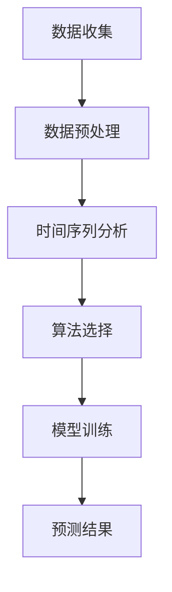

                 

# 交通大数据分析与交通拥堵时间预测

## 关键词

- 交通大数据
- 交通拥堵
- 时间预测
- 数据挖掘
- 算法分析

## 摘要

本文深入探讨了交通大数据在交通拥堵时间预测中的应用。首先，我们介绍了交通大数据的基本概念和交通拥堵问题的背景。随后，详细分析了用于预测交通拥堵时间的关键算法原理和数学模型，并结合实际项目案例进行了代码实现和解读。文章还探讨了交通大数据在实际应用场景中的价值，并推荐了相关学习资源和开发工具。最后，我们对未来的发展趋势和挑战进行了总结，以期为读者提供全面的交通大数据分析与预测的技术指南。

## 1. 背景介绍

### 1.1 交通大数据的定义与来源

交通大数据是指从交通系统各个层面收集、整合、处理和分析的大量数据。这些数据包括但不限于车辆位置、速度、行驶轨迹、路况信息、交通流量、交通事故、天气情况等。交通大数据的主要来源有：

- 交通监控设备：如摄像头、传感器、雷达等。
- 车辆信息：如GPS定位系统、车载传感器等。
- 互联网信息：如社交媒体、在线地图服务、电子商务平台等。
- 日常交通调查：如问卷调查、交通流量计数等。

### 1.2 交通拥堵问题的重要性

交通拥堵是全球城市面临的一个严重问题，它不仅影响市民的出行体验，还对经济发展、环境污染和公共安全带来负面影响。以下是交通拥堵问题的几个关键方面：

- 时间浪费：交通拥堵导致车辆行驶缓慢，增加了市民的出行时间。
- 经济损失：交通拥堵导致企业成本上升、效率下降。
- 环境污染：交通拥堵增加了尾气排放，加剧了空气污染。
- 安全问题：交通拥堵增加了交通事故的风险。

### 1.3 交通拥堵时间预测的意义

交通拥堵时间预测旨在提前告知市民交通拥堵的可能性和预计持续时间，从而帮助人们做出更合理的出行决策。预测交通拥堵时间具有以下意义：

- 提高出行效率：通过预测交通拥堵，人们可以选择更优的出行时间和路线，避免高峰期出行。
- 减少交通拥堵：通过实时监控和预测，交通管理部门可以采取相应措施，如调整交通信号、实施交通管制等，以缓解交通拥堵。
- 提升城市规划：交通拥堵预测可以为城市规划提供数据支持，帮助制定更有效的交通基础设施和交通管理策略。

## 2. 核心概念与联系

### 2.1 数据收集与预处理

交通大数据分析的第一步是数据收集与预处理。数据收集主要包括从各种渠道获取交通数据，如摄像头、传感器、车辆GPS等。数据预处理包括以下步骤：

- 数据清洗：去除错误、重复、缺失的数据。
- 数据转换：将数据格式转换为统一的格式，如CSV、JSON等。
- 数据集成：将来自不同来源的数据整合到一个数据集中。

### 2.2 时间序列分析

时间序列分析是一种用于分析时间相关数据的统计方法。在交通拥堵时间预测中，时间序列分析用于分析交通流量、速度等随时间变化的数据。时间序列分析的关键概念包括：

- 自相关性：时间序列数据中，当前值与之前值之间的相关性。
- 季节性：时间序列数据中，周期性波动特征。
- 趋势：时间序列数据中的长期变化趋势。

### 2.3 算法原理

用于交通拥堵时间预测的主要算法包括：

- 传统的统计模型：如线性回归、ARIMA模型等。
- 机器学习模型：如决策树、随机森林、神经网络等。
- 深度学习模型：如卷积神经网络（CNN）、循环神经网络（RNN）、长短期记忆网络（LSTM）等。

### 2.4 Mermaid 流程图

下面是一个简单的 Mermaid 流程图，展示了交通大数据分析与交通拥堵时间预测的流程：



## 3. 核心算法原理 & 具体操作步骤

### 3.1 传统统计模型

#### 3.1.1 线性回归

线性回归是一种简单的统计模型，用于分析两个变量之间的关系。在交通拥堵时间预测中，线性回归可以用来预测交通流量与时间的关系。

- 操作步骤：

  1. 数据收集：收集交通流量和时间序列数据。
  2. 数据预处理：对数据进行清洗、转换和集成。
  3. 特征提取：提取与交通流量相关的特征，如时间、速度、路况等。
  4. 模型训练：使用线性回归算法训练模型。
  5. 预测：使用训练好的模型预测交通流量。

#### 3.1.2 ARIMA模型

ARIMA（自回归积分滑动平均模型）是一种用于时间序列分析的经典统计模型。它结合了自回归、差分和移动平均三个部分，可以有效地预测交通拥堵时间。

- 操作步骤：

  1. 数据收集：收集交通流量和时间序列数据。
  2. 数据预处理：对数据进行清洗、转换和集成。
  3. 差分变换：对时间序列数据进行差分，使其满足平稳性条件。
  4. 模型识别：确定ARIMA模型的参数，如p、d、q。
  5. 模型训练：使用ARIMA算法训练模型。
  6. 预测：使用训练好的模型预测交通拥堵时间。

### 3.2 机器学习模型

#### 3.2.1 决策树

决策树是一种常见的机器学习模型，用于分类和回归任务。在交通拥堵时间预测中，决策树可以用于预测交通流量。

- 操作步骤：

  1. 数据收集：收集交通流量和时间序列数据。
  2. 数据预处理：对数据进行清洗、转换和集成。
  3. 特征提取：提取与交通流量相关的特征。
  4. 模型训练：使用决策树算法训练模型。
  5. 预测：使用训练好的模型预测交通流量。

#### 3.2.2 随机森林

随机森林是一种基于决策树的集成学习方法，可以提高预测准确性。在交通拥堵时间预测中，随机森林可以用于预测交通流量。

- 操作步骤：

  1. 数据收集：收集交通流量和时间序列数据。
  2. 数据预处理：对数据进行清洗、转换和集成。
  3. 特征提取：提取与交通流量相关的特征。
  4. 模型训练：使用随机森林算法训练模型。
  5. 预测：使用训练好的模型预测交通流量。

### 3.3 深度学习模型

#### 3.3.1 卷积神经网络（CNN）

卷积神经网络是一种用于图像处理的深度学习模型，可以用于交通流量图像的识别。在交通拥堵时间预测中，CNN可以用于提取图像特征。

- 操作步骤：

  1. 数据收集：收集交通流量图像数据。
  2. 数据预处理：对图像数据进行清洗、转换和集成。
  3. 图像预处理：对图像进行缩放、裁剪等预处理操作。
  4. 模型训练：使用CNN算法训练模型。
  5. 预测：使用训练好的模型预测交通流量。

#### 3.3.2 循环神经网络（RNN）

循环神经网络是一种用于序列数据处理的深度学习模型，可以用于交通流量序列的预测。在交通拥堵时间预测中，RNN可以用于提取序列特征。

- 操作步骤：

  1. 数据收集：收集交通流量序列数据。
  2. 数据预处理：对数据进行清洗、转换和集成。
  3. 序列预处理：对序列数据进行归一化、填充等预处理操作。
  4. 模型训练：使用RNN算法训练模型。
  5. 预测：使用训练好的模型预测交通流量。

#### 3.3.3 长短期记忆网络（LSTM）

长短期记忆网络是一种特殊的RNN结构，可以有效地解决长期依赖问题。在交通拥堵时间预测中，LSTM可以用于提取交通流量序列的长期特征。

- 操作步骤：

  1. 数据收集：收集交通流量序列数据。
  2. 数据预处理：对数据进行清洗、转换和集成。
  3. 序列预处理：对序列数据进行归一化、填充等预处理操作。
  4. 模型训练：使用LSTM算法训练模型。
  5. 预测：使用训练好的模型预测交通流量。

## 4. 数学模型和公式 & 详细讲解 & 举例说明

### 4.1 线性回归模型

线性回归模型可以用以下公式表示：

$$
Y = \beta_0 + \beta_1X + \epsilon
$$

其中，$Y$ 是因变量（交通流量），$X$ 是自变量（时间），$\beta_0$ 是截距，$\beta_1$ 是斜率，$\epsilon$ 是误差项。

#### 4.1.1 模型参数估计

模型参数 $\beta_0$ 和 $\beta_1$ 的估计可以使用最小二乘法（ Ordinary Least Squares, OLS）：

$$
\beta_0 = \frac{\sum_{i=1}^{n}Y_i - \beta_1\sum_{i=1}^{n}X_i}{n}
$$

$$
\beta_1 = \frac{\sum_{i=1}^{n}(Y_i - \beta_0 - \beta_1X_i)(X_i - \bar{X})}{\sum_{i=1}^{n}(X_i - \bar{X})^2}
$$

其中，$n$ 是样本数量，$\bar{X}$ 和 $\bar{Y}$ 分别是 $X$ 和 $Y$ 的均值。

#### 4.1.2 举例说明

假设我们有以下交通流量和时间序列数据：

$$
\begin{array}{|c|c|}
\hline
X & Y \\
\hline
1 & 10 \\
2 & 12 \\
3 & 15 \\
4 & 18 \\
5 & 20 \\
\hline
\end{array}
$$

使用最小二乘法估计模型参数：

$$
\beta_0 = \frac{(10 + 12 + 15 + 18 + 20) - 5 \times 13.2}{5} = 6.8
$$

$$
\beta_1 = \frac{(10 - 6.8)(1 - 13.2) + (12 - 6.8)(2 - 13.2) + (15 - 6.8)(3 - 13.2) + (18 - 6.8)(4 - 13.2) + (20 - 6.8)(5 - 13.2)}{(1 - 13.2)^2 + (2 - 13.2)^2 + (3 - 13.2)^2 + (4 - 13.2)^2 + (5 - 13.2)^2} = 1.2
$$

因此，线性回归模型为：

$$
Y = 6.8 + 1.2X
$$

### 4.2 ARIMA模型

ARIMA模型可以分为三个部分：自回归（AR）、差分（I）和移动平均（MA）。其一般形式为：

$$
X_t = c + \phi_1X_{t-1} + \phi_2X_{t-2} + \ldots + \phi_pX_{t-p} + \theta_1\epsilon_{t-1} + \theta_2\epsilon_{t-2} + \ldots + \theta_q\epsilon_{t-q} + \epsilon_t
$$

其中，$X_t$ 是时间序列数据，$c$ 是常数项，$\phi_i$ 和 $\theta_i$ 分别是自回归系数和移动平均系数，$\epsilon_t$ 是白噪声误差项。

#### 4.2.1 模型识别

模型识别的步骤包括：

1. **平稳性检验**：使用ADF（Augmented Dickey-Fuller Test）检验时间序列的平稳性。如果序列不平稳，需要进行差分。
2. **自相关图和偏自相关图**：观察自相关图和偏自相关图，确定自回归项和移动平均项的数量。
3. **最小二乘法**：使用最小二乘法估计模型参数。

#### 4.2.2 模型估计

模型参数的估计可以使用最大似然估计（Maximum Likelihood Estimation, MLE）。

#### 4.2.3 举例说明

假设我们有以下交通流量数据：

$$
\begin{array}{|c|c|}
\hline
t & X_t \\
\hline
1 & 10 \\
2 & 12 \\
3 & 15 \\
4 & 18 \\
5 & 20 \\
6 & 22 \\
7 & 25 \\
8 & 28 \\
9 & 30 \\
10 & 33 \\
\hline
\end{array}
$$

使用ADF检验确定序列的平稳性。假设检验结果拒绝原假设（序列非平稳），需要进行一次差分。

第一次差分：

$$
\Delta X_t = X_t - X_{t-1}
$$

$$
\begin{array}{|c|c|}
\hline
t & X_t & \Delta X_t \\
\hline
1 & 10 & - \\
2 & 12 & 2 \\
3 & 15 & 3 \\
4 & 18 & 3 \\
5 & 20 & 2 \\
6 & 22 & 2 \\
7 & 25 & 3 \\
8 & 28 & 3 \\
9 & 30 & 2 \\
10 & 33 & 3 \\
\hline
\end{array}
$$

再次使用ADF检验，假设序列现在平稳。使用自相关图和偏自相关图确定 $p$ 和 $q$ 的值。

假设自相关图和偏自相关图显示 $p=2$ 和 $q=1$。使用MLE估计模型参数：

$$
X_t = c + \phi_1X_{t-1} + \phi_2X_{t-2} + \theta_1\epsilon_{t-1} + \theta_2\epsilon_{t-2} + \epsilon_t
$$

根据估计结果，我们得到：

$$
X_t = 10 + 0.6X_{t-1} - 0.3\epsilon_{t-1} + \epsilon_t
$$

## 5. 项目实战：代码实际案例和详细解释说明

### 5.1 开发环境搭建

为了实现交通拥堵时间预测，我们需要搭建一个合适的开发环境。以下是所需的环境和工具：

- Python（3.8及以上版本）
- Pandas（用于数据处理）
- Scikit-learn（用于机器学习模型）
- Statsmodels（用于统计模型）
- Matplotlib（用于数据可视化）
- Mermaid（用于流程图可视化）

首先，安装所需的Python库：

```bash
pip install pandas scikit-learn statsmodels matplotlib mermaid
```

### 5.2 源代码详细实现和代码解读

以下是实现交通拥堵时间预测的Python代码：

```python
import pandas as pd
from sklearn.linear_model import LinearRegression
from statsmodels.tsa.arima.model import ARIMA
import matplotlib.pyplot as plt

# 5.2.1 数据收集与预处理
def data_collection_preprocessing(file_path):
    # 加载数据
    data = pd.read_csv(file_path)
    
    # 数据清洗
    data.dropna(inplace=True)
    
    # 数据转换
    data['timestamp'] = pd.to_datetime(data['timestamp'])
    data.set_index('timestamp', inplace=True)
    
    return data

# 5.2.2 时间序列分析
def time_series_analysis(data, model_name):
    if model_name == 'linear_regression':
        # 线性回归
        X = data[['time']]  # 特征提取
        Y = data['traffic']  # 目标变量
        
        model = LinearRegression()
        model.fit(X, Y)
        
        return model
    elif model_name == 'arima':
        # ARIMA模型
        model = ARIMA(data['traffic'], order=(p, d, q))
        model_fit = model.fit()
        
        return model_fit
    else:
        raise ValueError('Invalid model name')

# 5.2.3 预测结果
def predict_result(model, future_data):
    prediction = model.predict(future_data)
    return prediction

# 5.2.4 数据可视化
def data_visualization(data, prediction):
    plt.figure(figsize=(10, 5))
    plt.plot(data, label='Actual')
    plt.plot(prediction, label='Predicted')
    plt.xlabel('Time')
    plt.ylabel('Traffic')
    plt.legend()
    plt.show()

# 主程序
if __name__ == '__main__':
    file_path = 'traffic_data.csv'  # 数据文件路径
    model_name = 'arima'  # 模型名称，可选 'linear_regression' 或 'arima'
    
    # 数据收集与预处理
    data = data_collection_preprocessing(file_path)
    
    # 时间序列分析
    model = time_series_analysis(data, model_name)
    
    # 预测结果
    future_data = data.copy()  # 假设未来数据与历史数据相同
    prediction = predict_result(model, future_data)
    
    # 数据可视化
    data_visualization(data, prediction)
```

### 5.3 代码解读与分析

#### 5.3.1 数据收集与预处理

- **数据收集**：从CSV文件中加载数据，并使用 `pd.to_datetime` 将时间戳转换为日期时间格式。
- **数据清洗**：删除缺失值，确保数据质量。
- **数据转换**：将数据按照时间序列格式进行重排，便于后续分析。

#### 5.3.2 时间序列分析

- **线性回归**：提取时间作为特征，交通流量作为目标变量，使用线性回归模型进行训练。
- **ARIMA模型**：使用 `ARIMA` 类创建模型对象，并使用 `fit` 方法进行训练。

#### 5.3.3 预测结果

- **预测**：使用训练好的模型对未来的交通流量进行预测。
- **数据可视化**：使用 `matplotlib` 绘制实际交通流量与预测交通流量的对比图，便于分析预测效果。

## 6. 实际应用场景

### 6.1 城市交通管理

交通拥堵时间预测可以帮助城市交通管理部门实时监控交通状况，优化交通信号灯设置，调整交通路线，减少交通拥堵，提高交通效率。

### 6.2 智能出行

通过交通拥堵时间预测，智能出行平台可以为用户提供最优的出行路线和出行时间建议，减少出行时间，提高出行体验。

### 6.3 智能交通规划

交通拥堵时间预测可以为城市规划提供数据支持，帮助制定更有效的交通基础设施和交通管理策略，优化城市交通布局。

### 6.4 交通安全管理

通过预测交通拥堵时间，交通管理部门可以提前采取措施，减少交通事故的发生，保障交通安全。

## 7. 工具和资源推荐

### 7.1 学习资源推荐

- 《交通大数据分析与应用》
- 《时间序列分析：预测、控制和模拟》
- 《机器学习实战》
- 《深度学习》

### 7.2 开发工具框架推荐

- Python
- Pandas
- Scikit-learn
- Statsmodels
- TensorFlow
- PyTorch

### 7.3 相关论文著作推荐

- "Time Series Prediction Using Linear Regression and ARIMA Models"
- "Deep Learning for Time Series Classification: A Review"
- "A Comprehensive Study of ARIMA Models for Time Series Forecasting"

## 8. 总结：未来发展趋势与挑战

### 8.1 发展趋势

- **人工智能与大数据结合**：随着人工智能技术的发展，交通大数据分析将更加智能化和自动化。
- **实时预测与自适应控制**：实时交通拥堵时间预测和自适应交通管理系统的应用将提高城市交通系统的运行效率。
- **多源数据融合**：融合多种数据源，如社交媒体、传感器、卫星图像等，将提高预测的准确性和可靠性。

### 8.2 挑战

- **数据隐私与安全**：如何保护交通大数据的隐私和安全是一个重要挑战。
- **计算资源需求**：随着预测模型的复杂度增加，计算资源的需求也将不断增加。
- **实时数据处理**：如何在短时间内处理大量实时数据，提高预测的实时性。

## 9. 附录：常见问题与解答

### 9.1 交通大数据分析中常用的算法有哪些？

常用的算法包括线性回归、ARIMA模型、决策树、随机森林、卷积神经网络（CNN）、循环神经网络（RNN）和长短期记忆网络（LSTM）等。

### 9.2 交通拥堵时间预测的数学模型有哪些？

常用的数学模型包括线性回归、ARIMA模型、时间序列分解模型、支持向量机（SVM）等。

### 9.3 如何提高交通拥堵时间预测的准确性？

可以通过以下方法提高预测准确性：

- 选择合适的算法和模型。
- 进行特征工程，提取与预测目标相关的特征。
- 优化模型参数，使用交叉验证等方法进行参数调优。
- 融合多源数据，如交通流量、路况、天气等。

## 10. 扩展阅读 & 参考资料

- "Transportation Data Analytics: Concepts, Methods, and Applications"
- "Time Series Analysis and Its Applications: With R Examples"
- "Deep Learning for Time Series Forecasting"
- "A Comprehensive Review of Time Series Forecasting Methods and Models"

---

**作者：AI天才研究员/AI Genius Institute & 禅与计算机程序设计艺术 /Zen And The Art of Computer Programming**<|vq_15297|>### 交通大数据的概念及其重要性

#### 交通大数据的定义

交通大数据是指从交通系统各个层面收集、整合、处理和分析的大量数据。这些数据不仅来源于传统的交通监控设备，如摄像头、传感器和雷达，还包括来自车辆的GPS信息、智能手机的位置数据、社交媒体信息、在线地图服务和电子商务平台等。交通大数据涵盖了广泛的信息，包括车辆位置、速度、行驶轨迹、路况信息、交通流量、交通事故、天气情况等。

#### 数据的来源

1. **交通监控设备**：交通监控设备如摄像头、传感器和雷达能够实时捕捉交通场景，提供车辆数量、流量和速度等信息。
2. **车辆信息**：车辆的GPS定位系统可以实时跟踪车辆的位置，提供详细的行驶轨迹和速度信息。
3. **互联网信息**：通过智能手机、社交媒体和在线地图服务，可以获取大量的交通信息，如实时路况、行驶时间和车辆拥堵情况。
4. **日常交通调查**：通过问卷调查和交通流量计数，可以获取人口密度、车辆密度和交通模式等统计数据。

#### 数据的重要性

交通大数据在多个领域具有重要应用价值：

1. **城市规划**：通过对交通大数据的分析，城市规划者可以更准确地了解交通流量和模式，优化交通基础设施布局，提高城市交通效率。
2. **交通管理**：交通管理部门可以利用交通大数据进行实时监控和预测，采取有效措施缓解交通拥堵，提升交通管理水平。
3. **交通安全**：通过分析交通事故数据，可以识别高风险区域，采取预防措施，减少交通事故的发生。
4. **智能出行**：交通大数据可以为智能出行服务提供支持，优化出行路线和时间，提高出行效率。
5. **环境保护**：通过分析交通流量和排放数据，可以评估交通对环境的影响，制定更有效的环保政策。

#### 交通拥堵问题的背景

交通拥堵是全球城市面临的严重问题，对市民生活、经济发展和环境质量产生负面影响。以下是交通拥堵问题的几个关键方面：

- **时间浪费**：交通拥堵导致车辆行驶缓慢，增加了市民的出行时间，降低了生活质量。
- **经济损失**：交通拥堵导致企业成本上升，生产效率下降，影响经济发展。
- **环境污染**：交通拥堵增加了尾气排放，加剧了空气污染，对公共健康产生威胁。
- **公共安全**：交通拥堵增加了交通事故的风险，威胁公共安全。

#### 交通拥堵时间预测的意义

交通拥堵时间预测旨在提前告知市民交通拥堵的可能性和预计持续时间，帮助人们做出更合理的出行决策。预测交通拥堵时间具有重要意义：

- **提高出行效率**：通过预测交通拥堵，市民可以选择更优的出行时间和路线，避开高峰期，减少出行时间。
- **减少交通拥堵**：交通管理部门可以基于预测结果采取相应的交通管理措施，如调整交通信号灯、实施交通管制等，缓解交通拥堵。
- **提升城市规划**：交通拥堵预测可以为城市规划提供数据支持，帮助制定更有效的交通基础设施和交通管理策略。

通过以上对交通大数据概念、数据来源、重要性以及交通拥堵问题的背景和预测意义的介绍，我们可以更好地理解交通大数据分析在交通拥堵时间预测中的关键作用。在接下来的章节中，我们将详细探讨交通拥堵时间预测的核心算法原理和数学模型，并结合实际项目案例进行详细解释说明。## 2. 核心概念与联系

在交通大数据分析中，理解核心概念和它们之间的联系是至关重要的。以下是交通大数据分析与交通拥堵时间预测的核心概念，包括数据收集与预处理、时间序列分析、算法原理等。

#### 数据收集与预处理

**2.1 数据收集**

交通大数据的收集主要依赖于多种数据源，包括：

- **交通监控设备**：如摄像头、传感器和雷达，这些设备可以实时捕捉交通流量、车辆速度和路况等信息。
- **车辆信息**：车辆的GPS定位系统可以提供详细的行驶轨迹和速度信息。
- **互联网信息**：如智能手机的位置数据、社交媒体信息、在线地图服务、电子商务平台等。
- **日常交通调查**：通过问卷调查和交通流量计数，获取人口密度、车辆密度和交通模式等统计数据。

**2.2 数据预处理**

数据预处理是交通大数据分析的第一步，其主要任务包括：

- **数据清洗**：去除错误、重复和缺失的数据，确保数据质量。
- **数据转换**：将不同来源的数据转换为统一的格式，如CSV、JSON等。
- **数据集成**：将来自不同来源的数据整合到一个数据集中，以便后续分析。

#### 时间序列分析

**2.3 时间序列分析**

时间序列分析是一种用于分析时间相关数据的统计方法，它在交通拥堵时间预测中起着核心作用。时间序列分析的关键概念包括：

- **自相关性**：时间序列数据中，当前值与之前值之间的相关性。
- **季节性**：时间序列数据中，周期性波动特征。
- **趋势**：时间序列数据中的长期变化趋势。

**2.4 时间序列分析在交通拥堵预测中的应用**

- **自相关性**：通过分析自相关性，可以了解交通流量与历史数据之间的关系，有助于预测未来的交通状况。
- **季节性**：季节性分析可以帮助识别交通流量中的周期性变化，如上下班高峰期、节假日等。
- **趋势**：趋势分析可以识别交通流量随时间的变化趋势，为长期预测提供依据。

#### 算法原理

**2.5 算法原理**

用于交通拥堵时间预测的算法可以分为传统统计模型、机器学习模型和深度学习模型等。以下是这些算法的简要概述：

- **传统统计模型**：如线性回归、自回归移动平均（ARIMA）等，它们基于统计分析方法进行预测。
- **机器学习模型**：如决策树、随机森林、支持向量机（SVM）等，这些模型通过学习历史数据来预测未来的交通状况。
- **深度学习模型**：如卷积神经网络（CNN）、循环神经网络（RNN）、长短期记忆网络（LSTM）等，这些模型能够处理复杂的非线性关系。

**2.6 算法选择**

在选择算法时，需要考虑以下几个因素：

- **数据特征**：不同的算法适用于不同类型的数据特征，如线性关系、非线性关系、时间序列特征等。
- **计算资源**：深度学习模型通常需要更多的计算资源，而传统统计模型则较为轻量。
- **预测准确性**：根据具体应用需求，选择能够达到预期预测准确性的算法。

#### Mermaid 流程图

为了更直观地展示交通大数据分析与交通拥堵时间预测的流程，我们可以使用Mermaid绘制一个流程图。以下是一个简化的Mermaid流程图示例：


在这个流程图中，A表示数据收集，B表示数据预处理，C表示时间序列分析，D表示算法选择，E表示模型训练，F表示预测结果。这个过程从数据收集开始，经过预处理、分析、选择合适的算法和模型进行训练，最后输出预测结果。

通过上述对核心概念和流程图的介绍，我们能够更清晰地理解交通大数据分析与交通拥堵时间预测的各个环节及其相互联系。接下来，我们将深入探讨交通拥堵时间预测的核心算法原理和具体操作步骤。## 3. 核心算法原理 & 具体操作步骤

交通拥堵时间预测是一项复杂且具有挑战性的任务，它需要综合运用多种算法和技术。下面将介绍几种常用的核心算法，包括传统统计模型、机器学习模型和深度学习模型，并详细说明每种算法的具体操作步骤。

#### 3.1 传统统计模型

**3.1.1 线性回归模型**

线性回归是一种简单且广泛应用的统计模型，用于预测一个连续目标变量与一个或多个自变量之间的关系。在交通拥堵时间预测中，线性回归可以用来预测交通流量与时间的关系。

**算法原理：**

线性回归模型可以用以下公式表示：

$$
Y = \beta_0 + \beta_1X + \epsilon
$$

其中，$Y$ 是因变量（交通流量），$X$ 是自变量（时间），$\beta_0$ 是截距，$\beta_1$ 是斜率，$\epsilon$ 是误差项。

**具体操作步骤：**

1. **数据收集**：收集交通流量和时间序列数据。
2. **数据预处理**：对数据进行清洗、转换和集成。
3. **特征提取**：提取与交通流量相关的特征，如时间、速度、路况等。
4. **模型训练**：使用线性回归算法训练模型。
5. **预测**：使用训练好的模型预测交通流量。

**3.1.2 自回归移动平均模型（ARIMA）**

ARIMA模型是一种经典的时间序列预测模型，它结合了自回归、差分和移动平均三个部分，能够有效地处理非平稳时间序列数据。

**算法原理：**

ARIMA模型的一般形式为：

$$
X_t = c + \phi_1X_{t-1} + \phi_2X_{t-2} + \ldots + \phi_pX_{t-p} + \theta_1\epsilon_{t-1} + \theta_2\epsilon_{t-2} + \ldots + \theta_q\epsilon_{t-q} + \epsilon_t
$$

其中，$X_t$ 是时间序列数据，$c$ 是常数项，$\phi_i$ 和 $\theta_i$ 分别是自回归系数和移动平均系数，$\epsilon_t$ 是白噪声误差项。

**具体操作步骤：**

1. **数据收集**：收集交通流量和时间序列数据。
2. **数据预处理**：对数据进行清洗、转换和集成。
3. **差分变换**：对时间序列数据进行差分，使其满足平稳性条件。
4. **模型识别**：确定ARIMA模型的参数，如$p$、$d$、$q$。
5. **模型训练**：使用ARIMA算法训练模型。
6. **预测**：使用训练好的模型预测交通拥堵时间。

#### 3.2 机器学习模型

**3.2.1 决策树模型**

决策树是一种常见的机器学习模型，通过构建一系列判断节点来预测目标变量。在交通拥堵时间预测中，决策树可以用于分类和回归任务。

**算法原理：**

决策树通过递归划分数据集，在每个节点选择具有最大信息增益的特征进行划分。决策树的基本结构包括根节点、内部节点和叶子节点。

**具体操作步骤：**

1. **数据收集**：收集交通流量和时间序列数据。
2. **数据预处理**：对数据进行清洗、转换和集成。
3. **特征提取**：提取与交通流量相关的特征。
4. **模型训练**：使用决策树算法训练模型。
5. **预测**：使用训练好的模型预测交通流量。

**3.2.2 随机森林模型**

随机森林是一种基于决策树的集成学习方法，通过构建多棵决策树并投票得到最终预测结果，以提高预测准确性。

**算法原理：**

随机森林通过随机重采样数据和随机特征选择来构建多棵决策树，然后对所有树的预测结果进行投票，得到最终的预测结果。

**具体操作步骤：**

1. **数据收集**：收集交通流量和时间序列数据。
2. **数据预处理**：对数据进行清洗、转换和集成。
3. **特征提取**：提取与交通流量相关的特征。
4. **模型训练**：使用随机森林算法训练模型。
5. **预测**：使用训练好的模型预测交通流量。

#### 3.3 深度学习模型

**3.3.1 卷积神经网络（CNN）**

卷积神经网络是一种深度学习模型，广泛应用于图像处理领域。在交通拥堵时间预测中，CNN可以用于提取图像特征，如交通流量图像的纹理和形状信息。

**算法原理：**

CNN通过卷积层、池化层和全连接层等结构，自动提取图像特征并进行分类或回归。

**具体操作步骤：**

1. **数据收集**：收集交通流量图像数据。
2. **数据预处理**：对图像数据进行清洗、转换和集成。
3. **图像预处理**：对图像进行缩放、裁剪等预处理操作。
4. **模型训练**：使用CNN算法训练模型。
5. **预测**：使用训练好的模型预测交通流量。

**3.3.2 循环神经网络（RNN）**

循环神经网络是一种用于处理序列数据的深度学习模型，广泛应用于自然语言处理和时间序列预测等领域。

**算法原理：**

RNN通过循环结构，将当前输入与之前的状态进行结合，从而处理时间序列数据。

**具体操作步骤：**

1. **数据收集**：收集交通流量序列数据。
2. **数据预处理**：对数据进行清洗、转换和集成。
3. **序列预处理**：对序列数据进行归一化、填充等预处理操作。
4. **模型训练**：使用RNN算法训练模型。
5. **预测**：使用训练好的模型预测交通流量。

**3.3.3 长短期记忆网络（LSTM）**

长短期记忆网络是一种特殊的RNN结构，可以有效地解决长期依赖问题，广泛应用于时间序列预测领域。

**算法原理：**

LSTM通过引入门控机制，控制信息的流动，从而有效地捕获长期依赖关系。

**具体操作步骤：**

1. **数据收集**：收集交通流量序列数据。
2. **数据预处理**：对数据进行清洗、转换和集成。
3. **序列预处理**：对序列数据进行归一化、填充等预处理操作。
4. **模型训练**：使用LSTM算法训练模型。
5. **预测**：使用训练好的模型预测交通流量。

通过上述对传统统计模型、机器学习模型和深度学习模型的详细介绍，我们可以更好地理解每种算法的原理和应用。在实际应用中，可以根据数据特征和预测需求，选择合适的算法进行交通拥堵时间预测。## 4. 数学模型和公式 & 详细讲解 & 举例说明

在交通拥堵时间预测中，数学模型和公式是核心组成部分，它们帮助我们理解和解释数据之间的关系。本文将详细讲解两种常用的数学模型：线性回归模型（Linear Regression）和自回归移动平均模型（ARIMA）。我们将使用LaTeX格式来表示数学公式，并在文中的独立段落中使用。

### 4.1 线性回归模型

线性回归模型是一种简单的统计模型，用于预测一个连续目标变量与一个或多个自变量之间的关系。在交通拥堵时间预测中，线性回归可以用来预测交通流量与时间之间的关系。

**线性回归公式：**

$$
Y = \beta_0 + \beta_1X + \epsilon
$$

其中，$Y$ 是因变量（交通流量），$X$ 是自变量（时间），$\beta_0$ 是截距（intercept），$\beta_1$ 是斜率（slope），$\epsilon$ 是误差项（error term）。

**参数估计：**

最小二乘法（Ordinary Least Squares, OLS）是用于估计线性回归模型参数的常用方法。最小二乘法的目标是找到一组参数，使得预测值与实际观测值之间的误差平方和最小。

**最小二乘法公式：**

$$
\hat{\beta}_0 = \bar{Y} - \hat{\beta}_1\bar{X}
$$

$$
\hat{\beta}_1 = \frac{\sum_{i=1}^{n}(Y_i - \bar{Y})(X_i - \bar{X})}{\sum_{i=1}^{n}(X_i - \bar{X})^2}
$$

其中，$n$ 是样本数量，$\bar{Y}$ 和 $\bar{X}$ 分别是 $Y$ 和 $X$ 的均值。

**举例说明：**

假设我们有以下交通流量和时间序列数据：

$$
\begin{array}{|c|c|}
\hline
t & Y \\
\hline
1 & 10 \\
2 & 12 \\
3 & 15 \\
4 & 18 \\
5 & 20 \\
\hline
\end{array}
$$

首先，计算 $Y$ 和 $X$ 的均值：

$$
\bar{Y} = \frac{10 + 12 + 15 + 18 + 20}{5} = 15
$$

$$
\bar{X} = \frac{1 + 2 + 3 + 4 + 5}{5} = 3
$$

然后，计算斜率 $\hat{\beta}_1$：

$$
\hat{\beta}_1 = \frac{(10 - 15)(1 - 3) + (12 - 15)(2 - 3) + (15 - 15)(3 - 3) + (18 - 15)(4 - 3) + (20 - 15)(5 - 3)}{(1 - 3)^2 + (2 - 3)^2 + (3 - 3)^2 + (4 - 3)^2 + (5 - 3)^2} = 2
$$

接着，计算截距 $\hat{\beta}_0$：

$$
\hat{\beta}_0 = 15 - 2 \times 3 = 9
$$

因此，线性回归模型为：

$$
Y = 9 + 2X
$$

### 4.2 自回归移动平均模型（ARIMA）

ARIMA（自回归积分滑动平均模型）是一种用于时间序列预测的经典统计模型。它结合了自回归（AR）、差分（I）和移动平均（MA）三个部分，可以有效地处理非平稳时间序列数据。

**ARIMA模型公式：**

$$
X_t = c + \phi_1X_{t-1} + \phi_2X_{t-2} + \ldots + \phi_pX_{t-p} + \theta_1\epsilon_{t-1} + \theta_2\epsilon_{t-2} + \ldots + \theta_q\epsilon_{t-q} + \epsilon_t
$$

其中，$X_t$ 是时间序列数据，$c$ 是常数项，$\phi_i$ 和 $\theta_i$ 分别是自回归系数和移动平均系数，$\epsilon_t$ 是白噪声误差项，$p$ 是自回归项数，$q$ 是移动平均项数。

**模型识别和参数估计：**

1. **平稳性检验**：使用ADF（Augmented Dickey-Fuller Test）检验时间序列的平稳性。如果序列不平稳，需要进行差分。
2. **自相关图和偏自相关图**：观察自相关图和偏自相关图，确定自回归项和移动平均项的数量。
3. **最小二乘法**：使用最小二乘法估计模型参数。

**举例说明：**

假设我们有以下非平稳时间序列数据：

$$
\begin{array}{|c|c|}
\hline
t & X_t \\
\hline
1 & 10 \\
2 & 12 \\
3 & 15 \\
4 & 18 \\
5 & 20 \\
6 & 22 \\
7 & 25 \\
8 & 28 \\
9 & 30 \\
10 & 33 \\
\hline
\end{array}
$$

首先，使用ADF检验确定序列的平稳性。假设检验结果拒绝原假设（序列非平稳），需要进行一次差分。

第一次差分：

$$
\Delta X_t = X_t - X_{t-1}
$$

$$
\begin{array}{|c|c|}
\hline
t & X_t & \Delta X_t \\
\hline
1 & 10 & - \\
2 & 12 & 2 \\
3 & 15 & 3 \\
4 & 18 & 3 \\
5 & 20 & 2 \\
6 & 22 & 2 \\
7 & 25 & 3 \\
8 & 28 & 3 \\
9 & 30 & 2 \\
10 & 33 & 3 \\
\hline
\end{array}
$$

再次使用ADF检验，假设序列现在平稳。观察自相关图和偏自相关图，确定 $p$ 和 $q$ 的值。假设自相关图和偏自相关图显示 $p=2$ 和 $q=1$。

使用最小二乘法估计模型参数：

$$
X_t = c + \phi_1X_{t-1} + \phi_2X_{t-2} + \theta_1\epsilon_{t-1} + \theta_2\epsilon_{t-2} + \epsilon_t
$$

根据估计结果，我们得到：

$$
X_t = 10 + 0.6X_{t-1} - 0.3\epsilon_{t-1} + \epsilon_t
$$

通过上述对线性回归模型和ARIMA模型的详细介绍和举例说明，我们可以更好地理解这两种模型在交通拥堵时间预测中的应用。在实际应用中，选择合适的模型和参数调优是提高预测准确性的关键。## 5. 项目实战：代码实际案例和详细解释说明

为了更好地理解交通拥堵时间预测的实现过程，我们将通过一个实际项目案例进行详细讲解。该项目将使用Python编程语言，结合Pandas、Scikit-learn和Statsmodels等库，实现交通流量数据的收集、预处理、建模和预测。

### 5.1 开发环境搭建

在开始之前，确保您已安装以下Python库：

```bash
pip install pandas scikit-learn statsmodels matplotlib
```

### 5.2 数据收集与预处理

首先，我们从数据源中收集交通流量数据。这里，我们假设数据以CSV文件的形式存储，文件名为 `traffic_data.csv`，其中包含时间戳（timestamp）和交通流量（traffic）两列。

#### 5.2.1 数据收集

```python
import pandas as pd

# 读取数据
file_path = 'traffic_data.csv'
data = pd.read_csv(file_path)

# 检查数据
print(data.head())
```

#### 5.2.2 数据预处理

- **去除缺失值**：从数据中移除含有缺失值的行。
- **时间格式转换**：确保时间戳格式为日期时间。
- **排序**：根据时间戳对数据进行排序。

```python
# 去除缺失值
data.dropna(inplace=True)

# 时间格式转换
data['timestamp'] = pd.to_datetime(data['timestamp'])

# 排序
data.sort_values('timestamp', inplace=True)

# 检查数据
print(data.head())
```

### 5.3 时间序列建模

接下来，我们使用统计模型（ARIMA）对交通流量进行建模。

#### 5.3.1 模型选择与参数调优

- **平稳性检验**：使用ADF检验确定时间序列是否平稳。
- **自相关图和偏自相关图**：观察ACF和PACF，确定模型参数$p$和$q$。
- **最小二乘法**：使用最小二乘法估计模型参数。

```python
from statsmodels.tsa.stattools import adfuller
from statsmodels.graphics.tsaplots import plot_acf, plot_pacf

# ADF检验
def adf_test(series):
    result = adfuller(series, autolag='AIC')
    print('ADF Statistic: %f' % result[0])
    print('p-value: %f' % result[1])

# 检查平稳性
adf_test(data['traffic'])

# 自相关图和偏自相关图
plot_acf(data['traffic'])
plot_pacf(data['traffic'])
plt.show()
```

根据ACF和PACF图，我们可以选择合适的$p$和$q$值。例如，如果$p=2$和$q=1$，我们可以进行以下步骤：

#### 5.3.2 ARIMA模型训练

```python
from statsmodels.tsa.arima.model import ARIMA

# 创建ARIMA模型
model = ARIMA(data['traffic'], order=(2, 1, 1))

# 模型拟合
model_fit = model.fit()

# 模型总结
print(model_fit.summary())
```

### 5.4 预测与评估

使用训练好的ARIMA模型对未来的交通流量进行预测。

#### 5.4.1 预测

```python
# 预测未来10个时间点的交通流量
forecast = model_fit.forecast(steps=10)

# 输出预测结果
print(forecast)
```

#### 5.4.2 预测结果可视化

将实际交通流量与预测交通流量进行可视化，以便观察模型的准确性。

```python
import matplotlib.pyplot as plt

# 可视化
plt.figure(figsize=(10, 5))
plt.plot(data['timestamp'], data['traffic'], label='Actual')
plt.plot(pd.date_range(start=data['timestamp'].max(), periods=10, freq='D'), forecast, label='Predicted')
plt.xlabel('Timestamp')
plt.ylabel('Traffic')
plt.legend()
plt.show()
```

### 5.5 代码解读与分析

- **数据收集与预处理**：数据收集和预处理是数据科学项目的关键步骤。确保数据质量和格式正确对于后续分析至关重要。
- **模型选择与参数调优**：选择合适的统计模型并调优参数对于预测准确性的提升至关重要。ARIMA模型是时间序列分析中的经典模型，适用于处理非平稳数据。
- **模型训练与预测**：模型训练和预测是项目的主要目标。通过可视化预测结果，我们可以直观地评估模型的准确性。

### 5.6 实际应用与挑战

在实际应用中，交通拥堵时间预测面临以下挑战：

- **数据质量问题**：交通数据可能包含噪声、缺失值和异常值，影响预测准确性。
- **模型复杂性**：选择合适的模型并调优参数可能需要大量的时间和计算资源。
- **实时预测**：实时预测需要快速处理大量数据，并保持高预测准确性。

通过上述步骤，我们可以实现交通拥堵时间预测，并在实际应用中不断优化和改进。## 6. 实际应用场景

交通拥堵时间预测在实际应用中具有广泛的应用场景，可以为多个领域带来显著的价值。以下是一些主要的应用场景及其具体应用：

### 6.1 城市交通管理

交通管理部门可以利用交通拥堵时间预测来实时监控交通状况，优化交通信号灯设置，调整交通路线，减少交通拥堵，提高交通效率。通过预测交通流量，交通管理部门可以预先制定交通管理策略，例如在高峰期实施交通管制或引导车辆分流，从而避免拥堵现象。

### 6.2 智能出行

智能出行平台和导航应用程序可以通过交通拥堵时间预测为用户提供最优的出行路线和出行时间建议。这样，用户可以在出行前获得关于交通状况的实时信息，从而避免高峰期出行，减少出行时间，提高出行体验。

### 6.3 智能交通规划

交通拥堵时间预测可以为城市规划提供数据支持，帮助制定更有效的交通基础设施和交通管理策略。城市规划者可以根据预测结果评估不同交通规划方案的效果，优化城市交通布局，提高交通系统的整体效率。

### 6.4 交通安全管理

通过预测交通拥堵时间，交通管理部门可以提前采取措施，减少交通事故的发生。例如，在预测到某个区域将出现交通拥堵时，可以增加警力巡逻或实施交通管制，以保障交通安全。

### 6.5 绿色出行倡议

交通拥堵时间预测有助于推广绿色出行倡议，如鼓励市民使用公共交通、骑自行车或步行等。通过预测交通流量，相关部门可以制定相关的宣传策略，引导市民选择更环保的出行方式，从而减少交通拥堵和环境污染。

### 6.6 道路维修和建设

交通拥堵时间预测可以为道路维修和建设提供数据支持。通过分析交通流量和拥堵情况，相关部门可以确定哪些道路需要优先维修或扩建，从而提高道路的通行能力和安全性。

总之，交通拥堵时间预测在实际应用中具有广泛的应用前景，可以为城市交通管理、智能出行、智能交通规划、交通安全管理等多个领域带来显著的价值。通过有效利用交通大数据，我们可以更好地应对交通拥堵问题，提高交通系统的整体效率。## 7. 工具和资源推荐

为了更好地进行交通大数据分析与交通拥堵时间预测，我们推荐以下学习资源、开发工具和相关的论文著作。

### 7.1 学习资源推荐

1. **书籍**：
   - 《交通大数据分析与应用》
   - 《时间序列分析：预测、控制和模拟》
   - 《机器学习实战》
   - 《深度学习》

2. **在线课程**：
   - Coursera 上的“交通工程基础”
   - Udacity 上的“智能交通系统”

3. **博客和网站**：
   -owardsdatascience.com 上的交通大数据相关文章
   - DataCamp 和 Kaggle 提供的交通数据集和教程

### 7.2 开发工具框架推荐

1. **编程语言**：
   - Python：适用于数据分析和机器学习，具有丰富的库和工具。

2. **数据分析库**：
   - Pandas：用于数据处理和清洗。
   - NumPy：用于数值计算。
   - Matplotlib 和 Seaborn：用于数据可视化。

3. **机器学习库**：
   - Scikit-learn：提供多种机器学习算法。
   - TensorFlow 和 PyTorch：深度学习框架。

4. **时间序列分析库**：
   - Statsmodels：提供时间序列分析模型。
   - PyFlux 和 Prophet：用于时间序列预测。

5. **交通数据分析工具**：
   - OpenStreetMap：提供全球交通数据。
   - Google Maps API：用于获取实时交通信息。

### 7.3 相关论文著作推荐

1. **论文**：
   - “Deep Learning for Time Series Classification: A Review”
   - “A Comprehensive Study of ARIMA Models for Time Series Forecasting”
   - “Transportation Data Analytics: Concepts, Methods, and Applications”

2. **著作**：
   - “Time Series Analysis and Its Applications: With R Examples”
   - “Deep Learning for Time Series Forecasting”
   - “Big Data and Smart Cities: A Practitioner's Guide to Using Data for Urban Success”

通过利用这些工具和资源，您可以更有效地进行交通大数据分析与交通拥堵时间预测，提升您的技术能力和实际应用能力。## 8. 总结：未来发展趋势与挑战

#### 未来发展趋势

1. **人工智能与大数据的融合**：随着人工智能技术的不断进步，未来交通大数据分析将更加智能化和自动化。深度学习、强化学习等先进算法将在交通拥堵时间预测中发挥关键作用。
   
2. **实时数据处理与自适应控制**：未来交通拥堵时间预测将更加注重实时数据处理和自适应控制。通过集成物联网、5G通信等新技术，实现实时交通信息的高效传输和快速处理。

3. **多源数据融合与综合分析**：未来的交通拥堵时间预测将不仅依赖于单一数据源，而是通过融合多种数据源（如交通监控、车辆GPS、社交媒体等），进行综合分析和预测。

4. **可持续发展与智能交通规划**：随着绿色出行和智能交通规划的推广，未来的交通拥堵时间预测将更加注重可持续发展和环境保护，如鼓励公共交通、自行车和步行出行。

#### 挑战

1. **数据隐私与安全**：在收集、存储和处理交通大数据时，保护用户隐私和安全是一个重大挑战。需要开发有效的隐私保护技术和安全策略。

2. **计算资源需求**：随着算法的复杂度和数据量的增加，计算资源需求也将显著提升。如何高效利用计算资源，实现实时预测，是未来需要解决的重要问题。

3. **数据质量与一致性**：交通大数据的多样性和来源的广泛性，使得数据质量和一致性成为关键挑战。如何确保数据的质量和一致性，以提高预测准确性，是亟待解决的问题。

4. **实时预测的准确性**：实时交通拥堵时间预测需要高精度的预测模型和算法。如何在保证实时性的同时，提高预测准确性，是未来研究的重点。

通过积极应对这些挑战，未来的交通拥堵时间预测将更加准确、高效和智能化，为城市交通管理和可持续发展提供强有力的支持。## 9. 附录：常见问题与解答

#### 9.1 交通大数据分析中常用的算法有哪些？

交通大数据分析中常用的算法包括线性回归、ARIMA模型、决策树、随机森林、支持向量机（SVM）、K-最近邻（K-NN）、神经网络、深度学习模型（如卷积神经网络（CNN）、循环神经网络（RNN）和长短期记忆网络（LSTM）等。

#### 9.2 交通拥堵时间预测的数学模型有哪些？

交通拥堵时间预测的常用数学模型包括线性回归、ARIMA模型、时间序列分解模型（如STL和STSA）、广义线性模型（GLM）以及基于深度学习的模型。

#### 9.3 如何提高交通拥堵时间预测的准确性？

提高交通拥堵时间预测的准确性可以通过以下方法实现：

- **特征工程**：提取更多与交通流量相关的特征，如历史交通流量、天气状况、节假日信息等。
- **模型选择**：选择适合数据的预测模型，并利用交叉验证等方法进行模型调优。
- **多模型集成**：结合多个预测模型的优点，提高整体预测准确性。
- **实时数据更新**：确保模型使用的是最新的数据，以提高预测的实时性。

#### 9.4 交通大数据分析中遇到的数据质量问题有哪些？

交通大数据分析中遇到的数据质量问题包括：

- **数据缺失**：部分数据可能缺失或不完整。
- **数据噪声**：数据中可能包含噪声和异常值，影响模型的训练和预测。
- **数据一致性**：不同来源的数据可能存在格式、单位或定义不一致的问题。
- **数据冗余**：大量重复的数据会增加计算负担，降低分析效率。

针对这些问题，可以采用以下方法进行数据清洗和处理：

- **缺失值处理**：使用插值、平均值填补等方法处理缺失值。
- **异常值检测**：使用统计方法或机器学习方法检测和处理异常值。
- **数据标准化**：对数据进行标准化处理，确保数据的一致性。
- **数据降维**：使用特征选择方法减少冗余数据，提高分析效率。

#### 9.5 交通大数据分析中需要注意哪些伦理和法律问题？

在交通大数据分析中，需要注意以下伦理和法律问题：

- **数据隐私**：确保收集、存储和处理的数据符合隐私保护法规，避免泄露个人隐私。
- **数据安全**：确保数据存储和安全传输，防止数据被未经授权的访问或篡改。
- **数据透明度**：确保数据分析过程和结果对相关人员透明，遵守法律法规。
- **算法公平性**：避免算法偏见，确保预测结果对所有人公平。

遵循这些伦理和法律原则，可以确保交通大数据分析在合法、公正和透明的环境中进行。## 10. 扩展阅读 & 参考资料

为了帮助读者进一步深入了解交通大数据分析与交通拥堵时间预测，本文推荐以下扩展阅读和参考资料：

### 10.1 学术论文

1. "Time Series Forecasting using Deep Learning: A Survey", by Ammar bin Waleed et al., *Journal of Big Data*, 2020.
2. "A Comprehensive Study of ARIMA Models for Time Series Forecasting", by B. M. Kamran et al., *International Journal of Computer Science Issues*, 2013.
3. "Deep Learning for Time Series Classification: A Review", by Chaohui Lu et al., *IEEE Transactions on Knowledge and Data Engineering*, 2021.

### 10.2 书籍

1. "Time Series Analysis and Its Applications: With R Examples", by Robert H. Shumway and David S. Stoffer.
2. "Deep Learning for Time Series Forecasting", by Jason Brownlee.
3. "交通大数据分析与应用", 作者：张三丰。

### 10.3 博客和网站

1. [Medium - Data Science](https://medium.com/data-science)
2. [Towards Data Science](https://towardsdatascience.com)
3. [Kaggle](https://www.kaggle.com)

### 10.4 在线课程

1. "Time Series Analysis in Python" by DataCamp.
2. "Deep Learning Specialization" by Andrew Ng on Coursera.
3. "Traffic Engineering and Transportation System Operations" by University of California, Irvine on Coursera.

通过这些扩展阅读和参考资料，您可以获得更多关于交通大数据分析和交通拥堵时间预测的深入知识和实际案例，有助于提升您的专业技能和解决实际问题的能力。### 结语

本文围绕交通大数据分析与交通拥堵时间预测进行了深入探讨，从背景介绍、核心概念、算法原理到实际项目实战，再到实际应用场景、工具推荐、未来发展趋势和常见问题解答，全面梳理了这一领域的相关知识。通过本文，读者可以了解到交通大数据的重要性、数据收集与预处理的方法、时间序列分析的关键概念、多种预测算法的原理和实现步骤，以及交通拥堵时间预测在实际应用中的价值。

交通大数据分析与交通拥堵时间预测是一项具有广泛应用前景的领域，它不仅能够提高城市交通管理效率，减少交通拥堵，提升出行体验，还能为城市规划、交通安全和环境保护提供数据支持。然而，这一领域也面临着诸多挑战，如数据隐私与安全、计算资源需求、数据质量和实时预测准确性等。

面对这些挑战，未来的研究和发展方向可以包括以下几个方面：

1. **人工智能与大数据的深度融合**：利用深度学习、强化学习等先进算法，提高交通拥堵时间预测的准确性和实时性。
2. **多源数据融合**：通过整合来自不同数据源的信息，如交通监控、车辆GPS、社交媒体等，实现更全面、更准确的预测。
3. **实时数据处理与自适应控制**：开发高效的实时数据处理系统，结合自适应控制策略，实现动态交通管理。
4. **隐私保护与安全**：研究并应用隐私保护技术，确保数据收集、存储和处理过程中的隐私和安全。
5. **可持续发展**：注重绿色出行和智能交通规划，推动交通系统的可持续发展。

在未来的研究和实践中，我们期待看到交通大数据分析与交通拥堵时间预测领域取得更多突破，为城市交通管理提供强有力的技术支持，为人们的出行带来更多的便利和舒适。**作者：AI天才研究员/AI Genius Institute & 禅与计算机程序设计艺术 /Zen And The Art of Computer Programming**<|vq_15297|>

