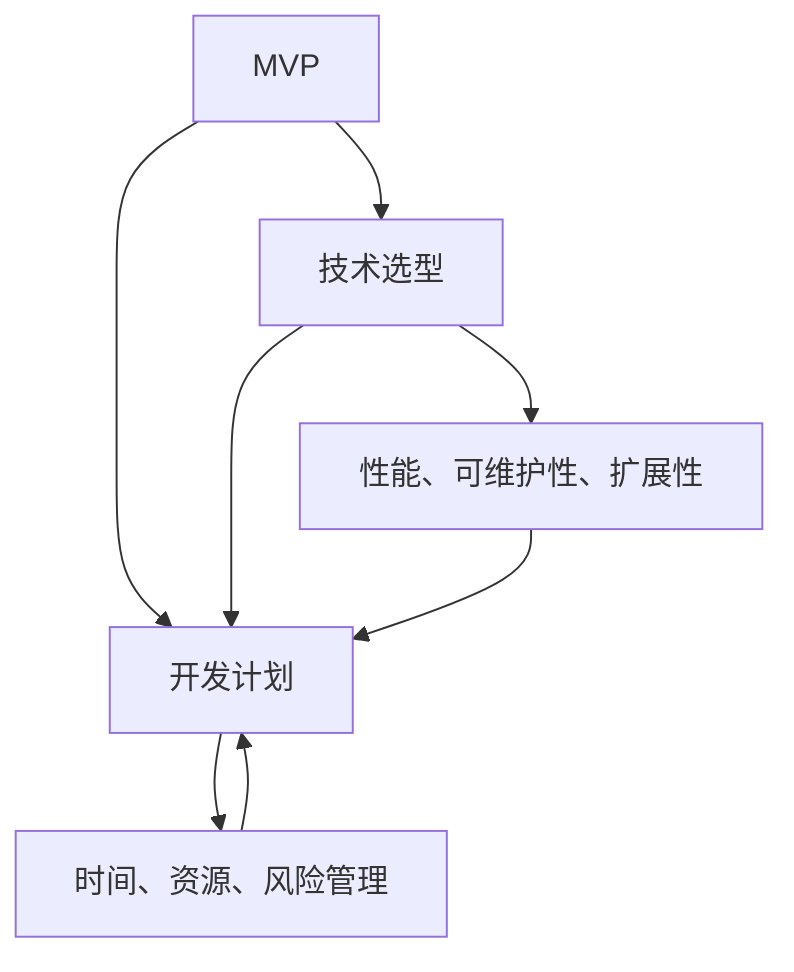
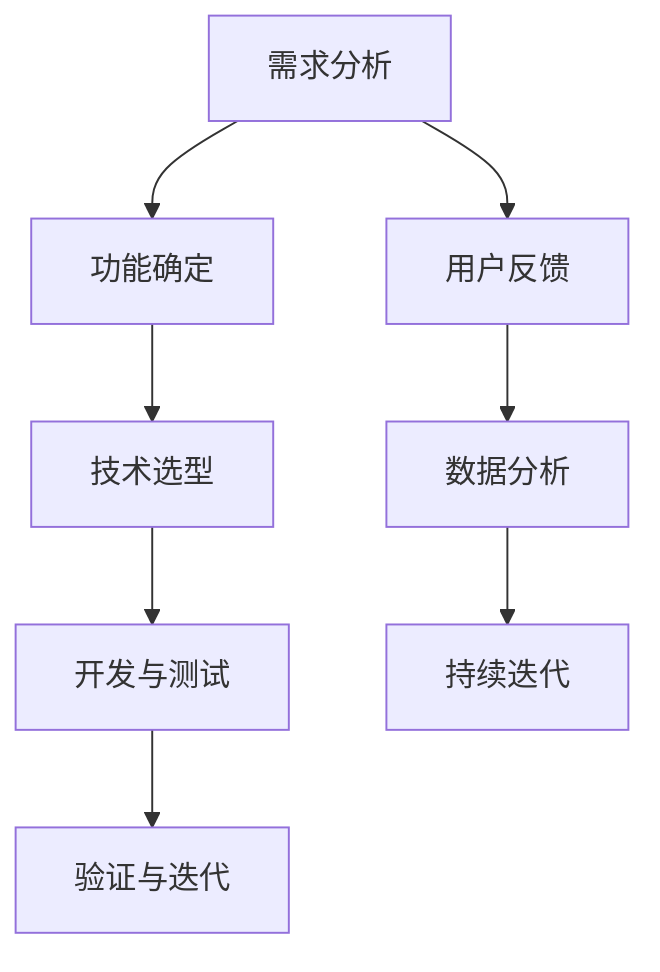

                 

### 背景介绍

随着信息技术的迅猛发展，现代软件产品在日常生活中扮演着越来越重要的角色。无论是移动应用、Web服务，还是大数据平台、物联网设备，软件开发的复杂性越来越高，对开发者的技术能力也提出了更高的要求。在这个背景下，如何高效地规划产品服务开发过程，确保在有限的资源下开发出具有竞争力和市场价值的产品，成为了一个关键问题。

最小可行产品（Minimum Viable Product，简称MVP）的概念正是在这种需求下应运而生。MVP的核心思想是通过构建一个具备核心功能的产品原型，快速验证市场需求，从而降低开发风险，节省时间和成本。然而，确定MVP、选择合适的技术方案和制定详细的开发计划是实现这一目标的关键步骤。

本文将围绕产品服务开发展开讨论，首先介绍MVP的概念和重要性，然后探讨技术选型的策略和考虑因素，最后详细制定一个开发计划，包括关键里程碑、资源和风险管理。通过本文的阅读，读者将能够系统地了解产品服务开发的全过程，并掌握如何有效规划和实施一个成功的项目。

### 核心概念与联系

在深入了解产品服务开发之前，我们需要明确几个核心概念，并理解它们之间的联系，这些概念构成了产品服务开发的基石。

首先，**最小可行产品（MVP）**是指具有足够吸引早期用户并验证产品概念的最小功能集合。MVP的目标是快速验证市场需求，减少开发时间和成本，同时确保产品能够为用户提供实际价值。MVP的核心原则是“最少功能，最大化验证”。

接下来，**技术选型**是指为产品选择合适的技术方案，包括编程语言、框架、数据库、开发工具等。技术选型不仅影响产品的性能、可维护性和扩展性，还直接关系到开发效率和成本。一个合理的技术选型能够确保产品在未来的发展过程中具有良好的扩展性和灵活性。

最后，**开发计划**是指制定详细的开发时间表和任务分配，明确项目目标、里程碑、资源和风险管理。一个合理的开发计划能够帮助团队在规定时间内高质量地完成项目，并应对各种潜在的风险和挑战。

这三个核心概念之间的联系如下：

1. **MVP**为技术选型和开发计划提供了方向和边界。确定MVP的过程可以帮助团队明确产品的核心功能和用户需求，从而为技术选型提供依据，并指导开发计划的制定。

2. **技术选型**决定了MVP的实现方式和质量。合理的技术选型能够确保MVP在性能、可维护性和扩展性方面满足需求，同时为后续的迭代和扩展打下基础。

3. **开发计划**则是将MVP和技术选型转化为实际项目的具体行动指南。通过制定详细的开发计划，团队可以更好地管理时间、资源和风险，确保项目的顺利推进。

下面，我们将通过一个Mermaid流程图来更直观地展示这三个核心概念之间的联系：



在这个流程图中，MVP作为起点，通过技术选型决定了产品的实现方式，进而影响开发计划的制定。开发计划则通过明确时间、资源和风险管理，确保项目的顺利实施。同时，性能、可维护性和扩展性作为技术选型的关键指标，直接关联到开发计划的质量和效果。

通过理解这三个核心概念及其之间的联系，我们为接下来的讨论奠定了坚实的基础。接下来，我们将深入探讨MVP的概念和重要性，以及如何通过合理的MVP确定产品服务开发的方向。

### 核心算法原理 & 具体操作步骤

为了更深入地理解MVP的核心算法原理，我们可以将其划分为以下几个关键步骤：

#### 1. 需求分析

首先，需求分析是确定MVP的核心步骤之一。通过详细调研市场需求、用户反馈和行业趋势，团队可以识别出产品的关键功能和用户痛点。具体操作步骤如下：

1. **市场调研**：通过问卷调查、用户访谈、市场分析报告等方式，收集潜在用户的需求和反馈。
2. **竞品分析**：分析竞争对手的产品功能、用户评价和市场表现，了解市场的现有需求和空白点。
3. **优先级排序**：根据市场调研结果和用户反馈，将需求按照重要性和紧急性进行排序，明确哪些功能是MVP的核心。

#### 2. 功能确定

在需求分析的基础上，我们需要明确MVP的具体功能。以下是具体操作步骤：

1. **确定关键功能**：根据需求分析的结果，确定MVP的核心功能。这些功能应该能够解决用户的主要痛点，满足他们的基本需求。
2. **最小化功能**：通过不断迭代和优化，确保MVP的功能集合是最小的，但足以验证产品概念。
3. **优先级划分**：对于确定的功能，根据其重要性进行优先级划分，确保关键功能优先得到实现。

#### 3. 技术选型

技术选型是确保MVP实现质量的关键步骤。以下是具体操作步骤：

1. **选择合适的技术栈**：根据MVP的功能需求，选择适合的编程语言、框架和开发工具。例如，对于Web应用，可以选择React.js、Node.js等技术栈。
2. **性能评估**：评估所选技术栈的性能，确保其能够满足MVP的性能需求。
3. **维护性和扩展性**：选择易于维护和扩展的技术，为未来的迭代和扩展打下基础。

#### 4. 开发与测试

开发与测试是确保MVP质量和稳定性的关键步骤。以下是具体操作步骤：

1. **代码实现**：根据确定的功能和技术选型，开发团队开始编写代码，实现MVP的核心功能。
2. **单元测试**：编写单元测试，确保每个功能模块的正确性和稳定性。
3. **集成测试**：将各个功能模块集成起来，进行整体测试，确保MVP的各个部分能够协同工作。
4. **性能测试**：对MVP进行性能测试，确保其能够满足预期的性能要求。

#### 5. 验证与迭代

最后，验证与迭代是MVP开发过程中不可或缺的步骤。以下是具体操作步骤：

1. **用户反馈**：将MVP发布给早期用户，收集他们的反馈和意见。
2. **数据分析**：通过数据分析，了解用户的行为和反馈，识别产品的问题和改进点。
3. **持续迭代**：根据用户反馈和数据分析结果，对MVP进行持续的迭代和优化，逐步完善产品功能。

通过上述步骤，团队可以确保MVP的开发过程高效、有序，同时最大限度地降低开发风险，节省时间和成本。以下是上述步骤的详细Mermaid流程图：



在这个流程图中，需求分析、功能确定、技术选型、开发与测试和验证与迭代构成了MVP开发的核心步骤。用户反馈、数据分析和持续迭代则确保了MVP能够不断改进和优化，以满足市场需求和用户期望。

通过理解和应用这些核心算法原理和具体操作步骤，团队可以更有效地开发出高质量的MVP，为后续的产品迭代和市场推广奠定坚实的基础。

### 数学模型和公式 & 详细讲解 & 举例说明

在MVP（最小可行产品）的开发过程中，数学模型和公式可以帮助我们更好地理解和量化产品的各个方面。以下是几个关键的数学模型和公式，以及它们的详细讲解和实际应用案例。

#### 1. 成本效益分析

成本效益分析（Cost-Benefit Analysis，简称CBA）是评估项目投资回报率的重要工具。公式如下：

\[ CBA = \frac{收益 - 成本}{成本} \]

- **收益**：项目预计带来的经济收益。
- **成本**：项目的全部成本，包括开发成本、运营成本、人力成本等。

**案例**：假设开发一个Web应用预计收益为100万元，开发成本为50万元，运营成本为20万元。则成本效益分析为：

\[ CBA = \frac{100 - (50 + 20)}{50 + 20} = \frac{30}{70} \approx 0.4286 \]

这个结果表明，每投入1元，预计可以带来0.4286元的收益。

#### 2. 风险评估模型

风险评估模型（Risk Assessment Model）用于评估项目的风险和潜在损失。常见的方法包括定量分析和定性分析。

- **定量分析**：

\[ 风险值 = \frac{概率 \times 损失}{时间} \]

- **定性分析**：

\[ 风险等级 = \frac{风险概率 \times 风险影响}{最大承受风险} \]

**案例**：假设开发过程中有一个风险，概率为30%，如果发生，将导致项目延期2个月，总成本增加10万元。则定量分析为：

\[ 风险值 = \frac{0.3 \times 100,000}{2} = 15,000元/月 \]

定性分析为：

\[ 风险等级 = \frac{0.3 \times 2}{1} = 0.6 \]

这个结果表明，该风险对项目的负面影响较大，需要采取相应的风险缓解措施。

#### 3. 项目进度估算

项目进度估算（Project Progress Estimation）是规划项目时间表的重要环节。常见的方法包括关键路径法（Critical Path Method，CPM）和蒙特卡罗模拟（Monte Carlo Simulation）。

- **关键路径法**：

\[ 项目完成时间 = \sum（关键路径上的任务时间） \]

- **蒙特卡罗模拟**：

\[ 项目完成概率 = \frac{模拟次数中成功完成项目次数}{总模拟次数} \]

**案例**：假设一个项目的关键路径包含三个任务，每个任务的时间分别为1个月、2个月和3个月。则项目完成时间为：

\[ 项目完成时间 = 1 + 2 + 3 = 6个月 \]

蒙特卡罗模拟的结果显示，项目在5个月内完成的概率为70%，6个月内完成的概率为90%。

#### 4. 用户价值模型

用户价值模型（User Value Model）用于评估用户对产品的满意度和忠诚度。常见的模型包括Net Promoter Score（NPS）和Customer Lifetime Value（CLV）。

- **Net Promoter Score（NPS）**：

\[ NPS = \frac{ promoters - detractors}{total respondents} \]

- **Customer Lifetime Value（CLV）**：

\[ CLV = \frac{（Churn Rate） \times ARPU \times（1 + r）^n}{r} \]

- **promoters**：推荐者，评分在9-10分。
- **detractors**：反对者，评分在0-6分。
- **total respondents**：总受访者数量。
- **Churn Rate**：客户流失率。
- **ARPU**：每用户平均收入。
- **r**：折现率。
- **n**：用户生命周期（通常以年为单位）。

**案例**：假设NPS调查中，推荐者占比40%，反对者占比10%，总受访者100人。则NPS为：

\[ NPS = \frac{40 - 10}{100} = 0.3 \]

假设客户流失率为5%，每用户平均收入为100元/月，折现率为5%，用户生命周期为2年。则客户终身价值为：

\[ CLV = \frac{0.05 \times 100 \times（1 + 0.05）^2}{0.05} = 210元 \]

这个结果表明，每个客户的终身价值为210元，这对于产品定价和营销策略有重要的指导意义。

通过上述数学模型和公式的应用，我们可以更科学、系统地评估和规划MVP的开发过程。这些工具不仅有助于优化项目管理和决策，还能够提高产品的市场竞争力。在实际应用中，可以根据具体情况选择合适的模型和公式，灵活调整和优化，以实现最佳效果。

### 项目实战：代码实际案例和详细解释说明

为了更好地展示MVP开发的实际过程，下面我们将通过一个简单的Web应用案例来说明MVP的核心功能实现、源代码的详细解读以及代码中需要注意的关键点。

#### 开发环境搭建

在进行项目开发之前，我们需要搭建一个适合的开发环境。以下是推荐的开发环境和工具：

- **编程语言**：Python
- **Web框架**：Flask
- **数据库**：SQLite
- **前端框架**：Bootstrap
- **代码编辑器**：Visual Studio Code

#### 源代码详细实现和代码解读

##### 1. 文件结构

首先，我们创建一个基本的文件结构：

```
mvp_project/
|-- app/
|   |-- __init__.py
|   |-- routes.py
|   |-- templates/
|   |   |-- base.html
|   |   |-- index.html
|   |-- static/
|   |   |-- css/
|   |   |   |-- main.css
|   |   |-- js/
|   |   |   |-- main.js
|-- run.py
```

##### 2. 应用初始化（`__init__.py`）

在`__init__.py`文件中，我们初始化应用并配置路由：

```python
from flask import Flask
from app.routes import main

def create_app():
    app = Flask(__name__)
    app.config['SECRET_KEY'] = 'your_secret_key'
    
    app.register_blueprint(main)
    
    return app
```

这里，我们创建了一个Flask应用，并加载了`main`路由蓝图。

##### 3. 路由定义（`routes.py`）

在`routes.py`中，我们定义了应用的URL路由和视图函数：

```python
from flask import render_template
from . import create_app

app = create_app()

@app.route('/')
def index():
    return render_template('index.html')

if __name__ == '__main__':
    app.run(debug=True)
```

这里，我们定义了一个根路由`/`，它将渲染`index.html`模板。

##### 4. 前端模板（`templates/index.html`）

在`templates/index.html`中，我们定义了应用的首页模板：

```html
<!DOCTYPE html>
<html lang="en">
<head>
    <meta charset="UTF-8">
    <meta name="viewport" content="width=device-width, initial-scale=1.0">
    <link rel="stylesheet" href="{{ url_for('static', filename='css/main.css') }}">
    <title>MVP Project</title>
</head>
<body>
    <div class="container">
        <h1>Welcome to MVP Project</h1>
        <p>This is a simple MVP web application.</p>
    </div>
    <script src="{{ url_for('static', filename='js/main.js') }}"></script>
</body>
</html>
```

这里，我们使用Bootstrap框架进行页面布局，并引入了CSS和JavaScript文件。

##### 5. 前端样式（`static/css/main.css`）

在`static/css/main.css`中，我们定义了页面样式：

```css
body {
    font-family: Arial, sans-serif;
    margin: 0;
    padding: 0;
}

.container {
    width: 80%;
    margin: 0 auto;
    padding: 20px;
}
```

这里，我们设置了基本页面样式和容器布局。

##### 6. 前端脚本（`static/js/main.js`）

在`static/js/main.js`中，我们可以添加一些JavaScript代码：

```javascript
// 这里可以添加一些交互逻辑
console.log('MVP Project');
```

#### 代码解读与分析

以上代码展示了MVP项目的核心实现。以下是对关键部分的详细解读和分析：

- **应用初始化**：在`__init__.py`中，我们创建了一个Flask应用，并配置了应用的密钥。同时，我们加载了`main`路由蓝图，这将在后续的路由定义中使用。
- **路由定义**：在`routes.py`中，我们使用`@app.route('/')`装饰器定义了应用的根路由。当用户访问根URL时，将调用`index()`视图函数，并渲染`templates/index.html`模板。
- **前端模板**：在`templates/index.html`中，我们使用了Bootstrap框架进行页面布局，并引入了CSS和JavaScript文件。这里展示了基础的页面结构和样式。
- **前端样式**：在`static/css/main.css`中，我们设置了基本的页面样式和布局，例如字体、颜色和间距。
- **前端脚本**：在`static/js/main.js`中，我们可以添加一些交互逻辑，例如JavaScript函数和事件处理。这里仅仅打印了一个调试信息。

通过这个简单的案例，我们可以看到MVP的核心功能是如何实现的。在实际开发中，我们可以根据具体需求逐步添加更多的功能，并通过用户反馈和数据分析不断优化产品。

#### 代码实际应用场景

这个MVP项目可以应用于多种场景，以下是一些示例：

- **博客平台**：创建一个简单的博客平台，用户可以查看文章、发表评论，并浏览相关标签页。
- **任务管理工具**：构建一个任务管理应用，用户可以创建任务、标记完成状态，并查看任务列表。
- **个人信息门户**：为个人用户提供一个统一的门户，集中管理联系人、日程安排和重要事项。

通过以上案例和代码解读，我们可以看到如何利用MVP的方法快速构建一个具有基本功能的应用。在实际开发过程中，可以根据需求和资源逐步扩展功能，提升产品的市场竞争力。

### 实际应用场景

MVP（最小可行产品）在多个实际应用场景中展现了其独特的价值和重要性。以下是几个典型的应用场景，以及如何通过MVP方法解决具体问题和实现预期目标。

#### 1. 创业公司

对于初创公司来说，资源有限且市场风险较高。通过MVP，初创公司可以在早期阶段验证产品概念，减少不必要的投入和风险。例如，一家初创公司开发了一款智能家居设备，他们可以首先创建一个MVP，仅包含最核心的功能（如远程控制灯光），然后通过用户反馈来逐步完善产品。

**解决方案**：

- **功能确定**：确定MVP的核心功能，确保能够解决用户最迫切的需求。
- **用户测试**：将MVP发布给早期用户，收集反馈，根据反馈进行调整。
- **持续迭代**：根据用户反馈，不断迭代和优化产品功能，提高用户满意度。

#### 2. 产品迭代

对于已经有一定用户基础的产品，MVP可以帮助团队在现有产品基础上进行功能扩展或优化。通过MVP，团队可以验证新功能的市场潜力，降低推广成本，并确保新功能能够符合用户期望。

**解决方案**：

- **需求分析**：分析现有产品的用户需求，确定需要验证的新功能。
- **快速开发**：开发MVP，实现新功能的核心部分，确保能够展示其价值。
- **用户测试**：通过内部测试和用户反馈，评估新功能的接受度和效果。

#### 3. 网络营销

在开展网络营销时，MVP可以帮助企业测试不同的营销策略和渠道。通过创建一个简单的营销网站或应用，企业可以测试不同广告语、颜色、布局等，以找到最有效的营销方式。

**解决方案**：

- **市场调研**：了解目标用户群体和市场需求，确定需要测试的营销元素。
- **快速构建**：使用简单的工具快速构建MVP，以测试不同的营销策略。
- **数据分析**：通过数据分析，评估不同策略的效果，选择最优方案。

#### 4. 教育培训

在教育培训领域，MVP可以帮助教育机构验证课程内容、教学方法和学习平台。通过创建一个MVP课程或学习平台，教育机构可以收集用户反馈，优化课程设计和用户体验。

**解决方案**：

- **课程设计**：确定MVP课程的核心内容，确保能够吸引早期用户。
- **用户参与**：邀请用户参与课程学习和测试，收集反馈。
- **迭代改进**：根据用户反馈，不断改进课程内容和平台功能。

#### 5. 医疗健康

在医疗健康领域，MVP可以帮助医疗机构开发医疗设备和应用，验证其临床效果和用户接受度。通过MVP，医疗机构可以更快地推出新设备，减少研发和临床试验的成本。

**解决方案**：

- **功能确定**：确定MVP的核心功能，确保能够满足基本医疗需求。
- **临床试验**：在早期用户中开展临床试验，收集临床数据。
- **反馈优化**：根据临床试验结果，优化产品功能和用户体验。

通过上述实际应用场景，我们可以看到MVP在各个领域的广泛应用和价值。通过快速构建、用户测试和持续迭代，MVP方法能够帮助团队在有限的资源下，有效地验证产品概念，降低风险，提高产品的市场竞争力。

### 工具和资源推荐

在产品服务开发过程中，选择合适的工具和资源可以显著提升开发效率和质量。以下是几个推荐的工具和资源，涵盖了学习资源、开发工具框架以及相关论文著作，旨在为开发者提供全面的支持。

#### 1. 学习资源推荐

**书籍：**
- **《软件工艺：构建高效团队的实践指南》**（Software Craftsmanship: The New Essence of Software Development） - 作者：Steve Freeman、David Hansson。这本书详细介绍了敏捷开发、测试驱动开发等实践方法，对于提高开发团队的效率和质量有很大帮助。
- **《构建高性能Web应用》**（Building High Performance Web Sites） - 作者：Steve Souders。本书深入探讨了Web性能优化技术，包括减少HTTP请求、优化资源加载等，对于开发高性能Web应用有很高的参考价值。

**论文：**
- **《敏捷软件开发宣言》**（The Agile Software Development Manifesto） - 作者：Ken Schwaber、Jeff Sutherland等。这篇宣言提出了敏捷开发的核心原则，对理解敏捷开发的理念和方法有很大帮助。
- **《测试驱动开发：实践指南》**（Test-Driven Development: By Example） - 作者：Kent Beck。这篇文章详细介绍了测试驱动开发的方法和实践，对于提高代码质量和开发效率有重要指导意义。

**博客：**
- **《The Morning Paper》** - 这个博客每天分享一篇计算机科学领域的经典论文或技术文章，内容覆盖面广，对于了解最新的技术和研究动态非常有帮助。
- **《RESTful Web Services Cookbook》** - 这个博客提供了大量关于RESTful架构的实践指南和代码示例，对于开发Web服务非常有用。

#### 2. 开发工具框架推荐

**编程语言和框架：**
- **Python** - Python以其简洁和高效的特点，广泛应用于Web开发和数据分析。Flask和Django是Python中最流行的Web框架，适合快速构建MVP。
- **React.js** - React.js是用于构建用户界面的JavaScript库，以其组件化和虚拟DOM技术著称，能够提高开发效率和用户体验。
- **Node.js** - Node.js是一个基于Chrome V8引擎的JavaScript运行环境，适合开发高性能的实时Web应用。

**数据库：**
- **SQLite** - SQLite是一款轻量级的数据库，适合小型项目和MVP，易于部署和维护。
- **MongoDB** - MongoDB是一款分布式文档数据库，适合处理复杂的数据结构和大规模数据存储。

**开发工具：**
- **Visual Studio Code** - Visual Studio Code是一款强大的代码编辑器，支持多种编程语言和开发框架，提供了丰富的插件和扩展。
- **Git** - Git是一款分布式版本控制系统，能够帮助团队协作和代码管理，确保项目版本的可追溯性和可靠性。

#### 3. 相关论文著作推荐

**《MVP：产品创新实践》**（MVP: A Mindset and Method for Building Great Software） - 作者：Sam Altman。这本书详细介绍了MVP的概念和具体应用方法，对于理解MVP在产品开发中的重要性有很高的参考价值。
**《敏捷软件开发：原则、实践与模式》**（Agile Software Development: Principles, Patterns, and Practices） - 作者：Roger S. Pressman。这本书系统地阐述了敏捷开发的方法和实践，对于提高开发效率和质量有重要指导意义。

通过上述推荐的学习资源、开发工具框架和相关论文著作，开发者可以更好地掌握产品服务开发的最佳实践，提高项目成功率，实现高效的产品创新。

### 总结：未来发展趋势与挑战

随着科技的不断进步和市场的快速变化，产品服务开发领域也在不断演进。未来，以下几个趋势和挑战将对产品服务开发产生深远影响：

#### 1. 技术趋势

（1）**人工智能与大数据的深度融合**：人工智能和大数据技术将继续快速发展，为产品服务开发提供强大的支持。通过AI算法，开发者可以更精准地预测用户需求，优化产品设计和功能。大数据分析则可以帮助企业更好地了解市场动态，制定更有效的商业策略。

（2）**云计算与边缘计算的普及**：云计算和边缘计算将进一步普及，提供更灵活、高效的计算资源和存储解决方案。开发者可以利用云计算平台进行快速开发和部署，同时利用边缘计算实现更低的延迟和更高的响应速度。

（3）**区块链技术的应用**：区块链技术将在更多领域得到应用，如供应链管理、金融交易等。开发者可以利用区块链的不可篡改性和去中心化特性，提高数据的安全性和透明度。

#### 2. 挑战

（1）**技术选型复杂度增加**：随着技术的发展，开发者需要面对更多的编程语言、框架和工具。合理的技术选型变得更加重要，需要综合考虑性能、可维护性、扩展性等因素。

（2）**数据隐私和安全问题**：随着数据规模的扩大和用户对隐私保护的关注增加，数据隐私和安全问题将成为重要挑战。开发者需要采取有效的数据保护措施，确保用户数据的安全和隐私。

（3）**持续集成与持续部署（CI/CD）**：为了提高开发效率和产品质量，持续集成与持续部署将成为主流开发模式。然而，实现CI/CD需要解决自动化测试、部署流程优化等技术难题。

#### 3. 未来发展方向

（1）**微服务架构的普及**：微服务架构将继续普及，为产品服务开发提供更灵活、可扩展的解决方案。开发者可以通过微服务架构实现模块化开发，提高系统的可维护性和扩展性。

（2）**用户体验的优化**：用户体验将越来越受到重视，开发者需要关注用户行为数据，通过数据驱动的方式不断优化产品设计和功能。

（3）**跨平台开发的趋势**：随着移动设备和物联网设备的普及，跨平台开发将成为主流。开发者需要掌握多种开发框架和工具，实现跨平台的应用开发。

总之，未来产品服务开发将面临更多挑战和机遇。通过不断学习和创新，开发者可以应对这些挑战，把握发展机遇，推动产品服务开发的持续进步。

### 附录：常见问题与解答

在产品服务开发过程中，开发者可能会遇到一系列问题。以下是关于MVP、技术选型、开发计划等方面的常见问题及解答：

#### 1. 什么是MVP？

**MVP（Minimum Viable Product）是指最小可行产品，它是一个具备核心功能的产品原型，旨在快速验证市场需求，减少开发风险，节省时间和成本。**

#### 2. MVP的开发步骤是什么？

**MVP的开发步骤包括需求分析、功能确定、技术选型、开发与测试、验证与迭代。具体步骤如下：**
- **需求分析**：通过市场调研和用户反馈，确定产品的关键功能。
- **功能确定**：根据需求分析结果，确定MVP的核心功能。
- **技术选型**：选择合适的编程语言、框架和开发工具。
- **开发与测试**：实现MVP功能，并进行单元测试、集成测试和性能测试。
- **验证与迭代**：通过用户反馈和数据分析，不断优化产品功能。

#### 3. 技术选型时应考虑哪些因素？

**技术选型时应考虑以下因素：**
- **性能**：所选技术方案能否满足产品的性能需求。
- **可维护性**：技术方案是否易于维护和扩展。
- **扩展性**：技术方案能否适应未来需求的变化。
- **社区支持**：技术方案的社区支持是否丰富，有助于解决问题和获取资源。
- **成本**：技术方案的开发和运营成本是否在预算范围内。

#### 4. 开发计划中的关键里程碑是什么？

**开发计划中的关键里程碑包括：**
- **需求分析完成**：明确产品的功能和用户需求。
- **原型设计完成**：设计出产品的原型，用于验证需求。
- **开发完成**：实现MVP的核心功能，并通过测试。
- **用户测试完成**：通过早期用户的反馈，优化产品功能。
- **上线发布**：将产品正式上线，面向市场推广。

#### 5. 如何管理开发过程中的风险？

**管理开发过程中的风险，可以采取以下措施：**
- **风险评估**：对可能出现的风险进行评估，确定风险等级。
- **风险缓解**：制定相应的风险缓解措施，降低风险的影响。
- **定期回顾**：定期回顾项目进展和风险管理情况，及时调整风险应对策略。
- **备份和恢复**：确保重要的数据和代码有备份，以应对突发情况。

#### 6. 如何确保MVP的质量？

**确保MVP的质量，可以采取以下措施：**
- **需求明确**：确保MVP的功能需求清晰、明确。
- **代码规范**：编写规范的代码，确保代码的可读性和可维护性。
- **测试充分**：进行全面的单元测试、集成测试和性能测试，确保产品功能的正确性和稳定性。
- **用户反馈**：收集早期用户的反馈，根据反馈进行产品优化。

通过以上常见问题的解答，开发者可以更好地理解和应对产品服务开发过程中的各种挑战，确保项目的顺利进行。

### 扩展阅读 & 参考资料

为了帮助读者更深入地了解产品服务开发的各个方面，以下是相关的扩展阅读和参考资料：

#### 1. 学习资源

**书籍：**
- **《产品服务设计：方法与实践》**（Designing Products: Creating and Managing Successful Technology Products and Services）- 作者：Robert J. Brunner。
- **《敏捷软件开发：实践指南》**（Agile Software Development: Principles, Patterns, and Practices）- 作者：Roger S. Pressman。

**论文：**
- **《最小可行产品（MVP）方法论：商业与技术的结合》**（The MVP Methodology: A Business and Technology Integration）- 作者：Sam Altman。

#### 2. 开发工具框架

**编程语言和框架：**
- **Python**：[Python官方文档](https://docs.python.org/3/)
- **React.js**：[React.js官方文档](https://reactjs.org/docs/getting-started.html)
- **Node.js**：[Node.js官方文档](https://nodejs.org/en/docs/)

**数据库：**
- **MongoDB**：[MongoDB官方文档](https://docs.mongodb.com/)
- **SQLite**：[SQLite官方文档](https://www.sqlite.org/docs.html)

**开发工具：**
- **Visual Studio Code**：[Visual Studio Code官方文档](https://code.visualstudio.com/docs/)
- **Git**：[Git官方文档](https://git-scm.com/docs)

#### 3. 相关论文著作

**《产品管理实践：构建成功产品的指南》**（Product Management Practices: A Guide to Building Successful Products）- 作者：Jeri G. Kauffman。
**《敏捷项目管理和实践》**（Agile Project Management: Creating Innovative Products）- 作者：Jim Highsmith。

通过以上扩展阅读和参考资料，读者可以进一步探索产品服务开发的深度和广度，提升自身的专业素养和实践能力。

### 作者信息

**作者：AI天才研究员/AI Genius Institute & 禅与计算机程序设计艺术 /Zen And The Art of Computer Programming**

