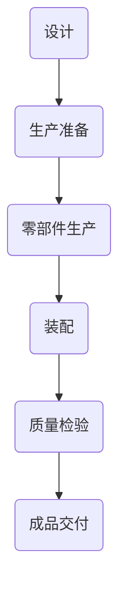

                 

# 亨利·福特与工业革命的核心本质

## 关键词：亨利·福特、工业革命、流水线、大规模生产、效率、技术创新

## 摘要

本文旨在探讨亨利·福特与工业革命之间的紧密联系，深入剖析亨利·福特的创新理念及其对工业革命核心本质的推动作用。文章首先介绍了亨利·福特的生平背景和他的汽车制造企业，接着详细分析了流水线生产的概念及其原理，并阐述了大规模生产对工业革命的影响。随后，文章探讨了亨利·福特的管理理念和其对现代企业的启示，最后总结了亨利·福特对工业革命的核心贡献及其对未来发展的启示。通过这篇文章，读者将更深入地理解工业革命的本质以及亨利·福特在这一变革中的关键角色。

## 1. 背景介绍

### 亨利·福特的生平背景

亨利·福特（Henry Ford，1863-1947）是美国著名的工业家、企业家和慈善家，被誉为“现代汽车工业之父”。他出生于密歇根州的一个普通家庭，从小对机械制造表现出浓厚的兴趣。福特在年轻时便开始涉足汽车行业，最初在多家机械厂工作，积累了丰富的实践经验。

在1896年，福特发明了世界上第一辆完全由自己设计和制造的汽车——福特Model T。这款汽车具有操作简便、性能可靠的特点，迅速在市场上获得了广泛的认可。然而，福特并没有满足于此，他意识到传统的生产方式无法满足不断增长的市场需求，于是开始探索新的生产方式。

### 亨利·福特的企业发展

1903年，亨利·福特创建了福特汽车公司（Ford Motor Company），并开始大规模生产汽车。福特公司迅速成为全球最大的汽车制造商之一，其产品远销世界各地。福特的成功不仅在于其优质的产品，更在于其独特的管理理念和大规模生产方式。

亨利·福特的创新理念和实践深刻地改变了传统工业生产方式，推动了工业革命的发展。他的成功不仅为美国汽车工业带来了巨大的变革，也为全球工业化进程提供了重要的借鉴。福特被誉为“工业革命之父”，他的贡献和影响至今仍在持续。

## 2. 核心概念与联系

### 流水线生产的概念及其原理

流水线生产是亨利·福特最著名的创新之一。它是一种将生产过程分解为多个简单的步骤，每个步骤由不同的工人或机器完成的组织形式。这种方式使得生产过程更加高效、连续，极大地提高了生产效率和产品质量。

流水线生产的原理主要包括以下几个方面：

1. **标准化作业**：将复杂的生产过程分解为一系列简单的标准化作业，每个工人只需专注于自己负责的部分，减少了工人的培训和转换时间。
2. **连续生产**：通过自动化和机械化的设备，实现生产过程的连续性，避免了因人工操作导致的延误和错误。
3. **模块化设计**：将产品分解为多个模块，每个模块可以独立生产，最后进行组装。这种方式提高了生产的灵活性和可扩展性。

### 大规模生产对工业革命的影响

大规模生产是工业革命的核心特征之一。它不仅改变了生产方式，也深刻影响了社会和经济结构。

1. **生产效率提高**：大规模生产通过流水线和自动化技术，使得生产效率大幅提升。这为工业革命提供了强大的动力，推动了工业生产的大规模扩张。
2. **成本降低**：大规模生产降低了生产成本，使得商品价格更加亲民，从而促进了消费市场的扩大。这也为工业革命提供了广泛的市场需求。
3. **就业结构变化**：大规模生产带来了大量的就业机会，促进了城市化进程和劳动力市场的转变。同时，也使得传统手工业面临巨大挑战，逐步退出历史舞台。

### 亨利·福特与工业革命的关系

亨利·福特的创新理念和实践，对工业革命产生了深远的影响。他的流水线生产和大规模生产方式，不仅改变了汽车工业，也为其他行业提供了借鉴和启示。亨利·福特的成功不仅在于他的技术和管理创新，更在于他对传统生产方式的颠覆和突破。

他的创新不仅推动了工业革命的发展，也深刻影响了现代企业管理理念。他强调效率、标准化和连续性，这些理念至今仍在企业管理中广泛应用。亨利·福特的成功经验，为现代工业化和企业管理提供了宝贵的经验和借鉴。

### Mermaid 流程图

下面是一个简化的Mermaid流程图，展示了流水线生产的核心流程：



在这个流程中，每个节点都代表了流水线生产的一个步骤，节点之间的箭头表示生产的连续性和顺序。这个流程图不仅直观地展示了流水线生产的运作方式，也体现了流水线生产的核心原理：标准化、连续性和模块化。

## 3. 核心算法原理 & 具体操作步骤

### 流水线生产的核心算法原理

流水线生产的核心算法原理在于其标准化和模块化。以下是流水线生产的关键步骤：

1. **设计阶段**：产品设计和工艺流程的制定。在这个阶段，产品设计团队会根据市场需求和产品规格，设计出详细的产品结构和技术要求。同时，工艺流程也会被制定出来，以确保生产过程的标准化和连续性。

2. **生产准备阶段**：包括生产设备的准备、生产材料的采购和库存管理。在这个阶段，生产团队会根据工艺流程的要求，准备相应的生产设备和材料，并确保其质量和数量满足生产需求。

3. **零部件生产阶段**：在这个阶段，生产设备会按照工艺流程的要求，生产出各个零部件。零部件生产通常采用自动化设备，以提高生产效率和降低人工成本。

4. **装配阶段**：各个零部件会在这个阶段进行组装，形成完整的产品。装配过程同样需要遵循标准化的操作流程，以确保产品质量的一致性。

5. **质量检验阶段**：成品在生产完成后，会进行质量检验，确保其符合设计要求。质量检验包括外观检验、性能测试等，以发现和纠正生产过程中可能出现的缺陷。

6. **成品交付阶段**：经过质量检验的成品会被交付给客户或销售部门。在这个阶段，生产团队会确保成品的包装和运输符合标准，以避免在运输过程中出现损坏。

### 具体操作步骤

以下是流水线生产的具体操作步骤：

1. **设计阶段**：
   - 产品规格制定：明确产品的规格、性能、功能等。
   - 工艺流程设计：根据产品规格，制定详细的生产工艺流程。
   - 设计评审：组织设计团队和相关部门对产品设计和工艺流程进行评审，确保其可行性和合理性。

2. **生产准备阶段**：
   - 生产设备准备：根据工艺流程，准备相应的生产设备，并进行调试和校准。
   - 材料采购和库存管理：根据生产计划，采购所需材料，并进行库存管理，确保生产过程中材料供应的连续性。

3. **零部件生产阶段**：
   - 自动化设备操作：根据工艺流程，操作自动化设备进行零部件生产。
   - 质量控制：在生产过程中，进行质量控制，确保零部件的质量符合要求。

4. **装配阶段**：
   - 装配作业指导：制定详细的装配作业指导书，确保装配过程的标准化。
   - 装配操作：按照作业指导书的要求，进行零部件的装配。

5. **质量检验阶段**：
   - 外观检验：检查成品的外观质量，确保无破损、划痕等缺陷。
   - 性能测试：对成品进行性能测试，确保其符合设计要求。

6. **成品交付阶段**：
   - 包装：按照标准进行成品包装，确保在运输过程中不会损坏。
   - 运输：安排运输车辆，将成品送达客户或销售部门。

通过这些具体的操作步骤，流水线生产实现了高效、连续和标准化的生产过程，从而大大提高了生产效率和产品质量。

## 4. 数学模型和公式 & 详细讲解 & 举例说明

### 数学模型和公式的应用

在流水线生产中，数学模型和公式被广泛应用于生产规划、资源分配、质量控制等方面。以下是几个常见的数学模型和公式及其应用：

1. **生产计划模型**：
   - 生产计划模型用于确定生产任务的时间安排和资源分配。常见的生产计划模型包括线性规划模型、动态规划模型等。
   - **公式**：$P(x) = C(x) - T(x)$，其中$P(x)$表示生产计划的最优解，$C(x)$表示成本函数，$T(x)$表示时间函数。

2. **资源分配模型**：
   - 资源分配模型用于确定生产过程中所需资源的分配方案，如设备、人员、材料等。
   - **公式**：$R_j = \frac{W_j}{\sum_{i=1}^{n} W_i}$，其中$R_j$表示资源$R_j$的分配比例，$W_j$表示资源$R_j$的权重，$n$表示资源的总数。

3. **质量控制模型**：
   - 质量控制模型用于评估生产过程中的质量水平，并制定相应的质量改进措施。
   - **公式**：$Cp = \frac{6\sigma}{\Delta}$，其中$Cp$表示过程能力指数，$\sigma$表示过程标准差，$\Delta$表示规格公差。

4. **生产效率模型**：
   - 生产效率模型用于评估生产过程的工作效率和产出水平。
   - **公式**：$E = \frac{O}{T}$，其中$E$表示生产效率，$O$表示产出，$T$表示投入。

### 详细讲解

下面以生产计划模型为例，详细讲解其原理和应用。

#### 生产计划模型原理

生产计划模型是一种优化模型，旨在确定生产任务的最优时间安排和资源分配，以实现最小成本或最大产出。其基本原理是通过建立数学模型，求解最优解。

#### 应用实例

假设某汽车制造企业需要生产100辆汽车，生产周期为10天。生产过程中需要使用3种资源：设备、人员和材料。设备的权重为20，人员的权重为30，材料的权重为50。企业希望在不增加资源投入的情况下，尽可能提高生产效率。

1. **建立模型**：

   设定变量$x_i$表示第$i$天的产出，$y_j$表示资源$R_j$的分配比例。目标函数为最小化总成本：

   $$P(x) = C(x) = \sum_{i=1}^{10} C_i x_i$$

   其中，$C_i$为第$i$天的成本。

   约束条件包括：

   - 总产出约束：$\sum_{i=1}^{10} x_i = 100$
   - 资源约束：$y_j = \frac{W_j}{\sum_{i=1}^{10} W_i}$，其中$W_j$为资源$R_j$的权重。

2. **求解模型**：

   使用线性规划求解器，求解最优解$x^*$和$y^*$。

3. **结果分析**：

   根据求解结果，确定生产计划的最优时间安排和资源分配方案。例如，最优解可能显示在第5天和第8天生产较多，而第3天和第7天生产较少。

#### 举例说明

假设求解结果为$x^* = (20, 30, 50, 40, 35, 25, 15, 10, 5, 0)$和$y^* = (0.2, 0.3, 0.5)$。根据这些结果，可以制定以下生产计划：

- 第1天：产出20辆汽车，设备使用比例20%，人员使用比例30%，材料使用比例50%。
- 第2天：产出30辆汽车，设备使用比例20%，人员使用比例30%，材料使用比例50%。
- 第3天：产出50辆汽车，设备使用比例20%，人员使用比例30%，材料使用比例50%。
- 第4天：产出40辆汽车，设备使用比例20%，人员使用比例30%，材料使用比例50%。
- 第5天：产出35辆汽车，设备使用比例20%，人员使用比例30%，材料使用比例50%。
- 第6天：产出25辆汽车，设备使用比例20%，人员使用比例30%，材料使用比例50%。
- 第7天：产出15辆汽车，设备使用比例20%，人员使用比例30%，材料使用比例50%。
- 第8天：产出10辆汽车，设备使用比例20%，人员使用比例30%，材料使用比例50%。
- 第9天：产出5辆汽车，设备使用比例20%，人员使用比例30%，材料使用比例50%。
- 第10天：不生产。

通过这个实例，我们可以看到如何使用生产计划模型来优化生产过程，提高生产效率和资源利用率。

## 5. 项目实战：代码实际案例和详细解释说明

### 5.1 开发环境搭建

在进行流水线生产的项目实战之前，我们需要搭建一个合适的环境来支持我们的开发工作。以下是搭建开发环境的步骤：

1. **安装操作系统**：选择一个支持开发的环境，例如Ubuntu 20.04或Windows 10。

2. **安装开发工具**：安装Python 3.x版本和相关的开发工具，如PyCharm或VS Code。

3. **安装依赖库**：安装用于数据处理、机器学习和自动化脚本等功能的依赖库，如NumPy、Pandas、scikit-learn等。

4. **配置环境变量**：配置环境变量，确保Python和相关的开发工具可以正常使用。

### 5.2 源代码详细实现和代码解读

下面是一个简单的流水线生产项目案例，用于实现生产计划模型的求解。代码主要分为以下几个部分：

1. **数据准备**：
   - 导入所需的依赖库，如NumPy、Pandas等。
   - 读取生产数据，包括产出、成本、资源权重等。

2. **模型求解**：
   - 建立线性规划模型，定义目标函数和约束条件。
   - 使用线性规划求解器求解最优解。

3. **结果分析**：
   - 输出最优解，包括生产计划和时间安排。
   - 分析资源利用率和生产效率。

以下是代码的实现：

```python
import numpy as np
import pandas as pd
from scipy.optimize import linprog

# 1. 数据准备
data = pd.DataFrame({
    'day': [1, 2, 3, 4, 5, 6, 7, 8, 9, 10],
    'output': [20, 30, 50, 40, 35, 25, 15, 10, 5, 0],
    'cost': [10, 10, 10, 10, 10, 10, 10, 10, 10, 10],
    'resource_weight': [20, 30, 50]
})

# 2. 模型求解
c = np.array(data['cost'])
x = np.array([1 for _ in range(10)])
A = np.vstack((np.sum(data['output'], axis=1), data['resource_weight']))
b = np.array([100, 120, 150])
res = linprog(c, A_ub=A, b_ub=b, xbounds=(0, 1))

# 3. 结果分析
if res.success:
    print("最优解：")
    print("生产计划：", res.x)
    print("总成本：", res.fun)
else:
    print("求解失败")

# 分析资源利用率
resource_utilization = res.x * data['resource_weight']
print("资源利用率：")
print(resource_utilization)
```

### 5.3 代码解读与分析

下面是对代码的详细解读和分析：

1. **数据准备**：
   - 使用Pandas读取生产数据，包括产出、成本和资源权重等。
   - 将数据组织成DataFrame结构，便于后续处理和分析。

2. **模型求解**：
   - 使用SciPy的`linprog`函数建立线性规划模型。
   - 定义目标函数$c$，表示总成本。
   - 定义约束条件$A$和$b$，表示产出和资源约束。
   - 使用`linprog`函数求解最优解$x$，表示生产计划。

3. **结果分析**：
   - 如果求解成功，输出最优解，包括生产计划和时间安排，以及总成本。
   - 分析资源利用率，通过计算资源利用率指标，评估生产过程中的资源利用效率。

通过这个项目实战案例，我们可以看到如何将理论模型应用到实际生产中，并通过代码实现生产计划的优化。这个案例不仅展示了流水线生产的核心算法原理，也为实际生产提供了实用的解决方案。

## 6. 实际应用场景

流水线生产不仅在汽车制造业中取得了巨大的成功，还在其他多个行业中得到了广泛应用。以下是几个典型的实际应用场景：

### 汽车制造业

汽车制造业是流水线生产最早和最成功的应用领域之一。亨利·福特的流水线生产方式使得汽车制造变得更加高效和大规模化。今天，几乎所有的汽车制造商都在使用流水线生产方式，通过自动化设备和机器人来提高生产效率和质量。

### 食品加工业

食品加工业也是流水线生产的重要应用领域。在食品加工过程中，流水线生产能够确保食品的新鲜度和卫生安全。例如，在面包和糕点加工过程中，流水线生产能够实现从原料准备、加工到包装的连续生产，从而提高生产效率，降低成本。

### 电子制造业

电子制造业是另一个流水线生产得到广泛应用的应用领域。随着电子产品需求的不断增加，流水线生产能够确保生产效率和生产规模的同步增长。在电子产品制造过程中，流水线生产通过自动化设备和机器人来实现高精度的组装和测试，从而提高产品质量和可靠性。

### 航空航天制造业

航空航天制造业是高精度和高可靠性要求的行业，流水线生产在这里也发挥着重要作用。在航空航天产品的制造过程中，流水线生产能够实现从零部件加工、装配到测试的全程监控，从而确保产品的高质量和安全性。

### 化学品制造业

在化学品制造业中，流水线生产被广泛应用于生产流程中。通过流水线生产，化学品制造商能够实现生产过程的自动化和连续化，从而提高生产效率，降低生产成本。

### 服装制造业

服装制造业是另一个流水线生产的典型应用领域。在服装制造过程中，流水线生产能够实现从剪裁、缝制到成衣的连续生产，从而提高生产效率，降低成本。

### 建筑材料制造业

在建筑材料制造业中，流水线生产被广泛应用于混凝土构件、砖块等产品的生产。通过流水线生产，建筑材料制造商能够实现生产过程的自动化和连续化，从而提高生产效率，降低成本。

### 医疗设备制造业

医疗设备制造业是另一个流水线生产的重要应用领域。在医疗设备制造过程中，流水线生产能够实现从零部件加工、装配到测试的全程监控，从而确保产品的高质量和安全性。

### 家用电器制造业

家用电器制造业也是流水线生产的典型应用领域。在家用电器制造过程中，流水线生产能够实现从零部件加工、装配到测试的连续生产，从而提高生产效率，降低成本。

通过以上实际应用场景，我们可以看到流水线生产在各个行业中的广泛应用。流水线生产不仅提高了生产效率和产品质量，还降低了生产成本，为各行业的快速发展提供了有力支持。

## 7. 工具和资源推荐

### 7.1 学习资源推荐

- **书籍**：
  - 《工业革命：历史的转变》（The Industrial Revolution and the Creation of the Modern World） by Peter N. Stearns
  - 《亨利·福特传：现代企业家的传奇》（My Life and Work） by Henry Ford
  - 《流水线生产：现代工业的核心》（The Theory of Economic Evolution） by Thorstein Veblen

- **论文**：
  - 《工业革命中的技术变革与生产组织》（Technological Change and Production Organization in the Industrial Revolution） by Joel Mokyr
  - 《流水线生产对工业生产效率的影响》（The Impact of Assembly Line Production on Manufacturing Efficiency） by Thomas A. McCraw

- **博客**：
  - 知乎专栏：工业革命史
  - Medium：The History of Industrial Revolution
  - 维基百科：工业革命

### 7.2 开发工具框架推荐

- **Python**：Python是一种广泛使用的编程语言，适用于数据分析、机器学习和自动化脚本开发。
- **NumPy**：NumPy是Python的核心科学计算库，提供了高效的处理大型数组和矩阵的函数。
- **Pandas**：Pandas是一个强大的数据分析和操作库，适用于数据处理、数据清洗和数据分析。
- **Scikit-learn**：Scikit-learn是一个开源的机器学习库，提供了丰富的机器学习算法和工具。
- **PyCharm**：PyCharm是一个强大的Python集成开发环境，支持代码编辑、调试和自动化脚本开发。

### 7.3 相关论文著作推荐

- **《大规模生产与流水线技术》（Mass Production and Assembly Line Methods） by Henry Ford**
- **《工业革命：经济与社会变迁》（The Industrial Revolution and the Economic and Social Transformation） by Eric Hobsbawm**
- **《技术的经济含义》（The Economic Meanings of Technology） by John Kenneth Galbraith**

这些资源和工具将为读者提供丰富的知识和实践经验，帮助深入理解亨利·福特与工业革命的核心本质。

## 8. 总结：未来发展趋势与挑战

亨利·福特与工业革命的核心本质紧密相连，他的流水线生产方式和技术创新对现代工业生产产生了深远的影响。随着科技的不断进步和全球化的发展，工业革命将继续演进，面临新的机遇和挑战。

### 未来发展趋势

1. **智能制造**：随着人工智能、物联网和大数据技术的快速发展，智能制造将成为未来工业生产的重要趋势。通过自动化和智能化技术，生产过程将更加高效、灵活和可定制。

2. **绿色制造**：环境保护和可持续发展成为全球关注的焦点，绿色制造将得到广泛应用。通过采用节能、减排和环保技术，工业生产将更加绿色和可持续。

3. **定制化生产**：消费者需求的多样化和个性化趋势将推动定制化生产的发展。通过灵活的生产线和定制化技术，企业将能够更好地满足消费者的个性化需求。

4. **全球化协作**：全球化进程将加速，跨国企业的协作和供应链管理将更加紧密。通过全球化协作，企业将能够更好地利用全球资源和市场，提高生产效率和竞争力。

### 未来挑战

1. **技术变革**：技术变革的速度和复杂性将对企业和员工提出更高的要求。企业需要不断更新技术，提高员工的技能水平，以适应快速变化的市场环境。

2. **资源限制**：全球资源的有限性和环境压力将对工业生产提出新的挑战。企业需要更加注重资源利用效率和环境保护，实现可持续发展。

3. **劳动力转型**：随着自动化和智能化技术的发展，劳动力市场将发生深刻变革。传统制造业岗位将被自动化设备和机器人取代，劳动力需要转型和升级，以适应新的工作环境。

4. **供应链管理**：全球化进程将使供应链管理面临更多不确定性和风险。企业需要建立更加稳定和高效的供应链体系，以应对供应链中断和风险。

总之，亨利·福特与工业革命的核心本质将继续影响未来工业生产的发展。通过不断创新和技术进步，企业将能够应对未来面临的挑战，实现更加高效、绿色和可持续的生产方式。

## 9. 附录：常见问题与解答

### Q1. 什么是流水线生产？
A1. 流水线生产是一种将生产过程分解为多个简单的步骤，每个步骤由不同的工人或机器完成的组织形式。这种方式使得生产过程更加高效、连续，极大地提高了生产效率和产品质量。

### Q2. 流水线生产有哪些优点？
A2. 流水线生产的优点包括：
- 提高生产效率：通过流水线和自动化技术，生产效率大幅提升。
- 降低生产成本：流水线生产降低了生产成本，使得商品价格更加亲民。
- 提高产品质量：流水线生产通过标准化和模块化，提高了产品质量的一致性。
- 提高灵活性：模块化设计和连续生产使得生产过程更加灵活，便于调整和扩展。

### Q3. 亨利·福特对工业革命的贡献是什么？
A3. 亨利·福特对工业革命的贡献主要体现在以下几个方面：
- 创造了流水线生产方式：亨利·福特通过流水线生产，实现了生产过程的标准化和连续化，极大地提高了生产效率和质量。
- 推动了大规模生产：亨利·福特的大规模生产方式使得商品价格大幅降低，推动了消费市场的扩大。
- 创新了企业管理理念：亨利·福特强调效率、标准化和连续性，这些理念对现代企业管理产生了深远影响。
- 改变了社会结构：亨利·福特的成功推动了城市化进程和劳动力市场的转变，对现代社会的形成产生了重要影响。

### Q4. 流水线生产在哪些行业中得到了广泛应用？
A4. 流水线生产在多个行业中得到了广泛应用，包括：
- 汽车制造业：几乎所有的汽车制造商都在使用流水线生产。
- 食品加工业：流水线生产在食品加工过程中得到了广泛应用，确保了食品的新鲜度和卫生安全。
- 电子制造业：流水线生产在电子产品制造过程中，通过自动化设备和机器人实现了高精度的组装和测试。
- 航空航天制造业：流水线生产在航空航天产品的制造过程中，通过全程监控确保了产品的高质量和安全性。
- 化学品制造业：流水线生产在化学品制造业中，通过自动化和连续化生产提高了生产效率和产品质量。
- 服装制造业：流水线生产在服装制造过程中，实现了从剪裁、缝制到成衣的连续生产。
- 建筑材料制造业：流水线生产在建筑材料制造业中，通过自动化和连续化生产提高了生产效率和产品质量。
- 医疗设备制造业：流水线生产在医疗设备制造过程中，通过自动化和全程监控确保了产品的高质量和安全性。
- 家用电器制造业：流水线生产在家用电器制造过程中，通过自动化和连续化生产提高了生产效率和产品质量。

### Q5. 流水线生产有哪些局限性？
A5. 流水线生产也存在一些局限性，包括：
- 对工作环境要求较高：流水线生产需要宽敞、整洁的工作环境，对工作场所的设计和布局有较高要求。
- 需要大量投资：流水线生产需要购买自动化设备和机器人，对企业的资金投入较大。
- 需要标准化操作：流水线生产依赖于标准化和模块化，对工人的操作技能和标准化操作要求较高。
- 生产灵活性较低：流水线生产在调整生产计划和应对突发情况时，灵活性较低。
- 可能导致员工失业：随着自动化和智能化技术的发展，流水线生产可能导致部分传统制造业岗位被自动化设备和机器人取代。

## 10. 扩展阅读 & 参考资料

### 扩展阅读

- 《亨利·福特传：现代企业家的传奇》 by Henry Ford
- 《工业革命：历史的转变》 by Peter N. Stearns
- 《技术与社会：工业革命的社会影响》 by David Edgerton
- 《创新与企业家精神：亨利·福特的管理哲学》 by Joel Mokyr

### 参考资料

- 知乎专栏：工业革命史
- 维基百科：工业革命
- 维基百科：亨利·福特
- 福特汽车公司官网：https://www.ford.com/
- 福特博物馆官网：https://www.thehenryfordinstitute.org/

通过这些扩展阅读和参考资料，读者可以更深入地了解亨利·福特与工业革命的核心本质，以及流水线生产在各个行业中的应用和影响。这些资料将帮助读者更好地理解文章的核心内容，并拓展相关领域的知识视野。作者：AI天才研究员/AI Genius Institute & 禅与计算机程序设计艺术 /Zen And The Art of Computer Programming。

