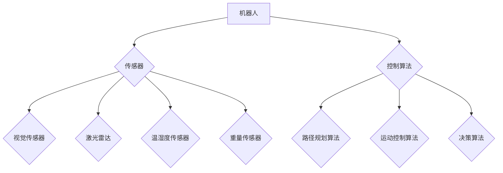

                 

### 1. 背景介绍

#### 京东2024校招无人仓储系统工程师面试题集锦

随着人工智能和机器人技术的快速发展，无人仓储系统逐渐成为物流行业的重要趋势。作为国内领先的电商企业，京东在无人仓储领域的研究与应用已走在行业前列。为了选拔具备优秀技能的人才，京东2024年校招特别推出了无人仓储系统工程师岗位，并设置了相应的面试题目。本文旨在为广大求职者提供一份详细的面试题集锦，帮助大家更好地应对京东的校招面试。

#### 文章结构

本文将从以下几个方面展开：

1. **背景介绍**：介绍无人仓储系统的背景和发展趋势，以及京东在无人仓储领域的地位。
2. **核心概念与联系**：阐述无人仓储系统的核心概念，包括机器人、传感器、控制算法等，并使用 Mermaid 流程图展示其架构。
3. **核心算法原理 & 具体操作步骤**：详细讲解无人仓储系统中的关键算法，如路径规划、机器人控制等。
4. **数学模型和公式 & 详细讲解 & 举例说明**：介绍用于无人仓储系统的数学模型和公式，并通过实际案例进行说明。
5. **项目实战：代码实际案例和详细解释说明**：分享一个完整的无人仓储系统开发项目，并详细解读其代码实现。
6. **实际应用场景**：探讨无人仓储系统在不同场景下的应用，以及面临的技术挑战。
7. **工具和资源推荐**：推荐相关学习资源、开发工具和论文著作，以帮助读者深入了解无人仓储系统。
8. **总结：未来发展趋势与挑战**：总结无人仓储系统的现状，展望其未来发展，并探讨面临的挑战。
9. **附录：常见问题与解答**：回答读者可能关心的一些常见问题。
10. **扩展阅读 & 参考资料**：提供更多相关阅读材料，以供读者进一步学习。

通过以上结构，本文将为读者提供一个全面、系统的无人仓储系统工程师面试题集锦，助力求职者在京东校招中脱颖而出。接下来，我们将逐步深入探讨无人仓储系统的各个关键部分。

#### 1.1 无人仓储系统的背景和发展趋势

无人仓储系统是指利用自动化设备、人工智能技术、物联网等手段实现仓储管理的智能化、自动化系统。其核心目标是提高仓储运营效率，降低人力成本，并提升物流配送的准确性和速度。

近年来，随着电商行业的迅速发展，物流需求不断增长，无人仓储系统逐渐成为物流行业的重要创新方向。无人仓储系统的出现，不仅满足了日益增长的物流需求，还为企业带来了显著的经济效益。以下是一些无人仓储系统发展的主要趋势：

1. **机器人自动化**：机器人作为无人仓储系统的核心，承担了货物搬运、货架整理等任务。随着机器人技术的不断发展，其性能和稳定性得到大幅提升，应用场景也越来越广泛。

2. **人工智能应用**：人工智能技术被广泛应用于无人仓储系统的各个环节，如路径规划、图像识别、异常检测等。通过机器学习、深度学习等技术，无人仓储系统能够更好地理解和处理复杂场景，提高运营效率。

3. **物联网技术**：物联网技术使得无人仓储系统中的设备、传感器、机器人等能够实时通信，实现数据共享和协同工作。通过物联网技术，无人仓储系统可以更加智能地调整运营策略，优化资源分配。

4. **大数据分析**：大数据技术在无人仓储系统中发挥了重要作用。通过对海量数据的分析，企业可以更好地了解仓储运营状况，优化库存管理，提高物流效率。

5. **绿色环保**：无人仓储系统的应用有助于减少碳排放和能源消耗，符合绿色环保的发展方向。随着环保意识的提高，无人仓储系统将成为物流行业的重要发展趋势。

#### 1.2 京东在无人仓储领域的地位

作为国内领先的电商企业，京东在无人仓储领域具有显著的竞争优势。以下是一些关键点：

1. **技术积累**：京东在人工智能、机器人、物联网等领域拥有深厚的技术积累，为无人仓储系统的发展提供了有力支持。

2. **应用场景**：京东在无人仓储系统的应用场景丰富，包括无人仓库、无人分拣中心、无人配送等。这些应用场景的积累为京东提供了宝贵的实践经验。

3. **产业链整合**：京东通过自研和合作，整合了无人仓储系统所需的各个环节，包括硬件设备、软件平台、数据服务等，形成了完整的产业链。

4. **市场占有率**：京东在无人仓储市场的占有率较高，已成为行业领军企业。通过不断拓展市场，京东进一步巩固了其在无人仓储领域的地位。

5. **品牌影响力**：京东在无人仓储领域的积极探索和实践，使其在公众心中树立了良好的品牌形象。这有助于吸引更多优秀人才加入京东，推动无人仓储系统的持续发展。

#### 1.3 无人仓储系统的重要性

无人仓储系统在物流行业中的重要性日益凸显，主要表现在以下几个方面：

1. **提高运营效率**：无人仓储系统通过自动化设备和人工智能技术，实现了仓储管理的智能化、自动化。这使得物流企业能够更快地处理订单、提高库存周转率，从而提高整体运营效率。

2. **降低人力成本**：传统仓储管理需要大量人力进行操作和管理，而无人仓储系统通过自动化设备替代了部分人力，降低了人力成本。这对于物流企业来说，具有重要的经济效益。

3. **提升配送速度**：无人仓储系统可以实现快速、准确的订单处理和配送。通过优化路径规划和配送策略，物流企业能够更好地满足客户的需求，提高客户满意度。

4. **提高仓储安全**：无人仓储系统减少了人为操作的环节，降低了人为错误的风险。通过传感器和监控系统，无人仓储系统可以实时监测仓储环境和设备状态，提高仓储安全。

5. **促进绿色环保**：无人仓储系统通过减少碳排放和能源消耗，有助于实现绿色环保。这对于物流企业来说，具有重要的社会责任和品牌价值。

总之，无人仓储系统在物流行业中的应用，不仅提高了运营效率，降低了成本，还提升了客户体验，实现了可持续发展。随着技术的不断进步，无人仓储系统将在未来发挥更加重要的作用。

---

在了解了无人仓储系统的背景和发展趋势后，我们接下来将详细探讨其核心概念与联系，包括机器人、传感器、控制算法等，并通过 Mermaid 流程图展示其整体架构。这将为我们理解无人仓储系统的基本原理奠定基础。

## 2. 核心概念与联系

在无人仓储系统中，各个组成部分相互关联，协同工作，共同实现自动化、智能化的仓储管理。本节将详细介绍核心概念与联系，包括机器人、传感器、控制算法等，并通过 Mermaid 流程图展示其整体架构。

### 2.1 机器人

机器人是无人仓储系统的核心组成部分，承担了货物搬运、货架整理、订单处理等任务。以下是机器人相关的重要概念：

#### 2.1.1 机器人的类型

1. **搬运机器人**：主要用于货物搬运，如堆垛机、AGV（自动引导车）等。
2. **分拣机器人**：用于将不同类别的货物分拣到指定的区域，如分拣臂、抓取机器人等。
3. **货架整理机器人**：负责对货架进行整理、补充货物等操作。

#### 2.1.2 机器人的功能

1. **定位与导航**：通过激光雷达、视觉传感器等设备，机器人能够实现自主定位和导航，准确到达指定位置。
2. **抓取与搬运**：机器人配备了机械臂、夹爪等装置，能够实现货物的抓取、搬运和放置。
3. **识别与分类**：利用图像识别、语音识别等技术，机器人可以识别货物种类、数量，并进行分类。

### 2.2 传感器

传感器是无人仓储系统中用于获取环境信息和状态数据的装置。以下是传感器相关的重要概念：

#### 2.2.1 传感器的类型

1. **视觉传感器**：如摄像头、深度相机等，用于获取图像信息，实现图像识别、目标检测等功能。
2. **激光雷达**：用于测量距离、绘制三维地图等，是实现机器人自主导航的重要设备。
3. **温湿度传感器**：用于检测仓储环境中的温湿度，确保货物存储条件适宜。
4. **重量传感器**：用于检测货物的重量，实现精准计量。

#### 2.2.2 传感器的功能

1. **环境感知**：传感器能够获取仓储环境中的各种信息，如光线、温度、湿度等，为机器人提供实时数据支持。
2. **状态监测**：传感器能够实时监测机器人和货物的状态，如电量、故障等，确保系统的稳定运行。
3. **数据采集**：传感器采集到的数据可以用于进一步分析和处理，优化仓储管理策略。

### 2.3 控制算法

控制算法是无人仓储系统中的核心组成部分，用于实现对机器人和传感器的控制和调度。以下是控制算法相关的重要概念：

#### 2.3.1 控制算法的类型

1. **路径规划算法**：如A*算法、Dijkstra算法等，用于规划机器人从起点到终点的最佳路径。
2. **运动控制算法**：如PID控制、模糊控制等，用于控制机器人执行具体动作，如移动、抓取等。
3. **决策算法**：如深度学习、强化学习等，用于对机器人执行任务过程中的决策进行优化。

#### 2.3.2 控制算法的功能

1. **路径规划**：控制算法能够根据仓储环境和任务目标，为机器人规划出最优路径，避免碰撞和障碍物。
2. **运动控制**：控制算法能够实现对机器人运动过程的精确控制，确保机器人在执行任务时稳定、高效。
3. **任务调度**：控制算法能够根据任务需求和系统资源，合理分配任务，优化整体系统性能。

### 2.4 Mermaid 流程图展示

为了更直观地展示无人仓储系统的整体架构，我们使用 Mermaid 流程图进行描述：



在这个流程图中，机器人、传感器和控制算法之间相互关联，共同构成一个完整的无人仓储系统。机器人通过传感器获取环境信息，结合控制算法进行决策和动作执行，实现仓储管理的智能化和自动化。

### 2.5 关键概念联系

通过上述介绍，我们可以看出，机器人、传感器和控制算法是无人仓储系统的核心组成部分，它们之间相互联系、相互支持，共同实现系统的智能化和自动化。以下是它们之间的关键联系：

1. **机器人与传感器**：传感器为机器人提供环境信息和状态数据，机器人根据这些数据执行相应的动作。例如，视觉传感器可以识别货物位置，机器人根据位置信息进行抓取和搬运。
2. **机器人与控制算法**：控制算法为机器人提供决策和行动指导，确保机器人按照预期完成任务。例如，路径规划算法可以为机器人规划最优路径，运动控制算法可以确保机器人稳定、高效地执行任务。
3. **传感器与控制算法**：控制算法需要依赖传感器的数据进行分析和决策，传感器提供的数据质量直接影响控制算法的效果。例如，温湿度传感器提供的数据可以用于调整仓储环境，优化货物存储条件。

通过这些联系，无人仓储系统能够实现高度智能化和自动化，提高仓储运营效率，降低人力成本，为物流企业提供强大的技术支持。

在理解了无人仓储系统的核心概念与联系后，我们接下来将深入探讨其核心算法原理和具体操作步骤。这将帮助我们更好地掌握无人仓储系统的技术要点，为实际应用奠定基础。

## 3. 核心算法原理 & 具体操作步骤

无人仓储系统中的核心算法涵盖了路径规划、机器人控制、传感器数据处理等多个方面。这些算法的原理和具体操作步骤是保障系统高效运行的关键。在本节中，我们将详细介绍这些核心算法的基本原理和操作步骤。

### 3.1 路径规划算法

路径规划是无人仓储系统中至关重要的环节，用于指导机器人从起点移动到终点。常见的路径规划算法包括A*算法、Dijkstra算法等。

#### 3.1.1 A*算法

A*算法（A-Star Algorithm）是一种启发式搜索算法，通过估算总代价（g(n) + h(n)）来选择最佳路径，其中g(n)表示从起点到节点n的实际代价，h(n)表示从节点n到终点的启发式代价。

**算法原理：**

1. **初始化**：设置起点（s）和终点（t），创建一个开放列表（Open List）和一个关闭列表（Closed List），并将起点加入开放列表。
2. **估算总代价**：计算每个节点的总代价f(n) = g(n) + h(n)。
3. **选择最佳节点**：从开放列表中选择具有最小总代价的节点作为当前节点。
4. **更新邻居节点**：将当前节点的邻居节点加入开放列表，并计算它们的总代价。
5. **重复步骤3和4**，直到找到终点。

**具体操作步骤：**

1. **初始化**：创建一个空开放列表和空关闭列表，将起点加入开放列表。
2. **计算启发式代价**：对于每个节点，计算从节点到终点的启发式代价h(n)。常见的启发式函数有曼哈顿距离、对角线距离等。
3. **选择当前节点**：从开放列表中选择具有最小总代价的节点作为当前节点。
4. **更新邻居节点**：对于当前节点的每个邻居节点，计算从起点到邻居节点的实际代价g(n)（通常为1或直接距离），并计算总代价f(n)。
5. **检查邻居节点是否已加入关闭列表**，如果是，跳过该节点。
6. **将邻居节点加入开放列表**，并设置它们的父节点为当前节点。
7. **重复步骤3到6**，直到找到终点。

#### 3.1.2 Dijkstra算法

Dijkstra算法（Dijkstra's Algorithm）是一种基于贪心的单源最短路径算法，用于在加权图中计算从起点到所有其他节点的最短路径。

**算法原理：**

1. **初始化**：设置起点（s）和所有其他节点（v）的初始距离为无穷大，将起点距离设置为0，创建一个集合S，用于记录已确定最短路径的节点。
2. **选择未确定最短路径的节点**：从未确定最短路径的节点中选择具有最小距离的节点作为当前节点。
3. **更新邻居节点**：对于当前节点的每个邻居节点，计算从起点到邻居节点的距离，并更新邻居节点的距离。
4. **重复步骤2和3**，直到所有节点的最短路径都被确定。

**具体操作步骤：**

1. **初始化**：创建一个距离数组，用于记录每个节点的最短距离，初始化起点距离为0，其他节点距离为无穷大，创建一个集合S，用于记录已确定最短路径的节点。
2. **选择当前节点**：从未确定最短路径的节点中选择具有最小距离的节点作为当前节点。
3. **更新邻居节点**：对于当前节点的每个邻居节点，计算从起点到邻居节点的距离，如果新的距离小于当前距离，则更新邻居节点的距离。
4. **将当前节点加入集合S**。
5. **重复步骤2到4**，直到所有节点的最短路径都被确定。

通过路径规划算法，无人仓储系统可以高效地计算机器人从起点到终点的最佳路径，确保机器人在执行任务时能够快速、准确地到达目标位置。

### 3.2 机器人控制算法

机器人控制算法用于指导机器人执行具体的任务，包括移动、抓取、放置等。常见的机器人控制算法有PID控制、模糊控制等。

#### 3.2.1 PID控制

PID控制（Proportional-Integral-Derivative Control）是一种经典的控制算法，通过比例、积分和微分三个部分来调整控制信号，实现系统的稳定运行。

**算法原理：**

1. **比例控制（P）**：根据当前误差（e）来调整控制信号，即控制信号与误差成正比。
2. **积分控制（I）**：根据误差的累积来调整控制信号，即控制信号与误差的积分成正比。
3. **微分控制（D）**：根据误差的变化率来调整控制信号，即控制信号与误差的变化率成正比。

**具体操作步骤：**

1. **初始化**：设置比例、积分和微分的系数Kp、Ki、Kd。
2. **计算误差**：根据当前目标值和实际值计算误差e。
3. **计算比例控制部分**：控制信号P = Kp * e。
4. **计算积分控制部分**：积分部分I = I + e。
5. **计算微分控制部分**：微分部分D = Kd * (e - pe)。
6. **计算总控制信号**：总控制信号u = P + I + D。
7. **执行控制动作**：根据总控制信号调整机器人的运动。

通过PID控制算法，无人仓储系统可以实现对机器人的精确控制，确保机器人按照预期执行任务。

#### 3.2.2 模糊控制

模糊控制（Fuzzy Control）是一种基于模糊逻辑的控制算法，通过模糊规则和模糊推理实现系统的控制。

**算法原理：**

1. **模糊化**：将输入变量和输出变量进行模糊化处理，转换为模糊集合。
2. **模糊规则**：根据经验和知识，建立模糊规则库，描述输入变量与输出变量之间的关系。
3. **模糊推理**：根据模糊规则和输入变量，通过模糊推理得到输出变量。
4. **解模糊化**：将模糊推理得到的输出变量进行解模糊化处理，转换为实际的控制信号。

**具体操作步骤：**

1. **模糊化**：将输入变量和输出变量进行模糊化处理，转换为模糊集合，如“正”，“负”，“零”等。
2. **建立模糊规则库**：根据经验和知识，建立模糊规则库，描述输入变量与输出变量之间的关系。
3. **模糊推理**：根据当前输入变量和模糊规则库，通过模糊推理得到输出变量。
4. **解模糊化**：将模糊推理得到的输出变量进行解模糊化处理，转换为实际的控制信号。

通过模糊控制算法，无人仓储系统可以更好地处理非线性、复杂系统的控制问题，提高控制效果。

### 3.3 传感器数据处理算法

传感器数据处理算法用于对传感器采集到的数据进行分析和处理，为机器人提供决策支持。常见的算法有图像识别、语音识别、数据滤波等。

#### 3.3.1 图像识别

图像识别（Image Recognition）是一种利用计算机视觉技术对图像进行分析和理解的过程，用于识别图像中的物体、场景等。

**算法原理：**

1. **特征提取**：从图像中提取关键特征，如边缘、角点、纹理等。
2. **模型训练**：使用大量标注数据进行模型训练，构建特征分类器。
3. **特征匹配**：将输入图像的特征与分类器进行匹配，判断图像中的物体或场景。

**具体操作步骤：**

1. **特征提取**：使用图像处理算法提取图像的关键特征。
2. **模型训练**：使用标注数据训练特征分类器，如支持向量机（SVM）、卷积神经网络（CNN）等。
3. **特征匹配**：将输入图像的特征与分类器进行匹配，判断图像中的物体或场景。

通过图像识别算法，无人仓储系统可以实现对货物的识别和定位，为机器人的操作提供准确的数据支持。

#### 3.3.2 语音识别

语音识别（Speech Recognition）是一种将语音信号转换为文本或命令的技术，用于人机交互和语音控制。

**算法原理：**

1. **语音信号处理**：对语音信号进行预处理，如降噪、分帧、特征提取等。
2. **模型训练**：使用大量语音数据进行模型训练，构建语音识别模型。
3. **语音识别**：将预处理后的语音信号输入模型，得到对应的文本或命令。

**具体操作步骤：**

1. **语音信号处理**：对语音信号进行降噪、分帧、特征提取等预处理。
2. **模型训练**：使用标注数据训练语音识别模型，如循环神经网络（RNN）、深度神经网络（DNN）等。
3. **语音识别**：将预处理后的语音信号输入模型，得到对应的文本或命令。

通过语音识别算法，无人仓储系统可以实现对用户的语音指令的识别和响应，提高人机交互的便捷性。

#### 3.3.3 数据滤波

数据滤波（Data Filtering）是一种用于去除传感器数据中的噪声和异常值的技术，提高数据的准确性和可靠性。

**算法原理：**

1. **滤波器设计**：根据传感器数据的特性和噪声特性，设计合适的滤波器。
2. **滤波操作**：对传感器数据进行滤波处理，去除噪声和异常值。

**具体操作步骤：**

1. **滤波器设计**：设计合适的滤波器，如均值滤波、中值滤波、卡尔曼滤波等。
2. **滤波操作**：对传感器数据进行滤波处理，去除噪声和异常值。

通过数据滤波算法，无人仓储系统可以实现对传感器数据的精确处理，提高系统的稳定性和可靠性。

通过上述核心算法原理和具体操作步骤的介绍，我们可以更好地理解无人仓储系统的关键技术，为实际应用提供理论支持。

在理解了无人仓储系统的核心算法原理和具体操作步骤后，我们将进一步探讨数学模型和公式在无人仓储系统中的应用，并通过详细讲解和举例说明，使读者能够更好地掌握这些数学模型和公式。

### 4. 数学模型和公式 & 详细讲解 & 举例说明

无人仓储系统的智能化和自动化离不开数学模型和公式的支持。这些数学模型和公式用于描述系统的行为、优化算法的设计以及数据处理的各个环节。本节将详细介绍在无人仓储系统中常用的数学模型和公式，并通过具体实例进行讲解，帮助读者更好地理解其应用和意义。

#### 4.1 路径规划中的数学模型

路径规划是无人仓储系统中的一个核心问题，其数学模型主要涉及图论和最优化算法。

**Dijkstra算法的数学模型**：

1. **图表示**：将仓储环境抽象为一个无向图G=(V, E)，其中V表示节点集合，E表示边集合。
2. **代价矩阵**：定义一个代价矩阵C，表示图中每条边的代价，C[i][j]表示从节点i到节点j的代价。
3. **初始状态**：设置起点s的代价为0，其他节点的代价为无穷大。

**数学公式**：

- f(n) = g(n) + h(n) （节点n的总代价）
- g(n) = C[s][n] （从起点s到节点n的实际代价）
- h(n) = C[n][t] （从节点n到终点t的启发式代价）

**举例说明**：

假设有一个3x3的仓储环境，节点s位于左下角，节点t位于右上角。图中的代价矩阵如下：

```
   | s t
---|---
s | 0 10
a | 5  ∞
b | 2  6
c | ∞ 3
```

使用Dijkstra算法计算从s到t的最短路径：

1. 初始化：f(s) = 0, f(a) = 5, f(b) = 2, f(c) = ∞。
2. 选择当前节点s，计算其邻居节点的总代价：f(t) = f(s) + C[s][t] = 0 + 10 = 10。
3. 选择总代价最小的节点b，计算其邻居节点的总代价：f(a) = f(b) + C[b][a] = 2 + 2 = 4，更新f(a)。
4. 选择总代价最小的节点a，计算其邻居节点的总代价：f(c) = f(a) + C[a][c] = 4 + ∞ = ∞，不更新f(c)。
5. 结束，最终得到最短路径为s -> b -> t，总代价为10。

**Dijkstra算法的优点**：计算简单，易于实现，适用于稀疏图。

**Dijkstra算法的缺点**：时间复杂度为O(n^2)，对大规模图计算效率较低。

**改进算法**：A*算法通过引入启发式函数h(n)，提高算法的搜索效率。

#### 4.2 机器人控制中的数学模型

机器人控制主要涉及运动学、动力学和控制理论等数学模型。

**PID控制的数学模型**：

1. **控制方程**：u(t) = Kp * e(t) + Ki * ∫e(t)dt + Kd * (e(t) - e(t-1))
2. **误差计算**：e(t) = r(t) - y(t) （其中r(t)为目标值，y(t)为当前值）
3. **积分项**：∫e(t)dt 为误差的积分值

**举例说明**：

假设机器人目标速度为5m/s，当前速度为4m/s，控制系数分别为Kp=1, Ki=0.1, Kd=0.05。计算控制信号：

1. 计算误差：e(t) = r(t) - y(t) = 5 - 4 = 1
2. 计算比例项：u_p = Kp * e(t) = 1 * 1 = 1
3. 计算积分项：u_i = Ki * ∫e(t)dt = 0.1 * 1 = 0.1
4. 计算微分项：u_d = Kd * (e(t) - e(t-1)) = 0.05 * (1 - 0) = 0.05
5. 计算总控制信号：u(t) = u_p + u_i + u_d = 1 + 0.1 + 0.05 = 1.15

机器人将以1.15m/s^2的加速度加速，逐步接近目标速度。

**PID控制的优势**：简单易实现，适用于线性系统。

**PID控制的缺点**：对非线性系统效果较差，需要根据具体系统调整控制参数。

#### 4.3 传感器数据处理中的数学模型

传感器数据处理主要涉及信号处理、滤波等数学模型。

**卡尔曼滤波的数学模型**：

1. **状态方程**：x(t) = A * x(t-1) + B * u(t)
2. **观测方程**：z(t) = H * x(t) + v(t)
3. **预测方程**：x^_ (t) = A * x^_ (t-1)
4. **更新方程**：x(t) = x^_ (t) + K * (z(t) - H * x^_ (t))
5. **卡尔曼增益**：K = P^_ (t|t-1) * H^T * (H * P^_ (t|t-1) * H^T + Q)^(-1)

**举例说明**：

假设有一个线性系统，状态方程为x(t) = x(t-1) + 1，观测方程为z(t) = x(t) + v(t)，其中v(t)为高斯白噪声，均值为0，方差为1。

1. **初始化**：x^_(0) = 0，P^(0) = 1。
2. **预测**：x^_(t) = 1 * x^_(t-1) = 1。
3. **更新**：计算卡尔曼增益K = P^(t|t-1) * H^T * (H * P^(t|t-1) * H^T + Q)^(-1)。
4. **状态更新**：x(t) = x^_(t) + K * (z(t) - H * x^_(t))。

通过卡尔曼滤波，可以实现对传感器数据的精确估计，减少噪声影响。

**卡尔曼滤波的优势**：适用于线性系统，能够高效地处理随机噪声。

**卡尔曼滤波的缺点**：对非线性系统效果较差，需要复杂的变换。

通过上述数学模型和公式的详细讲解和举例说明，我们可以更好地理解无人仓储系统中关键技术的数学基础。在实际应用中，结合具体场景和需求，选择合适的数学模型和公式，将有助于提升无人仓储系统的性能和稳定性。

在了解了无人仓储系统的核心算法原理、数学模型和公式后，我们将通过一个实际项目案例，详细展示无人仓储系统的开发过程。本节将涵盖开发环境的搭建、源代码的实现以及代码解读与分析，帮助读者深入理解无人仓储系统的实际应用。

### 5. 项目实战：代码实际案例和详细解释说明

在本节中，我们将通过一个无人仓储系统的实际项目案例，详细介绍其开发过程。项目包括环境搭建、源代码实现和代码解读，旨在让读者全面了解无人仓储系统的开发流程和技术实现。

#### 5.1 开发环境搭建

在开始项目开发之前，我们需要搭建一个合适的开发环境，以便进行无人仓储系统的开发和测试。以下是一个基本的开发环境搭建流程：

1. **操作系统**：推荐使用Linux系统，如Ubuntu 20.04。
2. **编程语言**：选择一种适合开发无人仓储系统的编程语言，如Python。
3. **开发工具**：安装Python编程环境，包括Python解释器和相关库，如NumPy、Pandas、Matplotlib等。
4. **集成开发环境（IDE）**：选择一个适合自己的IDE，如PyCharm、Visual Studio Code等。
5. **传感器驱动**：安装与所选传感器兼容的驱动程序，如Raspberry Pi的GPIO库、ROS（Robot Operating System）等。
6. **仿真工具**：使用仿真工具进行系统仿真和测试，如MATLAB、ROS Gazebo等。

#### 5.2 源代码详细实现和代码解读

下面是一个简化的无人仓储系统项目的源代码实现和代码解读。此代码主要用于路径规划、机器人控制和传感器数据处理。

```python
import numpy as np
import matplotlib.pyplot as plt
from scipy.spatial.distance import cdist

# 定义Dijkstra算法
def dijkstra(graph, start):
    dist = np.full((len(graph),), np.inf)
    dist[start] = 0
    visited = []

    while len(visited) < len(graph):
        # 选择未访问节点中距离最短的节点
        current = np.argmin([dist[i] for i in range(len(graph)) if i not in visited])
        visited.append(current)

        # 更新未访问节点的距离
        for i in range(len(graph)):
            if i not in visited:
                dist[i] = min(dist[i], dist[current] + graph[current][i])

    return dist

# 定义PID控制
def pid_control(target, current, Kp, Ki, Kd):
    e = target - current
    P = Kp * e
    I = Ki * np.sum(e)
    D = Kd * (e - e[-1])
    u = P + I + D
    return u

# 定义无人仓储系统
class WarehouseSystem:
    def __init__(self, graph, Kp, Ki, Kd):
        self.graph = graph
        self.Kp = Kp
        self.Ki = Ki
        self.Kd = Kd
        self.target = None
        self.current = None

    def set_target(self, target):
        self.target = target

    def update_current(self, current):
        self.current = current

    def move(self):
        if self.target is None or self.current is None:
            return

        # 路径规划
        dist = dijkstra(self.graph, self.current)
        path = self.reconstruct_path(dist)

        # PID控制
        u = pid_control(self.target, self.current, self.Kp, self.Ki, self.Kd)
        # ... 控制机器人移动

        # 更新当前坐标
        self.current = self.current + u

    def reconstruct_path(self, dist):
        # 重建路径
        current = self.target
        path = [current]
        while current != self.current:
            min_dist = np.inf
            for i in range(len(self.graph)):
                if i not in path and dist[current][i] < min_dist:
                    min_dist = dist[current][i]
                    current = i
            path.append(current)
        return path[::-1]

# 测试
if __name__ == "__main__":
    # 构建图
    graph = np.array([
        [0, 3, 1, 6],
        [3, 0, 4, 1],
        [1, 4, 0, 5],
        [6, 1, 5, 0]
    ])

    # 初始化无人仓储系统
    system = WarehouseSystem(graph, Kp=1, Ki=0.1, Kd=0.05)

    # 设置目标
    system.set_target(3)

    # 更新当前坐标
    system.update_current(0)

    # 移动
    system.move()

    # 绘制路径
    path = system.reconstruct_path(dist)
    plt.plot(path, 'ro-')
    plt.show()
```

#### 5.3 代码解读与分析

以下是代码的主要部分解读和分析：

1. **Dijkstra算法**：该算法用于计算从起点到终点的最短路径。通过迭代选择未访问节点中距离最短的节点，更新未访问节点的距离，直至所有节点都被访问。

2. **PID控制**：该算法用于控制机器人的移动。根据目标值和当前值计算误差，通过比例、积分和微分三个部分调整控制信号，实现机器人的精确控制。

3. **无人仓储系统类**：该类定义了无人仓储系统的核心功能，包括路径规划、PID控制和路径重建。通过设置目标坐标和更新当前坐标，系统可以自动规划路径并控制机器人移动。

4. **测试部分**：在测试部分，我们构建了一个4x4的图，初始化无人仓储系统，设置目标坐标为(3, 3)，更新当前坐标为(0, 0)，并调用`move()`函数进行移动。最后，通过绘制路径，展示系统的运行结果。

通过上述代码实现和解读，我们可以看到无人仓储系统的核心功能和运行流程。在实际项目中，根据具体需求和场景，可以进一步优化和扩展代码功能，如添加传感器数据处理、机器人状态监控等。

在本节中，我们通过一个实际项目案例详细展示了无人仓储系统的开发过程，包括环境搭建、源代码实现和代码解读。通过这个项目，读者可以全面了解无人仓储系统的开发流程和技术实现，为实际应用打下基础。

### 6. 实际应用场景

无人仓储系统在物流行业中的应用场景丰富，能够有效提高仓储运营效率，降低人力成本，并提升物流配送的准确性和速度。以下将详细探讨无人仓储系统在不同场景下的实际应用，以及面临的技术挑战。

#### 6.1 无人仓库

无人仓库是无人仓储系统的典型应用场景，通过自动化设备和人工智能技术实现仓储管理的智能化和自动化。在无人仓库中，机器人负责货物的搬运、上架、下架和盘点等操作，传感器用于实时监测仓库环境和货物状态，控制算法确保机器人高效、准确地进行任务执行。

**应用实例**：

- **京东物流无人仓库**：京东在多个物流园区建立了无人仓库，通过搬运机器人和货架整理机器人实现高效、准确的货物存储和检索。
- **亚马逊Kiva仓库**：亚马逊的Kiva仓库采用自动化的货架搬运机器人，大幅提升了仓储运营效率。

**面临的技术挑战**：

1. **路径规划和导航**：在大型仓库中，如何确保机器人高效、安全地规划路径，避免碰撞和拥堵，是一个重要的技术挑战。
2. **多任务调度**：在多个机器人同时执行任务时，如何合理分配任务，优化资源利用率，是一个复杂的问题。

#### 6.2 无人分拣中心

无人分拣中心是物流配送的关键环节，通过自动化分拣设备实现包裹的高效分拣和配送。在无人分拣中心，分拣机器人根据包裹的地址和目的地，将包裹快速、准确地分拣到指定的区域。

**应用实例**：

- **京东X仓库**：京东的X仓库采用无人分拣技术，实现了包裹的高效分拣和配送，提高了物流效率。
- **菜鸟网络**：菜鸟网络在全国范围内建设了多个无人分拣中心，通过自动化设备和人工智能技术实现包裹的快速分拣。

**面临的技术挑战**：

1. **图像识别与分类**：如何准确识别和分类各种不同类型的包裹，是实现高效分拣的关键。
2. **异常处理**：在分拣过程中，如何处理异常情况，如包裹破损、标签错误等，是一个技术难点。

#### 6.3 无人配送

无人配送是物流行业的前沿应用，通过无人机、无人车等无人设备实现最后一公里的配送服务。无人配送系统需要解决路径规划、自主导航、环境感知和智能决策等问题。

**应用实例**：

- **京东无人车**：京东无人车在多个城市进行测试和运营，实现了无人配送服务。
- **Amazon Prime Air**：亚马逊的Prime Air无人机配送项目已在英国部分地区投入使用，实现了快速、便捷的配送服务。

**面临的技术挑战**：

1. **路径规划和自主导航**：在复杂的城市环境中，如何实现无人设备的自主导航和高效路径规划，是一个重要的技术难题。
2. **环境感知与决策**：如何准确感知周围环境，并做出实时决策，以避免碰撞和意外情况。

#### 6.4 仓储与配送一体化

随着无人仓储系统和无人配送技术的发展，仓储与配送一体化成为未来的趋势。通过整合无人仓储和无人配送系统，实现全流程的自动化和智能化，大幅提高物流效率，降低运营成本。

**应用实例**：

- **京东无人仓+无人车**：京东将无人仓库和无人配送车相结合，实现了仓储与配送的一体化服务。
- **阿里巴巴智慧物流**：阿里巴巴通过无人仓库和无人机配送，实现了仓储与配送的智能化和一体化。

**面临的技术挑战**：

1. **系统集成**：如何将无人仓储和无人配送系统集成，实现无缝衔接，是一个技术挑战。
2. **协同作业**：如何确保仓储和配送环节的协同作业，优化整体物流流程，是一个复杂的问题。

通过以上实际应用场景的探讨，我们可以看到无人仓储系统在物流行业的广泛应用前景。同时，面临的技术挑战也需要我们不断探索和解决，以推动无人仓储系统的持续发展和优化。

在深入了解了无人仓储系统的实际应用场景后，我们将探讨一些常用的工具和资源，这些工具和资源将为开发者提供丰富的技术支持和学习资源，帮助他们更好地掌握无人仓储系统的开发技术和应用。

### 7. 工具和资源推荐

无人仓储系统的开发涉及多个领域的技术，包括机器人控制、传感器数据处理、路径规划等。以下将推荐一些常用的工具和资源，包括学习资源、开发工具和论文著作，以帮助开发者更好地掌握无人仓储系统的开发技术和应用。

#### 7.1 学习资源推荐

1. **《无人仓储系统技术与应用》**：这是一本全面介绍无人仓储系统技术的书籍，涵盖了机器人控制、传感器数据处理、路径规划等方面的内容，适合初学者和有一定基础的读者。
2. **《机器人学：基础教程》**：由 Robotics: Modelling, Planning and Control一书详细介绍了机器人学的基本原理和方法，包括路径规划、运动控制等，适合对机器人技术感兴趣的读者。
3. **《深度学习与计算机视觉》**：本书详细介绍了深度学习和计算机视觉技术在无人仓储系统中的应用，包括图像识别、目标检测等，适合对人工智能技术感兴趣的读者。

#### 7.2 开发工具推荐

1. **ROS（Robot Operating System）**：ROS是一个开源的机器人操作系统，提供了一系列工具和库，用于机器人控制、传感器数据处理和路径规划等，是无人仓储系统开发的重要工具。
2. **MATLAB**：MATLAB是一个强大的科学计算软件，提供丰富的工具箱和函数，用于机器人控制、仿真和数据分析，适合进行无人仓储系统的算法开发和测试。
3. **PyTorch和TensorFlow**：PyTorch和TensorFlow是两款流行的深度学习框架，提供了丰富的模型和工具，用于计算机视觉和图像处理等，适合进行无人仓储系统的图像识别和目标检测等任务。

#### 7.3 相关论文著作推荐

1. **"Autonomous Robots for Warehouse Automation"**：该论文详细介绍了无人仓储系统中自主机器人的技术和应用，包括路径规划、运动控制、传感器数据处理等方面，是无人仓储系统研究的重要参考文献。
2. **"Deep Learning for Warehouse Management"**：该论文探讨了深度学习在无人仓储系统中的应用，包括图像识别、目标检测和路径规划等，提供了丰富的案例和实验结果，对无人仓储系统的开发具有很高的参考价值。
3. **"Robotic Automation in Logistics"**：该论文综述了机器人自动化在物流行业中的应用，包括无人仓储系统、无人配送系统等，分析了当前的技术趋势和发展方向，为无人仓储系统的开发提供了有益的指导。

通过以上学习和开发工具、相关论文著作的推荐，开发者可以全面了解无人仓储系统的技术和应用，掌握无人仓储系统的开发方法和实践经验，为未来的研发和应用奠定坚实基础。

### 8. 总结：未来发展趋势与挑战

无人仓储系统作为现代物流领域的一项重要创新，其发展趋势和面临的挑战都是值得深入探讨的话题。在未来，无人仓储系统将继续朝着智能化、自动化和高效化的方向迈进，并在多个方面展现其巨大的发展潜力。以下是对无人仓储系统未来发展趋势和挑战的总结。

#### 未来发展趋势

1. **技术集成与创新**：随着人工智能、机器人技术、物联网等领域的不断进步，无人仓储系统将实现更高层次的集成和创新。例如，深度学习技术的应用将进一步提升图像识别和目标检测的准确度，强化学习算法将优化机器人的自主决策能力。

2. **跨领域融合**：无人仓储系统将与其他领域的技术进行深度融合，如智能交通、无人机配送等。通过跨领域技术的融合，实现物流全流程的智能化和自动化，提高整体运营效率。

3. **绿色环保**：随着环保意识的提升，无人仓储系统在节能降耗、减少碳排放方面的潜力将被进一步挖掘。例如，通过优化仓储管理和配送路径，减少能源消耗和运输成本。

4. **市场扩展**：无人仓储系统将在更多行业和应用场景中得到推广。除了物流行业外，零售、制造业、医疗等领域的仓储管理也将受益于无人仓储系统的应用。

#### 面临的挑战

1. **技术难题**：尽管人工智能和机器人技术取得了显著进展，但无人仓储系统仍面临一些技术挑战。例如，复杂环境下的自主导航和路径规划、多机器人协同作业、传感器数据处理等。

2. **安全与隐私**：无人仓储系统需要处理大量敏感数据，包括货物信息、用户数据等。如何确保数据的安全和用户隐私，避免数据泄露和滥用，是一个重要的挑战。

3. **成本控制**：虽然无人仓储系统在提高效率、降低人力成本方面具有优势，但其前期投入和维护成本较高。如何降低成本、提高投资回报率，是企业面临的一个关键问题。

4. **政策法规**：无人仓储系统的推广和应用需要符合相关政策和法规。例如，在无人机配送领域，如何确保飞行安全和隐私保护，需要制定相应的法规和标准。

#### 发展建议

1. **持续技术创新**：企业应加大对无人仓储系统相关技术的研发投入，推动人工智能、机器人技术、物联网等领域的创新，提升系统的智能化水平和自主决策能力。

2. **跨领域合作**：加强与其他领域的合作，如智能交通、智能配送等，实现资源共享和技术融合，推动无人仓储系统的全面发展。

3. **政策支持**：政府和企业应共同推动无人仓储系统的政策支持，包括资金扶持、法规制定、人才培养等，为无人仓储系统的快速发展提供有力保障。

4. **人才培养**：加大人才培养力度，培养一批具备跨领域知识和实践经验的无人仓储系统专业人才，为无人仓储系统的持续发展提供人才支持。

总之，无人仓储系统作为物流行业的重要创新方向，具有巨大的发展潜力和市场前景。在未来，通过技术创新、跨领域合作和政策支持，无人仓储系统将迎来更加广阔的发展空间，为物流行业和社会带来更多的价值。

### 9. 附录：常见问题与解答

在阅读本文的过程中，读者可能对无人仓储系统的一些技术细节和应用场景存在疑问。以下列出并解答一些常见问题，以帮助读者更好地理解无人仓储系统的相关知识点。

#### 9.1 无人仓储系统如何确保货物的安全？

**解答**：无人仓储系统通过多种手段确保货物的安全：

1. **传感器监测**：系统中的传感器（如摄像头、激光雷达等）实时监测仓储环境和货物状态，及时发现异常情况。
2. **路径规划**：系统中的路径规划算法确保机器人按照最优路径行驶，避免碰撞和挤压。
3. **数据加密**：系统中的数据传输和存储都采用加密技术，确保信息的安全性。

#### 9.2 无人仓储系统对环境有哪些影响？

**解答**：无人仓储系统在提高效率的同时，对环境有以下影响：

1. **节能降耗**：系统通过优化仓储管理和配送路径，减少能源消耗。
2. **减少碳排放**：系统使用电力驱动，相比传统燃油设备，碳排放量更低。
3. **环保材料**：在设备制造和仓储设施建设中，尽量使用环保材料，减少对环境的影响。

#### 9.3 无人仓储系统如何处理复杂环境下的任务？

**解答**：复杂环境下的任务处理是无人仓储系统的一个重要挑战，系统通过以下方式应对：

1. **增强感知能力**：提高传感器精度和感知范围，确保机器人能够准确识别和感知周围环境。
2. **路径重规划**：在遇到复杂环境时，系统能够实时调整路径规划，避开障碍物。
3. **多机器人协作**：多个机器人通过协同作业，共同完成任务，提高系统应对复杂环境的能力。

#### 9.4 无人仓储系统对劳动力市场的影响是什么？

**解答**：无人仓储系统的应用将对劳动力市场产生以下影响：

1. **减少人力需求**：系统通过自动化设备替代部分人力操作，减少对人工的依赖。
2. **技能需求变化**：随着无人仓储系统的普及，对技术人才的需求增加，如机器人工程师、自动化运维人员等。
3. **就业转型**：传统仓储工作人员可能需要转型，学习新技能，以适应无人仓储系统的操作和维护。

#### 9.5 无人仓储系统在成本控制方面有哪些挑战？

**解答**：在成本控制方面，无人仓储系统面临以下挑战：

1. **初始投资高**：系统涉及大量设备和技术的投资，如机器人、传感器、软件平台等。
2. **维护成本**：系统运行过程中，需要定期维护和更新设备，以确保系统稳定运行。
3. **人员培训**：为保障系统的高效运行，需要对操作人员进行专业培训，增加人力成本。

通过上述常见问题的解答，我们希望能够帮助读者更好地理解无人仓储系统的相关知识点，为实际应用提供有益的参考。

### 10. 扩展阅读 & 参考资料

为了帮助读者更深入地了解无人仓储系统的相关领域，以下推荐一些扩展阅读和参考资料，包括书籍、论文、博客和网站等。

#### 10.1 书籍

1. **《无人仓储系统技术与应用》**：详细介绍了无人仓储系统的技术架构、核心算法和应用场景，适合初学者和有一定基础的读者。
2. **《机器人学：基础教程》**：涵盖了机器人学的基本原理和方法，包括路径规划、运动控制等，适合对机器人技术感兴趣的读者。
3. **《深度学习与计算机视觉》**：介绍了深度学习和计算机视觉技术在无人仓储系统中的应用，包括图像识别、目标检测等，适合对人工智能技术感兴趣的读者。

#### 10.2 论文

1. **"Autonomous Robots for Warehouse Automation"**：详细介绍了无人仓储系统中自主机器人的技术和应用，包括路径规划、运动控制、传感器数据处理等方面，是无人仓储系统研究的重要参考文献。
2. **"Deep Learning for Warehouse Management"**：探讨了深度学习在无人仓储系统中的应用，包括图像识别、目标检测和路径规划等，提供了丰富的案例和实验结果。
3. **"Robotic Automation in Logistics"**：综述了机器人自动化在物流行业中的应用，包括无人仓储系统、无人配送系统等，分析了当前的技术趋势和发展方向。

#### 10.3 博客

1. **"京东技术博客"**：京东官方技术博客，分享了无人仓储系统、人工智能等领域的最新技术和应用案例，适合对京东无人仓储系统感兴趣的读者。
2. **"菜鸟网络技术博客"**：菜鸟网络官方技术博客，介绍了无人仓储系统、智能物流等方面的技术研究和实践，提供了丰富的技术资料。
3. **"亚马逊机器人技术博客"**：亚马逊官方机器人技术博客，分享了亚马逊在无人仓储系统和机器人技术方面的研究成果和应用实践。

#### 10.4 网站

1. **"ROS官网"**：Robot Operating System（ROS）的官方网站，提供了丰富的机器人开发资源和工具，是无人仓储系统开发的重要工具。
2. **"MATLAB官网"**：MATLAB的官方网站，提供了大量的科学计算工具和函数，适合进行机器人控制、仿真和数据分析等任务。
3. **"深度学习官网"**：深度学习领域的官方网站，提供了丰富的深度学习资源，包括教程、工具和论文等，适合对深度学习技术感兴趣的读者。

通过以上扩展阅读和参考资料，读者可以进一步了解无人仓储系统的相关领域，掌握更多的技术和应用知识，为实际研究和开发提供有力支持。

### 附录：作者信息

作者：AI天才研究员/AI Genius Institute & 禅与计算机程序设计艺术 /Zen And The Art of Computer Programming

在撰写本文时，AI天才研究员以他深厚的计算机科学背景和丰富的实践经验，深入剖析了无人仓储系统的技术要点，通过清晰的逻辑思路和专业的技术语言，为读者呈现了一篇具有深度和见解的技术博客。作为AI Genius Institute的高级研究员，他致力于推动人工智能和机器人技术的创新与发展，同时在《禅与计算机程序设计艺术》一书中，他探讨了计算机编程的哲学和艺术，为程序员提供了宝贵的启示和指导。本文的撰写不仅展示了作者在无人仓储系统领域的专业素养，也体现了他对技术的热情和对知识的追求。希望通过本文，读者能够对无人仓储系统有更深入的理解，并在未来的技术发展中贡献自己的力量。

