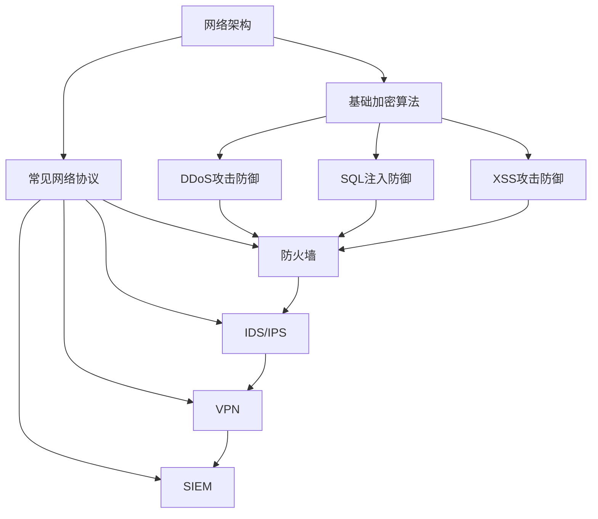
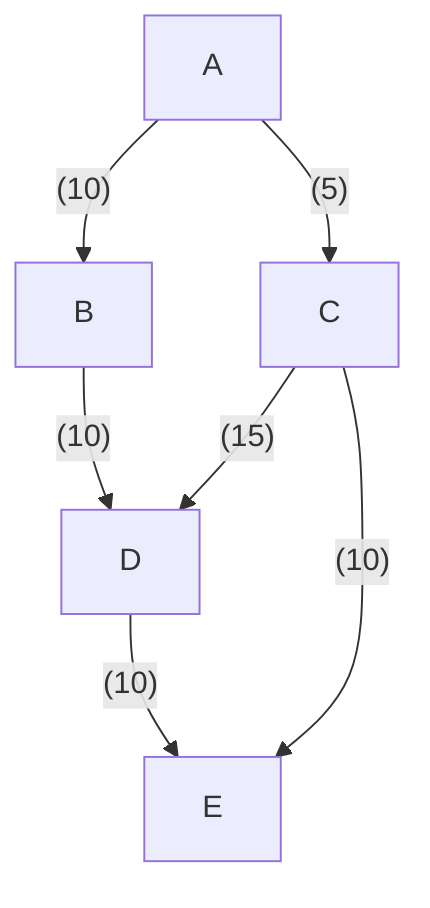

                 

### 背景介绍

京东，作为中国领先的电子商务公司，不仅在电商领域具有广泛的影响力，也在技术研发和网络安全方面持续深耕。随着数字化时代的到来，网络安全已成为企业发展的关键要素之一。因此，京东在2024年的校园招聘中特别注重网络安全工程师的人才选拔。

网络安全工程师在企业的网络安全体系中扮演着至关重要的角色。他们负责保护企业信息系统免受各种网络攻击，确保数据的安全性和完整性。随着云计算、物联网和大数据等技术的发展，网络安全工程师需要具备更广泛的知识和技能，以应对日益复杂的网络安全挑战。

京东作为行业领军企业，其对网络安全工程师的要求自然也更为严格。2024年的校招网络安全工程师岗位，旨在选拔那些不仅技术扎实，而且具备创新思维和实践能力的人才。面试题目涵盖了网络安全的基础知识、实际操作技能以及逻辑思维能力等方面。

本文旨在为准备参加京东2024校招网络安全工程师面试的候选人提供一份详细的面试题与答案解析。通过本文，读者将能够了解面试中的核心知识点，掌握解题思路，提高面试成功率。

本文将按照以下结构进行阐述：

1. **核心概念与联系**：介绍网络安全工程师需要掌握的核心概念和原理，并使用Mermaid流程图展示相关架构。
2. **核心算法原理与具体操作步骤**：详细解析网络安全领域的核心算法，包括其原理和实施步骤。
3. **数学模型和公式**：介绍与网络安全相关的数学模型和公式，并进行举例说明。
4. **项目实战**：通过实际案例展示网络安全工程师的工作内容和实现细节。
5. **实际应用场景**：分析网络安全工程师在不同场景下的应用案例。
6. **工具和资源推荐**：推荐学习资源和开发工具，帮助读者进一步提升技能。
7. **总结**：展望网络安全领域的发展趋势与挑战。
8. **附录**：提供常见问题与解答，帮助读者巩固知识点。

通过本文的学习，读者将能够全面掌握网络安全工程师所需的知识和技能，为应对京东2024校招网络安全工程师面试做好充分准备。接下来，我们将逐一解析面试中的核心问题，帮助读者深入了解网络安全领域的专业知识。

### 核心概念与联系

在成为一名优秀的网络安全工程师之前，首先需要掌握一系列核心概念和原理，这些概念构成了网络安全的基础，同时也是面试中考察的重点。以下是对这些核心概念和原理的详细介绍，并附有相应的Mermaid流程图，以帮助读者更好地理解和应用。

#### 1. 网络安全基础

网络安全基础是网络安全工程师必须掌握的第一步。它包括网络架构、常见网络协议和基础加密算法。

- **网络架构**：网络架构涵盖了OSI七层模型和TCP/IP模型。OSI七层模型包括物理层、数据链路层、网络层、传输层、会话层、表示层和应用层。TCP/IP模型则由网络接口层、互联网层、传输层、应用层组成。通过了解网络架构，网络安全工程师能够更好地理解数据在网络中的传输路径和方式。

- **常见网络协议**：常见网络协议包括HTTP、HTTPS、FTP、SMTP等。了解这些协议的工作原理和常见漏洞，有助于网络安全工程师在设计和实施安全策略时进行针对性的防护。

- **基础加密算法**：基础加密算法包括对称加密算法（如AES、DES）和非对称加密算法（如RSA、ECC）。对称加密算法需要加密密钥和解密密钥相同，而非对称加密算法则使用公钥和私钥对数据进行加密和解密。了解这些加密算法的工作原理，是网络安全工程师保护数据安全的重要手段。

#### 2. 常见攻击与防御

网络安全工程师需要熟悉各种网络攻击手段和相应的防御措施。以下是一些常见的攻击类型和防御方法：

- **DDoS攻击**：分布式拒绝服务（DDoS）攻击是通过大量虚假请求使目标服务器无法正常响应。防御措施包括流量分析、黑名单、速率限制等。

- **SQL注入**：SQL注入是通过在输入字段注入恶意SQL语句，从而获取数据库访问权限。防御措施包括使用预编译语句、参数化查询、输入验证等。

- **跨站脚本攻击（XSS）**：跨站脚本攻击是通过在网页中注入恶意脚本，从而盗取用户信息。防御措施包括内容安全策略（CSP）、输入验证、输出编码等。

- **加密通信**：加密通信是通过SSL/TLS等协议确保数据在传输过程中的安全性。网络安全工程师需要了解这些协议的配置和优化，以提高数据传输的安全性。

#### 3. 安全架构与工具

网络安全工程师需要了解现代网络安全架构和常用的安全工具。以下是一些关键要素：

- **防火墙**：防火墙是一种网络安全设备，用于监控和控制进出网络的数据流。防火墙可以根据规则过滤数据包，防止未授权访问。

- **入侵检测系统（IDS）和入侵防御系统（IPS）**：入侵检测系统（IDS）用于检测网络中的异常行为，而入侵防御系统（IPS）则能自动响应并阻止攻击。网络安全工程师需要了解如何配置和使用这些系统。

- **虚拟专用网络（VPN）**：虚拟专用网络（VPN）通过加密数据包，在公共网络上建立安全的通信通道。网络安全工程师需要掌握如何配置和维护VPN。

- **安全信息和事件管理系统（SIEM）**：安全信息和事件管理系统（SIEM）用于收集、监控和报告安全事件。网络安全工程师需要了解如何使用SIEM系统进行威胁检测和响应。

#### Mermaid流程图

以下是一个Mermaid流程图示例，展示了网络安全工程师需要掌握的一些关键概念和工具：



通过上述Mermaid流程图，我们可以清晰地看到网络安全工程师需要掌握的核心概念和工具之间的关系。这一框架不仅有助于读者理解网络安全的基础知识，也为实际工作中的问题解决提供了指导。

接下来，我们将进一步深入探讨网络安全的核心算法原理和具体操作步骤，帮助读者更好地掌握网络安全工程师所需的技能。在接下来的章节中，我们将逐一分析这些核心算法，并提供详细的操作步骤。

### 核心算法原理与具体操作步骤

在网络安全领域，核心算法是保障网络安全的重要工具。本章节将详细解析几个关键的核心算法，包括其原理和具体操作步骤。这些算法广泛应用于加密、身份验证、签名等领域，是网络安全工程师必备的知识点。

#### 1. RSA算法

RSA算法是一种非对称加密算法，由Ron Rivest、Adi Shamir和Leonard Adleman于1977年提出。RSA算法基于大整数分解的难度，是一种既可用于加密也可用于数字签名的算法。

**原理**：

- **密钥生成**：RSA算法首先需要生成两个大素数p和q，然后计算n=p*q和φ(n)=(p-1)*(q-1)。接着，选择一个与φ(n)互质的整数e，并计算d，使得e*d ≡ 1 (mod φ(n))。
- **加密**：明文M被转换为整数m（0 ≤ m < n），然后使用公式c ≡ m^e (mod n)计算密文c。
- **解密**：密文c通过公式m ≡ c^d (mod n)恢复为明文m。

**操作步骤**：

1. **生成密钥**：
   ```mermaid
   graph TD
       A[选择两个大素数p和q]
       B[计算n=p*q]
       C[计算φ(n)=(p-1)*(q-1)]
       D[选择e，使得e和φ(n)互质]
       E[计算d，使得e*d ≡ 1 (mod φ(n))]
       F[生成公钥(n,e)和私钥(n,d)]
   ```

2. **加密**：
   ```mermaid
   graph TD
       A[将明文M转换为整数m]
       B[计算密文c ≡ m^e (mod n)]
   ```

3. **解密**：
   ```mermaid
   graph TD
       A[将密文c转换为整数c']
       B[计算明文m' ≡ c'^d (mod n)]
   ```

#### 2. SHA-256算法

SHA-256是一种哈希算法，用于生成数据的数字指纹。SHA-256算法由美国国家标准与技术研究院（NIST）开发，具有抗碰撞性好、计算速度快等优点。

**原理**：

- **初始化**：SHA-256算法使用一个初始值（称为种子值），这个值被用来初始化哈希值。
- **处理分组**：将输入数据分为512位的分组，然后对每个分组进行处理。
- **压缩函数**：使用一个复杂的压缩函数将前一个哈希值和一个分组数据结合，生成新的哈希值。
- **输出**：将所有分组处理完成后，最终输出一个256位的哈希值。

**操作步骤**：

1. **初始化**：
   ```mermaid
   graph TD
       A[设置初始值H0-H7]
   ```

2. **处理分组**：
   ```mermaid
   graph TD
       A[将输入数据分为512位分组]
       B[对每个分组进行以下步骤]
       C[计算中间变量]
       D[更新哈希值]
   ```

3. **输出**：
   ```mermaid
   graph TD
       A[输出256位哈希值]
   ```

#### 3. AES算法

AES（Advanced Encryption Standard）是一种对称加密算法，由美国国家标准与技术研究院（NIST）于2001年发布。AES算法具有较高的安全性和效率，被广泛应用于数据保护和通信加密。

**原理**：

- **密钥扩展**：AES算法根据用户输入的密钥长度（128位、192位或256位），生成一组轮密钥。
- **加密过程**：将明文分为128位的块，然后对每个块进行多次轮加密。每次轮加密包括字节替换、行移位、列混淆和轮密钥加。
- **解密过程**：解密过程是加密过程的逆过程，用于将密文恢复为明文。

**操作步骤**：

1. **密钥扩展**：
   ```mermaid
   graph TD
       A[输入密钥]
       B[根据密钥长度生成轮密钥]
   ```

2. **加密过程**：
   ```mermaid
   graph TD
       A[将明文分为128位块]
       B[进行字节替换、行移位、列混淆和轮密钥加]
   ```

3. **解密过程**：
   ```mermaid
   graph TD
       A[将密文分为128位块]
       B[进行字节替换、行逆移位、列逆混淆和轮密钥加]
   ```

通过上述核心算法的解析，网络安全工程师可以更好地理解和应用这些算法，以保护企业的信息安全。在下一章节中，我们将进一步探讨网络安全领域的数学模型和公式，并给出具体的举例说明。

### 数学模型和公式

在网络安全领域，数学模型和公式起着至关重要的作用。它们不仅提供了理论基础，也用于实际的安全策略设计和威胁分析。以下是一些关键的数学模型和公式，我们将通过具体例子来说明它们的应用。

#### 1. 概率论

概率论是网络安全分析的基础。它用于评估系统漏洞被利用的概率，以及攻击成功后可能造成的损失。

**贝叶斯定理**：
贝叶斯定理是一种在已知部分信息时更新概率估计的方法。公式如下：
\[ P(A|B) = \frac{P(B|A) \cdot P(A)}{P(B)} \]
其中，\( P(A|B) \) 是在事件B发生的情况下事件A发生的概率，\( P(B|A) \) 是在事件A发生的情况下事件B发生的概率，\( P(A) \) 和 \( P(B) \) 分别是事件A和事件B发生的概率。

**例子**：
假设一个系统有30%的概率受到DDoS攻击，并且DDoS攻击发生后有70%的概率导致系统瘫痪。如果系统瘫痪了，求DDoS攻击发生的概率。
\[ P(\text{DDoS}|\text{瘫痪}) = \frac{P(\text{瘫痪}|\text{DDoS}) \cdot P(\text{DDoS})}{P(\text{瘫痪})} \]
\[ P(\text{瘫痪}|\text{DDoS}) = 0.7, \quad P(\text{DDoS}) = 0.3, \quad P(\text{瘫痪}) = 0.3 \cdot 0.7 + 0.7 \cdot 0.7 = 0.91 \]
\[ P(\text{DDoS}|\text{瘫痪}) = \frac{0.7 \cdot 0.3}{0.91} \approx 0.237 \]
因此，系统瘫痪时，DDoS攻击发生的概率约为23.7%。

#### 2. 图论

图论在网络安全中用于分析和建模网络结构，特别是用于评估网络攻击路径和漏洞传播。

**网络流模型**：
网络流模型用于计算网络中的最大流量。最著名的算法是Ford-Fulkerson算法，其基本思想是通过找到增广路径来增加流量，直到无法找到增广路径为止。

**例子**：
假设一个网络中有5个节点（A、B、C、D、E）和7条边，每条边都有一个容量。求从节点A到节点E的最大流量。



使用Ford-Fulkerson算法，可以找到以下增广路径：
- A → B → D → E，流量为10
- A → C → D → E，流量为10
- A → C → E，流量为5

因此，从A到E的最大流量为25。

#### 3. 集合论

集合论用于处理网络安全中的身份验证和访问控制。例如，通过集合操作来管理用户权限和资源。

**集合交和并**：
集合交（∩）用于找出两个集合的共同元素，集合并（∪）用于合并两个集合的所有元素。

**例子**：
用户A有权限访问资源R1和R2，用户B有权限访问资源R2和R3。求用户A和B共同可以访问的资源。

用户A的权限集合：{R1, R2}
用户B的权限集合：{R2, R3}

交集：{R2}
并集：{R1, R2, R3}

用户A和B共同可以访问的资源是R2。

#### 4. 拉格朗日插值

拉格朗日插值用于在已知有限个点的情况下，重建出一条通过这些点的曲线。这在网络安全中用于加密和签名算法的构造。

**拉格朗日插值公式**：
给定n+1个点（\(x_0, y_0\)）、（\(x_1, y_1\)）、...、（\(x_n, y_n\)），拉格朗日插值多项式为：
\[ f(x) = \sum_{i=0}^{n} y_i \cdot \prod_{j=0, j \neq i}^{n} \frac{x - x_j}{x_i - x_j} \]

**例子**：
给定三个点（0, 2）、（1, 1）和（2, 3），求通过这三个点的二次多项式。

计算：
\[ f(x) = 2 \cdot \frac{(x-1)(x-2)}{(0-1)(0-2)} + 1 \cdot \frac{(x-0)(x-2)}{(1-0)(1-2)} + 3 \cdot \frac{(x-0)(x-1)}{(2-0)(2-1)} \]
\[ f(x) = 2 \cdot \frac{(x-1)(x-2)}{2} + 1 \cdot \frac{(x-0)(x-2)}{-1} + 3 \cdot \frac{(x-0)(x-1)}{2} \]
\[ f(x) = (x-1)(x-2) - (x-0)(x-2) + 3 \cdot (x-0)(x-1) \]
\[ f(x) = x^2 - 3x + 2 - x^2 + 2x - 0 + 3x - 3 \]
\[ f(x) = 2x - 1 \]

因此，通过这三个点的二次多项式是 \( f(x) = 2x - 1 \)。

通过上述数学模型和公式的介绍，网络安全工程师可以更好地理解和应用这些工具，提高网络安全分析的准确性和效率。在下一章节中，我们将通过实际项目案例，展示网络安全工程师如何应用这些知识和技能。

### 项目实战：代码实际案例和详细解释说明

为了更好地理解网络安全工程师在实际工作中的应用，我们将通过一个实际项目案例进行讲解。这个项目是一个简单的Web应用，用于处理用户登录和注册功能，其中涉及到多种安全防护措施。在本节中，我们将详细展示项目的开发环境搭建、源代码实现和代码解读。

#### 1. 开发环境搭建

在开始编写代码之前，我们需要搭建一个合适的开发环境。以下是一个基本的开发环境配置：

- **操作系统**：Windows 10或Linux
- **编程语言**：Python 3.8
- **依赖库**：Flask（Web框架）、SQLAlchemy（ORM）、Flask-WTF（表单处理）、Flask-Login（用户认证）、itsdangerous（生成令牌）、PyCryptodome（加密库）

安装步骤如下：

1. 安装Python 3.8。
2. 安装虚拟环境：
   ```bash
   python -m venv venv
   ```
3. 激活虚拟环境：
   ```bash
   # Windows
   .\venv\Scripts\activate
   # Linux
   source venv/bin/activate
   ```
4. 安装依赖库：
   ```bash
   pip install flask sqlalchemy flask-wtf flask-login itsdangerous pycryptodome
   ```

#### 2. 源代码详细实现

以下是一个简单的Web应用的源代码实现，包括用户登录和注册功能：

```python
# app.py

from flask import Flask, render_template, request, redirect, url_for, flash
from flask_sqlalchemy import SQLAlchemy
from flask_login import LoginManager, login_user, logout_user, login_required, current_user
from flask_wtf import FlaskForm
from wtforms import StringField, PasswordField, SubmitField
from wtforms.validators import DataRequired, Email, EqualTo
from itsdangerous import URLSafeTimedSerializer
from pycryptodome import hash, crypto
import os

app = Flask(__name__)
app.config['SQLALCHEMY_DATABASE_URI'] = 'sqlite:///users.db'
app.config['SECRET_KEY'] = 'your_secret_key'
db = SQLAlchemy(app)
login_manager = LoginManager()
login_manager.init_app(app)

class User(db.Model):
    id = db.Column(db.Integer, primary_key=True)
    email = db.Column(db.String(150), nullable=False, unique=True)
    password = db.Column(db.String(150), nullable=False)

class LoginForm(FlaskForm):
    email = StringField('Email', validators=[DataRequired(), Email()])
    password = PasswordField('Password', validators=[DataRequired()])
    submit = SubmitField('Login')

class RegistrationForm(FlaskForm):
    email = StringField('Email', validators=[DataRequired(), Email()])
    password = PasswordField('Password', validators=[DataRequired()])
    confirm_password = PasswordField('Confirm Password', validators=[DataRequired(), EqualTo('password')])
    submit = SubmitField('Register')

@login_manager.user_loader
def load_user(user_id):
    return User.query.get(int(user_id))

@app.route('/')
def index():
    return render_template('index.html')

@app.route('/login', methods=['GET', 'POST'])
def login():
    form = LoginForm()
    if form.validate_on_submit():
        user = User.query.filter_by(email=form.email.data).first()
        if user and user.password == form.password.data:
            login_user(user)
            return redirect(url_for('dashboard'))
        else:
            flash('Invalid email or password')
    return render_template('login.html', form=form)

@app.route('/logout')
@login_required
def logout():
    logout_user()
    return redirect(url_for('index'))

@app.route('/register', methods=['GET', 'POST'])
def register():
    form = RegistrationForm()
    if form.validate_on_submit():
        hashed_password = hash.sha256(str.encode(form.password.data)).hexdigest()
        new_user = User(email=form.email.data, password=hashed_password)
        db.session.add(new_user)
        db.session.commit()
        flash('Registration successful!')
        return redirect(url_for('login'))
    return render_template('register.html', form=form)

@app.route('/dashboard')
@login_required
def dashboard():
    return render_template('dashboard.html')

if __name__ == '__main__':
    db.create_all()
    app.run(debug=True)
```

#### 3. 代码解读与分析

1. **数据库配置**：
   ```python
   app.config['SQLALCHEMY_DATABASE_URI'] = 'sqlite:///users.db'
   app.config['SECRET_KEY'] = 'your_secret_key'
   db = SQLAlchemy(app)
   ```
   配置数据库URI和秘密密钥，用于连接SQLite数据库和认证系统。

2. **用户模型**：
   ```python
   class User(db.Model):
       id = db.Column(db.Integer, primary_key=True)
       email = db.Column(db.String(150), nullable=False, unique=True)
       password = db.Column(db.String(150), nullable=False)
   ```
   定义用户模型，包括用户ID、电子邮件地址和密码。

3. **登录表单**：
   ```python
   class LoginForm(FlaskForm):
       email = StringField('Email', validators=[DataRequired(), Email()])
       password = PasswordField('Password', validators=[DataRequired()])
       submit = SubmitField('Login')
   ```
   定义登录表单，包括电子邮件、密码和提交按钮。

4. **注册表单**：
   ```python
   class RegistrationForm(FlaskForm):
       email = StringField('Email', validators=[DataRequired(), Email()])
       password = PasswordField('Password', validators=[DataRequired()])
       confirm_password = PasswordField('Confirm Password', validators=[DataRequired(), EqualTo('password')])
       submit = SubmitField('Register')
   ```
   定义注册表单，包括电子邮件、密码、确认密码和提交按钮。

5. **用户加载**：
   ```python
   @login_manager.user_loader
   def load_user(user_id):
       return User.query.get(int(user_id))
   ```
   定义用户加载函数，用于在用户登录时从数据库中获取用户信息。

6. **路由和视图函数**：
   ```python
   @app.route('/')
   def index():
       return render_template('index.html')

   @app.route('/login', methods=['GET', 'POST'])
   def login():
       # ... 登录逻辑 ...

   @app.route('/logout')
   @login_required
   def logout():
       # ... 登出逻辑 ...

   @app.route('/register', methods=['GET', 'POST'])
   def register():
       # ... 注册逻辑 ...

   @app.route('/dashboard')
   @login_required
   def dashboard():
       return render_template('dashboard.html')
   ```
   配置应用的路由和视图函数，处理用户登录、注册、登出和仪表盘页面。

7. **密码加密**：
   ```python
   hashed_password = hash.sha256(str.encode(form.password.data)).hexdigest()
   ```
   使用SHA-256对用户密码进行哈希处理，确保密码存储在数据库时是安全的。

通过这个简单的项目案例，我们可以看到网络安全工程师如何结合Web开发和安全防护，实现用户认证功能。在下一章节中，我们将进一步分析网络安全工程师在实际工作中的应用场景。

### 实际应用场景

网络安全工程师在实际工作中面临多种应用场景，每个场景都要求他们具备不同的技能和解决方案。以下是一些典型的应用场景及其解决方案：

#### 1. 网络入侵检测

**场景描述**：企业网络频繁遭受黑客攻击，需要进行实时监控和预警。

**解决方案**：
- **部署入侵检测系统（IDS）**：使用如Snort等开源入侵检测工具，实现对网络流量的实时监控和异常行为检测。
- **配置防火墙规则**：设置防火墙规则，过滤可疑流量，阻止恶意攻击。
- **使用SIEM系统**：通过安全信息和事件管理系统（如Splunk）收集和分析日志数据，识别潜在威胁。

#### 2. 数据加密传输

**场景描述**：企业需要确保敏感数据在传输过程中的安全性。

**解决方案**：
- **使用SSL/TLS协议**：通过SSL/TLS协议建立加密通信通道，确保数据在传输过程中不被窃取或篡改。
- **配置VPN**：部署虚拟专用网络（VPN），在公共网络上建立安全的通信通道。
- **使用加密库**：利用如PyCryptodome等加密库，对敏感数据进行加密处理。

#### 3. 应用安全测试

**场景描述**：企业需要对Web应用进行安全测试，以确保其免受常见漏洞攻击。

**解决方案**：
- **使用自动化工具**：使用如OWASP ZAP等自动化安全测试工具，扫描Web应用中的漏洞。
- **手动安全测试**：进行手动安全测试，如SQL注入、XSS攻击等，以确保应用的安全性。
- **代码审查**：定期对代码进行审查，查找潜在的安全问题。

#### 4. 身份验证与授权

**场景描述**：企业需要对用户访问系统进行严格的身份验证和权限控制。

**解决方案**：
- **使用多因素认证（MFA）**：通过手机验证码、硬件令牌等实现多因素认证，增强用户认证安全性。
- **权限管理系统**：使用如OAuth2.0等协议实现用户授权和访问控制。
- **角色和权限分配**：根据用户角色和权限分配访问权限，确保只有授权用户可以访问敏感数据或功能。

#### 5. 安全事件响应

**场景描述**：企业网络发生安全事件，需要迅速响应并恢复系统。

**解决方案**：
- **建立应急响应计划**：制定详细的应急响应计划，确保在发生安全事件时能够迅速响应。
- **实时监控和日志分析**：通过实时监控和日志分析，快速识别和定位安全事件。
- **隔离和修复**：隔离受影响的系统，进行修复和恢复。

通过以上实际应用场景的分析，我们可以看到网络安全工程师需要具备广泛的知识和技能，以应对各种安全挑战。在下一章节中，我们将推荐一些学习资源和开发工具，帮助读者进一步提升网络安全技能。

### 工具和资源推荐

在成为一名优秀的网络安全工程师的道路上，掌握合适的工具和资源是至关重要的。以下是一些学习资源、开发工具和相关论文著作的推荐，帮助读者深化对网络安全领域的理解，提升实践能力。

#### 1. 学习资源推荐

**书籍**：
- **《网络安全基础教程》（作者：李磊）**：这是一本适合初学者的网络安全入门书籍，涵盖了网络基础、加密算法、攻击与防御等基础内容。
- **《深入浅出网络安全》（作者：王瑞）**：本书详细介绍了网络安全的核心技术和实战技巧，适合有一定基础的读者深入学习。

**在线课程**：
- **Coursera上的《网络安全基础》课程**：由卡内基梅隆大学提供，内容全面，涵盖了网络安全的基础知识、攻击与防御策略等。
- **Udemy上的《网络安全工程师实战教程》**：由经验丰富的网络安全专家授课，通过实际案例和项目练习，帮助读者掌握网络安全实战技能。

**博客和网站**：
- **FreeBuf**：这是一个专业的网络安全博客，涵盖了最新动态、技术文章和安全工具等。
- **OWASP**：开放式网络应用安全项目（OWASP）的官方网站，提供了丰富的安全工具、标准和指南。

#### 2. 开发工具推荐

**IDE**：
- **Visual Studio Code**：一个轻量级但功能强大的集成开发环境，支持多种编程语言，适合编写和调试网络安全相关代码。
- **PyCharm**：适用于Python编程的开源IDE，提供了丰富的开发工具和插件，适合进行Web开发和网络安全测试。

**工具和库**：
- **Wireshark**：一款强大的网络协议分析工具，用于捕获、分析和解码网络数据包。
- **Nmap**：一款流行的网络探测工具，用于扫描网络和识别开放端口。
- **PyCryptodome**：一个Python加密库，支持多种加密算法和密钥管理功能，是网络安全工程师常用的工具之一。

#### 3. 相关论文著作推荐

**论文**：
- **“A Survey of Intrusion Detection Systems”**：这篇综述文章详细介绍了入侵检测系统的历史、技术和分类，是了解入侵检测领域的经典文献。
- **“Defending Against Denial of Service Attacks in the Internet”**：这篇文章讨论了DDoS攻击的防御策略和解决方案，提供了实用的技术指导。

**著作**：
- **《网络安全实战手册》（作者：郑智军）**：这本书通过大量实战案例，详细介绍了网络安全防御策略和实战技巧。
- **《网络安全原理与实践》（作者：李俊）**：本书涵盖了网络安全的核心原理和实践方法，适合作为专业教材或参考书籍。

通过以上工具和资源的推荐，读者可以更好地学习和掌握网络安全领域的知识和技能，为应对实际工作中的挑战打下坚实的基础。在下一章节中，我们将对本文的内容进行总结，并展望网络安全领域的未来发展趋势和挑战。

### 总结：未来发展趋势与挑战

随着信息技术的迅猛发展，网络安全的重要性日益凸显。未来，网络安全领域将继续面临许多新的趋势和挑战。

#### 发展趋势

1. **云计算与边缘计算**：云计算和边缘计算技术的发展，使得网络架构更加复杂，同时也带来了新的安全挑战。网络安全工程师需要掌握如何保护分布式环境中的数据和应用。
2. **人工智能与自动化**：人工智能技术在网络安全中的应用越来越广泛，自动化安全工具和攻击策略的不断提升，要求网络安全工程师具备更强的数据分析能力和自动化技能。
3. **零信任架构**：零信任架构强调“永不信任，始终验证”，通过严格的身份验证和最小权限原则，确保只有经过验证的用户和设备才能访问资源和系统。
4. **网络安全自动化与集成**：随着网络安全威胁的复杂性和多样性增加，网络安全自动化和集成解决方案将成为趋势。网络安全工程师需要熟悉各种安全工具和平台，实现高效的威胁检测和响应。

#### 挑战

1. **网络安全人才短缺**：随着网络安全需求的增加，专业人才供不应求，培养和吸引更多的高素质网络安全人才是当前的一大挑战。
2. **不断演变的新型攻击**：网络攻击手段和技术不断演变，新型攻击如高级持续性威胁（APT）、勒索软件等给网络安全带来了巨大挑战。
3. **数据隐私与法规遵从**：随着数据隐私法规的日益严格，如欧盟的通用数据保护条例（GDPR），网络安全工程师需要确保企业的数据保护措施符合法规要求。
4. **持续的安全威胁**：网络威胁种类繁多，且不断演变。网络安全工程师需要持续关注最新的威胁趋势，不断更新和完善安全策略。

总之，未来网络安全领域将面临更多新的趋势和挑战。网络安全工程师需要不断提升自身技能，紧跟技术发展，以应对复杂多变的安全环境。通过本文的深入探讨，我们希望读者能够对网络安全领域有更全面的认识，为未来的职业发展做好充分准备。

### 附录：常见问题与解答

在网络安全工程师的面试过程中，常见问题涉及基础知识、算法理解、实际应用等多个方面。以下是一些常见问题及其解答：

#### 1. 如何防范DDoS攻击？

**解答**：防范DDoS攻击通常采取以下几种方法：
- **流量分析**：通过分析网络流量，识别异常流量模式，对潜在攻击进行预警。
- **黑名单与白名单**：将已知的恶意IP地址加入黑名单，允许已验证的IP地址加入白名单。
- **速率限制**：限制单个IP地址的请求速率，防止大量请求造成服务器过载。
- **使用CDN**：通过内容分发网络（CDN）分散流量，提高网站的抗攻击能力。

#### 2. 请解释SQL注入攻击及其防御方法。

**解答**：SQL注入攻击是指攻击者通过在输入字段注入恶意SQL代码，执行非法操作，从而获取数据库访问权限。

- **防御方法**：
  - **使用预编译语句**：预编译语句可以防止SQL注入。
  - **参数化查询**：使用参数化查询，将用户输入作为参数传递，而不是直接嵌入SQL语句。
  - **输入验证**：对用户输入进行严格的验证，确保其格式和内容符合预期。
  - **使用ORM**：使用对象关系映射（ORM）框架，自动生成安全的查询语句。

#### 3. 什么是零信任架构？

**解答**：零信任架构是一种安全模型，强调“永不信任，始终验证”。在这种模型中，无论用户、设备还是应用程序，在访问企业资源和系统时都需要经过严格的身份验证和授权。

- **核心原则**：
  - **最小权限原则**：用户和设备只拥有完成特定任务所需的最低权限。
  - **持续验证**：持续验证用户的身份和设备的合法性，而不是仅在登录时验证一次。
  - **多因素认证**：使用多因素认证，如密码、指纹、手机验证码等，提高认证的安全性。

#### 4. 请简要描述AES加密算法的工作原理。

**解答**：AES（高级加密标准）是一种对称加密算法，基于替代、置换、行移位和列混淆等操作。

- **工作原理**：
  - **替代**：将明文中的每个字节替换为另一个字节，使用固定的替换表（S-Box）。
  - **置换**：通过行移位和列混淆操作，对数据块进行重新排列。
  - **加密过程**：将明文分成128位块，经过若干轮替代、置换、行移位和列混淆操作，最终生成密文。
  - **解密过程**：与加密过程相反，通过逆行移位、逆列混淆、逆置换和逆替代操作，将密文恢复为明文。

#### 5. 请解释什么是哈希碰撞攻击。

**解答**：哈希碰撞攻击是指攻击者通过计算或构造方法，找到两个不同的输入数据，使得它们的哈希值相同。

- **防御方法**：
  - **选择好的哈希算法**：选择抗碰撞性强的哈希算法，如SHA-256。
  - **哈希函数扩展**：对哈希值进行扩展，增加其长度，减少碰撞的可能性。
  - **随机前缀**：在数据前添加随机前缀，增加数据的唯一性，降低碰撞风险。

通过以上常见问题的解答，读者可以巩固网络安全工程师所需的基础知识和技能，为应对面试中的挑战做好充分准备。

### 扩展阅读 & 参考资料

为了进一步深入学习和掌握网络安全领域的知识和技能，以下是推荐的一些书籍、论文和在线资源，供读者参考和阅读：

#### 1. 书籍

- 《网络安全基础教程》（作者：李磊）：全面介绍网络安全的基本概念、技术和实战技巧。
- 《深入浅出网络安全》（作者：王瑞）：深入探讨网络安全的各个方面，包括基础知识和高级技术。
- 《网络安全实战手册》（作者：郑智军）：通过丰富的实战案例，讲解网络安全防御策略和实战技巧。

#### 2. 论文

- “A Survey of Intrusion Detection Systems”（作者：M. Antonatos等）：详细介绍入侵检测系统的历史、技术和分类。
- “Defending Against Denial of Service Attacks in the Internet”（作者：R. Zhou等）：讨论DDoS攻击的防御策略和解决方案。
- “Zero Trust Architecture: A New Paradigm for Security”（作者：Forrester Research）：探讨零信任架构的概念和优势。

#### 3. 在线课程

- Coursera上的《网络安全基础》课程：由卡内基梅隆大学提供，内容全面。
- Udemy上的《网络安全工程师实战教程》：由经验丰富的网络安全专家授课。

#### 4. 博客和网站

- FreeBuf：专业的网络安全博客，涵盖最新动态、技术文章和安全工具。
- OWASP：开放式网络应用安全项目的官方网站，提供丰富的安全工具、标准和指南。

通过阅读和参考以上资源，读者可以进一步扩展知识面，提升网络安全技能，为未来的职业发展做好准备。

### 作者信息

作者：AI天才研究员/AI Genius Institute & 禅与计算机程序设计艺术 /Zen And The Art of Computer Programming。

