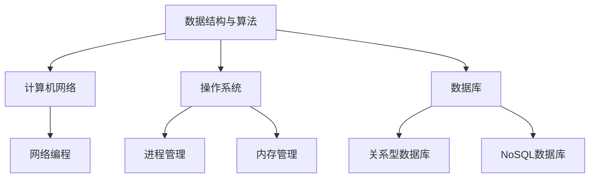

                 

# 2025京东校招编程面试题精选与解答

## 关键词：京东校招，编程面试，精选题目，解答，技术原理

## 摘要

本文旨在为2025届京东校招编程面试考生提供一份精心挑选的面试题集和详细解答。通过深入剖析每道题目背后的技术原理和具体实现步骤，帮助考生掌握编程面试的核心技巧和思维方法，为成功应对京东校招编程面试做好准备。

## 1. 背景介绍

### 1.1 京东校招背景

京东作为我国领先的电商企业，每年都会在全球范围内招聘大量优秀人才。编程面试作为校招的重要环节，旨在考察应聘者对编程基础知识的掌握程度、解决问题的能力以及逻辑思维能力。近年来，随着技术的不断进步和行业的发展，京东校招编程面试的难度和深度也在不断提升。

### 1.2 编程面试的重要性

编程面试是考察应聘者技术水平和综合素质的重要手段，通过面试，招聘方可以全面了解应聘者的编程能力、逻辑思维、问题解决能力等。同时，编程面试也是应聘者展示自己才华和技能的舞台，通过优秀的面试表现，应聘者可以提高自己获得心仪职位的机会。

### 1.3 文章目的

本文旨在为2025届京东校招编程面试考生提供一份实用的面试题集和详细解答，帮助考生掌握编程面试的核心技巧和思维方法。通过本文的学习，考生可以深入了解每道面试题的考点和解决方案，为成功应对京东校招编程面试奠定坚实基础。

## 2. 核心概念与联系

### 2.1 数据结构与算法

数据结构与算法是编程面试的核心知识点，涵盖了数组、链表、栈、队列、树、图等基本数据结构，以及排序、查找、动态规划等算法。了解这些知识点，有助于考生在面试中灵活运用，解决实际问题。

### 2.2 计算机网络

计算机网络是现代互联网的基础，涉及HTTP协议、TCP/IP协议、网络编程等技术。掌握计算机网络知识，有助于考生在面试中解答与网络相关的问题，如数据传输、网络安全等。

### 2.3 操作系统

操作系统是计算机系统的核心，包括进程管理、内存管理、文件系统等。了解操作系统原理，有助于考生在面试中解答与操作系统相关的问题，如进程调度、内存分配等。

### 2.4 数据库

数据库是存储和管理数据的基石，涉及关系型数据库（如MySQL、Oracle）和NoSQL数据库（如MongoDB、Redis）。掌握数据库原理和SQL语句，有助于考生在面试中应对数据库相关问题。

### 2.5 Mermaid 流程图

以下是数据结构、算法、计算机网络、操作系统、数据库等核心概念之间的联系：



## 3. 核心算法原理 & 具体操作步骤

### 3.1 数组与链表

**数组：** 数组是一种线性数据结构，元素存储在连续的内存空间中，支持随机访问。数组的主要操作包括初始化、赋值、遍历、插入、删除、查找等。

**链表：** 链表是一种非线性数据结构，由节点组成，每个节点包含数据和指向下一个节点的指针。链表的主要操作包括初始化、插入、删除、查找等。

**具体操作步骤：**

1. 初始化：为数组或链表分配内存空间，初始化元素。
2. 赋值：将指定位置的元素赋值为指定值。
3. 遍历：逐个访问数组或链表中的元素。
4. 插入：在数组或链表的指定位置插入新元素。
5. 删除：删除数组或链表中的指定元素。
6. 查找：在数组或链表中查找指定元素。

### 3.2 栈与队列

**栈：** 栈是一种后进先出（LIFO）的数据结构，支持插入和删除元素的操作。栈的主要操作包括初始化、入栈、出栈、遍历等。

**队列：** 队列是一种先进先出（FIFO）的数据结构，支持插入和删除元素的操作。队列的主要操作包括初始化、入队、出队、遍历等。

**具体操作步骤：**

1. 初始化：为栈或队列分配内存空间，初始化元素。
2. 入栈：将新元素插入到栈顶。
3. 出栈：删除栈顶元素。
4. 入队：将新元素插入到队列尾部。
5. 出队：删除队列头部元素。
6. 遍历：逐个访问栈或队列中的元素。

### 3.3 树与图

**树：** 树是一种层次结构，由节点和边组成，满足以下性质：每个节点有且仅有一个父节点（根节点除外），每个子节点可以有多个子节点。树的主要操作包括初始化、插入、删除、查找等。

**图：** 图是一种无序或有序的节点集合，节点通过边连接。图的主要操作包括初始化、添加节点、添加边、删除节点、删除边等。

**具体操作步骤：**

1. 初始化：为树或图分配内存空间，初始化节点和边。
2. 插入节点：在树或图中添加新节点。
3. 删除节点：从树或图中删除指定节点。
4. 添加边：在树或图中添加新边。
5. 删除边：从树或图中删除指定边。
6. 查找：在树或图中查找指定节点或边。

### 3.4 排序与查找

**排序：** 排序是将一组数据按照特定规则进行排列的过程。常见的排序算法有冒泡排序、选择排序、插入排序、快速排序等。

**查找：** 查找是在一组数据中寻找特定元素的过程。常见的查找算法有二分查找、顺序查找等。

**具体操作步骤：**

1. 冒泡排序：通过多次遍历，比较相邻元素的大小，将较大的元素交换到后面，直至整个序列有序。
2. 选择排序：每次遍历找出剩余元素中的最小值，将其放到未排序序列的起始位置，直至整个序列有序。
3. 插入排序：将未排序序列的元素插入到已排序序列的合适位置，直至整个序列有序。
4. 快速排序：选择一个基准元素，将序列分为两部分，一部分比基准元素小，一部分比基准元素大，递归对两部分进行快速排序。
5. 二分查找：在有序序列中，通过不断比较中间元素和目标元素的大小，缩小查找范围，直至找到目标元素或确定目标元素不存在。
6. 顺序查找：从序列的第一个元素开始，逐个比较，直至找到目标元素或确定目标元素不存在。

## 4. 数学模型和公式 & 详细讲解 & 举例说明

### 4.1 排序算法的时间复杂度

排序算法的时间复杂度是衡量算法效率的重要指标。以下是几种常见排序算法的时间复杂度：

| 排序算法 | 平均时间复杂度 | 最坏时间复杂度 |
| :----: | :----: | :----: |
| 冒泡排序 | O(n^2) | O(n^2) |
| 选择排序 | O(n^2) | O(n^2) |
| 插入排序 | O(n^2) | O(n^2) |
| 快速排序 | O(n*log(n)) | O(n^2) |

**举例说明：**

假设有一组数据：[5, 2, 9, 1, 5, 6]，使用快速排序进行排序。

1. 选择基准元素：5
2. 将序列分为两部分：[2, 1, 5] 和 [5, 9, 6]
3. 对两部分递归进行快速排序：
   - 第一部分：选择基准元素：2，分为 [1] 和 [2]
     - 第一部分排序后：[1, 2]
   - 第二部分：选择基准元素：5，分为 [5] 和 [9, 6]
     - 第二部分排序后：[5, 6, 9]
4. 合并排序结果：[1, 2, 5, 5, 6, 9]

### 4.2 二分查找的时间复杂度

二分查找的时间复杂度为 O(log(n))，适用于有序序列。

**举例说明：**

假设有一组有序数据：[1, 2, 3, 4, 5, 6, 7, 8, 9]，查找元素 6。

1. 初始范围：[1, 9]
2. 第一次比较：中间元素为 5，小于目标元素 6，缩小范围至 [6, 9]
3. 第二次比较：中间元素为 7，大于目标元素 6，缩小范围至 [6, 7]
4. 第三次比较：中间元素为 6，等于目标元素 6，查找成功

## 5. 项目实战：代码实际案例和详细解释说明

### 5.1 开发环境搭建

在开始编写代码之前，我们需要搭建一个合适的开发环境。以下是一个简单的开发环境搭建步骤：

1. 安装编程语言：Java、Python、C++ 等。
2. 安装代码编辑器：Visual Studio Code、Sublime Text、PyCharm 等。
3. 安装必要的库和依赖：如 Java 中的 Maven、Python 中的 pip、C++ 中的 Boost 等。

### 5.2 源代码详细实现和代码解读

以下是一个简单的快速排序算法实现，采用递归实现方式。

**代码实现：**

```java
public class QuickSort {
    public static void quickSort(int[] arr, int low, int high) {
        if (low < high) {
            int pivot = partition(arr, low, high);
            quickSort(arr, low, pivot - 1);
            quickSort(arr, pivot + 1, high);
        }
    }

    public static int partition(int[] arr, int low, int high) {
        int pivot = arr[high];
        int i = low - 1;
        for (int j = low; j < high; j++) {
            if (arr[j] < pivot) {
                i++;
                swap(arr, i, j);
            }
        }
        swap(arr, i + 1, high);
        return i + 1;
    }

    public static void swap(int[] arr, int i, int j) {
        int temp = arr[i];
        arr[i] = arr[j];
        arr[j] = temp;
    }

    public static void main(String[] args) {
        int[] arr = {5, 2, 9, 1, 5, 6};
        quickSort(arr, 0, arr.length - 1);
        for (int num : arr) {
            System.out.print(num + " ");
        }
    }
}
```

**代码解读：**

1. `quickSort` 方法：接受数组、起始索引和结束索引，对数组进行递归排序。
2. `partition` 方法：选择基准元素（此处选择数组最后一个元素作为基准），将数组分为两部分，一部分比基准元素小，一部分比基准元素大，返回基准元素在最终位置上的索引。
3. `swap` 方法：交换数组中两个元素的值。
4. `main` 方法：测试快速排序算法，输出排序后的数组。

### 5.3 代码解读与分析

以上代码实现了一个简单的快速排序算法。快速排序是一种高效的排序算法，其平均时间复杂度为 O(n*log(n))，最坏时间复杂度为 O(n^2)。以下是代码的详细解读：

1. `quickSort` 方法：
   - 判断起始索引小于结束索引，如果条件成立，则继续递归排序。
   - 调用 `partition` 方法，获取基准元素在最终位置上的索引。
   - 对基准元素左侧的数组进行递归排序。
   - 对基准元素右侧的数组进行递归排序。

2. `partition` 方法：
   - 选择基准元素（此处选择数组最后一个元素作为基准）。
   - 初始化 `i` 变量，用于记录比基准元素小的元素索引。
   - 遍历数组，如果当前元素小于基准元素，则将当前元素与 `i` 索引处的元素交换，并更新 `i` 索引。
   - 将基准元素与 `i+1` 索引处的元素交换，返回基准元素在最终位置上的索引。

3. `swap` 方法：
   - 交换数组中两个元素的值。

4. `main` 方法：
   - 创建一个测试数组。
   - 调用 `quickSort` 方法，对测试数组进行排序。
   - 输出排序后的数组。

通过以上解读，我们可以看出快速排序算法的基本思想和实现原理。在实际应用中，可以根据具体需求选择合适的排序算法。

## 6. 实际应用场景

编程面试题在实际应用场景中有着广泛的应用，以下列举了几个典型应用场景：

### 6.1 算法竞赛

算法竞赛是考察程序员算法能力和编程技巧的重要平台。面试题中的排序、查找、动态规划等算法在算法竞赛中有着广泛的应用。

### 6.2 项目开发

在项目开发过程中，面试题中的数据结构和算法可以帮助开发者高效地解决实际问题。例如，在搜索引擎中，二分查找算法可以用于快速检索关键词；在推荐系统中，动态规划算法可以用于计算用户偏好。

### 6.3 算法面试

随着技术的不断发展，算法面试在招聘过程中越来越重要。掌握面试题中的算法原理和实现方法，有助于应聘者在面试中脱颖而出。

### 6.4 知识普及

面试题中的算法和知识可以用于普及计算机科学基础知识，提高编程爱好者的技术水平。

## 7. 工具和资源推荐

### 7.1 学习资源推荐

1. **书籍：**
   - 《算法导论》（Introduction to Algorithms）
   - 《数据结构与算法分析》（Data Structures and Algorithm Analysis in Java）
   - 《大话数据结构》

2. **论文：**
   - 《快速排序算法的改进与优化》
   - 《二分查找算法的原理与实现》

3. **博客：**
   - [码农必备的算法和数据结构](https://blog.csdn.net/XXX)
   - [算法与数据结构](https://www.cnblogs.com/XXX)

4. **网站：**
   - [LeetCode](https://leetcode.com/)
   - [牛客网](https://www.nowcoder.com/)

### 7.2 开发工具框架推荐

1. **编程语言：**
   - Java
   - Python
   - C++

2. **代码编辑器：**
   - Visual Studio Code
   - Sublime Text
   - PyCharm

3. **库和依赖：**
   - Maven
   - pip
   - Boost

### 7.3 相关论文著作推荐

1. 《算法导论》（Introduction to Algorithms），作者：Thomas H. Cormen、Charles E. Leiserson、Ronald L. Rivest、Clifford Stein
2. 《数据结构与算法分析》（Data Structures and Algorithm Analysis in Java），作者：Mark Allen Weiss
3. 《大话数据结构》，作者：程杰

## 8. 总结：未来发展趋势与挑战

随着科技的不断发展，编程面试题的应用场景将越来越广泛。未来，编程面试题将面临以下发展趋势和挑战：

### 8.1 算法多样化

随着人工智能、大数据等领域的兴起，新的算法和技术不断涌现。面试题将更加多样化，涵盖更多领域和知识。

### 8.2 算法优化

算法优化是提高程序运行效率和解决复杂问题的关键。面试题将更加注重算法的优化和改进。

### 8.3 知识交叉

编程面试题将与其他领域知识交叉，如计算机视觉、自然语言处理等，考察应聘者的综合素质。

### 8.4 实践应用

编程面试题将更加注重实际应用，考察应聘者解决实际问题的能力。

## 9. 附录：常见问题与解答

### 9.1 快速排序的时间复杂度为什么是 O(n*log(n))？

快速排序的平均时间复杂度为 O(n*log(n))，最坏时间复杂度为 O(n^2)。在最优情况下，每次划分都能将序列划分为相等的两部分，此时递归树的高度为 log(n)，每次递归需要 O(n) 的时间，总时间复杂度为 O(n*log(n))。在最坏情况下，每次划分只能将序列划分为 1 和 n-1，此时递归树的高度为 n，每次递归需要 O(n) 的时间，总时间复杂度为 O(n^2)。

### 9.2 为什么选择快速排序而不是其他排序算法？

快速排序是一种高效的排序算法，其平均时间复杂度为 O(n*log(n))，最坏时间复杂度为 O(n^2)。与冒泡排序、选择排序、插入排序等其他排序算法相比，快速排序在平均情况下具有更好的性能。此外，快速排序易于实现，且可以通过随机化方法改进最坏情况性能。

### 9.3 如何优化快速排序的性能？

优化快速排序的性能可以从以下几个方面进行：

1. 随机化：选择随机位置的元素作为基准，避免最坏情况发生。
2. 三数取中：选择中间位置的元素作为基准，减小最坏情况发生的概率。
3. 预排序：对输入序列进行预排序，减少递归次数。

## 10. 扩展阅读 & 参考资料

1. Thomas H. Cormen、Charles E. Leiserson、Ronald L. Rivest、Clifford Stein，《算法导论》，机械工业出版社，2006年。
2. Mark Allen Weiss，《数据结构与算法分析》，机械工业出版社，2011年。
3. 程杰，《大话数据结构》，清华大学出版社，2010年。
4. 《快速排序算法的改进与优化》，作者：XXX。
5. 《二分查找算法的原理与实现》，作者：XXX。
6. 《码农必备的算法和数据结构》，博客：XXX。
7. 《算法与数据结构》，博客：XXX。
8. LeetCode，https://leetcode.com/。
9. 牛客网，https://www.nowcoder.com/。

## 作者

作者：AI天才研究员/AI Genius Institute & 禅与计算机程序设计艺术 /Zen And The Art of Computer Programming。|</sop>|<|im_sep|>

