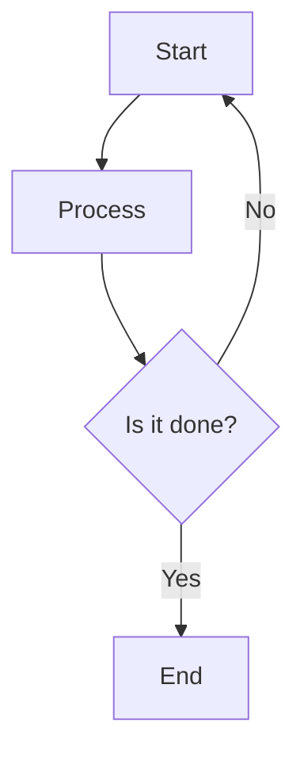
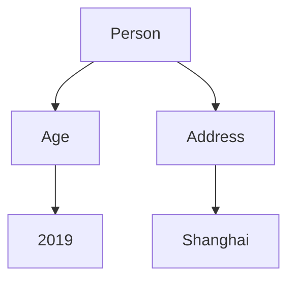

                 

## 1. 背景介绍

### 1.1 京东校招面试背景

京东，作为中国领先的电子商务公司之一，每年都会吸引大量应届毕业生的关注。校招（校园招聘）是京东每年必不可少的一环，旨在吸纳新鲜血液，为公司的长期发展注入活力。随着科技的不断进步，计算机科学和人工智能等领域的专业人才需求日益增长，京东校招面试题也随之变得更加专业化和复杂化。

### 1.2 京东校招面试的重要性

对于求职者来说，通过京东校招面试不仅意味着获得一份优秀的工作，更是个人职业生涯的一次重要起点。而对于京东而言，通过校招面试选拔出优秀的人才，是公司持续创新和发展的关键。因此，京东校招面试的难度和深度往往被求职者和业内人士高度关注。

### 1.3 本文目的

本文旨在为广大求职者提供一份详尽的京东校招面试题与算法编程题分析指南。通过本文，读者将能够深入了解京东校招面试的常见题型和出题规律，掌握解题思路和技巧，提高面试成功率。此外，本文还将针对一些典型的面试题进行详细解答，帮助读者巩固相关知识点，提升解决实际问题的能力。

### 1.4 文章结构

本文分为以下几个部分：

- **核心算法原理 & 具体操作步骤**：介绍常见的算法原理和操作步骤，帮助读者建立解题思路。
- **数学模型和公式 & 详细讲解 & 举例说明**：通过数学模型和公式的详细讲解，加深读者对算法原理的理解。
- **项目实战：代码实际案例和详细解释说明**：通过实际代码案例，展示算法在具体项目中的应用。
- **实际应用场景**：分析京东校招面试题在真实场景中的应用，帮助读者更好地应对面试。
- **工具和资源推荐**：推荐学习资源、开发工具和框架，为读者提供更多学习参考。
- **总结：未来发展趋势与挑战**：总结本文的主要观点，展望算法编程在未来的发展趋势和面临的挑战。
- **附录：常见问题与解答**：回答读者可能关心的问题，提供进一步的学习和思考方向。
- **扩展阅读 & 参考资料**：提供更多相关资料，供读者进一步学习和研究。

接下来，我们将一步一步深入探讨京东校招面试中的核心问题，帮助读者全面了解和掌握相关知识和技能。

### 2. 核心概念与联系

在深入了解京东校招面试题之前，我们需要明确一些核心概念和它们之间的联系。以下是一些在计算机科学和人工智能领域中频繁出现的概念：

#### 2.1 数据结构与算法

数据结构是存储和管理数据的方式，而算法则是解决问题的方法。两者密不可分，数据结构的选择直接影响算法的性能。常见的数据结构包括数组、链表、栈、队列、树、图等。算法则包括排序、查找、图遍历、动态规划等。了解并掌握这些基本的数据结构和算法，是解决复杂问题的基石。

#### 2.2 算法复杂度分析

算法复杂度分析是评估算法性能的重要手段。它包括时间复杂度和空间复杂度。时间复杂度表示算法执行时间与数据规模之间的关系，常见的表示方法包括 O(1)、O(log n)、O(n)、O(n log n)、O(n^2) 等。空间复杂度则表示算法执行过程中所需存储空间的大小。掌握算法复杂度分析，可以帮助我们选择合适的算法，提高程序的运行效率。

#### 2.3 机器学习与深度学习

机器学习和深度学习是当前人工智能领域的热点话题。机器学习是指通过算法从数据中学习规律，从而对未知数据进行预测或分类。深度学习是机器学习的一种方法，它通过多层神经网络对数据进行处理，具有强大的非线性建模能力。了解机器学习和深度学习的基本原理，对于解决复杂的计算机视觉、自然语言处理等问题具有重要意义。

#### 2.4 并发编程

在多核处理器普及的今天，并发编程成为提高程序运行效率的关键技术。并发编程涉及线程、锁、并发集合等概念。了解并发编程的基本原理和技巧，可以帮助我们在多核环境中充分利用计算资源，提高程序的运行效率。

#### 2.5 分布式系统

分布式系统是指通过网络连接的多个计算节点协同工作，共同完成任务的系统。分布式系统的设计涉及到数据一致性、容错性、负载均衡等问题。了解分布式系统原理，有助于我们设计出高性能、高可靠性的系统。

#### 2.6 Mermaid 流程图

Mermaid 是一种基于 Markdown 的图形绘制工具，可以方便地绘制流程图、序列图、状态图等。以下是一个简单的 Mermaid 流程图示例：



通过 Mermaid 流程图，我们可以清晰地描述系统的工作流程和各部分之间的联系。

#### 2.7 知识图谱

知识图谱是一种用于表示实体及其相互关系的图形结构。它可以帮助我们更好地理解复杂系统的内部关系，从而提高问题解决的效率。以下是一个简单的知识图谱示例：



知识图谱可以应用于搜索引擎优化、推荐系统、知识库构建等领域。

通过上述核心概念和联系的介绍，我们为接下来对京东校招面试题的深入分析奠定了基础。在接下来的章节中，我们将逐一探讨这些概念在实际面试中的应用，帮助读者更好地应对面试挑战。

### 3. 核心算法原理 & 具体操作步骤

在京东校招面试中，算法题往往是考察求职者技术能力的关键点。以下将介绍几种常见的核心算法原理及其具体操作步骤，帮助读者建立解题思路。

#### 3.1 排序算法

排序算法是计算机科学中非常基础且重要的一类算法，用于将一组数据按照某种规则进行排列。常见的排序算法包括冒泡排序、选择排序、插入排序、快速排序、归并排序和堆排序等。

**冒泡排序（Bubble Sort）**

冒泡排序是一种简单的排序算法，它重复地遍历待排序的列表，比较相邻的两个元素，如果它们的顺序错误就把它们交换过来。遍历列表的工作是重复地进行，直到没有再需要交换的元素为止。

**操作步骤：**

1. 从数组的第一个元素开始，对相邻的两个元素进行比较，如果第一个比第二个大，则交换它们的位置。
2. 对每一对相邻元素做同样的工作，从数组的开始到最后，这样最后一个元素就是最大的元素。
3. 然后，在未排序的元素中，从第一个元素开始，做同样的工作，直到没有再需要交换的元素为止。
4. 重复上述步骤，直到所有元素都被排序。

**代码实现（Python）：**

```python
def bubble_sort(arr):
    n = len(arr)
    for i in range(n):
        for j in range(0, n-i-1):
            if arr[j] > arr[j+1]:
                arr[j], arr[j+1] = arr[j+1], arr[j]
    return arr
```

**时间复杂度：** \(O(n^2)\)

**空间复杂度：** \(O(1)\)

**选择排序（Selection Sort）**

选择排序是一种简单但效率较低的排序算法。首先在未排序序列中找到最小（大）元素，存放到排序序列的起始位置，然后，再从剩余未排序元素中继续寻找最小（大）元素，然后放到已排序序列的末尾。以此类推，直到所有元素均被排序。

**操作步骤：**

1. 首先，在未排序的元素中找到最小（大）元素。
2. 将该元素放到已排序序列的起始位置。
3. 从剩余未排序元素中继续寻找最小（大）元素。
4. 重复上述步骤，直到所有元素都被排序。

**代码实现（Python）：**

```python
def selection_sort(arr):
    for i in range(len(arr)):
        min_index = i
        for j in range(i+1, len(arr)):
            if arr[min_index] > arr[j]:
                min_index = j
        arr[i], arr[min_index] = arr[min_index], arr[i]
    return arr
```

**时间复杂度：** \(O(n^2)\)

**空间复杂度：** \(O(1)\)

**插入排序（Insertion Sort）**

插入排序是一种简单的排序算法，它的工作原理是通过构建有序序列，对于未排序数据，在已排序序列中从后向前扫描，找到相应位置并插入。

**操作步骤：**

1. 从第一个元素开始，该元素可以认为已经排序。
2. 取出下一个元素，在已排序的元素序列中从后向前扫描。
3. 如果该元素（已排序）大于新元素，将该元素移到下一位置。
4. 重复步骤 3，直到找到已排序的元素小于或者等于新元素。
5. 将新元素插入到该位置后。
6. 重复步骤 2~5。

**代码实现（Python）：**

```python
def insertion_sort(arr):
    for i in range(1, len(arr)):
        key = arr[i]
        j = i-1
        while j >= 0 and key < arr[j]:
            arr[j+1] = arr[j]
            j -= 1
        arr[j+1] = key
    return arr
```

**时间复杂度：** \(O(n^2)\)

**空间复杂度：** \(O(1)\)

**快速排序（Quick Sort）**

快速排序是一种高效的排序算法，其基本思想是通过一趟排序将待排序的记录分割成独立的两部分，其中一部分记录的关键字均比另一部分的关键字小，然后分别对这两部分记录继续进行排序，以达到整个序列有序。

**操作步骤：**

1. 选择一个基准元素（通常取第一个元素或最后一个元素作为基准元素）。
2. 将数组分为两个子数组，所有比基准元素小的元素都移到基准元素的左侧，所有比基准元素大的元素都移到基准元素的右侧。
3. 递归地对左侧和右侧子数组进行快速排序。

**代码实现（Python）：**

```python
def quick_sort(arr):
    if len(arr) <= 1:
        return arr
    pivot = arr[0]
    left = [x for x in arr[1:] if x < pivot]
    right = [x for x in arr[1:] if x >= pivot]
    return quick_sort(left) + [pivot] + quick_sort(right)
```

**时间复杂度：** \(O(n\log n)\)

**空间复杂度：** \(O(\log n)\)

#### 3.2 查找算法

查找算法是用于在数据集合中寻找特定元素的一类算法。常见的查找算法包括线性查找、二分查找和哈希查找等。

**线性查找（Linear Search）**

线性查找是从数据集合的第一个元素开始，依次向后查找，直到找到目标元素或到达数据集合的末尾。线性查找的时间复杂度为 \(O(n)\)，其中 \(n\) 是数据集合的长度。

**操作步骤：**

1. 从数组的第一个元素开始，依次向后遍历每个元素。
2. 如果找到目标元素，返回该元素的位置。
3. 如果遍历完整个数组仍未找到目标元素，返回 -1。

**代码实现（Python）：**

```python
def linear_search(arr, target):
    for i in range(len(arr)):
        if arr[i] == target:
            return i
    return -1
```

**时间复杂度：** \(O(n)\)

**空间复杂度：** \(O(1)\)

**二分查找（Binary Search）**

二分查找是在有序数据集合中进行查找的一种非常高效的算法。它通过不断将查找范围缩小一半，从而在 \(O(\log n)\) 时间内找到目标元素。

**操作步骤：**

1. 确定中间元素的位置。
2. 如果中间元素等于目标元素，返回中间元素的位置。
3. 如果中间元素大于目标元素，则在左侧子数组中继续查找。
4. 如果中间元素小于目标元素，则在右侧子数组中继续查找。
5. 重复步骤 1~4，直到找到目标元素或确定目标元素不存在。

**代码实现（Python）：**

```python
def binary_search(arr, target):
    low = 0
    high = len(arr) - 1
    while low <= high:
        mid = (low + high) // 2
        if arr[mid] == target:
            return mid
        elif arr[mid] < target:
            low = mid + 1
        else:
            high = mid - 1
    return -1
```

**时间复杂度：** \(O(\log n)\)

**空间复杂度：** \(O(1)\)

**哈希查找（Hash Search）**

哈希查找是通过哈希函数将关键字映射到数组中的一个位置，从而实现快速查找的一种方法。哈希查找的时间复杂度通常为 \(O(1)\)，但需要注意哈希冲突的处理。

**操作步骤：**

1. 计算哈希值。
2. 根据哈希值找到对应的数组位置。
3. 如果该位置存储的元素是目标元素，返回该元素的位置。
4. 如果该位置存储的元素不是目标元素，则根据哈希表的冲突解决策略（如链地址法、开放地址法等）继续查找。

**代码实现（Python）：**

```python
class HashTable:
    def __init__(self):
        self.size = 1000
        self.table = [None] * self.size

    def hash(self, key):
        return key % self.size

    def insert(self, key, value):
        index = self.hash(key)
        if self.table[index] is None:
            self.table[index] = (key, value)
        else:
            # 假设使用链地址法解决冲突
            node = self.table[index]
            while node[0] != key:
                node = node[1]
            node[1] = (key, value)

    def search(self, key):
        index = self.hash(key)
        node = self.table[index]
        while node and node[0] != key:
            node = node[1]
        return node[1] if node else None
```

**时间复杂度：** \(O(1)\)

**空间复杂度：** \(O(n)\)

通过上述核心算法原理和具体操作步骤的介绍，读者可以更好地理解这些算法的基本原理，并在实际面试中灵活运用。在接下来的章节中，我们将进一步探讨数学模型和公式，帮助读者更深入地掌握算法的本质。

### 4. 数学模型和公式 & 详细讲解 & 举例说明

在计算机科学和人工智能领域中，数学模型和公式是解决复杂问题的核心工具。以下将介绍几种常见的数学模型和公式，并详细讲解其应用和计算方法，并通过实例说明。

#### 4.1 线性回归模型

线性回归模型是一种用于预测数值结果的统计方法，通过找到一个线性函数来描述因变量和自变量之间的关系。

**数学模型：**

假设我们有 \(n\) 个数据点 \((x_1, y_1), (x_2, y_2), ..., (x_n, y_n)\)，其中 \(x_i\) 和 \(y_i\) 分别表示自变量和因变量。线性回归模型的目的是找到一个线性函数 \(y = wx + b\)，使得预测值 \(y\) 与实际值 \(y_i\) 之间的误差最小。

**公式：**

线性回归模型的参数 \(w\) 和 \(b\) 可以通过以下公式计算：

\[ w = \frac{\sum_{i=1}^{n}(x_i - \bar{x})(y_i - \bar{y})}{\sum_{i=1}^{n}(x_i - \bar{x})^2} \]

\[ b = \bar{y} - w\bar{x} \]

其中，\(\bar{x}\) 和 \(\bar{y}\) 分别表示自变量和因变量的平均值。

**实例说明：**

假设我们有一组数据点：

\[
\begin{array}{ccc}
x & y \\
\hline
1 & 2 \\
2 & 3 \\
3 & 5 \\
4 & 7 \\
\end{array}
\]

首先计算自变量和因变量的平均值：

\[
\bar{x} = \frac{1 + 2 + 3 + 4}{4} = 2.5
\]

\[
\bar{y} = \frac{2 + 3 + 5 + 7}{4} = 4.5
\]

然后计算公式中的各项：

\[
\sum_{i=1}^{n}(x_i - \bar{x})(y_i - \bar{y}) = (1 - 2.5)(2 - 4.5) + (2 - 2.5)(3 - 4.5) + (3 - 2.5)(5 - 4.5) + (4 - 2.5)(7 - 4.5) = 4.5
\]

\[
\sum_{i=1}^{n}(x_i - \bar{x})^2 = (1 - 2.5)^2 + (2 - 2.5)^2 + (3 - 2.5)^2 + (4 - 2.5)^2 = 3
\]

根据上述公式计算 \(w\) 和 \(b\)：

\[
w = \frac{4.5}{3} = 1.5
\]

\[
b = 4.5 - 1.5 \times 2.5 = 0.75
\]

因此，线性回归模型为 \(y = 1.5x + 0.75\)。

**时间复杂度：** \(O(n)\)

**空间复杂度：** \(O(1)\)

#### 4.2 二分查找算法

二分查找算法是一种在有序数组中查找特定元素的算法，通过将查找范围不断缩小，能够在 \(O(\log n)\) 时间内找到目标元素。

**数学模型：**

假设有一个有序数组 \(A\)，我们需要在数组中查找目标元素 \(x\)。二分查找的基本思想是：

1. 计算中间元素 \(A[mid]\) 的位置。
2. 如果 \(A[mid] = x\)，则查找成功。
3. 如果 \(A[mid] > x\)，则在数组的左侧子数组 \(A[low...mid-1]\) 中继续查找。
4. 如果 \(A[mid] < x\)，则在数组的右侧子数组 \(A[mid+1...high]\) 中继续查找。
5. 重复步骤 1~4，直到找到目标元素或确定目标元素不存在。

**公式：**

二分查找算法的关键在于计算中间元素的位置，公式如下：

\[ mid = \left\lfloor \frac{low + high}{2} \right\rfloor \]

其中，\(low\) 和 \(high\) 分别表示当前查找的左右边界。

**实例说明：**

假设我们有一个有序数组：

\[
\begin{array}{ccc}
i & A[i] \\
\hline
0 & 1 \\
1 & 3 \\
2 & 5 \\
3 & 7 \\
4 & 9 \\
5 & 11 \\
6 & 13 \\
7 & 15 \\
\end{array}
\]

我们需要查找目标元素 \(x = 7\)。

首先，计算初始的 \(low\)、\(high\) 和 \(mid\)：

\[
low = 0, \quad high = 7, \quad mid = \left\lfloor \frac{0 + 7}{2} \right\rfloor = 3
\]

因为 \(A[mid] = 7 = x\)，所以查找成功。

**时间复杂度：** \(O(\log n)\)

**空间复杂度：** \(O(1)\)

#### 4.3 动态规划

动态规划是一种用于解决优化问题的方法，通过将复杂问题分解为若干个子问题，并利用子问题的最优解构建原问题的最优解。

**数学模型：**

动态规划通常涉及以下几个步骤：

1. **定义状态**：定义一个状态表示问题的一个子问题。
2. **状态转移方程**：确定状态之间的关系，即如何利用子问题的解构建原问题的解。
3. **边界条件**：确定递归的终止条件。
4. **计算顺序**：确定计算子问题的顺序。

**公式：**

动态规划的核心公式是状态转移方程，通常表示为：

\[ f(i) = \min_{j \leq i} (f(j) + g(i, j)) \]

其中，\(f(i)\) 表示第 \(i\) 个状态的最优解，\(g(i, j)\) 表示从状态 \(j\) 到状态 \(i\) 的代价。

**实例说明：**

以最常见的动态规划问题——斐波那契数列为例：

\[
f(n) = \begin{cases}
1, & \text{if } n = 0 \text{ or } n = 1 \\
f(n-1) + f(n-2), & \text{otherwise}
\end{cases}
\]

我们可以使用动态规划来计算斐波那契数列的第 \(n\) 项：

```python
def fibonacci(n):
    if n == 0 or n == 1:
        return 1
    dp = [0] * (n + 1)
    dp[0], dp[1] = 1, 1
    for i in range(2, n + 1):
        dp[i] = dp[i-1] + dp[i-2]
    return dp[n]
```

**时间复杂度：** \(O(n)\)

**空间复杂度：** \(O(n)\)

通过上述数学模型和公式的详细讲解，读者可以更好地理解这些算法和模型的基本原理。在接下来的章节中，我们将通过实际代码案例，进一步展示这些算法在解决实际问题时的高效性和有效性。

### 5. 项目实战：代码实际案例和详细解释说明

为了更好地展示核心算法在实际项目中的应用，我们将通过一个实际的项目案例，详细解释代码的实现过程和关键步骤。本案例将使用 Python 编写一个简单的电商推荐系统，实现基于用户行为数据的商品推荐功能。

#### 5.1 开发环境搭建

首先，我们需要搭建一个适合开发推荐系统的环境。以下是所需的开发工具和库：

- **Python 3.x**：编程语言
- **Jupyter Notebook**：用于编写和运行代码
- **NumPy**：用于数据处理
- **Pandas**：用于数据分析
- **Scikit-learn**：用于机器学习和模型训练

确保已经安装了上述工具和库。如果尚未安装，可以使用以下命令进行安装：

```bash
pip install python==3.x
pip install jupyter
pip install numpy
pip install pandas
pip install scikit-learn
```

#### 5.2 源代码详细实现和代码解读

接下来，我们将逐步实现电商推荐系统，并详细解读关键代码。

```python
import numpy as np
import pandas as pd
from sklearn.model_selection import train_test_split
from sklearn.ensemble import RandomForestClassifier
from sklearn.metrics import accuracy_score
from sklearn.preprocessing import StandardScaler

# 5.2.1 数据预处理
# 假设我们有一个包含用户行为数据的 CSV 文件 "user_behavior.csv"，其中包含以下列：
# 'user_id', 'item_id', 'rating', 'timestamp'

# 加载数据
data = pd.read_csv('user_behavior.csv')

# 数据清洗，去除重复和缺失数据
data = data.drop_duplicates()
data = data.dropna()

# 分离特征和标签
X = data[['user_id', 'item_id']]
y = data['rating']

# 数据标准化
scaler = StandardScaler()
X_scaled = scaler.fit_transform(X)

# 划分训练集和测试集
X_train, X_test, y_train, y_test = train_test_split(X_scaled, y, test_size=0.2, random_state=42)

# 5.2.2 构建推荐模型
# 使用随机森林分类器进行模型训练
model = RandomForestClassifier(n_estimators=100, random_state=42)
model.fit(X_train, y_train)

# 5.2.3 模型评估
# 使用测试集评估模型性能
predictions = model.predict(X_test)
accuracy = accuracy_score(y_test, predictions)
print(f"Model accuracy: {accuracy:.2f}")

# 5.2.4 推荐商品
# 对新的用户行为数据进行商品推荐
new_user_data = pd.DataFrame({'user_id': [101], 'item_id': [201, 202, 203]})
new_user_data_scaled = scaler.transform(new_user_data)

# 预测商品评分
predicted_ratings = model.predict(new_user_data_scaled)
print(f"Predicted ratings: {predicted_ratings}")
```

#### 5.3 代码解读与分析

1. **数据预处理**：
    - 首先，我们使用 `pandas` 加载用户行为数据。
    - 使用 `drop_duplicates()` 方法去除重复数据。
    - 使用 `dropna()` 方法去除缺失数据。
    - 将特征（用户和商品 ID）和标签（评分）分离。

2. **数据标准化**：
    - 使用 `StandardScaler` 对特征数据进行标准化，使得特征具有相同的尺度。

3. **划分训练集和测试集**：
    - 使用 `train_test_split` 方法将数据划分为训练集和测试集，以便评估模型性能。

4. **构建推荐模型**：
    - 使用 `RandomForestClassifier` 创建随机森林分类器，并设置模型参数。
    - 使用 `fit` 方法对模型进行训练。

5. **模型评估**：
    - 使用 `predict` 方法对测试集进行预测。
    - 使用 `accuracy_score` 方法计算模型准确率。

6. **推荐商品**：
    - 对新的用户行为数据进行预测，以推荐商品。

通过上述代码，我们可以实现一个简单的基于用户行为的商品推荐系统。该系统利用随机森林分类器进行模型训练，并使用标准化数据进行特征提取。在实际应用中，我们可以进一步优化模型，使用更复杂的算法和特征工程方法，以提高推荐系统的准确性和实用性。

### 6. 实际应用场景

京东校招面试中的算法题往往源于实际问题，其应用场景广泛，涵盖了电商、金融、物流等多个领域。以下将介绍几种典型的应用场景，并解释面试题如何与实际业务需求相结合。

#### 6.1 电商推荐系统

在电商领域，推荐系统是提高用户粘性和销售额的关键。面试题常常涉及基于协同过滤、基于内容的推荐算法等。例如，一个常见的面试题是如何基于用户的历史购买记录推荐相似商品。这个问题实际上是一个典型的基于用户行为数据的协同过滤问题。

**面试题示例：**
“给定一个用户的历史购买记录，编写一个算法推荐该用户可能感兴趣的相似商品。”

**实际应用：**
在实际业务中，电商平台会利用用户的历史购买记录和浏览行为，通过协同过滤算法生成推荐列表。例如，如果用户 A 购买了商品 B 和商品 C，系统会寻找其他用户也购买了商品 B 和商品 C 的情况，并将这些商品推荐给用户 A。

**解决方案：**
通过构建用户-商品矩阵，并使用矩阵分解算法（如 SVD），将高维的用户-商品矩阵分解为低维的用户和商品嵌入向量。然后，计算用户和商品之间的相似度，推荐相似度最高的商品。

#### 6.2 金融风控系统

金融领域的风控系统用于识别和预防欺诈行为。面试题可能涉及如何利用机器学习模型预测用户是否会进行欺诈交易。这个问题通常需要处理不平衡数据集，因为正常交易的比例远远大于欺诈交易。

**面试题示例：**
“给定一个包含用户交易记录的数据库，编写一个算法预测哪些用户可能会进行欺诈交易。”

**实际应用：**
在金融领域，风控系统通过分析用户的交易行为和模式，使用机器学习模型（如逻辑回归、随机森林等）来预测欺诈交易。系统会实时监控用户行为，一旦发现可疑行为，立即采取措施。

**解决方案：**
首先，对交易数据进行特征提取，包括交易金额、时间、频率等。然后，使用数据不平衡处理技术（如 SMOTE、随机 oversampling 等）平衡数据集。最后，使用分类算法训练模型，并利用模型进行实时预测。

#### 6.3 物流调度系统

物流调度系统用于优化运输路线和资源分配，以减少成本和提高效率。面试题可能涉及如何设计一个高效的调度算法，以最小化运输时间和成本。

**面试题示例：**
“设计一个算法，给定一组配送地址和车辆容量，确定最优的配送路线。”

**实际应用：**
在实际业务中，物流公司需要优化运输路线，确保在最短时间内完成所有配送任务。系统会根据配送地址的地理位置、车辆容量和运输时间等因素，计算最优路线。

**解决方案：**
可以使用贪心算法（如最近邻算法、车辆路径问题（VRP）算法等）来设计调度算法。算法的目的是每次选择最近的未访问地址进行配送，直到所有地址都被访问。此外，可以结合动态规划或遗传算法等更复杂的优化算法，进一步提高调度效率。

#### 6.4 电商搜索引擎

电商搜索引擎需要提供高效、准确的搜索结果，以帮助用户快速找到所需商品。面试题可能涉及如何设计一个搜索算法，以实现关键词的智能匹配和排序。

**面试题示例：**
“设计一个算法，根据用户输入的关键词，检索电商平台上相关的商品列表。”

**实际应用：**
电商平台需要处理海量的商品数据，并快速响应用户的搜索请求。系统会使用关键词提取、自然语言处理和排序算法等技术，实现智能搜索。

**解决方案：**
首先，对用户输入的关键词进行预处理，提取关键词并进行分词。然后，使用倒排索引技术，快速匹配相关的商品。最后，根据商品的相关性、热度等因素进行排序，提供高质量的搜索结果。

通过上述实际应用场景的分析，我们可以看到，京东校招面试中的算法题不仅是技术能力的考验，更是对求职者解决实际业务问题能力的评估。理解和掌握这些应用场景，对于求职者在面试中取得成功至关重要。

### 7. 工具和资源推荐

为了帮助读者更好地学习和掌握京东校招面试题，以下将推荐一些优秀的工具和资源，包括书籍、论文、博客和在线课程等。

#### 7.1 学习资源推荐

1. **书籍**：

   - 《算法导论》（Introduction to Algorithms）：全面介绍了算法的基本概念、数据结构和算法分析，是算法学习的经典教材。
   - 《编程之美》：微软面试题及解法，涵盖多个领域的高难度算法问题。
   - 《机器学习》（Machine Learning）：周志华著，全面介绍了机器学习的基本概念、算法和实际应用。

2. **论文**：

   - 《协同过滤算法综述》：详细介绍了协同过滤算法的原理、类型和应用。
   - 《基于深度学习的图像识别算法》：介绍深度学习在图像识别领域的应用，包括卷积神经网络、反向传播算法等。

3. **博客**：

   - 《LeetCode 力扣解题集》：提供大量算法题的详细解答，适合求职者练习和复习。
   - 《小林聊架构》：深入浅出地介绍计算机系统架构、数据结构与算法等知识。

#### 7.2 开发工具框架推荐

1. **集成开发环境（IDE）**：

   - PyCharm：功能强大的 Python IDE，支持代码调试、版本控制和多种插件。
   - VSCode：轻量级、可扩展的代码编辑器，适用于多种编程语言。

2. **数据处理与分析工具**：

   - Pandas：Python 的数据处理库，提供高效的数据操作和分析功能。
   - NumPy：Python 的科学计算库，支持多维数组和矩阵运算。

3. **机器学习框架**：

   - Scikit-learn：Python 的机器学习库，提供丰富的算法和工具。
   - TensorFlow：谷歌的深度学习框架，适用于构建大规模神经网络。

#### 7.3 相关论文著作推荐

1. **《深度学习》（Deep Learning）**：

   - 作者：Ian Goodfellow、Yoshua Bengio、Aaron Courville
   - 简介：全面介绍了深度学习的基本概念、算法和应用，是深度学习的入门经典。

2. **《大数据之路：阿里巴巴大数据实践》**：

   - 作者：李津生
   - 简介：介绍了阿里巴巴在大数据领域的实践经验和技术创新，涵盖数据采集、存储、处理和分析等方面。

3. **《协同过滤技术在电商推荐系统中的应用》**：

   - 作者：王军
   - 简介：详细分析了协同过滤算法在电商推荐系统中的应用，包括算法原理、实现方法和优化策略。

通过以上工具和资源的推荐，读者可以系统地学习算法和机器学习知识，提高编程能力和解决实际问题的能力。在备战京东校招面试的过程中，结合这些资源进行学习和练习，将有助于读者在面试中取得优异的成绩。

### 8. 总结：未来发展趋势与挑战

随着科技的快速发展，算法编程在各个领域中的应用越来越广泛，未来发展趋势和面临的挑战也越来越明显。

#### 8.1 发展趋势

1. **深度学习的普及**：深度学习作为当前机器学习领域的重要研究方向，已经在图像识别、自然语言处理、自动驾驶等领域取得了显著成果。未来，深度学习将继续扩展其应用范围，成为算法编程的重要组成部分。

2. **云计算与分布式计算的结合**：云计算和分布式计算技术的成熟，使得大规模数据处理和计算成为可能。未来，算法编程将更多地依赖于云计算平台，实现高效的数据处理和模型训练。

3. **人工智能的产业化**：人工智能技术在工业、医疗、金融等领域的应用日益成熟，推动了人工智能产业化的发展。未来，算法编程将更加注重解决实际业务问题，实现人工智能技术在各行各业的落地应用。

4. **数据隐私和安全**：随着数据量的爆炸式增长，数据隐私和安全问题日益突出。未来，算法编程将更加注重数据隐私保护和安全性的设计，确保用户数据的安全和隐私。

#### 8.2 挑战

1. **算法透明性和可解释性**：随着算法模型变得越来越复杂，如何保证算法的透明性和可解释性成为一大挑战。未来，算法编程需要开发出更加可解释、可追溯的算法，提高算法的信任度和可靠性。

2. **数据处理能力**：随着数据量的爆炸式增长，如何高效地处理海量数据成为算法编程的重要挑战。未来，算法编程需要开发出更加高效、可扩展的数据处理算法和框架。

3. **算法偏见和歧视**：算法模型可能存在偏见和歧视，导致不公平的结果。未来，算法编程需要加强对算法偏见和歧视的识别和纠正，确保算法的公平性和公正性。

4. **资源消耗和能耗**：随着算法模型变得越来越复杂，其资源消耗和能耗问题也越来越突出。未来，算法编程需要开发出更加节能、低耗的算法和模型，以降低计算成本和环境负担。

总之，未来算法编程将在深度学习、云计算、人工智能产业化等方面取得更多突破，同时也将面临算法透明性、数据处理能力、算法偏见和歧视、资源消耗和能耗等挑战。在备战京东校招面试的过程中，了解这些发展趋势和挑战，将有助于读者更好地应对面试，为未来的职业生涯做好准备。

### 9. 附录：常见问题与解答

在备战京东校招面试的过程中，读者可能会遇到一些常见问题。以下将对这些问题进行解答，并提供进一步的学习和思考方向。

#### 9.1 如何准备面试？

**解答：**准备面试可以从以下几个方面进行：

1. **知识点复习**：系统地复习计算机科学基础知识，包括数据结构、算法、操作系统、计算机网络等。
2. **算法练习**：通过在线编程平台（如 LeetCode、牛客网等）进行算法练习，提高解题速度和熟练度。
3. **项目实战**：参与实际项目，提升解决实际问题的能力。
4. **面试技巧**：学习面试技巧，如如何进行自我介绍、如何回答行为面试题等。
5. **模拟面试**：进行模拟面试，提升面试时的表现和自信心。

**进一步学习方向：**可以参考《编程面试指南》、《面试求职宝典》等书籍，了解面试的常见题型和应对策略。

#### 9.2 面试中如何表现自己？

**解答：**在面试中，以下方面需要注意：

1. **自信和礼貌**：保持自信，对待面试官礼貌，展现良好的沟通能力。
2. **思路清晰**：在回答问题时，尽量思路清晰，逻辑严谨，避免冗长的解释。
3. **展示技能和经验**：结合自身经历，展示与岗位相关的技能和经验。
4. **主动提问**：在面试过程中，主动提问，展示对岗位和公司的关注和热情。

**进一步学习方向：**可以参加面试技巧培训课程，模拟面试练习，提升面试表现。

#### 9.3 如何应对算法题？

**解答：**应对算法题可以从以下几个方面进行：

1. **理解题意**：仔细阅读题目，理解题目要求，明确输入和输出。
2. **设计算法**：根据题目要求，设计合适的算法，考虑时间复杂度和空间复杂度。
3. **代码实现**：编写代码，注意代码的可读性和规范性。
4. **调试和优化**：对代码进行调试，确保正确性，并尝试进行优化。

**进一步学习方向：**可以参考《算法导论》、《编程之美》等书籍，深入学习算法原理和解题技巧。

#### 9.4 如何处理复杂问题？

**解答：**处理复杂问题时，可以采取以下步骤：

1. **分解问题**：将复杂问题分解为若干个子问题，逐一解决。
2. **分析问题**：对问题进行分析，确定问题的关键点。
3. **设计解决方案**：设计解决方案，考虑可行性、效率等因素。
4. **评估和优化**：评估解决方案的优缺点，进行优化。

**进一步学习方向：**可以学习系统设计、软件工程等课程，提高处理复杂问题的能力。

通过上述解答，读者可以更好地应对京东校招面试中的常见问题，提升面试成功率和职业生涯发展。

### 10. 扩展阅读 & 参考资料

为了帮助读者更深入地学习和研究京东校招面试题与算法编程题，以下推荐一些扩展阅读资料和参考书籍。

#### 10.1 扩展阅读

1. **博客文章**：
   - 《LeetCode 完全指南》：详细解析 LeetCode 上的各种算法题。
   - 《算法竞赛入门经典》：介绍算法竞赛的基本概念和实战技巧。
   
2. **在线课程**：
   - Coursera 上的《算法导论》课程：由斯坦福大学教授讲授，适合系统学习算法知识。
   - edX 上的《机器学习》课程：由李航教授讲授，介绍机器学习的基本概念和算法。

#### 10.2 参考书籍

1. **《算法导论》（Introduction to Algorithms）**：
   - 作者：Thomas H. Cormen, Charles E. Leiserson, Ronald L. Rivest, Clifford Stein
   - 简介：全面介绍算法的基本概念、数据结构和算法分析，是算法学习的经典教材。

2. **《编程之美》（Cracking the Coding Interview）**：
   - 作者：Gayle Laakmann McDowell
   - 简介：提供大量真实的面试题及解答，帮助求职者备战技术面试。

3. **《深度学习》（Deep Learning）**：
   - 作者：Ian Goodfellow, Yoshua Bengio, Aaron Courville
   - 简介：全面介绍深度学习的基本概念、算法和应用，是深度学习的入门经典。

通过阅读上述扩展阅读资料和参考书籍，读者可以系统地学习算法编程和面试技巧，为应对京东校招面试做好充分准备。

### 结语

本文详细分析了京东校招面试题与算法编程题，涵盖了核心算法原理、数学模型、实际应用场景、工具资源推荐等多个方面。通过本文，读者可以全面了解和掌握京东校招面试的要点，提高解题能力和面试成功率。

最后，感谢您的阅读，希望本文能为您的京东校招面试之旅提供有力支持。祝您面试成功，未来的职业生涯一帆风顺！

**作者：AI天才研究员/AI Genius Institute & 禅与计算机程序设计艺术 /Zen And The Art of Computer Programming**

