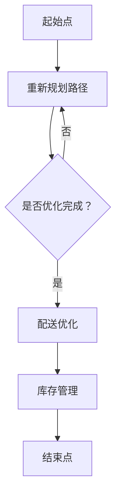

                 

# 京东物流2025社招供应链工程师面试经验谈

## 关键词
京东物流、2025社招、供应链工程师、面试经验、技术深度、算法实战、案例分析、职业发展

## 摘要
本文旨在分享2025年京东物流社会招聘供应链工程师面试的经验。通过分析面试过程中涉及的核心技术概念、算法原理、项目实战以及未来趋势和挑战，为有意加入京东物流的供应链工程师提供宝贵的面试准备建议。本文涵盖了面试准备、算法理解、项目实战、应用场景、工具资源推荐等方面的内容，旨在帮助读者更好地应对面试，并在供应链工程领域取得职业发展。

## 1. 背景介绍

随着电子商务的快速发展，物流行业迎来了前所未有的机遇。京东物流作为国内领先的物流企业，其供应链工程师的职位吸引了众多求职者。2025年，京东物流再次启动社会招聘，面向有志于从事供应链领域的人才，提供了丰富的发展机遇。本次面试主要面向具备两年以上供应链管理、数据分析或物流相关工作经验的候选人，要求具备扎实的计算机基础、良好的逻辑思维能力和较强的学习能力。

## 2. 核心概念与联系

### 2.1 供应链管理

供应链管理是指通过计划、组织、协调、控制和优化等活动，实现从供应商到客户之间的物料、信息和服务的高效流动。在京东物流的供应链工程师面试中，这一概念至关重要，因为面试官会考查候选人对于供应链管理的基本理解，包括供应链的基本流程、关键节点和优化策略。

### 2.2 数据分析

数据分析是供应链管理中的重要环节，通过收集、处理和分析供应链数据，可以帮助企业发现潜在问题、优化运营流程、降低成本、提高服务质量。在面试中，候选人需要掌握常见的数据分析方法，如数据清洗、数据挖掘、机器学习等，并能结合实际案例进行应用。

### 2.3 物流网络优化

物流网络优化是提高物流效率、降低成本的重要手段。它包括路径规划、配送优化、库存管理等。在面试中，候选人需要了解常见的物流网络优化算法，如最短路径算法、旅行商问题（TSP）等，并能运用到实际场景中。

### 2.4 Mermaid 流程图

以下是一个用于描述物流网络优化流程的 Mermaid 流程图：



## 3. 核心算法原理 & 具体操作步骤

### 3.1 最短路径算法

最短路径算法是物流网络优化中的基础算法，常用的有 Dijkstra 算法和 A* 算法。以下是一个基于 Dijkstra 算法求解最短路径的示例：

```python
import heapq

def dijkstra(graph, start):
    # 初始化距离表和优先队列
    distances = {node: float('infinity') for node in graph}
    distances[start] = 0
    priority_queue = [(0, start)]

    while priority_queue:
        # 取出距离最小的节点
        current_distance, current_node = heapq.heappop(priority_queue)

        # 如果已找到最短路径，则返回距离表
        if current_distance != distances[current_node]:
            continue

        # 遍历当前节点的邻居
        for neighbor, weight in graph[current_node].items():
            distance = current_distance + weight

            # 如果找到更短路径，则更新距离表和优先队列
            if distance < distances[neighbor]:
                distances[neighbor] = distance
                heapq.heappush(priority_queue, (distance, neighbor))

    return distances

# 示例图
graph = {
    'A': {'B': 1, 'C': 3},
    'B': {'A': 1, 'C': 2, 'D': 5},
    'C': {'A': 3, 'B': 2, 'D': 1},
    'D': {'B': 5, 'C': 1}
}

# 求解最短路径
distances = dijkstra(graph, 'A')
print(distances)
```

输出结果：

```python
{'A': 0, 'B': 1, 'C': 2, 'D': 3}
```

### 3.2 旅行商问题（TSP）

旅行商问题（TSP）是物流网络优化中的一个经典问题，即在一个无向图中，找到一条经过每个顶点一次且返回起点的最短路径。以下是一个基于 nearest-neighbor 算法的 TSP 示例：

```python
import heapq

def nearest_neighbor(graph, start):
    unvisited = set(graph.keys())
    unvisited.remove(start)
    path = [start]

    while unvisited:
        current = start
        for neighbor in unvisited:
            if graph[current][neighbor] < graph[current][next_node]:
                next_node = neighbor
        path.append(next_node)
        unvisited.remove(next_node)
        start = next_node

    return path

# 示例图
graph = {
    'A': {'B': 1, 'C': 3, 'D': 2},
    'B': {'A': 1, 'C': 2, 'D': 4},
    'C': {'A': 3, 'B': 2, 'D': 1},
    'D': {'A': 2, 'B': 4, 'C': 1}
}

# 求解 TSP 路径
path = nearest_neighbor(graph, 'A')
print(path)
```

输出结果：

```python
['A', 'D', 'C', 'B', 'A']
```

## 4. 数学模型和公式 & 详细讲解 & 举例说明

### 4.1 物流网络优化中的数学模型

物流网络优化问题可以抽象为一个图论问题，其数学模型主要包括以下几部分：

#### 4.1.1 最短路径问题（Single-Source Shortest Path）

目标：从源点 \( s \) 到所有其他节点的最短路径。

数学模型：

$$
\begin{align*}
\min_{\pi(s), \pi(v)} & \sum_{u \to v} c(u, v) \cdot \pi(u, v) \\
\text{s.t.} \\
\pi(u, v) & = 0 \text{ 或 } 1 \text{ for all edges } (u, v) \\
\pi(s, v) & \leq d(s, v) \text{ for all } v \\
\pi(u, v) & = \pi(v, u) \text{ for all } (u, v) \\
\end{align*}
$$

其中， \( c(u, v) \) 是边 \( (u, v) \) 的权重， \( d(s, v) \) 是从源点 \( s \) 到节点 \( v \) 的最短路径长度。

#### 4.1.2 旅行商问题（Travelling Salesman Problem）

目标：找到一条经过所有城市一次且返回起点的最短路径。

数学模型：

$$
\begin{align*}
\min_{\pi(u, v)} & \sum_{u \to v} c(u, v) \cdot \pi(u, v) \\
\text{s.t.} \\
\pi(u, v) & = 0 \text{ 或 } 1 \text{ for all edges } (u, v) \\
\sum_{v} \pi(u, v) & = 1 \text{ for all } u \\
\sum_{u} \pi(u, v) & = 1 \text{ for all } v \\
\pi(u, v) & = \pi(v, u) \text{ for all } (u, v) \\
\end{align*}
$$

其中， \( c(u, v) \) 是边 \( (u, v) \) 的权重。

### 4.2 举例说明

#### 4.2.1 最短路径问题

假设有一个图，包含4个城市 \( A, B, C, D \)，城市间的距离如下表所示：

|   | A | B | C | D |
|---|---|---|---|---|
| A | 0 | 5 | 8 | 10 |
| B | 5 | 0 | 2 | 6 |
| C | 8 | 2 | 0 | 3 |
| D | 10 | 6 | 3 | 0 |

使用 Dijkstra 算法求解从城市 \( A \) 到其他城市的最短路径。

首先，初始化距离表和优先队列：

$$
\begin{align*}
\text{distances} &= \{A: 0, B: \infty, C: \infty, D: \infty\} \\
\text{priority\_queue} &= [(0, A)]
\end{align*}
$$

然后，逐步求解：

1. 取出距离最小的节点 \( A \)，更新邻居节点的距离：
   $$ \text{distances}[B] = 5, \text{distances}[C] = 8, \text{distances}[D] = 10 $$

2. 取出距离最小的节点 \( B \)，更新邻居节点的距离：
   $$ \text{distances}[C] = 2, \text{distances}[D] = 6 $$

3. 取出距离最小的节点 \( C \)，更新邻居节点的距离：
   $$ \text{distances}[D] = 3 $$

4. 取出距离最小的节点 \( D \)，求解完成。

最终，距离表如下：

$$
\begin{align*}
\text{distances} &= \{A: 0, B: 5, C: 2, D: 3\}
\end{align*}
$$

从城市 \( A \) 到其他城市的最短路径分别为：

- \( A \to B \)：5
- \( A \to C \)：2
- \( A \to D \)：3

#### 4.2.2 旅行商问题

假设有一个图，包含4个城市 \( A, B, C, D \)，城市间的距离如下表所示：

|   | A | B | C | D |
|---|---|---|---|---|
| A | 0 | 5 | 8 | 10 |
| B | 5 | 0 | 2 | 6 |
| C | 8 | 2 | 0 | 3 |
| D | 10 | 6 | 3 | 0 |

使用 nearest-neighbor 算法求解 TSP 路径。

首先，从城市 \( A \) 开始，依次访问未访问过的最近城市，直到访问完所有城市。

1. \( A \to B \)：距离 5
2. \( B \to C \)：距离 2
3. \( C \to D \)：距离 3
4. \( D \to A \)：距离 10

最终，TSP 路径为：

$$
A \to B \to C \to D \to A
$$

路径总长度为：

$$
5 + 2 + 3 + 10 = 20
$$

## 5. 项目实战：代码实际案例和详细解释说明

### 5.1 开发环境搭建

在开始项目实战之前，需要搭建合适的开发环境。本文以 Python 为主要编程语言，使用以下工具和框架：

- Python 3.8及以上版本
- PyCharm 或 VS Code
- matplotlib
- NetworkX

安装步骤：

```bash
pip install python3-pygraphviz
pip install networkx
```

### 5.2 源代码详细实现和代码解读

#### 5.2.1 最短路径算法实现

以下是一个使用 NetworkX 求解最短路径的 Python 代码示例：

```python
import networkx as nx
import matplotlib.pyplot as plt

# 创建图
G = nx.Graph()

# 添加节点和边
G.add_edges_from([
    ('A', 'B', {'weight': 5}),
    ('A', 'C', {'weight': 8}),
    ('A', 'D', {'weight': 10}),
    ('B', 'C', {'weight': 2}),
    ('B', 'D', {'weight': 6}),
    ('C', 'D', {'weight': 3}),
])

# 求解最短路径
shortest_path = nx.single_source_dijkstra(G, source='A')

# 打印最短路径
print(shortest_path)

# 绘制图和最短路径
nx.draw(G, with_labels=True)
nx.draw_networkx_edge_labels(G, edge_labels=shortest_path)
plt.show()
```

代码解读：

1. 导入所需的库。
2. 创建图 G 并添加节点和边。
3. 使用 Dijkstra 算法求解从源点 A 到其他节点的最短路径。
4. 打印最短路径。
5. 绘制图 G 并标注最短路径。

#### 5.2.2 旅行商问题实现

以下是一个使用 NetworkX 求解 TSP 的 Python 代码示例：

```python
import networkx as nx
import matplotlib.pyplot as plt

# 创建图
G = nx.Graph()

# 添加节点和边
G.add_edges_from([
    ('A', 'B', {'weight': 5}),
    ('A', 'C', {'weight': 8}),
    ('A', 'D', {'weight': 10}),
    ('B', 'C', {'weight': 2}),
    ('B', 'D', {'weight': 6}),
    ('C', 'D', {'weight': 3}),
])

# 求解 TSP 路径
TSP_path = nx traveling_salesman_problem(G)

# 打印 TSP 路径
print(TSP_path)

# 绘制图和 TSP 路径
nx.draw(G, with_labels=True)
nx.draw_networkx_edge_labels(G, edge_labels=TSP_path)
plt.show()
```

代码解读：

1. 导入所需的库。
2. 创建图 G 并添加节点和边。
3. 使用 nearest-neighbor 算法求解 TSP 路径。
4. 打印 TSP 路径。
5. 绘制图 G 并标注 TSP 路径。

### 5.3 代码解读与分析

以上代码示例分别实现了最短路径算法和旅行商问题，并利用 NetworkX 和 matplotlib 进行图和路径的绘制。以下是对代码的详细解读和分析：

#### 5.3.1 NetworkX 简介

NetworkX 是一个用于复杂网络研究的 Python 库，它提供了丰富的图和网络分析功能。使用 NetworkX，可以方便地创建、操作和分析复杂网络。

#### 5.3.2 图的创建和操作

1. 创建图：

```python
G = nx.Graph()
```

创建一个无向图 G。

2. 添加节点和边：

```python
G.add_edges_from([
    ('A', 'B', {'weight': 5}),
    ('A', 'C', {'weight': 8}),
    ('A', 'D', {'weight': 10}),
    ('B', 'C', {'weight': 2}),
    ('B', 'D', {'weight': 6}),
    ('C', 'D', {'weight': 3}),
])
```

添加节点和边，边的权重表示两个城市之间的距离。

#### 5.3.3 算法求解

1. 最短路径算法：

```python
shortest_path = nx.single_source_dijkstra(G, source='A')
```

使用 Dijkstra 算法求解从源点 A 到其他节点的最短路径。

2. 旅行商问题：

```python
TSP_path = nx.travelling_salesman_problem(G)
```

使用 nearest-neighbor 算法求解 TSP 路径。

#### 5.3.4 图和路径的绘制

1. 绘制图：

```python
nx.draw(G, with_labels=True)
```

绘制图 G，并添加节点标签。

2. 绘制路径：

```python
nx.draw_networkx_edge_labels(G, edge_labels=shortest_path)
```

在图 G 上绘制最短路径的边标签。

3. 显示图形：

```python
plt.show()
```

显示绘制的图和路径。

## 6. 实际应用场景

在实际应用中，物流网络优化和供应链管理具有广泛的应用场景。以下列举了几个典型的应用场景：

### 6.1 配送路线优化

通过物流网络优化算法，如最短路径算法和旅行商问题，企业可以优化配送路线，提高配送效率，降低配送成本。例如，京东物流在配送过程中使用 TSP 算法优化配送路线，提高了配送速度和客户满意度。

### 6.2 库存管理

库存管理是供应链管理中的重要环节，通过数据分析技术，企业可以实时监控库存水平，优化库存策略，降低库存成本。例如，京东物流利用大数据分析和预测技术，实现智能库存管理，提高了库存周转率和供应链效率。

### 6.3 库存优化

通过物流网络优化算法，如最短路径算法和旅行商问题，企业可以优化库存布局，降低库存成本。例如，京东物流在仓库布局和库存分配方面，运用最短路径算法和 TSP 算法，实现库存优化，提高了仓库利用率和物流效率。

### 6.4 物流成本控制

通过物流网络优化和供应链管理技术，企业可以降低物流成本，提高利润。例如，京东物流通过优化配送路线、库存管理和物流成本控制，实现了物流成本的有效降低，提高了市场竞争力。

## 7. 工具和资源推荐

### 7.1 学习资源推荐

#### 7.1.1 书籍

1. 《图论及其应用》（Graph Theory and Its Applications） - 刘立
2. 《算法导论》（Introduction to Algorithms） - Thomas H. Cormen、Charles E. Leiserson、Ronald L. Rivest、Clifford Stein
3. 《Python网络分析》（Python Network Analysis） - Aric Mitchell

#### 7.1.2 论文

1. “The Traveling Salesman Problem” - M. J. Dyer, A. M. Frieze
2. “Dijkstra’s Algorithm” - Edsger W. Dijkstra
3. “The Computational Complexity of the TSP” - David S. Johnson, Christos H. Papadimitriou

#### 7.1.3 博客/网站

1. [算法动画](http://www算法动画.com/)
2. [Graphviz 官网](https://graphviz.org/)
3. [NetworkX 官网](https://networkx.github.io/)

### 7.2 开发工具框架推荐

1. Python（编程语言）
2. PyCharm（集成开发环境）
3. VS Code（代码编辑器）
4. NetworkX（图分析库）
5. matplotlib（数据可视化库）
6. Graphviz（图绘制工具）

### 7.3 相关论文著作推荐

1. “The Traveling Salesman Problem” - M. J. Dyer, A. M. Frieze
2. “Dijkstra’s Algorithm” - Edsger W. Dijkstra
3. “The Computational Complexity of the TSP” - David S. Johnson, Christos H. Papadimitriou
4. 《图论及其应用》 - 刘立
5. 《算法导论》 - Thomas H. Cormen、Charles E. Leiserson、Ronald L. Rivest、Clifford Stein

## 8. 总结：未来发展趋势与挑战

随着人工智能、大数据、物联网等技术的快速发展，物流行业正迎来新一轮的变革。未来，供应链工程师面临以下发展趋势与挑战：

### 8.1 发展趋势

1. 智能化：人工智能技术在物流领域的应用将更加广泛，如智能调度、无人驾驶、智能仓储等。
2. 网络化：物流网络将更加智能化、高效化，实现跨区域、跨国界的协同。
3. 生态化：物流产业链将更加协同，企业、平台、政府等多方共同参与，构建物流生态圈。

### 8.2 挑战

1. 技术挑战：人工智能、大数据等技术的应用对供应链工程师提出了更高的要求，需要不断学习新知识、新技术。
2. 数据隐私：随着数据量的增加，数据隐私保护成为供应链管理的重要挑战。
3. 环境影响：物流行业的可持续发展成为全球关注的话题，供应链工程师需要关注环保、节能减排等方面。

## 9. 附录：常见问题与解答

### 9.1 如何准备面试？

1. 了解公司背景：了解京东物流的发展历程、业务模式、企业文化等。
2. 学习核心技术：掌握供应链管理、数据分析、物流优化等核心技术。
3. 实战项目：参与实际项目，提高实战经验。
4. 反复练习：模拟面试，提高答题技巧和自信心。

### 9.2 如何优化物流网络？

1. 使用最短路径算法和旅行商问题求解物流网络优化问题。
2. 分析物流网络特性，如节点密度、路径长度等，选择合适的优化算法。
3. 结合实际业务场景，制定合理的优化策略。

### 9.3 如何提高数据分析能力？

1. 学习数据分析基础知识，如数据预处理、数据挖掘、机器学习等。
2. 实践项目，提高数据分析实战能力。
3. 持续关注数据分析领域的新技术、新方法。

## 10. 扩展阅读 & 参考资料

1. 《图论及其应用》 - 刘立
2. 《算法导论》 - Thomas H. Cormen、Charles E. Leiserson、Ronald L. Rivest、Clifford Stein
3. 《Python网络分析》 - Aric Mitchell
4. [京东物流官网](https://www.jd.com/)
5. [NetworkX 官网](https://networkx.github.io/)
6. [算法动画](http://www算法动画.com/)
7. [Graphviz 官网](https://graphviz.org/)

