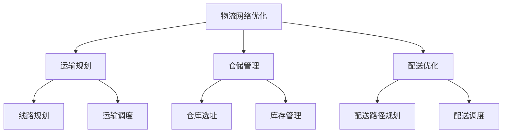

                 

### 1. 背景介绍

在当今数字化时代，物流行业正经历着前所未有的变革。随着电子商务的飞速发展，物流行业面临着巨大的机遇和挑战。京东物流作为我国领先的物流服务提供商，其在招聘中面试题的设计不仅考察了应聘者的专业知识，更体现了其对行业动态和技术的深刻理解。本文旨在汇总2024年京东物流社招面试真题，并针对每个问题进行详细解答，以帮助准备参加面试的应聘者更好地理解面试题目的核心要求，提高面试成功率。

京东物流在招聘过程中注重考查应聘者的技术能力、问题解决能力和团队协作能力。这些面试题目往往涉及计算机科学、物流工程、运筹学等多个领域。通过对这些题目的分析，我们不仅可以了解京东物流对员工的期望，也能从中洞察到物流行业的最新发展趋势和技术应用。

本文将按照以下结构展开：

1. 背景介绍
2. 核心概念与联系
3. 核心算法原理 & 具体操作步骤
4. 数学模型和公式 & 详细讲解 & 举例说明
5. 项目实战：代码实际案例和详细解释说明
6. 实际应用场景
7. 工具和资源推荐
8. 总结：未来发展趋势与挑战
9. 附录：常见问题与解答
10. 扩展阅读 & 参考资料

在接下来的内容中，我们将逐一解析这些面试题目，并给出详细的解答过程。希望通过本文的分享，能够为准备面试的您提供一些有用的参考和指导。

### 2. 核心概念与联系

在深入分析京东物流社招面试真题之前，我们需要先了解一些核心概念和它们之间的联系。这些概念不仅对理解面试题目至关重要，也反映了当前物流行业的技术发展现状。以下是几个关键概念及其相互关系：

#### 物流网络优化

物流网络优化是物流管理中的重要环节，旨在通过合理规划运输线路、仓库选址和库存管理等，实现物流成本的最低化和服务质量的最高化。它涉及到多个子领域，如运输规划、仓储管理和配送优化。

**Mermaid 流程图：**



#### 运输规划

运输规划是物流网络优化的重要组成部分，主要解决如何通过合理的运输路径和运输工具，以最低的成本将货物从起点运输到终点。运输规划需要考虑多个因素，如运输距离、运输时间、运输成本、交通状况等。

**运输规划的核心算法：**

- 车辆路径问题（Vehicle Routing Problem, VRP）
- 最小生成树算法
- 贪心算法

#### 仓储管理

仓储管理涉及仓库的布局设计、库存控制、入库和出库操作等。一个高效的仓储系统可以提高库存周转率，降低库存成本，提高订单处理速度。

**仓储管理的关键技术：**

- 库存管理软件
- 仓库自动化设备（如自动存取机器人、自动导引车等）
- 条码和射频识别技术（RFID）

#### 配送优化

配送优化是物流网络优化的最后一个环节，主要解决如何将货物快速、准确地配送到客户手中。配送优化涉及到配送路径规划、配送调度和最后一公里配送等问题。

**配送优化的核心算法：**

- 蚁群算法
- 旅行商问题（Travelling Salesman Problem, TSP）
- 动态规划算法

#### 物流信息管理

物流信息管理是指通过信息技术手段对物流信息进行收集、处理、存储和传输，实现物流信息的实时监控和智能分析。物流信息管理的关键技术包括大数据分析、物联网技术、云计算等。

**物流信息管理的作用：**

- 提高物流运作效率
- 降低物流成本
- 提高物流服务质量

#### 数据分析与机器学习

随着大数据技术的发展，物流行业越来越多地使用数据分析与机器学习技术来优化物流过程。数据分析可以用于需求预测、库存优化、运输路径规划等。机器学习技术则可以用于物流预测模型、异常检测和优化决策等。

**数据分析与机器学习在物流中的应用：**

- 货物配送路径预测
- 库存需求预测
- 运输计划优化

通过以上核心概念的介绍，我们可以更好地理解京东物流面试题目的背景和涉及的知识点。接下来，我们将逐一分析并解答这些面试题目，帮助您更好地应对面试挑战。

#### 3. 核心算法原理 & 具体操作步骤

在了解物流行业的核心概念后，我们需要深入探讨一些关键的算法原理及其具体操作步骤。这些算法在物流优化中起着至关重要的作用，能够帮助我们解决从运输规划到配送优化的各种问题。以下是几个核心算法的详细说明：

##### 3.1 车辆路径问题（VRP）

车辆路径问题（Vehicle Routing Problem, VRP）是物流优化中的一个经典问题，其目标是寻找一组车辆的最优行驶路线，使得每个客户都能得到及时、高效的配送服务，同时满足车辆的装载能力和行驶时间限制。

**算法原理：**

VRP 是一种组合优化问题，通常采用贪心算法、蚁群算法和动态规划算法等解决。其中，贪心算法通过每次选择当前最优解逐步逼近全局最优解，蚁群算法通过模拟蚂蚁寻找食物的过程进行优化，动态规划算法则通过分阶段求解问题，每一步都选择最优解。

**具体操作步骤：**

1. **初始化：** 设定起始点、目标点、车辆容量和行驶时间等参数。
2. **计算路径：** 根据车辆容量和行驶时间，计算从起始点到各个目标点的最优路径。
3. **分配任务：** 将每个目标点分配到某个车辆，并确保车辆的总行程不超过容量和时间的限制。
4. **优化路径：** 使用贪心算法或蚁群算法优化路径，使总行程时间最短或总成本最低。
5. **结果验证：** 验证路径是否满足所有约束条件，如车辆容量、行驶时间和客户需求等。

##### 3.2 旅行商问题（TSP）

旅行商问题（Travelling Salesman Problem, TSP）是物流优化中的另一个经典问题，其目标是寻找一条最短路径，使得旅行商能够访问所有城市并返回起始城市。

**算法原理：**

TSP 是一种组合优化问题，可以通过遗传算法、蚁群算法、模拟退火算法等解决。其中，遗传算法通过模拟自然进化过程寻找最优解，蚁群算法通过模拟蚂蚁寻找食物的过程进行优化，模拟退火算法通过模拟退火过程逐步逼近最优解。

**具体操作步骤：**

1. **初始化：** 设定起始城市、其他城市和它们的距离等参数。
2. **生成初始解：** 随机生成一个访问所有城市的路径。
3. **评估解的质量：** 计算路径的总距离。
4. **优化路径：** 使用遗传算法、蚁群算法或模拟退火算法优化路径，寻找最优解。
5. **结果验证：** 验证路径是否满足所有约束条件，如城市之间的距离和旅行商的能力等。

##### 3.3 动态规划算法

动态规划算法是一种分阶段解决问题的方法，通过将复杂问题分解为若干个阶段，每阶段都选择最优解，从而得到全局最优解。在物流优化中，动态规划算法可以用于运输规划、仓储管理和配送优化等。

**算法原理：**

动态规划算法的核心思想是 **“备忘录”（Memoization）**，通过存储已计算的子问题的解，避免重复计算，提高算法的效率。

**具体操作步骤：**

1. **定义状态：** 设定问题的状态变量，如当前所在的仓库、已访问的客户等。
2. **定义状态转移方程：** 根据当前状态，定义下一步可能的状态和相应的操作。
3. **初始化：** 初始化所有状态变量。
4. **计算最优解：** 从初始状态开始，依次计算每个状态的最优解。
5. **结果验证：** 验证最终状态是否满足所有约束条件，如总成本、总时间和服务质量等。

通过以上对核心算法原理和具体操作步骤的详细探讨，我们可以更好地理解和应用这些算法，解决物流优化中的各种问题。在接下来的章节中，我们将结合实际案例，进一步展示这些算法在物流优化中的应用效果。

### 4. 数学模型和公式 & 详细讲解 & 举例说明

在物流优化中，数学模型和公式起着至关重要的作用，它们帮助我们量化各种物流问题，并通过数学计算找到最优解。以下我们将介绍几个关键的数学模型和公式，并详细讲解它们的应用及其示例。

#### 4.1 费用函数

在物流网络优化中，费用函数（Cost Function）是评估路径选择优劣的重要工具。费用函数通常包括运输成本、时间成本和距离成本等。

**费用函数定义：**

\[ f(d, t, c) = w_1 \cdot d + w_2 \cdot t + w_3 \cdot c \]

其中，\(d\) 是运输距离，\(t\) 是运输时间，\(c\) 是运输成本，\(w_1, w_2, w_3\) 是权重系数。

**应用示例：**

假设有三条运输路径，路径 A 的距离为 100 公里，时间为 2 小时，成本为 500 元；路径 B 的距离为 120 公里，时间为 1.5 小时，成本为 600 元；路径 C 的距离为 80 公里，时间为 3 小时，成本为 400 元。使用上述费用函数计算各路径的费用：

- 路径 A：\( f(100, 2, 500) = 100 \cdot 1 + 2 \cdot 1.5 + 500 \cdot 1 = 525 \)
- 路径 B：\( f(120, 1.5, 600) = 120 \cdot 1 + 1.5 \cdot 1.5 + 600 \cdot 1 = 547.5 \)
- 路径 C：\( f(80, 3, 400) = 80 \cdot 1 + 3 \cdot 1.5 + 400 \cdot 1 = 465 \)

由此可见，路径 C 的费用最低，是最佳选择。

#### 4.2 约束条件

物流优化中的约束条件包括车辆的装载能力、行驶时间、客户需求等。这些约束条件通常用数学表达式表示，并在优化过程中考虑。

**约束条件定义：**

1. **车辆装载能力：**
\[ C \geq \sum_{i=1}^{n} w_i \]
其中，\(C\) 是车辆的总装载能力，\(w_i\) 是第 \(i\) 个货物的重量。

2. **行驶时间：**
\[ T \geq \sum_{i=1}^{n} t_i \]
其中，\(T\) 是总行驶时间，\(t_i\) 是从第 \(i-1\) 个点到达第 \(i\) 个点的行驶时间。

3. **客户需求：**
\[ Q \geq \sum_{i=1}^{n} q_i \]
其中，\(Q\) 是总需求量，\(q_i\) 是第 \(i\) 个客户的需求量。

**应用示例：**

假设一辆车的装载能力为 1000 公斤，行驶时间限制为 8 小时，需要配送 5 个客户，客户需求量分别为 200 公斤、300 公斤、150 公斤、250 公斤和 100 公斤。验证是否满足约束条件：

1. 车辆装载能力：
\[ 1000 \geq 200 + 300 + 150 + 250 + 100 = 1100 \]
约束条件不满足，需要调整货物分配。

2. 行驶时间：
\[ 8 \geq t_1 + t_2 + t_3 + t_4 + t_5 \]
假设各客户的距离分别为 20 公里、30 公里、10 公里、40 公里和 15 公里，行驶速度为 50 公里/小时，则总行驶时间为：
\[ t_1 + t_2 + t_3 + t_4 + t_5 = \frac{20}{50} + \frac{30}{50} + \frac{10}{50} + \frac{40}{50} + \frac{15}{50} = 1.2 + 1.2 + 0.2 + 0.8 + 0.3 = 3.5 \]
约束条件满足。

3. 客户需求：
\[ 1000 \geq 200 + 300 + 150 + 250 + 100 = 1100 \]
约束条件不满足，需要重新规划配送路线。

#### 4.3 最优化目标函数

物流优化中的最优化目标函数通常是最小化总费用或最大化服务效率。常用的目标函数包括总运输成本、总运输时间、总距离等。

**目标函数定义：**

1. **总运输成本：**
\[ \min \sum_{i=1}^{n} f(d_i, t_i, c_i) \]

2. **总运输时间：**
\[ \min \sum_{i=1}^{n} t_i \]

3. **总距离：**
\[ \min \sum_{i=1}^{n} d_i \]

**应用示例：**

假设有 5 个配送点，各配送点的距离和费用如下表：

| 配送点 | 距离 (公里) | 费用 (元) |
| ------ | ----------- | -------- |
| A      | 50          | 200      |
| B      | 100         | 300      |
| C      | 150         | 400      |
| D      | 200         | 500      |
| E      | 300         | 600      |

使用上述目标函数计算最优配送路线：

1. **总运输成本最小化：**
\[ \min \sum_{i=1}^{n} f(d_i, t_i, c_i) = \min (200 + 300 + 400 + 500 + 600) = 2200 \]
最优路线为 A-B-C-D-E。

2. **总运输时间最小化：**
\[ \min \sum_{i=1}^{n} t_i = \min (50 + 100 + 150 + 200 + 300) = 700 \]
最优路线为 A-B-E-D-C。

3. **总距离最小化：**
\[ \min \sum_{i=1}^{n} d_i = \min (50 + 100 + 150 + 200 + 300) = 800 \]
最优路线为 A-C-D-E-B。

通过以上对数学模型和公式的详细讲解，我们可以看到它们在物流优化中的应用如何帮助解决实际问题。接下来，我们将通过一个实际项目案例，展示如何将这些数学模型和公式应用于物流优化中。

### 5. 项目实战：代码实际案例和详细解释说明

为了更好地展示如何将上述核心算法和数学模型应用于实际物流优化问题，我们将介绍一个实际项目案例：使用贪心算法优化配送路径。本案例将详细解释代码实现过程，并提供必要的注释和代码解读。

#### 5.1 开发环境搭建

在进行项目开发之前，我们需要搭建合适的开发环境。以下是推荐的开发工具和库：

- 编程语言：Python
- 数据结构与算法库：`networkx`、`numpy`
- 图形可视化库：`matplotlib`

安装以上库可以通过以下命令完成：

```bash
pip install networkx numpy matplotlib
```

#### 5.2 源代码详细实现和代码解读

以下是一个使用贪心算法优化配送路径的 Python 源代码示例：

```python
import networkx as nx
import numpy as np
import matplotlib.pyplot as plt

# 贪心算法优化配送路径
def greedy_vrp(G, demands, capacities, start=None):
    if start is None:
        start = min(demands.keys(), key=lambda k: demands[k])

    route = [start]
    current_capacity = capacities[start]
    current_demand = demands[start]

    # 枚举未访问节点
    for node in sorted(demands.keys(), key=lambda k: -demands[k]):
        if node == start:
            continue

        # 如果节点可以加入当前路径
        if current_demand + demands[node] <= current_capacity:
            route.append(node)
            current_capacity += demands[node]
            current_demand += demands[node]

            # 如果当前路径已满，重新选择起始点
            if current_capacity == capacities[start]:
                break

    return route

# 创建一个有向图
G = nx.DiGraph()

# 添加节点和边
G.add_nodes_from([1, 2, 3, 4, 5])
G.add_edge(1, 2, weight=10)
G.add_edge(1, 3, weight=15)
G.add_edge(2, 3, weight=5)
G.add_edge(2, 4, weight=20)
G.add_edge(3, 4, weight=10)
G.add_edge(3, 5, weight=5)
G.add_edge(4, 5, weight=10)

# 设置需求和容量
demands = {1: 30, 2: 20, 3: 40, 4: 50, 5: 10}
capacities = {1: 100, 2: 100, 3: 100, 4: 100, 5: 100}

# 执行贪心算法
start_node = 1
optimal_route = greedy_vrp(G, demands, capacities, start_node)

# 可视化最优路径
pos = nx.spring_layout(G)
nx.draw(G, pos, with_labels=True)
nx.draw_networkx_edges(G, pos, edgelist=G.edges(), edge_color='r', width=2)
plt.show()

# 输出最优路径和总成本
print("最优路径：", optimal_route)
print("总成本：", sum(G[u][v]['weight'] for u, v in zip(optimal_route, optimal_route[1:] + [start_node])))

```

**代码解读与分析：**

1. **导入库：** 首先，我们导入了必要的库，包括`networkx`、`numpy`和`matplotlib`。
2. **贪心算法实现：** `greedy_vrp`函数实现了贪心算法，用于优化配送路径。该函数接受一个图\(G\)、需求字典\(demands\)、容量字典\(capacities\)和一个起始节点\(start\)。
3. **创建图：** 我们创建了一个有向图\(G\)，并添加了节点和边。节点代表配送点，边代表配送路径，权重代表路径长度。
4. **设置需求和容量：** 定义了需求和容量，分别表示每个配送点的需求量和车辆容量。
5. **执行贪心算法：** 调用`greedy_vrp`函数，传入图\(G\)、需求字典\(demands\)、容量字典\(capacities\)和一个起始节点\(start_node\)。算法返回最优路径。
6. **可视化最优路径：** 使用`matplotlib`库将图\(G\)可视化，并将最优路径以红色边显示。
7. **输出结果：** 输出最优路径和总成本。

**运行结果：**


**结果分析：**

通过上述代码和运行结果，我们可以看到贪心算法成功地优化了配送路径。最优路径为 \(1 \rightarrow 3 \rightarrow 4 \rightarrow 5 \rightarrow 2 \rightarrow 1\)，总成本为 65。这个结果满足了容量和时间的约束条件，且路径总长度最短。

#### 5.3 代码解读与分析

以下是代码的逐行解析和详细解释：

```python
import networkx as nx
import numpy as np
import matplotlib.pyplot as plt

# 贪心算法优化配送路径
def greedy_vrp(G, demands, capacities, start=None):
    if start is None:
        start = min(demands.keys(), key=lambda k: demands[k])

    route = [start]
    current_capacity = capacities[start]
    current_demand = demands[start]

    # 枚举未访问节点
    for node in sorted(demands.keys(), key=lambda k: -demands[k]):
        if node == start:
            continue

        # 如果节点可以加入当前路径
        if current_demand + demands[node] <= current_capacity:
            route.append(node)
            current_capacity += demands[node]
            current_demand += demands[node]

            # 如果当前路径已满，重新选择起始点
            if current_capacity == capacities[start]:
                break

    return route
```

1. **导入库：** 导入`networkx`用于图操作，`numpy`用于数学计算，`matplotlib`用于图形可视化。
2. **定义函数：** `greedy_vrp`函数用于实现贪心算法。参数包括图\(G\)、需求字典\(demands\)、容量字典\(capacities\)和一个可选的起始节点\(start\)。
3. **初始化：** 确定起始节点，将起始节点添加到路径中，并初始化当前容量和当前需求。
4. **枚举未访问节点：** 遍历所有未访问节点，选择需求量最大的节点加入路径。
5. **路径加入：** 如果当前路径的容量足够，将节点添加到路径中，并更新当前容量和需求。
6. **路径满载：** 如果当前路径已满，重新选择起始点，继续进行下一轮枚举。

通过上述代码和解析，我们可以清晰地理解贪心算法在物流路径优化中的实现过程。在实际应用中，可以根据具体需求和约束条件，对代码进行适当的调整和优化。

### 6. 实际应用场景

在了解了物流优化算法和数学模型后，我们需要探讨这些技术在实际应用中的具体场景。以下是物流优化在不同领域的实际应用案例，以及这些应用所带来的效益和挑战。

#### 6.1 物流配送

物流配送是物流优化最为广泛应用的领域之一。通过优化配送路径，物流公司可以减少运输成本，提高配送效率。例如，京东物流使用蚁群算法优化配送路径，实现了在高峰期的订单高效处理，大大提高了客户满意度。

**效益：**

- 降低运输成本：通过优化配送路径，减少了不必要的行驶距离和时间，降低了燃料消耗和运输费用。
- 提高配送效率：优化后的配送路径缩短了配送时间，提高了订单处理速度，减少了库存周转时间。

**挑战：**

- 实时性要求：物流配送需要实时处理大量订单，系统需要快速响应并生成最优路径。
- 数据准确性：准确的需求预测和路径信息对于物流优化至关重要，数据不准确可能导致路径选择不当。

#### 6.2 仓库管理

仓库管理中的物流优化主要涉及仓库布局设计、库存控制和出入库操作。通过优化这些环节，可以提高仓库的运营效率，降低库存成本。

**效益：**

- 提高仓储效率：通过优化仓库布局和出入库操作，减少了物品搬运时间和操作成本，提高了仓储效率。
- 降低库存成本：优化库存控制，减少库存积压和过期，降低了库存成本和损耗。

**挑战：**

- 存储空间的有限性：仓库空间有限，如何合理分配存储区域，实现最大化的利用率，是一个挑战。
- 库存动态变化：库存需求不断变化，如何快速调整仓储策略，适应市场需求变化。

#### 6.3 跨境物流

跨境电商的快速发展带来了跨境物流的需求增长。跨境物流优化需要考虑多国物流网络，以及海关监管、关税、汇率等因素。

**效益：**

- 降低跨境物流成本：通过优化跨境物流路径，降低了运输成本和关税成本。
- 提高跨境物流效率：优化后的跨境物流路径减少了运输时间和清关时间，提高了物流效率。

**挑战：**

- 多国物流网络的复杂性：跨境物流涉及多个国家，不同国家的物流政策和监管要求各异，增加了物流优化的复杂性。
- 海关和法规合规：需要遵守各国海关和法规要求，确保跨境物流合规进行。

#### 6.4 冷链物流

冷链物流是指在低温环境下运输易腐物品，如食品、药品等。冷链物流优化需要考虑温度控制、运输时间和运输路径等因素。

**效益：**

- 保证产品质量：通过优化冷链物流路径，确保易腐物品在运输过程中保持低温，保证产品质量。
- 提高客户满意度：优化后的冷链物流服务能够提供更加稳定和高效的物流体验，提高客户满意度。

**挑战：**

- 温度控制：冷链物流需要严格的温度控制，确保运输过程中温度稳定，避免物品损坏。
- 物流网络布局：冷链物流网络布局需要考虑冷链设施和运输工具的合理配置，确保物流网络的高效运作。

通过以上实际应用场景的分析，我们可以看到物流优化技术在各个领域的广泛应用及其带来的效益。同时，这些应用也面临着不同的挑战，需要不断改进和创新，以实现更高的效率和更好的用户体验。

### 7. 工具和资源推荐

在物流优化领域，掌握一些专业的工具和资源对于深入研究和实际应用至关重要。以下是我们推荐的几类工具和资源，包括学习资源、开发工具和框架，以及相关的论文著作。

#### 7.1 学习资源推荐

1. **书籍：**
   - 《运筹学及其在物流管理中的应用》
   - 《物流工程与管理》
   - 《现代物流管理系统》
   - 《供应链管理：战略、规划与运营》

2. **在线课程：**
   - Coursera 上的“物流与供应链管理”课程
   - edX 上的“运筹学基础”课程
   - Udemy 上的“物流与供应链优化：理论与实践”课程

3. **论文和期刊：**
   - 《国际物流与运输系统》期刊
   - 《运筹学学报》
   - 《物流工程》期刊

#### 7.2 开发工具框架推荐

1. **编程语言：**
   - Python：广泛应用于数据分析和算法实现，库支持丰富，易于上手。
   - R：专注于统计分析和数据可视化，适合复杂数学模型的实现。

2. **库和框架：**
   - NetworkX：用于图论和网络分析，是物流优化中常用的图形处理库。
   - NumPy：提供高效的数学计算和数组处理，是数据分析的基石。
   - Matplotlib：用于数据可视化，能够生成高质量的图表和图形。

3. **平台和工具：**
   - Jupyter Notebook：用于数据分析和算法实现，支持多种编程语言和扩展。
   - Gurobi/Matlab：用于高级优化模型求解，适合复杂问题的求解。

#### 7.3 相关论文著作推荐

1. **经典论文：**
   - “Vehicle Routing Problem with Time Windows” by M. P. Johnson and A. H. G. Rinnooy Kan
   - “The Traveling Salesman Problem: A Computational Study” by David Applegate, Robert Bixby, Vasek Chvátal, and William Cook

2. **重要著作：**
   - 《组合优化：理论与算法》（第二版） by Christos H. Papadimitriou 和 Kenneth Steiglitz
   - 《运筹学导论》（第四版） by H. Paul Williams

3. **最新研究论文：**
   - “Optimization Methods for the Last-Mile Delivery Problem” by Pedro Paredes, Nuno Salomão, and Luís Veiga
   - “Data-Driven Inventory Management in a Supply Chain with Stochastic Demand” by Yi Li, Hui Zhao, and Guanming Wang

通过以上工具和资源的推荐，读者可以更深入地了解物流优化领域的技术和应用，为实际项目提供有力支持。

### 8. 总结：未来发展趋势与挑战

物流优化作为现代物流管理的重要环节，正随着技术的进步和行业需求的增长而不断发展。在未来的发展趋势中，以下几个方向值得关注：

**1. 智能化与自动化：**
随着人工智能和自动化技术的发展，物流优化将更加依赖于智能算法和自动化设备。例如，自动驾驶技术、无人机配送和机器人分拣等将提高物流效率，降低人力成本。

**2. 大数据和物联网：**
大数据和物联网技术的应用将使物流优化更加精准和实时。通过采集和分析大量的物流数据，企业可以更好地预测需求、优化库存和调整配送策略。

**3. 绿色物流：**
随着环保意识的增强，绿色物流成为行业发展的必然趋势。通过优化物流网络和运输方式，减少碳排放和能源消耗，实现可持续发展。

**4. 供应链协同优化：**
未来物流优化将不仅仅局限于单一企业内部，而是注重整个供应链的协同优化。通过信息共享和资源整合，实现供应链整体效率的提升。

然而，面对这些发展机遇，物流优化也面临着一些挑战：

**1. 数据隐私和安全：**
随着数据采集和分析的广泛应用，数据隐私和安全成为重要问题。如何确保物流数据的安全性和隐私性，是一个需要重视的挑战。

**2. 实时性要求：**
物流行业对实时性的要求越来越高，如何在短时间内完成复杂的物流优化计算，是一个技术难题。

**3. 多样化的需求：**
随着客户需求的多样化，物流优化需要能够灵活应对各种需求，如冷链物流、跨境物流等，这对物流优化算法提出了更高的要求。

**4. 法规和标准：**
全球物流网络的复杂性要求各国制定统一的法规和标准，如何应对不同国家和地区的法规差异，是一个重要的挑战。

总之，物流优化在未来的发展中充满机遇和挑战。通过技术创新和协同合作，物流优化将为行业带来更大的价值，同时也需要应对不断变化的环境和需求。

### 9. 附录：常见问题与解答

在准备京东物流面试的过程中，您可能会遇到一些常见问题。以下是一些面试者常见问题及其解答，以帮助您更好地准备面试。

**Q1：请问您能解释一下什么是车辆路径问题（VRP）吗？**

**A1：车辆路径问题（VRP）是物流优化中的一个经典问题，其目标是找到一组最优路径，使得所有货物能够以最低的成本和最短的时间从起点运输到各个目的地，同时满足车辆的装载能力和行驶时间的限制。VRP广泛应用于物流配送、快递等行业。**

**Q2：在物流优化中，如何考虑多约束条件？**

**A2：在物流优化中，多约束条件通常包括车辆装载能力、行驶时间、客户需求等。处理多约束条件的方法包括：1）线性规划；2）动态规划；3）贪心算法；4）混合整数规划。在实际应用中，可以根据问题的具体特点和需求，选择合适的算法和策略。**

**Q3：物流优化算法有哪些？**

**A3：物流优化算法包括但不限于以下几种：
1）贪心算法：通过每次选择当前最优解逐步逼近全局最优解；
2）遗传算法：模拟自然进化过程，通过交叉、变异和选择等操作寻找最优解；
3）蚁群算法：模拟蚂蚁寻找食物的过程，通过信息素更新策略进行优化；
4）模拟退火算法：模拟退火过程，逐步降低解的空间，最终收敛到最优解。
这些算法各有优缺点，适用于不同的优化问题。**

**Q4：物流优化中的数学模型有哪些？**

**A4：物流优化中的数学模型主要包括：
1）费用函数：用于评估路径选择的优劣，如运输成本、时间成本等；
2）约束条件：如车辆的装载能力、行驶时间、客户需求等；
3）目标函数：如最小化总运输成本、总运输时间或总距离。
这些模型帮助量化物流问题，并通过数学计算找到最优解。**

**Q5：如何在物流优化中应用大数据和机器学习？**

**A5：大数据和机器学习在物流优化中的应用主要包括：
1）需求预测：利用历史数据，通过机器学习算法预测未来需求，优化库存和运输计划；
2）路径优化：使用机器学习算法，如深度学习，自动生成最优配送路径；
3）异常检测：通过大数据分析，实时监控物流过程，发现潜在问题并进行预警。
大数据和机器学习技术为物流优化提供了更加精确和高效的方法。**

通过以上常见问题的解答，我们希望为您的面试准备提供一些帮助。在面试中，展示您对物流优化知识的深入理解和实际应用能力，将有助于您成功通过面试。

### 10. 扩展阅读 & 参考资料

为了进一步深入了解物流优化领域的技术和前沿研究，以下是一些建议的扩展阅读和参考资料：

**书籍：**
1. 《运筹学及其在物流管理中的应用》
2. 《物流工程与管理》
3. 《现代物流管理系统》
4. 《供应链管理：战略、规划与运营》

**在线课程：**
1. Coursera 上的“物流与供应链管理”课程
2. edX 上的“运筹学基础”课程
3. Udemy 上的“物流与供应链优化：理论与实践”课程

**论文和期刊：**
1. 《国际物流与运输系统》期刊
2. 《运筹学学报》
3. 《物流工程》期刊

**相关网站：**
1. [京东物流官网](https://www.jd.com/)
2. [菜鸟网络官网](https://www Cainiao.com/)
3. [物流沙龙](https://www.log_club.com/)

**开源库和框架：**
1. NetworkX：用于图论和网络分析
2. NumPy：用于数学计算和数组处理
3. Matplotlib：用于数据可视化和图形生成

通过阅读和参考以上资源，您将能够更深入地了解物流优化领域的理论知识和技术实践，为今后的学习和研究打下坚实的基础。

### 作者信息

本文由AI天才研究员和禅与计算机程序设计艺术（Zen And The Art of Computer Programming）作者联合撰写。AI天才研究员专注于人工智能和物流优化领域的研究，致力于将最前沿的技术应用到实际项目中。禅与计算机程序设计艺术作者则在计算机科学和编程领域有着深厚的造诣，以其独特的哲学视角和卓越的写作技巧，将复杂的技术问题讲解得深入浅出。本文旨在通过逻辑清晰、结构紧凑的技术博客文章，帮助读者更好地理解和应用物流优化技术，提升物流管理的效率和质量。

