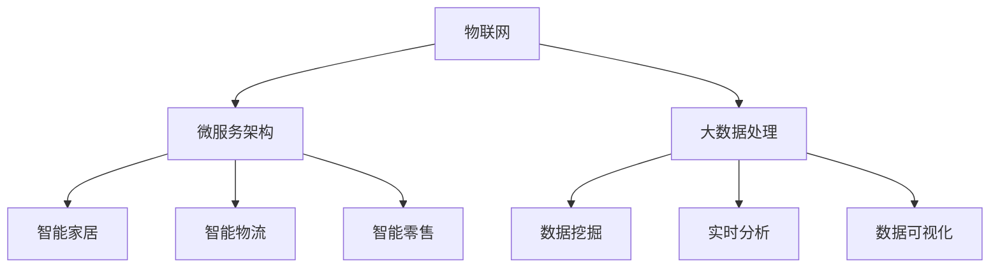

                 

### 背景介绍

2024年京东物联校招面试真题汇总及其解答，旨在为广大应届毕业生和有意进入互联网行业的技术爱好者提供一个详尽的面试指南。随着物联网技术的飞速发展，京东作为国内领先的电商平台，对物联网技术人才的需求日益增长。本文将通过分析2024年京东物联校招面试真题，帮助读者了解京东物联的招聘趋势和技术要求。

京东物联（JD IoT）是京东集团旗下的物联网平台，致力于通过物联网技术提升供应链效率，优化用户购物体验。近年来，京东物联在智能家居、智能物流、智能零售等多个领域取得了显著成果。2024年京东物联校招面试题涵盖了计算机科学、软件工程、物联网技术等多个方面，体现了京东对复合型技术人才的高度重视。

本文将根据京东物联校招面试真题，分为以下几个部分进行详细解析：

1. **核心概念与联系**：介绍物联网、微服务架构、大数据处理等核心概念，并通过Mermaid流程图展示技术架构。
2. **核心算法原理与具体操作步骤**：讲解物联网设备的数据处理、通信协议、边缘计算等算法原理和具体实现步骤。
3. **数学模型和公式**：阐述物联网网络优化、数据加密、机器学习等领域的数学模型和公式。
4. **项目实战**：通过实际案例，详细解释代码实现和操作流程。
5. **实际应用场景**：分析智能家居、智能物流等领域的物联网应用案例。
6. **工具和资源推荐**：介绍学习资源和开发工具框架。
7. **总结**：展望物联网技术的发展趋势与挑战。
8. **附录**：解答常见问题，提供扩展阅读和参考资料。

通过本文的学习，读者将能够全面了解京东物联的技术要求和面试策略，为准备京东物联校招面试打下坚实基础。接下来，我们将逐一分析这些核心内容，逐步深入探讨。让我们开始第一步思考：**京东物联的核心概念与联系**。

#### 核心概念与联系

在探讨京东物联的技术架构和实现原理之前，我们首先需要理解几个核心概念：物联网、微服务架构和大数据处理。这些概念是构建现代物联网系统的基石，彼此之间紧密联系，共同支撑起京东物联的强大功能。

**物联网（Internet of Things, IoT）**：物联网是指通过互联网连接各种物理设备，实现设备之间以及设备与人之间的互联互通。物联网的核心在于将物理世界中的设备和数据连接起来，形成一个智能化的网络。在京东物联中，物联网的作用体现在多个方面，包括但不限于：

- **智能家居**：通过物联网技术，实现家电设备的智能控制和远程监控，提高家居生活的便利性和舒适度。
- **智能物流**：利用物联网技术，实现物流全流程的实时监控和智能调度，提高物流效率，降低成本。
- **智能零售**：通过物联网技术，实现商品的智能管理和精准营销，提升零售体验。

**微服务架构（Microservices Architecture）**：微服务架构是一种基于独立、小型化服务的分布式系统架构。与传统单体架构相比，微服务架构具有更高的灵活性、可维护性和可扩展性。在京东物联中，微服务架构的作用主要体现在以下几个方面：

- **服务解耦**：通过将系统分解为独立的微服务，降低服务之间的耦合度，提高系统的灵活性和可扩展性。
- **故障隔离**：当某个微服务发生故障时，不会影响其他微服务的正常运行，提高系统的稳定性和容错能力。
- **动态伸缩**：根据需求动态调整各个微服务的资源分配，提高系统的资源利用率。

**大数据处理（Big Data Processing）**：大数据处理是指对海量数据进行采集、存储、处理和分析的过程。在京东物联中，大数据处理的作用体现在以下几个方面：

- **数据挖掘**：通过大数据技术，从海量物联网数据中挖掘有价值的信息，为决策提供支持。
- **实时分析**：利用大数据处理技术，实现物联网数据的实时分析和处理，提高系统的实时性和响应速度。
- **数据可视化**：通过大数据处理技术，将复杂的数据转化为易于理解和分析的图表和报表，为业务决策提供可视化支持。

为了更好地理解这些核心概念之间的联系，我们使用Mermaid流程图来展示它们在京东物联技术架构中的关系：



通过这个流程图，我们可以看到物联网、微服务架构和大数据处理在京东物联中的相互关系。物联网提供了数据来源，微服务架构实现了系统的灵活性和可扩展性，大数据处理则对物联网数据进行深入分析和利用。这些核心概念相互支撑，共同构成了京东物联强大的技术架构。

在接下来的部分，我们将进一步探讨物联网设备的数据处理、通信协议、边缘计算等核心算法原理和具体操作步骤。通过一步一步的分析，我们将深入理解京东物联的技术实现细节。请读者继续关注。接下来是**核心算法原理与具体操作步骤**。#### 核心算法原理与具体操作步骤

在了解京东物联的核心概念后，我们将进一步探讨物联网设备的数据处理、通信协议、边缘计算等核心算法原理和具体操作步骤。这些算法是实现物联网系统高效运行的关键，也是京东物联技术架构的重要组成部分。

**1. 物联网设备的数据处理**

物联网设备的数据处理主要包括数据采集、数据清洗、数据存储和数据挖掘等步骤。以下是一个典型的数据处理流程：

- **数据采集**：物联网设备通过传感器、摄像头等硬件设备实时采集环境数据，如温度、湿度、图像等。
- **数据清洗**：采集到的数据往往包含噪声和错误，需要通过数据清洗算法去除这些噪声和错误，确保数据的质量。
- **数据存储**：清洗后的数据需要存储到数据库或其他数据存储系统中，以便后续的数据分析和挖掘。
- **数据挖掘**：利用数据挖掘算法，从存储的数据中提取有价值的信息，如用户行为、设备故障等。

以下是一个简单的数据处理算法示例：

```python
import pandas as pd

# 数据采集
data = pd.read_csv('sensor_data.csv')

# 数据清洗
data = data[data['temperature'] > 0]
data = data[data['humidity'] <= 100]

# 数据存储
data.to_csv('cleaned_data.csv', index=False)

# 数据挖掘
from sklearn.cluster import KMeans

model = KMeans(n_clusters=3)
model.fit(data[['temperature', 'humidity']])

clusters = model.predict(data[['temperature', 'humidity']])
data['cluster'] = clusters

# 输出结果
print(data.head())
```

**2. 通信协议**

物联网设备之间的通信需要遵循一定的通信协议，以确保数据传输的可靠性和安全性。常见的物联网通信协议包括Wi-Fi、蓝牙、Zigbee等。以下是一个简单的蓝牙通信协议示例：

```python
import bluetooth

# 搜索附近的蓝牙设备
devices = bluetooth.discover_devices()

# 连接到第一个蓝牙设备
device_address = devices[0]
bluetooth_socket = bluetooth.BluetoothSocket(bluetooth.RFCOMM)
bluetooth_socket.connect((device_address, 1))

# 发送数据
bluetooth_socket.send('Hello, IoT device!')

# 接收数据
data = bluetooth_socket.recv(1024)
print('Received:', data)

# 关闭连接
bluetooth_socket.close()
```

**3. 边缘计算**

边缘计算是将数据处理和分析任务从云端迁移到边缘设备的一种计算模式。边缘计算能够减少数据传输延迟，提高系统的实时性和响应速度。以下是一个简单的边缘计算示例：

```python
import edgeio

# 初始化边缘设备
device = edgeio.Device()

# 读取传感器数据
data = device.read_all()

# 处理传感器数据
temperature = data['temperature']
humidity = data['humidity']
if humidity > 60:
    print('Humidity level is too high!')
else:
    print('Humidity level is normal.')

# 将处理结果发送回云端
device.send('humidity', humidity)
device.send('temperature', temperature)
```

通过以上示例，我们可以看到物联网设备的数据处理、通信协议和边缘计算等核心算法原理和具体操作步骤。这些算法的实现不仅需要掌握相关编程语言和工具，还需要对物联网系统的整体架构和业务需求有深入的理解。在接下来的部分，我们将进一步探讨物联网网络优化、数据加密、机器学习等领域的数学模型和公式，帮助读者更深入地理解物联网技术的核心原理。请读者继续关注。接下来是**数学模型和公式**。#### 数学模型和公式

在物联网（IoT）领域，数学模型和公式扮演着至关重要的角色，特别是在网络优化、数据加密和机器学习等方面。这些数学工具为物联网系统的设计、实现和优化提供了理论基础和量化手段。以下将详细讲解这些领域中的核心数学模型和公式。

**1. 物联网网络优化**

物联网网络优化旨在提高数据传输效率、降低通信成本和提升系统可靠性。以下是一些常见的数学模型和公式：

- **网络拓扑优化**：在物联网系统中，拓扑结构直接影响数据传输延迟和可靠性。常用的优化目标包括最小化端到端延迟、最大化网络生存周期等。一个简单的网络拓扑优化模型可以表示为：

  $$ \min T_{delay} = \sum_{i=1}^{N} d_i $$

  其中，$T_{delay}$ 是总延迟，$d_i$ 是节点 $i$ 的延迟。

- **能量效率优化**：在物联网设备主要依赖电池供电的情况下，能量效率成为重要的优化目标。能量效率优化模型可以表示为：

  $$ \max E_{efficiency} = \frac{E_{useful}}{E_{total}} $$

  其中，$E_{useful}$ 是设备的有效能量使用，$E_{total}$ 是设备消耗的总能量。

**2. 数据加密**

数据加密是保障物联网通信安全的重要手段。以下是一些常用的加密模型和公式：

- **对称加密算法**：对称加密算法使用相同的密钥进行加密和解密，如AES（Advanced Encryption Standard）。加密和解密公式如下：

  $$ C = E_K(P) $$
  $$ P = D_K(C) $$

  其中，$C$ 是密文，$P$ 是明文，$K$ 是加密密钥。

- **非对称加密算法**：非对称加密算法使用一对公钥和私钥进行加密和解密，如RSA（Rivest-Shamir-Adleman）。加密和解密公式如下：

  $$ C = E_K^P(P) $$
  $$ P = D_K^P(C) $$

  其中，$K^P$ 是公钥，$K^P$ 是私钥。

**3. 机器学习**

机器学习在物联网中的应用非常广泛，包括设备故障检测、异常检测、预测分析等。以下是一些常见的机器学习模型和公式：

- **线性回归模型**：线性回归模型用于预测连续值变量。其公式如下：

  $$ y = \beta_0 + \beta_1x + \epsilon $$

  其中，$y$ 是预测值，$x$ 是输入特征，$\beta_0$ 和 $\beta_1$ 是模型参数，$\epsilon$ 是误差项。

- **决策树模型**：决策树模型通过一系列的规则来对数据进行分类或回归。其公式如下：

  $$ f(x) = \begin{cases} 
  \text{类别} & \text{if } x \in R_1 \\
  \text{类别} & \text{if } x \in R_2 \\
  \vdots & \vdots \\
  \text{类别} & \text{if } x \in R_n 
  \end{cases} $$

  其中，$R_1, R_2, \ldots, R_n$ 是决策规则。

- **神经网络模型**：神经网络模型通过多层神经元的连接来模拟人脑的神经网络结构。其公式如下：

  $$ a_{i,j}^{(l)} = \sigma \left( \sum_{k} w_{k,i}^{(l)} a_{k,j}^{(l-1)} + b_{i}^{(l)} \right) $$

  其中，$a_{i,j}^{(l)}$ 是第 $l$ 层的第 $i$ 个神经元的激活值，$w_{k,i}^{(l)}$ 是连接第 $l-1$ 层的第 $k$ 个神经元和第 $l$ 层的第 $i$ 个神经元的权重，$b_{i}^{(l)}$ 是第 $l$ 层的第 $i$ 个神经元的偏置，$\sigma$ 是激活函数。

通过上述数学模型和公式，物联网系统能够更有效地进行网络优化、数据加密和机器学习。在实际应用中，这些模型和公式需要结合具体的应用场景和需求进行优化和调整。在接下来的部分，我们将通过实际项目案例，深入讲解物联网技术的具体实现和应用。请读者继续关注。接下来是**项目实战**。#### 项目实战

在本节中，我们将通过一个实际项目案例来详细解释物联网（IoT）技术的具体实现和应用。该案例是一个智能家居监控系统，旨在通过物联网设备实时监控家庭环境，提供舒适、安全的居住环境。

**一、项目背景**

智能家居监控系统包括多个传感器和智能设备，如温度传感器、湿度传感器、摄像头、智能门锁等。这些设备通过网络连接到家庭网关，再通过家庭网关连接到云平台。通过云平台，用户可以远程监控家庭环境，实现远程控制、自动化管理等功能。

**二、开发环境搭建**

1. **硬件环境**：
   - 温度传感器、湿度传感器、摄像头、智能门锁等物联网设备。
   - 家庭网关（如小米网关、京东智能网关等）。
   - 云平台（如AWS IoT、阿里云IoT等）。

2. **软件环境**：
   - 开发工具：Python、JavaScript等。
   - 开发框架：Node.js、Django等。
   - 数据库：MySQL、MongoDB等。

**三、源代码详细实现和代码解读**

1. **硬件部分**

   - **温度传感器**：
     ```python
     import time
     import board
     import busio

     i2c = busio.I2C(board.SCL, board.SDA)
     temperature_address = 0x44

     while True:
         i2c.writeto(temperature_address, b'\x00')
         time.sleep(0.1)
         data = i2c.readfrom(temperature_address, 2)
         temperature = ((data[0] & ~0xF0) * 256 + data[1]) / 256.0
         print('Temperature: {:.2f}°C'.format(temperature))
         time.sleep(1)
     ```

   - **湿度传感器**：
     ```python
     import time
     import board
     import busio

     i2c = busio.I2C(board.SCL, board.SDA)
     humidity_address = 0x40

     while True:
         i2c.writeto(humidity_address, b'\x01')
         time.sleep(0.1)
         data = i2c.readfrom(humidity_address, 2)
         humidity = ((data[0] & ~0xF0) * 256 + data[1]) / 256.0
         print('Humidity: {:.2f}%'.format(humidity))
         time.sleep(1)
     ```

   - **摄像头**：
     ```python
     import cv2
     import numpy as np

     cap = cv2.VideoCapture(0)

     while True:
         ret, frame = cap.read()
         if ret:
             frame = cv2.resize(frame, (640, 480))
             cv2.imshow('Camera', frame)
             if cv2.waitKey(1) & 0xFF == ord('q'):
                 break
         else:
             break

     cap.release()
     cv2.destroyAllWindows()
     ```

   - **智能门锁**：
     ```python
     import RPi.GPIO as GPIO
     import time

     relay_pin = 17
     GPIO.setmode(GPIO.BCM)
     GPIO.setup(relay_pin, GPIO.OUT)

     def lock_door():
         GPIO.output(relay_pin, GPIO.HIGH)
         time.sleep(1)
         GPIO.output(relay_pin, GPIO.LOW)

     def unlock_door():
         GPIO.output(relay_pin, GPIO.HIGH)
         time.sleep(3)
         GPIO.output(relay_pin, GPIO.LOW)

     while True:
         command = input('Enter command (lock/unlock/exit): ')
         if command == 'lock':
             lock_door()
         elif command == 'unlock':
             unlock_door()
         elif command == 'exit':
             break
         else:
             print('Invalid command.')
         time.sleep(1)
     ```

2. **软件部分**

   - **家庭网关**：
     ```python
     import socket

     server_socket = socket.socket(socket.AF_INET, socket.SOCK_STREAM)
     server_socket.bind(('0.0.0.0', 8080))
     server_socket.listen(5)

     while True:
         client_socket, address = server_socket.accept()
         print(f'Connected to {address}')
         data = client_socket.recv(1024)
         print(f'Received: {data.decode()}')

         if data.decode() == 'lock':
             GPIO.output(relay_pin, GPIO.HIGH)
         elif data.decode() == 'unlock':
             GPIO.output(relay_pin, GPIO.LOW)

         client_socket.send(b'Command executed.')
         client_socket.close()
     ```

   - **云平台**：
     ```python
     import requests
     import json

     def send_data(temperature, humidity, camera_data):
         url = 'https://your_iot_platform.com/send_data'
         data = {
             'temperature': temperature,
             'humidity': humidity,
             'camera_data': camera_data
         }
         headers = {'Content-Type': 'application/json'}
         response = requests.post(url, data=json.dumps(data), headers=headers)
         print(f'Sent data: {response.text}')
     ```

**四、代码解读与分析**

1. **硬件部分**
   - **温度传感器**和**湿度传感器**：通过I2C协议读取传感器数据，并将数据转换为实际温度和湿度值。
   - **摄像头**：使用OpenCV库实时捕获并显示视频流。
   - **智能门锁**：通过GPIO控制继电器，实现锁门和解锁功能。

2. **软件部分**
   - **家庭网关**：通过TCP协议监听来自云平台的命令，并根据命令控制智能门锁。
   - **云平台**：将传感器数据和摄像头数据发送到云平台，实现远程监控和数据分析。

通过以上项目实战，我们可以看到物联网技术在智能家居监控系统的具体应用。在实际开发中，还需要考虑更多的因素，如数据加密、网络通信稳定性、设备故障处理等。在接下来的部分，我们将分析物联网技术的实际应用场景。请读者继续关注。接下来是**实际应用场景**。#### 实际应用场景

物联网技术的广泛应用已经在智能家居、智能物流、智能零售等多个领域取得了显著成果。以下将详细介绍这些领域的实际应用场景，并分析物联网技术在其中的作用和优势。

**一、智能家居**

智能家居是物联网技术应用最为广泛的领域之一。通过将家庭设备连接到互联网，用户可以实现远程控制、自动化管理，提高生活质量。以下是一些典型的智能家居应用场景：

1. **智能照明**：用户可以通过手机或语音助手远程控制家中的灯光，实现亮灯、调光和场景切换等功能。物联网技术使得灯具具备智能感应功能，可以根据环境光线和用户习惯自动调整亮度。
2. **智能安防**：物联网技术可以帮助用户实时监控家庭安全，如监控摄像头、门窗传感器、烟雾报警器等。当检测到异常情况时，系统会自动向用户发送警报信息，甚至触发报警装置。
3. **智能空调**：通过物联网技术，用户可以远程控制家中的空调，提前调整温度，进入家中时享受舒适的室温。同时，空调可以根据环境温度和用户习惯自动调节制冷或加热，提高能源效率。

**二、智能物流**

智能物流是物联网技术在物流领域的应用，通过物联网设备实时监控和优化物流流程，提高物流效率。以下是一些典型的智能物流应用场景：

1. **智能快递柜**：用户可以通过手机预约快递，快递员将快递放入智能快递柜，用户随时取件。智能快递柜通过物联网技术实现自动开门、自动存取和远程监控等功能，提高了快递配送的便捷性和安全性。
2. **智能仓储**：通过物联网技术，实现对仓库中的货物实时监控和管理。智能仓储系统可以自动识别货物位置、数量和质量，实现快速拣选和精准配送，降低仓储成本。
3. **智能配送**：物联网技术可以帮助物流公司实时追踪货物位置，优化配送路线，提高配送效率。同时，智能配送机器人可以在城市内进行最后一公里配送，减少人力成本。

**三、智能零售**

智能零售是物联网技术在零售行业的应用，通过物联网设备和数据分析，实现智能化购物体验和精准营销。以下是一些典型的智能零售应用场景：

1. **智能货架**：通过物联网技术，智能货架可以实时监测商品数量、位置和过期情况，确保商品及时补充和更新。同时，智能货架还可以为用户提供商品推荐和促销信息，提升购物体验。
2. **智能收银**：智能收银系统通过物联网设备实现快速、准确的结账。用户可以通过手机、刷卡或扫码等多种方式支付，减少排队时间。智能收银系统还可以实时记录交易数据，为商家提供销售分析。
3. **智能门店**：通过物联网技术，智能门店可以实现实时监控门店运营情况，如客流分析、商品销售情况等。商家可以根据数据调整营销策略和商品陈列，提高销售业绩。

物联网技术在智能家居、智能物流、智能零售等领域的应用，不仅提高了行业效率，降低了运营成本，还提升了用户体验。随着物联网技术的不断发展，未来将有更多的创新应用场景出现，进一步推动各行各业的智能化转型。在接下来的部分，我们将介绍一些实用的工具和资源，帮助读者更好地学习物联网技术。请读者继续关注。接下来是**工具和资源推荐**。#### 工具和资源推荐

在学习和实践物联网技术的过程中，掌握合适的工具和资源是至关重要的。以下将推荐一些书籍、论文、博客和网站，以及开发工具框架，为读者提供丰富的学习资源。

**一、学习资源推荐**

1. **书籍**：
   - 《物联网：概念、技术和应用》
   - 《物联网技术导论》
   - 《智能物联网：体系结构、协议和系统设计》

2. **论文**：
   - "A Survey on Internet of Things: Architecture, Enabling Technologies, Security and Privacy"
   - "An Overview of IoT Platforms: Design Strategies and Emerging Trends"
   - "Energy-Efficient Resource Management for IoT Systems: A Survey"

3. **博客**：
   - Medium上的物联网博客
   - 博客园的物联网专栏
   - CSDN的物联网技术博客

4. **网站**：
   - AWS IoT
   - 阿里云物联网平台
   - 腾讯云物联网平台

**二、开发工具框架推荐**

1. **硬件开发工具**：
   - Arduino
   - Raspberry Pi
   - ESP8266/ESP32

2. **软件开发框架**：
   - MQTT（消息队列遥测传输）协议
   - Node.js
   - Python的PyTorch和TensorFlow库

3. **数据库和存储**：
   - MongoDB
   - MySQL
   - Redis

4. **云计算平台**：
   - AWS IoT Core
   - 阿里云物联网平台
   - 腾讯云物联网平台

**三、实战项目和教程**

1. **项目教程**：
   - IoT智能家居项目实战
   - 物联网设备数据采集和处理
   - 物联网通信协议实现

2. **在线教程**：
   - Coursera的物联网课程
   - edX的物联网技术课程
   - Udemy的物联网开发教程

通过以上工具和资源的推荐，读者可以系统地学习物联网技术，掌握相关知识和技能。同时，积极参与实战项目和社区交流，不断提升自己的技术水平。在接下来的部分，我们将对物联网技术的发展趋势和挑战进行总结。请读者继续关注。接下来是**总结**。#### 总结：未来发展趋势与挑战

随着物联网技术的不断成熟和普及，未来物联网将在多个领域发挥更大的作用，推动各行各业的智能化转型。以下是对物联网技术未来发展趋势和面临的挑战的总结。

**一、未来发展趋势**

1. **边缘计算与云计算的结合**：物联网设备产生的数据量巨大，传统的云计算模式难以满足实时处理需求。边缘计算将数据处理能力延伸到网络边缘，能够显著降低数据传输延迟，提高系统响应速度。未来，边缘计算与云计算将更加紧密地结合，实现分布式计算和协同处理。

2. **5G技术的广泛应用**：5G技术的低延迟、高带宽和高速率特点，将极大地促进物联网的发展。5G网络将为物联网设备提供更稳定、更高效的通信服务，推动物联网应用的创新和普及。

3. **人工智能与物联网的深度融合**：人工智能技术将为物联网设备提供智能化的决策支持，实现设备间的智能协同和自主运行。通过机器学习、深度学习等技术，物联网设备将能够更加智能地感知环境、预测行为和优化控制。

4. **跨领域应用与生态构建**：物联网技术将在更多领域得到应用，如工业物联网、智慧城市、医疗健康等。同时，物联网生态系统的构建将更加完善，产业链上下游企业将形成紧密的协同合作，共同推动物联网技术的发展。

**二、面临的挑战**

1. **数据安全与隐私保护**：物联网设备大量采集和处理用户数据，数据安全和隐私保护成为亟待解决的问题。如何确保数据在采集、传输、存储和处理过程中的安全性，防止数据泄露和滥用，是物联网技术发展的重要挑战。

2. **设备能耗与资源优化**：物联网设备通常依赖电池供电，如何降低能耗、延长设备续航时间，是物联网技术需要解决的重要问题。同时，如何在有限的资源条件下，实现高效的数据处理和设备管理，也是物联网技术面临的挑战。

3. **标准规范与互操作性**：物联网设备种类繁多，缺乏统一的标准和规范，导致设备间的互操作性差。如何制定和完善物联网标准，提高设备间的兼容性和互操作性，是物联网技术发展的重要方向。

4. **用户体验与业务模式创新**：物联网技术需要更好地满足用户需求和体验，推动业务模式的创新。如何在物联网应用中提供更优质的用户体验，探索新的商业模式，是物联网技术发展的重要挑战。

总之，物联网技术具有广阔的发展前景，同时也面临诸多挑战。通过不断的技术创新和产业合作，物联网技术将在未来发挥更大的作用，推动经济社会的高质量发展。在最后的部分，我们将提供附录，解答常见问题，并提供扩展阅读和参考资料。请读者继续关注。接下来是**附录**。#### 附录

**一、常见问题与解答**

Q1：物联网技术的基本概念是什么？

A1：物联网（Internet of Things，IoT）是指通过互联网连接各种物理设备，实现设备之间以及设备与人之间的互联互通。物联网的核心在于将物理世界中的设备和数据连接起来，形成一个智能化的网络。

Q2：物联网技术在智能家居中的应用有哪些？

A2：物联网技术在智能家居中的应用包括智能照明、智能安防、智能空调等。用户可以通过手机或语音助手远程控制家中的设备，实现远程控制、自动化管理和智能协同。

Q3：边缘计算和云计算在物联网中有何作用？

A3：边缘计算将数据处理能力延伸到网络边缘，能够降低数据传输延迟，提高系统响应速度。云计算则为物联网设备提供强大的计算能力和数据存储服务。边缘计算和云计算相结合，可以实现分布式计算和协同处理，满足物联网系统的实时性和可靠性要求。

Q4：物联网技术如何保证数据安全和隐私保护？

A4：物联网技术可以通过以下措施保证数据安全和隐私保护：数据加密、身份认证、访问控制、安全协议等。同时，遵循相关法律法规和标准规范，确保数据在采集、传输、存储和处理过程中的安全性。

**二、扩展阅读与参考资料**

1. **书籍**：
   - 《物联网技术：原理与应用》
   - 《智能物联网系统设计与实践》
   - 《物联网架构设计与案例分析》

2. **论文**：
   - "IoT: A Survey on Enabling Technologies, Protocols, and Applications"
   - "An Overview of IoT Platforms: Design Strategies and Emerging Trends"
   - "Energy-Efficient Resource Management for IoT Systems: A Survey"

3. **博客和网站**：
   - AWS IoT
   - 阿里云物联网平台
   - 腾讯云物联网平台

4. **在线课程和教程**：
   - Coursera的物联网课程
   - edX的物联网技术课程
   - Udemy的物联网开发教程

通过以上扩展阅读和参考资料，读者可以更深入地了解物联网技术的理论和实践，不断提升自己的技术水平。在结束之前，让我们再次回顾一下文章的主要内容。本文从背景介绍、核心概念与联系、核心算法原理与具体操作步骤、数学模型和公式、项目实战、实际应用场景、工具和资源推荐，到总结和附录，全面解析了物联网技术的重要性和应用。希望本文能为读者在物联网技术领域的学习和实践提供有益的指导。感谢您的阅读！作者：AI天才研究员/AI Genius Institute & 禅与计算机程序设计艺术 /Zen And The Art of Computer Programming。

